# 第10天 面向对象

## 主要内容

## 1、掌握抽象类与接口的联系与区别

## 2、掌握面向对象的多态性

## 3、熟悉类之间的关系

## 4、掌握包和import关键字

## 5、掌握访问控制权限的使用

## 6、掌握内部类的使用

## 学习目标

| 节数   | 知识点                       | 要求 |
|--------|------------------------------|------|
| 第一节 | 掌握抽象类与接口的联系与区别 | 掌握 |
| 第二节 | 掌握面向对象的多态性         | 掌握 |
| 第三节 | 熟悉类之间的关系             | 掌握 |
| 第四节 | 掌握包和import关键字         | 掌握 |
| 第五节 | 掌握访问控制权限的使用       | 掌握 |
| 第六节 | 掌握内部类的使用             | 掌握 |

## 第一节 掌握抽象类与接口的联系与区别

## 第二节 掌握面向对象的多态性

## 第三节 熟悉类之间的关系

## 第四节 掌握包和import关键字

## 第五节 掌握访问控制权限的使用

## 第六节 掌握内部类的使用

内部类是Java独有的一种语法结构，即在一个类的内部定义另一个类，此时，内部类就成为外部类中的成员，访问权限遵循类成员的访问权限机制，可以是public、protected、缺省和private

内部类可以很方便地访问外部类中的其它成员。

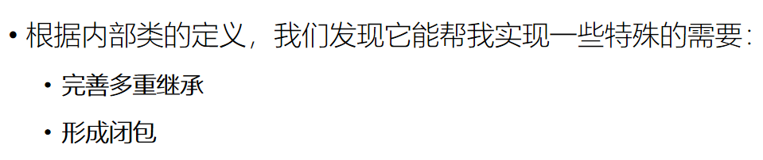

6.1 完善内类

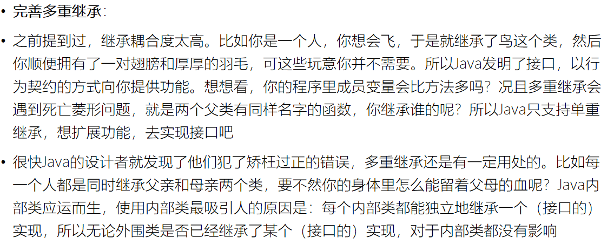

6.2 形成闭包

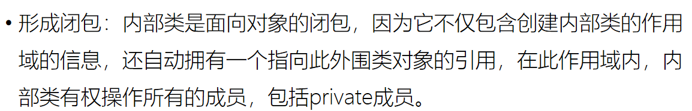

6.3内部类主要分为成员内部类、局部内部类、匿名内部类、静态内部类

6.3.1成员内部类

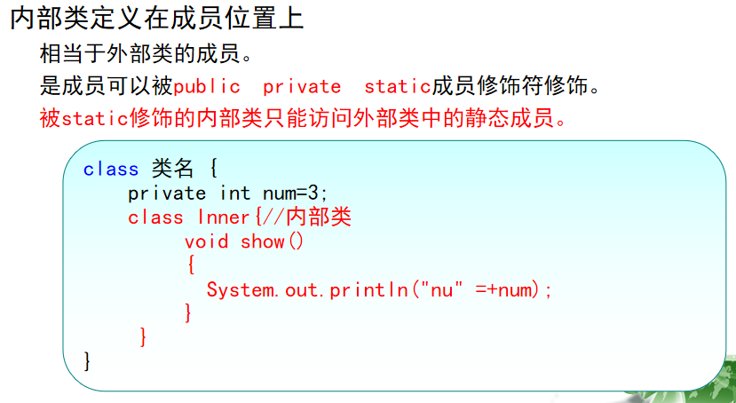

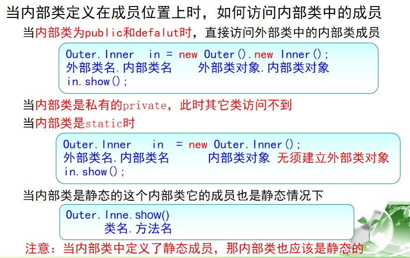

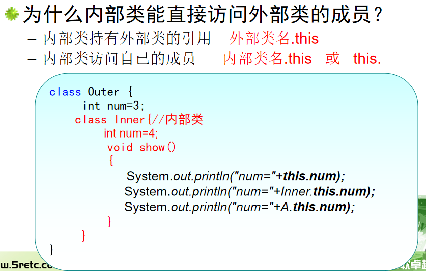

6.3.2 局部内部类

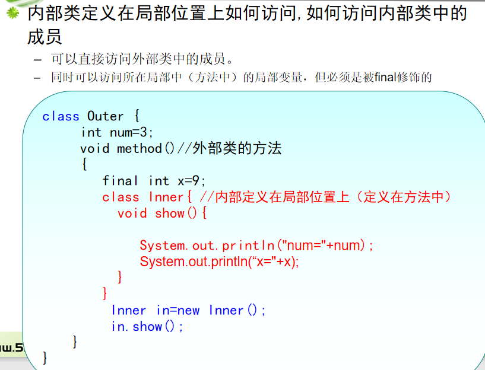

6.3.3 匿名内部类

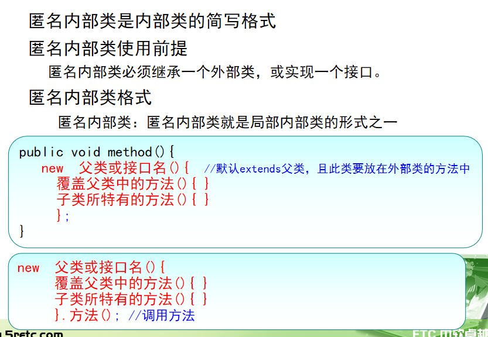

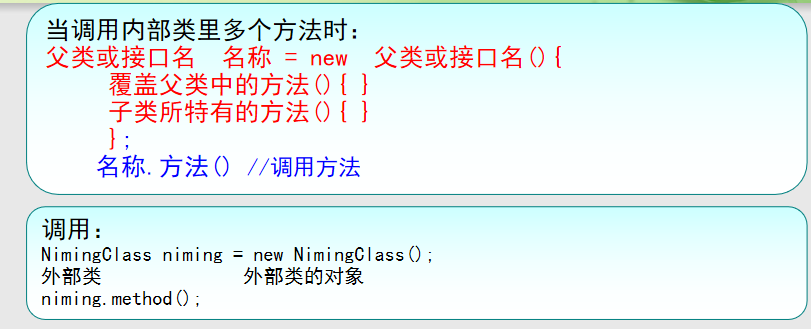

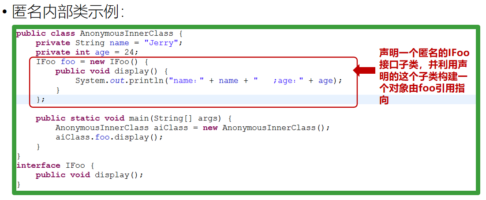

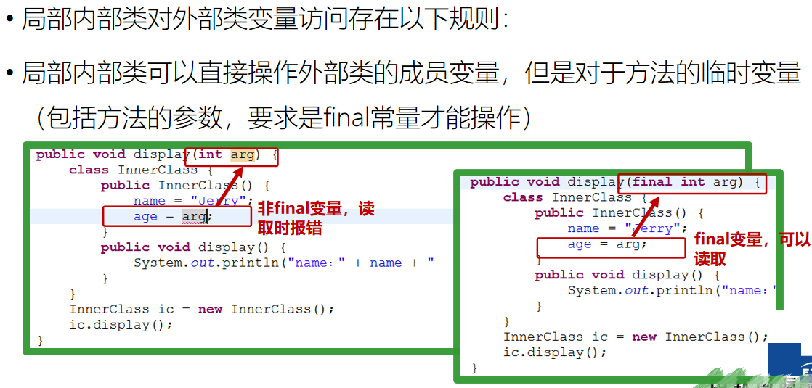

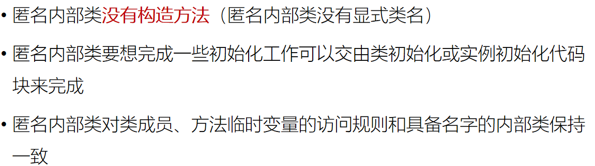

### 本节作业

1.  掌握静态内部类
2.  掌握动态内部类
3.  掌握匿名内部类
4.  掌握局部内部类
