# 第12天 常用类

## 主要内容

1、掌握Object类常用API的使用

2、掌握String类常用API的使用

3、熟练正则表达式初步

4、掌握StringBuffer和StringBuilder类常用API的使用

5、掌握基本类型对应的包装类的使用

6、掌握日期相关类常用API的使用（Date、DateFormat、Calendar）

7、掌握数字相关类常用API的使用(Math、Bigdecimal)

## 学习目标

| 节数    | 知识点                                                    | 要求 |
|---------|-----------------------------------------------------------|------|
| 第一节  | 掌握Object类常用API的使用                                 | 掌握 |
| 第二节  | 掌握String类常用API的使用                                 | 掌握 |
| 第三节  | 熟练正则表达式初步                                        | 掌握 |
| 第四节  | 掌握StringBuffer和StringBuilder类常用API的使用            | 掌握 |
| 第五节  | 掌握基本类型对应的包装类的使用                            | 掌握 |
| 第六节  | 掌握日期相关类常用API的使用（Date、DateFormat、Calendar） | 掌握 |
| 第七节  | 掌握数字相关类常用API的使用(Math、Bigdecimal)             | 掌握 |

## 掌握Object类常用API的使用

### 1.1Object类在Java类继承体系中的地位

Object类中定义了11个方法，任何类都默认拥有（包括数组），可以使用API文档查询；本章学习其中4个方法

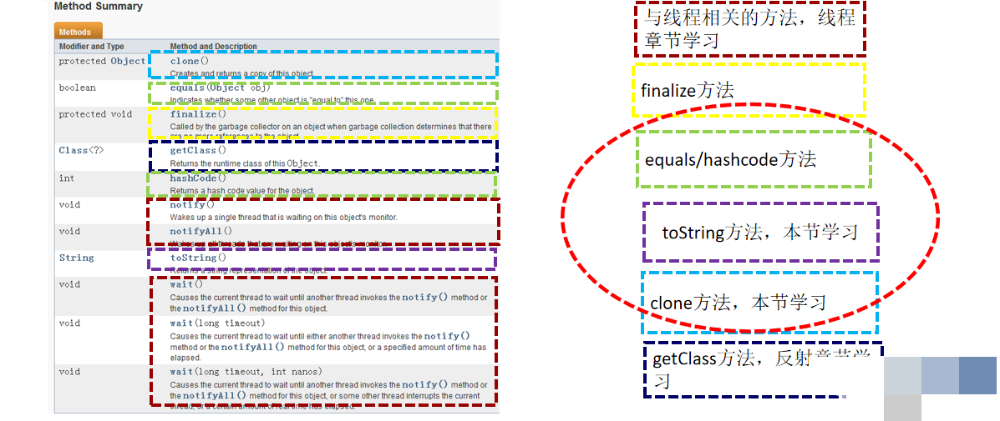

### 1.2 Object类中的equals、hashcode、finalize方法的具体使用

Object类中定义了equals方法【 public boolean equals(Object obj) 】，用来比较两个对象的虚地址，如果虚地址相同则返回true，否则返回false；

Object类中的equals方法的作用，与==相同，都是比较两个对象的虚地址；

很多类覆盖了equals方法，用来比较两个对象的属性值，如果属性值相同，则认为两个对象相等；例如，String类就覆盖了equlas方法，用来比较两个字符串的字符序列值

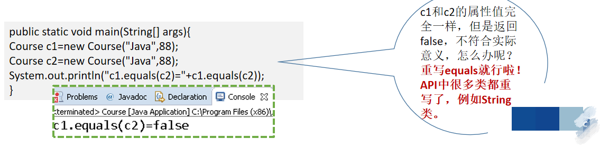

如果需要使用equals比较对象的属性值等，可以进行覆盖；

例如，覆盖Course类中的equals方法，使得课程的title值和price值相同时，表示两个课程对象相等，equals返回true；

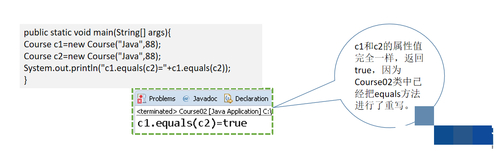

Object类中定义了hashCode方法【 public int hashCode() 】，用来返回对象的哈希码；

默认情况下【即没有重新hashCode方法时】，当两个引用的虚地址相同时，hashCode返回相同的值，否则返回不同的值；

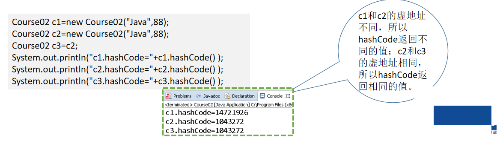

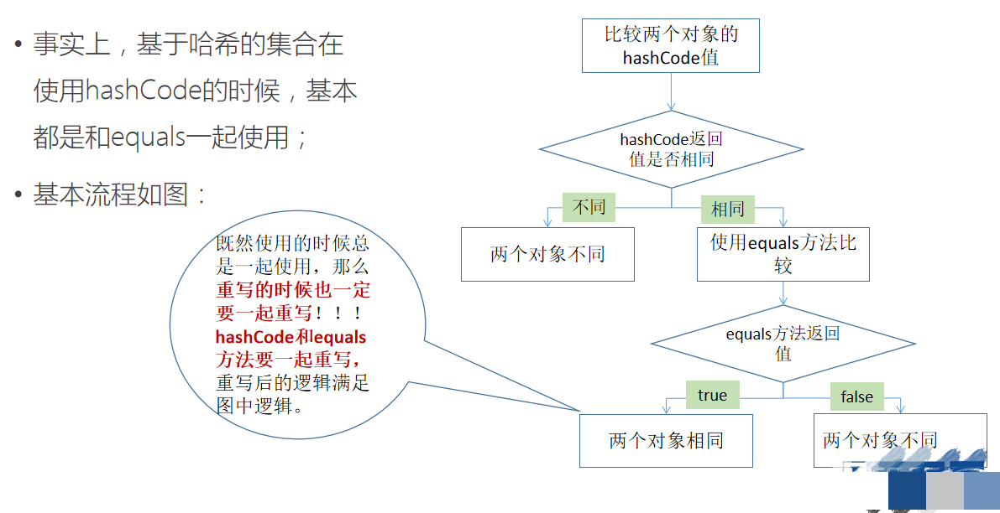

Java和C++不同，没有提供析构方法

Object中包含了一个叫做finalize()的方法，提供在对象被回收时调用以释放资源，默认情况下其不执行任何动作

由于Object是Java继承体系的根，因此事实上所有的Java类都具备finalize方法

当垃圾回收器确定了一个对象没有任何引用时，其会调用finalize()方法。但是，finalize方法并不保证调用时机，因此也不建议重写finalize()方法

如果必须要重写finalize()方法，请记住使用super.finalize()调用父类的清除方法，否则对象清理的过程可能不完整

每个对象只能被GC自动调用finalize( )方法一次。如果在finalize( )方法执行时产生异常（exception），则该对象仍可以被垃圾收集器收集

Java语言允许程序员为任何方法添加finalize( )方法，该方法会在垃圾收集器交换回收对象之前被调用。但不要过分依赖该方法对系统资源进行回收和再利用，因为该方法调用后的执行结果是不可预知的

当finalize( )方法尚未被调用时，System. runFinalization( )方法可以用来调用finalize( )方法，并实现相同的效果，对无用对象进行垃圾收集

## 掌握String类常用API的使用

### 2.1 字符串的常用方法的使用

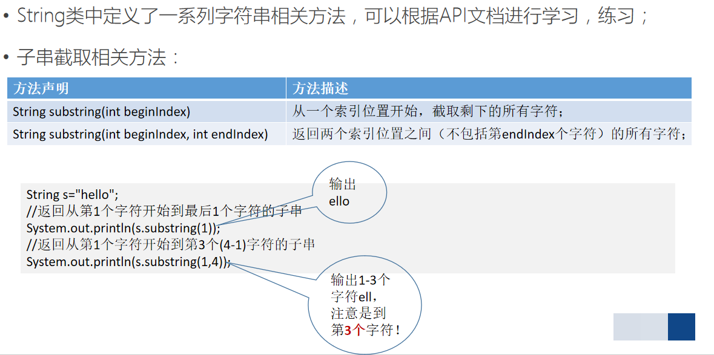

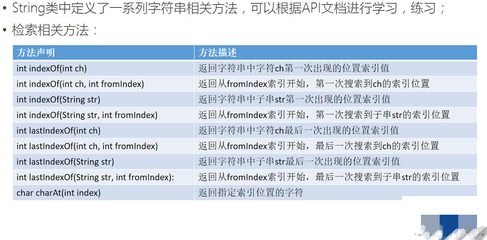

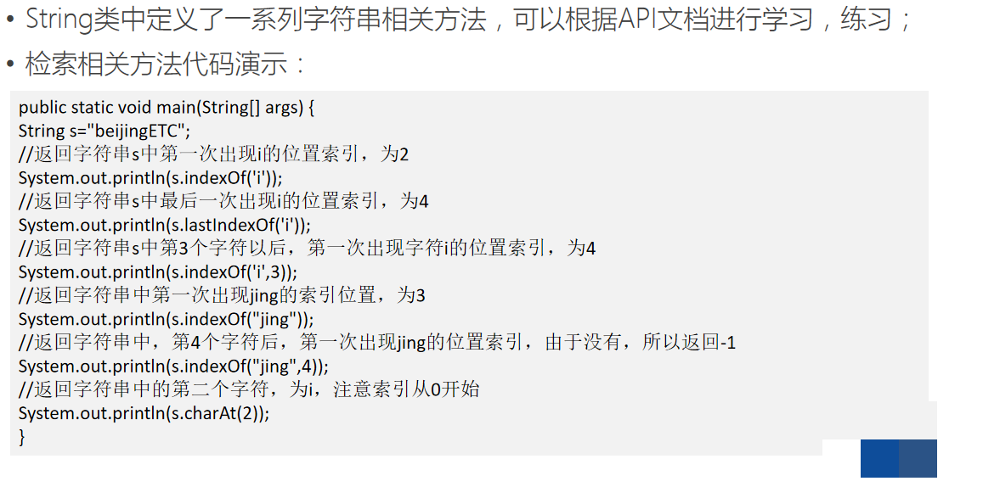

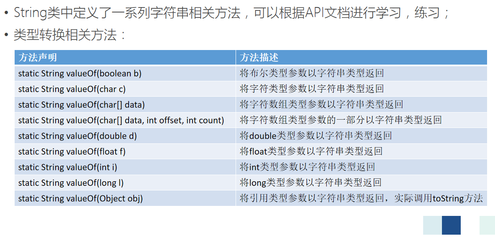

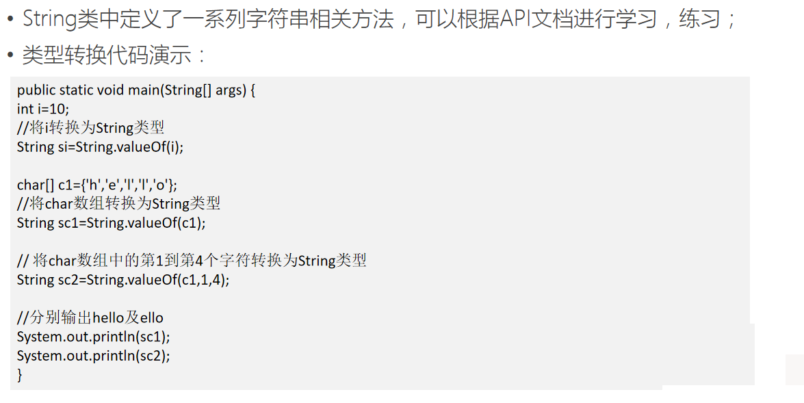

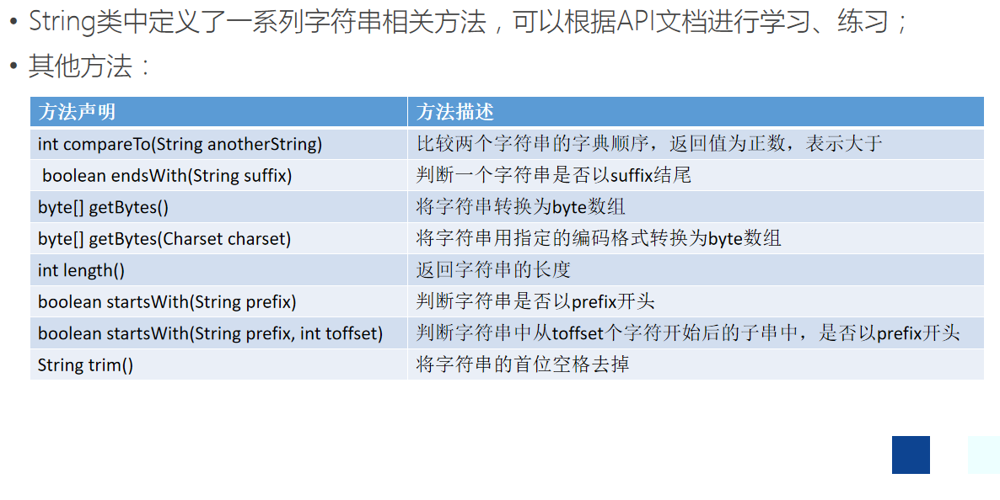

## 第三节 熟练正则表达式初步

### 3.1简介

在编写程序的时候，往往对某些字符串的规则有特定的逻辑要求；

例如，邮件地址，手机号码，身份证号码，都可能使用字符串表示，而这些字符串都有着自己的逻辑要求；

正则表达式（regular expression）就是用来描述字符串逻辑规则的工具；

正则表达式本身也是个字符串，不过这些字符串是使用系列“元字符”组成；

所谓“元字符”就是预先定义的，有特殊意义的字符；例如\\d用来匹配一个数字； \\w用来匹配字母或数字或下划线或汉字等；

很多语言多对正则表达式提供了支持，例如JavaScript、Java等；

不同语言中使用正则表达式时，正则表达式的具体编写规则会有些小的差别，但是大体相同；

匹配电子邮件地址的正则表达式：

\^([a-z0-9A-Z]+[-\|\\\\.]?)+[a-z0-9A-Z]@([a-z0-9A-Z]+(-[a-z0-9A-Z]+)?\\\\.)+[a-zA-Z]{2,}\$

匹配手机号码的正则表达式：

\^((13[0-9])\|(15[\^4])\|(18[0,2,3,5-9])\|(17[0-8])\|(147))\\\\d{8}\$

要使用正则表达式，首先要学会根据规则编写正则表达式；

### 3.2元字符

正则表达式由“元字符”组成，掌握了元字符的含义，就可以开始编写正则表达式

| **元字符** | **含义**                                                   |
|------------|------------------------------------------------------------|
| x          | 字符 x                                                     |
| \\\\       | 反斜线字符                                                 |
| \\0n       | 带有八进制值 0 的字符 n (0 \<= n \<= 7)                    |
| \\0nn      | 带有八进制值 0 的字符 nn (0 \<= n \<= 7)                   |
| \\0mnn     | 带有八进制值 0 的字符 mnn（0 \<= m \<= 3、0 \<= n \<= 7）  |
| \\xhh      | 带有十六进制值 0x 的字符 hh                                |
| \\uhhhh    | 带有十六进制值 0x 的字符 hhhh                              |
| \\t        | 新行（换行）符 ('\\u000A')                                 |
| \\r        | 回车符 ('\\u000D')                                         |
| \\f        | 换页符 ('\\u000C')                                         |
| \\a        | 报警 (bell) 符 ('\\u0007')                                 |

| **元字符**     | **含义**                                      |
|----------------|-----------------------------------------------|
| \\e            | 转义符 ('\\u001B')                            |
| \\cx           | 对应于 x 的控制符                             |
| [abc]          | a、b 或 c（简单类）                           |
| [\^abc]        | 任何字符，除了 a、b 或 c（否定）              |
| [a-zA-Z]       | a 到 z 或 A 到 Z，两头的字母包括在内（范围）  |
| [a-d[m-p]]     | a 到 d 或 m 到 p，等同于：[a-dm-p]（并集）    |
| [a-z&&[def]]   | d、e 或 f（交集）                             |
| [a-z&&[\^bc]]  | a 到 z，除了 b 和 c，等同于c：[ad-z]（减去）  |
| [a-z&&[\^m-p]] | a 到 z，而非 m 到 p，等同于：[a-lq-z]（减去） |
| .              | 任何字符（与行结束符可能匹配也可能不匹配）    |
| \\d            | 数字，等同于：[0-9]                           |
| \\D            | 非数字，等同于： [\^0-9]                      |
| \\s            | 空白字符，等同于：[ \\t\\n\\x0B\\f\\r]        |
| **元字符**     | **含义**                                      |
| \\S            | 非空白字符，等同于：[\^\\s]                   |
| \\w            | 单词字符，等同于：[a-zA-Z_0-9]                |
| \\W            | 非单词字符，等同于：[\^\\w]                   |
| \^             | 行的开头                                      |
| \$             | 行的结尾                                      |
| \\b            | 单词边界                                      |
| \\B            | 非单词边界                                    |
| \\A            | 输入的开头                                    |
| \\G            | 上一个匹配的结尾                              |
| \\Z            | 输入的结尾，仅用于最后的结束符（如果有的话）  |
| \\z            | 输入的结尾                                    |

### 3.3常用量词

常用量词

正则表达式中往往需要对一些字符出现的次数进行规定，则需要量词；

量词有不同的策略，Java中有三种策略，此处列出的是Greedy策略；

| **元字符** | **含义**                      |
|------------|-------------------------------|
| X?         | X，一次或一次也没有           |
| X\*        | X，零次或多次                 |
| X+         | X，一次或多次                 |
| X{n}       | X，恰好 n 次                  |
| X{n,}      | X，至少 n 次                  |
| X{n,m}     | X，至少 n 次，但是不超过 m 次 |

## 第四节 掌握StringBuffer和StringBuilder类常用API的使用

### 4.1 StringBuffer、StringBuilder之间的差异与适用场景

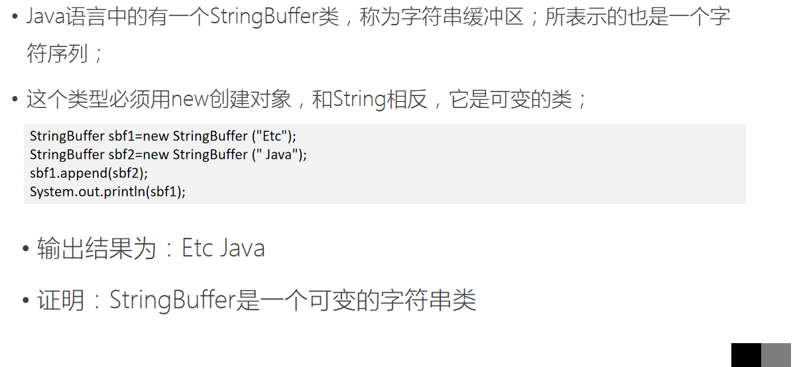

Java语言中的还有一个StringBuilder类，与StringBuffer兼容，但是不保证线程同步；

多线程编程在后续章节学习，此处只记住这个特征即可；

三个类的区别

String类是不可变的，对象一旦被创建，就不能被修改；可以使用=直接赋值，此时使用常量池；也可以使用new创建，不使用常量池；

StringBuffer是可变的，对象创建后，可以修改；必须使用new关键字；

StringBuilder是不同步的，在单线程情况下使用比StringBuffer高效；必须使用new关键字；

## 第五节 掌握基本类型对应的包装类的使用

### 5.1 Java中的包装类型

Java语言中有8个基本数据类型，对应有8个类，这8个类统称包装器类型（Wrapper类）；

使用这8个包装器类，能够把某一种基本数据类型的变量转换成引用类型，从而使用类中的方法，进行更多的操作。

Java语言中的8个包装器类型如下所示；

| **类型**     | **字节型** | **短整型** | **整型** | **长整型** | **单精度** **浮点型** | **双精度** **浮点型** | **字符型** | **布尔型** |
|--------------|------------|------------|----------|------------|-----------------------|-----------------------|------------|------------|
| 基本数据类型 | byte       | short      | int      | long       | float                 | double                | char       | boolean    |
| 包装器类型   | Byte       | Short      | Integer  | Long       | Float                 | Double                | Character  | Boolean    |

除了整型及字符型外，其他的包装器类型名字都是将基本数据类型首字母变大写即可；

以Integer类为例，可以把int类型转换成Integer引用类型；

| int i=10; Integer io=new Integer(i); |
|--------------------------------------|

接下来就可以调用Integer类中的方法，例如：

| double d=io.doubleValue(); |
|----------------------------|

上述代码中调用了Integer类中的doubleValue方法，返回一个double类型的数值；

## 第六节 掌握日期相关类常用API的使用（Date、DateFormat、Calendar）

### 6.1Date类的概述:

类 Date 表示特定的瞬间，精确到毫秒。

毫秒概念: 1000毫秒=1秒  
毫秒的0点: 时间原点; 公元1970年1月1日,午夜0:00:00 英国格林威治 毫秒值就是0

### 6.2常用方法

Date类的构造方法:

/\*  
 \* Date类空参数构造方法  
 \* 获取到的是,当前操作系统中的时间和日期  
 \*/  
public static void function(){  
Date date = new Date();  
System.out.println(date);  
}  
  
/\*  
 \* Date类的long参数的构造方法  
 \* Date(long ) 表示毫秒值  
 \* 传递毫秒值,将毫秒值转成对应的日期对象  
 \*/  
public static void function_1(){  
Date date = new Date(0);  
System.out.println(date);  
}  

Date类的常用方法:

/\*  
 \* Date类方法 getTime() 返回值long  
 \* 返回的是毫秒值  
 \* 将Date表示的日期,转成毫秒值  
 \* 日期和毫秒值转换  
 \*/  
public static void function_2(){  
Date date = new Date();  
long time = date.getTime();  
System.out.println(time);  
}  
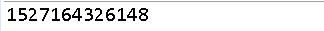  
/\*  
 \* Date类方法 setTime(long )传递毫秒值  
 \* 将日期对象,设置到指定毫秒值上  
 \* 毫秒值转成日期对象  
 \* Date的构造方法  
 \*/  
public static void function_3(){  
Date date = new Date();  
System.out.println(date);  
  
date.setTime(0);  
System.out.println(date);  
}  

### 6.3 SimpleDateFormat类实现日期和字符串的相互转换

SimpleDateFormat: 可以把一个日期对象格式化成一个文本(字符串) , 也可以把一个日期字符串解析成一个日期对象

构造方法:

public SimpleDateFormat():使用默认的模式来创建一个SimpleDateFormat对象

public SimpleDateFormat(String pattern):使用指定的模式（规则比如yyyy:MM:dd HH:mm:ss）来创建一个SimpleDateFormat对象

规则的定义

y 年  
M 月  
d 天  
H 时  
m 分  
s 秒

成员方法:

public String format(Date date): 把一个日期对象格式化成一个字符串  
public Date parse(String dateStr): 把一个日期字符串解析成一个日期对象 注意要以指定格式解析

案例一：

import java.text.SimpleDateFormat;

import java.util.Date;

public class MyTest {

public static void main(String[] args) {

Date date = new Date();

System.out.println(date.toString());

//格式化日期的类型

//使用空参创建SimpleDateFormat创建对象，那么使用的是默认的格式来格式化日期 19-5-2 上午10:56

SimpleDateFormat format = new SimpleDateFormat();

//格式化日期，返回的是格式化后的日期字符串

String format1 = format.format(date);

System.out.println(format1);

//我们可以指定格式来格式化日期

//规则的定义

//

//y 年

//M 月

//d 天

//H 时

//m 分

//s 秒

//E 星期几

SimpleDateFormat format2 = new SimpleDateFormat("yyyy-MM-dd HH:mm:ss E w W F");

String format3 = format2.format(date);

System.out.println(format3);

//Mon May 20 17:46:28 GMT+08:00 2019

//19-5-20 下午5:46

//2019-05-20 17:46:28 星期一 21 4 3

}

}

案例二：

import java.text.ParseException;

import java.text.SimpleDateFormat;

import java.util.Date;

public class MyTest2 {

public static void main(String[] args) throws ParseException {

String timeStr = "2018-01-01 15:30:30"; //Date

//注意解析时：日期字符串和SimpleDateFormat("yyyy-MM-dd HH:mm:ss");它里面的格式要对应，否则解析失败

SimpleDateFormat format = new SimpleDateFormat("yyyy-MM-dd HH:mm:ss");

Date date = format.parse(timeStr);

System.out.println(date); //Mon Jan 01 15:30:30 GMT+08:00 2018

}

}

日期工具类的编写和测试案例

案例一：

import java.text.ParseException;

import java.text.SimpleDateFormat;

import java.util.Date;

public class DateUtils {

//私有化构造

private DateUtils() {

}

//提供格式化好的日期字符串

public static String getDateString(String fomat) {

Date date = new Date();

SimpleDateFormat format = new SimpleDateFormat(fomat);

String dateStr = format.format(date);

return dateStr;

}

//提供返回Date 对象的方法

public static Date getDate(String dateStr, String format) throws ParseException {

SimpleDateFormat format1 = new SimpleDateFormat(format);

Date date = format1.parse(dateStr);

return date;

}

}

import java.text.ParseException;

import java.util.Date;

public class MyTest {

public static void main(String[] args) throws ParseException {

String string = DateUtils.getDateString("yyyy-MM-dd");

System.out.println(string);

String dateStr="2019-01-01 13:10:10";

Date date = DateUtils.getDate(dateStr, "yyyy-MM-dd HH:mm:ss");

System.out.println(date);

}

}

案例二：  
算一下你来到这个世界多少天?

a: 键盘录入一个生日(日期字符串)

b: 把这个日期字符串对象解析成一个日期对象

c: 获取b中的日期对象对应的毫秒值

d: 获取当前系统时间对应的毫秒值

e: 使用d中的毫秒值 - c中的毫秒值

f: 把e中的差值换算成对应的天 差值/1000/60/60/24

g: 输出

import java.text.ParseException;

import java.text.SimpleDateFormat;

import java.util.Date;

import java.util.Scanner;

public class MyTest2 {

public static void main(String[] args) throws ParseException {

//思路：先获取出你生日那天的毫秒值，再获取现在的毫秒值 两个相减差值换算成天数

Scanner sc = new Scanner(System.in);

System.out.println("请输入你的生日 格式 例如 1990-01-01");

String dateStr = sc.nextLine();

Date date = DateUtils.getDate(dateStr, "yyyy-MM-dd");

long time = date.getTime();

//long time = new SimpleDateFormat("yyyy-MM-dd").parse(dateStr).getTime();

//获取现在的毫秒值

long now = System.currentTimeMillis();

long num=now-time;

System.out.println("你来到这个世界"+(num/1000/60/60/24/365)+"年");

}

}

案例三：

import java.time.LocalDate;

import java.time.Period;

public class MyTest3 {

public static void main(String[] args) {

//JDK1.8 之后，提供了一套全新的时间日期API 也推荐你使用JDK1.8所提供的

//_常见对象(你来到这个世界多少天案例) (掌握)

LocalDate start = LocalDate.of(1998, 5, 13);

LocalDate now = LocalDate.now();

//算出两个日期的间隔

Period between = Period.between(start, now);

int years = between.getYears();

int months = between.getMonths();

int days = between.getDays();

System.out.println("你现在"+years+"岁 零"+months+"月 零"+days+"天");

}

}

**6.4** Calendar 类是一个抽象类，不能直接new对象，可以通过他的一个静态成员方法getInstance()来获取他的对象  
它为特定瞬间与一组诸如 YEAR、MONTH、DAY_OF_MONTH、HOUR  
等日历字段之间的转换提供了一些方法，并为操作日历字段（例如获得下星期的日期）提供了一些方法。  
B:成员方法  
public static Calendar getInstance() 使用默认时区和语言环境获得一个日历对象  
public int get(int field) 获得给定日历字段对应的值 field通过Calendar提供的字段来拿

## 第七节 掌握数字相关类常用API的使用(Math、Bigdecimal)

### 7.1 使用Math类提供的各类数学方法

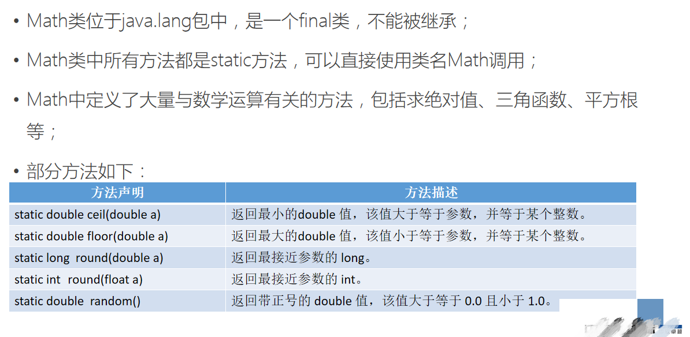

### 7.2使用BigDecimal、BigInteger工具进行超出Java基本数据类型范围的数字之间的数学运算、比较运算、位运算

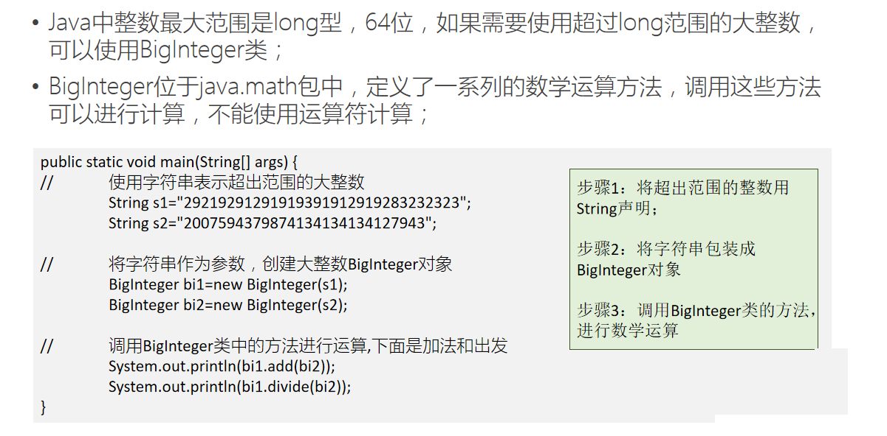

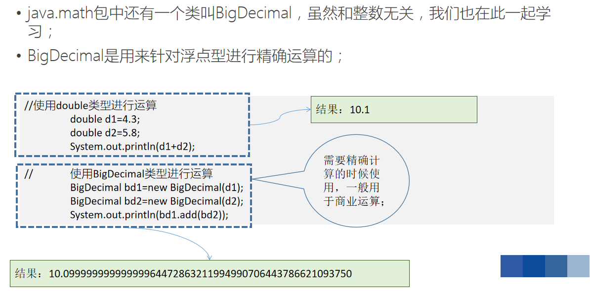
