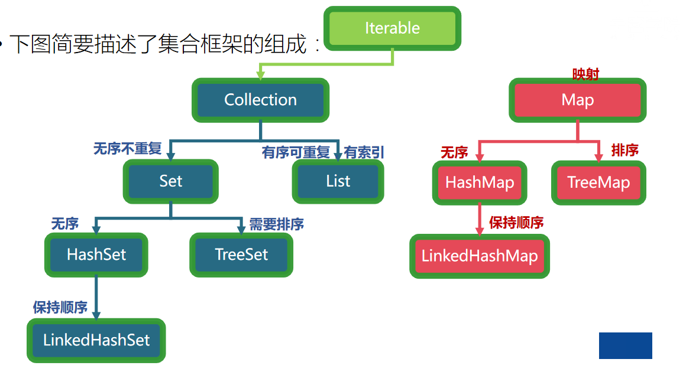
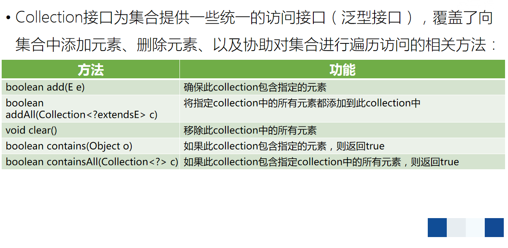
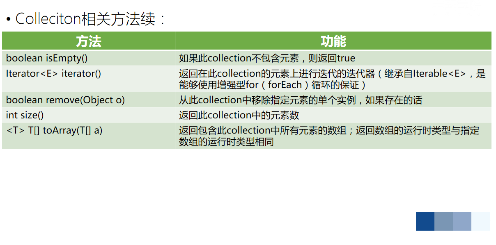
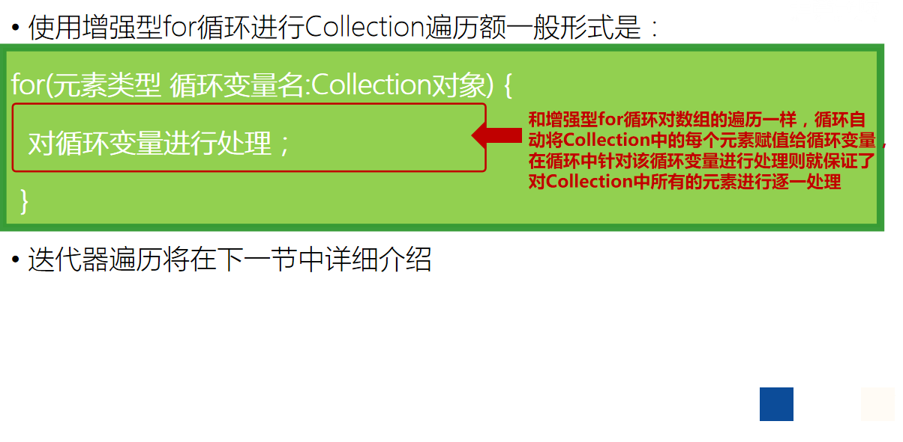
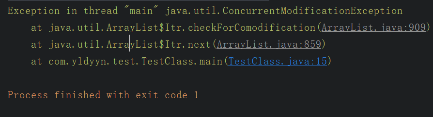
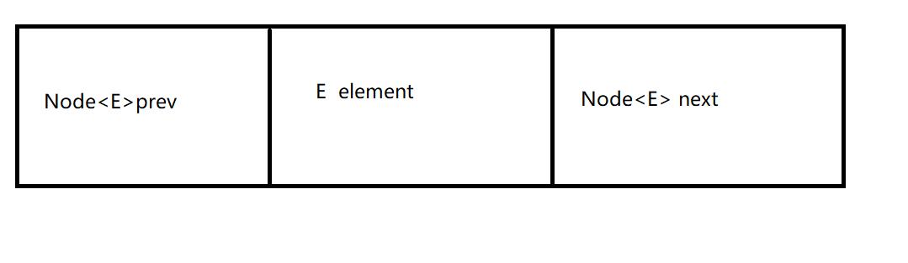
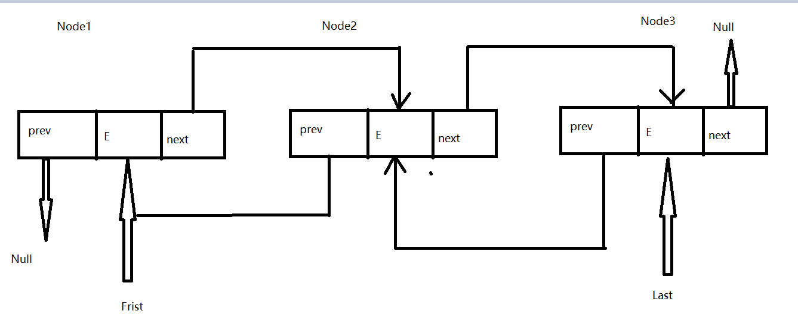
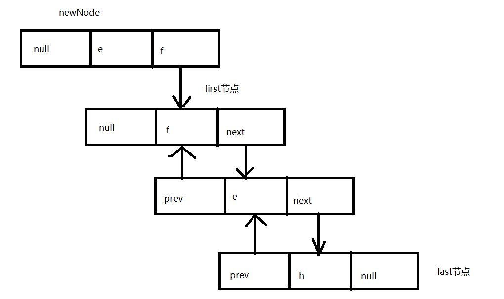
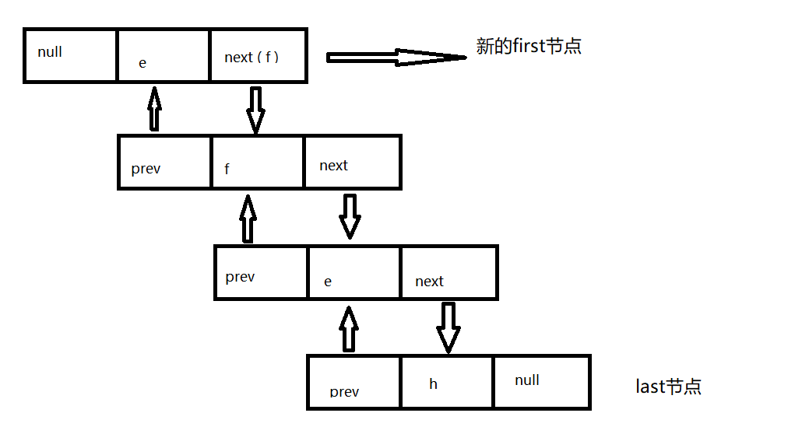
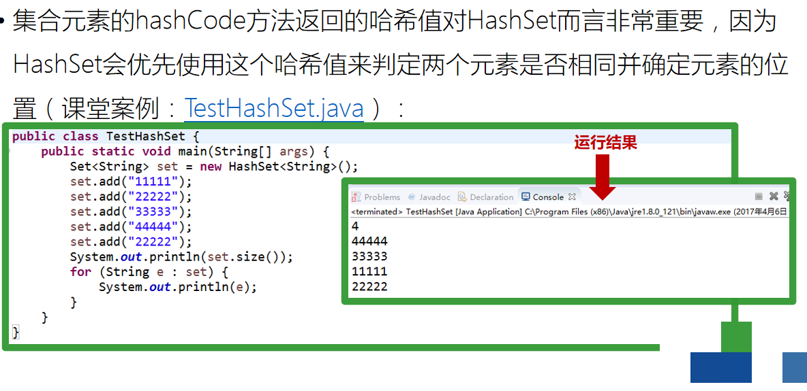

# 第14天 集合

## 主要内容

1、掌握Collection接口

1、掌握Iterator接口

2、掌握List接口-ArrayList实现类

3、掌握List接口-LinkedList实现类

4、掌握Set接口-哈希表

## 学习目标

| 节数    | 知识点                        | 要求 |
|---------|-------------------------------|------|
| 第一节  | 掌握Collection接口            | 掌握 |
| 第二节  | 掌握Iterator接口              | 掌握 |
| 第三节  | 掌握List接口-ArrayList实现类  | 掌握 |
| 第四节  | 掌握List接口-LinkedList实现类 | 掌握 |
| 第五节  | 掌握Set接口-哈希表            | 掌握 |

## 掌握Collection接口

### 1.1 Collection

Collection接口是最基本的集合接口，它不提供直接的实现，JavaSDK提供的类都是继承自Collection的“子接口”如List和Set。Collection所代表的是一种规则，它所包含的元素都必须遵循一条或者多条规则。如有些允许重复而有些则不能重复、有些必须要按照顺序插入而有些则是散列，有些支持排序但是有些则不支持

在Java中所有实现了Collection接口的类都应该提供两套标准的构造函数，一个是无参，用于创建一个空的Collection，一个是带有Collection参数的有参构造函数，用于创建一个新的Collection，这个新的Collection与传入进来的Collection具备相同的元素

### 1.2 Collection重要方法

### 1.3 Collection的遍历

集合的通用遍历方法有以下几种：

使用增强型for(forEach循环)遍历

使用迭代器遍历

## 第二节 掌握Iterator接口

### 2.1迭代器 Iterator 是什么？

Iterator 接口提供遍历任何 Collection 的接口。我们可以从一个 Collection 中使用迭代器方法来获取迭代器实例。迭代器取代了 Java 集合框架中的 Enumeration，迭代器允许调用者在迭代过程中移除元素。

### 2.2 Iterator 怎么使用？有什么特点？

Iterator 使用代码如下：

List\<String\> list = new ArrayList\<\>();

Iterator\<String\> it = list. iterator();

while(it. hasNext()){

String obj = it. next();

System. out. println(obj);

}

Iterator 的特点是只能单向遍历，但是更加安全，因为它可以确保，在当前遍历的集合元素被更改的时候，就会抛出 ConcurrentModificationException 异常。

### 2.3如何边遍历边移除 Collection 中的元素？

边遍历边修改 Collection 的唯一正确方式是使用 Iterator.remove() 方法，如下：

Iterator\<Integer\> it = list.iterator();while(it.hasNext()){

\*// do something\*

it.remove();}

一种最常见的错误代码如下：

for(Integer i : list){

list.remove(i)}

运行以上错误代码会报 ConcurrentModificationException 异常。这是因为当使用 foreach(for(Integer i : list)) 语句时，会自动生成一个iterator 来遍历该 list，但同时该 list 正在被 Iterator.remove() 修改。Java 一般不允许一个线程在遍历 Collection 时另一个线程修改它。

### 2.4 Iterator 和 ListIterator 有什么区别？

Iterator 可以遍历 Set 和 List 集合，而 ListIterator 只能遍历 List。

Iterator 只能单向遍历，而 ListIterator 可以双向遍历（向前/后遍历）。

ListIterator 实现 Iterator 接口，然后添加了一些额外的功能，比如添加一个元素、替换一个元素、获取前面或后面元素的索引位置。

## 第三节 掌握List接口-ArrayList实现类

ArrayList类继承自AbstractList。

其中，ArrayList有三个构造器，一个接受int类型的参数，一个接收集合参数，最后一个是默认构造器。

ArrayList类定义了两个属性

private transient Object[] elementData;

private int size;

接收int类型的参数:

public ArrayList(int initialCapacity) {

super(); //调用父类AbstractList的默认构造方法

if (initialCapacity \< 0)

throw new IllegalArgumentException("Illegal Capacity: "+

initialCapacity);

this.elementData = new Object[initialCapacity];

}

/\*\*\*\*\*\*\*\*\*\*父类AcstractList构造方法\*\*\*\*\*\*\*\*\*\*\*\*\*\*/

protected AbstractList() {

}

接收一个集合参数:

这里使用的泛型，不了解泛型的，可以参考《java编程思想》

public ArrayList(Collection\<? extends E\> c) {

elementData = c.toArray();

size = elementData.length;

// c.toArray might (incorrectly) not return Object[] (see 6260652) //可能转换不成功

if (elementData.getClass() != Object[].class)

elementData = Arrays.copyOf(elementData, size, Object[].class);

}

最后一个，默认的构造函数:

public ArrayList() {

this(10); //如果使用默认的构造函数，就给你初始化十个

}

## 第四节 掌握List接口-LinkedList实现类

List是在面试中经常会问的一点，在我们面试中知道的仅仅是List是单列集合Collection下的一个实现类，  
List的实现接口又有几个，一个是ArrayList，还有一个是LinkedList，还有Vector。这次我们就来看看这三个类的源码。

ArrayList

ArrayList是我们在开发中最常用的数据存储容器，它的底层是通过数组来实现的。我们在集合里面可以存储任何类型的数据，  
而且他是一个顺序容器，存放的数据顺序就是和我们放入的顺序是一致的，而且他还允许我们放入null元素，我们可以画个图理解一下。

这个图可能不是很正确，里面存放的元素的引用，所以我用了个000x，大致了解一下就行，一个伪图。

这样的话我们来看看源码分析

源码分析

/\*\*

\* Default initial capacity.

\* 默认初始容量

\*/

private static final int DEFAULT_CAPACITY = 10;

/\*\*

\* Shared empty array instance used for empty instances.

\* 如果是数组刚初始化就会用这个空数组替代它，这是自定义容量为0的时候。

\*/

private static final Object[] EMPTY_ELEMENTDATA = {};

/\*\*

\* 未自定义容量 数组刚初始化就会用这个空数组替代它

\*/

private static final Object[] DEFAULTCAPACITY_EMPTY_ELEMENTDATA = {};

/\*\*

\* 这个elementDate就是底层使用的数组

\*/

transient Object[] elementData; // non-private to simplify nested class access

/\*\*

\* 实际ArrayList集合大小 也就是实际元素的个数

\*/

private int size;

DEFAULT_CAPACITY 这是默认的初始容量，容量是10.  
EMPTY_ELEMENTDATA 这代表的是一个空的数组，初始化数组。  
DEFAULTCAPACITY_EMPTY_ELEMENTDATA 这个是区别上边的那个自定义容量为0的时候的空数组。

有些看源码的就会发现为什么初始容量为10，有会出现一堆什么空数组容量为0的呢？  
这就得接下来看一下他的构造了

看这里

构造

/\*\*

\* Constructs an empty list with an initial capacity of ten.

\* 这个地方就会构造一个初始容量为10的数组

\*/

public ArrayList() {

this.elementData = DEFAULTCAPACITY_EMPTY_ELEMENTDATA;

}

注释的意思是构造一个初始容量为10的数组，但是构造函数只是给elementDate赋值了一个空数组，其实就是在我们添加元素的时候，容量自动扩充为10.

我们在看看构造具有指定初始容量的空列表。

public ArrayList(int initialCapacity) {

if (initialCapacity \> 0) {

this.elementData = new Object[initialCapacity];

} else if (initialCapacity == 0) {

this.elementData = EMPTY_ELEMENTDATA;

} else {

throw new IllegalArgumentException("Illegal Capacity: "+

initialCapacity);

}

}

从以上的源码我们能够看出来，如果是使用无参构造时，是把DEFAULTCAPACITY_EMPTY_ELEMENTDATA 给了elementDate  
，当initialCapacity为0的时候，就把EMPTY_ELEMENTDATA赋值给了elementDate，如果initialCapacity大于0，就会初始化一个initialCapacity长度的数组给elementDate。

这上边的就是我们如果给定初始容量的时候他会在底层干的事情

至于使用方法，add，get这些方法就不仔细的去说了，都能看懂。我们主要来说他的迭代器  
也就是inertor。

使用过ArrayList的人一般都知道，在执行for循环的时候一般情况是不会去执行remove的操作的，因为remove的操作会改变这个集合的大小，  
所以会有可能出现数组角标越界异常，我们可以试一下。  
看图

下面则是他出现异常的代码

foreach循环在我们的印象中不就是inertor么？但是他就是会出现异常，所以我们得继续看源码介绍

public Iterator\<E\> iterator() {

return new Itr();

直接返回的Itr这个对象，我们看一下。

}

private class Itr implements Iterator\<E\> {

int cursor; // index of next element to return

int lastRet = -1; // index of last element returned; -1 if no such

int expectedModCount = modCount;

Itr() {}

public boolean hasNext() {

return cursor != size;

}

@SuppressWarnings("unchecked")

public E next() {

checkForComodification();

int i = cursor;

if (i \>= size)

throw new NoSuchElementException();

Object[] elementData = ArrayList.this.elementData;

if (i \>= elementData.length)

throw new ConcurrentModificationException();

cursor = i + 1;

return (E) elementData[lastRet = i];

}

public void remove() {

if (lastRet \< 0)

throw new IllegalStateException();

checkForComodification();

try {

ArrayList.this.remove(lastRet);

cursor = lastRet;

lastRet = -1;

expectedModCount = modCount;

} catch (IndexOutOfBoundsException ex) {

throw new ConcurrentModificationException();

}

}

@Override

@SuppressWarnings("unchecked")

public void forEachRemaining(Consumer\<? super E\> consumer) {

Objects.requireNonNull(consumer);

final int size = ArrayList.this.size;

int i = cursor;

if (i \>= size) {

return;

}

final Object[] elementData = ArrayList.this.elementData;

if (i \>= elementData.length) {

throw new ConcurrentModificationException();

}

while (i != size && modCount == expectedModCount) {

consumer.accept((E) elementData[i++]);

}

// update once at end of iteration to reduce heap write traffic

cursor = i;

lastRet = i - 1;

checkForComodification();

}

final void checkForComodification() {

if (modCount != expectedModCount)

throw new ConcurrentModificationException();

}

}

在这个方法内部next是最主要的一个方法，他首先去判断了expectedModCount和modCount是否一样，然后去看cursor，是不是超过  
集合的大小和数组的长度，然后去吧cursor的值给lastRet，返回的是下标lastRet的元素，最后cursor加1，这样就是说没调用一次next方法，  
cursor和lastRet都会加1。

当我们在调用remove方法的时候，他会去判断lastRet是否小于0，然后去判断expectedModCount和modCount是否一样，然后他去调用ArrayList.remove()方法  
去删除下标是lastRet的元素，然后把lastRet赋值给cursor，然后初始化lastRet = -1 ，最后把modCount重新赋值给expectedModCount。

这个关键的地方来了，remove方法对modCount进行了修改，这个时候expectedModCount和modCount是不一致的，这时候就会出现图中出现的那个异常了。  
ConcurrentModificationException异常，而这个异常就是出自ArrayList中的内部类Itr中的checkForComodification方法。

不光是remove这个方法会出现这个，如果你使用add方法的时候也是会出现这个异常的，原理都是一样的都是因为modCount和expectedModCount不相等导致的原因。

ArrayList的结构看完了我们在来看看同样是List的实现类中的LinkedList把

LinkedList

首先啊，这个LinkedList它和ArrayList这数据结构是完全不一样的，ArrayList底层我们已经看过了是数组的结构，而LinkedList的底层则是链表的结构，  
它可以进行高效的插入和移除的操作，他基于的是一个双向链表的结构，我们画个图理解一下。

LinkedList的Node节点结构

就和图中画的一样LinkedList是由很多个这样的节点组成的

prev是存储的上一个节点的引用。

element是存储的具体的内容。

next是存储的下一个节点的引用。

正是因为了这很多个节点，他存放着上一个和下一个节点的引用，就形成了有序的一个链表，就个铁链类似的那种，而且再加上它存的是前后两个节点的引用全部都保存起来，  
所以从前往后和从后往前都能增删改查数据，所以他是个双向的链表。

我们再看看他的整体结构。

LinkedList的整体结构图

我们从图解中也能看出点东西来，他有好多的Node，并且还有first和last这两个变量保存头部和尾部节点的信息

还有就是他不是一个循环的双向链表，因为他前后都是null，这个也是我们需要注意的地方

图解看完了，我们看看他的源码解析把。

源码分析

1.变量

/\*\*

\* 集合元素的数量

\*/

transient int size = 0;

/\*\*

\* Pointer to first node.

\* Invariant: (first == null && last == null) \|\|

\* (first.prev == null && first.item != null)

\* 指向第一个节点的指针

\*/

transient Node\<E\> first;

/\*\*

\* Pointer to last node.

\* Invariant: (first == null && last == null) \|\|

\* (last.next == null && last.item != null)

\* 指向最后一个节点的指针

\*/

transient Node\<E\> last;

构造方法

/\*\*

\* Constructs an empty list.

\* 无参构造

\*/

public LinkedList() {

}

/\*\*

\* Constructs a list containing the elements of the specified

\* collection, in the order they are returned by the collection's

\* iterator.

\* 将集合C中的所有的元素都插入到链表中

\* @param c the collection whose elements are to be placed into this list

\* @throws NullPointerException if the specified collection is null

\*/

public LinkedList(Collection\<? extends E\> c) {

this();

addAll(c);

}

接下来我们在看看node节点

Node节点

private static class Node\<E\> {

//值

E item;

//后继 指向下一个的引用

Node\<E\> next;

//前驱 指向前一个的引用

Node\<E\> prev;

Node(Node\<E\> prev, E element, Node\<E\> next) {

this.item = element;

this.next = next;

this.prev = prev;

}

}

看到这个Node节点，我们就能看出来在图中的意思了，也证明了他是个双向的链表、

添加元素

/\*\*

\* 将集合插入到链表的尾部

\*/

public boolean addAll(Collection\<? extends E\> c) {

return addAll(size, c);

}

public boolean addAll(int index, Collection\<? extends E\> c) {

checkPositionIndex(index);

//获取目标集合转为数组

Object[] a = c.toArray();

//新增元素的数量

int numNew = a.length;

//如果新增元素为0，则不添加，并且返回false

if (numNew == 0)

return false;

//定义index节点的前置节点，后置节点

Node\<E\> pred, succ;

//判断是不是链表的尾部，如果是，那么就在链表尾部追加数据

//尾部的后置节点一定是null，前置节点是队尾

if (index == size) {

succ = null;

pred = last;

} else {

//如果不是在链表的末尾而是在中间位置的话，

//取出index节点，作为后继节点

succ = node(index);

//index节点的前节点，作为前驱的节点

pred = succ.prev;

}

//链表批量的增加，去循环遍历原数组，依次去 插入节点的操作

for (Object o : a) {

@SuppressWarnings("unchecked")

//类型转换

E e = (E) o;

// 前置节点为pred，后置节点为null，当前节点值为e的节点newNode

Node\<E\> newNode = new Node\<\>(pred, e, null);

// 如果前置节点为空， 则newNode为头节点，否则为pred的next节点

if (pred == null)

first = newNode;

else

pred.next = newNode;

pred = newNode;

}

// 循环结束后，如果后置节点是null，说明此时是在队尾追加的

if (succ == null) {

last = pred;

} else {

//否则是在队中插入的节点 ，更新前置节点 后置节点

pred.next = succ;

succ.prev = pred;

}

// 修改数量size

size += numNew;

//修改modCount

modCount++;

return true;

}

看完这个addAll方法之后我们再看看其他的添加元素的方法，分为了头部addFist和尾部addLast。

addFist(E e)

将e元素添加到链表并且设置其为头节点Fist

看看代码中的实现方式

public void addFirst(E e) {

linkFirst(e);

}

/\*\*

\* Links e as first element.

\* 将e元素弄成链接列表的第一个元素

\*/

private void linkFirst(E e) {

final Node\<E\> f = first;

//链表开头前驱为空，值为e，后继为f

final Node\<E\> newNode = new Node\<\>(null, e, f);

first = newNode;

//若f为空，则表明列表中还没有元素，last也应该指向newNode

if (f == null)

last = newNode;

else

//否则，前first的前驱指向newNode

f.prev = newNode;

size++;

modCount++;

}

详细步骤如下：

拿到first节点设置为f；

新创建一个newNode设置为next节点为f节点；

然后把newNode赋值给这个first

如果f为空，则说明列表中没有元素，last指向newNode，否则，前first的前驱指向newNode；

这是代码的意思，我们可以通过一个图来看一下这实现：

下面我们再看看这个addLast(E e)

就是将元素E添加到链表，并且设置为尾部的节点next；

public void addLast(E e) {

linkLast(e);

}

/\*\*

\* Links e as last element.

\*将e元素弄成链接列表的last元素

\*/

void linkLast(E e) {

final Node\<E\> l = last;

// 前驱为前last，值为e，后继为null

final Node\<E\> newNode = new Node\<\>(l, e, null);

last = newNode;

//最后一个节点为空，说明列表中无元素

if (l == null)

//first同样指向此节点

first = newNode;

else

//否则，前last的后继指向当前节点

l.next = newNode;

size++;

modCount++;

}

其实过程都差不多，不仔细的去详细讲解了

我们再看看线程安全性问题，ArrayList和LinkedList都是线程不安全的，因为，他内部的方法都没有进行方法同步，或者说是加锁，  
这个时候就出了一个我们不经常用的Vector，

Vector

Vector是一个可实现自动增长的数组，他也是一个线程安全的数组。  
我们可以去看一下他的源码介绍：

//它底层也是个数组 但是他的修饰符确实protected的而ArrayList是一个transient的。

protected Object[] elementData;

//它的方法都是通过synchronized关键字来修饰的

public synchronized void addElement(E obj) {

modCount++;

ensureCapacityHelper(elementCount + 1);

elementData[elementCount++] = obj;

}

还有很多方法我就不再一一去举例子了，而synchronized关键字表面的意思是  
当有两个并发线程同时访问一个对象(synchronized)代码块的时候，在同一个时刻，只能有一个线程得到执行，  
而另外的一个线程受到阻塞，必须等待当前线程的代码执行完这个代码块之后才能执行该代码。

也就是说在执行synchronized代码块的时候会锁定当前的对象，只有执行完改代码块之后才能释放锁，下一个线程开始锁定对象执行。

总结

List实现类：

ArrayList–\>数组结构–\>线程不安全，效率高–\>查询快，增删慢–\>容量不够扩容，当前容量长度\*1.5+1；  
默认长度为10，第一次扩充后的长度为16，第二次扩充后的长度为25，第三次扩从后的长度为38.5，不取用四舍五入，为38；  
但是要注意，JDk1.7是1.5+1；而JDK8是1.5，所以视情况而定

LinkedList–\>双向链表结构–\>线程不安全，效率高–\>查询慢，增删快–\>链表直接在头部尾部新增都可以，所以没有倍数；

Vector–\>数组结构–\>线程安全，效率低–\>查询快，增删慢–\>扩容长度是：当前容量长度\*2

## 第五节 掌握Set接口-哈希表

Set是一种不包括重复元素的Collection。它维持自己的内部排序，所以随机访问没有任何意义。与List一样，它同样允许null的存在但是仅有一个

由于Set接口的特殊性，所有传入Set集合中的元素都必须不同，同时要注意任何可变对象，如果在对集合中元素进行操作时，导致e1.equals(e2)==true，则必定会产生某些问题

### 5.1 Set的常见实现类

EnumSet：

是枚举的专用Set。所有的元素都是枚举类型

HashSet

HashSet堪称查询速度最快的集合，因为其内部是以HashCode来实现的。它内部元素的顺序是由哈希码来决定的，所以它不保证set的迭代顺序；特别是它不保证该顺序恒久不变

TreeSet

基于TreeMap，生成一个总是处于排序状态的set，内部以TreeMap来实现。它是使用元素的自然顺序对元素进行排序，或者根据创建Set 时提供的 Comparator 进行排序，具体取决于使用的构造方法

如果我们在自定义元素类型时hashCode方法定义不够先进，就会出现逻辑和语义上的问题，甚至会造成内存泄露

有可能造成内存泄露的原因是HashSet的remove方法也依赖于哈希值进行待删除节点定位，如果由于集合元素内容被修改而导致hashCode方法的返回值发生变更，那么，remove方法就无法定位到原来的对象，导致删除不成功，从而导致内存泄露

TreeSet扩展自AbstractSet，并实现了NavigableSet，AbstractSet扩展自AbstractCollection， TreeSet是一个有序的Set，其底层是一颗树，这样就能从Set里面提取一个有序序列了。为了实现排序的功能，TreeSet中存放的对象需要实现Comparable。在实例化TreeSet时，我们也可以给TreeSet指定一个比较器Comparator来指定树形集中的元素顺序。树形集中提供了很多便捷的方法（课堂案例： TestTreeSet .java）
