# 第15天 集合

## 主要内容

1、掌握Set接口-HashSet实现类

2、掌握Set接口-TreeSet实现类

3、掌握Map接口-HashMap实现类

4、掌握Map接口-TreeMap实现类

5、掌握泛型初步

## 学习目标

| 节数    | 知识点                    | 要求 |
|---------|---------------------------|------|
| 第一节  | 掌握Set接口-HashSet实现类 | 掌握 |
| 第二节  | 掌握Set接口-TreeSet实现类 | 掌握 |
| 第三节  | 掌握Map接口-HashMap实现类 | 掌握 |
| 第四节  | 掌握Map接口-TreeMap实现类 | 掌握 |
| 第五节  | 掌握泛型初步              | 掌握 |

## 掌握Set接口-HashSet实现类

实现类HashSet

//\*\*\*\*\*\*\*\*\*\*\*\*\*\*\*\*\*\*\*\*\*\*\*\*\*\*\*\*\*\*在HashSet中添加自定义的对象

public class Student {

private int age;

private String name;

//省略了相应的get/set方法

public Student(int age,String name){

this.age = age;

this.name = name;

}

//要显示Student类的信息，必须重写toString方法

public String toString(){

return "age:"+age+"name:"+name;

}

//在Java规范要求中，如果用户重写了equals（）方法，就一定要重写hashCode（）方法

//两个对象进行equals比较时，如果返回true,那么他们的hashCode要求返回相等的值。

public int hashCode(){

return age\*name.hashCode();

}

//HashSet中加入的对象需要重写hashCode（）和equals（）方法

@Override

public boolean equals(Object obj) {

Student s = (Student)obj; //类型转化

return age==s.age && name.equals(s.name);

}

}

注解：

因为Set集合中不能加入重复的元素，所以对于自定义类，需要提供判断怎样才算重复元素的方法。代码中的hashCode（）和equals（）方法即是用来判断Student对象是否为重复对象的标准方法。如果两个对象相同，那么他们的hashCode值就一定相同。

import java.util.HashSet;

import java.util.Iterator;

public class SelfHashSetTest {

public static void main(String args[]){

HashSet hs = new HashSet();

//添加自定义对象

hs.add(new Student(28,"zah"));

hs.add(new Student(31,"xmh"));

hs.add(new Student(30,"zyj"));

//添加重复元素

hs.add(new Student(28,"zah"));

hs.add(new Student(31,"xmh"));

//添加null元素

hs.add(null);

hs.add(null);

//用迭代器进行访问输出

Iterator it = hs.iterator();

while(it.hasNext()){

System.out.println(it.next());

}

}

}

运行结果

nullage:31name:xmhage:33name:zxxage:30name:zyjage:28name:zah

由运行结果可得出，HashSet允许添加null元素，但对于重复的元素，只能添加一个。

实现类LinkedHashSet

LinkedHashSet类根据元素的哈希吗进行存放，同时用链表记录元素的加入顺序。

public class Student {

private int age;

private String name;

//省略了相应的get/set方法

public Student(int age,String name){

this.age = age;

this.name = name;

}

//要显示Student类的信息，必须重写toString方法

public String toString(){

return "age:"+age+"name:"+name;

}

//在Java规范要求中，如果用户重写了equals（）方法，就一定要重写hashCode（）方法

//两个对象进行equals比较时，如果返回true,那么他们的hashCode要求返回相等的值。

public int hashCode(){

return age\*name.hashCode();

}

//HashSet中加入的对象需要重写hashCode（）和equals（）方法

@Override

public boolean equals(Object obj) {

Student s = (Student)obj; //类型转化

return age==s.age && name.equals(s.name);

}

}

import java.util.Iterator;import java.util.Set;import java.util.LinkedHashSet;public class LinkedHashSetTest {

public static void main(String args[]){

Set\<Student\> linkHashSet = new LinkedHashSet\<Student\>();

Student stu1 = new Student(18,"zxx");

Student stu2 = new Student(23,"zyj");

Student stu3 = new Student(25,"xmh");

Student stu4 = new Student(25,"zah");

Student stu5 = new Student(25,"zah");

linkHashSet.add(stu3);

linkHashSet.add(stu4);

linkHashSet.add(stu1);

//记录HashCode码顺序，按照顺序查找出来

linkHashSet.add(stu2);

linkHashSet.add(stu5);

linkHashSet.add(null);

Iterator it = linkHashSet.iterator();

while(it.hasNext()){

System.out.println(it.next());

}

}

}

运行结果

age:25name:xmhage:25name:zahage:18name:zxxage:23name:zyjnull

Process finished with exit code 0

注：

通过链表来存储对象，一般插入和删除效率较高，检索效率相对较低。

实现类TreeSet

public class Student1 {

private Integer age;

private String name;

private Integer score;

Student1(int age,String name,int score){

this.age = age;

this.name = name;

this.score = score;

}

public String toString(){

return "age:"+age+"name:"+name+"score:"+score;

}

public int hashCode(){

return age\*name.hashCode();

}

public boolean equals(Object o){

Student1 s = (Student1)o;

return age==s.age && name.equals(s.name);

}

public int getAge() {

return age;

}

public Integer getScore() {

return score;

}

}

import java.util.Comparator;

import java.util.Iterator;

import java.util.LinkedHashSet;

import java.util.Set;

import java.util.TreeSet;

//学生年龄比较器classclass StudentAgeComparetor implements Comparator\<Student1\> {

@Override

public int compare(Student1 o1, Student1 o2) {

int i = o2.getAge()-o1.getAge();

return i;

}

}

//学生分数比较器classclass StudentScoreComparator implements Comparator\<Student1\> {

@Override

public int compare(Student1 o1, Student1 o2) {

int i = (int) (o2.getScore()-o1.getScore());

return i;

}

}

public class SelfTreeSetTest {

public static void main(String args[]){

//创建TreeSet对象时选择比较器

Set ts = new TreeSet(new StudentAgeComparetor());

Student1 stu1 = new Student1(18,"zxx",85);

Student1 stu2 = new Student1(23,"zyj",81);

Student1 stu3 = new Student1(26,"xmh",92);

Student1 stu4 = new Student1(25,"zah",76);

ts.add(stu3);

ts.add(stu4);

ts.add(stu1);

ts.add(stu2);

Iterator it = ts.iterator();

while(it.hasNext()){

System.out.println(it.next());

}

}

}

运行结果

age:26name:xmhscore:92age:25name:zahscore:76age:23name:zyjscore:81age:18name:zxxscore:85

Process finished with exit code 0

## 掌握Set接口-TreeSet实现类

TreeSet：二叉树

有序，存自定义对象时的排序问题

cannot be cast to java.lang.Comparable

Comparable=可比较的

a.Source

b.Alt+Shift+S 可以调出重写方法的菜单

c.跟错误提示走

方法一：传入的对象所属的类，必须实现Comparable

方法二：初始化TreeSet时，传入一个比较器（比较器是一个实现了Comparator的类的对象）作为一个构造参数。

========================================================================================================

Collection 接口 和 Map接口 集合框架的两个老祖先

Collection(接口) Map（接口） \<和Set很像\>

/ \\ / \| \\

/ \\ / \| \\

/ \\ / \| \\

List(接口、有索引) Set(接口、无索引) HashMap,TreeMap,HashTable

/ \\ (实现类)

/ \\

/（实现类） (实现类) \\

ArrayList,LinkedList,Vector HashSet,TreeSet

其中Collection 是单列集合，Map是双列集合

key-value 键值对

键不可以重复，value可以重复

Map

HashMap

TreeMap

HashTable

HashTable:底层存储结构是哈希表，键和值都不可以是null。已过时。

HashMap: 底层是哈希表，键值都可以是null。

TreeMap: 底层是二叉树，支持键排序。

keyset,valueset,entryset(Map.Entry)

读取方式

1.获得所有键的集合keyset

2.获得所有值的集合valueset

3.获得所有条目entryset

entry=一行，一个条目（包含键和值）

TreeMap：有序的（键是有序的）

## 掌握Map接口-HashMap实现类

### 3.1HashMap的使用

Map之HashMap的使用方法（简单方法不做解释）

import java.util.HashMap;

import java.util.Iterator;

import java.util.Map;

import java.util.Map.Entry;

/\*\*

\* 【Map接口】：映射接口,特点是以键值对形式来存放数据的

常用方法：

增(put)、删(remove)、改(put)、查(get)功能

返回Set或者Collection的函数：返回所有key(keySet)、返回所有value(values)、返回所有的映射关系(entrySet)

clear、containsKey、containsValue、size

【HashMap：】

注意：

1).key不能重复、value可以重复

2).key和value都可以为null

3).当get(key)中key不存在的时候，返回值也为null

4).通常情况下我们都把key设置为String类型

\* @author yujie

\*

\*/

public class SN5_HashMap {

public static void main(String[] args) {

HashMap\<Integer, String\> hashMap = new HashMap\<\>();

// 添加元素

for (int i = 0; i \< 5; i++) {

hashMap.put(i, "小" + (int) (Math.random() \* 100));

}

// 获取元素数量

System.out.println(hashMap.size());

// 获取key是3的元素

System.out.println(hashMap.get(2));

/\*\*

\* 遍历

\*/

// map的遍历

for(Map.Entry\<Integer, String\> entry :hashMap.entrySet() ) {

System.out.println(entry.getKey()+" ——\> "+entry.getValue());

}

//遍历所有的key

for(int key:hashMap.keySet()) {

System.out.print(key+" ");

}

//遍历所有的value

for(String value:hashMap.values()) {

System.out.print(value+" ");

}

//迭代器遍历

Iterator\<Entry\<Integer, String\>\> it = hashMap.entrySet().iterator();

while(it.hasNext()) {

Entry\<Integer, String\> next = it.next();

System.out.println(next.getKey()+" ——\> "+next.getValue());

}

//通过键找值遍历

for(int k: hashMap.keySet()) {

System.out.println(k+" ——\> "+hashMap.get(k));

}

}

}

### 3.2 实现原理

Java集合框架有两个顶级接口，一个是collection接口，另一个是map接口，hashmap便是map接口的重要实现类。首先看map接口。根据map键值对的特性，接口中必然有相关的方法，主要是：

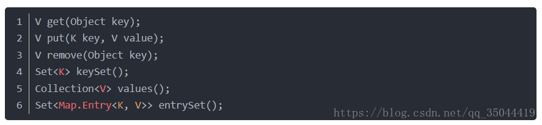

前三个与map的操作有关，后三个与map遍历相关。

在map接口中，还定义了一个entry接口，hashmap实现本质上是一个entry的数组的链表。所以entry可以看成是hashmap的基本单元。下面是entry接口的内容，其中最核心的其实就是这三个方法：

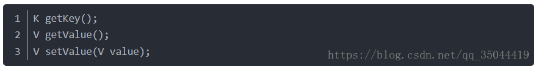

是对一个entry的key和value的获取以及value的修改。

下面是hashmap的实现类：

首先看一下重要的成员变量，

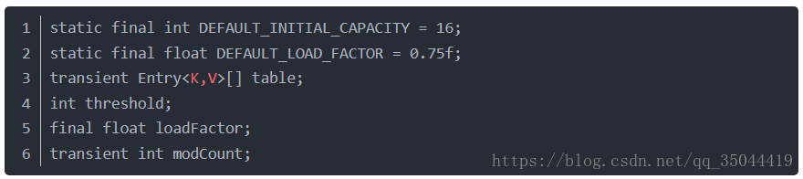

再看一下构造函数：

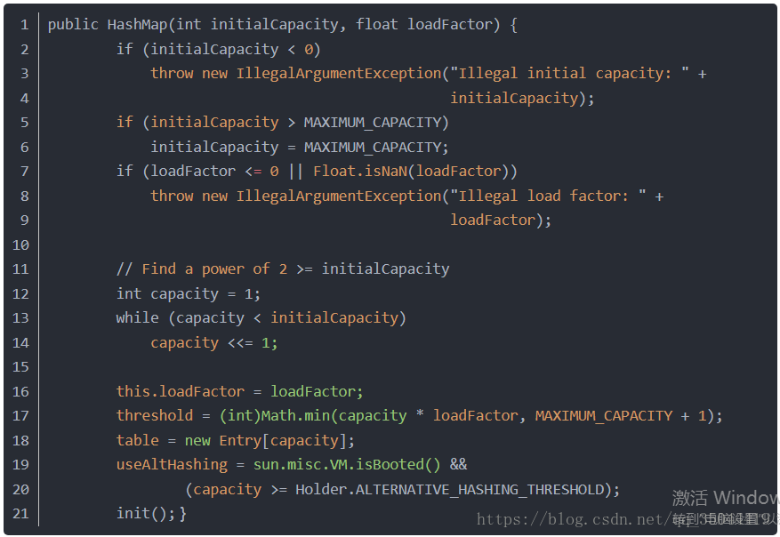

initialCapacity是一个与hashmap大小相关的参数，但是呢，他并不是最终的大小，可以看到，数组的大小其实是capacity，capacity是一个大于等于initialCapacity的2的次方，这个是通过一个while循环计算得到的，为什么必须是2的次方后面会说。loadfactor是装载因子，衡量饱满度。threashold是一个阈值，如果大于这个值，就认为hashmap太满了，碰撞的概率就很大，这时会触发resize过程，让hashmap扩容。modcount与多线程的迭代相关。table是entry的数组。

与hash有关的方法：

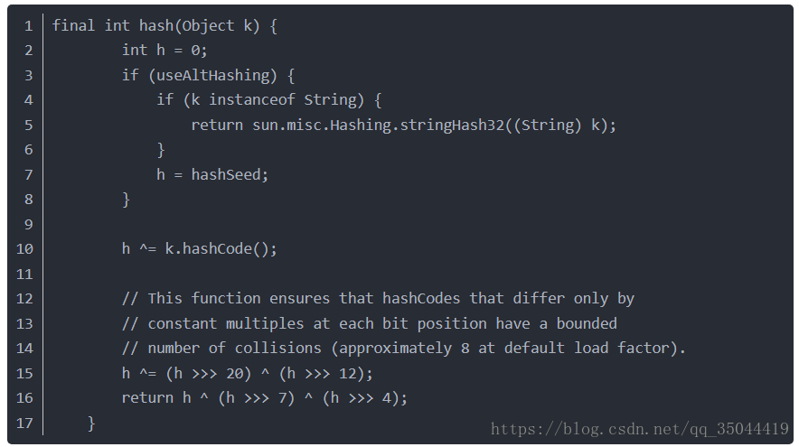

上述方法用于计算hash值，首先得到key的hashCode，然后再位运算，最终的hash值很均匀，原因不详。

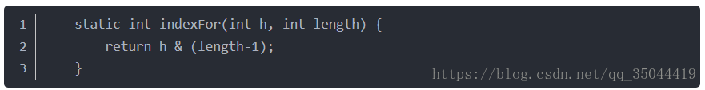  
这个函数用上面得到的hash值计算table的索引，为了让每一个位置都有可能容纳一个entry，我们第一个想到是的是除模运算，但是在计算机中除法的效率很低，这里使用位运算就大大提高了效率，这里也解释了为什么数组大小是2的次方，因为2的次方减去1以后就是一个全1的二进制数，做and操作就会保证索引的均匀性，否则加入某一位是0，那么这一位永远不会再索引中出现。这样就可以通过key定位table的索引了。

再看get方法

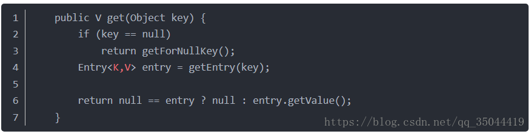

如果key是null，就调用如下方法：

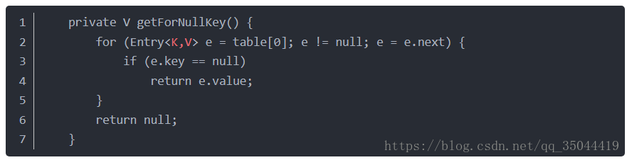  
key为null的entry存放在索引为0的位置，但是位置0不一定只有key为null的value，所以需要遍历位置0的所有entry，返回key为null的value。如果key不是null，那么就调用getEntry方法：

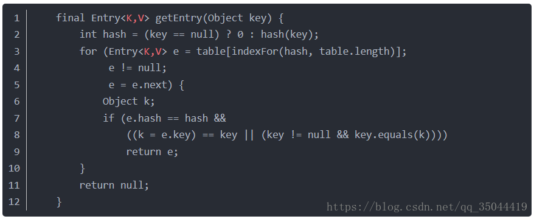  
使用key定位索引，然后遍历索引里面的所有entry，找到key相等的value，返回，为什么要遍历，因为可能有碰撞。如果没指定key的entry，返回null。  
  
下面是put方法：

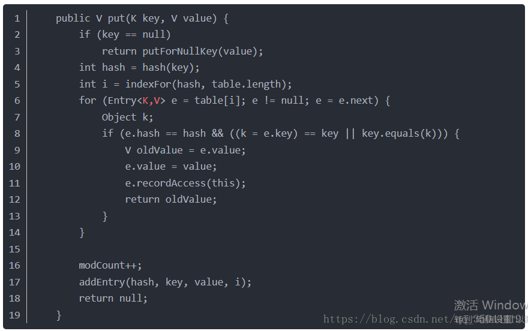  
如果插入key为null的值，会调用如下方法：

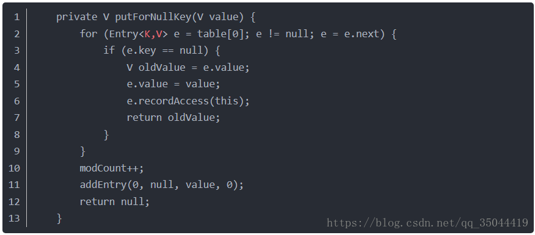

从索引0的entry数组遍历，看是否已经存在，如果是就只是更改value，此时modecount不加，说明更新不会触发迭代异常，否则就调用addEntry方法，新增一个entry。

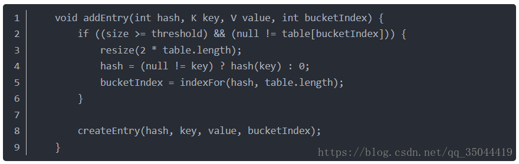

增加一个entry需要看容量是否超过了阈值，如果超过，就需要resize扩容。然后调用createEntry新增一个entry。

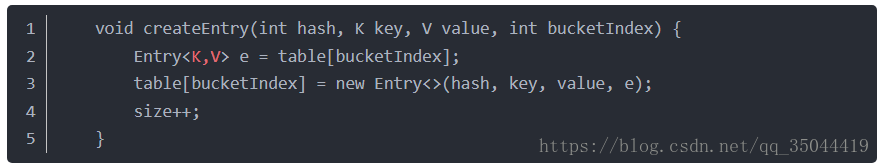

这里就是调用entry的构造函数，让新的entry成为这个table槽位的第一个entry，其next指针设置为原本的第一个entry，所以新的元素都是插入到队首的。

那如果key不是null，过程也类似，通过hash值定位索引，然后在对应的table槽位中遍历entry，更新或者添加。过程一样。

最后看下扩容：

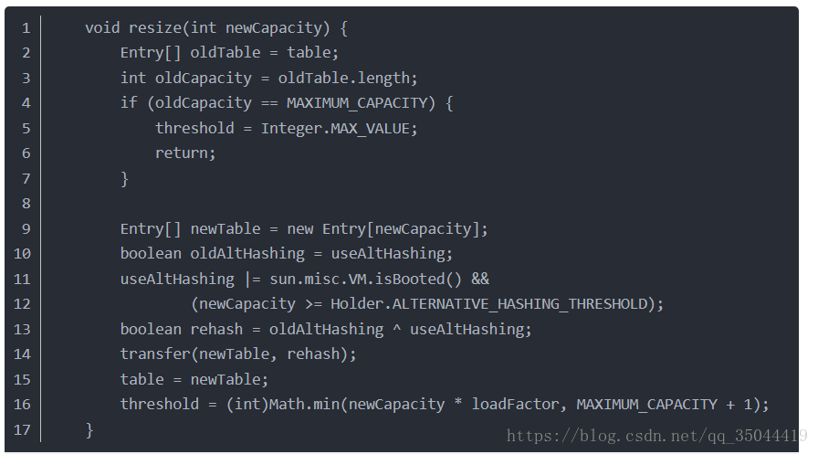

扩容会新建一个容量为原来2倍的table，然后调用下面的方法把原始的entry加入到新的table：

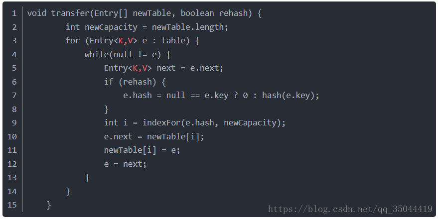

这个transfer过程就是把原本的每一个entry重新计算索引，再添加到队首的过程。  
  
这边是hashmap的一些核心的实现。

最后，注意hashmap不是线程安全的，因为比方说某一时刻两个线程都要put相同的key和value，很可能在map里面存在两个一模一样的entry，两个都检测到没有key，就调用了addentry方法。

hashtable的实现基本上鱼hasnmap是一样的，只不过对一些方法加了synchroninzed锁，hashmap是一个hashtable的轻量级实现，在多线程环境下应该使用hashtable而非hashmap，当然也可以使用其他的线程安全级别的map，或者自己封装一下hashmap。hashtable还有一个却别就是不支持null的key和value。会报异常

## 掌握Map接口-TreeMap实现类

#### 4.1TreeMap 简介

TreeMap 是一个有序的key-value集合，它是通过红黑树实现的。  
TreeMap 继承于AbstractMap，所以它是一个Map，即一个key-value集合。  
TreeMap 实现了NavigableMap接口，意味着它支持一系列的导航方法。比如返回有序的key集合。  
TreeMap基于红黑树（Red-Black tree）实现。该映射根据其键的自然顺序进行排序，或者根据创建映射时提供的 Comparator 进行排序，具体取决于使用的构造方法。  
另外，TreeMap是非同步的。 它的iterator 方法返回的迭代器是fail-fastl的。

#### 4.2TreeMap的构造函数

*// 默认构造函数。使用该构造函数，TreeMap中的元素按照自然排序进行排列。*

TreeMap()

*// 创建的TreeMap包含Map*

TreeMap(Map\$\<\$? extends K, ? extends V\> copyFrom)

*// 指定Tree的比较器*

TreeMap(Comparator\$\<\$? super K\> comparator)

*// 创建的TreeSet包含copyFrom*

TreeMap(SortedMap\$\<\$K, ? extends V\> copyFrom)

4**.3 继承关系**

java.lang.Object

↳ java.util.AbstractMap\<K, V\>

↳ java.util.TreeMap\<K, V\>

public class TreeMap\<K,V\>

extends AbstractMap\<K,V\>

implements NavigableMap\<K,V\>, Cloneable, java.io.Serializable {}

#### 4.4 类图

### 2、源代码

public class TreeMap\<K,V\>

extends AbstractMap\<K,V\>

implements NavigableMap\<K,V\>, Cloneable, java.io.Serializable

{

*//比较方法的对象*

private final Comparator\<? super K\> comparator;

*//根节点*

private transient Entry\<K,V\> root;

*//元素个数*

private transient int size = 0;

*//默认构造*

public TreeMap() {

comparator = null;

}

*//带比较对象的构造*

public TreeMap(Comparator\<? super K\> comparator) {

this.comparator = comparator;

}

*//带子map的构造*

public TreeMap(Map\<? extends K, ? extends V\> m) {

comparator = null;

putAll(m);

}

*//带SortedMap的构造函数，SortedMap会成为TreeMap的子集*

public TreeMap(SortedMap\<K, ? extends V\> m) {

comparator = m.comparator();

try {

buildFromSorted(m.size(), m.entrySet().iterator(), null, null);

} catch (java.io.IOException cannotHappen) {

} catch (ClassNotFoundException cannotHappen) {

}

}

*//是否包含key*

public boolean containsKey(Object key) {

return getEntry(key) != null;

}

*//是否包含value*

public boolean containsValue(Object value) {

for (Entry\<K,V\> e = getFirstEntry(); e != null; e = successor(e))

if (valEquals(value, e.value))

return true;

return false;

}

*//根据key获得value*

public V get(Object key) {

Entry\<K,V\> p = getEntry(key);

return (p==null ? null : p.value);

}

*//获取第一个key*

public K firstKey() {

return key(getFirstEntry());

}

*//*

final Entry\<K,V\> getEntry(Object key) {

*// Offload comparator-based version for sake of performance*

if (comparator != null)

*//使用自定义的比较方法*

return getEntryUsingComparator(key);

if (key == null)

throw new NullPointerException();

@SuppressWarnings("unchecked")

Comparable\<? super K\> k = (Comparable\<? super K\>) key;

Entry\<K,V\> p = root;

*//二叉树的遍历、查找*

while (p != null) {

int cmp = k.compareTo(p.key);

if (cmp \< 0)

p = p.left;

else if (cmp \> 0)

p = p.right;

else

return p;

}

return null;

}

*//获取TreeMap中大于或等于key的最小的节点；*

final Entry\<K,V\> getCeilingEntry(K key) {

Entry\<K,V\> p = root;

while (p != null) {

int cmp = compare(key, p.key);

*//key \< p.key*

if (cmp \< 0) {

*//向左子树寻找*

if (p.left != null)

p = p.left;

else

*//如果left为null 表示为当前路径的最小值*

return p;

*//key \> p.key*

} else if (cmp \> 0) {

*//向右子树寻找*

if (p.right != null) {

p = p.right;

} else {

Entry\<K,V\> parent = p.parent;

Entry\<K,V\> ch = p;

*//如果比所有元素都大，会回溯到根节点，返回null*

*//如果一个值小于一个节点，但是又大于此节点左子树的所有值(p.right=null)，则进行回溯，回溯到左节点(ch==parent.right条件)，返回左节点的父节点。*

*//看图比较好理解*

while (parent != null && ch == parent.right) {

ch = parent;

parent = parent.parent;

}

return parent;

}

} else

*//如果相同，直接返回*

return p;

}

return null;

}

*//与getCeilingEntry类似，就是没有key==p.key的条件*

final Entry\<K,V\> getHigherEntry(K key) {

Entry\<K,V\> p = root;

while (p != null) {

int cmp = compare(key, p.key);

if (cmp \< 0) {

if (p.left != null)

p = p.left;

else

return p;

} else {

if (p.right != null) {

p = p.right;

} else {

Entry\<K,V\> parent = p.parent;

Entry\<K,V\> ch = p;

while (parent != null && ch == parent.right) {

ch = parent;

parent = parent.parent;

}

return parent;

}

}

}

return null;

}

*//插入键值*

public V put(K key, V value) {

Entry\<K,V\> t = root;

*//如果当前为空，将新建根节点*

if (t == null) {

compare(key, key); *// type (and possibly null) check*

root = new Entry\<\>(key, value, null);

size = 1;

modCount++;

return null;

}

int cmp;

Entry\<K,V\> parent;

*// split comparator and comparable paths*

Comparator\<? super K\> cpr = comparator;

*//这个if/else将找到需要插入的位置。如果存在key 替换value*

*//如果有自定义的Comparator*

if (cpr != null) {

do {

parent = t;

cmp = cpr.compare(key, t.key);

if (cmp \< 0)

t = t.left;

else if (cmp \> 0)

t = t.right;

else

return t.setValue(value);

} while (t != null);

}

else {

*//key不允许为null*

if (key == null)

throw new NullPointerException();

@SuppressWarnings("unchecked")

Comparable\<? super K\> k = (Comparable\<? super K\>) key;

*//使用默认Comparable*

do {

parent = t;

cmp = k.compareTo(t.key);

if (cmp \< 0)

t = t.left;

else if (cmp \> 0)

t = t.right;

else

return t.setValue(value);

} while (t != null);

}

*//新建节点*

Entry\<K,V\> e = new Entry\<\>(key, value, parent);

if (cmp \< 0)

parent.left = e;

else

parent.right = e;

*//修正红黑树*

fixAfterInsertion(e);

size++;

modCount++;

return null;

}

*//移除节点*

public V remove(Object key) {

*//找到节点*

Entry\<K,V\> p = getEntry(key);

if (p == null)

return null;

V oldValue = p.value;

*//删除*

deleteEntry(p);

return oldValue;

}

*//返回key最小的节点 exportEntry使返回的节点不能更改*

public Map.Entry\<K,V\> firstEntry() {

return exportEntry(getFirstEntry());

}

*//弹出key最小的节点*

public final Map.Entry\<K,V\> pollFirstEntry() {

*//找元素*

TreeMap.Entry\<K,V\> e = subLowest();

*//装饰为不可变*

Map.Entry\<K,V\> result = exportEntry(e);

if (e != null)

*//删除原节点*

m.deleteEntry(e);

return result;

}

*//返回Key集*

public Set\<K\> keySet() {

return navigableKeySet();

}

*//返回Key集*

public NavigableSet\<K\> navigableKeySet() {

KeySet\<K\> nks = navigableKeySet;

return (nks != null) ? nks : (navigableKeySet = new KeySet\<\>(this));

}

*//返回节点集*

public Set\<Map.Entry\<K,V\>\> entrySet() {

EntrySet es = entrySet;

return (es != null) ? es : (entrySet = new EntrySet());

}

*//包装为不可变的Entry*

static \<K,V\> Map.Entry\<K,V\> exportEntry(TreeMap.Entry\<K,V\> e) {

return (e == null) ? null :

new AbstractMap.SimpleImmutableEntry\<\>(e);

}

*//元素节点类*

static final class Entry\<K,V\> implements Map.Entry\<K,V\> {

K key;

V value;

Entry\<K,V\> left;

Entry\<K,V\> right;

Entry\<K,V\> parent;

boolean color = BLACK;

*/\*\**

*\* Make a new cell with given key, value, and parent, and with*

*\* {@code null} child links, and BLACK color.*

*\*/*

Entry(K key, V value, Entry\<K,V\> parent) {

this.key = key;

this.value = value;

this.parent = parent;

}

*/\*\**

*\* Returns the key.*

*\**

*\* @return the key*

*\*/*

public K getKey() {

return key;

}

*/\*\**

*\* Returns the value associated with the key.*

*\**

*\* @return the value associated with the key*

*\*/*

public V getValue() {

return value;

}

*/\*\**

*\* Replaces the value currently associated with the key with the given*

*\* value.*

*\**

*\* @return the value associated with the key before this method was*

*\* called*

*\*/*

public V setValue(V value) {

V oldValue = this.value;

this.value = value;

return oldValue;

}

public boolean equals(Object o) {

if (!(o instanceof Map.Entry))

return false;

Map.Entry\<?,?\> e = (Map.Entry\<?,?\>)o;

return valEquals(key,e.getKey()) && valEquals(value,e.getValue());

}

public int hashCode() {

int keyHash = (key==null ? 0 : key.hashCode());

int valueHash = (value==null ? 0 : value.hashCode());

return keyHash \^ valueHash;

}

public String toString() {

return key + "=" + value;

}

}

*//寻找并返回key最小的节点*

final Entry\<K,V\> getFirstEntry() {

Entry\<K,V\> p = root;

if (p != null)

while (p.left != null)

p = p.left;

return p;

}

*//寻找继承者节点(比t大的最小节点)*

static \<K,V\> TreeMap.Entry\<K,V\> successor(Entry\<K,V\> t) {

if (t == null)

return null;

else if (t.right != null) {

Entry\<K,V\> p = t.right;

while (p.left != null)

p = p.left;

return p;

} else {

Entry\<K,V\> p = t.parent;

Entry\<K,V\> ch = t;

while (p != null && ch == p.right) {

ch = p;

p = p.parent;

}

return p;

}

}

*//左旋转*

*/\*\* From CLR \*/*

private void rotateLeft(Entry\<K,V\> p) {

if (p != null) {

Entry\<K,V\> r = p.right;

p.right = r.left;

if (r.left != null)

r.left.parent = p;

r.parent = p.parent;

if (p.parent == null)

root = r;

else if (p.parent.left == p)

p.parent.left = r;

else

p.parent.right = r;

r.left = p;

p.parent = r;

}

}

*//插入后修正*

private void fixAfterInsertion(Entry\<K,V\> x) {

x.color = RED;

while (x != null && x != root && x.parent.color == RED) {

if (parentOf(x) == leftOf(parentOf(parentOf(x)))) {

Entry\<K,V\> y = rightOf(parentOf(parentOf(x)));

if (colorOf(y) == RED) {

setColor(parentOf(x), BLACK);

setColor(y, BLACK);

setColor(parentOf(parentOf(x)), RED);

x = parentOf(parentOf(x));

} else {

if (x == rightOf(parentOf(x))) {

x = parentOf(x);

rotateLeft(x);

}

setColor(parentOf(x), BLACK);

setColor(parentOf(parentOf(x)), RED);

rotateRight(parentOf(parentOf(x)));

}

} else {

Entry\<K,V\> y = leftOf(parentOf(parentOf(x)));

if (colorOf(y) == RED) {

setColor(parentOf(x), BLACK);

setColor(y, BLACK);

setColor(parentOf(parentOf(x)), RED);

x = parentOf(parentOf(x));

} else {

if (x == leftOf(parentOf(x))) {

x = parentOf(x);

rotateRight(x);

}

setColor(parentOf(x), BLACK);

setColor(parentOf(parentOf(x)), RED);

rotateLeft(parentOf(parentOf(x)));

}

}

}

root.color = BLACK;

}

}

## 掌握泛型初步

### 5.1泛型概述

泛型的概念

泛型是通过参数化类型来实现在同一份代码上操作多种数据类型的技术

利用“参数化类型”讲类型抽象化 从而实现灵活的复用

泛型核心

1 减少装箱和拆箱 提高运行效率

List\<int\> list = new List\<int\>();

2 类型安全

List\<int\>list = new List\<int\>();

3 代码重用

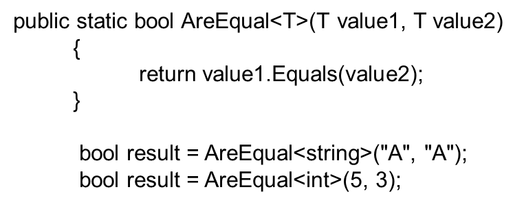

泛型的优点

1\. 泛型增强了代码性的可读性

2.泛型有助于实现代码的重用 保护类型的安全以及提高性能

3 我们可以创建泛型集合类

4\. 泛型实现了类型和方法的参数化

5\. 我们还可以对泛型类进行约束以访问特定数据类型的方法

6.关于泛型数据类型中使用的额类型的信息可以在裕兴时通过使用反射获取

泛型的约束

T：struct 类型参数必须是值类型 可以指定除Nullable 意外的任何值类型

T：class 类型参数化必须是引用类型 包括任何类 接口 委托或数组类型

T：new（）类型参数必须具有无参数的公共构造函数 当与其他约束一起使用时，new{}约束必须最后指定

T：\<基类名\> 类型参数必须是指定的基类或派生自指定的基类子类

T：\<接口名称\> 类型参数必须是指定的接口或实现指定的接口 可以指定多个接口约束 约束接口也可以是泛型的

泛型缓存

类中的静态类型 无论被使用多少次内存中都只存在一个 静态构造函数只会执行一次

在泛型类中 T类型不同，每个不同的T类型 都会产生一个不同的副本 所以会产生不同的静态属性 静态构造函数

（注：1.泛型缓存比字典缓存效率高 2.泛型缓存不能主动释放）

### 5.2泛型的种类

一.区别  
单独的T 代表一个类型 ，而 Class\<T\>代表这个类型所对应的类， Class\<？\>表示类型不确定的类  
 E - Element (在集合中使用，因为集合中存放的是元素)  
 T - Type（Java 类）  
 K - Key（键）  
 V - Value（值）  
 N - Number（数值类型）  
 ? - 表示不确定的java类型  
  
  
举例说明：   
  
  
Set\<T\> 表示 集合里 是 T类的实例   
List\<E\> 表示 集合里 是 E类的实例   
List\<?\> 表示 集合里的对象类型不确定，未指定   
List 同 List\<?\> 是一样的。   
  
  
泛型的作用：   
1、用泛型：  
List\<T\> list=new ArrayList\<T\>();   
T t=list.get(0);   
  
  
2、不用泛型：   
List list=new ArrayList();   
T t=(T)list.get(0);  
  
  
二、如何创建一个Class\<T\>类型的实例？  
 就像使用非泛型代码一样，有两种方式：调用方法 Class.forName() 或者使用类常量X.class。 Class.forName() 被定义为返 回 Class\<?\>。另一方面，类常量 X.class 被定义为具有类型 Class\<X\>，所 以 String.class 是Class\<String\> 类型的。  
  
  
三、方法中为什么需要\<T\> T修饰呢  
泛型的声明，必须在方法的修饰符（public,static,final,abstract等）之后，返回值声明之前。  
  
  
public static \<T\> T request2Bean(HttpServletRequest request,Class\<T\> clazz) {}  
  
  
其中第一个\<T\>是与传入的参数Class\<T\>相对应的，相当于返回值的一个泛型，后面的T是返回值类型，代表方法必须返回T类型的（由传入的Class\<T\>决定）

### 5.3擦除法

java的参数化类型被称为泛型（generics）。平时见到最多的泛型应用是在各个集合中，比如ArrayList、HashMap中。

c++的泛型使用的是膨胀法，就是生成多个实现类。而java使用的是擦除法，就是将对象存入时都擦除为Object类型，但是在取出时再根据相应类型进行一次类型转换。

下面以ArrayList的源码为例说法擦除法：

transient Object[] elementData;//存入时将E类型转换为Object存储public boolean add(E e) {

ensureCapacityInternal(size + 1);

elementData[size++] = e;

return true;

}//取出时再将Object强转为相应的E类型

public E get(int index) {

rangeCheck(index);

return elementData(index);

}

E elementData(int index) {

return (E) elementData[index];

}
