# 第16天 IO流

## 主要内容

1、掌握Java流概述

2、掌握File类常见API的使用

3、掌握文件流的使用

4、掌握缓冲流的使用

## 学习目标

| 节数    | 知识点                  | 要求 |
|---------|-------------------------|------|
| 第一节  | 掌握Java流概述          | 掌握 |
| 第二节  | 掌握File类常见API的使用 | 掌握 |
| 第三节  | 掌握文件流的使用        | 掌握 |
| 第四节  | 掌握缓冲流的使用        | 掌握 |

## 掌握Java流概述

**1.1流的作用**

Java所有的I/O机制都是基于数据流进行输入输出，这些数据流表示了字符或者字节数据的流动序列。Java的I/O流提供了读写数据的标准方法。任何Java中表示数据源的对象都会提供以数据流的方式读写它的数据的方法。

标准输入输出，文件的操作，网络上的数据流，字符串流，对象流，zip文件流等等，java中将输入输出抽象称为流，就好像水管，将两个容器连接起来。将数据冲外存中读取到内存中（供Java程序使用）的称为输入流，将数据从内存写入外存中的称为输出流。

流是一个很形象的概念，当程序需要读取数据的时候，就会开启一个通向数据源的流，这个数据源可以是文件，内存，或是网络连接。类似的，当程序需要写入数据的时候，就会开启一个通向目的地的流。

流是一组有顺序的，有起点和终点的字节集合，是对数据传输的总称或抽象。即数据在两设备间的传输称为流，流的本质是数据传输，根据数据传输特性将流抽象为各种类，方便更直观的进行数据操作。

**1.2流的种类**

流的分类，Java的流分类比较丰富，刚接触的人看了后会感觉很晕。流分类的方式很多：

1、按照输入的方向分，输入流和输出流，输入输出的参照对象是Java程序。

2、按照处理数据的单位不同分，字节流和字符流，字节流读取的最小单位是一个字节（1byte=8bit），而字符流一次可以读取一个字符（1char = 2byte = 16bit）。

3、按照功能的不同分，分节点流和处理流，节点流是直接从一个源读写数据的流（这个流没有经过包装和修饰），处理流是在对节点流封装的基础上的 一种流，FileInputStream是一个节点流，可以直接从文件读取数据，但是BufferedInputStream可以包装 FileInputStream，使得其有缓冲功能。

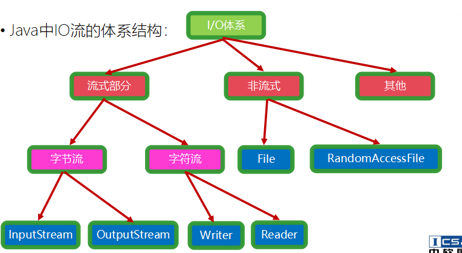

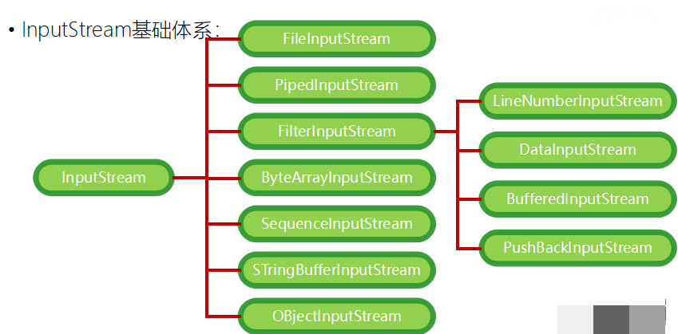

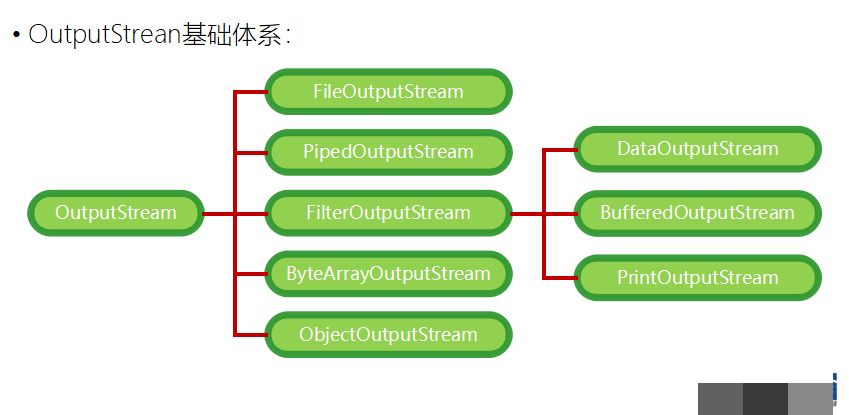

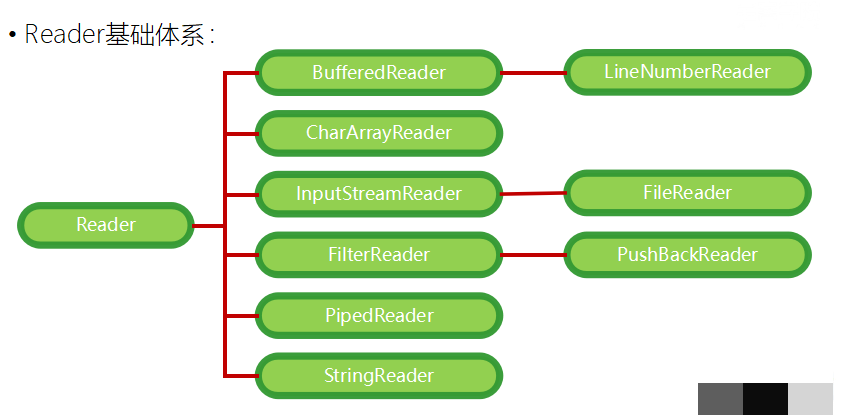

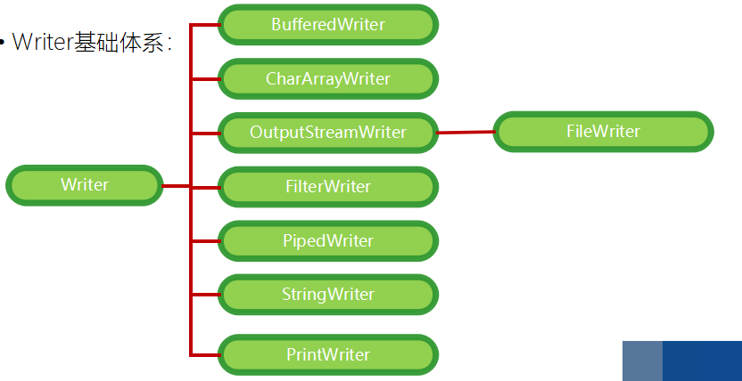

**1.3传统IO**

java.io.\*包是Java中最传统的IO操作，在利用io包的输入流工具（InputStream、Reader）进行数据读取操作时，如果无法读取到需要的内容，将会导致执行读取数据操作的线程陷入阻塞状态

因此，在进行流的写入和读取时要尤为小心，保证数据读取的数量和顺序的准确性，否则可能导致应用执行异常

**1.4 NIO**

NIO主要有三大核心部分：Channel(通道)，Buffer(缓冲区), Selector。传统IO基于字节流和字符流进行操作，而NIO基于Channel和Buffer(缓冲区)进行操作，数据总是从通道读取到缓冲区中，或者从缓冲区写入到通道中。Selector(选择区)用于监听多个通道的事件（比如：连接打开，数据到达）。因此，单个线程可以监听多个数据通道。

NIO和传统IO（一下简称IO）之间第一个最大的区别是，IO是面向流的，NIO是面向缓冲区的。 Java IO面向流意味着每次从流中读一个或多个字节，直至读取所有字节，它们没有被缓存在任何地方。此外，它不能前后移动流中的数据。如果需要前后移动从流中读取的数据，需要先将它缓存到一个缓冲区。NIO的缓冲导向方法略有不同。数据读取到一个它稍后处理的缓冲区，需要时可在缓冲区中前后移动。这就增加了处理过程中的灵活性。但是，还需要检查是否该缓冲区中包含所有您需要处理的数据。而且，需确保当更多的数据读入缓冲区时，不要覆盖缓冲区里尚未处理的数据。

IO的各种流是阻塞的。这意味着，当一个线程调用read() 或 write()时，该线程被阻塞，直到有一些数据被读取，或数据完全写入。该线程在此期间不能再干任何事情了。 NIO的非阻塞模式，使一个线程从某通道发送请求读取数据，但是它仅能得到目前可用的数据，如果目前没有数据可用时，就什么都不会获取。而不是保持线程阻塞，所以直至数据变得可以读取之前，该线程可以继续做其他的事情。 非阻塞写也是如此。一个线程请求写入一些数据到某通道，但不需要等待它完全写入，这个线程同时可以去做别的事情。 线程通常将非阻塞IO的空闲时间用于在其它通道上执行IO操作，所以一个单独的线程现在可以管理多个输入和输出通道（channel）。

## 掌握File类常见API的使用

**2.1 File类介绍**

java.io.File类：文件和目录路径名的抽象表示形式，与平台无关

File 能新建、删除、重命名文件和目录，但 File 不能访问文件内容本身。如果需要访问文件内容本身，则需要使用输入/输出流。

File对象可以作为参数传递给流的构造器

程序中如果要使用到该包中的类，对文件或流进行操作，则必须显式地声明如下语句

import java.io.\*;

java.io.File类的对象可以表示文件和目录，在程序中一个File类对象可以代表一个文件或目录

当创建一个File对象后，就可以利用它来对文件或目录的属性进行操作，如：文件名、最后修改日期、文件大小等等

需要注意的是，File对象并不能直接对文件内容进行读/写操作，只能查看文件的属性

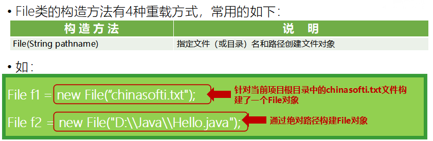

构建File对象是需要注意的要点：

提供给构造方法的路径可以指向一个具体的文件，这时候File对象能够操作这个文件的属性，也可以指向一个文件夹，这时候File对象操作的就是文件夹的属性

注意上例第二个对象的路径表达，由于在Java中“\\”符号表示转意，因此如果使用”\\”作为路径分割符，则实际需要编写“\\\\”，当然一个更好的替代方法是使用Unix系统中常用的”/”作为路径分割，则不需要转意

特别注意，Java中的相对路径体系和我们日常所见的文件系统相对路径体系有较大的区别：

如果以路径以“/”或“\\\\”开头，则相对路径的根为当前项目所在磁盘的根目录（Unix没有磁盘分区的概念，因此直接使用/，即文件系统的根作为相对路劲的根）

如果不以“/”开头则相对路径的根为项目根目录，而不是当前类所在目录，这一点非常容易引起误区，因为类从属于某个包之后，类文件实际是位于项目中的某个子文件夹中的，如com.chinasoft.Hello这个类是位于项目中的com\\chinasofti子文件夹中，如果在Hello类中构建一个File对象：FIle f = new File(“icss/chinasofti.txt”)，那么这个文件位于项目根目录的icss子文件中，跟当前类自己的位置无关

跟创建相关的功能:

public boolean createNewFile()

创建文件,当文件不存在的时候,创建此抽象路径下的文件

public boolean mkdir()

创建一个文件夹,如果文件夹存在,不创建

public boolean mkdirs()

创建文件夹,如果父目录不存在,会创建此目录

如果创建一个文件/目录,没有写盘符的时候,会创建在哪里呢?

会创建在当前项目路径下

**2.2 File类操作**

示例1

import java.io.File;

public class FileDemo

{

public static void main(String[] args) {

File file = new File("test.txt");

System.out.println("文件或目录是否存在：" + file.exists());

System.out.println("是文件吗：" + file.isFile());

System.out.println("是目录吗：" + file.isDirectory());

System.out.println("名称：" + file.getName());

System.out.println("绝对路径：" + file.getAbsolutePath());

System.out.println("文件大小：" + file.length());

}

}

示例2

package com.chinasofit.etc.example.se.io.file;

import java.io.BufferedWriter;

import java.io.File;

import java.io.FileWriter;

import java.io.FilenameFilter;

import java.io.IOException;

public class FileOperation {

public void deleteFile(String path) {

File f = new File(path);

try {

System.out.println(f.delete());

System.out.println("deleteOK");

} catch (Exception e) {}

}

public String[] listFile(String path) {

File f = new File(path);

String[] files = f.list();

return files;

}

public String[] listFile(String path, String name) {

final String endname = name;

File f = new File(path);

String files[] = f.list(new FilenameFilter() {

public boolean accept(File path, String fname) {

return fname.endsWith(endname);

}

});

return files;

}

public boolean createFile(String \_path, String \_fileName)

throws IOException {

boolean success = false;

String fileName = \_fileName;

String filePath = \_path;

try {

File file = new File(filePath);

if (!file.isDirectory()) {

file.mkdirs();

}

File f = new File(filePath + File.separator + fileName + ".txt");

success = f.createNewFile();

} catch (IOException e) {

e.printStackTrace();

}

return success;

}

public void writeFile(String path, String fileName, String insertString,

boolean isLast) throws IOException {

try {

BufferedWriter out = new BufferedWriter(new FileWriter(path

\+ File.separator + fileName + ".txt"));

out.write(insertString);

if (!isLast)

out.newLine();

out.flush();

out.close();

} catch (IOException e) {

e.printStackTrace();

}

}

}

**2.3 File获取路径及对象**

getName() 获取文件名

getPath() 获取文件的路径

getAbsoluteFile()返回此抽象路径名的绝对路径名形式（返回的是File类的对象）

getAbsolutePath() 返回此抽象路径名的绝对路径名字符串。

getParent() 获取当前文件父文件

toPath() 返回此抽象路径名父目录的路径名字符串；如果此路径名没有指定父目录，则返回 null。

renameTo(File newName) 重新命名此抽象路径名表示的文件

示例

import java.io.File;

import java.io.IOException;

public class Example2

{

public static void main(String[] args) throws IOException

{

File f=new File("c:\\\\test\\\\abc.java");

f.createNewFile();

if(f.exists())

{

System.out.println("文件存在");

System.out.println(f.canRead());

System.out.println(f.canWrite());

System.out.println(f.isHidden());

System.out.println(f.isFile());

System.out.println(f.length());

System.out.println(f.getName());

System.out.println(f.getAbsolutePath());

System.out.println(f.lastModified());

System.out.println(f.getPath());

System.out.println(f.getAbsoluteFile());

System.out.println(f.getParent());

}

else

{

System.out.println("文件不存在");

}

}

}

**2.4 File获取属性**

public String getAbsolutePath()：获取绝对路径

public String getPath():获取相对路径

public String getName():获取名称

public long length():获取长度。字节数

public long lastModified():获取最后一次的修改时间，毫秒值

示例

File file = new File("G:\\\\a\\\\a.txt");

System.out.println("getAbsolutePath:" + file.getAbsolutePath());

System.out.println("getPath:" + file.getPath());

System.out.println("getName:" + file.getName());

System.out.println("length:" + file.length());

System.out.println("lastModified:" + file.lastModified());

Date d = new Date(1416471971031L);

//格式化时间

SimpleDateFormat sdf = new SimpleDateFormat("yyyy-MM-dd HH:mm:ss");

String s = sdf.format(d);

System.out.println(s);

**2.5 File设置属性**

setLastModified() 方法来修改文件最后的修改日期

import java.io.File;

import java.util.Date;

public class Main {

public static void main(String[] args) throws Exception {

File fileToChange = new File("C:/myjavafile.txt");

fileToChange.createNewFile();

Date filetime = new Date(fileToChange.lastModified());

System.out.println(filetime.toString());

System.out.println(fileToChange.setLastModified(System.currentTimeMillis()));

filetime = new Date(fileToChange.lastModified());

System.out.println(filetime.toString());

}

}

setReadOnly()方法来设置文件只读：

import java.io.File;

public class Main {

public static void main(String[] args) {

File file = new File("C:/java.txt");

System.out.println(file.setReadOnly());

System.out.println(file.canWrite());

}

}

setReadable(boolean readable) 方法设置所有者和每个人的读取访问权限，此抽象路径名。

package cn.sxt;

import java.io.File;

public class FileDemo {

public static void main(String[] args) {

File f = null;

boolean bool = false;

try{

f = new File("C:/test.txt");

bool = f.exists();

if(bool)

{

bool = f.setReadable(true);

System.out.println("setReadable() succeeded?: "+bool);

bool = f.canRead();

System.out.print("Is file readable?: "+bool);

}

}catch(Exception e){

e.printStackTrace();

}

}}

setWritable(boolean writable) 方法设置此抽象路径名的所有者的写权限。

import java.io.File;

public class Main {

public static void main(String[] args) {

File f = new File("test.txt");

boolean bool = f.setWritable(true);

System.out.println("setWritable() succeeded?: " + bool);

bool = f.canWrite();

System.out.print("Is file writable?: " + bool);

}

}

## 掌握文件流的使用

字节输出流

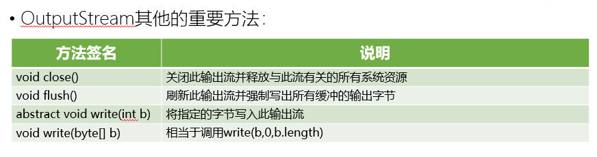

实现类FileOutPutStream

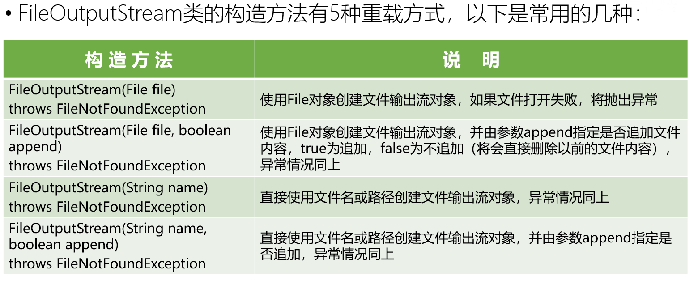

字节输入流

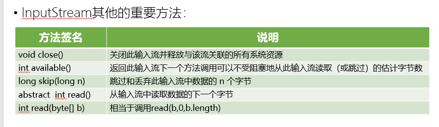

字节流的使用

public static void main(String[] args) {

InputStream in = null;

OutputStream out = null;

try {

//得到输入流

in = new FileInputStream("E:\\\\test\\\\a.txt");

//得到输出流

File file = new File("E:\\\\test\\\\b.txt");

if (!file.exists()) {

file.createNewFile();

}

out = new FileOutputStream(file, true);

int i;//从输入流读取一定数量的字节，返回 0 到 255 范围内的 int 型字节值

while ((i = in.read()) != -1) {

out.write(i);

}

} catch (FileNotFoundException e) {

e.printStackTrace();

} catch (IOException e) {

e.printStackTrace();

} finally {

try {

if (in != null) {

in.close();

}

if (out != null) {

out.close();

}

} catch (IOException e) {

e.printStackTrace();

}

}

}

字符流

Writer和OutputStream类似也提供了统一的往流中写入数据的方法，和OutputStream不同的是，写入数据的单位由字节变成了字符

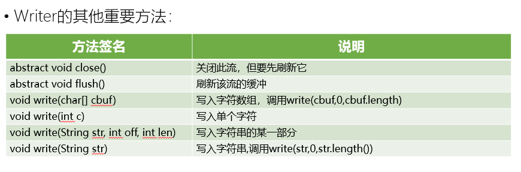

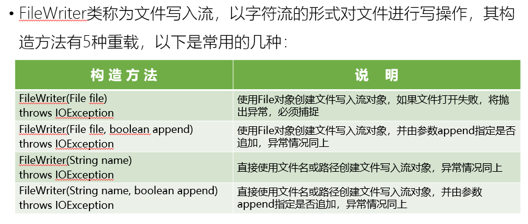

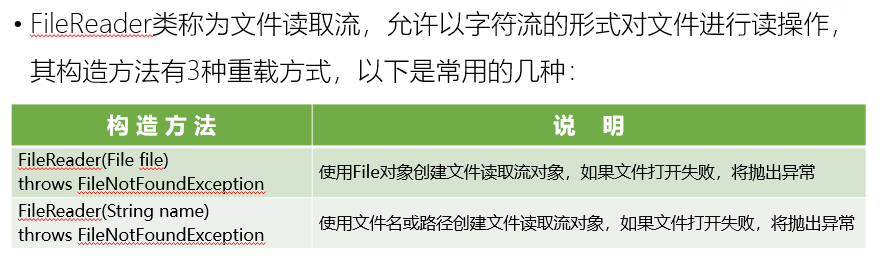

示例代码

/\*\*

\* 由于是字符，存在编码不一致导致乱码的问题

\* @param args

\*/

public static void main(String[] args) {

Reader reader = null;

Writer writer = null;

try {

//得到输入流

reader = new FileReader("E:\\\\test\\\\a.txt");

//得到输出流

writer = new FileWriter("E:\\\\test\\\\c.txt", true);

char[] chars = new char[50];

int i;

while ((i = reader.read(chars)) != -1) {

writer.write(chars, 0, i);

writer.flush();

}

} catch (FileNotFoundException e) {

e.printStackTrace();

} catch (IOException e) {

e.printStackTrace();

} finally {

try {

if (reader != null) {

reader.close();

}

if (writer != null) {

writer.close();

}

} catch (IOException e) {

e.printStackTrace();

}

}

}

## 第四节 掌握缓冲流的使用

**4.1 缓冲区的作用**

由原来的一个一个字节读取，变成放到缓冲流（可配置字节数）进行批量操作，这样和底层的硬盘操作频率变少，效率提高。”从应用的角度，任何减少磁盘活动的策略都有帮助，例如使用带缓存的输入、输出流以减少读、写操作次数用以减少磁盘交互。“

**4.2 BufferedInputStream**

（1）BufferedInputStream构造方法

public BufferedOutputStream(OutputStream out)

采用的默认的缓冲区大小(足够大了) ,来构造一个字节缓冲输出流对象

public BufferedOutputStream(OutputStream out,int size):

指定size缓冲区大小构造缓冲输出流对象

IllegalArgumentException - 如果 size \<= 0

（2）BufferedInputStream 常用方法

public void write(int b)throws IOException一次写一个字节b - 要写入的字节。

public void write(byte[] b,int off,int len) throws IOException一次写一个字节数组的一部分

b - 数据。off - 数据的起始偏移量。len - 要写入的字节数。

public void flush() throws IOException

刷新此缓冲的输出流。这迫使所有缓冲的输出字节被写出到底层输出流中。

public void close() throws IOException

关闭此输出流并释放与此流有关的所有系统资源。

示例

import java.io.BufferedInputStream;

import java.io.FileInputStream;

BufferedReader br = null;

BufferedWriter bw = null;

try {

//step1:创建缓冲流对象：它是过滤流，是对节点流的包装

br = new BufferedReader(new FileReader("d:\\\\IOTest\\\\source.txt"));

bw = new BufferedWriter(new FileWriter("d:\\\\IOTest\\\\destBF.txt"));

String str = null;

while ((str = br.readLine()) != null) { //一次读取字符文本文件的一行字符

bw.write(str); //一次写入一行字符串

bw.newLine(); //写入行分隔符

} bw.flush(); //step2:刷新缓冲区

} catch (IOException e) {

e.printStackTrace();

finally {

// step3: 关闭IO流对象

try {

if (bw != null) {

bw.close(); //关闭过滤流时,会自动关闭它所包装的底层节点流

}

} catch (IOException e) {

e.printStackTrace();

}

try {

if (br != null) {

br.close();

} } catch (IOException e) {

e.printStackTrace();

} }

**4.3 BufferedOutputStream**

（1）BufferedOutputStream构造方法

public BufferedOutputStream(OutputStream out):  
采用的默认的缓冲区大小(足够大了) ,来构造一个字节缓冲输出流对象  
public BufferedOutputStream(OutputStream out,int size):  
指定size缓冲区大小构造缓冲输出流对象  
IllegalArgumentException - 如果 size \<= 0

（2）BufferedOutputStream 常见方法

public void write(int b)throws IOException

一次写一个字节b - 要写入的字节。

public void write(byte[] b,int off,int len) throws IOException

一次写一个字节数组的一部分b - 数据。off - 数据的起始偏移量。len - 要写入的字节数。

public void flush() throws IOException

刷新此缓冲的输出流。这迫使所有缓冲的输出字节被写出到底层输出流中。

public void close() throws IOException

关闭此输出流并释放与此流有关的所有系统资源。

示例

public static void main(String[] args) throws Exception {

//符合Java一种设计模式:装饰者设计模式(过滤器:Filter)

BufferedOutputStream bos = new BufferedOutputStream(new FileOutputStream("bos.txt")) ;

//写数据

bos.write("hello".getBytes());

//释放资源

bos.close();

}

缓冲区综合实例

BufferedInputStream和BufferedOutputStream应用实例

使用BufferedInputStream和BufferedOutputStream复制BuffferedStreamDemo.java的内容至BufferedStreamDemo.txt文件并显示输出

import java.io.\*;

public class BufferedStreamDemo{

public static void main(String[] args){

try{

byte[] data=new byte[1];

File srcFile=new File("BufferedStreamDemo.java");

File desFile=new File("BufferedStreamDemo.txt");

BufferedInputStream bufferedInputStream=new BufferedInputStream(new FileInputStream(srcFile));

BufferedOutputStream bufferedOutputStream=new BufferedOutputStream(new FileOutputStream(desFile));

System.out.println("复制文件: "+srcFile.length()+"字节");

while(bufferedInputStream.read(data)!=-1){

bufferedOutputStream.write(data);

}

//将缓冲区中的数据全部写出

bufferedOutputStream.flush();

System.out.println("复制完成");

//显示输出BufferedStreamDemo.txt文件的内容

bufferedInputStream =new BufferedInputStream(new FileInputStream(new File("BufferedStreamDemo.txt")));

while(bufferedInputStream.read(data)!=-1){

String str=new String(data);

System.out.print(str);

}

bufferedInputStream.close();

bufferedOutputStream.close();

}catch(ArrayIndexOutOfBoundsException e){

System.out.println("using: java useFileStream src des");

e.printStackTrace();

}catch(IOException e){

e.printStackTrace();

}

}}

本章作业

1.从键盘输入字符串，要求将读取到的整行字符串转成大写输出。然后继续进行输入操作，直至当输入“e”或者“exit”时，退出程序。

System.out.println("请输入信息(退出输入e或exit):");

//把"标准"输入流(键盘输入)这个字节流包装成字符流,再包装成缓冲流

BufferedReader br = new BufferedReader(

new InputStreamReader(System.in));

String s = null;

try {

while ((s = br.readLine()) != null) { //读取用户输入的一行数据 --\> 阻塞程序

if (“e”.equalsIgnoreCase(s) \|\| “exit”.equalsIgnoreCase(s)) {

System.out.println("安全退出!!");

break;

}

//将读取到的整行字符串转成大写输出

System.out.println("--\>:"+s.toUpperCase());

System.out.println("继续输入信息");

} } catch (IOException e) {

e.printStackTrace();

} finally {

try {

if (br != null) {

br.close(); //关闭过滤流时,会自动关闭它包装的底层节点流

} } catch (IOException e) {

e.printStackTrace();

} }

2\. 在电脑D盘下创建一个文件为HelloWorld.txt文件，判断他是文件还是目录，在创建一个目

录IOTest,之后将HelloWorld.txt移动到IOTest目录下去；之后遍历IOTest这个目录下的文

件

import java.io.File;

import java.io.IOException;

public class Test1 {

/\*\*

\* 1. 在电脑D盘下创建一个文件为HelloWorld.txt文件，

\* 判断他是文件还是目录，再创建一个目录IOTest,

\* 之后将HelloWorld.txt移动到IOTest目录下去；

\* 之后遍历IOTest这个目录下的文件

\*

\* 程序分析：

\* 1、文件创建使用File的createNewFile()方法

\* 2、判断是文件用isFile(),判断是目录用isDirectory

\* 3、创建目录用：mkdirs()方法

\* 4、移动文件用：renameTo

\* 5、遍历目录用：list（）方法获得存放文件的数组，foreach遍历的方法把文件打印出来

\* \*/

public static void main(String[] args) {

//在电脑D盘下创建一个文件为HelloWorld.txt文件

File file=new File("D:","HelloWorld.txt");

//创建文件，返回一个布尔值

boolean isCreate;

try {

isCreate = file.createNewFile();

if (isCreate) {

System.out.println("创建文件成功！");

}else {

System.out.println("创建文件失败！文件已经存在");

}

} catch (IOException e) {

System.out.println("创建文件失败！");

}

// 判断他是文件还是目录，

if (file.isFile()) {

System.out.println("这是一个文件");

} else {

System.out.println("这是一个目录");

}

//再创建一个目录IOTest

File file2=new File("D:/IOTest");

file2.mkdirs();

//HelloWorld.txt移动到IOTest目录下去?失败？》

if (file.renameTo(file2.getPath + "/" + file.getName()) {

System.out.println("文件移动成功！");

} else {

System.out.println("文件移动失败");

}

//遍历IOTest目录下的文件

String[] arr=file2.list();

for (String string : arr) {

System.out.println(string);

}

}

}

3.查看D盘中所有的文件和文件夹名称，并且使用名称升序降序，文件夹在前和文件夹在

后，文件大小排序等。

import java.io.File;

import java.util.Collections;

import java.util.Comparator;

import java.util.List;

import com.xykj.lesson2.FileUtils;

public class Test13 {

/\*\*

\* 查看D盘中所有的文件和文件夹名称，并且使用名称升序降序，

\* 文件夹在前和文件夹在后，文件大小排序等。

\*

\* 程序分析:

\* 1.查找文件和文件夹，需要例题二里遍历文件的工具类（这里直接调用，不在重写）

\* 2.排序需要用到list集合里面的Collections工具类类的sort方法

\* 3.这里有三重排序：首先是要按是否是文件夹来排序，然后按名称来排序，最后按大小来排 序

\* 其实这里还是会有问题的，按照某一个排序还没事，但是三个都排序就不一定有效！

实际应用中也是只按一种排序就可以了的

\* \*/

public static void main(String[] args) {

List list =FileUtils.getAllFiles("D:");

//按文件夹先显示的顺序：

Collections.sort(list, new Comparator() {

@Override

public int compare(File o1, File o2) {

return (o2.isDirectory()?1:-1)-(o1.isDirectory()?1:-1);

}

});

//按文件名称显示的顺序：

Collections.sort(list, new Comparator() {

@Override

public int compare(File o1, File o2) {

return (o1.getName()).compareTo(o2.getName());

}

});

//按文件名称显示的顺序：

Collections.sort(list, new Comparator() {

@Override

public int compare(File o1, File o2) {

return (int)(o1.length()-o2.length());

}

});

//遍历集合的文件

for (File file : list) {

//打印排序后的文件或文件夹

System.out.println(file.getName());

}

}

}

4.使用随机文件流类RandomAccessFile将一个文本文件倒置读出。

import java.io.File;

import java.io.RandomAccessFile;

public class Test10 {

/\*\*

\* 使用随机文件流类RandomAccessFile将一个文本文件倒置读出。

\*

\* 程序分析：

\* RandomAccessFile的seek方法能把读取文件的光标移动到具体的位置

\* 但是还是有地点值得注意的是一个字母或数字是占用一个字节的， 一个汉字是占用两个字 节的

\* \*/

public static void main(String[] args) {

// 要读取的文件的地址

File file = new File("D:/java/calcCharNum2.txt");

try {

RandomAccessFile raf = new RandomAccessFile(file, "r");

long length = raf.length();

StringBuffer sb = new StringBuffer();

while (length \> 0) {

length--;

raf.seek(length);

int c = (char) raf.readByte();

// 如果asc码\<=255,\>=0,则判断是个英文字符,添加到字符串中.

if (c \>= 0 && c \<= 255) {

sb.append((char) c);

} else {

// 如果不在asc码范围内,则判断是个汉字字符

// 汉字字符是占2个字节的,所以length再退一个字节

length--;

raf.seek(length);

byte[] cc = new byte[2];

// cc被复制为文件中连续的两个字节

raf.readFully(cc);

sb.append(new String(cc));

}

}

System.out.println(sb);

raf.close();

} catch (Exception e) {

e.printStackTrace();

}

}

}
