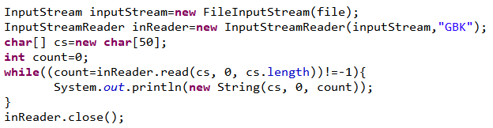
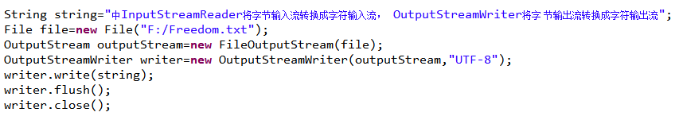
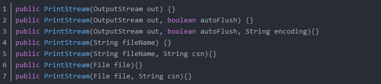
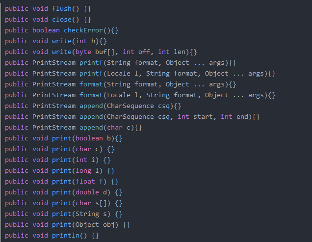
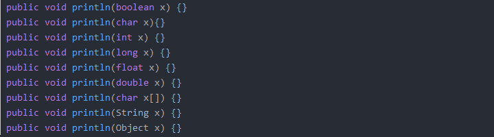
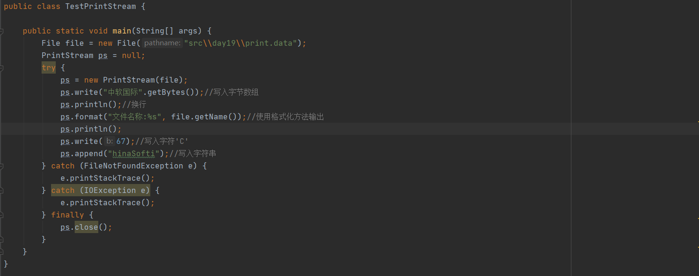
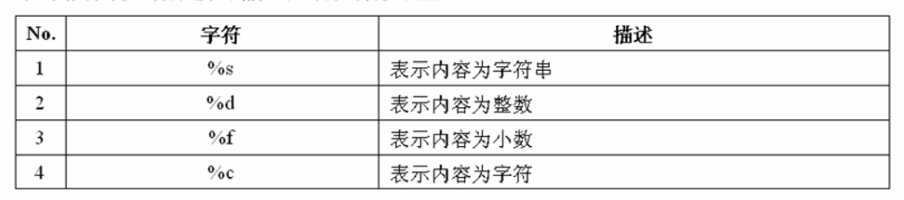
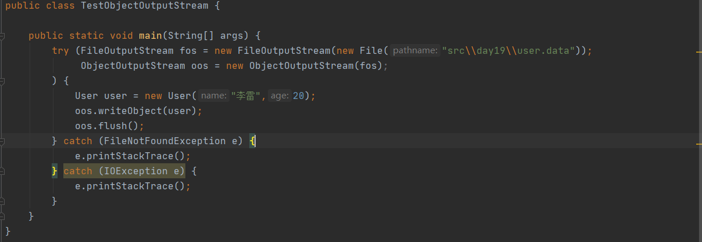
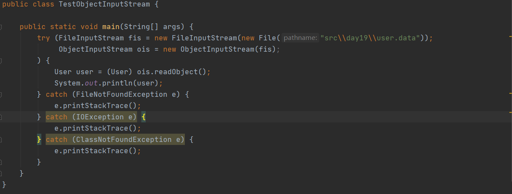

# 第17天 IO流

## 主要内容

## 1、掌握转换流的使用

## 2、掌握打印流的使用

## 3、掌握对象流的使用

## 学习目标

| 节数    | 知识点           | 要求 |
|---------|------------------|------|
| 第一节  | 掌握转换流的使用 | 掌握 |
| 第二节  | 掌握打印流的使用 | 掌握 |
| 第三节  | 掌握对象流的使用 | 掌握 |

## 掌握转换流的使用

Java IO流中提供了两种用于将字节流转换为字符流的转换流。其中InputStreamReader用于将字节输入流转换为字符输入流，其中OutputStreamWriter用于将字节输出流转换为字符输出流。使用转换流可以在一定程度上避免乱码，还可以指定输入输出所使用的字符集

## 掌握打印流的使用

打印流是输出信息最方便的类，注意包含字节打印流PrintStream和字符打印流：PrintWriter，打印流提供了非常方便的打印功能

PrintStream

构造方法：

1、创建了默认编码方式的PrintStream流,字节输出流out作为PrintStream流的输出流,不自动刷新.

2、创建默认编码方式的PrintStream流,字节输出流out作为PrintStream流的输出流,传入是否自动刷新的参数autoFlush.

3、创建了指定编码名称encoding的PrintStream,字节输出流out作为PrintStream流的输出流.传入是否自动刷新的参数autoFlush.

4、创建了指定文件名称,默认字符编码方式的PrintStream流,FileOutputStream流作为PrintStream流的输出流.不自动刷新.

5、创建指定了文件名称和字符编码名称csn的PrintStream流,FileOutputStream作为PrintStream流的输出流.不自动刷新.

6、创建指定文件对象File和默认编码方式的PrintStream流,FileOutputStream作为PrintStream流的输出流.不自动刷新.

7、创建指定文件对象File和编码名称csn的PrintStream流,FileOutputStream作为PrintStream流的输出流.不自动刷新.

常用方法：

flush()----刷新流,将缓冲的数据写到底层输出流中.

close()---关闭流,释放关联的资源.

checkError()---检查流中异常状态,如果PrintStream流中有异常抛出,返回true.

write(int b)----将单个字节b写到PrintStream流中.

write(byte buf[] ,int off,int len)----将字节数组buf中off位置开始,len个字节写到PrintStream流中.

printf(String format, Object ... args)----将数据args按照默认的Locale值和format格式进行格式化后写到PrintStream流中,方法执行等同于out.format(format, args)

printf(Locale l, String format, Object ... args)----将数据args根据Locale值和format格式进行格式化后写到PrintStream输出流中,方法执行等同于out.printf(l, format,args).

format(String format, Object ... args)----根据默认的Locale值和format格式来格式化数据args.

format(Locale l, String format, Object ... args)----将数据args根据Locale值和format格式进行格式化.

append(CharSequence csq, int start, int end)----将字符序列csq中start(包含)位置到end(不包含)之间的子字符序列添加到PrintStream输出流中,此方法执行等同于out.print(csq.subSequence(start, end).toString()).

append(char c)----将单个字符添加到PrintStream输出流中.此方法执行等同于out.print(c).

## 格式化输出

JAVA对PrintStream功能进行了扩充，增加了格式化输出功能。直接使用Print即可。但是输出的时候需要指定输出的数据类型。

public static void main(String arg[]) throws Exception{

PrintStream ps = null ; // 声明打印流对象

// 如果现在是使用FileOuputStream实例化，意味着所有的输出是向文件之中

ps = new PrintStream(new FileOutputStream(new File("d:" + File.separator + "test.txt"))) ;

String name = "中软" ; // 定义字符串

int age = 30 ; // 定义整数

float score = 990.356f ; // 定义小数

char sex = 'M' ; // 定义字符

ps.printf("姓名：%s；年龄：%d；成绩：%f；性别：%c",name,age,score,sex) ;

ps.close() ;

}

## 掌握对象流的使用

##### 什么是序列化和反序列化

序列化：

把对象转换为字节序列存储于磁盘或者进行网络传输的过程称为对象的序列化。

反序列化：

把磁盘或网络节点上的字节序列恢复到对象的过程称为对象的反序列化。

##### 对象的输入输出流的作用： 用于写入对象 的信息和读取对象的信息。 使得对象持久化。

ObjectInputStream : 对象输入流

ObjectOutPutStream ：对象输出流

### 本节作业

1.  掌握对象序列化概念
2.  掌握序列化对象的操作方法
3.  编写程序实现多个对象(数组或追加的形式)的序列化和反序列化
