# Java语言入门

## 主要内容

1、了解计算机语言发展简史

2、了解Java发展简史

3、熟悉Java语言特性

4、掌握Java的加载与执行

5、熟练常用DOS命令

6、掌握JDK的安装及环境配置

7、熟练文本编辑器Notepad++的使用

8、掌握public class 和 class的区别

9、掌握标识符的命名规则

10、熟悉Java中关键字

## 学习目标

| 节数    | 知识点                          | 要求 |
|---------|---------------------------------|------|
| 第一节  | 了解计算机语言发展简史          | 掌握 |
| 第二节  | 了解Java发展简史                | 掌握 |
| 第三节  | 熟悉Java语言特性                | 掌握 |
| 第四节  | 掌握Java的加载与执行            | 掌握 |
| 第五节  | 熟练常用DOS命令                 | 掌握 |
| 第六节  | 掌握JDK的安装及环境配置         | 掌握 |
| 第七节  | 熟练文本编辑器Notepad++的使用   | 掌握 |
| 第八节  | 掌握public class 和 class的区别 | 掌握 |
| 第九节  | 掌握标识符的命名规则            | 掌握 |
| 第十节  | 熟悉Java中关键字                | 掌握 |

## 了解计算机语言发展简史

计算机语言总的来说分为机器语言，汇编语言，高级语言三大类。而这三种语言也恰恰是计算机语言发展历史的三个阶段。

第一阶段

1946年2月14日，世界上第一台计算机ENAC诞生，使用的是最原始的穿孔卡片。这种卡片上使用的语言是只有专家才能理解的语言，与人类语言差别极大，这种语言就称为机器语言。机器语言是第一代计算机语言。这种语言本质上是计算机能识别的唯一语言，人类很难理解。以后的语言就是在这个的基础上简化而来。虽然后来发展的语言能让人类直接理解但最终送入计算机的还是这种机器语言。

第二阶段

计算机语言发展到第二代，出现了汇编语言。汇编语言用助记符代替了操作码，用地址符号或标号代替地址码。这样就用符号代替了机器语言的二进制码。汇编语言也称为符号语言。比起机器语言，汇编大大进步了。尽管还是复杂，用起来容易出错，但在计算机语言发展史上是机器语言向更高级的语言进化的桥梁。

第三阶段

当计算机语言发展到第三代时，就进入了“面向人类”的高级语言。高级语言是一种接近于人们使用习惯的程序设计语言。它允许用英文写计算程序，程序中的符号和算式也与日常用的数学式子差不多。高级语言发展于20世纪50年代中叶到70年代，流行的高级语言已经开始固化在计算机内存里了，比如 basic语言。现在，计算机语言仍然在不断的发展，种类也相当多，比如 FORTRAN语言， COBOL语言，C语言，C++，C\#， PASCAO，JAVA等等。

## 第二节 了解Java发展简史

### Java简介，Java历史介绍

Java简介

【内容】

所属公司、发明者、发布时间，Java的前身，衍生自哪种语言，Java历史概述。

【说明】

要说一下Java的读音，美语发音类似“扎喔”，以及它的日语发音，即“加瓦”，这样叫的人很多，但实际是日语发音。当然还有德语发音“鸭瓦”、瑞典语发音“野袜”等就不用说了。

Java的所属公司要讲一下是Sun公司开发的，但是现属于Oracle公司产品，以及收购的时间（要注意是2009年宣布的收购，2010年完成的收购）。收购价格为74亿美元讲不讲都行。可以对Sun和Oracle做一下简述，如Sun是斯坦福大学网络的缩写，Sun的主要产品线等，Oracle的中文名，Oracle创始人埃里森的事迹（世界上最有争议的CEO），Oracle的产品线等，这属于计算机文化常识范畴。

Java之父詹姆斯·亚瑟·高斯林讲一下，最好对他个人经历简述一下，以及说一下他从十年前就和Java没关系了（2010年4月份从Oracle离职）。高斯林和乔布斯同岁，他比乔布斯小三个月。

现在负责Java项目的是马克·莱茵霍尔德（Java首席架构师），但是不说他也可以。

关于Java的时间众多，如Oak开始设计的时间，Oak完成的时间，改名为Java的时间，Java发布的时间，Java 1.0的发布时间都是不同的，不需要讲那么多，但学生重点记住的是Java的发布时间，即1995年5月23日（但是这绝不是Java诞生时间，也不是Oak改名为Java的时间），及1996年1月23日发布1.0。

Java衍生自C++要说一下，Java的完整的衍生过程为：Speedcode → FORTRAN → ALGOL → CPL → BCPL → B → C → C++ → Java，这个是我们需要知道的（这里的前三代语言同样也是Python的前三代祖先），对学生不用讲这么多，但是C++得说明。而实际上，Java并不只衍生自C++一种语言，它还吸收了如Mesa、Modula-3等很多语言的特性，这一点就不用和学生说了。

Java还有很多后代语言，如比较主流的Scala、Kotlin、Groovy等。后期要讲到基于Groovy的Gradle，以及Spring的Groovy配置文件。

Java曾经有两个变种语言，即微软公司的J++和J\#，J++因违反Sun公司授权协议而被迫终止，但是J++的终止促使了C\#的诞生（C\#是比尔盖茨从Borland公司挖来的安德斯·海尔斯伯格开发的，他是Delphi之父、C\#之父、TypeScript之父），C\#诞生之初吸取了很多Java的特性，但是后来Java又吸取了很多C\#的特性，现在它们俩是互相吸取对方的特性而升级着，J\#是.NET平台出现之后的，后来也不发展了。

Java历史概述，可以从Green计划和FirstPerson公司开始，讲到Oak的诞生，为什么叫Oak（Oak一开始叫Greentalk，这个说不说都行），主要市场方向，Green计划的失败，转型为互联网产品，为什么改名为Java，Java名字的来历等。

也可以介绍一下Java在编程语言中的分类，如Java是高级语言（那你也得解释一下什么是低级语言，中级语言，它们的区别），如Java是面向对象语言（那你也得解释一下面向过程语言，这两者的区别，实际上大多数主流语言都是面向对象的），如Java是命令式语言（那你也得解释一下什么是函数式语言、指令式语言、它们的区别），如Java是强类型语言（那你也得解释一下什么是弱类型语言，这两者的区别）。

如果你说了Java是面向对象的语言，请不要说它是完全面向对象的，或者纯面向对象的，因为Java不是这样的。

面向对象语言分类很复杂，有不完全面向对象的语言、完全面向对象的语言、纯面向对象的语言、基于对象的语言、基于原型的面向对象语言等等。

### 2.2 Java平台的组成部分

【内容】

JVM，JRE，JDK

【说明】

要说明JVM是什么，作用，以及跨平台，需要画图说明一下不跨平台有什么问题、跨平台的好处，以及为什么有了JVM就能实现跨平台，但并不是跨所有的平台，而是跨了大多数主流平台，最起码iOS还不支持，并且以前的CP/M、DOS等系统也不支持JVM（但早期Python有DOS版本）。

注意Java并不是第一个采用虚拟机技术的语言，在此之前也有很多，如Java的祖太爷BCPL就是基于虚拟机运行的。

Java的口号是一次编译到处运行，但也仅仅是口号而已，有些情况就实现不了，比如使用了JNI（Java本地化接口）后针对不同平台需要重新编译，再比如文件操作时，如果使用了绝对路径，如什么“C:\\...”、”D:\\...”之类，就直接锁定了Windows，苹果系统、Unix/Linux等都用不了了。

最好说明一下JVM的种类有很多，官方现行的JVM是HotSpot，其他的如J9 VM、Zing VM等，以及以前的JRockit，它已经被Oracle收购，并且融入到了现在的HotSpot中。

HotSpot的历史可说可不说，如它来源于Strongtalk（Smalltalk的一个强类型版本），是朗维尤公司开发的，后被Sun公司收购。但是在Java 1.3之前用的不是HotSpot，而是Classic VM。

Java程序默认是运行在JVM上的，但不是绝对这样，使用第三方技术可以让Java程序运行在其他平台上，如使用RemObject的产品可以将Java程序编译成运行在CLR（公共语言运行时，.NET平台的虚拟机）上的程序。

主流的JVM都是用C和C++写的，但是还有一些自举式JVM，即用Java编写的JVM，这种方式在C、C++、Pascal等语言中非常常见。

JVM支持的语言有上百种，不只是Java，只不过Java是官方的，其他的还有Scala、Kotlin、Groovy、Clojure、Ceylon、Jython、JRuby等等。

说明一下Java字节码，Java源代码首先要编译成字节码，之后运行在JVM上，所以说看似JVM支持非常多的语言，但从本质上讲，JVM就支持字节码一种而已。

说明JRE是什么，它包含什么，它的作用。要说明Java程序并不是直接运行在JVM上，而是运行在JRE上，它是运行Java程序的最小单位，举个例子说明，就好比JVM是一台裸机，没办法直接运行程序，而JRE就相当于裸机+操作系统，所以它就可以运行程序。

说明JDK是什么，它包含什么，它的作用。要想开发Java程序就得装JDK，因为JRE没有编译工具和打包工具等。

以及官方的JDK是Oracle JDK，其他的还有OpenJDK等，Linux上默认提供的就是OpenJDK，官方的JDK已收费，但是OpenJDK是完全免费的，所以说虽然Java是开源的，但免不免费就不一定了，免不免费的JDK都有很多。其它的产品还有Zulu（基于OpenJDK）、Open J9（基于OpenJDK或HotSpot）等。

### Java的版本类型

【内容】

Java SE、Java EE、Java ME、Java Card等。

【说明】

说明Java SE是什么，它能做什么，以及为Java EE提供了基础。还有它以前叫J2SE（Java 2平台时代）等。

说明Java EE是什么，它能做什么，需要说明Java EE只是一套规范，具体由第三方厂商实现，如Tomcat、Jetty、WebLogic、WebSphere等，其中WebLogic是Oracle官方的（但也是收购自BEA的），根据实现的规范多与少，分为重量级和轻量级两类。

Java EE以前叫J2EE，Oracle已经将它捐献给了eclipse基金会，现在已经不叫Java EE了，而叫Jakarta EE了（因为Oracle公司不让别的公司有Java字样）。如果愿意解释一下Jakarta是咋回事也行，在英语中是雅加达的意思，但是在计算机中它是Apache软件基金会以前的一个顶级项目名称（如Tomcat、Maven、Struts等以前都是Jakarta的独立子项目），Jakarta EE自然和Apache的Jakarta项目是没关系的，只不过借用了一下这个名字。

需要说明一下在实际开发中不会直接用Java EE，而是会使用各种框架来代替Java EE，通俗的说就是Java EE使用起来很麻烦（但是框架不能真正的绕开Java EE，只不过是将Java EE封装起来了，所以Java EE是框架的底层，学它是给框架打基础）。

说明Java ME是什么，它能做什么，Java ME是Oak项目的初衷，即开发智能家电等设备上的程序，如机顶盒、电烤箱、电冰箱、电梯上的程序，以前的功能手机（就是带键盘，不是智能机的那些）中的程序，以及半智能的塞班，也有很多用Java开发，即KJava。现在Java ME基本上趋于淘汰，注意安卓程序不是Java ME的，它是使用Java语言以及安卓SDK的。

简单说明Java Card即可，它是Java的智能卡版本，可以开发如ATM卡、SIM卡上的程序。还有其他的一些版本，如嵌入式Java SE，就不一一说明了。

### Java的版本

【内容】

简述一下从Java 1.0到Java 14之间的版本。

【说明】

Java到现在有15个版本，但是可以从几个阶段来概括，如：

①最初的Java：1.0、1.1

②Java 2平台：1.2、1.3、1.4、5（1.5）

说明一下从5开始，原来的主版本号消失，次要版本号变成了主版本号这件事。这么做没有啥特别的原因，只不过是Sun公司的喜好问题，Sun公司对于他们的Solaris操作系统也是这么干的。

③走出Java2：6（之后的都不是Java 2了，它是Sun的最后一个版本）

④易主Oracle：7（之后的都是Oracle的了）、8

⑤新举措—每半年发布一个新版本：9、10、11、12、13、14。

这样分阶段就好记了。必须要强调一下长期维护版本和短期维护版本，否则以后的版本选择会出问题，8之后的下一个长期维护版本是11，所以9、10、12、13、14都不会用在实际开发中，这些短期维护版本只不过是为长期维护版本促成了稳定的新特性。

**第三节 熟悉Java语言特性**

java语言主要特点：

1、简单

java语言是一种面向对象的语言，但是java又不像c++那样复杂，java语言中删减了很多让C、C++程序员头疼的问题，如指针变量、多重继承、头文件、运算符重载等复杂的知识点。不过，java语言虽然简单，但是也很高效，可以通过面向对象的思想描述事物的每一个动作。

2、面向对象

java语言是真正面向对象设计的编程语言，程序代码大多都体现了类机制，以类的形式组织，由类来定义对象的各种行为与属性。java的面向对象的特点主要体现在封装、继承、多态、抽象等四个方面。

3、平台无关性

"一处编译，到处运行"。java程序编译之后生成与平台无关的字节码文件，java程序运行时只需要JVM（java 虚拟机）对字节码文件进行解释，体现了平台的无关性。因此，具有很强的移植性。

4、交互式特性

由于它支持TCP/IP协议，使得用户可以通过浏览器访问到Internet上的各种动态对象。并且在网络上用户可以交互式地进行各种动作，而多线程技术的引入使得这种交互式操作更为容易。

5、多线程机制

多线程机制使得java程序可以并行处理多项任务，在交互式操作中经常用到。

6、动态内存管理机制

java语言采用了自动垃圾回收机制进行内存的管理。在c++语言中，程序员在编写程序时要仔细处理内存的使用，需要程序员自己对内存进行及时的释放，不然就存在内存泄露等不可预知的问题。但是在java虚拟机（JVM）中包括了一个垃圾回收器，可以对程序中产生的对象进行跟踪，“知道”那些对象已经是无用的了，然后会在“恰当的时机”对无用的内存进行释放，为程序员大大减少了内存管理方面的问题。

7、安全性

Java语言在安全性方面引入了实时内存分配及布局来防止程序员直接修改物理内存布局;通过字节代码验证器对字节代码的检验，以防止网络病毒及其它非法代码侵入。

1.  **掌握Java的加载与执行**

1.Java程序分为两个阶段：编译阶段和运行阶段（前提需已经安装了JDK工具包）

1.1编译阶段：

主要检查已经编写好的源文件是否符合Java的语法规则，符合的则生成字节码（.class）文 件，否则不生成字节码文件；使用Javac.exe命令进行编译，使用方法：javac（空一格）名字.java

拓展：—字节码文件不是纯粹的二进制文件，字节码文件无法直接在操作系统中执行，需要JVM进行解释后 才可以执行。

—Javac.exe是Java的一个编译器工具/命令，应用在dos窗口；

—一个Java文件可以生成多个 .class 文件；

—生成 .class文件后删除Java源文件不影响程序的运行，但一般不会删除，需要用作修改与维护。

1.2运行阶段：

JDK工具包除了自带javac.exe还有一个java.exe工具/命令（使用在dos窗口），这个命令主要负责运行阶段；使用Java.exe命令运行程序，使用方法：java（空一格）名字。

过程：

编辑好源文件后，启动dos窗口并进入源文件所在的文件夹中，使用javac.exe命令进行编译，编译生成.class文件后，使用java.exe命令运行程序，此时java.exe命令会启动JVM，JVM则启动类装载器，类装载器则会寻找.class文件并装载到JVM当中，JVM对.class文件进行解释成二进制后，操作系统执行二进制和底层硬件平台进行交互。

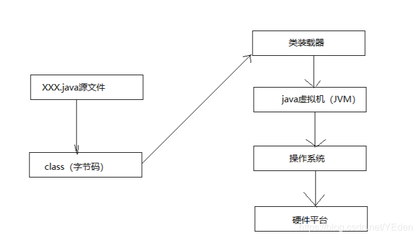

1.  **熟练常用DOS命令**

启动方式1：进入DOS页面：win+R；键入：cmd

启动方式2：“开始”→“运行”→输入“cmd”回车，此时将出现一个显示命令提示符的窗口，如下图。

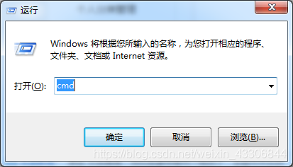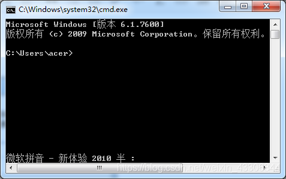

**1，help命令**：help ——》查看所有命令帮助；help 某某某——》 查看具体某个

命令的帮助

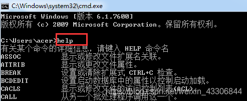

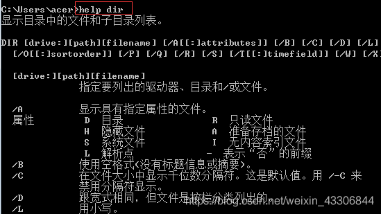

**2，dir命令**

该命令显示一个目录下的文件和子目录列表以及文件的其他详细资料，包括文件大小，创建日期和时间等。语法是：

dir [drive:驱动器名称][path目录路径] [/p] [/w] [/o] [/s]

[/p] 表示分页显示目录内容。要查看下一屏幕,可按任意键。

[/w] 表示以宽列表格式显示当前目录中的文件名

[/o] 表示以分类顺序显示文件

[/s] 表示显示当前目录及其子目录中所有文件的列表。

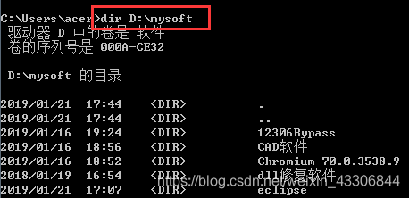

**3、copy**

该命令将一个或多个文件复制到另一个位置。语法是：

copy [要复制的文件名] [复制到的路径或文件夹]

**4、move**

该命令用于将文件或目录从一个位置移到另一个位置。复制和移动的区别在于**move命令将文件从源位置删除**。语法是：

move [要移动的文件名] [文件移到的路径或文件夹]

5、**md或mkdir**

该命令用于新建目录。语法是：

md [path表示即将创建的目录的路径] [directoryname表示所有创建的目录名称，此参数必须要有]

**6、cd**该命令用于改变当前目录。语法是：

cd [某个盘d: c: 等]

cd [\\] 进入到根目录

cd [..]进入到上一级目录

**7、ren**

该命令用于重命名文件或文件夹。语法是：

ren [oldfilename旧名字] [newfilename新名字]

**8、del**

该命令用于删除目录中的文件。要删除其它驱动器或目录中的文件，则必须指定路径。语法是：

del [filename表示要删除的文件名]

**9、rd或rmdir**

该命令用于删除文件夹。语法是：

rd [directoryname表示要删除的文件夹名称]

**10、cls**

该命令用于清除屏幕。

**11、exit**

该命令用于退出CMD.EXE 程序。

**12，type**

显示文件内容  
 type 文件名.扩展名

1.  **掌握JDK的安装及环境配置**

**6.1下载JDK，安装JDK，配置环境变量。**

【说明】

讲课的时候当然是把JDK直接拷给学生，但是需要告诉它们如何下载，告诉学生官网下载方式，不建议去别的网站下载，这是一个良好的习惯。

如果课件上有官网下载截图的话，需要重新再截一个，因为页面已经改版了。

安装JDK，Java 8及以前版本只有安装包，但是Java 9开始同时提供了安装包和免安装方式（下载后解压即可使用）。即使是安装的JDK，拷到哪也一样能用。

注意安装路径，不建议选择带空格的（如Program Files），带不带空格对学习Java没丝毫影响，但是如果学生以后学习大数据就会有影响，因为Hadoop不直接支持空格，但是可以使用类似DOS的短名称方式（即带有波浪线的），但是也麻烦啊。

如果不下载安装JDK的话，可以使用sdkman来安装JDK，它可以方便的切换当前使用的版本，但是在Windows上配置sdkman很麻烦，学生不容易上手，如果是用Linux讲课，倒是可以讲讲sdkman，真的是非常方便好用。

配置环境变量，如JAVA_HOME和path等，CLASSPATH和JRE_HOME可以以后讲。现在的Java不配置JAVA_HOME也一样用，只不过后续学习中有一些软件需要用JAVA_HOME，如果现在不配置，以后配置也一样。

配置：在系统的环境变量中配置path和classpath【每个操作系统配置环境变量的操作路径有所差别，多数可以右键点击 我的电脑-属性-高级系统配置-环境变量设置】

path值增加： C:\\Program Files (x86)\\Java\\jdk1.7.0_79\\bin;

classpath值增加：.;【.表示当前路径】

设置了path路径，就能够使用JDK提供的工具，工具都位于bin目录；

设置了classpath路径，就能够运行classpath下的.class文件，后续将具体使用；

1.  **熟练文本编辑器Notepad++的使用**

也许很多人会有疑问，为什么学习java不用常用的集成开发环境eclipse或者NetBeans等集成开发环境，又方便又快捷，而要采用没有任何提示而且完全要用手敲的Notepad++呢？笔者认为作为一个java小白来说，刚开始接触java，什么都不知道，如果一开始就选择集成开发环境工具作为初学者的编译工具，这样不利于对Java的理解和学习。选择则使用Notepad++作为编译器的主要原因如下：   
1.本人比较熟悉Notepad++这个文本编辑工具。   
2.没有提示功能，可以我们在学过程中有利于提升敲代码的速度。   
3.目录结构简单，初学者更容易接受。   
4.编译过程是分步骤的，更有利于掌握和理解java编译的原理和规则。

**Notepad++的安装**

下面所使用的Notepad++的6.8.7版本，因为这个版本里面安装后就自带Plugin Manager插件管理菜单栏，而7以后的版本安装时没有这个插件管理栏选项，需要自己去官网下载，有点麻烦。   
安装步骤：   
1.打开下载后的Notepad++，选择简体中文；   
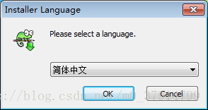   
2.选择下一步，直到选择安装位置，选择自己的安装目录，点击下一步；   
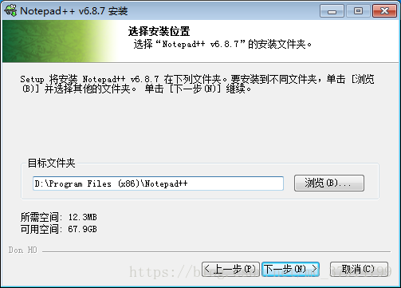   
3.选择自定义安装或者全选（要勾选Plugin Manager选项）点击下一步；   
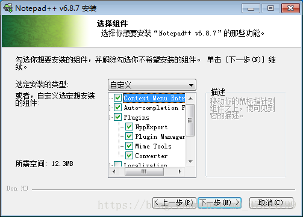   
4.勾选中间两个选项，允许加载和使用插件、创建桌面图标，点击安装；   
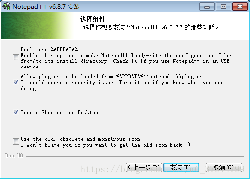   
5.安装完成，确定运行Notepad++；   
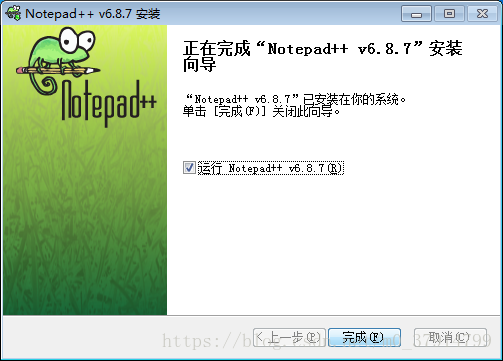   
6.左击菜单栏的 插件-\>Plugin manager -\>Show Plugin manager出现如下界面，勾选NppExec插件并安装；   
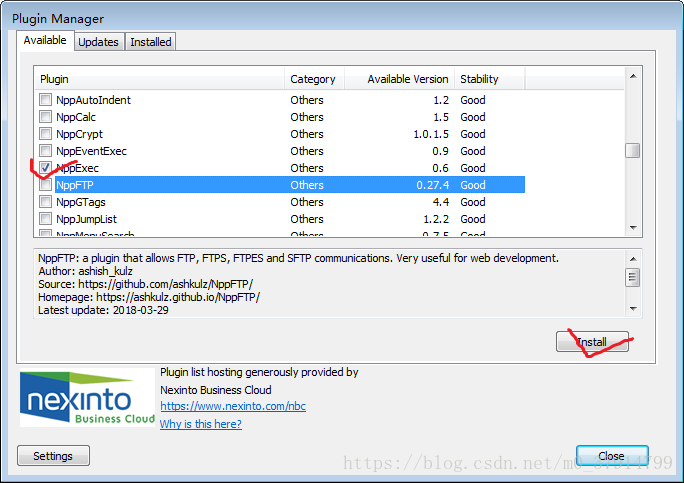   
7.安装后确认重启软件，在左击插件就能看到多了一个名为NPPExec的插件。

**Notepad++配置java环境变量**

配置java环境变量的实质就是把java安装目录的javac和java命令的路径配置到Notepad++中，从而在点击编译的时候，能够正确地执行javac编译命令和java运行命令。   
配置步骤：   
1.左击NppExec - \>点击Execute，出现如下配置界面；   
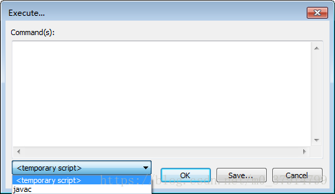   
2.勾选temporary script,将 cd "\$(CURRENT_DIRECTORY)" java \$(NAME_PART)复制到上面方框中，点击保存，命名为java选择Ok这样java命令就配置好了，同样javac的配置也是一样，新建一个temporary script将NPP_SAVE javac "\$(FULL_CURRENT_PATH)"复制到上述方框中保存命名就完成了。  
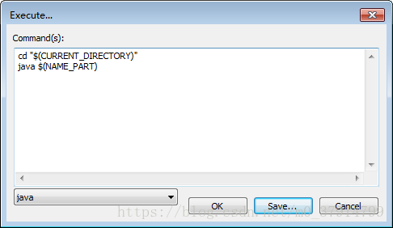   
3.再配置编译和运行的一整套的命令run，新建一个temporary script 将NPP_SAVE javac "\$(FULL_CURRENT_PATH)"  
cd "\$(CURRENT_DIRECTORY)" java \$(NAME_PART)复制到方框中报名并命名为run就可以了；

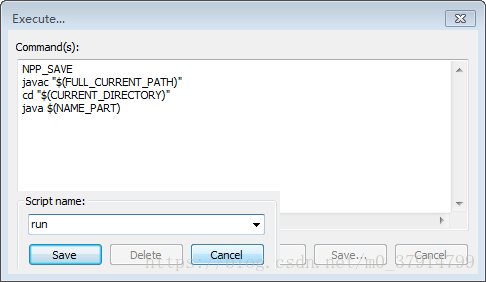   
4.左击NppExec - \>点击Advanced Options,依次勾选如下选项，将需要的命令添加菜单栏，添加后重启软件；   
   
   
5.左击菜单栏的宏，你就会看到你添加进来的命令的名字；

**编辑和运行一个java程序**

在Notepad++新建一个文件，编写一个java程序，然后保存给文件取一个和类名一样的.java文件，然后左击宏 -\> 左击javac命令Console窗口就会弹出来，同时文件目录下会多一个同名的.class文件，再点击宏 -\>左击java时Console串口就会打印Hello World！；直接删除.class文件，再左击宏 -\> 左击run，Console打印出运行的结果。   
效果如下：   
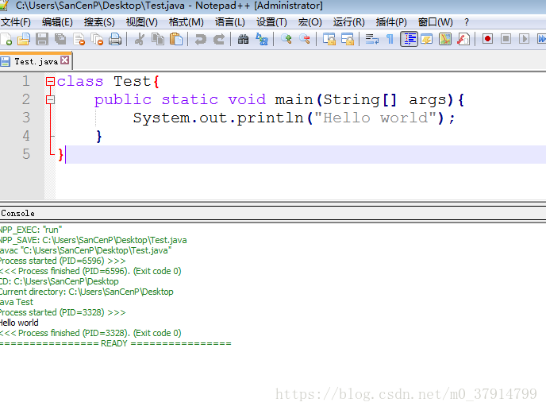   
最终实现了Notepad++的java编译环境的创建

1.  **掌握public class 和 class的区别**

在编写类的时候可以使用两种方式定义类：

public class定义类:

class定义类:

如果一个类声明的时候使用了public class进行了声明，则类名称必须与文件名称完全一致。

范例：定义一个类(文件名称为：Hello.java)

public class HelloDemo{ //声明一个类，类名称的命名规范：所有单词的首字母大写

public static void main(String args[]){ //主方法

System.out.println("HelloWorld!!!"); //系统输出，在屏幕上打印

}

};

此类使用public class声明，类名称是HelloDemo，但是文件名称Hello.java，所以，此时编译时会出现如下问题:

Hello.java:1 类 HelloDemo 是公共的，应在名为HelloDemo.java文件中声明

public class HelloDemo{ //声明一个类，类名称的命名规范：所有单词首字母大写

1、错误

以上的错误提示表示：因为使用的是public class声明，所以类名称应该与文件名称完全一致，即应该使用"HelloDemo.java"表示类的名称。

如果类的声明使用了class的话，则类名称可以与文件名称不一致，但是执行的时候肯定执行的是生成后的名称。

范例：有如下代码(文件名称为:Hello.java)

class HelloDemo{

public static void main(String args[]){

System.out.println("HelloWorld!!!");

}

};

文件名称为Hello.java，文件名称与类名称不一致，但是因为使用了class声明所以，此时编译不会产生任何错误，但是生成之后的\*.class文件的名称是和class声明的类名称完全一致的:HelloDemo.class

执行的时候不能再执行java Hello，而是应该执行javaHelloDemo

在一个\*.java的文件中，只能有一个public class的声明，但是允许有多个class的声明

public class Hello{

public static void main(String args[]){

System.out.println("HelloWorld!!!");

}

};

class A{};

class B{};在以上的文件中，定义了三个类，那么此时程序编译之后会形成三个\*.class文件。

1.  **掌握标识符的命名规则**

一：一般标识符命名规则

1 .标识符由大小写字母、下划线, 数字, \$符号组成；

2.开头可以是大小写字母, 下划线, 和\$符号.(数字不能开头),不能使用除了下划线和\$符以外的任何特殊符号；

3.标识符长度没有限制；

4.标识符不能是关键子和保留字

标识符的命名最好起的有意义见其名知其意 ,Java语言对字母的大小写有严格的要求.所有自定义标识符需全部遵循标识符的命名规范.

二：变量和方法的命名规则（两个命名方法一样）：

变量的命名在上面规则的基础上，采用驼峰命名法:

1.如果是单个单词, 单词全部字母小写. 如:intcount;

2.如果是由多个单词组成的复合单词, 除第一个单词外, 其后所有单词首字母大写. 如: codeName;

三：常量的命名规则

常量命名在上面规则的基础上 ，常量所有单词字母大写, 如果是由多个单词组成, 由下划线连接. 如:String PERSON_NAME;

四：类的命名规则

类的命名在上面规则的基础上，采用帕斯卡命名法:类名的所有单词首字母均大写. 如Person{} , DataCenter{};

五：包的命名规则

用小写的字母来命名，格式:域名 + 项目名 + 模块名 + 层，中间用“.” 隔开 如: org.itfuture.domain.sorts

**第十节 熟悉Java中关键字**

**10.1 关键字**

在编程语言中有一些事先定义的，有着特殊含义和用途的单词。

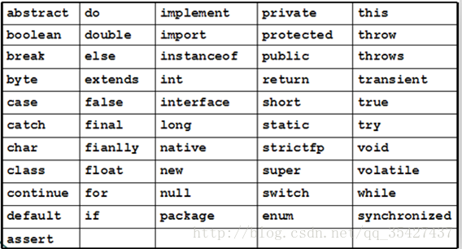
