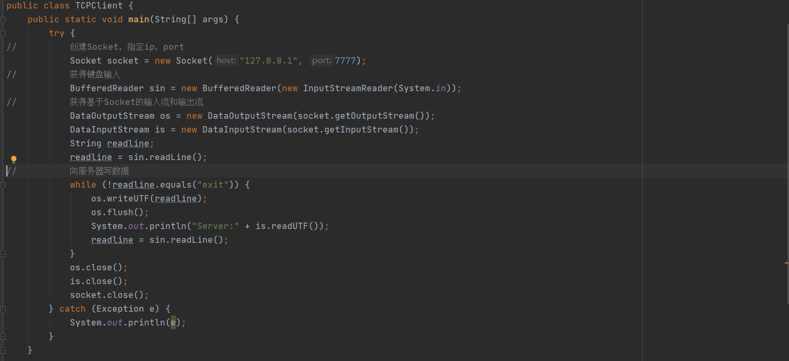
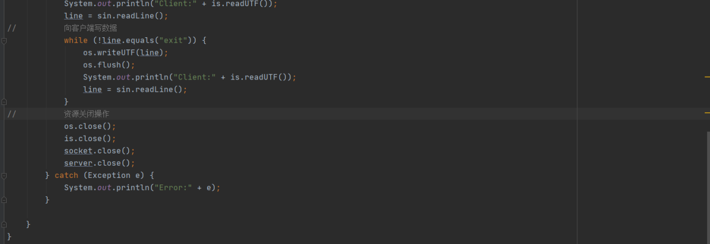
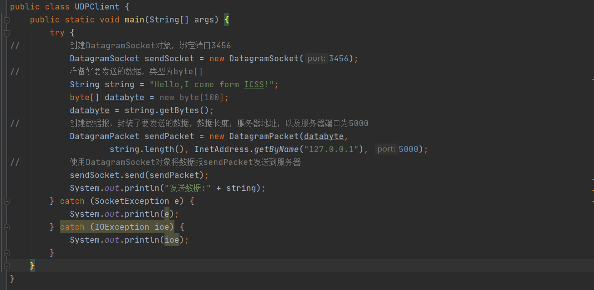
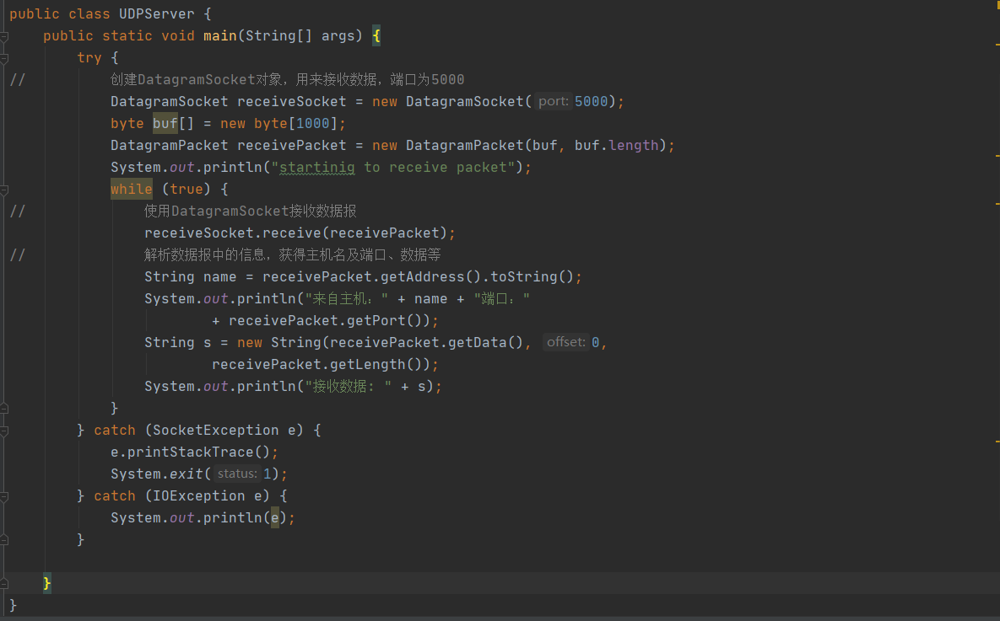

# 第21天 网络编程Socket

## 主要内容

## 1、掌握网络基础概述

## 2、熟练Socket编程-TCP编程

## 3、熟练Socket编程-UDP编程

## 学习目标

| 节数   | 知识点                 | 要求 |
|--------|------------------------|------|
| 第一节 | 掌握网络基础概述       | 掌握 |
| 第二节 | 熟练Socket编程-TCP编程 | 掌握 |
| 第三节 | 熟练Socket编程-UDP编程 | 掌握 |

## 掌握网络基础概述

### 端口号

所谓的端口，就好像是门牌号一样，客户端可以通过ip地址找到对应的服务器端，但是服务器端是有很多端口的，每个应用程序对应一个端口号，通过类似门牌号的端口号，客户端才能真正的访问到该服务器。为了对端口进行区分，将每个端口进行了编号，这就是端口号。

TCP与UDP段结构中端口地址都是16比特，可以有在0---65535范围内的端口号，一般0---1024为系统使用。

### 1.2 TCP/IP 、UDP

TCP/IP传输协议，即传输控制/网络协议，也叫作网络通讯协议。它是在网络的使用中的最基本的通信协议。TCP/IP传输协议对互联网中各部分进行通信的标准和方法进行了规定。并且，TCP/IP传输协议是保证网络数据信息及时、完整传输的两个重要的协议。TCP/IP传输协议是严格来说是一个四层的体系结构，应用层、传输层、网络层和数据链路层都包含其中。

TCP/IP协议是Internet最基本的协议,其中应用层的主要协议有Telnet、FTP、SMTP等，是用来接收来自传输层的数据或者按不同应用要求与方式将数据传输至传输层；传输层的主要协议有UDP、TCP，是使用者使用平台和计算机信息网内部数据结合的通道，可以实现数据传输与数据共享；网络层的主要协议有ICMP、IP、IGMP，主要负责网络中数据包的传送等；而网络访问层，也叫网路接口层或数据链路层，主要协议有ARP、RARP，主要功能是提供链路管理错误检测、对不同通信媒介有关信息细节问题进行有效处理等。

用户数据报协议（UDP，User Datagram Protocol）为应用程序提供了一种无需建立连接就可以发送封装的 IP 数据报的方法。UDP是一种保留消息边界的简单的面向数据报的协议。UDP不提供差错纠正、队列管理、重复消除、流量控制和拥塞控制，但提供差错检测（包含我们在传输层中碰到的第一个真实的端到端（end-to-end）校验和）。这种协议自身提供最小功能，因此使用它的应用程序要做许多关于数据报如何发送和处理的控制工作。想要保证数据被可靠传递或正确排序，应用程序必须自己实现这些保护功能。一般来说，每个被应用程序请求的UDP输出操作只产生一个UDP数据报，从而发送一个IP数据报。而对于面向数据流的传输层协议（例如TCP），应用程序写入的全部数据与真正在单个IP数据报里传送的或接收方接收的内容可能没有联系。

### 1.3 Socket

在计算机通信领域，socket 被翻译为“套接字”，它是计算机之间进行通信的一种约定或一种方式。通过 socket 这种约定，一台计算机可以接收其他计算机的数据，也可以向其他计算机发送数据socket起源于Unix，而Unix/Linux基本哲学之一就是“一切皆文件”，都可以用“打开open –\> 读写write/read –\> 关闭close”模式来操作。即socket是一种特殊的文件，一些socket函数就是对其进行的操作（读/写IO、打开、关闭）。Socket()函数返回一个整型的Socket描述符，随后的连接建立、数据传输等操作都是通过该Socket实现的。

### 本节作业

1.  掌握网络中一些基本的概念

## 熟练Socket编程-TCP编程

### 2.1 实现Scoket通讯

### 本节作业

1.  理解Socket的作用
2.  掌握Socket、ServerSocket的用法

## 熟练Socket编程-UDP编程

### 3.1实现UDP通讯

### 本节作业

1.  了解UDP的特性
2.  掌握UPD使用方法

## 
