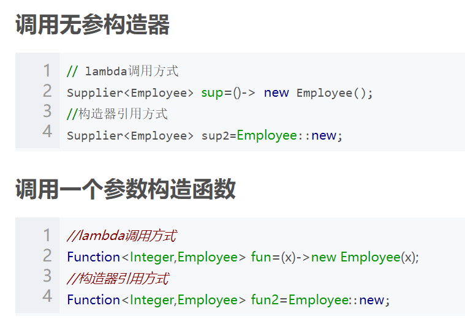

# 第22天 JDK8新特性

## 主要内容

## 1、掌握Lambda 函数

## 2、掌握方法引用

## 3、掌握函数式接口

## 4、掌握接口的默认方法、静态方法

## 5、掌握Stream常用API

## 6、掌握Optional类常用的API

## 7、掌握日期时间相关API

## 8、掌握Base64类常用API

## 学习目标

| 节数   | 知识点                       | 要求 |
|--------|------------------------------|------|
| 第一节 | 掌握Lambda 函数              | 掌握 |
| 第二节 | 掌握方法引用                 | 掌握 |
| 第三节 | 掌握函数式接口               | 掌握 |
| 第四节 | 掌握接口的默认方法、静态方法 | 掌握 |
| 第五节 | 掌握Stream常用API            | 掌握 |
| 第六节 | 掌握Optional类常用的API      | 掌握 |
| 第七节 | 掌握日期时间相关API          | 掌握 |
| 第八节 | 掌握Base64类常用API          | 掌握 |

## 掌握Lambda 函数

### 本节作业

1.Lambda表达式注意事项

## 掌握方法引用

### 

### 

### 本节作业

1.  Lambda表达式注意事项及几种形式：

一行代码、多行代码、无参数、一个参数，多个参数

## 掌握函数式接口

Lamb**da表达式**

3.2@FunctionalInterface注解

### 本节作业

1.Lambda表达式语法

2.@FunctionalInterface注解

## 掌握接口的默认方法、静态方法

默认方法

默认方法的声明很简单，直接在接口中把方法声明为default，之后再写方法的实现即可。这样所有的实现类都会继承这个方法

静态方法

静态方法，只能通过接口名调用，不可以通过实现类的类名或者实现类的对象调用。

如果多个接口中存在同样的static和default方法会怎么样呢？如果有两个接口中的静态方法一模一样，并且一个实现类同时实现了这两个接口，此时并不会产生错误，因为jdk8只能通过接口类调用接口中的静态方法，所以对编译器来说是可以区分的。但是如果两个接口中定义了一模一样的默认方法，并且一个实现类同时实现了这两个接口，那么必须在实现类中重写默认方法，否则编译失败。

### 本节作业

1.接口默认方法语法

2.接口静态方法语法

## 掌握Stream常用API

流是Java8引入的全新概念，它用来处理集合中的数据。众所周知，集合操作非常麻烦，若要对集合进行筛选、投影，需要写大量的代码，而流是以声明的形式操作集合，它就像SQL语句，我们只需告诉流需要对集合进行什么操作，它就会自动进行操作，并将执行结果交给你，无需我们自己手写代码。

代码实现：

根据条件筛选filter

跳过流的前n个元素skip

去除重复元素distinct

截取流的前n个元素limit

自然排序sorted

自定义排序sorted(Comparator comp)

是否匹配任一元素anyMatch

是否匹配所有元素allMatch

是否未匹配所有元素noneMatch

## 掌握Optional类常用的API

Optional类是为了避免空指针而生的，这是一个可以为null的容器对象。如果值存在则isPresent()方法会返回true，调用get()方法会返回该对象。

### 本节作业

1.掌握Optional类的意义

2\. Optional方法

## 掌握日期时间相关API

## Unix时间

### System.currentTimeMillis()

System.currentTimeMillis()

Java中System.currentTimeMillis() 返回的是从GMT 1970年1月1日00:00:00开始到现在的毫秒数(long型)。1970年是UNIX系统正式发布的时间，所以这一时间也称为UNIX时间戳(UNIX epoch)  
按照参考书自己实践了一番：

public static void main(String[] args){

long totalMillisSeconds=System.currentTimeMillis();

long totalSeconds=totalMillisSeconds/1000;

int nowSeconds=(int)totalSeconds%60;

long totalMinutes=totalSeconds/60;

int nowMinutes=(int)totalMinutes%60;

long totalHours=totalMinutes/60;

int nowHours=(int)totalHours%24;

System.out.println("GMT Time is : "+nowHours+":"+nowMinutes+":"+nowSeconds);

}

这里输出的时间总是跟当前时间系统对不上，输出的时间是“GMT Time is : 10:30:3”，而我系统的时间是18:30。最开始我还以为是自己的逻辑写错了？后来仔细查看并思考了一下，这里是输出的格林尼治0时区的时间，而我们是东8区，得加上8小时。

System.out.println(new Date(System.currentTimeMillis()));

System.out.println(new Date());

这两条语句输出的结果是一样的，查看了代码之后发现：

public Date() {

this(System.currentTimeMillis());

public Date(long date) {

fastTime = date;

}

无参构造方法调用有参构造方法，java不支持默认参数的方法，所以我等价看作：

public Date(long date=System.currentTimeMillis()) {

fastTime = date;

}

在网上还找到一个获得更小时间戳的函数

System.nanoTime();

返回值(long型)表示从某一固定但任意的时间开始算起的毫微秒数，与当前系统时间无关，由于溢出并不能准确的计算出已过时间，但是如果当作生成随机数seed还是很不错的，因为精确但无法去测和计算。  
用以下代码，在我的电脑环境下运行的时候出现了至少51次相同的数

int count=1000;

for (int i=0;i\<count;i++){

System.out.println(System.currentTimeMillis());

}

总的来说各有各的用处，又想用来计算时间的可以用currentTimeMillis，想要一个随机的不同的数可以用nanoTime,当然也有专门生成随机数的方法可以不用传入seed。

同时还找到了，Java实战项目里面介绍了一些不正确使用java.util.Random API的危害。这个教训告诉我们不要使用，会使随机数分布不均匀：

Math.abs(rnd.nextInt())%n

1

而使用：

rnd.nextInt(n)

### Date类

类 Date 表示特定的瞬间，精确到毫秒。

毫秒概念: 1000毫秒=1秒  
毫秒的0点: 时间原点; 公元1970年1月1日,午夜0:00:00 英国格林威治 毫秒值就是0

**Date类的构造方法**

/\*  
 \* Date类空参数构造方法  
 \* 获取到的是,当前操作系统中的时间和日期  
 \*/  
public static void function(){  
Date date = new Date();  
System.out.println(date);  
}  
  
/\*  
 \* Date类的long参数的构造方法  
 \* Date(long ) 表示毫秒值  
 \* 传递毫秒值,将毫秒值转成对应的日期对象  
 \*/  
public static void function_1(){  
Date date = new Date(0);  
System.out.println(date);  
}  

Date类的常用方法:

/\*  
 \* Date类方法 getTime() 返回值long  
 \* 返回的是毫秒值  
 \* 将Date表示的日期,转成毫秒值  
 \* 日期和毫秒值转换  
 \*/  
public static void function_2(){  
Date date = new Date();  
long time = date.getTime();  
System.out.println(time);  
}  
  
/\*  
 \* Date类方法 setTime(long )传递毫秒值  
 \* 将日期对象,设置到指定毫秒值上  
 \* 毫秒值转成日期对象  
 \* Date的构造方法  
 \*/  
public static void function_3(){  
Date date = new Date();  
System.out.println(date);  
  
date.setTime(0);  
System.out.println(date);  
}  

## SimpleDateFormat

SimpleDateFormat: 可以把一个日期对象格式化成一个文本(字符串) , 也可以把一个日期字符串解析成一个日期对象

构造方法:

public SimpleDateFormat():使用默认的模式来创建一个SimpleDateFormat对象

public SimpleDateFormat(String pattern):使用指定的模式（规则比如yyyy:MM:dd HH:mm:ss）来创建一个SimpleDateFormat对象

规则的定义

y 年  
M 月  
d 天  
H 时  
m 分  
s 秒

成员方法:

public String format(Date date): 把一个日期对象格式化成一个字符串  
public Date parse(String dateStr): 把一个日期字符串解析成一个日期对象 注意要以指定格式解析

案例一：

import java.text.SimpleDateFormat;

import java.util.Date;

public class MyTest {

public static void main(String[] args) {

Date date = new Date();

System.out.println(date.toString());

//格式化日期的类型

//使用空参创建SimpleDateFormat创建对象，那么使用的是默认的格式来格式化日期 19-5-2 上午10:56

SimpleDateFormat format = new SimpleDateFormat();

//格式化日期，返回的是格式化后的日期字符串

String format1 = format.format(date);

System.out.println(format1);

//我们可以指定格式来格式化日期

//规则的定义

//

//y 年

//M 月

//d 天

//H 时

//m 分

//s 秒

//E 星期几

SimpleDateFormat format2 = new SimpleDateFormat("yyyy-MM-dd HH:mm:ss E w W F");

String format3 = format2.format(date);

System.out.println(format3);

//Mon May 20 17:46:28 GMT+08:00 2019

//19-5-20 下午5:46

//2019-05-20 17:46:28 星期一 21 4 3

}

}

案例二：

import java.text.ParseException;

import java.text.SimpleDateFormat;

import java.util.Date;

public class MyTest2 {

public static void main(String[] args) throws ParseException {

String timeStr = "2018-01-01 15:30:30"; //Date

//注意解析时：日期字符串和SimpleDateFormat("yyyy-MM-dd HH:mm:ss");它里面的格式要对应，否则解析失败

SimpleDateFormat format = new SimpleDateFormat("yyyy-MM-dd HH:mm:ss");

Date date = format.parse(timeStr);

System.out.println(date); //Mon Jan 01 15:30:30 GMT+08:00 2018

}

}

日期工具类的编写和测试案例

案例一：

import java.text.ParseException;

import java.text.SimpleDateFormat;

import java.util.Date;

public class DateUtils {

//私有化构造

private DateUtils() {

}

//提供格式化好的日期字符串

public static String getDateString(String fomat) {

Date date = new Date();

SimpleDateFormat format = new SimpleDateFormat(fomat);

String dateStr = format.format(date);

return dateStr;

}

//提供返回Date 对象的方法

public static Date getDate(String dateStr, String format) throws ParseException {

SimpleDateFormat format1 = new SimpleDateFormat(format);

Date date = format1.parse(dateStr);

return date;

}

}

import java.text.ParseException;

import java.util.Date;

public class MyTest {

public static void main(String[] args) throws ParseException {

String string = DateUtils.getDateString("yyyy-MM-dd");

System.out.println(string);

String dateStr="2019-01-01 13:10:10";

Date date = DateUtils.getDate(dateStr, "yyyy-MM-dd HH:mm:ss");

System.out.println(date);

}

}

案例二：  
算一下你来到这个世界多少天?

a: 键盘录入一个生日(日期字符串)

b: 把这个日期字符串对象解析成一个日期对象

c: 获取b中的日期对象对应的毫秒值

d: 获取当前系统时间对应的毫秒值

e: 使用d中的毫秒值 - c中的毫秒值

f: 把e中的差值换算成对应的天 差值/1000/60/60/24

g: 输出

import java.text.ParseException;

import java.text.SimpleDateFormat;

import java.util.Date;

import java.util.Scanner;

public class MyTest2 {

public static void main(String[] args) throws ParseException {

//思路：先获取出你生日那天的毫秒值，再获取现在的毫秒值 两个相减差值换算成天数

Scanner sc = new Scanner(System.in);

System.out.println("请输入你的生日 格式 例如 1990-01-01");

String dateStr = sc.nextLine();

Date date = DateUtils.getDate(dateStr, "yyyy-MM-dd");

long time = date.getTime();

//long time = new SimpleDateFormat("yyyy-MM-dd").parse(dateStr).getTime();

//获取现在的毫秒值

long now = System.currentTimeMillis();

long num=now-time;

System.out.println("你来到这个世界"+(num/1000/60/60/24/365)+"年");

}

}

案例三：

import java.time.LocalDate;

import java.time.Period;

public class MyTest3 {

public static void main(String[] args) {

//JDK1.8 之后，提供了一套全新的时间日期API 也推荐你使用JDK1.8所提供的

//_常见对象(你来到这个世界多少天案例) (掌握)

LocalDate start = LocalDate.of(1998, 5, 13);

LocalDate now = LocalDate.now();

//算出两个日期的间隔

Period between = Period.between(start, now);

int years = between.getYears();

int months = between.getMonths();

int days = between.getDays();

System.out.println("你现在"+years+"岁 零"+months+"月 零"+days+"天");

}

}

## Calendar概述

Calendar 类是一个抽象类，不能直接new对象，可以通过他的一个静态成员方法getInstance()来获取他的对象  
它为特定瞬间与一组诸如 YEAR、MONTH、DAY_OF_MONTH、HOUR  
等日历字段之间的转换提供了一些方法，并为操作日历字段（例如获得下星期的日期）提供了一些方法。  
B:成员方法  
public static Calendar getInstance() 使用默认时区和语言环境获得一个日历对象  
public int get(int field) 获得给定日历字段对应的值 field通过Calendar提供的字段来拿

Calendar类是一个抽象类，不可以被实例化。在程序中需要调用静态方法getInstance()来得到一个Calendar对象，然后才能调用其相应的方法。

Calendar calendar=Calendar.getInstance();

1

常见方法

void add(int field, int amount)  
根据日历的规则，为给定的日历字段添加或减去指定的时间量。

int get(int field)  
返回给定日历字段的值。

void set(int year, int month, int date)  
设置日历字段 YEAR、MONTH 和 DAY_OF_MONTH 的值。

void set(int year, int month, int date, int hourOfDay, int minute)  
设置日历字段 YEAR、MONTH、DAY_OF_MONTH、HOUR_OF_DAY 和 MINUTE 的值。

void set(int year, int month, int date, int hourOfDay, int minute, int second)  
设置字段 YEAR、MONTH、DAY_OF_MONTH、HOUR、MINUTE 和 SECOND 的值。

上面大多数方法都用到了int类型的参数field，该参数需要接收Calendar类中定义的常量值，这些常量值分别表示不同的字段，如：Calendar.YEAR用于表示年份，Calendar.MONTH表示月份，Calendar.SECOND用来表示秒等。  
月份的获取是从0开始，而不是1开始，而且歪果仁的星期一相当于我们的星期二哦，他们的星期一是在相当于我们的礼拜天开始的。

Calendar calendar=Calendar.getInstance();

//常见常量的用法

//获取当前年份

int year=calendar.get(Calendar.YEAR);

//获取当前月份

int moth=calendar.get(Calendar.MONTH)+1;

//获取当前日

int date=calendar.get(Calendar.DATE);

//获取时

int hour=calendar.get(Calendar.HOUR);

//获取当前为这个月的第几天

int day_moth=calendar.get(Calendar.DAY_OF_MONTH);

//获取当前为这个周的第几天

int day_week=calendar.get(Calendar.DAY_OF_WEEK);

//获取当前为这年的第几天

int day_year=calendar.get(Calendar.DAY_OF_YEAR);

System.out.println(year+"年"+moth+"月"+date+"日"+hour+"时");

System.out.println("这个月的第"+day_moth+"天");

System.out.println("这个周的第"+day_week+"天");

System.out.println("这个年的第"+day_year+"天");

输出

2020年8月2日9时

这个月的第2天

这个周的第1天

这个年的第215天

//设置指定日期

calendar.set(2018, 1,1);

//为指定日期增加时间

calendar.add(calendar.MONTH, 4);

System.out.println(calendar.getTime());

输出

Fri Jun 01 21:14:45 GMT+08:00 2018

配使用；其实这些方法也都是调用了Pattern和Matcher类的相关方法；

## LocalDateTime常用方法

| LocalDateTime获取时间类 LocalDateTime获取时间类是java8提供的一个新的获取时间类，该类可以获取任意格式的时间，使用非常方便。 获取当前当前时间 public void timeNow() {  //输出当前时间  LocalDateTime dateTime = LocalDateTime.now();  System.out.println(dateTime);  }  2.获取指定格式时间 public void formatDateTime() {  //格式化格式  String format = "YYYY-MM-dd hh:mm:ss";  // DateTimeFormatter.ofPattern方法根据指定的格式输出时间  String formatDateTime = LocalDateTime.now().format(DateTimeFormatter.ofPattern(format));   System.out.println(formatDateTime);  }  3.获取某个日期的时间 获取某个日期的时间可以通过选择不同的plus方法一直选择下去。 public void getDateTime() {  //获取当前日期后一天的后一个小时  LocalDateTime dateTime = LocalDateTime.now().plusDays(1).plusHours(1);  System.out.println(dateTime);   //格式化格式  String format = "YYYY-MM-dd hh:mm:ss";  //获取当前日期后三天以后3小时的时间并格式化输出  String formatDate = LocalDateTime.now().plusDays(3).plusHours(3).format(DateTimeFormatter.ofPattern(format));  System.out.println(formatDate);  }  \`\`\`    =在java8以前，或许： 当你在做有关时间日期的操作时，你会想到用Date; 当你在做日期、月份、天数相加减时，你会想到用Calendar; 当你需要对时间日期进行格式化时，你会想到使用SimpleDateFormat或DateFormat下的其他子类； 但是，你必须知道，以上有关的时间日期操作对象，都是可变的、线程不安全的，同时，如果作为一个经常写过类似代码的人来说，尽管有相关对象提供某些操作，但并不能很快、很简单的就能得到最终想要的结果，如：要计算两个时间点之间相差的年、月、日、周、时、分、秒等，这些计算尽管原有API也能够实现，但原有API除了线程不安全之外，另外一个不足之处就是代码繁琐，性能低！ \*\*为何我们总提多线程下，线程不安全？\*\*对于初学者来说，可能觉得能够简单实现出功能就已经足够，但是真正的开发项目是不可能仅仅考虑功能的实现的，还要考虑项目的安全性、稳定性、高性能、高可用性等等！因此，作为java开发者，多线程的知识是必不可少的。而也正因为多线程，才会出现一大堆问题（简称线程安全性问题），作为开发者，就应该写出不仅能实现功能的代码，还要是线程安全的代码。那么，学习并熟悉掌握新的线程安全的API就显得非常重要了！ 没错，java8出的新的时间日期API都是线程安全的，并且性能更好，代码更简洁！ 新时间日期API常用、重要对象介绍 ZoneId: 时区ID，用来确定Instant和LocalDateTime互相转换的规则 Instant: 用来表示时间线上的一个点（瞬时） LocalDate: 表示没有时区的日期, LocalDate是不可变并且线程安全的 LocalTime: 表示没有时区的时间, LocalTime是不可变并且线程安全的 LocalDateTime: 表示没有时区的日期时间, LocalDateTime是不可变并且线程安全的 Clock: 用于访问当前时刻、日期、时间，用到时区 Duration: 用秒和纳秒表示时间的数量（长短），用于计算两个日期的“时间”间隔 Period: 用于计算两个“日期”间隔 其中，LocalDate、LocalTime、LocalDateTime是新API里的基础对象，绝大多数操作都是围绕这几个对象来进行的，有必要搞清楚： LocalDate ： 只含年月日的日期对象 LocalTime ：只含时分秒的时间对象 LocalDateTime ： 同时含有年月日时分秒的日期对象 本文将以实例讲解日常开发中常用到的时间日期操作，如： 获取当前日期、时间 指定时间日期创建对应的对象 计算两个时间点的间隔 判断两个时间的前后 时间日期的格式化 获取时间戳 时间、日期相加减 获取给定时间点的年份、月份、周、星期等 新时间日期API详解与示例 获取当前时间 LocalDate localDate = LocalDate.now(); LocalTime localTime = LocalTime.now(); LocalDateTime localDateTime = LocalDateTime.now(); System.out.println(localDate); System.out.println(localTime); System.out.println(localDateTime);  运行结果：  根据指定日期/时间创建对象 LocalDate localDate = LocalDate.of(2018, 1, 13); LocalTime localTime = LocalTime.of(9, 43, 20); LocalDateTime localDateTime = LocalDateTime.of(2018, 1, 13, 9, 43, 20); System.out.println(localDate); System.out.println(localTime); System.out.println(localDateTime); 结果：  日期时间的加减 对于LocalDate,只有精度大于或等于日的加减，如年、月、日； 对于LocalTime,只有精度小于或等于时的加减，如时、分、秒、纳秒； 对于LocalDateTime,则可以进行任意精度的时间相加减； LocalDateTime localDateTime = LocalDateTime.now();//以下方法的参数都是long型，返回值都是LocalDateTime LocalDateTime plusYearsResult = localDateTime.plusYears(2L); LocalDateTime plusMonthsResult = localDateTime.plusMonths(3L); LocalDateTime plusDaysResult = localDateTime.plusDays(7L); LocalDateTime plusHoursResult = localDateTime.plusHours(2L); LocalDateTime plusMinutesResult = localDateTime.plusMinutes(10L); LocalDateTime plusSecondsResult = localDateTime.plusSeconds(10L);   System.out.println("当前时间是 : " + localDateTime + "\\n"  + "当前时间加2年后为 : " + plusYearsResult + "\\n"  + "当前时间加3个月后为 : " + plusMonthsResult + "\\n"  + "当前时间加7日后为 : " + plusDaysResult + "\\n"  + "当前时间加2小时后为 : " + plusHoursResult + "\\n"  + "当前时间加10分钟后为 : " + plusMinutesResult + "\\n"  + "当前时间加10秒后为 : " + plusSecondsResult + "\\n"  );  //也可以以另一种方式来相加减日期，即plus(long amountToAdd, TemporalUnit unit)// 参数1 ： 相加的数量， 参数2 ： 相加的单位 LocalDateTime nextMonth = localDateTime.plus(1, ChronoUnit.MONTHS); LocalDateTime nextYear = localDateTime.plus(1, ChronoUnit.YEARS); LocalDateTime nextWeek = localDateTime.plus(1, ChronoUnit.WEEKS);   System.out.println("now : " + localDateTime + "\\n"  + "nextYear : " + nextYear + "\\n"  + "nextMonth : " + nextMonth + "\\n"  + "nextWeek :" + nextWeek + "\\n"  );  //日期的减法用法一样，在此不再举例运行结果： 将年、月、日等修改为指定的值，并返回新的日期（时间）对象 析： 其效果与时间日期相加减差不多，如今天是2018-01-13，要想变为2018-01-20有两种方式 a. localDate.plusDays(20L) -\> 相加指定的天数 b. localDate.withDayOfYear(20) -\> 直接指定到哪一天 LocalDate localDate = LocalDate.now();//当前时间基础上，指定本年当中的第几天，取值范围为1-365,366 LocalDate withDayOfYearResult = localDate.withDayOfYear(200);//当前时间基础上，指定本月当中的第几天，取值范围为1-29,30,31 LocalDate withDayOfMonthResult = localDate.withDayOfMonth(5);//当前时间基础上，直接指定年份 LocalDate withYearResult = localDate.withYear(2017);//当前时间基础上，直接指定月份 LocalDate withMonthResult = localDate.withMonth(5); System.out.println("当前时间是 : " + localDate + "\\n"  + "指定本年当中的第200天 : " + withDayOfYearResult + "\\n"  + "指定本月当中的第5天 : " + withDayOfMonthResult + "\\n"  + "直接指定年份为2017 : " + withYearResult + "\\n"  + "直接指定月份为5月 : " + withMonthResult + "\\n"  );  1 结果：  获取日期的年月日周时分秒 LocalDateTime localDateTime = LocalDateTime.now(); int dayOfYear = localDateTime.getDayOfYear(); int dayOfMonth = localDateTime.getDayOfMonth(); DayOfWeek dayOfWeek = localDateTime.getDayOfWeek(); System.out.println("今天是" + localDateTime + "\\n"  + "本年当中第" + dayOfYear + "天" + "\\n"  + "本月当中第" + dayOfMonth + "天" + "\\n"  + "本周中星期" + dayOfWeek.getValue() + "-即" + dayOfWeek + "\\n");  //获取当天时间的年月日时分秒 int year = localDateTime.getYear(); Month month = localDateTime.getMonth(); int day = localDateTime.getDayOfMonth(); int hour = localDateTime.getHour(); int minute = localDateTime.getMinute(); int second = localDateTime.getSecond(); System.out.println("今天是" + localDateTime + "\\n"  + "年 ： " + year + "\\n"  + "月 ： " + month.getValue() + "-即 "+ month + "\\n"  + "日 ： " + day + "\\n"  + "时 ： " + hour + "\\n"  + "分 ： " + minute + "\\n"  + "秒 ： " + second + "\\n"  ); 结果：  时间日期前后的比较与判断//判断两个时间点的前后 LocalDate localDate1 = LocalDate.of(2017, 8, 8); LocalDate localDate2 = LocalDate.of(2018, 8, 8); boolean date1IsBeforeDate2 = localDate1.isBefore(localDate2); System.out.println("date1IsBeforeDate2 : " + date1IsBeforeDate2);// date1IsBeforeDate2 == true  判断是否为闰年 LocalDate now = LocalDate.now(); System.out.println("now : " + now + ", is leap year ? " + );  java8时钟 ： clock()//返回当前时间，根据系统时间和UTC Clock clock = Clock.systemUTC();// 运行结果： SystemClock[Z] System.out.println(clock); 时间戳 事实上Instant就是java8以前的Date， 可以使用以下两个类中的方法在这两个类型之间进行转换， 比如Date.from(Instant)就是用来把Instant转换成java.util.date的， 而new Date().toInstant()就是将Date转换成Instant的 Instant instant = Instant.now();//2019-06-08T16:50:19.174Z System.out.println(instant); Date date = Date.from(instant); Instant instant2 = date.toInstant();//Sun Jun 09 00:50:19 CST 2019 System.out.println(date);//2019-06-08T16:50:19.174Z System.out.println(instant2); 计算时间、日期间隔 Duration:用于计算两个“时间”间隔 Period:用于计算两个“日期”间隔 //计算两个日期的日期间隔-年月日 LocalDate date1 = LocalDate.of(2018, 2, 13); LocalDate date2 = LocalDate.of(2017, 3, 12);//内部是用date2-date1，所以得到的结果是负数 Period period = Period.between(date1, date2); System.out.println("相差年数 ： " + period.getYears()); System.out.println("相差月数 ： " + period.getMonths()); System.out.println("相差日数 ： " + period.getDays());//还可以这样获取相差的年月日 System.out.println("-------------------------------"); long years = period.get(ChronoUnit.YEARS); long months = period.get(ChronoUnit.MONTHS); long days = period.get(ChronoUnit.DAYS); System.out.println("相差的年月日分别为 ： " + years + "," + months + "," + days);//注意，当获取两个日期的间隔时，并不是单纯的年月日对应的数字相加减，而是会先算出具体差多少天，在折算成相差几年几月几日的  //计算两个时间的间隔 System.out.println("-------------------------------"); LocalDateTime date3 = LocalDateTime.now(); LocalDateTime date4 = LocalDateTime.of(2018, 1, 13, 22, 30, 10); Duration duration = Duration.between(date3, date4); System.out.println(date3 + " 与 " + date4 + " 间隔 " + "\\n"  + " 天 :" + duration.toDays() + "\\n"  + " 时 :" + duration.toHours() + "\\n"  + " 分 :" + duration.toMinutes() + "\\n"  + " 毫秒 :" + duration.toMillis() + "\\n"  + " 纳秒 :" + duration.toNanos() + "\\n"  );//注意，并没有获得秒差的，但既然可以获得毫秒，秒就可以自行获取了 结果：  当计算程序的运行时间时，应当使用时间戳Instant  Instant ins1 = Instant.now();for (int i = 0; i \< 10000000; i++) {  //循环一百万次} Instant ins2 = Instant.now(); Duration duration = Duration.between(ins1, ins2); System.out.println("程序运行耗时为 ： " + duration.toMillis() + "毫秒");  时间日期的格式化（格式化后返回的类型是String）1. 使用jdk自身配置好的日期格式//使用jdk自身配置好的日期格式 DateTimeFormatter formatter1 = DateTimeFormatter.ISO_DATE_TIME; LocalDateTime date1 = LocalDateTime.now();//反过来调用也可以 : date1.format(formatter1); String date1Str = formatter1.format(date1); System.out.println(date1Str); 结果：  2. 使用自定义格式 LocalDateTime date1 = LocalDateTime.now(); DateTimeFormatter formatter2 = DateTimeFormatter.ofPattern("yyyy年MM月dd日 HH:mm:ss"); String date2Str = formatter2.format(date1); System.out.println(date2Str); 结果：  注：自定义转化的格式一定要与日期类型对应 LocalDate只能设置仅含年月日的格式 LocalTime只能设置仅含时分秒的格式 LocalDateTime可以设置含年月日时分秒的格式 代码如下： DateTimeFormatter formatter3 = DateTimeFormatter.ofPattern("yyyy-MM-dd"); System.out.println(formatter3.format(LocalDate.now()));   System.out.println("-------------------------------");   DateTimeFormatter formatter4 = DateTimeFormatter.ofPattern("HH:mm:ss"); System.out.println(formatter4.format(LocalTime.now())); 结果：  将时间字符串形式转化为日期对象 将时间字符串形式转化为日期对象 String datetime = "2018-01-13 21:27:30";  DateTimeFormatter dtf = DateTimeFormatter.ofPattern("yyyy-MM-dd HH:mm:ss"); LocalDateTime ldt = LocalDateTime.parse(datetime, dtf);  System.out.println(ldt);  结果：  注：格式的写法必须与字符串的形式一样 2018-01-13 21:27:30 对应 yyyy-MM-dd HH:mm:ss 20180113213328 对应 yyyyMMddHHmmss 否则会报运行时异常！ 但要记住：得到的最终结果都是类似2018-01-13T21:27:30的格式 因为在输出LocalDateTime对象时，会调用其重写的toString方法。 @Override  public String toString() {  return date.toString() + 'T' + time.toString();  } 将时间日期对象转为格式化后的时间日期对象 将时间日期对象转为格式化后的时间日期对象//新的格式化API中，格式化后的结果都默认是String，有时我们也需要返回经过格式化的同类型对象 LocalDateTime ldt1 = LocalDateTime.now(); DateTimeFormatter dtf1 = DateTimeFormatter.ofPattern("yyyy-MM-dd HH:mm:ss"); String temp = dtf1.format(ldt1); LocalDateTime formatedDateTime = LocalDateTime.parse(temp, dtf1); System.out.println(formatedDateTime);  结果：  long毫秒值转换为日期 long毫秒值转换为日期 System.out.println("---------long毫秒值转换为日期---------"); DateTimeFormatter df= DateTimeFormatter.ofPattern("yyyy-MM-dd HH:mm:ss"); String longToDateTime = df.format(LocalDateTime.ofInstant(  Instant.ofEpochMilli(System.currentTimeMillis()),ZoneId.of("Asia/Shanghai"))); System.out.println(longToDateTime);结果：  static double random()  | 返回带正号的 double 值，该值大于等于 0.0 且小于 1.0。 |
|-------------------------------------------------------------------------------------------------------------------------------------------------------------------------------------------------------------------------------------------------------------------------------------------------------------------------------------------------------------------------------------------------------------------------------------------------------------------------------------------------------------------------------------------------------------------------------------------------------------------------------------------------------------------------------------------------------------------------------------------------------------------------------------------------------------------------------------------------------------------------------------------------------------------------------------------------------------------------------------------------------------------------------------------------------------------------------------------------------------------------------------------------------------------------------------------------------------------------------------------------------------------------------------------------------------------------------------------------------------------------------------------------------------------------------------------------------------------------------------------------------------------------------------------------------------------------------------------------------------------------------------------------------------------------------------------------------------------------------------------------------------------------------------------------------------------------------------------------------------------------------------------------------------------------------------------------------------------------------------------------------------------------------------------------------------------------------------------------------------------------------------------------------------------------------------------------------------------------------------------------------------------------------------------------------------------------------------------------------------------------------------------------------------------------------------------------------------------------------------------------------------------------------------------------------------------------------------------------------------------------------------------------------------------------------------------------------------------------------------------------------------------------------------------------------------------------------------------------------------------------------------------------------------------------------------------------------------------------------------------------------------------------------------------------------------------------------------------------------------------------------------------------------------------------------------------------------------------------------------------------------------------------------------------------------------------------------------------------------------------------------------------------------------------------------------------------------------------------------------------------------------------------------------------------------------------------------------------------------------------------------------------------------------------------------------------------------------------------------------------------------------------------------------------------------------------------------------------------------------------------------------------------------------------------------------------------------------------------------------------------------------------------------------------------------------------------------------------------------------------------------------------------------------------------------------------------------------------------------------------------------------------------------------------------------------------------------------------------------------------------------------------------------------------------------------------------------------------------------------------------------------------------------------------------------------------------------------------------------------------------------------------------------------------------------------------------------------------------------------------------------------------------------------------------------------------------------------------------------------------------------------------------------------------------------------------------------------------------------------------------------------------------------------------------------------------------------------------------------------------------------------------------------------------------------------------------------------------------------------------------------------------------------------------------------------------------------------------------------------------------------------------------------------------------------------------------------------------------------------------------------------------------------------------------------------------------------------------------------------------------------------------------------------------------------------------------------------------------------------------------------------------------------------------------------------------------------------------------------------------------------------------------------------------------------------------------------------------------------------------------------------------------------------------------------------------------------------------------------------------------------------------------------------------------------------------------------------------------------------------------------------------------------------------------------------------------------------------------------------------------------------------------------------------------------------------------------------------------------------------------------------------------------------------------------------------------------------------------------------------------------------------------------------------------------------------------------------------------------------------------------------------------------------------------------------------------------------------------------------------------------------------------------------------------------------------------------------------------------------------------------------------------------------------------------------------------------------------------------------------------------------------------------------------------------------------------------------------------------------------------------------------------------------------------------------------------------------------------------------------------------------------------------------------------------------------------------------------------------------------------------------------------------------------------------------------------------------------------------------------------------------------------------------------------------------------------------------------------------------------------------------------------------------------------------------------------------------------------------------------------------------------------------------------------------------------------------------------------------------------------------------------------------------------------------------------------------------------------------------------------------------------------------------------------------------------------------------------------------------------------------------------------------------------------------------------------------------------------------------------------------------------------------------------------------------------------------------------------------------------------------------------------------------------------------------------------------------------------------------------------------------------------------------------------------------------------------------------------------------------------------------------------------------------------------------------------------------------------------------------------------------------------------------------------------------------------------------------------------------------------------------------------------------------------------------------------------------------------------------------------------------------------------------------------------------------------------------------------------------------------------------------------------------------------------------------------------------------------------------------------------------------------------------------------------------------------------------------------------------------------------------------------------------------------------------------------------------------------------------------------------------------------------------------------------------------------------------------------------------------------------------------------------------------------------------------------------------------------------------------------------------------------------------------------------------------------------------------------------------------------------------------------------------------------------------------------------------------------------------------------------------------------------------------------------------------------------------------------------------------------------------------------------------------------------------------------------------------------------------------------------------------------------------------------------------------------------------------------------------------------------------------------------------------------------------------------------------------------------------------------------------------------------------------------------------------------------------------------------------------------------------------------------------------------------------------------------------------------------------------------------------------------------------------------------------------------------------------------------------------------------------------------------------------------------------------------------------------------------------------------------------------------------------------------------------------------------------------------------------------------------------------------------------------------------------------------------------------------------------------------------------------------------------------------------------------------------------------------------------------------------------------------------------------------------------------------------------------------------------------------------------------------------------------------------------------------------------------------------------------------------------------------------------------------------------------------------------------------------------------------------------------------------------------------------------------------------------------------------------------------------------------------------------------------------------------------------------------------------------------------------------------------------------------------------------------------------------------------------------------------------------------------------------------------------------------------------------------------------------------------------------------------------------------------------------------------------------------------------------------------------------------------------------------------------------------------------------------------------------------------------------------------------------------------------------------------------------------------------------------------------------------------------------------------------------------------------------------------------------------------------------------------------------------------------------------------------------------------------------------------------------------------------------------------------------------------------------------------------------------------------------------------------------------------------------------------------------------------------------------------------------------------------------------------------------------------------------------------------------------------------------------------------------------------------------------------------------------------------------------------------------------------------------------------------------------------------------------------------------|-------------------------------------------------------|

### 本节作业

1.掌握Date类方法

2\. 掌握日期类格式化方法

3.掌握日期类方法

## 第八节 掌握Base64类常用API

Base64是一组二进制到文本转化的方案，以ASSCII格式表示二进制数据，这些方案用来编码二进制数据以存储或者通过把多媒体文件转换成文本数据进行传输，这个能保证数据在传输的过程中的完整性。Base64常见的用于是处理电子邮件附件，或者解码小图片。

public class Base64Demo {

public static void main(String[] args) {

String message = "www.baidu.com";//原始数据

Base64.Encoder encoder = Base64.getEncoder();//加密工具类

byte[] encode = encoder.encode(message.getBytes());//需要传字节数组对数据进行加密处理

System.out.println("【加密后的数据】" + new String(encode));

Base64.Decoder decoder = Base64.getDecoder();//解密工具类

byte[] decode = decoder.decode(encode);//同样需要传入字节数组进行解密

System.out.println("【解密后的数据】" + new String(decode));

}

}

### 本节作业

1.掌握Base64类方法
