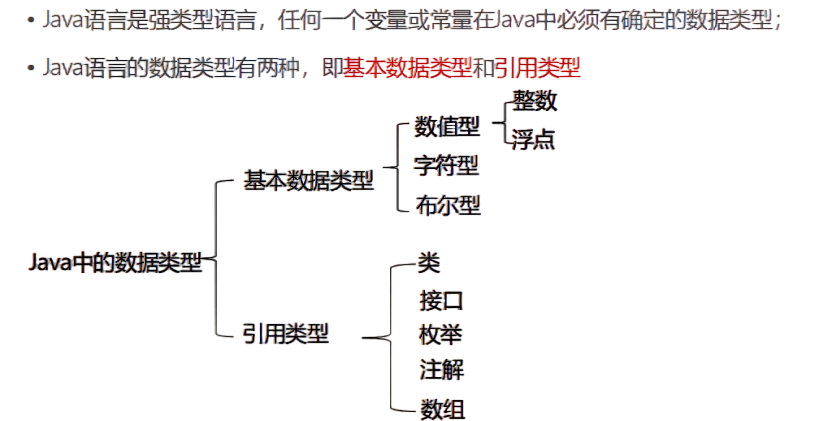
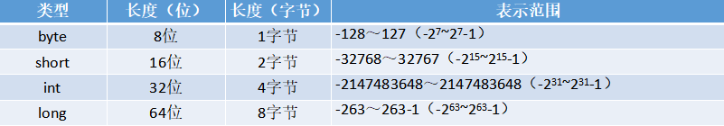
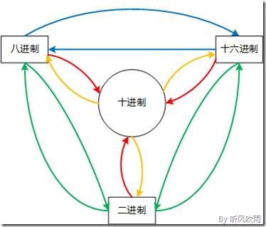
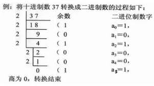
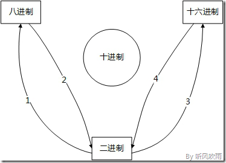

# 第2天 数据类型与变量、运算符

## 主要内容

1、掌握变量概念及使用

2、掌握数据类型的分类

3、掌握八种基本数据类型取值范围

4、熟练整数型使用

5、熟练浮点型使用

6、熟练布尔型使用

7、熟练char型使用

8、掌握基本类型的转换

9、熟悉进制转换

10、熟悉字符编码

11、掌握变量作用域

12、掌握变量的分类及就近原则

13、掌握算术运算符的使用

14、掌握关系运算符的使用

15、掌握逻辑运算符的使用

16、掌握赋值运算符的使用

17、掌握条件运算符的使用

**学习目标**

| 节数     | 知识点                       | 要求 |
|----------|------------------------------|------|
| 第一节   | 掌握变量概念及使用           |      |
| 第二节   | 掌握数据类型的分类           | 掌握 |
| 第三节   | 掌握八种基本数据类型取值范围 | 掌握 |
| 第四节   | 熟练整数型使用               | 掌握 |
| 第五节   | 熟练浮点型使用               | 掌握 |
| 第六节   | 熟练布尔型使用               | 掌握 |
| 第七节   | 熟练char型使用               | 掌握 |
| 第八节   | 掌握基本类型的转换           | 掌握 |
| 第九节   | 熟悉进制转换                 | 掌握 |
| 第十节   | 熟悉字符编码                 | 掌握 |
| 第十一节 | 掌握变量的分类及就近原则     | 掌握 |
| 第十二节 | 掌握算数运算符的使用         | 掌握 |
| 第十三节 | 掌握关系运算符的使用         | 掌握 |
| 第十四节 | 掌握逻辑运算符的使用         | 掌握 |
| 第十五节 | 掌握赋值运算符的使用         | 掌握 |
| 第十六节 | 掌握条件运算符的使用         | 掌握 |

1.  **掌握变量概念及使用**

概念：

变量是指内存中的一个存储区域，该区域要有自己的名称（变量名）、类型（数据类型），该区域的数据可以在同一数据类型的范围内不断变化值；

变量的使用注意事项：

Java中的变量必须声明后才能进行使用；

变量的作用域：在一对｛｝中为有效区间；

需要进行初始化后才能使用变量；

变量的定义：

数据类型 变量名 = 初始化值;

变量的使用是通过变量名来访问所指向的内存区域中存储的值。

1.  **掌握数据类型的分类**

**2.1数据类型分类**

不同的变量有不同的用途，例如，可以用变量来表示年龄，或者用变量来表示成绩。而年龄只能是整数，而成绩却可能出现小数；如果不把数据划分为不同的类型，那么就没有办法区分出数据之间的差别；

计算机可以根据不同的数据类型，把数据“合理”地存放到内存中；计算机从内存中读取数据时，也可以根据其数据类型就能确认取到的数据的特征，从而正确地去处理；

1.  **掌握八种基本数据类型取值范围**

**3.1**

备注：java中默认的整数数据类型为int 默认值为0

1.  **熟练整数型使用**

**4.1整数类型详解**

备注：java中默认的整数数据类型为int 默认值为0

1.  **熟练浮点型使用**

**5.1浮点类型详解**

备注：java中默认的浮点型为double 默认值为0.0

声明单精度浮点型变量时 需要在值的末尾加上标识位f

1.  **熟练布尔型使用**

**6.1布尔类型详解**

备注：java中的布尔型变量默认值为false

1.  **熟练char型使用**

**7.1 char类型详解**

char 型数据用来表示通常意义上“字符”(2字节)

字符型常量的三种表现形式：

字符常量是用单引号(‘ ’)括起来的单个字符，涵盖世界上所有书面语的字符。例如：char c1 = 'a'; char c2 = '中'; char c3 = '9';

Java中还允许使用转义字符‘\\’来将其后的字符转变为特殊字符型常量。例如：char c3 = ‘\\n’; // '\\n'表示换行符

直接使用 Unicode 值来表示字符型常量：‘\\uXXXX’。其中，XXXX代表一个十六进制整数。如：\\u000a 表示 \\n。

char类型是可以进行运算的。因为它都对应有Unicode码。

备注：java中的默认字符型值是‘’ 空字符（\\u0000） 串讲 ASCII Unicode UTF-8

1.  **掌握基本类型的转换**

**8.1自动类型转换，强制类型转换**

（1）自动类型转换

从表示范围小的类型转换为表示范围大的类型，可以直接转换，称为隐式转换

byte b=1; int i=-2; // 表示范围小的可以直接转换为表示范围大的类型

i=b;

i=c;

（2）显示转换

从表示范围大的类型转换为表示范围小的类型，需要强制转换，称为显式转换（也称强制类型转换）

byte b=1;

int i=-2;

b=(byte)i;// 表示范围大的不可以直接转换为转换范围小的类型,需要强制转换，称为显式转换

c=(char)i;// 表示范围大的不可以直接转换为转换范围小的类型,需要强制转换，称为显式转换

1.  **熟悉进制转换**

**9.1进制间转化**

**（1）（二，八，十六进制）转十进制**

方法：假设我们要将n进制转换为十进制，首先我们从n进制的右边为第一位数（从低位到高位），其权值是n的0次方，第二位是n的1次方，依次递增下去，把最后的结果相加的值就是十进制的值了。

举个例子：将（1101）n 转换为十进制

（1101）n = 1\*（n）\^3 + 1 \* (n) \^ 2 + 0 \* (n) \^ 1 + 0 \* (n) \^ 0 ;

如：(1101) 2 = 1\*（2）\^3 + 1 \* (2) \^ 2 + 0 \* (2) \^ 1 + 1 \* (2) \^ 0 = 13;

八进制，十六进制同样如此。

例：将十六进制的(2B)H转换为十进制的步骤如下：

1\. 第0位 B x 16\^0 = 11；

2\. 第1位 2 x 16\^1 = 32；

3\. 读数，把结果值相加，11+32=43，即(2B)H=(43)D。

#### （2）十进制 转换为（二，八，十六进制）

假设我们要将十进制转换为n进制

方法：除n取余法，即每次将整数部分除以n，余数为该位权上的数，而商继续除以n，余数又为上一个位权上的数，这个步骤一直持续下去，直到商为0为止，最后读数时候，从最后一个余数读起，一直到最前面的一个余数。

十进制转换二进制

例：将十进制的(796)D转换为十六进制的步骤如下：

1\. 将商796除以16，商49余数为12，对应十六进制的C；

2\. 将商49除以16，商3余数为1；

3\. 将商3除以16，商0余数为3；

4\. 读数，因为最后一位是经过多次除以16才得到的，因此它是最高位，读数字从最后的余数向前读，31C，即(796)D=(31C)H。

#### （3）**二进制 转换八、十六进制**

方法：取三合一法，即从二进制的小数点为分界点，向左（向右）每三位取成一位，接着将这三位二进制按权相加，然后，按顺序进行排列，小数点的位置不变，得到的数字就是我们所求的八进制数。如果向左（向右）取三位后，取到最高（最低）位时候，如果无法凑足三位，可以在小数点最左边（最右边），即整数的最高位（最低位）添0，凑足三位。

例：将二进制的(11010111.0100111)B转换为八进制的步骤如下：

1\. 小数点前111 = 7；

2\. 010 = 2；

3\. 11补全为011，011 = 3；

4\. 小数点后010 = 2；

5\. 011 = 3；

6\. 1补全为100，100 = 4；

7\. 读数，读数从高位到低位，即(11010111.0100111)B=(327.234)O。

1.  **熟悉字符编码**

字符编码和字符集的概念

字符集(character set)是一个系统支持的所有抽象字符的集合。字符(character)就是各种文字和符号，包括国家文字、标点符号、图形符号、数字等。

如果仅仅是抽象的字符集，其实是顾名思义的，但是我们常说的字符集，其实是指编码字符集(coded character set)，比如: Unicode、ASCII、GB2312、GBK等等。什么是编码字符集呢？编码字符集是指，这个字符集里的每一个字符，都对应到唯一的一个代码值，这些代码值叫做代码点(code point)，可以看做是这个字符在编码字符集里的序号，字符在给定的编码方式下的二进制比特序列称为代码单元(code unit)。在Unicode字符集中，字母A对应的数值是十六进制下的0041，书写时前面加U+，所以Unicode里A的代码点是U+0041。

常见的编码字符集有：

Unicode：也叫统一字符集，它包含了几乎世界上所有的已经发现且需要使用的字符（如中文、日文、英文、德文等）。

ASCII：早期的计算机系统只能处理英文，所以ASCII也就成为了计算机的缺省字符集，包含了英文所需要的所有字符。

GB2312：中文字符集，包含ASCII字符集。ASCII部分用单字节表示，剩余部分用双字节表示。

GBK：GB2312的扩展，完整包含了GB2312的所有内容。

GB18030：GBK字符集的超集，常叫大汉字字符集，也叫CJK（Chinese，Japanese，Korea）字符集，包含了中、日、韩三国语言中的所有字符。

字符编码(character encoding)，是编码字符集的字符和实际的存储值之间的转换关系。常见的编码方式有：UTF-8(Unicode字符集的编码方式)、UTF-16(Unicode字符集的编码方式)、UTF-32(Unicode字符集的编码方式)、ASCII(ASCII字符集的编码方式)等。

Java的字符编码和字符集

Java中char类型是16位无符号基本数据类型，用来存储Unicode字符。字符数据类型的范围为0到65535，可以存储65536个不同的Unicode字符，这在起初Unicode字符集不是很大的时候，是没问题的。然而随着Unicode字符集的增长，已经超过65536个了，根据Unicode标准，现在Unicode代码点的合法范围是U+0000到U+10FFFF，U+0000到U+FFFF称为Basic Multilingual Plane(BMP)，代码点大于U+FFFF的字符称为增补字符。

Java如何解决这个问题的呢？

Java的char类型使用UTF-16编码描述一个代码单元。在这种表现形式下，增补字符用一对代码单元编码，即2个char，其中，第一个值取值自\\uD800-\\uDBFF(高代理项范围)，第二个值取值自\\uDC00-\\uDFFF(低代理项范围)。Unicode规定，U+D800到U+DFFF的值不对应于任何字符，为代理区。因此，UTF-16利用保留下来的0xD800-0xDFFF区段的码位来对增补字符进行编码。具体的UTF-16编码格式，可见这篇文章：https://www.cnblogs.com/dragon2012/p/5020259.html。

所以，char值表示BMP代码点，包括代理项代码点和UTF-16编码的代码单元。而int值可以表示所有的Unicode代码点，包括增补代码点。int的21个低位表示Unicode代码点，且11个高位必须为0。

Java字符串由char序列组成，上面我们已经说过，char数据类型是一个采用UTF-16编码表示Unicode代码点的代码单元，大多数的常用Unicode字符使用一个代码单元就可以表示，而增补字符需要一对代码单元表示。我们所熟知的String类型的length方法，它返回的是UTF-16编码表示的给定字符串的代码单元的数量，如果想要得到代码点的数量，可以调用codePointCount()方法，charAt方法返回位于指定位置的代码单元，codePointAt方法则返回指定位置的代码点。Java代码需要编译成class文件后由JVM运行，在class文件里，字符串使用UTF-8编码，保存于常量池中。

1.  **掌握变量的分类及就近原则**

变量的分类

变量：分为局部变量、成员变量

1.在方法体内声明的变量称为局部变量

2.在\*\*方法体外【类体之中】\*\*的变量称为成员变量，也可以称为：全局变量

作用域：其实就是变量的有效使用范围，在什么范围可以访问到，在什么范围无法访问到，局部变量出了大括号就不认识了

就近原则(Principle of Proximity)－把相关的操作放在一起，例如让注释靠近它所描述的代码，让控制循环的代码靠近循环本身等。变量的就近原则指尽可能在靠近第一次使用变量的位置声明和定义该变量。就近原则实际上也是变量的作用域最小化的一种实现手段。过早地声明局部变量不仅会使它的作用域过早地扩展，而且结束得也过于晚了。局部变量的作用域从它被声明的点开始扩展，一直到外围块的结束处。如果变量在“使用它的块”之外被声明的，当程序退出该块之后，该变量仍是可见的。如果变量在它的目标使用区域之前或之后被意外地使用的话，后果将可能是灾难性的。

public class Test {

String name="Tom"; //成员变量

public Test(String name){

name = name;

}

public static void main(String [] args){

Test t = new Test("Jack");

System.out.println(t.name);

}

}

形参和成员变量重名,根据变量使用的就近原则,会访问到成员变量，所以会输出 Tom

**第十二节 掌握算数运算符的使用**

**12.1算术运算符：+，-，\*，/，%，++，--**

| **运算符**    | **运算**                                          | **范例**              | **结果**        |
|---------------|---------------------------------------------------|-----------------------|-----------------|
| **+**         | 正号                                              | +3                    | 3               |
| **-**         | 负号                                              | b=4; -b               | -4              |
| **+**         | 加                                                | 5+5                   | 10              |
| **-**         | 减                                                | 6-4                   | 2               |
| **\***        | 乘                                                | 3\*4                  | 12              |
| **/**         | 除                                                | 5/5                   | 1               |
| **%**         | 取模(取余)                                        | 7%5                   | 2               |
| **++** **++** | 自增（前）：先运算后取值 自增（后）：先取值后运算 | a=2;b=++a; a=2;b=a++; | a=3;b=3 a=3;b=2 |

算术运算符的注意问题

如果对负数取模，可以把模数负号忽略不记，如：5%-2=1。 但被模数是负数则不可忽略。此外，取模运算的结果不一定总是整数。

对于除号“/”，它的整数除和小数除是有区别的：整数之间做除法时，只保留整数部分而舍弃小数部分。 例如：int x=3510;x=x/1000\*1000; x的结果是？

算数运算符课堂案例

public class Item0101 {

/\*\*

\* @param args

\*/

public static void main(String[] args) {

int a=13;

int b=5;

System.out.println("a+b="+(a+b));

System.out.println("a-b="+(a-b));

System.out.println("a\*b="+(a\*b));

System.out.println("a/b="+(a/b));

System.out.println("a%b="+(a%b));

System.out.println("a++="+(a++));

System.out.println("++b="+(++b));

System.out.println("a="+a);

System.out.println("b="+b);

System.out.println(13.4%2);

}

}

**第十三节 掌握关系运算符的使用**

**13.1关系运算符：\>，\<，\>=，\<=，==，!=**

备注：关系运算符的结果都是boolean型，也就是要么是true，要么是false。

关系运算符“==”不能误写成“=” 。

**第十四节 掌握逻辑运算符的使用**

**14.1逻辑运算符：&&，\|\|，&，\|，!**

&—逻辑与 \| —逻辑或 ！—逻辑非

&& —短路与 \|\| —短路或 \^ —逻辑异或

逻辑运算符用于连接布尔型表达式，在Java中不可以写成3\<x\<6，应该写成x\>3 & x\<6 。

“&”和“&&”的区别：单&时，左边无论真假，右边都进行运算；

双&时，如果左边为真，右边参与运算，如果左边为假，那么右边不参与运算。

“\|”和“\|\|”的区别同理，\|\|表示：当左边为真，右边不参与运算。

异或( \^ )与或( \| )的不同之处是：当左右都为true时，结果为false。

理解：异或，追求的是“异”!

**第十五节 掌握赋值运算符的使用**

**15.1赋值运算符：=，+=，-=，\*=，/=，%=**

扩展赋值运算符： +=, -=, \*=, /=, %=

思考1： short s = 3;

s = s+2; ①

s += 2; ②

①和②有什么区别？

备注：使用扩展赋值运算符进行赋值时 如果 符号：= 当“=”两侧数据类型不一致时，可以使用自动类型转换或使用强制类型转换原则进行处理。

支持连续赋值。

**第十六节 掌握条件运算符的使用**

**条件运算符：?:，以及条件运算符嵌套**

表达式1和表达式2为同种类型

三元运算符与if-else的联系与区别：

1）三元运算符可简化if-else语句

2）三元运算符要求必须返回一个结果。

3）if后的代码块可有多个语句

课堂案例

public class HelloWorld{

public static void main(String[] args) {

int score=68;

String mark = (score\>=60) ? "及格" : "不及格";

System.out.println("考试成绩如何："+mark);

} }

练习： 获取两个数中的较大数 获取三个数中的较大数
