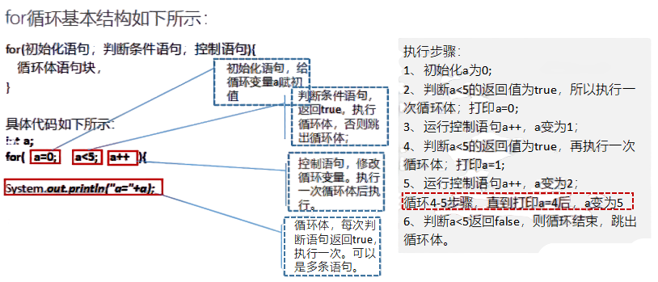

1.  **流程控制**

## 主要内容

## 1、掌握选择语句-if语句和if else语句

## 2、掌握选择语句-switch语句

## 3、掌握循环语句-for语句

| 节数    | 知识点                           | 要求 |
|---------|----------------------------------|------|
| 第一节  | 掌握选择语句-if语句和if else语句 | 掌握 |
| 第二节  | 掌握选择语句-switch语句          | 掌握 |
| 第三节  | 掌握循环语句-for语句             | 掌握 |

1.  **掌握选择语句-if语句和if else语句**

**1.1单分支 if**

if语句指的是如果满足某种条件，就进行某种处理；

**1.2双分支**

if/else语句指的是如果满足某种条件，就执行if代码块；如果不满足，则执行else代码块

案例1

public class Item0101 {

/\*\*

\* @param args

\*/

public static void main(String[] args) {

int x=10;

if(x%2==0){

System.out.println("x是偶数");

}else{

System.out.println("x是奇数");

}

}

}

案例2

public class Item0103 {

/\*\*

\* @param args

\*/

public static void main(String[] args) {

int a = 0;

int b = 1;

int max;

if (a \> b) {

max = a;

} else {

max = b;

}

int max2=a\>b?a:b;

System.out.println(max);

System.out.println(max2);

}

}

作业：

（1）编写程序，声明2个int型变量并赋值。判断两数之和，如果大于等于50，打印“hello world!”

（2）编写程序，声明2个double型变量并赋值。判断第一个数大于10.0，且第2个数小于20.0，打印两数之和。

（3）【选作】定义两个变量，判断二者的和，是否既能被3又能被5整除，打印提示信息

（4）岳小鹏参加Java考试，他和父亲岳不群达成承诺：

如果：

成绩为100分时，奖励一辆BMW；

成绩为(80，99]时，奖励一台iphone7plus；

当成绩为[60,80]时，奖励一个 iPad；

其它时，什么奖励也没有。

请从键盘输入岳小鹏的期末成绩，并加以判断

**1.3多分支**

if/else if/else，else if语句可以多个

案例

public class Item0102 {

/\*\*

\* @param args

\*/

public static void main(String[] args) {

// 学生成绩是75

int score=75;

if(score\>90){

// 学生成绩75，不满足\>90，不执行该语句

System.out.println("成绩为优秀");

}else if(score\>80){

// 学生成绩75，不满足\>80，不执行该语句

System.out.println("成绩为良好");

}else if(score\>60){

// 学生成绩75，满足\>60，执行该语句，

System.out.println("成绩为及格");

}else{

System.out.println("成绩为不及格");

}

}

}

1.  **掌握选择语句-switch语句**
    1.  **switch语句**

其中，一个case表达式常量成为标号，代表一个case分支的入口。switch语句在运行时首先计算switch圆括号中“表达式”的值，这个值必须是整型或字符型（jdk1.7之后可以使用String类型），同时后面各个case表达式常量的值的类型应与switch圆括号中“表达式”的值类型一致。一个case语句代表一个制定操作，然后转向结构出口。default子句是可选的，当表达式的值与case表达式常量的值都不匹配时，就运行default子句，转向结构出口。

java里switch的执行顺序

switch表达式的值决定选择哪个case分支，如果找不到相应的分支，就直接从”default” 开始输出。

当程序执行一条case语句后，因为例子中的case分支中没有break 和return语句，所以程序会执行紧接于其后的语句。

**2.2 switch支持的数据类型**

在JDK1.5之前,switch循环只支持byte short char int四种数据类型.

JDK1.5 在switch循环中增加了枚举类与byte short char int的包装类,对四个包装类的支持是因为java编译器在底层手动进行拆箱,而对枚举类的支持是因为枚举类有一个ordinal方法,该方法实际上是一个int类型的数值.

jdk1.7开始支持String类型,但实际上String类型有一个hashCode算法,结果也是int类型.而byte short char类型可以在不损失精度的情况下向上转型成int类型.所以总的来说,可以认为switch中只支持int

switch支持的类型有？

Java 7 中加入了对String类型的支持。所以支持的有：char、byte、short、int 和 Character、Byte、Short、Integer 和 String

备注：switch中可以有null吗？

在switch语句中，表达式的值不能是null，否则会在运行时抛出NullPointerException。在case子句中也不能使用null，否则会出现编译错误

1.  **掌握循环语句-for语句**

    **3.1** for循环基本结构如下所示：

