# 第6天 方法初步、Java数组

# 主要内容

1.  熟悉方法的作用

    2、掌握方法的定义

    3、掌握方法的调用

    4、掌握方法的重载（Overload）

    5、掌握方法执行的内存分配

    6、熟练递归的使用

    7、掌握Debug的使用

    8、掌握数组概念

    9、掌握一维数组的声明、创建和初始化

    10、掌握一维数组的操作

    11、掌握二维数组的声明和使用

## 学习目标

| 节数     | 知识点                           | 要求 |
|----------|----------------------------------|------|
| 第一节   | 熟悉方法的作用                   | 掌握 |
| 第二节   | 掌握方法的定义                   | 掌握 |
| 第三节   | 掌握方法的调用                   | 掌握 |
| 第四节   | 掌握方法的重载（Overload）       | 掌握 |
| 第五节   | 掌握方法执行的内存分配           | 掌握 |
| 第六节   | 熟练递归的使用                   | 掌握 |
| 第七节   | 掌握Debug的使用                  | 掌握 |
| 第八节   | 掌握数组概念                     | 掌握 |
| 第九节   | 掌握一维数组的声明、创建和初始化 | 掌握 |
| 第十节   | 掌握一维数组的操作               | 掌握 |
| 第十一节 | 掌握二维数组的声明和使用         |      |

## 熟悉方法的作用

**1.1**方法的作用

Java语言中的“方法”（Method）在其他语言当中也可能被称为“函数”（Function）。对于一些复杂的代码逻辑，如果希望重复使用这些代码，并且做到“随时任意使用”，那么就可以将这些代码放在一个大括号“{}”当中，并且起一个名字。使用代码的时候，直接找到名字调用即可。

## 第二节 掌握方法的定义

**2.1**成员方法的定义

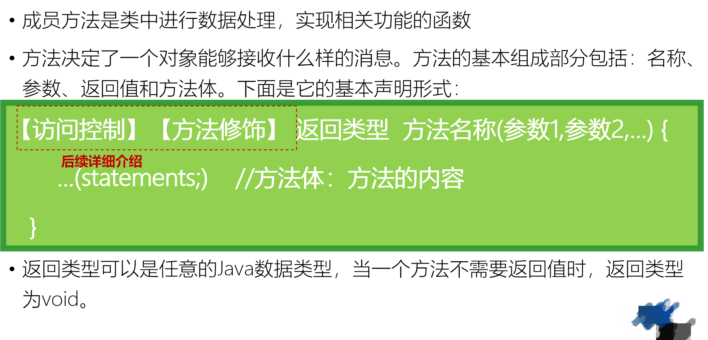

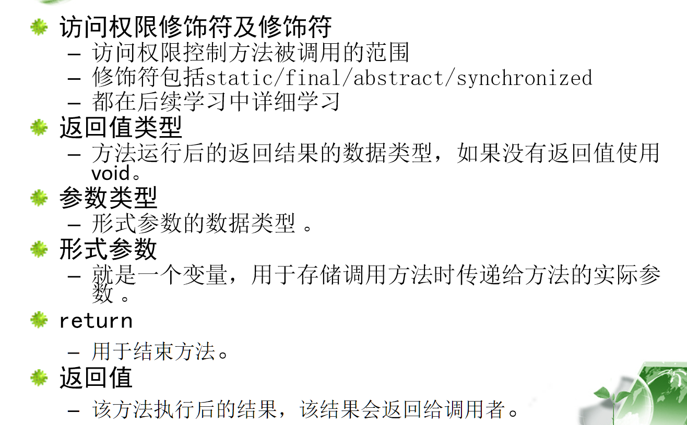

## 第三节 掌握方法的调用

**3.1**方法的调用

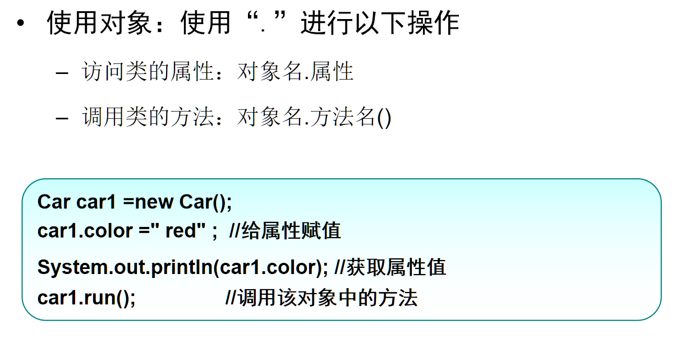

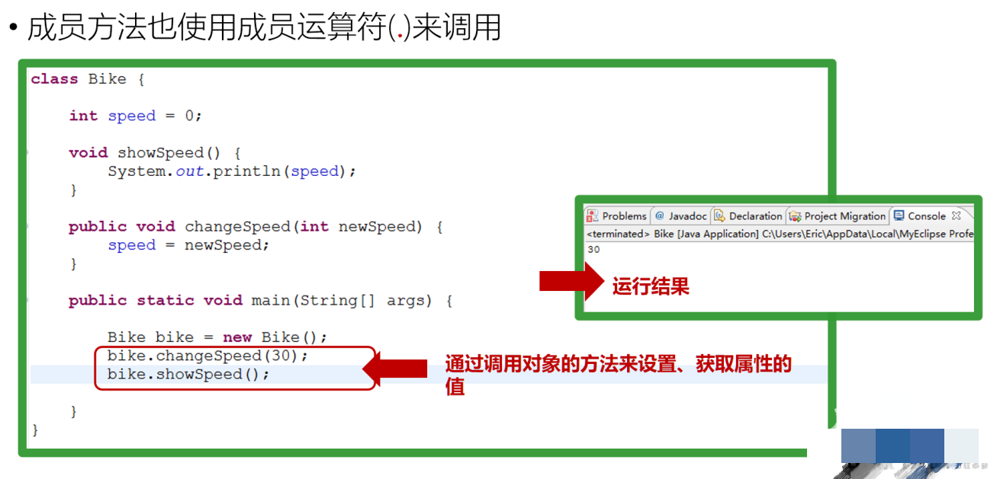

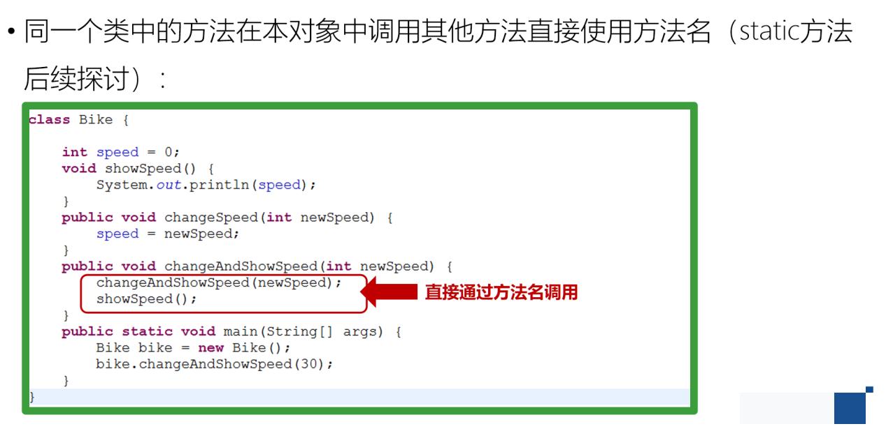

## 第四节 掌握方法的重载（Overload）

**4.1**方法重载

**4.2**方法重载的注意事项

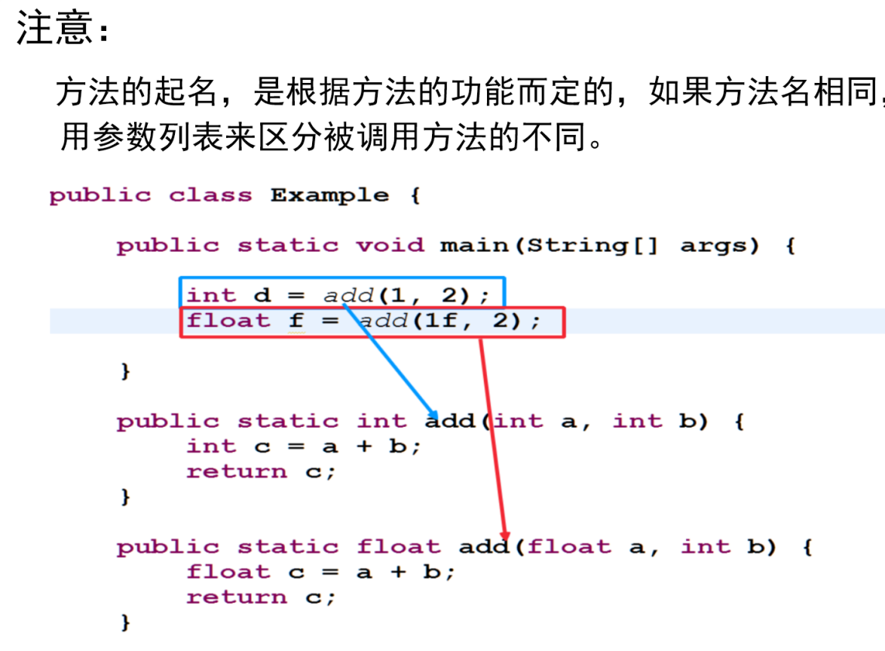

## 第五节 掌握方法执行的内存分配

Java 的内存主要包含 4 块，即 heap （堆内存）、 stack （栈内存）、 datasegment( 静态变量或是常量存放区）、 codesegment （方法区） 。

栈：存取速度快，存放一些基本类型的变量或对象的引用变量。主要用来执行程序的。

堆: 存取速度慢，通过New()方法来创建的对象或数组。主要用来存放对象的。

静态常量区：存放的是静态变量（类变量）或是常量

方法区：存放的是对象的方法。因此即使new出多个对象也是只是存在一个方法。

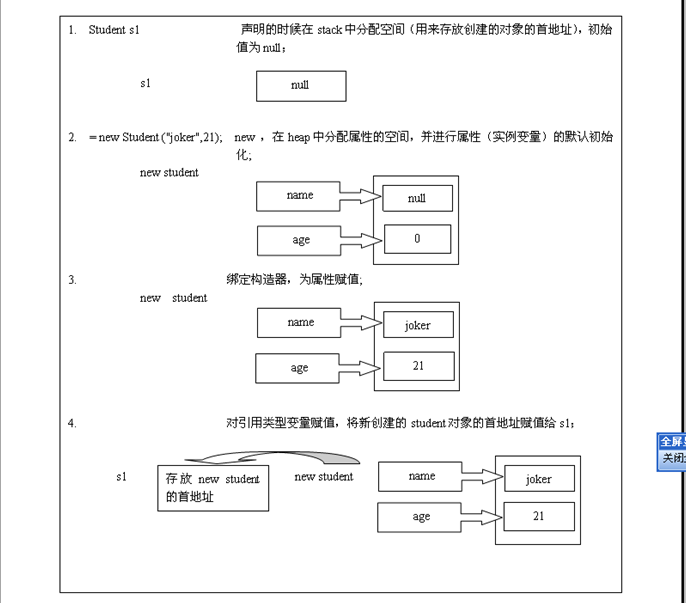

java中内存主要包含4块，即heap(堆内存)、stack(栈内存)、data segment(静态变量或是常量存放区)、codesegment(方法区).   
堆内存中存放的是new出的对象，new出的对象只包含成员变量。   
栈内存中：存放的是局部成员变量。对于基本的数据类型存放的是基本变量的值，而对于对象变量，存放的是堆内存的地址。   
静态、常量区：存放的是静态变量(类变量)或是常量。   
方法区：存放的是对象的方法。因此即使new出多个对象也是只是存在一个方法。   
  
如   
A a = new A(); A中含有一个work方法，2个成员变量a,b。那么对应的内存分配为   
则 a是分配在栈内存中。里面存放了一个指向堆内存中存放的new A()的地址。   
new A()会导致在堆内存中分配一块空间，该内存中的A对象同时会含有a和b。   
work()方法会在codesegment区中分配内存。   
如果此时 A b = a;则表示把a的值复制给b，即b的值为a中保存的地址

## 第六节 熟练递归的使用

一说起递归，我想每个人都不陌生。举个从小就听过的例子：从前有座山，山里有座庙，庙里有个和尚，和尚在讲故事，从前有座山，山里有座庙，庙里有个和尚，和尚在讲故事，从前有座山..

但要注意递归不是一直重复下去，没有终止条件，那就称为死循环了。

6.1方法递归

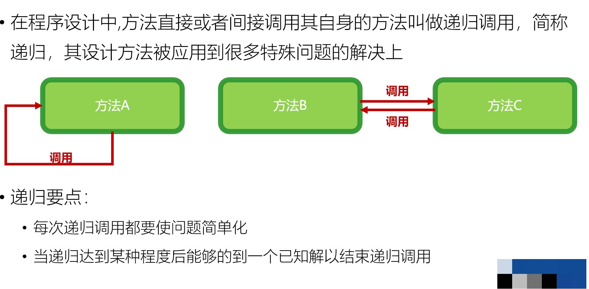

6.2方法递归解决的问题

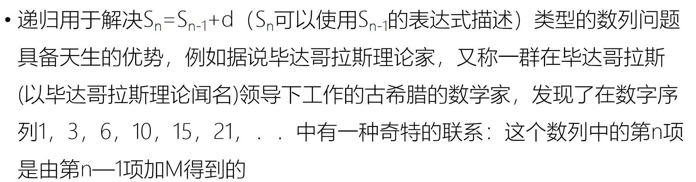

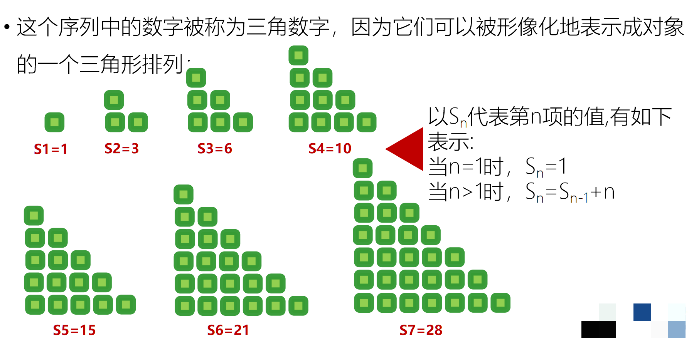

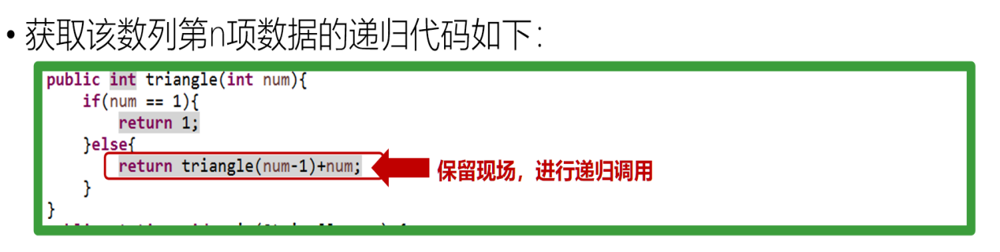

### 本节作业

1.  什么是递归
2.  理解递归程序

## 第七节 掌握Debug的使用

当我们写的程序越来越复杂，编译虽然没有问题，但是运行出的结果和期望不符，有什么好办法找到错误所在呢？

Debug是调试的意思，在实际编程中经常用到；

主要作用是尽快找到程序中的错误，使得程序运行结果与预期相符；

7.1 eclipse中使用debug模式

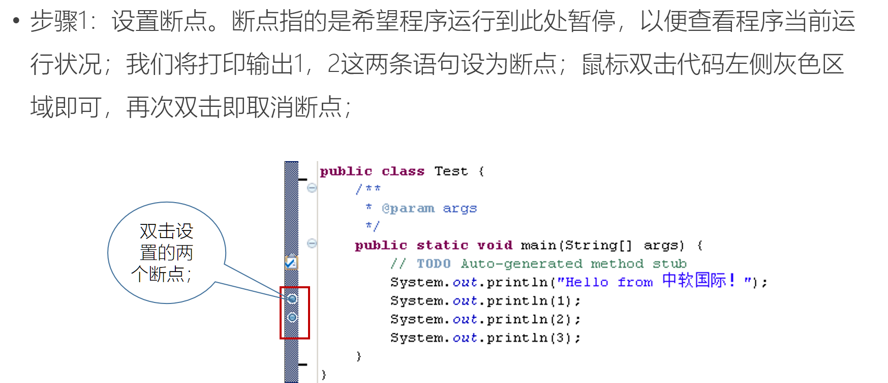

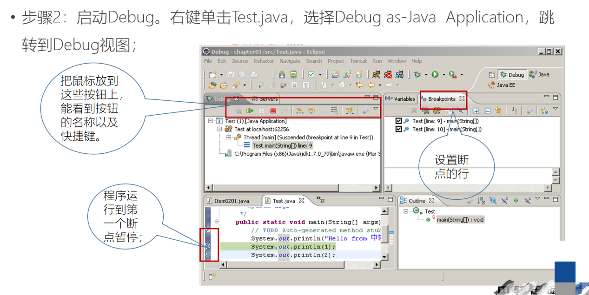

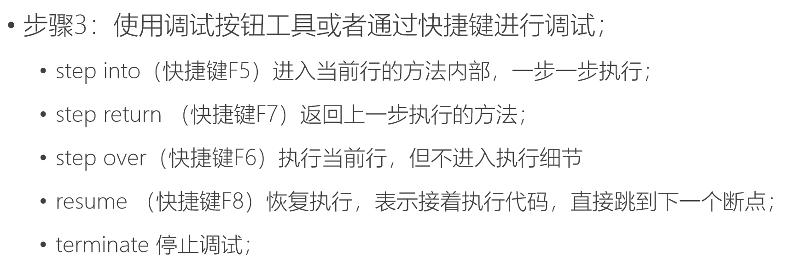

## 第八节 掌握数组概念

数组概念和作用

数组是一组类型相同的数据的集合；

也就是说，数组中可以存储多个数据，但是这些数据的类型必须相同；

数组能够作为数据的容器使用，把多个数据集中存储；

存储在数组中的数据，都有相应的索引值，可以方便获取或修改；

当需要同时保存多个类型相同的变量并进行处理时，可以考虑用数组，例如：多个人的成绩、多个员工的薪资……

## 第九节 掌握一维数组的声明、创建和初始化

**8.1**如果一个数组中存储数据结构如下所示，元素都是单个数据，称为一维数组；

**8.2**一维数组的声明形式

数组元素类型[ ] 变量名称;或数组元素类型 变量名称[ ]（兼容c语言 不建议使用） ;

例如：

int[] a; 或 int a[];

String[] s; 或 String s[]；

**8.3**数组的实例化

第一种：数组元素类型[ ] 变量名称=new 数组元素类型[数组长度];

第二种：数组元素类型[ ] 变量名称=new 数组元素类型[]{用逗号隔开元素的具体值};

第三种：数组元素类型[ ] 变量名称= {用逗号隔开元素的具体值};

//a1的长度为5，元素的值为默认值0

int[] a1=new int[5];

//a2的长度为3，元素的值为1,4,10

int[] a2=new int[]{1,4,10};

//a3的长度为4，元素的值为34,23,4,10

int[] a3={34,23,4,10};

## 第十节 掌握一维数组的操作

一维数组的常见操作:

1、遍历

方式1：  
public static void printArray(int[] arr) {  
for(int x=0; x\<arr.length; x++) {  
System.out.println(arr[x]);  
}  
}  
  
方式2：  
public static void printArray(int[] arr) {  
System.out.print("[");  
for(int x=0; x\<arr.length; x++) {  
if(x == arr.length-1) {  
System.out.println(arr[x]+"]");  
}else {  
System.out.println(arr[x]+", ");  
}  
}  
}

2、求最值

最大值：  
public static int getMax(int[] arr) {  
int max = arr[0];  
  
for(int x=1; x\<arr.length; x++) {  
if(arr[x] \> max) {  
max = arr[x];  
}  
}  
  
return max;  
}  
  
最小值：  
public static int getMin(int[] arr) {  
int min = arr[0];  
  
for(int x=1; x\<arr.length; x++) {  
if(arr[x] \< min) {  
min = arr[x];  
}  
}  
  
return min;  
}

3、逆序  
方式1：  
public static void reverse(int[] arr) {  
for(int x=0; x\<arr.length/2; x++) {  
int temp = arr[x];  
arr[x] = arr[arr.length-1-x];  
arr[arr.length-1-x] = temp;  
}  
}  
  
方式2：  
public static void reverse(int[] arr) {  
for(int start=0,end=arr.length-1; start\<=end; start++,end--) {  
int temp = arr[start];  
arr[start] = arr[end];  
arr[end] = temp;  
}  
}

4、查表  
public static String getString(String[] strArray,int index) {  
return strArray[index];  
}

5、基本查找  
方式1：  
public static int getIndex(int[] arr,int value) {  
for(int x=0; x\<arr.length; x++) {  
if(arr[x] == value) {  
return x;  
}  
}  
  
return -1;  
}  
  
方式2：  
public static int getIndex(int[] arr,int value) {  
int index = -1;  
  
for(int x=0; x\<arr.length; x++) {  
if(arr[x] == value) {  
index = x;  
break;  
}  
}  
  
return index;  
}

## 第十一节 掌握二维数组的声明和使用

如果一个数组中存储数据结构如下所示，元素是一维数组，称为二维数组

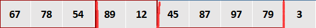

其中，第0个元素是数组{67,78,54}，第1个元素是数组{89,12}
