# 第8天 面向对象

## 主要内容

## 1、掌握面向对象概述

## 2、掌握面向对象编程的基本特征

## 3、掌握类与对象

## 4、掌握面向对象的封装性

## 5、掌握构造方法的声明及特点

## 6、掌握对象和引用内存详解

## 7、掌握this关键字的使用

## 学习目标

| 节数   | 知识点                     | 要求 |
|--------|----------------------------|------|
| 第一节 | 掌握面向对象概述           | 掌握 |
| 第二节 | 掌握面向对象编程的基本特征 | 掌握 |
| 第三节 | 掌握类与对象               | 掌握 |
| 第四节 | 掌握面向对象的封装性       | 掌握 |
| 第五节 | 掌握构造方法的声明及特点   | 掌握 |
| 第六节 | 掌握对象和引用内存详解     | 掌握 |
| 第七节 | 掌握this关键字的使用       | 掌握 |

## 掌握面向对象概述

### What OPP? What OOP？

OPP：Procedure Oriented Programming 面向过程的编程

OOP：Object Oriented Programming 面向对象的编程

举个最简单点的例子来区分面向过程和面向对象:

有一天你想吃鱼香肉丝了，怎么办呢？你有两个选择

1、自己买材料，肉，鱼香肉丝调料，蒜苔，胡萝卜等等然后切菜切肉，开炒，盛到盘子里。

2、去饭店，张开嘴：老板！来一份鱼香肉丝！

看出来区别了吗？

1是面向过程OPP，2是面向对象 OOP。

**1.2**面向对象有什么优势呢？

首先你不需要知道鱼香肉丝是怎么做的，降低了耦合性。如果你突然不想吃鱼香肉丝了，想吃红烧肉，对于1你可能不太容易了，还需要重新买菜，买调料什么的。对于2，太容易了，大喊：老板！那个鱼香肉丝换成红烧肉吧，提高了可维护性。总的来说就是降低耦合，提高维护性！

面向过程是具体化的，流程化的，解决一个问题，你需要一步一步的分析，一步一步的实现。

面向对象是模型化的，不必去一步一步的实现，至于这个功能是如何实现的，管我们什么事？我们会用就可以了。

面向对象是优点：

优点：易维护、易复用、易扩展，由于面向对象有封装、继承、多态性的特性，可以设计出低耦合的系统，使系统 更加灵活、更加易于维护。

### 本节作业

1.  OPP、OOP的含义
2.  什么是面向对象简介
3.  面向对象的优势

## 掌握面向对象编程的基本特征

1、封装(Encapsulation)  
 （1）理解：定义对象和操作，只提供抽象的接口，并隐藏它们的具体实现。  
 （2）Java中体现：spring mvc设计模型中的model(模型层)，使用到javabean实体类将属性和方法封装起来，通过get/set方法调用。  
 （3）个人比喻总结：笔记本电脑，我们能看到开机键、键盘、显示屏，却看不到他们的内部结构。这就是封装的体现，我们只需要会按开机键，敲键盘，看屏幕就行了，具体内部组装结构被隐藏起来了，因为也没有必要知道它内部结构是什么。

2、继承（Inheritance）  
 （1）理解：通过现有数据类型的性质，创建新的数据类型，而不影响原有数据类型。  
 （2）Java中体现：在原有类的基础上，新建一个类。原有类称为父类，新建的类叫子类。子类可以重写父类的方法，也可以拓展自己的方法。  
 （3）个人比喻总结：人和学生，人是父类，学生是子类，学生拥有着人的特征，同时还多了要上课、做作业等行为。

3、多态（Polymorphism）  
 （1）理解：多个不同对象对同一消息作出响应。   
 （2）Java中体现：  
 A.接口实现（A implements B）（不同类的相同行为）；  
 B.子类继承父类重写父类方法（B extends A）；  
 C.同一个类中方法重载。  
 （3）个人比喻总结：下课铃声响了，小明回家了，小李、小王......也回家了  
 Ps: 多态实现的关键  
 （1）父类引用指向子类对象，通俗的说就是父类的对象是由子类new出来的。（Person p = new Student();）  
 （2）父类引用只能调用父类中定义的方法和变量。  
 （3）如果子类重写了父类中的一个方法，那么在调用这个方法的时候，将会调用子类的方法。（动态连接/动态调用）  
 （4）变量不能被重写，重写只针对方法。

三、三大特征（作用）  
 1、封装：继承是一种联结类的层次模型，并且允许和鼓励类的重用，它提供了一种明确表述共性的方法。对象的一个新类可以从现有的类中派生，这个过程称为类继承。新类继 承了原始类的特性，新类称为原始类的派生类（子类），而原始类称为新类的基类（父类）。派生类可以从它的基类那里继承方法和实例变量，并且类可以修改或增 加新的方法使之更适合特殊的需要。  
 2、继承：封装是把过程和数据包围起来，对数据的访问只能通过已定义的界面。面向对象计算始于这个基本概念，即现实世界可以被描绘成一系列完全自治、封装的对象，这些对象通过一个受保护的接口访问其他对象。  
 3、多态： 多态性是指允许不同类的对象对同一消息作出响应。多态性包括参数化多态性和包含多态性。多态性语言具有灵活、抽象、行为共享、代码共享的优势，很好的解决了应用程序函数同名问题。

## 第三节 掌握类与对象

### 3.1类和对象的关系

## 类是对象的概括，类就是一个模板，是一类对象的模板，它描述一类对象的行为和状态，定义了这些对象应该有的属性及方法。

对象（对象不是找个女朋友）具体某一辆车就一个对象，车有轮胎，颜色等属性，有开车的行为，是对象是类的具体体现。

## 例如：

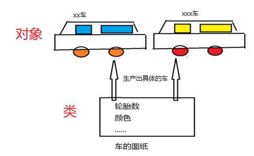

3.2对象的成员有属性和方法都表示什么

## 生活中描述事物无非就是描述事物的属性和行为。

## 如：车有轮胎，颜色等属性，有开车的行为

## Java中用类class来描述事物也是如此。

## 属性：对应类中的成员变量。

## 行为：对应类中的成员函数

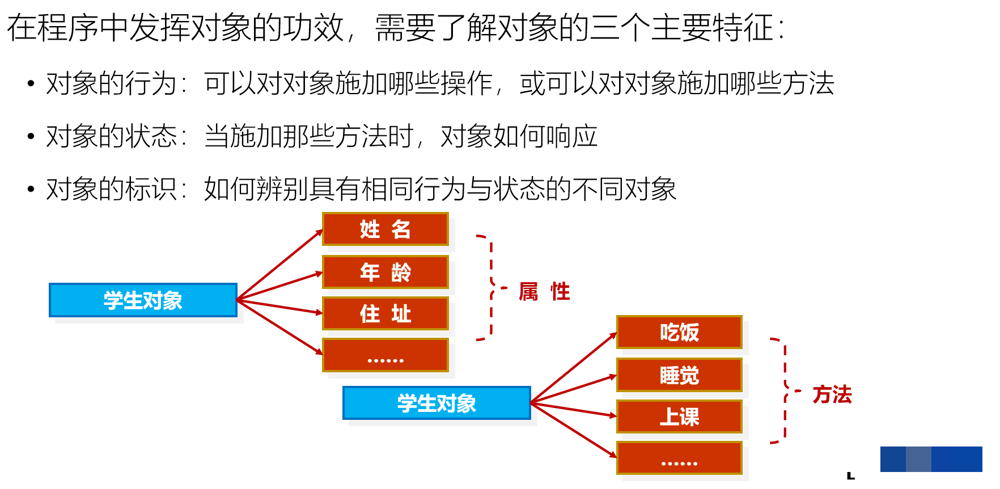

## 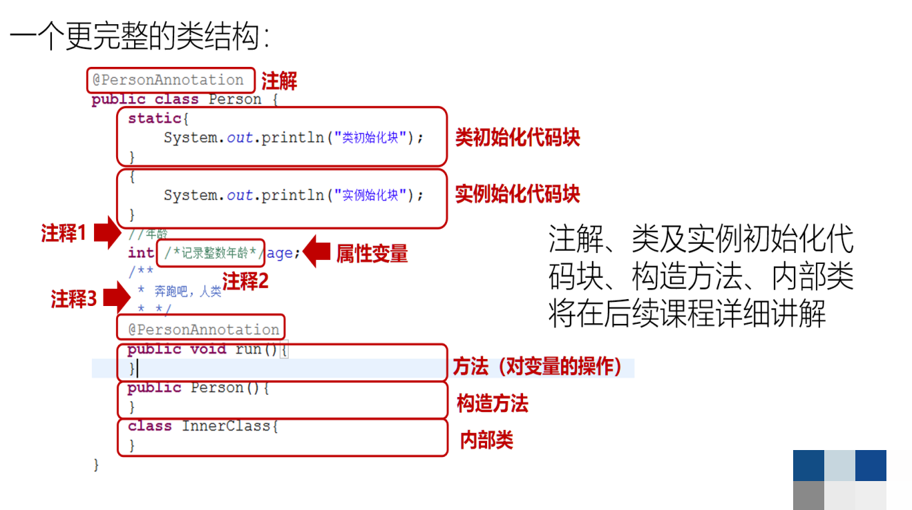

### 本节作业

1.  理解类和对象的关系
2.  对象的成员有属性是什么
3.  对象的成员有方法是什么

## 第四节 掌握面向对象的封装性

4.1封装的作用和意义

封装：把对象的属性和操作结合为一个独立的整体，并尽可能隐藏对象的内部实现细节。

如：看电视。我们只需要知道如何使用电视机和遥控器，会开关机和换台即可，不需要触碰电视机内部。制造厂家为了方便我们使用电视，把复杂的内部细节全部封装起来，只给我们暴露简单的接口，比如：电源开关。具体内部是怎么实现的，我们不需要操心。需要让用户知道的才暴露出来，不需要用户知道的全部隐藏起来。

程序的设计要追求“高内聚、低耦合”。（把复杂性封装起来，用的时候尽可能的简单）

高内聚就是类的内部数据操作细节自己完成，不允许外部干涉；低耦合是仅暴露少量的方法给外部使用，尽量方便外部调用。

4.2封装的优点

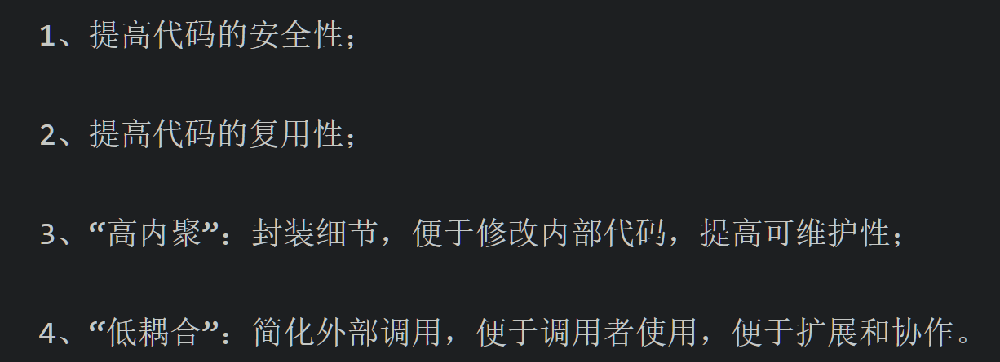

4.3为什么要封装

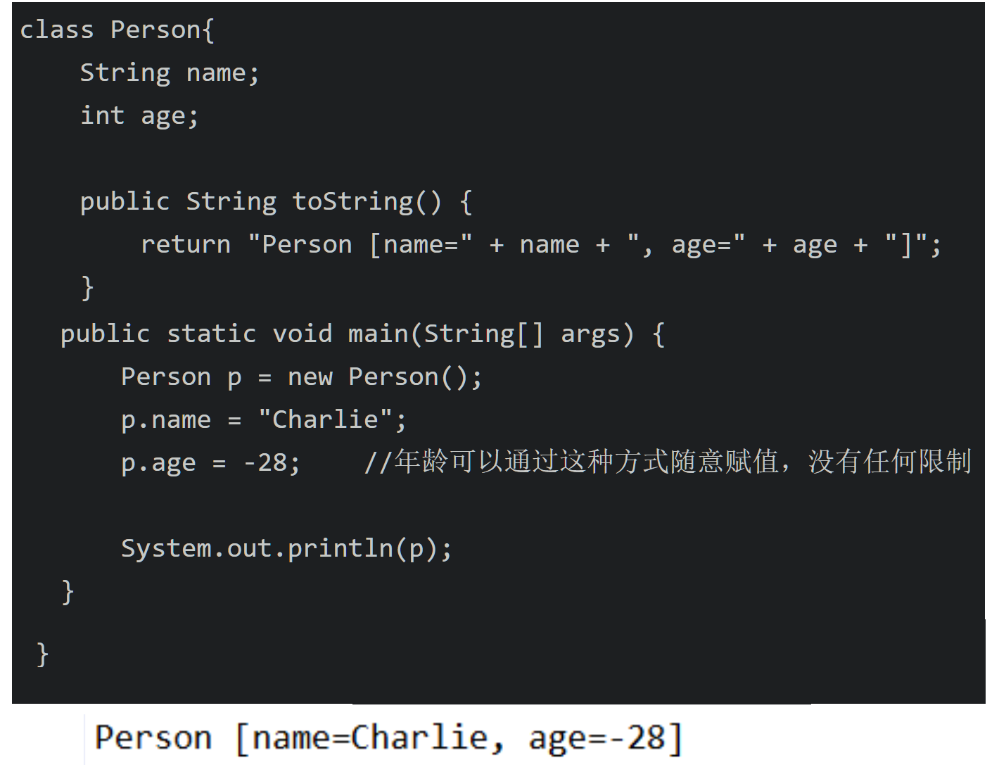

年龄不可能是负数，但是如果没有使用封装的话，便可以给年龄赋值成任意的整数，这显然不符合我们的正常逻辑思维。

我们可以使用一些特殊的关键词声明一些属性和方法，不让别的类看到，加访问控制符，可以控制访问权限。（通过访问控制符实现封装）

### 本节作业

1.  封装的概念

2\. 封装的意义

## 第五节 掌握构造方法的声明及特点

### 5.1构造器

### 创建对象的同时，完成新建对象的初始化工作。

5.2构造器的语法定义

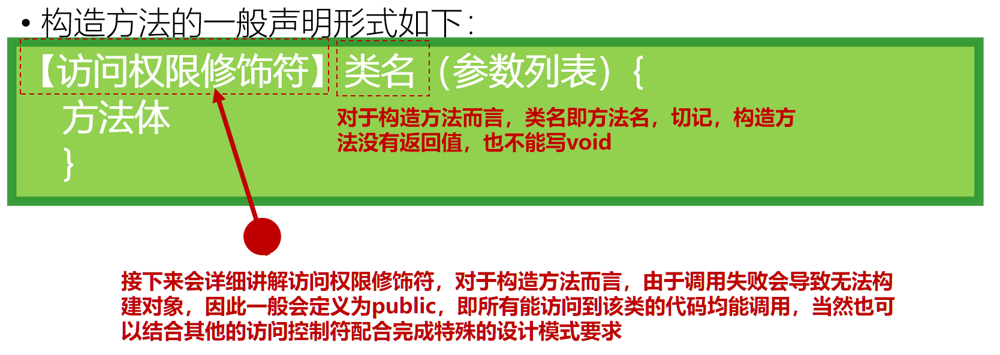

5.3构造器的调用

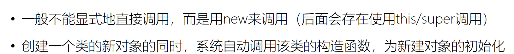

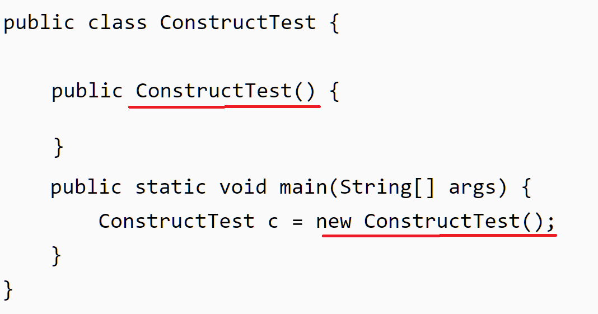

### 本节作业

1.理解什么是构造器

2.构造器的定义

3.构造器如何调用

## 掌握对象和引用内存详解

对象的创建过程与内存详解

对象的创建

使用new操作符可以创建某一个类的示例。

在java程序运行的时候，所有创建出来的实例都被放在 堆(heap)内存中。而引用则是放在了栈内存中。

对于栈内存来说，如果该数据是基本类型，那么栈里面存放的是这个基本类型的值；如果是引用类型，那么这块地址存放的是 堆这个实例中的地址

内存详解

java中内存主要分为内存堆，方法栈和方法区。

方法区

方法区是一块连续的内存，存放的是CLass文件加载到Java虚拟机内部之后的数据。  
表现在代码中： 方法区的东西就是我们Class类的实例，包含类中变量的定义，静态变量的值和定义，方法(所有方法，不管静态还是非静态)的字节码等数据。 我们可以通过反射每个类的Class实例来获取这些数据。  
所以每个方法区的数据是相对来说是静止的。因为类一旦加载进来，就不会变了，唯一会变的可能就是静态变量的值。  
一个类无论创建多少个实例，他都不会增加方法区占用的内存。因为方法区就好比一个模板，不因为赋值出来多少实例而变大或者变小

内存堆(Heap)

内存堆与数据结构的堆没有任何关系。  
创建对象的时候，对象实例存放到内存堆中。  
具体的例如  
比如 A a = new A();  
new A() 生成一个A对象实例，然后把它存放到堆中（ 对象A中的所有属性，都存放在堆中，如果是属性基本数据类型，直接存的是值，如果属性是引用数据类型，存放的是它的引用 ），然后把它存放堆中的具体的地址赋值给a；

涉及的知识点

一个对象占用的内存，是固定的

数组  
每种数据类型的数据，占用的内存大小是固定的，数组的长度也是创建的时候确定的，所以一个数组占用的内存就是 (数据类型大小\*数组长度) 。至于多维数组，多维数组里面除了最低的一个维，其余的都是引用，指向低一个维度的数组对象引用。所以无论多少维的数组，占用的内存都是一样

普通的类的对象  
上面方法区讲解过，方法字节码的数据，静态数据，变量定义等数据都在方法区里，那么一个对象占用的额外的数据，其实也就是成员变量。一个类中有几个成员变量是固定 。如果一个类就一个long，一个int，一个String引用，一个类A的引用，那么一个类应该占用多少内存呢？ long 8 + int 4+ 引用4 \*2 = 20个字节。当然每个对象还有一些额外的内存占用，这个所有的对象都是一样的。 至于两个引用类型占用的内存，这块要理解，String和类A的引用，其实是个引用，而不是对象本身。比如说类A的引用这个成员变量，这个引用可以指向A类的示例，A类的实例占用多少内存，这与包含这个引用的对象没关系。当然A类的实例也可以是null，但是null也占内存(因为引用占用内存)。

方法栈

栈就是stack，是一种先进后出的数据结构。方法栈里面存放的是执行方法需要的内存和对象的引用。

涉及的知识点

执行方法需要什么内存呢？  
解释 ：参数和局部变量。 每次执行一个方法，都要为这个方法的执行创建其中定义的参数和局部变量

每次执行一个方法，占用的内存都是一样的。  
解释：因为一个方法的参数和定义的局部变量的数量都是一样的。 可能有一个疑问，就是循环中定义的局部变量。 循环中定义的变量，其实是被重用 。一个for循环，定义了一个int变量，无论循环多少次，新的循环开始的时候，就可以重用之前定义的变量占用的内存，因为一个循环一旦结束，它占用的内存就没用了，可以被下次循环重新使用  
Stack的先进后出特性，和方法调用一样。比如m1方法调用m2方法，m2方法调用m3方法，过程是如下

先调用m1，根据m1的代码、确定m1执行的时候需要多少内存，在栈上分配相应大小的内存供m1执行使用，同时将分配的内存进栈

执行过程中调用m2，同样的过程，在栈上分配m2需要的内存，然后内存进栈

执行m2的时候，m2调用m3， 还是分配m3需要的内存，然后内存进栈

m3执行完毕，释放m3占用的内存(内存出栈)，然后m2继续执行，执行完毕内存释放，最后是m1继续执行，执行完毕内存释放  
如何访问栈上内存？  
因为每个方法执行需要的内存是固定的，那么在分配的这一截内存上，每个变量的地址都是固定的。正所谓冥冥之中自有定数，正是此意。所以这个和堆上面的内存是不一样的。堆上的内存需要根据引用，找到堆上面的对象，然后每个成员变量对应的内存地址，也都是冥冥中自有定数。

## 第七节 掌握this关键字的使用

this关键字代表当前对象

7.1在一个类的方法内部，可使用this

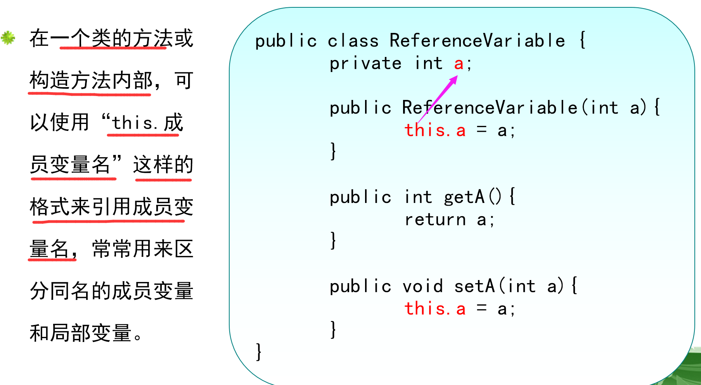

7.2在一个类的构造方法内部，可使用this

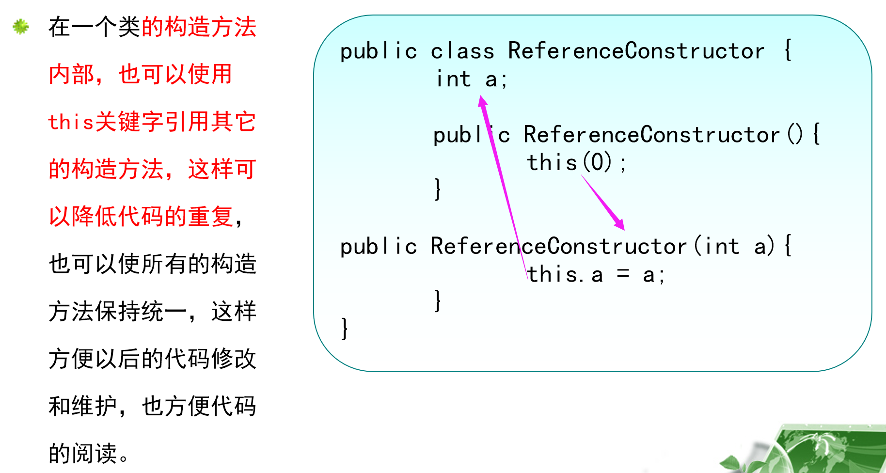

7.3在一个类的内部，成员方法之间的互相调用时使用this

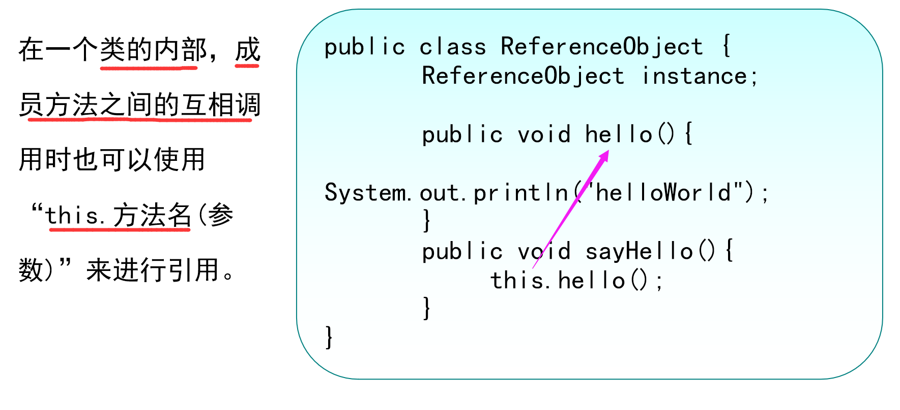

7.4在一个类的内部，也可以使用this代表自身类的对象

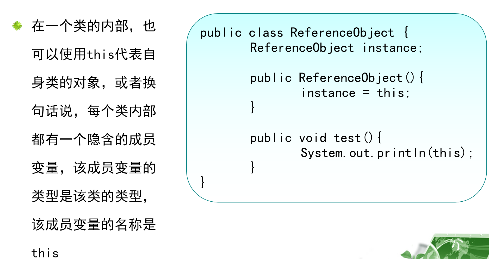

### 本节作业

1.  理解属性

2\. this是什么

3\. this的作用
