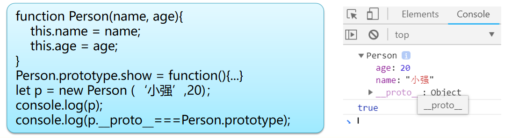
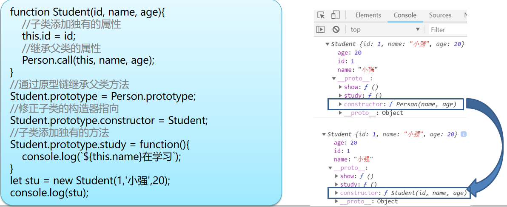
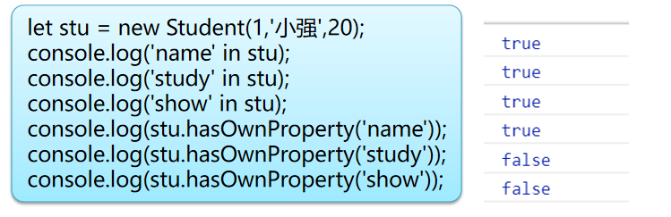
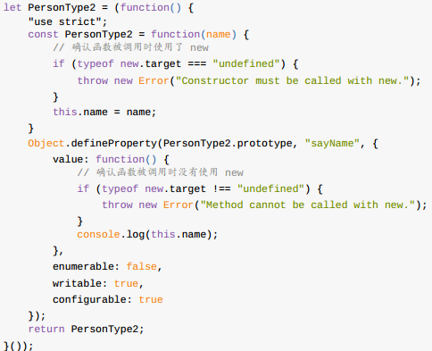
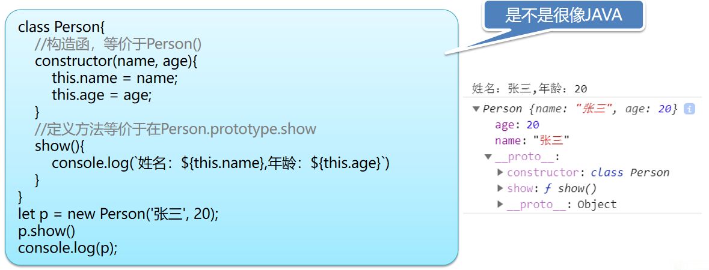
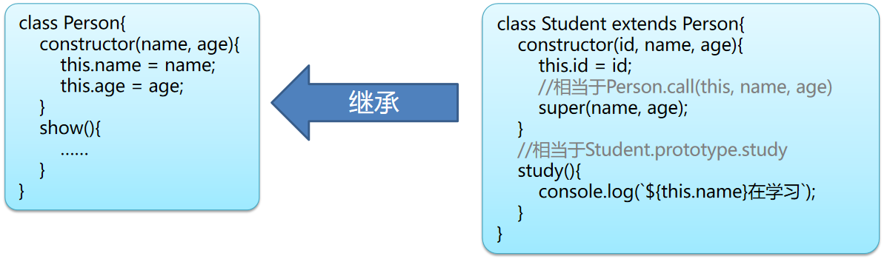
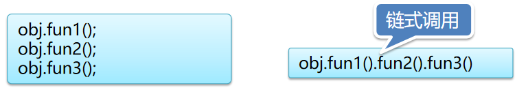
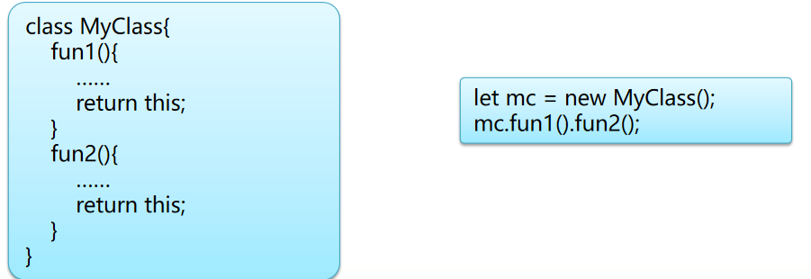

# 第6天【JS面向对象编程】

## 主要内容

1.  基于原型的面向对象编程
2.  继承和原型链
3.  ES6中面向对象新特性
4.  JavaScript面向对象高级特性

## 学习目标

| 节数                                 | 知识点                     | 要求 |
|--------------------------------------|----------------------------|------|
| 第一节（基于原型的面向对象编程）     | 基于原型的面向对象编程     | 掌握 |
| 第二节（继承和原型链）               | 继承和原型链               | 掌握 |
| 第三节（ES6中面向对象新特性）        | ES6中面向对象新特性        | 掌握 |
| 第四节（JavaScript面向对象高级特性） | JavaScript面向对象高级特性 | 掌握 |

## 第一节 基于原型的面向对象编程

### JavaScript面向对象基础

JavaScript也是面向对象的编程语言，存在对象、属性、方法等

和JAVA等语言不同，JavaScript是基于原型的面向对象编程语言

面向对象的两种实现方式：

1、基于类的（class）面向对象：java、C\#、objectC、C++ ... ...

2、基于原型的 (prototype) 面向对象：javaScript

JavaScript面向对象的特点：

和JAVA不同，JavaScript中只存在对象，而并没有“类”的存在；

在ES6之前，为了方便创建有相同属性、方法的对象，而总结出一套特定的代码编写方式（定义类）

ES6中虽然增加了class关键字，但更像是语法糖，并非真正的类

对象是JavaScript的基本数据类型之一，JavaScript对象包括：

本地对象（ native object ）： ECMA-262 定义为“独立于宿主环境的 ECMAScript 实现提供的对象”；主要包含Object、Function、Array、String、Boolean、Number、Date、RegExp等；即本地对象就是 ECMA-262 定义的类

内置对象（built-in object） ： ECMA-262 定义为“由 ECMAScript 实现提供的、独立于宿主环境的所有对象，在 ECMAScript 程序开始执行时出现”，包括Global 和 Math

Global对象是ECMAScript中最特别的对象，因为实际上它根本不存在

宿主对象：由ECMAScript实现的宿主环境提供的对象，可以理解为：浏览器提供的对象。所有的BOM和DOM都是宿主对象。

自定义对象：开发者自行定义类并据此创建的对象

注:

ECMA-262定义了ECMAScipt(ES)

很多资料中的内置对象等价于本地对象+内置对象

### 使用构造函数创建对象

使用JavaScript中的构造函数创建对象

当通过“new”关键字调用一个函数时，就会创建一个对象，在函数执行结束后返回这个对象，我们称这个函数为构造函数，也就是JavaScript的“类”

ECMAScript中内置了很多这样的函数，即本地对象

我们也可以根据自己的需求自定义构造函数

给对象添加属性和方法：

JavaScript中不存在真正的“类”（对象模板），创建对象后也可以再对其增加属性和方法，

构造函数中的的this，表示当前创建的对象

创建本地对象

var obj = new Object();

var arr = new Array(1，2，3);

创建对象并添加属性和方法

var stu = new Object();

stu.name = '小明';

stu.age = 20;

stu.sayHello = function(){

console.log('hello');

}

stu.show = function(){

console.log(\`姓名：\${this.name}，年龄：\${this.age}岁\`)

}

### 1.3 基于ES5的仿类结构

借助构造函数实现仿类结构：

在构造函数里为当前创建的对象添加属性、方法，构造函数起到了模板的作用

因为每一个对象会有独立的内存空间，每个对象的属性和方法都被分别保存在各自对象的内存空间中，即每个对象独有类的属性和方法。属性应该是每个对象所独有的，方法则不必，一则造成了不必要的内存销耗，也为修改（覆盖）这个类的方法造成困难。

function Person(name, age){

this.name = name;

this.age = age;

this.show = function(){

console.log(\`姓名：\${this.name}，年龄：\${this.age}岁\`)

}

}

let p1 = new Person('小强',20)

let p2 = new Person('小明',19)

console.log(p1.show === p2.show)//false

若想要方法被所有对象共享而非独享，需要引入原型（prototype）的概念

prototype也被原型称为原型，每一个函数（即Function的对象）内部都包含这个属性，相当于每个类都有一个prototype属性

在创建的对象中包含一个属性“\_ \_proto\_ \_”称为原型指针，指向所属类的原型，这样对象就能直接调用原型中的方法了。

最后我们利用构造函数和原型实现仿类结构

对象属性：构造函数中的this添加属性

对象方法：原型中添加方法

function Person(name, age){

this.name = name;//对象的属性

this.age = age;

}

Person.prototype.show = function(){

console.log(\`姓名：\${this.name}，年龄：\${this.age}岁\`)

}//对象的方法

let p1 = new Person('小强',20)

let p2 = new Person('小明',19)

p1.show();//直接调用原型中的方法

p2.show();

### 1.4 类（静态）成员

可在JavaScript中所有的函数也可以理解成是Function类的对象，即可以直接给类（构造函数）添加属性和方法，但是只能使用类名（构造函数）访问

function Fun(){

……

}

//添加类（静态）方法

Fun.method(){

……

}

//调用类（静态）方法

Fun.method();

### 1.5 基于JSON的仿类结构

JSON是采用“键-值”结构存储数据的数据结构，可以把每一个键值对理解成JSON对象的一个属性，如果其中的值是一个函数，则我们可以把这样的键值对当做JSON对象的方法。这样这个JSON对象就称为了一种仿类结构，且是只有单一对象的仿类结构

var p= {

name: "张三", //属性

age: 20,//属性

show: function(){

console.log(\`姓名：\${this.name}，年龄：\${this.age}岁\`)

}//方法

};

p.show();

### 本节作业

1.  掌握使用构造函数创建对象
2.  掌握基于ES5的仿类结构
3.  掌握JSON结构的单体类

## 第二节 继承和原型链

### 2.1实现对现有类的扩展

既然我们已经知道了设计ES5伪类结构时，定义方法就是给原型添加函数（静态方法是添加到构造函数上）；那么对于已经存在的类，我们也可以用同样的方式给类添加新的方法，或是对类原有的方法进行覆盖，从而实现对已有类的扩展。

Array类扩展一个方法

Array.protoType.calcSum = function(){

let sum = 0;

for(let i=0; i\<this.length; i++){

sum += this[i];

}

return sum;

}

### 2.2 call、apply、bind

call、apply和bind函数都是Function类的函数，他的作用是可以改变函数调用的this指向，以实现将原本调用方法的对象替换成另外一个对象；

一个关于apply函数的黑魔法：

Array没有max方法，Math对象有max对象但是参数不是数组，我们可以根据apply传递参数的特性将这个数组当成参数传入，最终Math.max函数调用的时候会将apply的数组里面的参数一个一个传入，恰好符合Math.max的参数传递方式

const arr = [1,2,3,4,5,6]

const max = Math.max.apply(null, arr)

console.log(max)

call和apply的区别是在给被调用函数的传参的参数形式

call函数：传递参数列表

call(thisParam, arg1, arg2, ……)

apply函数：将所有参数组成一个数组

apply (thisParam, argArray)

注：第一个参数为null或undefined时将传入window对象

apply和bind的区别：

apply立刻调用了函数，其返回的是函数执行后的返回值

bind的返回值为替换了this后的函数并不会立刻调用，这样就可以重复使用这个函数了

### 2.3基于原型链实现类的继承

#### 2.3.1

JavaScript中ES5伪类结构也可以像其他面向对象语言一样实现子类的继承父类的属性和方法

属性复制父类的属性实现继承：

子类构造器中遍历父类的属性，将得到属性加入子类对象

当然这种方式的缺点也很明显：

通过循环获得父类属性，效率不高

子类和父类间没明显的关联

最重要一点父类的方法被添加给了子类的对象而非自类原型，除非父类方法是不可枚举的

function Student(id, name, age){

this.id = id;

let p = new Person(name, age);

for(let prop in p){

this[prop] = p[prop];

}

}

#### 2.3.2

使用call函数实现对父类属性的继承

这种方式更接近java中子类构造中的super()

利用call函数的特性，调用父类构造函数时用自类对象替换掉父类构造函数中的this，这样就可以借用父类的构造函数给子类对象添加属性

这样也不会把父类原型中的方法添加给子类对象。

function Student(id, name, age){

this.id = id;

Person.call(this, name, age);

}

#### 2.3.3原型链

一个对象的原型指针（__proto__）指向其构造函数的原型（prototype），那么这个原型也是一个对象，他也有原型指针，原型的原型指针又指向谁呢？

它会指向父类的原型。就拿Person类来说，Person原型的原型指针会指向Object的原型（Object是所有类的父类）。

而对于子类对象来说，通过原型和原型指针构成的链条可以调用父类原型中的方法

function Person(name, age){

this.name = name;

this.age = age;

}

console.log(Person.prototype.__proto_\_ === Object.prototype);//true

原型链：就是通过子类原型指向父类原型而构成的原型链条

#### 2.3.4

利用原型继承父类中的方法

现在我们实现了子类Student对父类Person的继承，仔细观察Student的构造器constructor指向父类型，这是修改原型时造成的，需要修正回子类型

### 2.4 in和hasOwnProperty

关键字in和hasOwnProperty()方法都用来判定一个对象是否包含特定的属性或方法的

in：既可以检查对象本身是否包含属性（方法），也可以向上到原型链中查找

hasOwnProperty方法：只能检查对象本身是否包含该属性（方法），不能去原型中查找

### 本节作业

1.  实现对现有类的扩展
2.  掌握call和apply的特点
3.  掌握基于原型链实现类的继承
4.  掌握in和hasOwnProperty的特点

## 第三节 ES6中面向对象新特性

### 3.1 ES5伪类的缺陷

虽然我们学习了ES5仿类的定义方法，但是这样的定义简陋、不严谨；

保证构造函数一定被new关键调用

保障成员方法不被new关键字调用

属性应能枚举，但方法不应能被枚举，

由于ES5不法可靠的判定一个函数是否是被new调用的，ES6中为函数引入了new.target元素判定该函数的执行是否为new调用的

完善的ES5伪类结构的定义代码略显冗长

### 3.2 ES6使用class关键字定义类

ES6中增加了class关键字，让类的定义更加便捷；不过这只是一个语法糖而已并不是新的数据结构。

ES6使用class定义类有别于ES5伪类结构的特点

类的声明不会被提升，这与函数定义不同；类声明的行为与“let”相似，在程序执行到到达声明处之前，类会存在暂时性死区

类声明中的所有代码会自动运行在严格模式下，且无法退出严格模式

类的所有方法都是不可枚举的，这是对于伪类结构的显著变化；伪类结构必须使用Object.defineProperty()才能将方法变为可枚举

类的所有方法内部都没有[[Construct]]，因此使用new来调用他们会抛出错误

调用类的构造器时不使用new，会抛出错误；使用call函数也不能伪造

不具名的类表达式:

let Person = class{

//构造函，等价于Person()

constructor(name, age){

this.name = name;

this.age = age;

}

//定义方法等价于在Person.prototype.show

show(){

console.log(\`姓名：\${this.name},年龄：\${this.age}\`)

}

}

let p = new Person('张三', 20);

p.show()

console.log(p);

### 3.3 ES6ES6定义静态成员

在定义方法时在方法名前添加static关键字，就可以定义称为静态方法；相当于ES5伪类结构中类型名直接添加方法

class MyClass{

......

//定义静态方法

static fun(){

console.log('这里是静态方法')

}

}

//调用静态方法

MyClass.fun();

### 3.4 ES6实现类的继承

ES6新增了extends关键字，方便继承的代码实现；被继承的类既可以是ES6的类，也可以是ES5伪类结构，因为ES6的面向对象扩展本身就是语法糖

### 本节作业

1.  了解ES5伪类的缺陷
2.  熟练掌握ES6中使用class关键字定义类，定义静态成员，实现类的继承

## 第四节 JavaScript面向对象高级应用

### 4.1闭包

#### 4.1.1

官方对闭包的解释是：一个拥有许多变量和绑定了这些变量的环境的表达式（通常是一个函数），因而这些变量也是该表达式的一部分。

对于这样的“鬼话”显然很难理解。先看下面的一段代码，对于fun函数内部定义的变量val来说，依据JavaScript变量的作用范围的特性，无论用let或var定义这个变量，在位置2可以对其访问，但是位置1则无法对其访问。

function fun{

let val = 10;

function inner(){

//位置2

}

}

//位置1

我们换个思路，因为inner函数可以访问变量val，若在位置1处可以得到inner函数，则可以借助inner访问val，这样的访问方式就是闭包

function fun{

let val = 10;

function inner(){

//位置2

return val;

}

return inner;

}

//位置1

let f = fun();

//f就是inner函数，调用函数f得到的返回值就是val变量的值

console.log(f());

#### 4.1.2 闭包实现封装

function fun(){

let age = 0;

return {

"set":function(param){

age = param\<0?0:param;

},

"get":function(){

return age;

}

};

}

#### 4.1.3 使用闭包需要注意的问题

内部函数被外部函数返回，所以外部函数执行结束后，内部函数所分配的栈仍然存在；

又因为内部函数使用了外部函数中定义的局部变量，所以这个变量并不会随着外部函数的执行结束而被垃圾回收；

所以闭包延长了局部变量的声明周期

### 4.2链式调用

JavaScript有一种很优雅的代码编写方式，可以将对象所需调用的一系列方法连续调用，被称为链式调用

链式调用的实现：

### 本节作业

1.  熟练掌握闭包的使用，并完成对应练习案例
2.  熟练掌握链式调用的实现，并完成对应练习案例
