# 第1天【Jquery】

## 主要内容

1.  jQuery简介
2.  jQuery选择器

    3.jQuery操作DOM对象的常用方法

## 学习目标

| 节数                                  | 知识点                      | 要求 |
|---------------------------------------|-----------------------------|------|
| 第一节（jQuery简介）                  | jQuery简介                  | 掌握 |
| 第二节（jQuery选择器）                | jQuery选择器                | 掌握 |
| 第三节（jQuery操作DOM对象的常用方法） | jQuery操作DOM对象的常用方法 | 掌握 |

## 第一节 jQuery简介

### jQuery简介

jQuery由美国人John Resig于2006年创建。

jQuery是目前最流行的JavaScript程序库，它是对JavaScript对象和函数的封装。

它的设计思想是write less,do more。

### 1.2 jQuery能做什么

-   访问和操作DOM元素
-   控制页面样式
-   对页面事件进行处理
-   扩展新的jQuery插件
-   与Ajax技术完美结合

### 1.3 jQuery的优势：

-   jQuery能做的JavaScript也都能做，但使用jQuery能大幅提高开发效率。
-   体积小，压缩后只有100KB左右
-   强大的选择器
-   出色的DOM封装
-   可靠的事件处理机制
-   出色的浏览器兼容性
-   使用隐式迭代简化编程
-   丰富的插件支持

### 1.4 jQuery基本语法

\<mapper namespace="victor"\>

\<insert id="insertStar"\>

insert into star(name,age,score) values(\#{name},\#{age},\#{score})

\</insert\>

\</mapper\>

### 1.5 DOM对象和jQuery对象

DOM对象：直接使用JavaScript获取的节点对象:

var obj=document.getElementById("title");

jQuery对象：使用jQuery包装DOM对象后产生的对象，它能够使用jQuery中的方法:

\$("\#title").html( );

等同于

document.getElementById("title").innerHTML;

注意：DOM对象和jQuery对象分别拥有一套独立的方法，不能混用。

### 1.6 jQuery对象转DOM对象

jQuery对象都是一个类似数组的对象，可以通过下标的方式得到相应的DOM对象。

通过[index]方式获得相应的DOM对象：

var \$txtName =\$ ("\#txtName"); //jQuery对象

var txtName =\$txtName[0]; //DOM对象

通过get(index)方式得到相应的DOM对象

var \$txtName =\$("\#txtName"); //jQuery对象

var txtName =\$txtName.get(0); //DOM对象

### 1.6 jQuery基础选择器

jQuery 最核心的组成部分就是：选择器引擎。它继承了CSS的语法，可以对DOM元 素的标签名、属性名、状态等进行快速准确的选择，并且不必担心浏览器的兼容性。jQuery 。选择器实现了CSS1\~CSS3 的大部分规则之外，还实现了一些自定义的选择器，用于各种 特殊状态的选择。

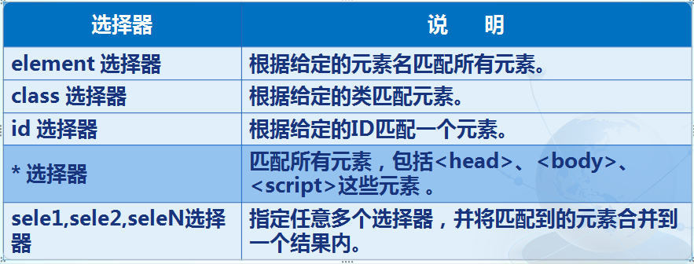

### 1.6.1 element 选择器

**element 选择器：根据给定的元素名匹配所有元素。**

\$("p").css("font-weight","bold");

alert(\$("p").length); //结果为3

… … …

\<p\>这是第一个段落\</p\>

\<p\>这是第二个段落\</p\>

\<p\>这是第三个段落\</p\>

### 1.6.2 class 选择器

class 选择器：根据给定的类匹配元素。

.first{

font-size:32px;

}

… … …

\$(".first").css("color","blue");

… … …

\
这是第一个段落\</p\>

\<p\>这是第二个段落\</p\>

\<p\>这是第三个段落\</p\>

### 1.6.3 id 选择器

id 选择器：根据给定的ID匹配一个元素。

\$("\#one").html("段落里的内容被改成这样了！");

… … …

\<p\>这是第一个段落\</p\>

\
这是第二个段落\</p\>

\<p\>这是第三个段落\</p\>

### 1.6.4 \* 选择器

\* 选择器：匹配所有元素。

\$("\*").css("background","red").css("color","blue");

… … …

\<p\>这是第一个段落\</p\>

\<h3\>这是一个h3标题\</h3\>

注意：\*将获得页面上所有元素对象

alert(\$("\*")[0].nodeName); 运行结果：HTML

\* 选择器会极大消耗资源，所以不建议在全局使用。

可以结合其他选择器，在一个局部范围内查找所有对象。

### 1.6.5 sele1,sele2,seleN选择器

sele1,sele2,seleN选择器：指定任意多个选择器，并将匹配到的元素合并到一个结果内。

.first{ font-size:32px; }

\$("p,h3,.first,\#one").css("color","blue");

\<p\>这是第一个段落\</p\>

\
这是第二个段落\</p\>

\
这是第三个段落\</p\>

\<h3\>这是一个h3标题\</h3\>

### 本节作业

1.  掌握jquery的概念及发展历程
2.  描述出什么是jquery及其作用
3.  掌握jQuery对象转DOM对象

## 第二节jQuery选择器

### 2.1 jQuery基本选择器

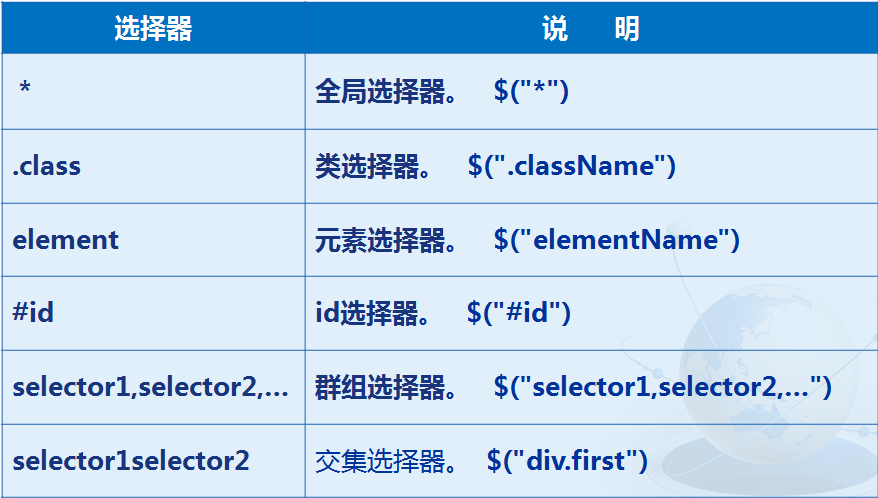

### 2.2 jQuery层次选择器

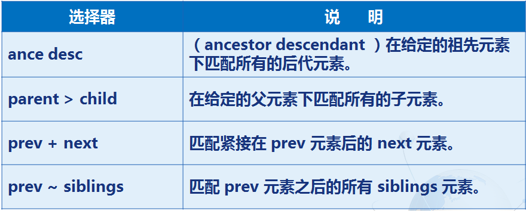

### 2.2.1 ance desc选择器

ance desc选择器：（ancestor descendant ）在给定的祖先元素下匹配所有的后代元素。

\$("div span").css("color","blue");

… … …

\<div\>

\<p\>这是一个\<span\>段落\</span\>\</p\>

\<span\>这是一个span\</span\>

\</div\>

补充：jQuery为后代选择器提供了一个等价的find()方法：

\$("div").find("span").css("color","blue");

### 2.2.2 parent \> child选择器

parent \> child选择器：在给定的父元素下匹配所有的子元素（只包括子元素，不包括孙元素）。

\$("div \> span").css("color","blue");

… … …

\<div\>

\<p\>这是一个\<span\>段落\</span\>\</p\>

\<span\>这是一个span\</span\>

\</div\>

补充：jQuery为子选择器提供了一个等价的children()方法：

\$("div").children("span").css("color","blue");

### 2.2.3 prev + next 选择器

prev + next 选择器：匹配紧接在 prev 元素后的 next 元素（同级）。

注意： 中间不能有其他元素。

也就是说， prev元素最紧邻的下一个元素由next选择器返回的并且只返回唯的一个元素 。 prev元素和next是同辈的。

\$("span + p").css("color","blue");

… … …

\<span\>这是一个span\</span\>

\<p\>这是第一个段落\</p\>

\<p\>这是第二个段落\</p\>

补充：jQuery为next选择器提供了一个等价的next()方法：

\$("span").next("p").css("color","blue");

### 2.2.4 prev \~ siblings 选择器

prev \~ siblings 选择器：匹配 prev 元素之后的所有同级(兄弟)元素。

注意：中间可以有其他元素。

也就是说： prev \~ siblings选择器也是查找prev 元素之后的相邻元素， 但它获取prev 元素后面全部相邻的元素 。

\$("span \~ p").css("color","blue");

… … …

\<span\>这是一个span\</span\>

\<p\>这是第一个段落\</p\>

\<p\>这是第二个段落\</p\>

补充：jQuery为nextAll选择器提供了一个等价的nextAll()方法：

\$("span").nextAll("p").css("color","blue");

### 2.3 jQuery提供的实现选择器功能的方法

jQuery还提供了更丰富的方法来选择元素。

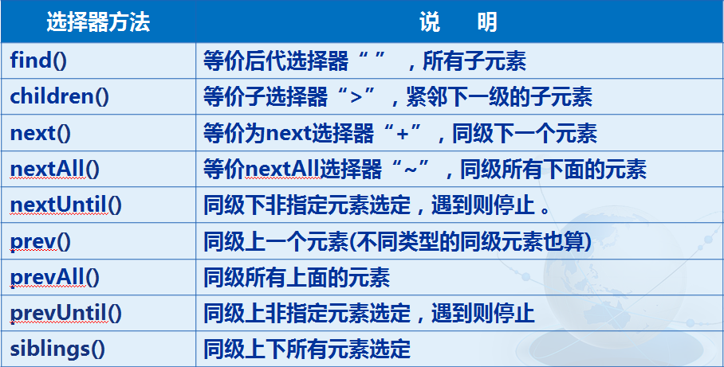

### 2.3.1 find、children、next、nextAll

上述find、children、next、nextAll四个方法中，也可以不传递参数。

如果不传递参数，相当于参数为\*。

\$("span").next().css("color","blue");

… … …

\<span\>这是一个span\</span\>

\<strong\>这是一个strong\</strong\>

\<p\>这是第一个段落\</p\>

\<p\>这是第二个段落\</p\>

next()没有给参数，就相当于next("\*")，所有取得的是span后的第一个

相邻元素。

### 2.3.2 prev()

prev() : 同级上一个元素(不同类型的同级元素也算)

\$("\#one").prev().css("background","red");

… … …

\<p\>aaaaaaa\</p\>

\<p\>aaaaaaa\</p\>

\<span\>ssssssss\</span\>

\
aaaaaaa\</p\>

\<p\>aaaaaaa\</p\>

\<p\>aaaaaaa\</p\>

### 2.3.3 prevAll ()

prevAll() : 同级所有上面的元素

\$("\#one").prevAll().css("background","red");

… … …

\<p\>aaaaaaa\</p\>

\<p\>aaaaaaa\</p\>

\<span\>ssssssss\</span\>

\
aaaaaaa\</p\>

\<p\>aaaaaaa\</p\>

\<p\>aaaaaaa\</p\>

### 2.3.4 prevUntil()

prevUntil() : 同级上非指定元素选定，遇到则停止

\$("\#one").prevUntil("span").css("background","red");

\$("\#one").nextUntil("em").css("background","red");

… … …

\<span\>ssssssss\</span\>

\<p\>aaaaaaa\</p\>

\<p\>aaaaaaa\</p\>

\
aaaaaaa\</p\>

\<h3\>aaaaaaa\</h3\>

\<h3\>aaaaaaa\</h3\>

\<em\>eeeeeee\</em\>

### 2.3.5 siblings()

siblings() : 同级上下所有元素选定

\$("\#one").siblings().css("background","red");

… … …

\<span\>ssssssss\</span\>

\<p\>aaaaaaa\</p\>

\<p\>aaaaaaa\</p\>

\
aaaaaaa\</p\>

\<h3\>aaaaaaa\</h3\>

\<h3\>aaaaaaa\</h3\>

\<em\>eeeeeee\</em\>

### 2.4 jQuery基本过滤选择器

该类型的选择器是根据某种过滤规则对DOM对象进行筛选，类似CSS中的伪类选择器。书写时以“：”号开头,通常用于查找集合元素中的某一位置的单个元素。

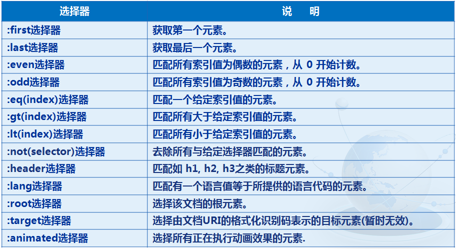

### 2.4.1 :first选择器 :last选择器

:first选择器：获取第一个元素。

:last选择器：获取最后一个元素。

\$("li:first").css("color","blue");

\$("li:last").css("color","red");

… … …

\<ul\>

\<li\>这是第一个列表项\</li\>

\<li\>这是第二个列表项\</li\>

\<li\>这是第三个列表项\</li\>

\</ul\>

### 2.4.2 :even选择器 :odd选择器

:even选择器：匹配所有索引值为偶数的元素，从 0 开始计数。

:odd选择器：匹配所有索引值为奇数的元素，从 0 开始计数。

\$("tr:even").css("background","\#3980F4");

\$("tr:odd").css("background","\#9ED6FA");

… … …

\<table\>

\<tr\>\<td\>周一：\</td\>\<td\>红烧肉\</td\>\</tr\>

\<tr\>\<td\>周二：\</td\>\<td\>酱猪蹄\</td\>\</tr\>

\<tr\>\<td\>周三：\</td\>\<td\>烤鸭\</td\>\</tr\>

\<tr\>\<td\>周四：\</td\>\<td\>烧鸡\</td\>\</tr\>

\<tr\>\<td\>周五：\</td\>\<td\>大龙虾\</td\>\</tr\>

\<tr\>\<td\>周六：\</td\>\<td\>鱼翅\</td\>\</tr\>

\<tr\>\<td\>周天：\</td\>\<td\>燕窝\</td\>\</tr\>

\</table\>

### 2.4.3 :eq(index)选择器 :gt(index)选择器 :lt(index)选择器

\$("tr:lt(3)").css("background","red");

\$("tr:gt(3)").css("background","blue");

\$("tr:eq(3)").css("background","yellow");

… … …

\<table\>

\<tr\>\<td\>周一：\</td\>\<td\>红烧肉\</td\>\</tr\>

\<tr\>\<td\>周二：\</td\>\<td\>酱猪蹄\</td\>\</tr\>

\<tr\>\<td\>周三：\</td\>\<td\>烤鸭\</td\>\</tr\>

\<tr\>\<td\>周四：\</td\>\<td\>烧鸡\</td\>\</tr\>

\<tr\>\<td\>周五：\</td\>\<td\>大龙虾\</td\>\</tr\>

\<tr\>\<td\>周六：\</td\>\<td\>鱼翅\</td\>\</tr\>

\<tr\>\<td\>周天：\</td\>\<td\>燕窝\</td\>\</tr\>

\</table\>

### 2.4.4 :not(selector)选择器

\$("tr:not(tr:eq(3))").css("background","yellow");

… … …

\<table\>

\<tr\>\<td\>周一：\</td\>\<td\>红烧肉\</td\>\</tr\>

\<tr\>\<td\>周二：\</td\>\<td\>酱猪蹄\</td\>\</tr\>

\<tr\>\<td\>周三：\</td\>\<td\>烤鸭\</td\>\</tr\>

\<tr\>\<td\>周四：\</td\>\<td\>烧鸡\</td\>\</tr\>

\<tr\>\<td\>周五：\</td\>\<td\>大龙虾\</td\>\</tr\>

\<tr\>\<td\>周六：\</td\>\<td\>鱼翅\</td\>\</tr\>

\<tr\>\<td\>周天：\</td\>\<td\>燕窝\</td\>\</tr\>

\</table\>

### 2.5 jQuery内容过滤选择器

内容过滤器的过滤规则主要是包含的子元素或文本内容上。

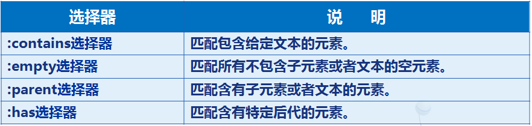

### 2.5.1 :contains选择器

:contains选择器：匹配包含给定文本的元素。

\$("tr:contains('烧')").css("background","red");

… … …

\<table\>

\<tr\>\<td\>周一：\</td\>\<td\>红烧肉\</td\>\</tr\>

\<tr\>\<td\>周二：\</td\>\<td\>酱猪蹄\</td\>\</tr\>

\<tr\>\<td\>周三：\</td\>\<td\>烤鸭\</td\>\</tr\>

\<tr\>\<td\>周四：\</td\>\<td\>烧鸡\</td\>\</tr\>

\<tr\>\<td\>周五：\</td\>\<td\>大龙虾\</td\>\</tr\>

\<tr\>\<td\>周六：\</td\>\<td\>鱼翅\</td\>\</tr\>

\<tr\>\<td\>周天：\</td\>\<td\>燕窝\</td\>\</tr\>

\</table\>

### 2.5.2 :empty选择器

:empty选择器 ：匹配所有不包含子元素或者文本的空元素。

p{ height:20px; background:yellow; }

.first{ height:20px; background:red; }

… … …

\$("p:empty").addClass("first");

… … …

\<p\>这是一个段落\</p\>

\<p\>\<span\>\</span\>\</p\>

\<p\> \</p\>

\<p\>\</p\>

### 2.5.3 :parent选择器

:parent选择器 : 匹配含有子元素或者文本的元素。

p{ height:20px; background:yellow; }

.first{ height:20px; background:red; }

… … …

\$("p:parent").addClass("first");

… … …

\<p\>这是一个段落\</p\>

\<p\>\<span\>\</span\>\</p\>

\<p\> \</p\>

\<p\>\</p\>

### 2.5.4 :parent选择器

:parent选择器 : 匹配含有子元素或者文本的元素。

p{ height:20px; background:yellow; }

.first{ height:20px; background:red; }

… … …

\$("p:parent").addClass("first");

… … …

\<p\>这是一个段落\</p\>

\<p\>\<span\>\</span\>\</p\>

\<p\> \</p\>

\<p\>\</p\>

### 本节作业

1.  熟练使用jQuery基本选择器
2.  熟练掌握jQuery层次选择器
3.  掌握字段名与属性名不一致解决方案

## 第三节 jQuery操作DOM对象的常用方法

### 3.1 对元素内容的操作

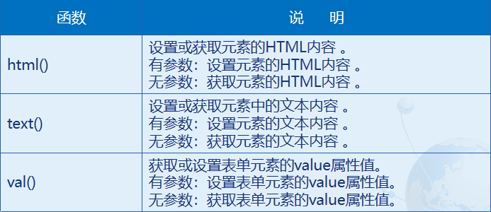

### 3.1.1 html() text()

html() ：设置或获取元素的HTML内容（如果是元素集合，那么获取的是第一个元素的内容）。

text() ：设置或获取元素中的文本内容（如果是元素集合，那么将获取元素集合中所有文本） 。

alert(\$("div").html() + "\\n" + \$("div").text());

... ... ...

\<div\>

\<ul\>

\<li\>红烧肉\</li\>

\<li\>酱猪蹄\</li\>

\<li\>烤鸭\</li\>

\</ul\>

\</div\>

\$("p").html("\<strong\>p标签\</strong\>");

… … …

\<p\>\</p\>

### 3.1.2 val()

val() : 获取或设置元素的value属性值。

alert(\$("\#username").val());

… … …

\<input id="username" type="text" value="请在这里输入姓名"\>

### 3.2 对元素属性的操作

### 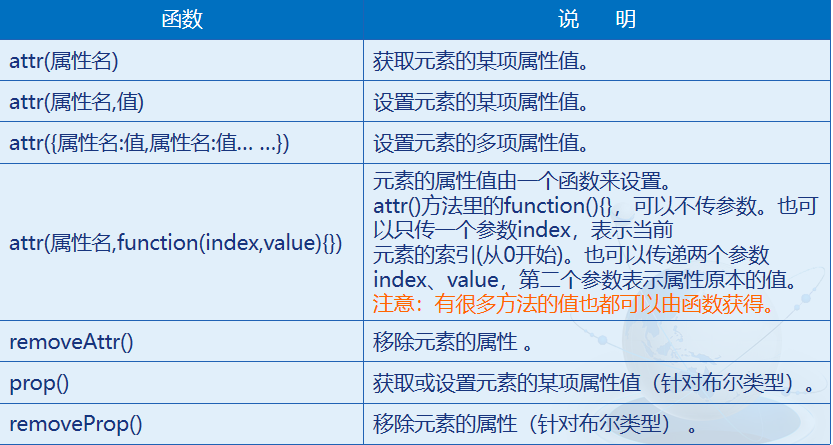

### 3.2.1 attr()

attr() : 获取或设置元素的某项或多项属性值。

alert(\$("input").eq(0).attr("type"));

\$("input").eq(1).attr("type","radio");

\$("input").eq(2).attr("type",function(index,value){

//alert(index + "," + value);

return "checkbox";

});

… … …

\<input type="text"\>\<br\>

\<input type="text"\>\<br\>

\<input type="text"\>\<br\>

### 3.2.2 removeAttr()

removeAttr() : 移除元素的属性。

\$("a").removeAttr("href");

… … …

\<a href="http://www.baidu.com"\>我还是一个超链接吗？\</a\>\<br\>

### 3.2.3 attr() 与 prop() 的区别

官方的建议：

返回值是布尔类型的属性，如 checked, selected 或者 disabled 使用prop()，其他的使用 attr()。

（原因在于布尔类型的属性可以只存在，而不用设值。那么attr()获取就有问题。包括removeProp()也是这样。）

\$("\#selectAll").prop("checked",true);

\$("\#selectAll").removeProp("disabled");

… … …

\<input id="selectAll" type="checkbox"\>

### 3.3 对元素样式的操作

### 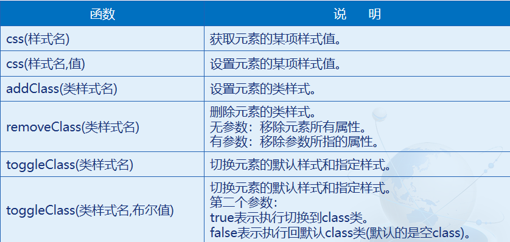

### 3.3.1 css()设置多个样式

//\$("div").css("width","100px").css("height","100px").css("background","red");

\$("div").css({

"width":"100px",

"height":"100px",

"background":"red"

});

… … …

\<div\>\</div\>

### 3.3.2 addClass()

css() ：为元素设置CSS样式。

addClass() ：为元素添加类样式。

.first{

width: 100px;

height: 100px;

}

.second{

background: red;

}

… … …

\$("div").addClass("first second");

… … …

\<div\>这是一个层\</div\>

### 3.3.3 removeClass()

removeClass() : 移除元素的样式 。

没有参数时：移除元素所有属性。

有参数时：移除参数所指的属性。

.first{

color:red;

}

.second{

font-size: 32px;

}

… … …

//\$("p").removeClass();

//\$("p").removeClass("first");

\$("p").removeClass("first second");

… … …

\
这是一个段落\</p\>

### 3.4 jQuery中对象位置问题

### 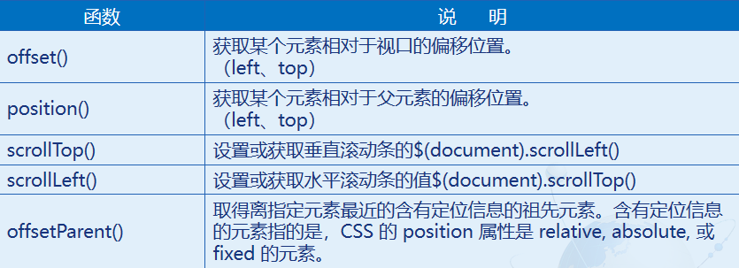

offset()：获取匹配元素在当前窗口的相对偏移，即top和left

\#one{

width: 200px;

height: 200px;

margin-left:30px;

margin-top:20px ;

background: red;

}

… … …

\
\</div\>

… … …

var w = \$("\#two").offset();

alert("距窗口位置：" + w.left + "," + w.top);

offsetParent() :取得离指定元素最近的含有定位信息的祖先元素。含有定位信息的元素指的是，CSS 的 position 属性是 relative, absolute, 或 fixed 的元素。

注意：这个方法返回一个元素对象，而不是一个值，所以它更像是一个选择器。

\#one{

width: 200px;height: 200px;

background: blue;

position:relative;

}

\#two{

width: 100px;height: 100px;

background: yellow;

position:absolute;

left: 100px;top:100px;

}

… … …

\$("\#two").offsetParent().css("background","green");

… ... ...

\
\
\</div\>\</div\>

### 3.5 jQuery中浏览器尺寸问题

### 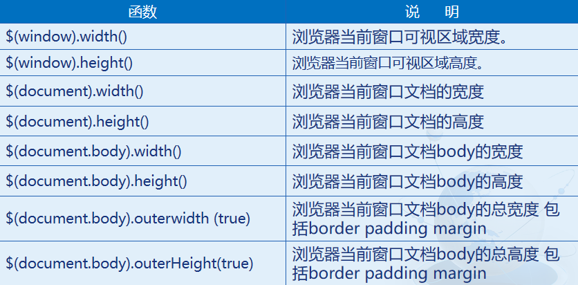

console.log("浏览器当前窗口可视区域：" + \$(window).width() + "," + \$(window).height());

console.log("浏览器当前窗口文档：" + \$(document).width() + "," + \$(document).height());

console.log("浏览器当前窗口文档body：" + \$(document.body).width() + "," + \$(document.body).height());

console.log("浏览器当前窗口文档body的总尺寸：" + \$(document.body).outerWidth(true) + "," + \$(document.body).outerHeight(true));

### 3.6 内部插入节点操作

### 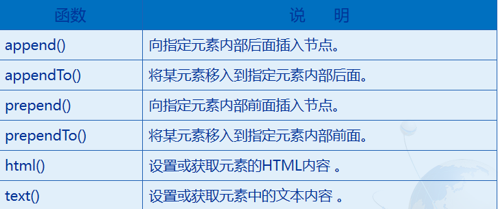

append() : 向元素内追加内容 。

prepend() : 向元素内追加前置内容。

被追加的内容，可以是字符、HTML元素标记，还可以是一个返回字符串内容的函数。

\$("\#one").prepend("\<p\>这是在前面追加的一个段落\</p\>");

\$("\#one").append("\<p\>这是在后面追加的一个段落\</p\>");

… … …

\

\<p\>这是一个段落\</p\>

\</div\>

appendTo() ：将某元素移入到指定元素内部后面。

prependTo()：将某元素移入到指定元素内部前面。

\$("\<p\>这是在前面追加的一个段落\</p\>").prependTo("\#one");

\$("\<p\>这是在后面追加的一个段落\</p\>").appendTo("\#one");

… … …

\

\<p\>这是一个段落\</p\>

\</div\>

### 3.7 外部插入节点操作

### 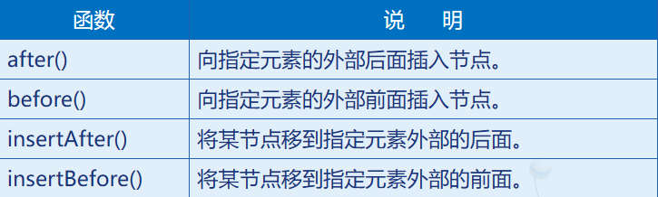

before() ：在整个元素的前面插入指定的元素或内容 。

after()：在整个元素的后面插入指定的元素或内容 。

\$(".first").before("\我给\</span\>");

\$(".first").after("\五百万\</span\>");

… … …

\你\</span\>

insertAfter()：将某节点移到指定元素外部的后面。

insertBefore()：将某节点移到指定元素外部的前面。

\$("\我给\</span\>").insertBefore(".first");

\$("\五百万\</span\>").insertAfter(".first");… … …

\你\</span\>

### 3.8 复制、删除和替换节点

### 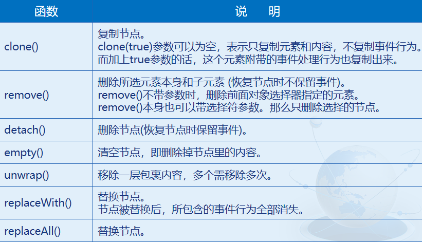

remove() : 删除所选元素本身和子元素 。

如果没有参数，将删除所有对象。

如果有参数，将删除参数所选对象。

\$("div p").remove();

… … …

\<div\>

\<p\>这是第一个段落\</p\>

\
这是第二个段落\</p\>

\
这是第三个段落\</p\>

\<p\>这是第四个段落\</p\>

\<span\>这是一个span\</span\>

\</div\>

\$("div p").remove(".first");

detach() :删除节点(恢复节点时保留事件)。

var obj = \$("div").find("p");

obj.click(function(){

alert(1111);

});

//obj.remove();

obj.detach();

\$("div").append(obj);

… … …

\<div\>\<p\>aaaa\</p\>\</div\>

### 

replaceWith() :将所有匹配的元素替换成指定的HTML或DOM元素。

参数为替换的内容。

\$("p").replaceWith("\<em\>替换成了这样\</em\>");

//\$("\<em\>替换成了这样\</em\>").replaceAll("p");

… … …

\<p\>这是一个段落\</p\>

\<p\>这是一个段落\</p\>

\<p\>这是一个段落\</p\>

### 本节作业

1.  熟练使用jQuery对元素操作的方法
2.  熟练掌握jQuery中对象尺寸问题
3.  掌握jQuery对节点操作的方法
