# 第2天【Jquery】

## 主要内容

1.  jQuery事件
2.  jQuery动画效果
3.  jQuery工具函数
4.  使用jQuery实现AJAX

## 学习目标

| 节数                         | 知识点             | 要求 |
|------------------------------|--------------------|------|
| 第一节（jQuery事件）         | jQuery事件         | 掌握 |
| 第二节（jQuery动画效果）     | jQuery动画效果     | 掌握 |
| 第三节（jQuery工具函数）     | jQuery工具函数     | 掌握 |
| 第四节（使用jQuery实现AJAX） | 使用jQuery实现AJAX | 掌握 |

## 第一节 jQuery事件

### 给元素对象绑定事件

给元素绑定事件

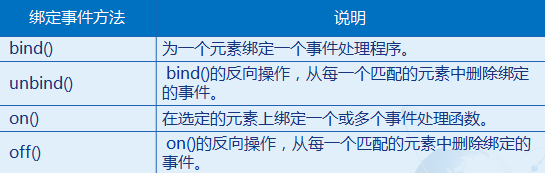

### 1.1.1 bind()

bind() : 为每个匹配元素的特定事件绑定事件处理函数（绑定多个事件时，事件名称用空格隔开）。

第一个参数就是事件名字符串。常用的事件名字符串有：click、dblclick、mousedown、mouseup、mousemovemouseover、mouseout、change、select、submit、keydown、keypress、keyup、blur、focus等等。

第二个参数为事件的回调函数。

\$("input[type='button']").bind("click",function(){

alert(\$(this).val());

});

… … …

\<input type="button" value="点击"\>\<br\>

多个事件类型可以通过用空格隔开一次性绑定：

\$("div").bind("mousemove mouseout",function(){ … ... });

使用JSON格式绑定多个事件处理：

\$('\#foo').bind({

click: function() { },

mouseenter: function() { }

});

### 1.1.2 unbind()

unbind()：bind()的反向操作，从每一个匹配的元素中删除绑定的事件。

\$("p").click(function(){

\$("p").css("font-size","24px");

});

\$("input[type='button']").click(function(){

\$("p").unbind("click");

});

… … …

\<p\>这是一个段落\</p\>

\<input type="button" value="移除p标签的click事件"\>\<br\>

### 1.1.3 on()

on()：在选定的元素上绑定一个或多个事件处理函数。

从jQuery 1.7开始，.on() 方法是事件绑定的首选方法。

\$("\#foo").on("click",function(){ alert(""); });

多个事件类型可以通过用空格隔开一次性绑定：

\$("div").on("mousemove mouseout",function(){ … ... });

使用JSON格式绑定多个事件处理：

\$('\#foo').on({

click: function() { },

mouseout: function() { }

});

向事件处理函数中传入数据，并且在事件处理函数中通过名字来获取传入的数据：

\$("\#foo").on("click",{name:"zhangsan",age:20},myHandler);

function myHandler(event){

alert(event.data.name + "," + event.data.age);

}

运行结果：zhangsan，20

给元素动态绑定事件：

var elementName = "p";

\$("body").on("click", elementName, function(){

alert( \$(this).text() );

});

… ... ...

\<div\>divdiv\</div\>

\<p\>pppppp\</p\>

### 1.1.4 off()

on()的反向操作，从每一个匹配的元素中删除绑定的事件。

//移除div上所有事件

\$("div").off();

\$("div").off("click");

var elementName = "p";

\$("body").off("click", elementName);

### 1.1.5 简写事件

使用on()绑定事件的写法比较繁琐，为了使开发者更加方便的绑定事件，jQuery封装了常用的事件以便节约更多的代码。这称为简写事件。

### 鼠标事件

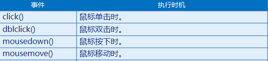

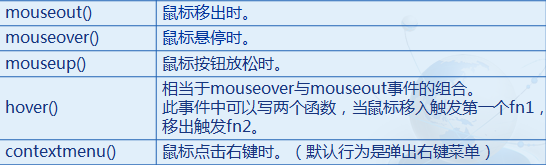

### 1.2.1 click() dblclick()

click()：鼠标单击时。

dblclick()：鼠标双击时。

\$("\#btn").click(function(){

alert("点击了！");

});

… … …

\<input id="btn" type="button" value="点击"\>

### 1.2.2 mousemove()… …

\$("div").mousedown(function(){

\$("p").html("mousedown");

});

\$("div").mousemove(function(){

\$("p").html("mousemove");

});

\$("div").mouseout(function(){

\$("p").html("mouseout");

});

\$("div").mouseover(function(){

\$("p").html("mouseover");

});

\$("div").mouseup(function(){

\$("p").html("mouseup");

});

… … …

\<div\>\</div\>

\<p\>\</p\>

### 1.2.3 hover()

hover() ：相当于mouseover与mouseout事件的组合。

当鼠标移到所选元素上时，执行方法中的第一个函数，鼠标移出

时，执行方法中的第二个函数。

.first{

color:blue;

}

… … …

\$("p").hover(

function(){

\$(this).addClass("first");

},

function(){

\$(this).removeClass("first");

}

);

… … …

\<p\>这是一个段落\</p\>

### 1.3 键盘事件

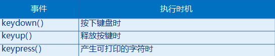

keydown( )：按下键盘时

keyup( )：释放按键时

keypress( )：产生可打印的字符时

\$("input[type='text']").keydown(function(){

alert("keydown");

});

\$("input[type='text']").keyup(function(){

alert("keyup");

});

\$("input[type='text']").keypress(function(){

alert("keypress");

});

… … …

\<input type="text"\>

### 1.4 表单事件

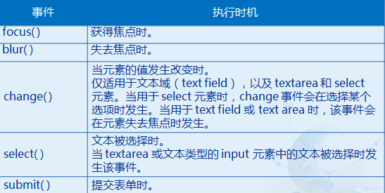

### 1.4.1 focus( ) blur( )

focus( ) ：获得焦点时。

blur( )：失去焦点时。

\$("input[type='text']").focus(function(){

\$(this).val("");

});

\$("input[type='text']").blur(function(){

\$(this).val("张三");

});

… … …

\<input type="text" value="--这里输入用户名--"\>\<br\>

### 1.4.2 change( )

change( ) :当元素的值发生改变时。

\$("input[type='text']").change(function(){

\$(this).val(“学习jQuery”);

});

… … …

\<input type="text" value="学习jQuery"\>\<br\>

### 1.4.3 select( )

select( ) : 文本被选择时。

\$("input[type='text']").select(function(){

\$(this).css("color","red");

});

… … …

\<input type="text" value="学习jQuery"\>\<br\>

### 1.5 事件对象的属性或方法

在事件处理函数中的第一个参数，默认就为事件对象。

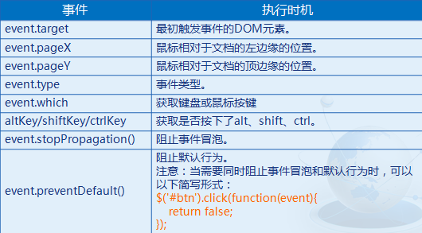

### 1.5.1 event.target

event.target : 最初触发事件的DOM元素。

\$(document).click(function(event){

alert(event.target.nodeName=="INPUT");

alert(event.target.id);

alert(event.target.type);

});

… … …

\<input id="btn" type="button" value="按钮"\>

\<p\>这是一个段落\</p\>

\<span\>这是一个span\</span\>

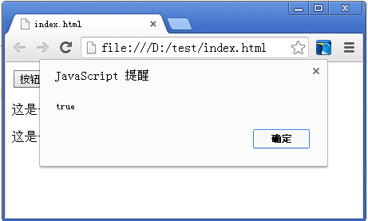

### 1.5.2 event.pageX event.pageY

event.pageX : 鼠标相对于文档的左边缘的位置。

event.pageY : 鼠标相对于文档的顶边缘的位置。

\$(document).mousemove(*function*(*event*){

\$("\#x").html(*event*.pageX);

\$("\#y").html(*event*.pageY);

});

… … …

\<p\>鼠标的X轴坐标为：\\</span\>\</p\>

\<p\>鼠标的Y轴坐标为：\\</span\>\</p\>

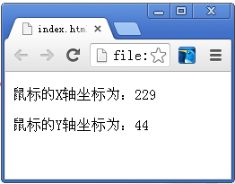

### 1.5.3 event.pageX event.pageY

event.type : 事件类型。

\$("p").click(function(event){

alert(event.type);

});

… … …

\<p\>这是一个段落\</p\>

\<p\>这是一个段落\</p\>

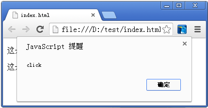

### 1.5.4 event.which

event.which：获取键盘按键

\$("input").keydown(function(event){

alert(event.which);

});

… … …

\<input type="text"\>

event.which：获取鼠标按键：

1 = 鼠标左键 left; 2 = 鼠标中键; 3 = 鼠标右键 )

\$(document).mousedown(function(event){

alert(event.which);

});

### 1.6 其他事件

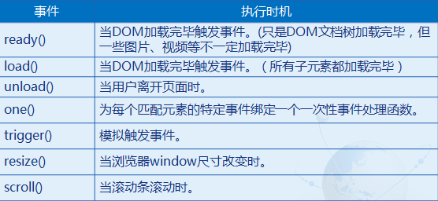

### 1.6.1 unload()

unload()：当用户离开页面时。

\$(window).unload(function() {

... ... ...

});

### 1.6.2 one()

one()：为每个匹配元素的特定事件绑定一个一次性事件处理函数。

\$("input[type='button']").one("click",function(){

alert("我被点击了一次！");

});

… … …

\<input type="button" value="点击"\>

### 1.6.3 trigger()

trigger()：模拟触发事件。

在事件触发的时候，有时我们需要一些模拟用户行为的操作。例如：当网页加载完毕后自行点击一个按钮触发一个事件，而不是让用户去点击。

\$("\#btn").click(function(event){

alert("按钮被点击了");

});

\$("\#btn").trigger("click");

… … …

\<button id="btn"\>点击\</button\>

也可以这样写：

\$("\#btn").click(function(event){

alert("按钮被点击了");

}).trigger("click");

当需要传递参数时，可以使用中括号的形式，参数之间用逗号分隔。

\$("\#btn").click(function(event,param1,param2){

alert(param1 + "," + param2);

}).trigger("click",[10,20]);

### 1.6.4 resize()

resize() 当浏览器window尺寸改变时。

(注意：由于内部实现机制的问题，此事件可能会被触发两次)

\$(window).resize(function() {

alert("页面尺寸改变了！");

});

### 1.6.5 scroll()

scroll() 当滚动条滚动时。

\$(window).scroll(function() {

alert("滚动了！");

});

### 1.7 JavaScript中事件传播过程那些事儿

早期的web开发，浏览器厂商很难回答一个哲学上的问题：当你在页面上的一个区域点击时，你真正感兴趣的是哪个元素。这个问题带来了交互的定义。在一个元素的界限内点击，显得有点含糊。毕竟，在一个元素上的点击同时也发生在另一个元素的界限内。例如单击一个按钮。你实际上点击了按钮区域、body元素的区域以及html元素的区域。

伴随着这个问题，两种主流的浏览器Netscape和IE有不同的解决方案。Netscape定义了一种叫做事件捕获的处理方法，事件首先发生在DOM树的最高层对象(document)然后往最深层的元素传播。在图例中，事件捕获首先发生在document上，然后是html元素，body元素，最后是button元素。

IE的处理方法正好相反。他们定义了一种叫事件冒泡的方法。事件冒泡认为事件促发的最深层元素首先接收事件。然后是它的父元素，依次向上，知道document对象最终接收到事件。尽管相对于html元素来说，document没有独立的视觉表现，他仍然是html元素的父元素并且事件能冒泡到document元素。所以图例中噢噢那个button元素先接收事件，然后是body、html最后是document。

### 1.7.1 事件捕获与事件冒泡

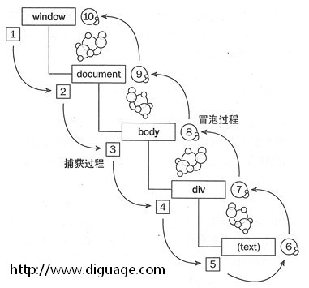

事件冒泡：即事件最开始由当前发生事件的元素接收，然后逐级向上传播。拿上面的DOM元素结构图来说明，就是当点击text部分时，先由text处的元素接收，然后逐级传播至window。

事件捕获：即事件最早由最顶层节点接收，而当前发生事件的元素最后接收到事件。拿上面的DOM元素结构图来说明，就是点击text部分时，先由window接收，然后逐级传播至text元素

W3C非常理智的处理了这种差异，在两者之间采取了中和的方法，它规定任何事件首先会被捕获直到遇到目标元素，然后再向上返回。

而WEB开发人员可以通过addEventListener()方法来选择在哪个阶段注册事件处理器（捕获阶段还是冒泡阶段）。

addEventListener()方法的最后一个参数为true，则代表事件在捕获阶段被处理，false则代表事件在冒泡阶段被处理。

\
父节点\
子节点\</div\>\</div\>

\<script\>

var father = document.getElementById("father");

var son = document.getElementById("son");

son.addEventListener('click', function() {

alert('子节点捕获')

}, true);

son.addEventListener('click', function() {

alert('子节点冒泡')

}, false);

father.addEventListener('click', function() {

alert('父节点捕获')

}, true);

father.addEventListener('click', function() {

alert('父节点冒泡')

}, false);

\</script\>

运行结果： 点击子节点： 父节点捕获 －\> 子节点捕获 -\> 子节点冒泡 -\> 父节点冒泡

点击父节点： 父节点捕获 －\> 父节点冒泡

### 1.7.2 事件委托

事件委托：通俗的讲，就是真正的事件对象本身并不去处理事件，而是委托其他对象去处理。也就是：利用冒泡的原理，把事件加到父级上，触发执行效果。它的好处就是可以大幅提高性能。

事件委托基本原理

document.onclick = function(event){

event = event \|\| window.event;

switch(event.target.id){

case "help-btn”:

openHelp();

break;

case "save-btn”:

saveDocument();

break;

case "undo-btn”:

undoChanges();

break;

}

};

使用on()实现事件委托

上面例子中只能使用事件冒泡原理，将事件都委托给document。

而使用on()能够更加灵活的实现事件委托。

\$("\#one").on("click","p", function() {

alert(\$(this).html());

});

… ... ...

\

\<p\>aaaa\</p\>

\<p\>bbbb\</p\>

\<p\>cccc\</p\>

\</div\>

事件委托与事件绑定

当需要为多个对象绑定事件时，由于事件委托只需要将事件绑定到一个对象上，所以事件委托的效率要远远高于事件绑定。

尽量使用‘事件委托’进行事件处理，这也是提高JavaScript性能的一个准则。

### 本节作业

1.  掌握如何给元素对象绑定事件
2.  掌握常见的鼠标事件，键盘事件，表单事件
3.  掌握常见的事件对象的属性或方法
4.  掌握事件捕获与事件冒泡

## 第二节jQuery动画效果

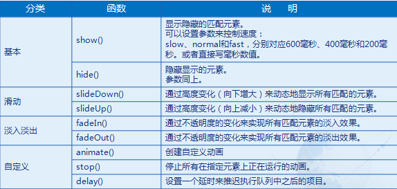

### 2.1 show() hide()

show() ：显示隐藏的匹配元素。

hide() ：隐藏显示的元素。

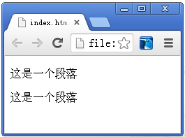//\$("p").last().hide();

\$("p").last().hide("fast");

… … …

\<p\>这是一个段落\</p\>

\<p\>这是一个段落\</p\>

\<p\>这是一个段落\</p\>

### 2.2 slideDown() slideUp()

slideDown() ：通过高度变化（向下增大）来动态地显示所有匹配的元素。

slideUp() ：通过高度变化（向上减小）来动态地隐藏所有匹配的元素。

div{ width: 100px;height: 100px;background: red;}

… … …

\$("\#show").click(function(){

\$("div").slideDown(3000);

});

\$("\#hide").click(function(){

\$("div").slideUp(3000);

});

… … …

\<div\>\</div\>

\<input id="show" type="button" value="显示"\>

\<input id="hide" type="button" value="隐藏"\>

### 2.3 fadeIn() fadeOut()

fadeIn() ：通过不透明度的变化来实现所有匹配元素的淡入效果。

fadeOut() ：通过不透明度的变化来实现所有匹配元素的淡出效果。

div{ width: 100px;height: 100px;background: red;}

… … …

\$("\#show").click(function(){

\$("div").fadeIn(3000);

});

\$("\#hide").click(function(){

\$("div").fadeOut(3000);

});

… … …

\<div\>\</div\>

\<input id="show" type="button" value="显示"\>

\<input id="hide" type="button" value="隐藏"\>

### 2.4 animate() 实现自定义动画效果

调用animate()方法可以创建自定义动画效果，它的调用格式为：

\$(selector).animate({params},speed,[callback])

params参数：制作动画效果的CSS属性名与值。

speed参数：为动画的效果的速度，单位为毫秒。

callback参数：可选项，为动画完成时执行的回调函数名**。**

div{

background:red;

width:0px;

height:0px;

}

… … …

\$("div").animate({

"width":"100px",

"height":"100px"

},3000);

… … …

\<div\>\</div\>

div{

background:red;

width:0px;

height:0px;

}

… … …

\$("div").animate({

"margin-left":"200px",

"margin-top":"100px",

"width":"50px",

"height":"50px"

},3000);

… … …

\<div\>\</div\>

### 2.5 stop() 停止动画效果

stop()方法的功能是在动画完成之前，停止当前正在执行的动画效果，这些效果包括滑动、淡入淡出和自定义的动画，它的调用格式为：

\$(selector).stop([clearQueue],[goToEnd])

clearQueue：可选项，布尔值，表示是否停止正在执行的动画。

默认为false。

如果true，则清空队列。可以立即结束所有动画。

goToEnd：可选项，布尔值，表示是否完成正在执行的动画。

默认为false。

如果true，则立刻完成当前动画。进行下一个动画。

如果false，则立刻停止当前动画。进行下一个动画。

例如：

\$("\#div").stop();//停止当前动画，继续下一个动画

\$("\#div").stop(true);//清除元素的所有动画

\$("\#div").stop(false, true);//让当前动画直接到达末状态 ，继续下一个动画

\$("\#div").stop(true, true);//清除元素的所有动画，让当前动画直接到达末状态

function start(){

\$("div").animate({

"margin-left":"200px",

"margin-top":"100px",

},3000);

\$("div").animate({

"width":"50px",

"height":"50px"

},3000);

}

function stop(){

\$("div").stop();

}

… … …

\<div\>\</div\>

\<input type="button" value="启动" onclick="start()"\>

\<input type="button" value="停止" onclick="stop()"\>

### 2.6 delay() 方法延时执行动画

delay()方法的功能是设置一个延时值来推迟动画效果的执行，它的调用格式为：

\$(selector).delay(duration)

参数duration : 延时值，单位是毫秒，当超过延时值时动画继续执行。

function start(){

\$("div").delay(2000);

\$("div").animate({

"margin-left":"200px",

"margin-top":"100px",

},3000);

}

注意：delay()方法只对动画有效，因为只有动画才会延迟，才会**被加入delay()的延迟队列当中。**

所以delay()对hide()等无效，但对hide(0)却有效（0秒的动画也算延迟）。

### 本节作业

1.  熟练使用jQuery动画效果方法
2.  熟练掌握jQuery层次选择器

## 第三节jQuery工具函数

### 3.1 jQuery工具函数

工具函数主要是提供比如字符串、数组、对象等操作方面的遍历，以及对数据进行测试等。

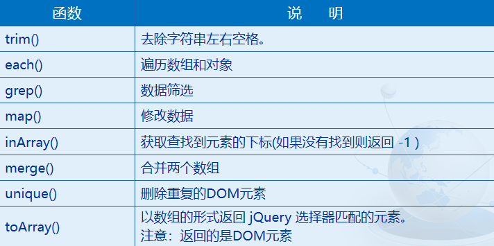

### 3.1.1 each()

each()：遍历数组和对象

var arr = [45,89,64,14,53];

\$.each(arr, function (index, value) {

alert(index + "," + value);

});

\------------------------------------------------------------

var arr = [];

\$.each(\$("p"), function (index, value) {

arr.push(value.innerHTML);

});

alert(arr);

… … …

\<p\>aaaaa\</p\>\<p\>bbbbb\</p\>\<p\>ccccc\</p\>

### 3.1.2 grep()

grep()：数据筛选

var arr = ["a","b","c","d","e","f","g","h"];

var arrSelect = \$.grep(arr, ction (element, index) {

return (element =="b" \|\| element=="c") && index \<4;

});

alert(arrSelect);

\-----------------------------------------------------------------------------

var arr = \$.grep(\$("p"),function(element,index){

return element.innerHTML=="bbbbb";

});

alert(arr);

… … …

\<p\>aaaaa\</p\>\<p\>bbbbb\</p\>\<p\>bbbbb\</p\>

### 3.1.3 map()

map()：修改数据

var arr = ["a","b","c","d","e","f","g","h"];

var updateArr = \$.map(arr, function(element,index) {

return element + "1";

});

alert(updateArr);

\-------------------------------------------------------------------

\$.map(\$("p"), function(element,index) {

return element.innerHTML += 1;

});

… … …

\<p\>aaaaa\</p\>\<p\>bbbbb\</p\>\<p\>bbbbb\</p\>

### 3.1.4 inArray()

inArray()：获取查找到元素的下标(如果没有找到则返回 -1 )

var arr = ["a","b","c","d","e","f","g","h"];

var arrInArray = \$.inArray("d", arr);

alert(arrInArray);

使用inArray()查找引用数据类型时要谨慎。

var obj = \$("p");

var arrInArray = \$.inArray(obj.last(), obj);

alert(arrInArray);

… … …

\<p\>aaaaa\</p\>\<p\>bbbbb\</p\>\<p\>bbbbb\</p\>

运行结果：-1

原因是：

var obj = \$("p");

\$.each(obj, function(index,value) {

alert(value==obj.first());

});

结果全部为false

### 3.2 数据测试

在jQuery中，数据有着各种类型和状态。有时，我们希望能通过判断数据的类型和状态做相应的操作。

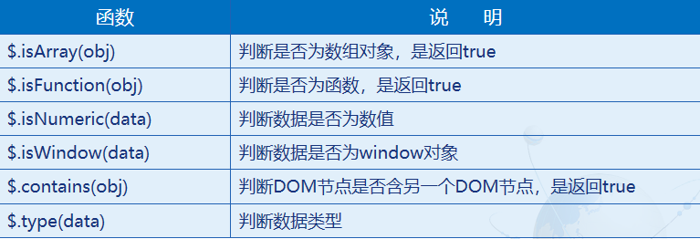

### 3.2.1 数据测试

\$.isArray(obj) ：判断是否为数组对象，是返回true

\$.isFunction(obj) ：判断是否为函数，是返回true

\$.isNumeric(data) ：判断数据是否为数值

\$.isWindow(data) ：判断数据是否为window对象

//判断是否为数组对象

var arr = [1,2,3];

alert(\$.isArray(arr));

//判断是否为函数

var fn = function () {};

alert(\$.isFunction(fn));

//判断是否为数值

alert(\$.isNumeric(45));

//判断是否为 window 对象

alert(\$.isWindow(window));

### 

### 3.2.2 contains()

\$.contains(obj) ：判断DOM节点是否含另一个DOM节点，

是返回true

var bool = \$.contains(\$("div").get(0),\$("p").get(0));

alert(bool);

… … …

\<div\>

\<p\>aaaaa\</p\>

\<p\>bbbbb\</p\>

\<p\>ccccc\</p\>

\</div\>

### 3.2.3 type()

\$.type() :判断数据类型

alert(\$.type(""));

alert(\$.type(function(){}));

alert(\$.type(213));

alert(\$.type(\$("p")));

### 本节作业

1.  熟练使用jQuery工具函数
2.  熟练掌握jQuery数据测试方法

## 第四节 使用jQuery实现AJAX

### 4.1 jQuery对Ajax的封装

jQuery对Ajax做了大量的封装，让我们在使用时非常方便，不需要去考虑其他的，如浏览器兼容性等问题。

对于封装的方式，jQuery采用了三层封装：

底层封装方法：\$.ajax()

第二层封装方法：.load()、\$.get()和\$.post()

第三层封装方法：\$.getScript()和\$.getJSON()

注意：

在处理复杂的Ajax请求时应该使用jQuery.ajax()。

其余5个方法是执行一般Ajax请求的简短形式。

### 4.2 \$.ajax()

\$.ajax()是所有ajax方法中最底层的方法，所有其他方法都是基于\$.ajax()方法的封装。这个方法只有一个参数，它传递很多个功能键值对的对象。

\$(function(){

\$("\#btn").click(function(){

\$.ajax({

type:"post",

url:"jqAjaxTest",

data:{

"username":"习近平"

},

success:function(respons,stutas,xhr){

\$("\#text").html(respons);

}

});

});

})

### 4.3 \$.ajax()方法的主要参数

url: 要求为String类型的参数，（默认为当前页地址）发送请求的地址。

type: 要求为String类型的参数，请求方式（post或get）默认为get。其他http请求方法，例如put和delete也可以使用，但仅部分浏览器支持。

timeout: 要求为Number类型的参数，设置请求超时时间（毫秒）。此设置将覆盖\$.ajaxSetup()方法的全局设置。

async：要求为Boolean类型的参数，默认设置为true，所有请求均为异步请求。 如果需要发送同步请求，请将此选项设置为false。

cache：要求为Boolean类型的参数，默认为true（当dataType为script时，默认为false）。设置为false将不会从浏览器缓存中加载请求信息。

data: 要求为Object或String类型的参数，发送到服务器的数据。如果已经不是字符串，将自动转换为字符串格式。get请求中将附加在url后。

dataType: 要求为String类型的参数，预期服务器返回的数据类型。如果不指定，JQuery将自动根据http包mime信息返回responseXML或responseText，并作为回调函数参数传递。

可用的类型如下：

xml：返回XML文档，可用JQuery处理。

html：返回纯文本HTML信息；包含的script标签会在插入DOM时执行。

script：返回纯文本JavaScript代码。不会自动缓存结果。除非设置了cache参数。注意在远程请求

时（不在同一个域下），所有post请求都将转为get请求。

json：返回JSON数据。

jsonp：JSONP格式。使用JSONP形式调用函数时，例如myurl?callback=?，JQuery将自动替换后一个 “?”为正确的函数名，以执行回调函数。

text：返回纯文本字符串。

complete：要求为Function类型的参数，请求完成后调用的回调函数（请求成功或失败时均调用）。

参数：XMLHttpRequest对象和一个描述成功请求类型的字符串。

function(XMLHttpRequest, textStatus){}

success：要求为Function类型的参数，请求成功后调用的回调函数，有三个参数。

(1)由服务器返回，并根据dataType参数进行处理后的数据。

(2)描述状态的字符串。

function(data, textStatus){

//data可能是xmlDoc、jsonObj、html、text等等

(3) XMLHttpRequest对象。

error：要求为Function类型的参数，请求失败时被调用的函数。该函数有3个参数，即XMLHttpRequest对象、错 误信息、捕获的错误对象(可选)。

### 4.4 \$.get()

load()适合做静态文件的异步获取，而对于需要传递参数到服务器页面

的，\$.get()和\$.post()更加合适。

\$.get()方法参数：

1、提交url

2、客户端提交数据

3、回调函数

4、服务器返回内容格式

前面三个参数和.load()一样。

第四参数即服务器返回的内容格式：包括xml、html、script、json、

jsonp和text。第一个参数为必选参数，后面三个为可选参数。第四参

数一般情况下是智能判断的，并不需要我们主动设置，如果主动设置，

则会强行按照指定类型格式返回。

\$(function(){

\$("\#btn").click(function(){

\$.get("jqAjaxTest",{

"username":"习近平"

},function(response,status,xhr){

if(status=="success"){

\$("\#text").html(response);

}

});

});

})

注意：\$.get()就相当于get方式提交。

### 4.5 全局Ajax事件处理

全局Ajax事件：它并不是专门针对某个Ajax请求，而是针对一个页面上的所有Ajax请求，而且它可以在ajax相关方法外引用。

ajaxStart：ajax请求开始前

ajaxSend：ajax请求时

ajaxSuccess：ajax获取数据后

ajaxComplete：ajax请求完成时

ajaxError：ajax请求发生错误后

ajaxStop：ajax请求停止后

全局Ajax事件的典型应用实例：

在页面中存在多个ajax请求，我们希望为这些ajax请求添加相同的消息机制。

比如：ajax请求开始前显示一个提示框，提示“正在读取数据“；ajax请求成功时提示框显示“数据获取成功”；ajax请求结束后隐藏提示框等等。

\$(function(){

\$("\#btn").click(function(){

\$.ajax({

… ... ...

}

});

});

\$(document).ajaxStart(function(){

alert("请求开始前");

}).ajaxSend(function(){

alert("ajax请求时");

}).ajaxSuccess(function(){

alert("ajax获取数据后");

}).ajaxComplete(function(){

alert("ajax请求完成时");

}).ajaxError(function(){

alert("ajax请求发生错误后");

}).ajaxStop(function(){

alert("ajax请求停止后");

});

})

### 4.6 总结：AJAX的缺点

AJAX的缺点：

AJAX请求不会留下history记录。

用户无法直接通过URL进入指定页面，比如：保存书签、链接分享等。

AJAX对SEO是一个灾难。

### 本节作业

1.  熟练掌握jQuery对Ajax的封装
2.  熟练掌握\$.ajax()方法的主要参数
3.  熟练掌握全局Ajax事件处理
