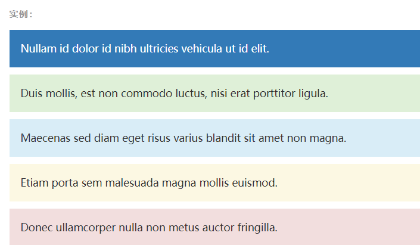

# 第1天【Bootstrap】

## 主要内容

1.  Bootstrap CSS

## Bootstrap 布局组件

1.  Bootstrap插件

## 学习目标

| 节数                         | 知识点             | 要求 |
|------------------------------|--------------------|------|
| 第一节（Bootstrap CSS）      | Bootstrap CSS      | 掌握 |
| 第二节（Bootstrap 布局组件） | Bootstrap 布局组件 | 掌握 |
| 第三节（Bootstrap插件）      | Bootstrap插件      | 掌握 |

## 第一节 Bootstrap CSS

### Bootstrap 网格系统

在平面设计中，网格是一种由一系列用于组织内容的相交的直线（垂直的、水平的）组成的结构（通常是二维的）。它广泛应用于打印设计中的设计布局和内容结构。在网页设计中，它是一种用于快速创建一致的布局和有效地使用 HTML 和 CSS 的方法。

Bootstrap 包含了一个响应式的、移动设备优先的、不固定的网格系统，可以随着设备或视口大小的增加而适当地扩展到 12 列。它包含了用于简单的布局选项的预定义类，也包含了用于生成更多语义布局的功能强大的混合类。

行必须放置在 .container class 内，以便获得适当的对齐（alignment）和内边距（padding）。

使用行来创建列的水平组。

内容应该放置在列内，且唯有列可以是行的直接子元素。

预定义的网格类，比如 .row 和 .col-xs-4，可用于快速创建网格布局。LESS 混合类可用于更多语义布局。

列通过内边距（padding）来创建列内容之间的间隙。该内边距是通过 .rows 上的外边距（margin）取负，表示第一列和最后一列的行偏移。

网格系统是通过指定您想要横跨的十二个可用的列来创建的。例如，要创建三个相等的列，则使用三个 .col-xs-4。

下面是 Bootstrap 网格的基本结构：

\

\

\
\</div\>

\
\</div\>

\</div\>

\
...\</div\>

\</div\>

\
....

### Bootstrap 代码

Bootstrap 允许您以两种方式显示代码：

第一种是 \<code\> 标签。如果您想要内联显示代码，那么您应该使用 \<code\> 标签。

第二种是 \<pre\> 标签。如果代码需要被显示为一个独立的块元素或者代码有多行，那么您应该使用 \<pre\> 标签。

请确保当您使用 \<pre\> 和 \<code\> 标签时，开始和结束标签使用了 unicode 变体： \&lt; 和 \&gt;。

让我们来看看下面的实例

\<p\>\<code\>&lt;header&gt;\</code\> 作为内联元素被包围。\</p\>

\<p\>如果需要把代码显示为一个独立的块元素，请使用 \&lt;pre&gt; 标签：\</p\>

\<pre\>

\&lt;article&gt;

\&lt;h1&gt;Article Heading&lt;/h1&gt;

\&lt;/article&gt;

\</pre\>

### Bootstrap 表格

为任意 \<table\> 标签添加 .table 类可以为其赋予基本的样式 — 少量的内补（padding）和水平方向的分隔线。这种方式看起来很多余！？但是我们觉得，表格元素使用的很广泛，如果我们为其赋予默认样式可能会影响例如日历和日期选择之类的插件，所以我们选择将此样式独立出来。

状态类

通过这些状态类可以为行或单元格设置颜色。

\<!-- On rows --\>

\<tr class="active"\>...\</tr\>

\<tr class="success"\>...\</tr\>

\<tr class="warning"\>...\</tr\>

\<tr class="danger"\>...\</tr\>

\<tr class="info"\>...\</tr\>

\<!-- On cells (\`td\` or \`th\`) --\>

\<tr\>

\<td class="active"\>...\</td\>

\<td class="success"\>...\</td\>

\<td class="warning"\>...\</td\>

\<td class="danger"\>...\</td\>

\<td class="info"\>...\</td\>

\</tr\>

### Bootstrap 表单

表单布局

Bootstrap 提供了下列类型的表单布局：

垂直表单（默认）

内联表单

水平表单

垂直或基本表单

基本的表单结构是 Bootstrap 自带的，个别的表单控件自动接收一些全局样式。下面列出了创建基本表单的步骤：

向父 \<form\> 元素添加 role="form"。

把标签和控件放在一个带有 class .form-group 的 \<div\> 中。这是获取最佳间距所必需的。

向所有的文本元素 \<input\>、\<textarea\> 和 \<select\> 添加 class ="form-control" 。

单独的表单控件会被自动赋予一些全局样式。所有设置了 .form-control 类的 \<input\>、\<textarea\> 和 \<select\> 元素都将被默认设置宽度属性为 width: 100%;。 将 label 元素和前面提到的控件包裹在 .form-group 中可以获得最好的排列。

\<form\>

\

\<label for="exampleInputEmail1"\>Email address\</label\>

\<input type="email" class="form-control" id="exampleInputEmail1" placeholder="Email"\>

\</div\>

\

\<label for="exampleInputPassword1"\>Password\</label\>

\<input type="password" class="form-control" id="exampleInputPassword1" placeholder="Password"\>

\</div\>

\

\<label for="exampleInputFile"\>File input\</label\>

\<input type="file" id="exampleInputFile"\>

\
Example block-level help text here.\</p\>

\</div\>

\

\<label\>

\<input type="checkbox"\> Check me out

\</label\>

\</div\>

\<button type="submit" class="btn btn-default"\>Submit\</button\>

\</form\>

内联表单

为 \<form\> 元素添加 .form-inline 类可使其内容左对齐并且表现为 inline-block 级别的控件。只适用于视口（viewport）至少在 768px 宽度时（视口宽度再小的话就会使表单折叠）。

可能需要手动设置宽度

在 Bootstrap 中，输入框和单选/多选框控件默认被设置为 width: 100%; 宽度。在内联表单，我们将这些元素的宽度设置为 width: auto;，因此，多个控件可以排列在同一行。根据你的布局需求，可能需要一些额外的定制化组件。

一定要添加 label 标签

如果你没有为每个输入控件设置 label 标签，屏幕阅读器将无法正确识别。对于这些内联表单，你可以通过为 label 设置 .sr-only 类将其隐藏。还有一些辅助技术提供label标签的替代方案，比如 aria-label、aria-labelledby 或 title 属性。如果这些都不存在，屏幕阅读器可能会采取使用 placeholder 属性，如果存在的话，使用占位符来替代其他的标记，但要注意，这种方法是不妥当的。

\<form class="form-inline"\>

\

\<label for="exampleInputName2"\>Name\</label\>

\<input type="text" class="form-control" id="exampleInputName2" placeholder="Jane Doe"\>

\</div\>

\

\<label for="exampleInputEmail2"\>Email\</label\>

\<input type="email" class="form-control" id="exampleInputEmail2" placeholder="jane.doe@example.com"\>

\</div\>

\<button type="submit" class="btn btn-default"\>Send invitation\</button\>

\</form\>

### Bootstrap 辅助类

### 情境文本颜色

\
...\</p\>

\
...\</p\>

\
...\</p\>

\
...\</p\>

\
...\</p\>

\
...\</p\>

### 情境背景色

\
...\</p\>

\
...\</p\>

\
...\</p\>

\
...\</p\>

\
...\</p\>

### 快速浮动

\
...\</div\>

\
...\</div\>

// Classes

.pull-left {

float: left !important;

}

.pull-right {

float: right !important;

}

// Usage as mixins

.element {

.pull-left();

}

.another-element {

.pull-right();

}

### 本节作业

1.  掌握Bootstrap 网格系统
2.  掌握Bootstrap 代码
3.  掌握Bootstrap表格，表单，辅助类应用

## 第二节Bootstrap 布局组件

### 2.1 Bootstrap 字体图标

什么是字体图标？

字体图标是在 Web 项目中使用的图标字体。虽然，Glyphicons Halflings 需要商业许可，但是您可以通过基于项目的 Bootstrap 来免费使用这些图标。

为了表示对图标作者的感谢，希望您在使用时加上 GLYPHICONS 网站的链接。

获取字体图标

我们已经在 环境安装 章节下载了 Bootstrap 3.x 版本，并理解了它的目录结构。在 fonts 文件夹内可以找到字体图标，它包含了下列这些文件：

glyphicons-halflings-regular.eot

glyphicons-halflings-regular.svg

glyphicons-halflings-regular.ttf

glyphicons-halflings-regular.woff

相关的 CSS 规则写在 dist 文件夹内的 css 文件夹内的 bootstrap.css 和 bootstrap-min.css 文件上。

CSS 规则解释

下面的 CSS 规则构成 glyphicon class。

@font-face {

font-family: 'Glyphicons Halflings';

src: url('../fonts/glyphicons-halflings-regular.eot');

src: url('../fonts/glyphicons-halflings-regular.eot?\#iefix') format('embedded-opentype'), url('../fonts/glyphicons-halflings-regular.woff') format('woff'), url('../fonts/glyphicons-halflings-regular.ttf') format('truetype'), url('../fonts/glyphicons-halflings-regular.svg\#glyphicons_halflingsregular') format('svg');

}

.glyphicon {

position: relative;

top: 1px;

display: inline-block;

font-family: 'Glyphicons Halflings';

\-webkit-font-smoothing: antialiased;

font-style: normal;

font-weight: normal;

line-height: 1;

\-moz-osx-font-smoothing: grayscale;

}

用法

如需使用图标，只需要简单地使用下面的代码即可。请在图标和文本之间保留适当的空间。

\\</span\>

下面的实例演示了如何使用字体图标：

实例

\<p\>

\<button type="button" class="btn btn-default"\>

\\</span\>

\</button\>

\<button type="button" class="btn btn-default"\>

\\</span\>

\</button\>

\<button type="button" class="btn btn-default"\>

\\</span\>

\</button\>

\<button type="button" class="btn btn-default"\>

\\</span\>

\</button\>

\</p\>

\<button type="button" class="btn btn-default btn-lg"\>

\\</span\> User

\</button\>

\<button type="button" class="btn btn-default btn-sm"\>

\\</span\> User

\</button\>

\<button type="button" class="btn btn-default btn-xs"\>

\\</span\> User

\</button\>

### 2.2 Bootstrap 下拉菜单

用于显示链接列表的可切换、有上下文的菜单。下拉菜单的 JavaScript 插件让它具有了交互性。

实例

将下拉菜单触发器和下拉菜单都包裹在 .dropdown 里，或者另一个声明了 position: relative; 的元素。然后加入组成菜单的 HTML 代码。

\

\<button class="btn btn-default dropdown-toggle" type="button" id="dropdownMenu1" data-toggle="dropdown" aria-haspopup="true" aria-expanded="true"\>

Dropdown

\\</span\>

\</button\>

\<ul class="dropdown-menu" aria-labelledby="dropdownMenu1"\>

\<li\>\<a href="\#"\>Action\</a\>\</li\>

\<li\>\<a href="\#"\>Another action\</a\>\</li\>

\<li\>\<a href="\#"\>Something else here\</a\>\</li\>

\<li role="separator" class="divider"\>\</li\>

\<li\>\<a href="\#"\>Separated link\</a\>\</li\>

\</ul\>

\</div\>

### 2.3 Bootstrap 按钮组

通过按钮组容器把一组按钮放在同一行里。通过与按钮插件联合使用，可以设置为单选框或多选框的样式和行为。

按钮组中的工具提示和弹出框需要特别的设置

当为 .btn-group 中的元素应用工具提示或弹出框时，必须指定 container: 'body' 选项，这样可以避免不必要的副作用（例如工具提示或弹出框触发时，会让页面元素变宽和/或失去圆角）。

确保设置正确的 role 属性并提供一个 label 标签

为了向使用辅助技术 - 如屏幕阅读器 - 的用户正确传达一正确的按钮分组，需要提供一个合适的 role 属性。对于按钮组合，应该是 role="group"，对于toolbar（工具栏）应该是 role="toolbar"。

一个例外是按钮组合只包含一个单一的控制元素或一个下拉菜单（比如实际情况，\<button\> 元素组成的两端对齐排列的按钮组 ）或下拉菜单。

此外，按钮组和工具栏应给定一个明确的label标签，尽管设置了正确的 role 属性，但是大多数辅助技术将不会正确的识读他们。在这里提供的实例中，我们使用 aria-label，但是， aria-labelledby 也可以使用。

\

\<button type="button" class="btn btn-default"\>Left\</button\>

\<button type="button" class="btn btn-default"\>Middle\</button\>

\<button type="button" class="btn btn-default"\>Right\</button\>

\</div\>

### 2.4 Bootstrap 输入框组

通过在文本输入框 \<input\> 前面、后面或是两边加上文字或按钮，可以实现对表单控件的扩展。为 .input-group 赋予 .input-group-addon 或 .input-group-btn 类，可以给 .form-control 的前面或后面添加额外的元素。

只支持文本输入框 \<input\>

这里请避免使用 \<select\> 元素，因为 WebKit 浏览器不能完全绘制它的样式。

避免使用 \<textarea\> 元素，由于它们的 rows 属性在某些情况下不被支持。

输入框组中的工具提示和弹出框需要特别的设置

为 .input-group 中所包含的元素应用工具提示（tooltip）或popover（弹出框）时，必须设置 container: 'body' 参数，为的是避免意外的副作用（例如，工具提示或弹出框被激活后，可能会让当前元素变得更宽或/和变得失去其圆角）。

不要和其他组件混用

不要将表单组或栅格列（column）类直接和输入框组混合使用。而是将输入框组嵌套到表单组或栅格相关元素的内部。

\

\@\</span\>

\<input type="text" class="form-control" placeholder="Username" aria-describedby="basic-addon1"\>

\</div\>

\

\<input type="text" class="form-control" placeholder="Recipient's username" aria-describedby="basic-addon2"\>

\@example.com\</span\>

\</div\>

\

\\$\</span\>

\<input type="text" class="form-control" aria-label="Amount (to the nearest dollar)"\>

\.00\</span\>

\</div\>

\<label for="basic-url"\>Your vanity URL\</label\>

\

\https://example.com/users/\</span\>

\<input type="text" class="form-control" id="basic-url" aria-describedby="basic-addon3"\>

\</div\>

### 2.5 Bootstrap 导航条

导航条是在您的应用或网站中作为导航页头的响应式基础组件。它们在移动设备上可以折叠（并且可开可关），且在视口（viewport）宽度增加时逐渐变为水平展开模式。

两端对齐的导航条导航链接已经被弃用了。

导航条内所包含元素溢出

由于 Bootstrap 并不知道你在导航条内放置的元素需要占据多宽的空间，你可能会遇到导航条中的内容折行的情况（也就是导航条占据两行）。解决办法如下：

减少导航条内所有元素所占据的宽度。

在某些尺寸的屏幕上（利用 响应式工具类）隐藏导航条内的一些元素。

修改导航条在水平排列和折叠排列互相转化时，触发这个转化的最小屏幕宽度值。可以通过修改 @grid-float-breakpoint 变量实现，或者自己重写相关的媒体查询代码，覆盖 Bootstrap 的默认值。

依赖 JavaScript 插件

如果 JavaScript 被禁用，并且视口（viewport）足够窄，致使导航条折叠起来，导航条将不能被打开，.navbar-collapse 内所包含的内容也将不可见。

响应式导航条依赖 collapse 插件，定制 Bootstrap 的话时候必将其包含。

修改视口的阈值，从而影响导航条的排列模式

当浏览器视口（viewport）的宽度小于 @grid-float-breakpoint 值时，导航条内部的元素变为折叠排列，也就是变现为移动设备展现模式；当浏览器视口（viewport）的宽度大于 @grid-float-breakpoint 值时，导航条内部的元素变为水平排列，也就是变现为非移动设备展现模式。通过调整源码中的这个值，就可以控制导航条何时堆叠排列，何时水平排列。默认值是 768px （小屏幕 -- 或者说是平板 --的最小值，或者说是平板）。

导航条的可访问性

务必使用 \<nav\> 元素，或者，如果使用的是通用的 \<div\> 元素的话，务必为导航条设置 role="navigation" 属性，这样能够让使用辅助设备的用户明确知道这是一个导航区域。

\<nav class="navbar navbar-default"\>

\

\<!-- Brand and toggle get grouped for better mobile display --\>

\

\<button type="button" class="navbar-toggle collapsed" data-toggle="collapse" data-target="\#bs-example-navbar-collapse-1" aria-expanded="false"\>

\Toggle navigation\</span\>

\\</span\>

\\</span\>

\\</span\>

\</button\>

\<a class="navbar-brand" href="\#"\>Brand\</a\>

\</div\>

\<!-- Collect the nav links, forms, and other content for toggling --\>

\

\<ul class="nav navbar-nav"\>

\<li class="active"\>\<a href="\#"\>Link \(current)\</span\>\</a\>\</li\>

\<li\>\<a href="\#"\>Link\</a\>\</li\>

\<li class="dropdown"\>

\<a href="\#" class="dropdown-toggle" data-toggle="dropdown" role="button" aria-haspopup="true" aria-expanded="false"\>Dropdown \\</span\>\</a\>

\<ul class="dropdown-menu"\>

\<li\>\<a href="\#"\>Action\</a\>\</li\>

\<li\>\<a href="\#"\>Another action\</a\>\</li\>

\<li\>\<a href="\#"\>Something else here\</a\>\</li\>

\<li role="separator" class="divider"\>\</li\>

\<li\>\<a href="\#"\>Separated link\</a\>\</li\>

\<li role="separator" class="divider"\>\</li\>

\<li\>\<a href="\#"\>One more separated link\</a\>\</li\>

\</ul\>

\</li\>

\</ul\>

\<form class="navbar-form navbar-left"\>

\

\<input type="text" class="form-control" placeholder="Search"\>

\</div\>

\<button type="submit" class="btn btn-default"\>Submit\</button\>

\</form\>

\<ul class="nav navbar-nav navbar-right"\>

\<li\>\<a href="\#"\>Link\</a\>\</li\>

\<li class="dropdown"\>

\<a href="\#" class="dropdown-toggle" data-toggle="dropdown" role="button" aria-haspopup="true" aria-expanded="false"\>Dropdown \\</span\>\</a\>

\<ul class="dropdown-menu"\>

\<li\>\<a href="\#"\>Action\</a\>\</li\>

\<li\>\<a href="\#"\>Another action\</a\>\</li\>

\<li\>\<a href="\#"\>Something else here\</a\>\</li\>

\<li role="separator" class="divider"\>\</li\>

\<li\>\<a href="\#"\>Separated link\</a\>\</li\>

\</ul\>

\</li\>

\</ul\>

\</div\>\<!-- /.navbar-collapse --\>

\</div\>\<!-- /.container-fluid --\>

\</nav\>

### 本节作业

1.  熟练使用Bootstrap 字体图标
2.  熟练掌握Bootstrap 下拉菜单
3.  掌握Bootstrap 按钮组，导航栏

## 第三节 Bootstrap插件

### 3.1 单个还是全部引入

JavaScript 插件可以单个引入（使用 Bootstrap 提供的单个 \*.js 文件），或者一次性全部引入（使用 bootstrap.js 或压缩版的 bootstrap.min.js）。

建议使用压缩版的 JavaScript 文件

bootstrap.js 和 bootstrap.min.js 都包含了所有插件，你在使用时，只需选择一个引入页面就可以了。

插件之间的依赖关系

某些插件和 CSS 组件依赖于其它插件。如果你是单个引入每个插件的，请确保在文档中检查插件之间的依赖关系。注意，所有插件都依赖 jQuery （也就是说，jQuery必须在所有插件之前引入页面）。 bower.json 文件中列出了 Bootstrap 所支持的 jQuery 版本。

### 3.2 data 属性

你可以仅仅通过 data 属性 API 就能使用所有的 Bootstrap 插件，无需写一行 JavaScript 代码。这是 Bootstrap 中的一等 API，也应该是你的首选方式。

话又说回来，在某些情况下可能需要将此功能关闭。因此，我们还提供了关闭 data 属性 API 的方法，即解除以 data-api 为命名空间并绑定在文档上的事件。就像下面这样：

\$(document).off('.data-api')

另外，如果是针对某个特定的插件，只需在 data-api 前面添加那个插件的名称作为命名空间，如下：

\$(document).off('.alert.data-api')

### 

### 3.3 编程方式的 API

我们为所有 Bootstrap 插件提供了纯 JavaScript 方式的 API。所有公开的 API 都是支持单独或链式调用方式，并且返回其所操作的元素集合（注：和jQuery的调用形式一致）。

\$('.btn.danger').button('toggle').addClass('fat')

所有方法都可以接受一个可选的 option 对象作为参数，或者一个代表特定方法的字符串，或者什么也不提供（在这种情况下，插件将会以默认值初始化）：

\$('\#myModal').modal() // 以默认值初始化

\$('\#myModal').modal({ keyboard: false }) // initialized with no keyboard

\$('\#myModal').modal('show') // 初始化后立即调用 show 方法

每个插件还通过 Constructor 属性暴露了其原始的构造函数：\$.fn.popover.Constructor。如果你想获取某个插件的实例，可以直接通过页面元素获取：\$('[rel="popover"]').data('popover')。

默认设置

每个插件都可以通过修改其自身的 Constructor.DEFAULTS 对象从而改变插件的默认设置：

\$.fn.modal.Constructor.DEFAULTS.keyboard = false // 将模态框插件的 \`keyboard\` 默认选参数置为 false

### 3.4 模态框

模态框经过了优化，更加灵活，以弹出对话框的形式出现，具有最小和最实用的功能集。

不支持同时打开多个模态框

千万不要在一个模态框上重叠另一个模态框。要想同时支持多个模态框，需要自己写额外的代码来实现。

模态框的 HTML 代码放置的位置

务必将模态框的 HTML 代码放在文档的最高层级内（也就是说，尽量作为 body 标签的直接子元素），以避免其他组件影响模态框的展现和/或功能。

对于移动设备的附加说明

这里提供了在移动设备上使用模态框有一些附加说明。请参考浏览器支持章节。

\

\

\

\

\<button type="button" class="close" data-dismiss="modal" aria-label="Close"\>\&times;\</span\>\</button\>

\<h4 class="modal-title"\>Modal title\</h4\>

\</div\>

\

\<p\>One fine body&hellip;\</p\>

\</div\>

\

\<button type="button" class="btn btn-default" data-dismiss="modal"\>Close\</button\>

\<button type="button" class="btn btn-primary"\>Save changes\</button\>

\</div\>

\</div\>\<!-- /.modal-content --\>

\</div\>\<!-- /.modal-dialog --\>

\</div\>\<!-- /.modal --\>

\<!-- Button trigger modal --\>

\<button type="button" class="btn btn-primary btn-lg" data-toggle="modal" data-target="\#myModal"\>

Launch demo modal

\</button\>

\<!-- Modal --\>

\

\

\

\

\<button type="button" class="close" data-dismiss="modal" aria-label="Close"\>\&times;\</span\>\</button\>

\<h4 class="modal-title" id="myModalLabel"\>Modal title\</h4\>

\</div\>

\

...

\</div\>

\

\<button type="button" class="btn btn-default" data-dismiss="modal"\>Close\</button\>

\<button type="button" class="btn btn-primary"\>Save changes\</button\>

\</div\>

\</div\>

\</div\>

\</div\>

参数

可以将选项通过 data 属性或 JavaScript 代码传递。对于 data 属性，需要将参数名称放到 data- 之后，例如 data-backdrop=""。

事件

Bootstrap 的模态框类提供了一些事件用于监听并执行你自己的代码。

All modal events are fired at the modal itself (i.e. at the \
).

### 3.5 滚动监听

用法

需要相对定位（relative positioning）

无论何种实现方式，滚动监听都需要被监听的组件是 position: relative; 即相对定位方式。大多数时候是监听 \<body\> 元素。When scrollspying on elements other than the \<body\>, be sure to have a height set and overflow-y: scroll; applied.

通过 data 属性调用

To easily add scrollspy behavior to your topbar navigation, add data-spy="scroll" to the element you want to spy on (most typically this would be the \<body\>). Then add the data-target attribute with the ID or class of the parent element of any Bootstrap .nav component.

body {

position: relative;

}

\<body data-spy="scroll" data-target="\#navbar-example"\>

...

\

\<ul class="nav nav-tabs" role="tablist"\>

...

\</ul\>

\</div\>

...

\</body\>

通过 JavaScript 调用

在 CSS 中添加 position: relative; 之后，通过 JavaScript 代码启动滚动监听插件：

\$('body').scrollspy({ target: '\#navbar-example' })

方法

.scrollspy('refresh')

当使用滚动监听插件的同时在 DOM 中添加或删除元素后，你需要像下面这样调用此刷新（ refresh） 方法：

\$('[data-spy="scroll"]').each(function () {

var \$spy = \$(this).scrollspy('refresh')

})

参数

可以通过 data 属性或 JavaScript 传递参数。对于 data 属性，其名称是将参数名附着到 data- 后面组成，例如 data-offset=""。

\$('\#myScrollspy').on('activate.bs.scrollspy', function () {

// do something…

})

### 本节作业

1.  熟练使用Bootstrap插件引入
2.  熟练掌握Bootstrap模态框
3.  掌握Bootstrap滚动监听
