# 第1天【EasyUI】

## 主要内容

1.  EasyUI基础组件

## EasyUI页面布局

1.  EasyUI菜单按钮
2.  EasyUI表单组件

## 学习目标

| 节数                      | 知识点         | 要求 |
|---------------------------|----------------|------|
| 第一节（EasyUI基础组件）  | EasyUI基础组件 | 掌握 |
| 第二节（EasyUI页面布局）  | EasyUI页面布局 | 掌握 |
| 第三节（EasyUI菜单按钮）  | EasyUI菜单按钮 | 掌握 |
| 第四节（EasyUI表单组件）  | EasyUI表单组件 | 掌握 |

## 第一节 EasyUI基础组件

### EasyLoader（简单加载）

用法

加载 EasyUI 模块

easyloader.base = '../'; // 设置 easyui 基础目录

easyloader.load('messager', function(){ // 加载指定模块

\$.messager.alert('Title', 'load ok');

});

加载来自绝对路径的脚本

using('http://code.jquery.com/jquery-1.4.4.min.js', function(){

// ...

});

加载来自相对路径的脚本

// 脚本路径相对于 easyui 目录

using('./myscript.js', function(){

// ...

});

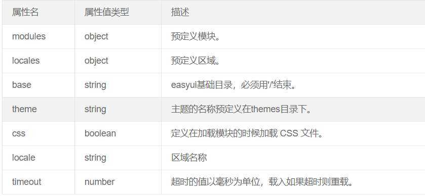

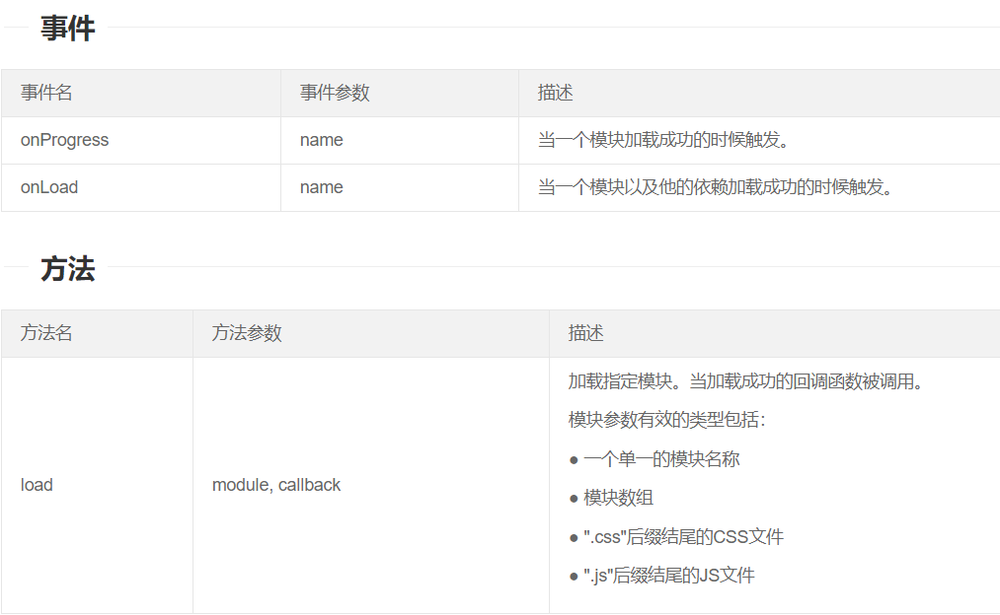

### Draggable（拖动）

使用\$.fn.draggable.defaults重写默认值对象。

使用案例

通过标签创建一个可拖动的元素。

\

\
title\</div\>

\</div\>

使用Javascript创建一个可拖动的元素。

\

\
title\</div\>

\</div\>

\$('\#dd').draggable({

handle:'\#title'

});

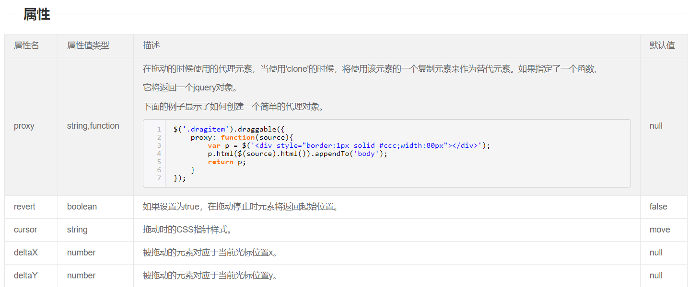

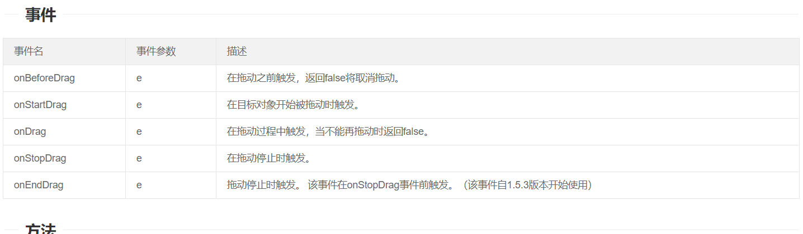

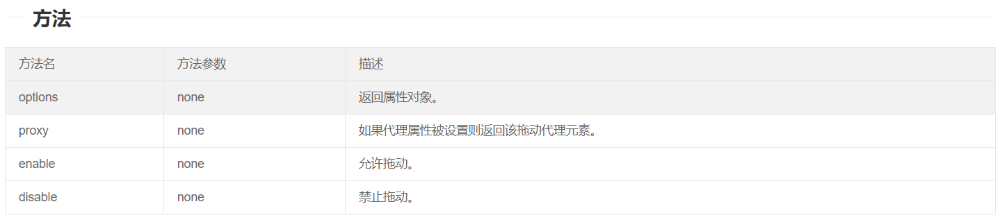

### Resizable（调整大小）

使用\$.fn.resizable.defaults重写默认值对象。

使用案例

使用标签创建可变大小的窗口。

\
\</div\>

使用Javascript创建可变大小的窗口。

\
\</div\>

\$('\#rr').resizable({

maxWidth:800,

maxHeight:600

});

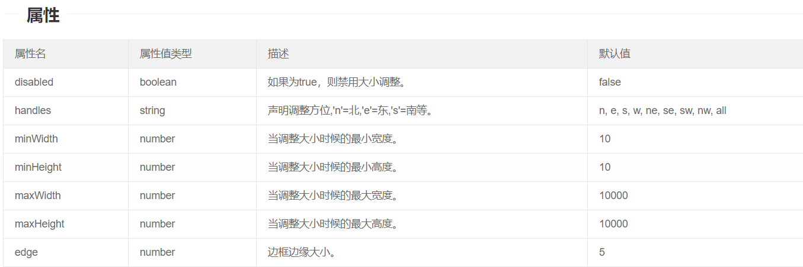

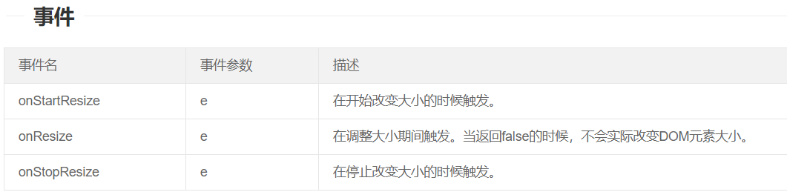

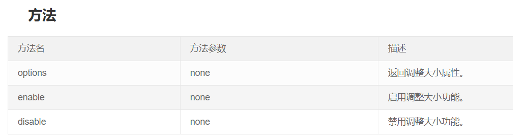

### Pagination（分页）

使用\$.fn.pagination.defaults重写默认值对象

该分页控件允许用户导航页面的数据。它支持页面导航和页面长度选择的选项设置。用户可以在分页控件上添加自定义按钮，以增强其功能。

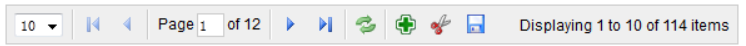

使用案例

使用标签创建分页控件。

\
\</div\>

使用Javascript创建可变大小的窗口。

\
\</div\>

\$('\#pp').pagination({

total:2000,

pageSize:10

});

让我们使用面板和分页插件来创建一个ajax分页。当用户选择一个新页面的时候，面板将显示指定页面的内容。

\

\</div\>

\

\</div\>

面板上默认显示第一页的内容。当用户导航页面的时候，'onSelectPage'事件将被触发，将会根据一个新的URL参数获取对应页面的新内容，并通过'refresh'方法将内容刷新到内容面板上。

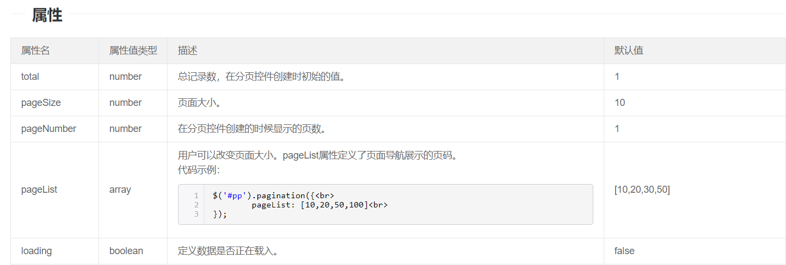

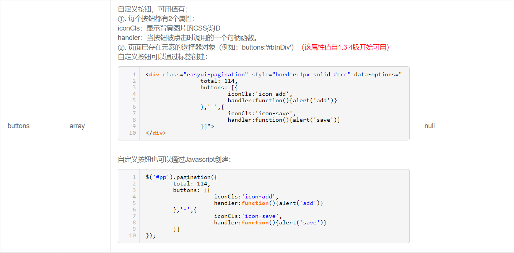

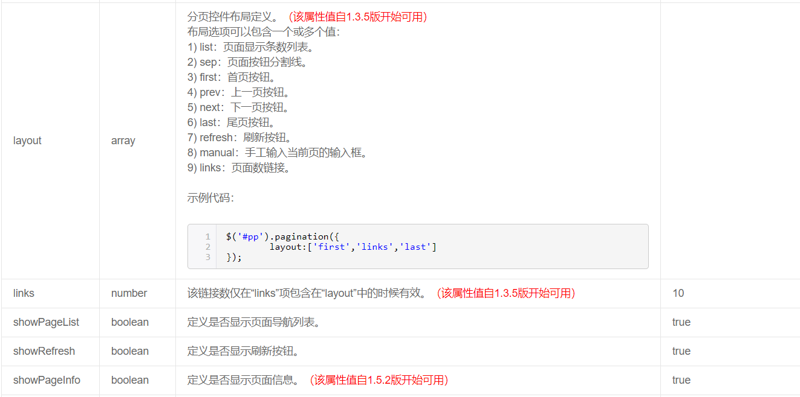

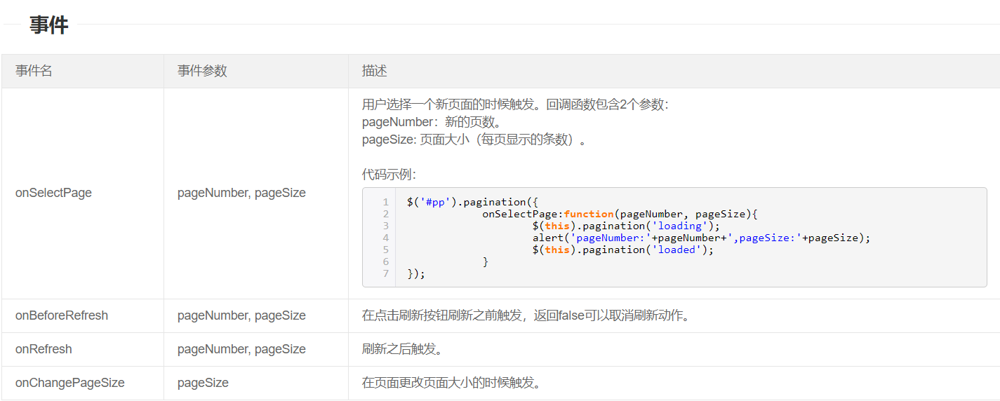

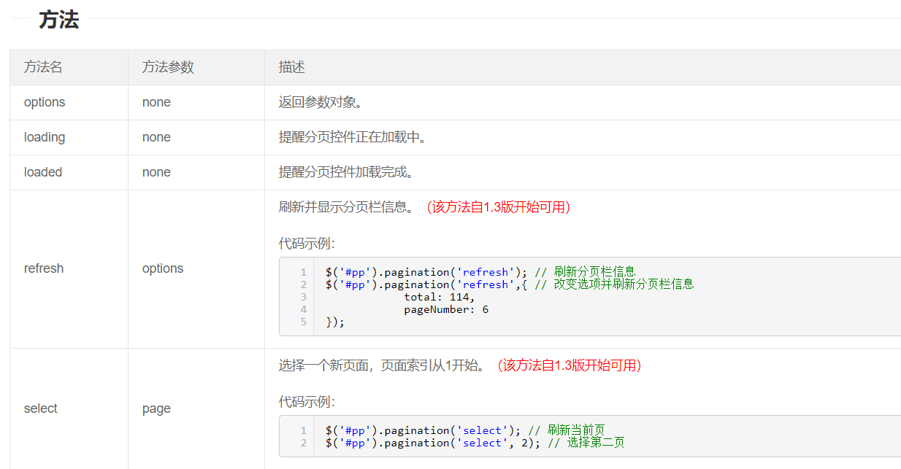

### SearchBox（搜索框）

使用案例

创建查询框

1\. 使用标签创建。添加'easyui-searchbox'类ID到\< input/\>标签。

\<script type="text/javascript"\>

function qq(value, name) {

alert(value + ":" + name)

}

\</script\>

\<input id="ss" class="easyui-searchbox" style="width:300px" data-options="searcher:qq,prompt:'Please Input Value',menu:'\#mm'"\>

\

\
All News\</div\>

\
Sports News\</div\>

\</div\>

2\. 创建程序。

\<input id="ss"\>

\

\
All News\</div\>

\
Sports News\</div\>

\</div\>

\$('\#ss').searchbox({

searcher:function(value,name){

alert(value + "," + name)

},

menu:'\#mm',

prompt:'请输入值'

});

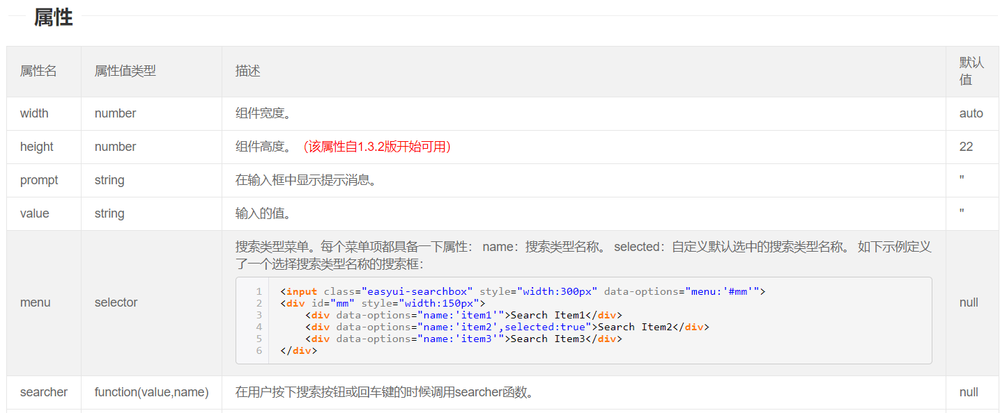

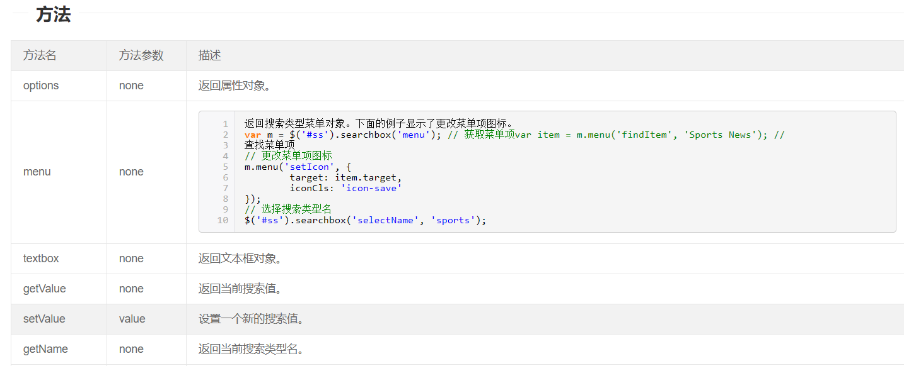

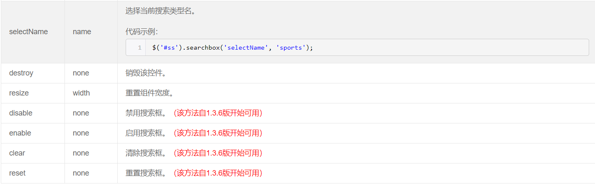

### 本节作业

1.  掌握EasyLoader（简单加载）
2.  掌握Resizable（调整大小）
3.  掌握Pagination（分页）

## 第二节EasyUI页面布局

### 2.1 Panel（面板）

使用\$.fn.panel.defaults重写默认值对象。

面板作为承载其它内容的容器。这是构建其他组件的基础（比如：layout,tabs,accordion等）。它还提供了折叠、关闭、最大化、最小化和自定义行为。面板可以很容易地嵌入到web页面的任何位置。

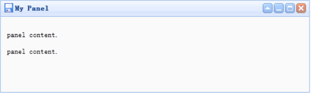

创建面板

创建进度条

1\. 通过标签创建面板

通过标签创建更简单。添加'easyui-panel'类ID到\< div/\>标签。

\

\<p\>panel content.\</p\>

\<p\>panel content.\</p\>

\</div\>

2\. 创建面板程序

让我们创建面板右上角的的工具栏。

\

\<p\>panel content.\</p\>

\<p\>panel content.\</p\>

\</div\>

\$('\#p').panel({

width:500,

height:150,

title: 'My Panel',

tools: [{

iconCls:'icon-add',

handler:function(){alert('new')}

},{

iconCls:'icon-save',

handler:function(){alert('save')}

}]

});

移动面板

调用'move'方法移动面板到新的位置。

\$('\#p').panel('move',{

left:100,

top:100

});

读取内容

当加载成功的时候让我们通过ajax加载面板内容并显示一些消息。

\$('\#p').panel({

href:'content_url.php',

onLoad:function(){

alert('loaded successfully');

}

});

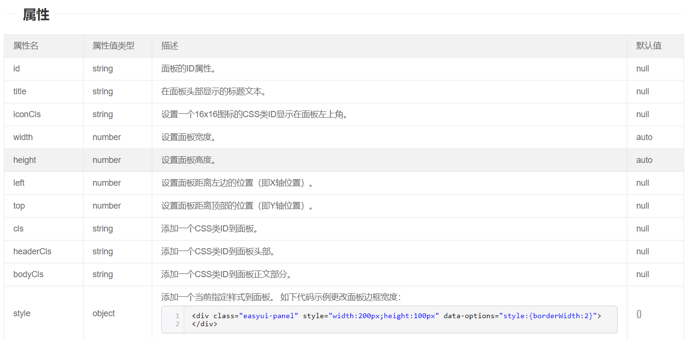

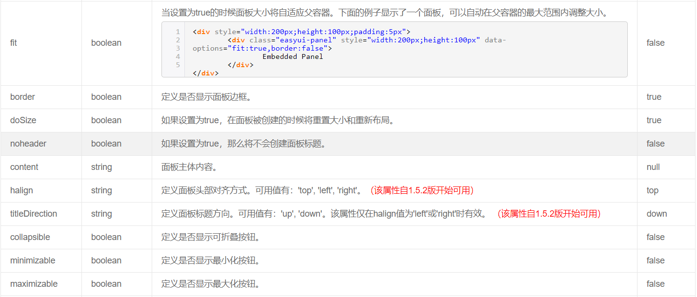

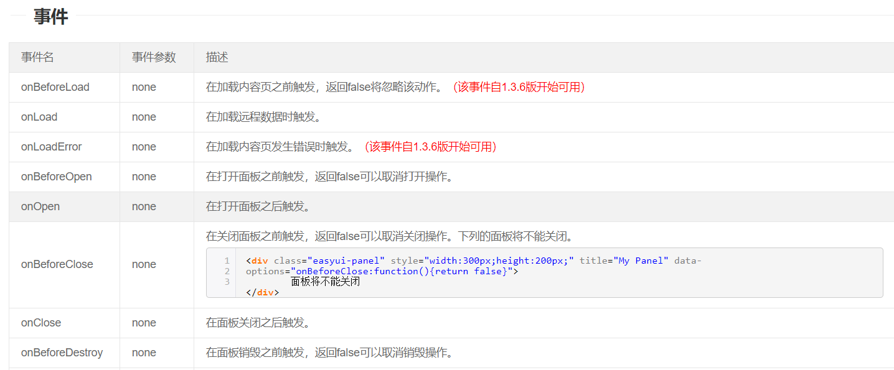

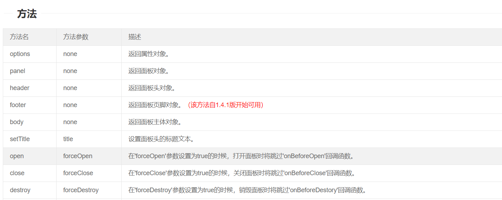

### 2.2 Tabs（选项卡）

使用\$.fn.tabs.defaults重写默认值对象。

选项卡显示一批面板。但在同一个时间只会显示一个面板。每个选项卡面板都有头标题和一些小的按钮工具菜单，包括关闭按钮和其他自定义按钮。

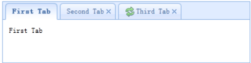

使用案例

创建面板

1\. 通过标签创建选项卡

通过标签可以更容易的创建选项卡，我们不需要写任何Javascript代码。只需要给\< div/\>标签添加一个类ID'easyui-tabs'。每个选项卡面板都通过子\< div/\>标签进行创建，用法和panel(面板)相同。

\

\

tab1

\</div\>

\

tab2

\</div\>

\

tab3

\</div\>

\</div\>

2\. 通过Javascript创建选项卡

下面的代码演示如何使用Javascript创建选项卡，当该选项卡被选择时将会触发'onSelect'事件。

\$('\#tt').tabs({

border:false,

onSelect:function(title){

alert(title+' is selected');

}

});

添加新的选项卡面板

添加一个新的包含小工具菜单的选项卡面板，小工具菜单图标(8x8)被放置在关闭按钮之前。

// add a new tab panel

\$('\#tt').tabs('add',{

title:'New Tab',

content:'Tab Body',

closable:true,

tools:[{

iconCls:'icon-mini-refresh',

handler:function(){

alert('refresh');

}

}]

});

获取选择的选项卡

// get the selected tab panel and its tab object

var pp = \$('\#tt').tabs('getSelected');

var tab = pp.panel('options').tab; // the corresponding tab object

### 

### 2.3 Accordion（分类）

使用\$.fn.accordion.defaults重写默认值对象。

分类空间允许用户使用多面板，但在同一时间只会显示一个。每个面板都内建支持展开和折叠功能。点击一个面板的标题将会展开或折叠面板主体。面板内容可以通过指定的'href'属性使用ajax方式读取面板内容。用户可以定义一个被默认选中的面板，如果未指定，那么第一个面板就是默认的。

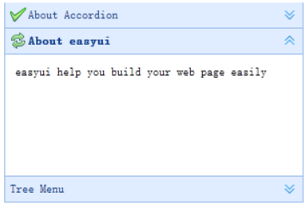

使用案例

创建分类

通过标签创建分类，给\< div/\>标签添加一个名为'easyui-accordion'的类ID。

\

\

\<h3 style="color:\#0099FF;"\>Accordion for jQuery\</h3\>

\<p\>Accordion is a part of easyui framework for jQuery.

It lets you define your accordion component on web page more easily.\</p\>

\</div\>

\

content2

\</div\>

\

content3

\</div\>

\</div\>

我们可以更改或修改面板的一些功能以后再重新创建它。

\$('\#aa').accordion({

animate:false

});

刷新分类面板内容

调用'getSelected'方法获取当前面板，此外我们还可以调用'refresh'方法重新载入新内容。

var pp = \$('\#aa').accordion('getSelected'); // 获取选择的面板

if (pp){

pp.panel('refresh','new_content.php'); // 调用'refresh'方法刷新

}

### 

### 2.4 Layout（布局）

使用\$.fn.layout.defaults重写默认值对象。

布局容器有5个区域：北、南、东、西和中间。中间区域面板是必须的，边缘的面板都是可选的。每个边缘区域面板都可以通过拖拽其边框改变大小，也可以点击折叠按钮将面板折叠起来。布局可以进行嵌套，用户可以通过组合布局构建复杂的布局结构。

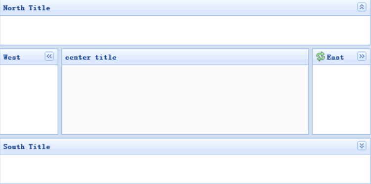

使用案例

创建布局

1\. 通过标签创建布局

为\< div/\>标签增加名为'easyui-layout'的类ID。

\

\
\</div\>

\
\</div\>

\
\</div\>

\
\</div\>

\
\</div\>

\</div\>

2\. 使用完整页面创建布局

\
\</div\>

\
\</div\>

\
\</div\>

\
\</div\>

\
\</div\>

3\. 创建嵌套布局

注意：嵌套在内部的布局面板的左侧(西面)面板是折叠的。

\
\</div\>

\

\

\
\</div\>

\
\</div\>

\</div\>

\</div\>

4\. 通过ajax读取内容

布局是以面板为基础创建的。所有的布局面板都支持异步加载URL内容。使用异步加载技术，用户可以使自己的布局页面显示的内容更多更快。

\
\</div\>

\
\</div\>

折叠布局面板

\$('\#cc').layout();

// collapse the west panel

\$('\#cc').layout('collapse','west');

添加西侧区域面板和工具菜单按钮

\$('\#cc').layout('add',{

region: 'west',

width: 180,

title: 'West Title',

split: true,

tools: [{

iconCls:'icon-add',

handler:function(){alert('add')}

},{

iconCls:'icon-remove',

handler:function(){alert('remove')}

}]

});

### 本节作业

1.  熟练使用Panel（面板），Tabs（选项卡）
2.  熟练掌握Accordion（分类）
3.  掌握Layout（布局）

## 第三节 EasyUI菜单按钮

### 3.1 Menu（菜单）

使用\$.fn.menu.defaults重写默认值对象。

菜单组件通常用于快捷菜单。他是构建其他菜单组件的必备基础组件。比如：menubutton和splitbutton。它还可以用于导航和执行命令。

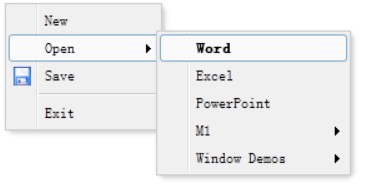

使用案例

创建菜单

通过标签创建菜单，给\< div/\>标签添加一个名为'easyui-menu'的类ID。每个菜单项都通过\< div/\>标签创建。我们可以添加'iconCls'属性来给菜单项定义一个图标显示到菜单项的左侧。添加'menu-sep'类ID菜单项将会生成一个菜单分割线。

\

\<div\>New\</div\>

\<div\>

\<span\>Open\</span\>

\

\<div\>\<b\>Word\</b\>\</div\>

\<div\>Excel\</div\>

\<div\>PowerPoint\</div\>

\</div\>

\</div\>

\
Save\</div\>

\
\</div\>

\<div\>Exit\</div\>

\</div\>

使用Javascript创建菜单项并监听'onClick'事件。

\$('\#mm').menu({

onClick:function(item){

//...

}

});

显示菜单

在菜单被创建的时候它是隐藏和不可见的。调用'show'方法显示菜单。

\$('\#mm').menu('show', {

left: 200,

top: 100

});

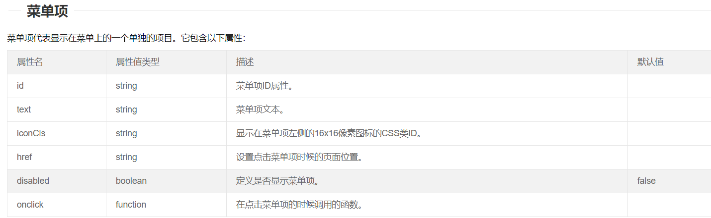

### 3.2 SideMenu（侧栏菜单）

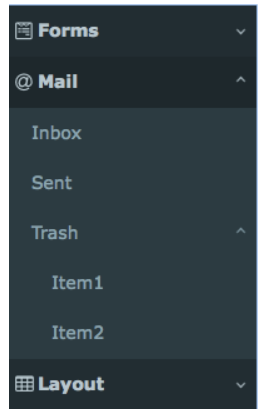

使用案例

创建侧菜单

通过标签创建侧菜单

\

\</div\>

使用Javascript创建侧菜单。

\
\</div\>

\$('\#sm').iSidemenu({

data: data

});

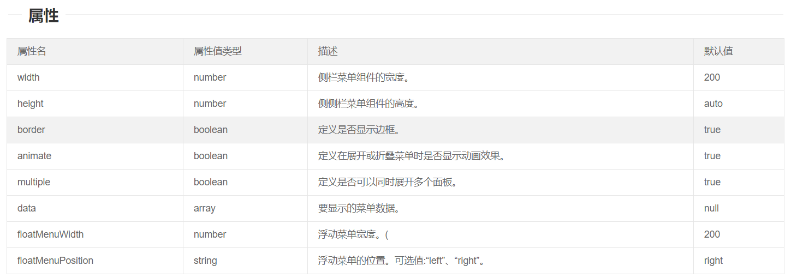

### 3.3 LinkButton（按钮）

使用\$.fn.linkbutton.defaults重写默认值对象。

按钮组件使用超链接按钮创建。它使用一个普通的\< a\>标签进行展示。它可以同时显示一个图标和文本,或只有图标或文字。按钮的宽度可以动态和折叠/展开以适应它的文本标签。

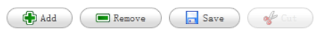

使用案例

创建按钮

使用标签创建按钮更加简单。

\<a id="btn" href="\#" class="easyui-linkbutton" data-options="iconCls:'icon-search'"\>easyui\</a\>

也可以使用Javascript创建按钮。

\<a id="btn" href="\#"\>easyui\</a\>

\$('\#btn').linkbutton({

iconCls: 'icon-search'

});

处理按钮的点击

点击按钮会将用户引导到其他页面。

\<a href="otherpage.php" class="easyui-linkbutton" data-options="iconCls:'icon-search'"\>easyui\</a\>

下面的示例提示了一个警告信息。

\<a href="\#" class="easyui-linkbutton" data-options="iconCls:'icon-search'" onclick="javascript:alert('easyui')"\>easyui\</a\>

使用jQuery绑定点击事件。

\<a id="btn" href="\#" class="easyui-linkbutton" data-options="iconCls:'icon-search'"\>easyui\</a\>

\$(function(){

\$('\#btn').bind('click', function(){

alert('easyui');

});

});

### 3.4 MenuButton（菜单按钮）

扩展自\$.fn.linkbutton.defaults。使用\$.fn.menubutton.defaults重写默认值对象。

菜单按钮是下拉菜单的一部分。它伴随着linkbutton和menu组件。在用户点击linkbutton之前菜单是隐藏的，当用户用鼠标点击或移动到linkbutton上面的时候菜单才会显示。

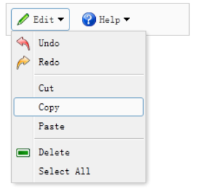

用法

通常菜单按钮通过标签创建。

\<a href="javascript:void(0)" id="mb" class="easyui-menubutton" data-options="menu:'\#mm',iconCls:'icon-edit'"\>Edit\</a\>

\

\
Undo\</div\>

\
Redo\</div\>

\
\</div\>

\<div\>Cut\</div\>

\<div\>Copy\</div\>

\<div\>Paste\</div\>

\
\</div\>

\
Delete\</div\>

\<div\>Select All\</div\>

\</div\>

使用Javascript创建菜单按钮。

\<a href="javascript:void(0)" id="mb"\>Edit\</a\>

\

...

\</div\>

\$('\#mb').menubutton({

iconCls: 'icon-edit',

menu: '\#mm'

});

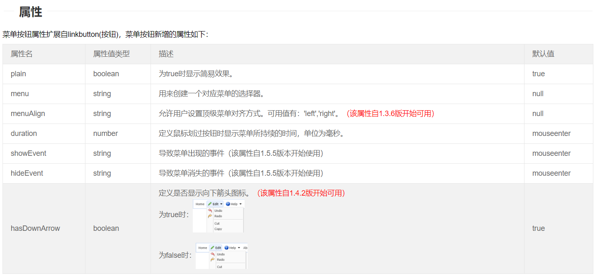

### 本节作业

1.  熟练使用Menu（菜单）
2.  熟练掌握LinkButton（按钮）
3.  掌握MenuButton（菜单按钮）
