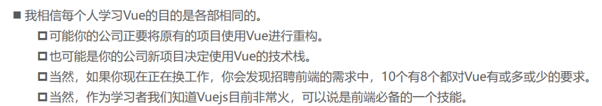
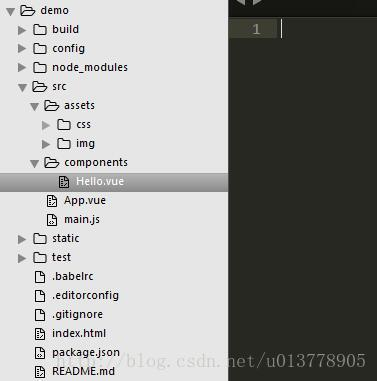

# 第1天【VUE 数据驱动】

## 主要内容

1.  Mvvm设计思想和双向数据绑定
2.  new vue()参数详解
3.  vue生命周期、watch、计算属性等
4.  V-XXX 指令详解
5.  实例用vue实现表格、新增、删除、修改基本操作

## 学习目标

| 节数                      | 知识点                                                                         | 要求 |
|---------------------------|--------------------------------------------------------------------------------|------|
| 第一节（MVVM设计思想）    | MVVM设计思想                                                                   | 掌握 |
| 第二节（new VUE参数）     | new VUE成员                                                                    | 掌握 |
| 第三节（双向绑定原理）    | 双向绑定原理                                                                   | 掌握 |
| 第四节（VUE生命周期）     | VUE生命周期与钩子函数                                                          | 掌握 |
| 第五节（watch与计算属性） | 计算属性作用                                                                   | 掌握 |
| 第六节（V-XXX指令）       | v-bind用法、v-model用法、v-click用法、{{ }}用法、v-for用法、v-if、v-show用法等 | 掌握 |

## 第一节 HTML简介

### MVVM设计思想

MVVM 是 Model-View-ViewModel 的缩写。 Model代表数据模型，也可以在Model中定义数据修改和操作的业务逻辑。 View 代表UI 组件，它负责将数据模型转化成UI 展现出来。 ViewModel 监听模型数据的改变和控制视图⾏为、处理⽤户交互，简单理解就是⼀个同步View 和 Model 的对象，连接Model和View。 在MVVM架构下，View 和 Model 之间并没有直接的联系，⽽是通过ViewModel进⾏交互，Model 和 ViewModel 之间的交互是双向的， 因此View 数据的变化会同步到Model中，⽽Model 数据的变化也会⽴ 即反应到View 上。

ViewModel 通过双向数据绑定把 View 层和 Model 层连接了起来，⽽View 和 Model 之间的同步⼯作完全 是⾃动的，⽆需⼈为⼲涉，因此开发者只需关注业务逻辑，不需要⼿动操作DOM, 不需要关注数据状态的 同步问题，复杂的数据状态维护完全由 MVVM 来统⼀管理。

### 1.2 为什么要学VUE.JS

**1.3 VUE项目结构**

build目录是一些webpack的文件，配置参数什么的，一般不用动   
config是vue项目的基本配置文件   
node_modules是项目中安装的依赖模块   
src源码文件夹，基本上文件都应该放在这里。   
—assets 资源文件夹，里面放一些静态资源   
—components这里放的都是各个组件文件   
—App.vue App.vue组件   
—main.js入口文件   
static生成好的文件会放在这个目录下。   
test测试文件夹，测试都写在这里   
.babelrc babel编译参数，vue开发需要babel编译   
.editorconfig 看名字是编辑器配置文件，不晓得是哪款编辑器，没有使用过。   
.gitignore 用来过滤一些版本控制的文件，比如node_modules文件夹   
index.html 主页   
package.json 项目文件，记载着一些命令和依赖还有简要的项目描述信息

## 第二节new VUE参数

##### 2.1 el:"\#id", //DOM成员（1/3）

提供一个在页面上已存在的 DOM 元素作为 Vue 实例的挂载目标。

##### 2.2 template:"\<tag\>\</tag\>", //DOM成员（2/3）

一个字符串模板作为 Vue 实例的标识使用。模板将会 替换 挂载的元素。挂载元素的内容都将被忽略，除非模板的内容有分发 slot

##### 2.3 render: (h)=\>{h(App)}, //DOM成员（3/3）

字符串模板的代替方案，允许你发挥 JavaScript 最大的编程能力。

##### 2.4 data //数据成员（1/6）

data():{ return{ } },  
Vue实例的数据对象。Vue 将会递归将 data 的属性转换为 getter/setter，从而让 data 的属性能够响应数据变化

##### 2.5 methods //数据成员（2/6）

methods:{ func(){ } }  
methods将被混入到 Vue 实例中，可以直接通过 VM 实例访问这些方法，或者在指令表达式中使用  
方法中的 this自动绑定为 Vue 实例

##### 2.6 watch //数据成员（3/6）

watch:{ key:value \$route:function (newValue, oldValue) { //监控路由 } }  
整个为一个对象，键是需要观察的表达式，值是对应回调函数

##### 2.7 computed //数据成员（4/6）

computed:{ getTotalCount(){ const totalCount=0; return totalCount; } },  
vue的计算属性，将被混入到 Vue 实例中。所有 getter 和 setter 的 this 上下文自动地绑定为 Vue 实例

##### 2.8 props //数据成员（5/6）

props:['counts','ids'],  
用于父子组件的eventbus传值，是数组或对象，props的成员是子组件接收的来自父组件的数据

##### 2.9 propsData //数据成员（6/6）

**没用过**。创建实例时传递 props。主要作用是方便测试

##### 2.10 filters //资源（1/3）

filters('filterName',(input,function(){ return newvalue }))  
包含 Vue 实例可用过滤器的哈希表。

##### 2.11 directives //资源（2/3）

包含 Vue 实例可用指令的哈希表。

##### 2.12 components //资源（3/3）

（即该组件的子实例）这里是包含 Vue 实例可用组件的哈希表。

##### 2.13 name //杂项（1/6）

允许组件模板递归地调用自身。注意，组件在全局用 Vue.component() 注册时，全局 ID 自动作为组件的 name。

##### 2.14 parent //杂项（2/6）

指定已创建的实例之父实例，在两者之间建立父子关系。子实例可以用 this.\$parent 访问父实例，子实例被推入父实例的 \$children 数组中。

##### 2.15 mixins //杂项（3/6）

mixins 选项接受一个混合对象的数组。Mixin钩子按照传入顺序依次调用,并在调用组件自身的钩子之前被调用。

##### 2.16 extends //杂项（4/6）

允许声明扩展另一个组件。这主要是为了便于扩展单文件组件。这和 mixins 类似，区别在于，组件自身的选项会比要扩展的源组件具有更高的优先级。

##### 2.17 delimiters //杂项（5/6）

改变纯文本插入分隔符。

##### 2.18 functional //杂项（6/6）

使组件无状态（没有 data ）和无实例（没有 this 上下文）。他们用一个简单的 render 函数返回虚拟节点使他们更容易渲染。

##### 2.19 生命周期钩子（10）

beforeCreate//在实例初始化之后，数据观测(data observer) 和 event/watcher 事件配置之前被调用。

created

//实例已经创建完成之后被调用。在这一步，实例已完成以下的配置：数据观测(data observer)，属性和方法的运算， watch/event 事件回调。然而，挂载阶段还没开始，\$el 属性目前不可见

beforeMount

//在挂载开始之前被调用：相关的 render 函数首次被调用。

mounted

//el 被新创建的 vm.\$el 替换，并挂载到实例上去之后调用该钩子。

beforeUpdate

//数据更新时调用，发生在虚拟 DOM 重新渲染和打补丁之前。你可以在这个钩子中进一步地更改状态，这不会触发附加的重渲染过程。

updated

//由于数据更改导致的虚拟 DOM 重新渲染和打补丁，在这之后会调用该钩子。当这个钩子被调用时，组件 DOM 已经更新，所以你现在可以执行依赖于 DOM 的操作

activated//keep-alive 组件激活时调用。

deactivated//keep-alive 组件停用时调用。

beforeDestroy

//实例销毁之前调用。在这一步，实例仍然完全可用。

destroyed

//Vue 实例销毁后调用。调用后，Vue 实例指示的所有东西都会解绑定，所有的事件监听器会被移除，所有的子实例也会被销毁。

## 第三节 双向绑定原理

### 3.1基本原理

vue实现数据双向绑定主要是：采⽤数据劫持结合发布者-订阅者模式的⽅式，通过 Object.defineProperty（）来劫持各个属性的setter，getter，在数据变动时发布消息给订阅者，触发相 应监听回调。当把⼀个普通 Javascript 对象传给 Vue 实例来作为它的 data 选项时，Vue 将遍历它的属 性，⽤ Object.defineProperty 将它们转为 getter/setter。⽤户看不到 getter/setter，但是在内部它们让 Vue 追踪依赖，在属性被访问和修改时通知变化。

vue的数据双向绑定 将MVVM作为数据绑定的⼊⼝，整合Observer，Compile和Watcher三者，通过 Observer来监听⾃⼰的model的数据变化，通过Compile来解析编译模板指令（vue中是⽤来解析 {{}}）， 最终利⽤watcher搭起observer和Compile之间的通信桥梁，达到数据变化 —\>视图更新；视图交互变化 （input）—\>数据model

### 3.2简单实现

\<body\>

\

\<input type="text" id="txt"\>

\
\</p\>

\</div\>

\</body\>

\<script type="text/javascript"\>

var obj = {}

Object.defineProperty(obj, 'txt', {

get: function () {

return obj

},

set: function (newValue) {

document.getElementById('txt').value = newValue

document.getElementById('show').innerHTML = newValue

}

})

document.addEventListener('keyup', function (e) {

obj.txt = e.target.value

})

\</scrip\>

## 第四节VUE生命周期

**4.1生命周期简介**

beforeCreate（创建前） 在数据观测和初始化事件还未开始

created（创建后） 完成数据观测，属性和⽅法的运算，初始化事件，\$el属性还没有显示出来

beforeMount（载⼊前） 在挂载开始之前被调⽤，相关的render函数⾸次被调⽤。实例已完成以下的配 置：编译模板，把data⾥⾯的数据和模板⽣成html。注意此时还没有挂载html到⻚⾯上。

mounted（载⼊后） 在el 被新创建的 vm.\$el 替换，并挂载到实例上去之后调⽤。实例已完成以下的配置：⽤上⾯编译好的html内容替换el属性指向的DOM对象。完成模板中的html渲染到html⻚⾯中。此过程 中进⾏ajax交互。

beforeUpdate（更新前） 在数据更新之前调⽤，发⽣在虚拟DOM重新渲染和打补丁之前。可以在该钩⼦中进⼀步地更改状态，不会触发附加的重渲染过程。

updated（更新后） 在由于数据更改导致的虚拟DOM重新渲染和打补丁之后调⽤。调⽤时，组件DOM已经更新，所以可以执⾏依赖于DOM的操作。然⽽在⼤多数情况下，应该避免在此期间更改状态，因为这可 能会导致更新⽆限循环。该钩⼦在服务器端渲染期间不被调⽤。

beforeDestroy（销毁前） 在实例销毁之前调⽤。实例仍然完全可⽤。

destroyed（销毁后） 在实例销毁之后调⽤。调⽤后，所有的事件监听器会被移除，所有的⼦实例也会被

**4.2关于生命周期的面试题**

1.什么是vue⽣命周期？

答： Vue 实例从创建到销毁的过程，就是⽣命周期。从开始创建、初始化数据、编译模板、挂载Dom→渲

染、更新→渲染、销毁等⼀系列过程，称之为 Vue 的⽣命周期。

2.vue⽣命周期的作⽤是什么？

答：它的⽣命周期中有多个事件钩⼦，让我们在控制整个Vue实例的过程时更容易形成好的逻辑。

3.vue⽣命周期总共有⼏个阶段？

答：它可以总共分为8个阶段：创建前/后, 载⼊前/后,更新前/后,销毁前/销毁后。

4.第⼀次⻚⾯加载会触发哪⼏个钩⼦？

答：会触发 下⾯这⼏个beforeCreate, created, beforeMount, mounted 。

5.DOM 渲染在 哪个周期中就已经完成？

答：DOM 渲染在 mounted

## 第五节watch与计算属性

**5.1什么是计算属性**

在模板中放⼊太多的逻辑会让模板过重且难以维护，在需要对数据进⾏复杂处理，且可能多次使⽤的 情况下，尽量采取计算属性的⽅式。

**5.2计算属性好处**

①使得数据处理结构清晰；

②依赖于数据，数据更新，处理结 果⾃动更新；

③计算属性内部this指向vm实例；

④在template调⽤时，直接写计算属性名即可；

⑤常⽤的 是getter⽅法，获取数据，也可以使⽤set⽅法改变数据；

⑥相较于methods，不管依赖的数据变不变， methods都会重新计算，但是依赖数据不变的时候computed

**5.3什么是watch**

watch监听的是你定义的变量,当你定义的变量的值发生变化时，调用对应的方法。

**5.4 二者区别**

computed和watch的使用场景并不一样，computed的话是通过几个数据的变化，来影响一个数据，而watch，则是可以一个数据的变化，去影响多个数据。

## 第六节V-XXX指令

**6.1 条件判断(v-if)**

\

\
现在你看到我了\</p\>

\<template v-if="ok"\>

\<h1\>中软国际\</h1\>

\<p\>学的不仅是技术，更是梦想！\</p\>

\<p\>哈哈哈，打字辛苦啊！！！\</p\>

\</template\>

\</div\>

\<script\>

var vm=new Vue({

el: '\#app',

data: {

seen: true,

ok: true

}

})

\</script\>

**6.2 循环语句(v-for)**

**6.2.1.迭代数组**

\
 \<ol\>

\<li v-for="site in sites"\>

{{ site.name }}

\</li\>

\</ol\>\</div\>

\<script\>

var vm=new Vue({

el: '\#app',

data: {

sites: [

{ name: 'Runoob' },

{ name: 'Google' },

{ name: 'Taobao' }

]

}

})

\</script\>

**6.2.2 迭代对象**

\
\<ul\>

\<li v-for="value in object"\>

{{ value }}

\</li\>

\</ul\>\</div\>

\<script\>

var vm=new Vue({

el: '\#app',

data: {

object: {

name: '中软国际',

url: 'http://www.syetc.com',

slogan: '学的不仅是技术，更是梦想！'

}

}

})

\</script\>

**6.3计算属性**

\

\<p\>原始字符串: {{ message }}\</p\>

\<p\>计算后反转字符串: {{ reversedMessage }}\</p\>

\</div\>

\<script\>

var vm = new Vue({

el: '\#app',

data: {

message: 'Runoob!'

},

computed: {

// 计算属性的 getter

reversedMessage: function () {

// \`this\` 指向 vm 实例

return this.message.split('').reverse().join('')

}

}

})

\</script\>

**6.4监听属性 watch,来响应数据的变化**

var vm=new Vue({...});

vm.\$watch('kilometers', function (newValue, oldValue) {

//........

})

**6.5样式绑定**

\<style\>

.active { width: 100px; height: 100px; background: green; }

.text-danger { background: red; }

\</style\>

\</head\>

\<body\>

\

\

\</div\>

\</div\>

\<script\>

var vm=new Vue({

el: '\#app',

data: {

isActive: true,

hasError: true

}

})

\</script\>

**6.6 事件处理器(v-on)**

\

\<button v-on:click="greet"\>Greet\</button\>

\</div\>

\<script\>

var app = new Vue({

// 在 \`methods\` 对象中定义方法

methods: {

greet: function (event) {

// \`this\` 在方法里指当前 Vue 实例

alert('Hello ' + this.name + '!')

// \`event\` 是原生 DOM 事件

if (event) {

alert(event.target.tagName)

}

}

}

})

\</script\>

**6.7 表单**

**6.7.1 输入框**

\<input v-model="message" placeholder="编辑我……"\>

\<script\>

new Vue({

el: '\#app',

data: {

message: 'Runoob'

}

})

\</script\>

**6.7.2单选与多选**

\

\<p\>单个复选框：\</p\>

\<input type="checkbox" id="checkbox" v-model="checked"\>

\<label for="checkbox"\>{{ checked }}\</label\>

\<p\>多个复选框：\</p\>

\<input type="checkbox" id="runoob" value="Runoob" v-model="checkedNames"\> \<label for="runoob"\>Runoob\</label\>

\<input type="checkbox" id="google" value="Google" v-model="checkedNames"\> \<label for="google"\>Google\</label\>

\<input type="checkbox" id="taobao" value="Taobao" v-model="checkedNames"\> \<label for="taobao"\>taobao\</label\>

\<br\>

\<span\>选择的值为: {{ checkedNames }}\</span\>

\</div\>

\<script\>

new Vue({

el: '\#app',

data: {

checked : false,

checkedNames: []

}

})

\</script\>
