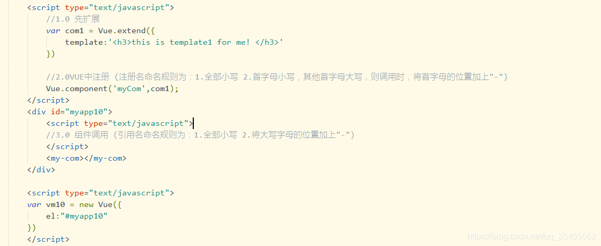

# 第2天【VUE 组件与路由】

## 主要内容

1.  组件编程介绍、如何定义、使用组件、组件的注册等
2.  组件的生命周期及组件传值
3.  为什么采用路由编程
4.  路由守卫、子路由、懒加载路由等

## 学习目标

| 节数                | 知识点                                       | 要求 |
|---------------------|----------------------------------------------|------|
| 第一节（组件编程）  | 组件编程介绍、如何定义、使用组件、组件的注册 | 掌握 |
| 第二节（组件传值）  | 组件的生命周期及组件传值                     | 掌握 |
| 第三节（路由编程）  | ajax的问题、为什么采用路由编程               | 掌握 |
| 第四节（路由使用）  | 路由的使用、路由与组件的区别                 | 掌握 |

## 第一节 组件编程

### 组件作用

## VUE的组件是为了拆分vue实例

-   模块化：基于功能划分，用于保存模块职能单一
-   组件化：基于UI界面划分，方便UI组件的复用

### 1.2 VUE组件定义

## 1.3 VUE组件的使用过程（基础用法）

vue.extend 先扩展（扩展的template字串里面，只有拥有一个根节点）

vue.component中注册（注册名建议全部小写）

UI中直接引用 （引用组件名称也是全部小写）

## 1.4 组件基础使用

## 1.5 VUE的组件使用方法（使用template来产生组件的模板）

1.  在el的同级定义一个template模板
2.  在Vue.compent注册template模板，绑定模板名称
3.  在界面上引用

## 1.6 组件templete使用

## 1.7私有组件与全局组件定义

## 1.8 组件中定义data

## 1.9 组件中使用自定义方法

##### 1.9.1 定义

##### 由于每个定义组件时，都会初始化一个新的data 对象，所以在同时引用多次组件时，互不影响

**1.9.2 案例**

## 第二节 组件传值

## 2.1 组件的传值：

## 首先在引用组件上绑定需要传值的数据，然后在子组件上声明传值的对象名

1.  实例上的数据可读，可修改
2.  子组件上的数据只读

##### 2.2 案例一

##### 

## 2.3 组件上的方法传递：

1.最外层组件引用时，指定需要引用实例的方法名，及组件的方法名

2.在组件的props上不用注册方法名，但是组件方法中应用时，需要使用this.\$emit（“方法名”）来调用

##### 2.4 案例

##### 

## 2.5 父子组件传值

1.  首先实现子组件调用父组件的方法
2.  同时传入子组建的data数据
3.  在父组件中完成数据更新

##### 2.6 案例

## 组件上定义一个ref 之后，就可以从外部访问子组件的数据及方法。

## 第三节 路由编程

### 3.1 路由指令

router-view 视图 router-link 导向

### 3.2案例

### 3.3路由规则的制定

1.  routes 定义为一个数据，可包含多个配置
2.  path: 根目录里面，路径必须带"/" 在子目录里面，不用带"/"
3.  component：组件名称，即组件的对象

### 3.4 案例

## 第四节 路由使用

**4.1 路由的加载**

将定义好的router对象，与router属性进行绑定就可以了

**4.2案例**

**4.3路由的嵌套**

## 在于router-view 所绑定的组件里面，再绑定router-view，然后，在规则里指定父规则及子规则就可以了

**4.4 案例**

**4.5 路由间关系**

## 路由可以一对多，即同一个地址，对应多个component

## 1.使用components来指定多个组件名称

## 2.使用在router-view上面定义name 来对应到相应的组件

**4.6 案例**

