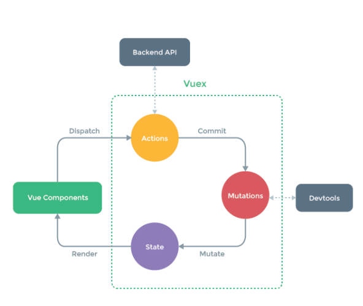

# 第5天【VUEX】

## 主要内容

1.  VUEX是什么
2.  VUEX五大成员
3.  VUEX 生命周期

## 学习目标

| 节数                   | 知识点                                     | 要求 |
|------------------------|--------------------------------------------|------|
| 第一节（什么是VUEX）   | 了解什么是VUEX                             | 掌握 |
| 第二节（VUEX五大部分） | State、Getters、Mutations、Action、Modules | 掌握 |
| 第三节（VUEX生命周期） | 掌握VUEX生命周期                           | 掌握 |

## 第一节 什么是VUEX

### 1.1 Vuex是什么

Vuex 是一个专为 Vue.js 应用程序开发的状态管理模式。它采用集中式存储管理

应用的所有组件的状态，并以相应的规则保证状态以一种可预测的方式发生变化。

Vuex 也集成到 Vue 的官方调试工具 devtools extension，提供了诸如零配置的

time-travel 调试、状态快照导入导出等高级调试功能。

**1.2 什么是“状态管理模式”？**

让我们从一个简单的 Vue 计数应用开始：

new Vue({

// state

data () {

return {

count: 0

}

},

// view

template:

\<div\>{{ count }}\</div\>

// actions

methods: {

increment () {

this.count++

}

}

})

这个状态自管理应用包含以下几个部分：

 state，驱动应用的数据源；

 view，以声明方式将 state 映射到视图；

 actions，响应在 view 上的用户输入导致的状态变化。

但是，当我们的应用遇到多个组件共享状态时，单向数据流的简洁性很容易被破

坏： 多个视图依赖于同一状态。 来自不同视图的行为需要变更同一状态。

对于问题一，传参的方法对于多层嵌套的组件将会非常繁琐，并且对于兄弟组件间

的状态传递无能为力。对于问题二，我们经常会采用父子组件直接引用或者通过事

件来变更和同步状态的多份拷贝。以上的这些模式非常脆弱，通常会导致无法维护

的代码。

因此，我们为什么不把组件的共享状态抽取出来，以一个全局单例模式管理呢？在

这种模式下，我们的组件树构成了一个巨大的“视图”，不管在树的哪个位置，任何

组件都能获取状态或者触发行为！

另外，通过定义和隔离状态管理中的各种概念并强制遵守一定的规则，我们的代码

将会变得更结构化且易维护。

这就是 Vuex 背后的基本思想，借鉴了 Flux、Redux、和 The Elm

Architecture。与其他模式不同的是，Vuex 是专门为 Vue.js 设计的状态管理

库，以利用 Vue.js 的细粒度数据响应机制来进行高效的状态更新

**1.3 什么情况下我应该使用 Vuex？**

虽然 Vuex 可以帮助我们管理共享状态，但也附带了更多的概念和框架。这需要

对短期和长期效益进行权衡。

如果您不打算开发大型单页应用，使用 Vuex 可能是繁琐冗余的。确实是如此—

—如果您的应用够简单，您最好不要使用 Vuex。一个简单的 global event

bus 就足够您所需了。但是，如果您需要构建是一个中大型单页应用，您很可能会

考虑如何更好地在组件外部管理状态，Vuex 将会成为自然而然的选择。

## 第二节 VUEX五大部分

## 2.1 State

**2.1.1 单一状态树**

Vuex 使用 单一状态树 —— 是的，用一个对象就包含了全部的应用层级状态。至

此它便作为一个『唯一数据源(SSOT)』而存在。这也意味着，每个应用将仅仅包

含一个 store 实例。单一状态树让我们能够直接地定位任一特定的状态片段，在

调试的过程中也能轻易地取得整个当前应用状态的快照。

单状态树和模块化并不冲突 —— 在后面的章节里我们会讨论如何将状态和状态变

更事件分布到各个子模块中。

**2.1.2 在 Vue 组件中获得 Vuex 状态**

那么我们如何在 Vue 组件中展示状态呢？由于 Vuex 的状态存储是响应式的，从

store 实例中读取状态最简单的方法就是在计算属性中返回某个状态：

// 创建一个 Counter 组件

const Counter = {

template: \`\<div\>{{ count }}\</div\>\`,

computed: {

count () {

return store.state.count

}

}

}

每当 store.state.count 变化的时候, 都会重新求取计算属性，并且触发更新相

关联的 DOM。

然而，这种模式导致组件依赖全局状态单例。在模块化的构建系统中，在每个需要

使用 state 的组件中需要频繁地导入，并且在测试组件时需要模拟状态。

Vuex 通过 store 选项，提供了一种机制将状态从根组件『注入』到每一个子组件

中（需调用 Vue.use(Vuex)）：

const app = new Vue({

el: '\#app',

// 把 store 对象提供给 “store” 选项，这可以把 store 的实例注入所有的子组件

store,

components: { Counter },

template: \`

\

\<counter\>\</counter\>

\</div\>

})

通过在根实例中注册 store 选项，该 store 实例会注入到根组件下的所有子组件

中，且子组件能通过 this.\$store 访问到。让我们更新下 Counter 的实现：

const Counter = {

template: \`\<div\>{{ count }}\</div\>\`,

computed: {

count () {

return this.\$store.state.count

}

}

}

**2.1.3 mapState 辅助函数**

当一个组件需要获取多个状态时候，将这些状态都声明为计算属性会有些重复和冗

余。为了解决这个问题，我们可以使用 mapState 辅助函数帮助我们生成计算属

性，让你少按几次键：

// 在单独构建的版本中辅助函数为 Vuex.mapState

import { mapState } from 'vuex'

export default {

// ...

computed: mapState({

// 箭头函数可使代码更简练

count: state =\> state.count,

// 传字符串参数 'count' 等同于 \`state =\> state.count\`

countAlias: 'count',

// 为了能够使用 \`this\` 获取局部状态，必须使用常规函数

countPlusLocalState (state) {

return state.count + this.localCount

}

})

}

当映射的计算属性的名称与 state 的子节点名称相同时，我们也可以

给 mapState 传一个字符串数组。

computed: mapState([

// 映射 this.count 为 store.state.count

'count'

])

**2.1.4 对象展开运算符**

mapState 函数返回的是一个对象。我们如何将它与局部计算属性混合使用呢？通

常，我们需要使用一个工具函数将多个对象合并为一个，以使我们可以将最终对象

传给 computed 属性。但是自从有了对象展开运算符（现处于 ECMASCript 提案

stage-3 阶段），我们可以极大地简化写法：

computed: {

localComputed () { /\* ... \*/ },

// 使用对象展开运算符将此对象混入到外部对象中

...mapState({

// ...

})

}

**2.1.5 组件仍然保有局部状态**

使用 Vuex 并不意味着你需要将所有的状态放入 Vuex。虽然将所有的状态放到

Vuex 会使状态变化更显式和易调试，但也会使代码变得冗长和不直观。如果有些

状态严格属于单个组件，最好还是作为组件的局部状态。你应该根据你的应用开发

需要进行权衡和确定。

## 2.2 Getters

有时候我们需要从 store 中的 state 中派生出一些状态，例如对列表进行过滤并

计数：

computed: {

doneTodosCount () {

return this.\$store.state.todos.filter(todo =\> todo.done).length

} }

如果有多个组件需要用到此属性，我们要么复制这个函数，或者抽取到一个共享函数然后在多处导入它 —— 无论哪种方式都不是很理想。

Vuex 允许我们在 store 中定义『getters』（可以认为是 store 的计算属性）。

就像计算属性一样，getters 的返回值会根据它的依赖被缓存起来，且只有当它的依赖值发生了改变才会被重新计算。

Getters 接受 state 作为其第一个参数：

const store = new Vuex.Store({

state: {

todos: [

{ id: 1, text: '...', done: true },

{ id: 2, text: '...', done: false }

] },

getters: {

doneTodos: state =\> {

return state.todos.filter(todo =\> todo.done)

} } })

Getters 会暴露为 store.getters 对象：

store.getters.doneTodos // -\> [{ id: 1, text: '...', done: true }]

Getters 也可以接受其他 getters 作为第二个参数：

getters: {

// ...

doneTodosCount: (state, getters) =\> {

return getters.doneTodos.length

} }

store.getters.doneTodosCount // -\> 1

我们可以很容易地在任何组件中使用它：

computed: {

doneTodosCount () {

return this.\$store.getters.doneTodosCount

} }

mapGetters 辅助函数

mapGetters 辅助函数仅仅是将 store 中的 getters 映射到局部计算属性：

import { mapGetters } from 'vuex'

export default {

// ...

computed: {

// 使用对象展开运算符将 getters 混入 computed 对象中

...mapGetters([

'doneTodosCount',

'anotherGetter',

// ...

]) } }

如果你想将一个 getter 属性另取一个名字，使用对象形式：

mapGetters({

// 映射 this.doneCount 为 store.getters.doneTodosCount

doneCount: 'doneTodosCount' })

## 2.3 Mutations

**2.3.1 简介**

更改 Vuex 的 store 中的状态的唯一方法是提交 mutation。Vuex 中的

mutations 非常类似于事件：每个 mutation 都有一个字符串的 事件类型

(type) 和 一个 回调函数 (handler)。这个回调函数就是我们实际进行状态更改的地方，并且它会接受 state 作为第一个参数：

const store = new Vuex.Store({

state: {

count: 1 },

mutations: {

increment (state) {

// 变更状态

state.count++

} } })

你不能直接调用一个 mutation handler。这个选项更像是事件注册：“当触发一个

类型为 increment 的 mutation 时，调用此函数。”要唤醒一个 mutation

handler，你需要以相应的 type 调用 store.commit 方法：

store.commit('increment')

**2.3.2 提交载荷（Payload）**

你可以向 store.commit 传入额外的参数，即 mutation 的 载荷（payload）：

// ...

mutations: {

increment (state, n) {

state.count += n } }

store.commit('increment', 10)

在大多数情况下，载荷应该是一个对象，这样可以包含多个字段并且记录的

mutation 会更易读：

// ...

mutations: {

increment (state, payload) {

state.count += payload.amount

} }

store.commit('increment', {

amount: 10 })

**2.3.3 对象风格的提交方式**

提交 mutation 的另一种方式是直接使用包含 type 属性的对象：

store.commit({

type: 'increment',

amount: 10 })

当使用对象风格的提交方式，整个对象都作为载荷传给 mutation 函数，因此

handler 保持不变：

mutations: {

increment (state, payload) {

state.count += payload.amount

} }

**2.3.4 Mutations 需遵守 Vue 的响应规则**

既然 Vuex 的 store 中的状态是响应式的，那么当我们变更状态时，监视状态的

Vue 组件也会自动更新。这也意味着 Vuex 中的 mutation 也需要与使用 Vue

一样遵守一些注意事项：

1\. 最好提前在你的 store 中初始化好所有所需属性。

2\. 当需要在对象上添加新属性时，你应该

o 使用 Vue.set(obj, 'newProp', 123), 或者

o 以新对象替换老对象。例如，利用 stage-3 的对象展开运算符我们可以这样写：

o state.obj = { ...state.obj, newProp: 123 }

**2.3.5 使用常量替代 Mutation 事件类型**

使用常量替代 mutation 事件类型在各种 Flux 实现中是很常见的模式。这样可以使 linter 之类的工具发挥作用，同时把这些常量放在单独的文件中可以让你的代码合作者对整个 app 包含的 mutation 一目了然：

// mutation-types.js

export const SOME_MUTATION = 'SOME_MUTATION'

// store.js

import Vuex from 'vuex'

import { SOME_MUTATION } from './mutation-types'

const store = new Vuex.Store({

state: { ... },

mutations: {

// 我们可以使用 ES2015 风格的计算属性命名功能来使用一个常量作为函数名

[SOME_MUTATION] (state) {

// mutate state

} } })

用不用常量取决于你 —— 在需要多人协作的大型项目中，这会很有帮助。但如果你不喜欢，你完全可以不这样做。

**2.3.6 mutation 必须是同步函数**

一条重要的原则就是要记住 mutation 必须是同步函数。为什么？请参考下面的例子：

mutations: {

someMutation (state) {

api.callAsyncMethod(() =\> {

state.count++

}) } }

现在想象，我们正在 debug 一个 app 并且观察 devtool 中的 mutation 日志。

每一条 mutation 被记录，devtools 都需要捕捉到前一状态和后一状态的快照。然而，在上面的例子中 mutation 中的异步函数中的回调让这不可能完成：因为当mutation 触发的时候，回调函数还没有被调用，devtools 不知道什么时候回调函数实际上被调用 —— 实质上任何在回调函数中进行的的状态的改变都是不可追踪的。

**2.3.7 在组件中提交 Mutations**

你可以在组件中使用 this.\$store.commit('xxx') 提交 mutation，或者使

用 mapMutations 辅助函数将组件中的 methods 映射为 store.commit 调用（需

要在根节点注入 store）。

import { mapMutations } from 'vuex'

export default {

// ...

methods: {

...mapMutations([

'increment' // 映射 this.increment() 为 this.\$store.commit('increment')

]),

...mapMutations({

add: 'increment' // 映射 this.add() 为 this.\$store.commit('increment')

}) } }

## 2.4 Actions

**2.4.1 简介**

Action 类似于 mutation，不同在于：

 Action 提交的是 mutation，而不是直接变更状态。

 Action 可以包含任意异步操作。

让我们来注册一个简单的 action：

const store = new Vuex.Store({

state: {

count: 0

},

mutations: {

increment (state) {

state.count++

}

},

actions: {

increment (context) {

context.commit('increment')

}

}

})

Action 函数接受一个与 store 实例具有相同方法和属性的 context 对象，因此你可以调用 context.commit 提交一个 mutation，或者通

过 context.state 和 context.getters 来获取 state 和 getters。当我们在之后

介绍到 Modules 时，你就知道 context 对象为什么不是 store 实例本身了。

实践中，我们会经常用到 ES2015 的 参数解构 来简化代码（特别是我们需要调

用 commit 很多次的时候）：

actions: {

increment ({ commit }) {

commit('increment')

} }

**2.4.2 分发 Action**

Action 通过 store.dispatch 方法触发：

store.dispatch('increment')

乍一眼看上去感觉多此一举，我们直接分发 mutation 岂不更方便？实际上并非如此，还记得 mutation 必须同步执行这个限制么？Action 就不受约束！我们可以在 action 内部执行异步操作：

actions: {

incrementAsync ({ commit }) {

setTimeout(() =\> {

commit('increment')

}, 1000)

} }

Actions 支持同样的载荷方式和对象方式进行分发：

// 以载荷形式分发

store.dispatch('incrementAsync', {

amount: 10

})

// 以对象形式分发

store.dispatch({

type: 'incrementAsync',

amount: 10

})

来看一个更加实际的购物车示例，涉及到调用异步 API 和 分发多重 mutations：

actions: {

checkout ({ commit, state }, products) {

// 把当前购物车的物品备份起来

const savedCartItems = [...state.cart.added]

// 发出结账请求，然后乐观地清空购物车

commit(types.CHECKOUT_REQUEST)

// 购物 API 接受一个成功回调和一个失败回调

shop.buyProducts(

products,

// 成功操作

() =\> commit(types.CHECKOUT_SUCCESS),

// 失败操作

() =\> commit(types.CHECKOUT_FAILURE, savedCartItems)

)

} }

注意我们正在进行一系列的异步操作，并且通过提交 mutation 来记录 action 产生的副作用（即状态变更）。

**2.4.3在组件中分发 Action**

你在组件中使用 this.\$store.dispatch('xxx') 分发 action，或者使

用 mapActions 辅助函数将组件的 methods 映射为 store.dispatch 调用（需要

先在根节点注入 store）：

import { mapActions } from 'vuex'

export default {

// ...

methods: {

...mapActions([

'increment' // 映射 this.increment() 为 this.\$store.dispatch('increment')

]),

...mapActions({

add: 'increment' // 映射 this.add() 为 this.\$store.dispatch('increment')

})

} }

**2.4.4组合 Actions**

Action 通常是异步的，那么如何知道 action 什么时候结束呢？更重要的是，我们如何才能组合多个 action，以处理更加复杂的异步流程？

首先，你需要明白 store.dispatch 可以处理被触发的 action 的回调函数返回的

Promise，并且 store.dispatch 仍旧返回 Promise：

actions: {

actionA ({ commit }) {

return new Promise((resolve, reject) =\> {

setTimeout(() =\> {

commit('someMutation')

resolve()

}, 1000)

})

} }

现在你可以：

store.dispatch('actionA').then(() =\> {

// ...

})

在另外一个 action 中也可以：

actions: {

// ...

actionB ({ dispatch, commit }) {

return dispatch('actionA').then(() =\> {

commit('someOtherMutation')

})

} }

最后，如果我们利用 async / await 这个 JavaScript 即将到来的新特性，我们可

以像这样组合 action：

// 假设 getData() 和 getOtherData() 返回的是 Promise

actions: {

async actionA ({ commit }) {

commit('gotData', await getData())

},

async actionB ({ dispatch, commit }) {

await dispatch('actionA') // 等待 actionA 完成

commit('gotOtherData', await getOtherData())

} }

一个 store.dispatch 在不同模块中可以触发多个 action 函数。在这种情况下，

只有当所有触发函数完成后，返回的 Promise 才会执行。

## 2.5 Moudles

**2.5.1 简介**

由于使用单一状态树，应用的所有状态会集中到一个比较大的对象。当应用变得非常复杂时，store 对象就有可能变得相当臃肿。

为了解决以上问题，Vuex 允许我们将 store 分割成模块（module）。每个模块

拥有自己的 state、mutation、action、getter、甚至是嵌套子模块——从上至下进

行同样方式的分割：

const moduleA = {

state: { ... },

mutations: { ... },

actions: { ... },

getters: { ... } }

const moduleB = {

state: { ... },

mutations: { ... },

actions: { ... } }

const store = new Vuex.Store({

modules: {

a: moduleA,

b: moduleB

} })

store.state.a // -\> moduleA 的状态

store.state.b // -\> moduleB 的状态

**2.5.2模块的局部状态**

对于模块内部的 mutation 和 getter，接收的第一个参数是模块的局部状态对象。

const moduleA = {

state: { count: 0 },

mutations: {

increment (state) {

// 这里的 \`state\` 对象是模块的局部状态

state.count++

} },

getters: {

doubleCount (state) {

return state.count \* 2

} } }

同样，对于模块内部的 action，局部状态通过 context.state 暴露出来， 根节点

状态则为 context.rootState：

const moduleA = {

// ...

actions: {

incrementIfOddOnRootSum ({ state, commit, rootState }) {

if ((state.count + rootState.count) % 2 === 1) {

commit('increment')

}

} } }

对于模块内部的 getter，根节点状态会作为第三个参数暴露出来：

const moduleA = {

// ...

getters: {

sumWithRootCount (state, getters, rootState) {

return state.count + rootState.count

} } }

**2.5.3命名空间**

默认情况下，模块内部的 action、mutation 和 getter 是注册在全局命名空间的— —这样使得多个模块能够对同一 mutation 或 action 作出响应。如果希望你的模块更加自包含或提高可重用性，你可以通过添加 namespaced: true 的方式使其成为命名空间模块。当模块被注册后，它的所有 getter、action 及 mutation 都会自动根据模块注册的路径调整命名。例如：

const store = new Vuex.Store({

modules: {

account: {

namespaced: true,

// 模块内容（module assets）

state: { ... }, // 模块内的状态已经是嵌套的了，使用 \`namespaced\` 属性不会对其产生影响

getters: {

isAdmin () { ... } // -\> getters['account/isAdmin']

},

actions: {

login () { ... } // -\> dispatch('account/login')

},

mutations: {

login () { ... } // -\> commit('account/login')

},

// 嵌套模块

modules: {

// 继承父模块的命名空间

myPage: {

state: { ... },

getters: {

profile () { ... } // -\> getters['account/profile']

}

},

// 进一步嵌套命名空间

posts: {

namespaced: true,

state: { ... },

getters: {

popular () { ... } // -\> getters['account/posts/popular']

}

}

}

} } })

启用了命名空间的 getter 和 action 会收到局部化的 getter，

dispatch 和 commit。换言之，你在使用模块内容（module assets）时不需要在

同一模块内额外添加空间名前缀。更改 namespaced 属性后不需要修改模块内的代码。

**2.5.4 在命名空间模块内访问全局内容（Global Assets）**

如果你希望使用全局 state 和 getter，rootState 和 rootGetter 会作为第三和第

四参数传入 getter，也会通过 context 对象的属性传入 action。

若需要在全局命名空间内分发 action 或提交 mutation，将 { root: true } 作为

第三参数传给 dispatch 或 commit 即可。

modules: {

foo: {

namespaced: true,

getters: {

// 在这个模块的 getter 中，\`getters\` 被局部化了

// 你可以使用 getter 的第四个参数来调用 \`rootGetters\`

someGetter (state, getters, rootState, rootGetters) {

getters.someOtherGetter // -\> 'foo/someOtherGetter'

rootGetters.someOtherGetter // -\> 'someOtherGetter'

},

someOtherGetter: state =\> { ... }

},

actions: {

// 在这个模块中， dispatch 和 commit 也被局部化了

// 他们可以接受 \`root\` 属性以访问根 dispatch 或 commit

someAction ({ dispatch, commit, getters, rootGetters }) {

getters.someGetter // -\> 'foo/someGetter'

rootGetters.someGetter // -\> 'someGetter'

dispatch('someOtherAction') // -\> 'foo/someOtherAction'

dispatch('someOtherAction', null, { root: true }) // -\>

'someOtherAction'

commit('someMutation') // -\> 'foo/someMutation'

commit('someMutation', null, { root: true }) // -\> 'someMutation'

},

someOtherAction (ctx, payload) { ... }

} } }

**2.5.5 带命名空间的绑定函数**

当使用 mapState, mapGetters, mapActions 和 mapMutations 这些函数来绑定命名

空间模块时，写起来可能比较繁琐：

computed: {

...mapState({

a: state =\> state.some.nested.module.a,

b: state =\> state.some.nested.module.b }) },

methods: {

...mapActions([

'some/nested/module/foo',

'some/nested/module/bar' ]) }

对于这种情况，你可以将模块的空间名称字符串作为第一个参数传递给上述函数，这样所有绑定都会自动将该模块作为上下文。于是上面的例子可以简化为：

computed: {

...mapState('some/nested/module', {

a: state =\> state.a,

b: state =\> state.b }) },

methods: {

...mapActions('some/nested/module', [

'foo',

'bar' ]) }

**2.5.6 给插件开发者的注意事项**

如果你开发的插件（Plugin）提供了模块并允许用户将其添加到 Vuex store，可

能需要考虑模块的空间名称问题。对于这种情况，你可以通过插件的参数对象来允许用户指定空间名称：

// 通过插件的参数对象得到空间名称

// 然后返回 Vuex 插件函数

export function createPlugin (options = {}) {

return function (store) {

// 把空间名字添加到插件模块的类型（type）中去

const namespace = options.namespace \|\| ''

store.dispatch(namespace + 'pluginAction') } }

**2.5.7 模块动态注册**

在 store 创建之后，你可以使用 store.registerModule 方法注册模块：

// 注册模块 \`myModule\`

store.registerModule('myModule', {

// ... })

// 注册嵌套模块 \`nested/myModule\`

store.registerModule(['nested', 'myModule'], {

// ...

})

之后就可以通过 store.state.myModule 和 store.state.nested.myModule 访问

模块的状态。模块动态注册功能使得其他 Vue 插件可以通过在 store 中附加新模块的方式来使

用 Vuex 管理状态。例如，vuex-router-sync 插件就是通过动态注册模块将

vue-router 和 vuex 结合在一起，实现应用的路由状态管理。

你也可以使用 store.unregisterModule(moduleName) 来动态卸载模块。注意，

你不能使用此方法卸载静态模块（即创建 store 时声明的模块）。

**2.5.8 模块重用**

有时我们可能需要创建一个模块的多个实例，例如：创建多个 store，他们公用同一个模块在一个 store 中多次注册同一个模块

如果我们使用一个纯对象来声明模块的状态，那么这个状态对象会通过引用被共

享，导致状态对象被修改时 store 或模块间数据互相污染的问题。

实际上这和 Vue 组件内的 data 是同样的问题。因此解决办法也是相同的——使

用一个函数来声明模块状态（仅 2.3.0+ 支持）：

const MyReusableModule = {

state () {

return {

foo: 'bar'

} },

// mutation, action 和 getter 等等... }

## 第三节 VUEX生命周期

