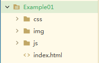
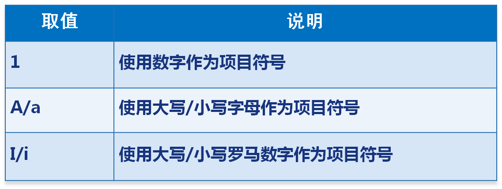

# 第1天【HTML基础】

## 主要内容

1.  互联网技术概述
2.  常用浏览器介绍
3.  html的基本结构及部分标签
4.  HTML内联框架相关标签及属性
5.  HTML表单常用元素

## 学习目标

| 节数                             | 知识点             | 要求 |
|----------------------------------|--------------------|------|
| 第一节（HTML简介及基本结构）     | HTML简介           | 掌握 |
| 第二节（html基本标签）           | html的基本程序     | 掌握 |
| 第三节（HTML部分标签）           | html的图片与超链接 | 掌握 |
| 第四节（HTML部分标签）——列表     | HTML列表           | 掌握 |
| 第五节（HTML部分标签）——表格     | HTML表格           | 掌握 |
| 第六节（HTML部分标签）——内联框架 | HTML内联框架       | 掌握 |
| 第七节（HTML部分标签）——表单     | HTML表单           | 掌握 |

## 第一节 HTML简介

### What HTML? Why谷歌？

HTML :超文本标记语言(HTML)。

HTML（HyperText Markup Language ）文档是一个放置了标记（tags）的.html文件（.htm）。

是一种客户端浏览器解释的语言，不用经过编译。

HTML语言是通过各种标记来标识文档的结构，以及标识超链接、图片、文字、段落、表单等信息。

为什么要用谷歌？

谷歌浏览器(chrome)：

浏览器使用配额最高的一款浏览器。占有份额百分之四十以上。

速度快。对HTML5支持最好。

IE浏览器(IE)：

windows系统自带的一款浏览器。兼容性最差，这源于微软的垄断性质。市场份额逐年下降。

火狐浏览器(firefox)：

小巧方便快捷。对HTML5支持也很好。

欧鹏浏览器(opera)：

速度快，但是其使用起来有很多的不方便之处，很多播放器都要其内部的专门的插件。并且下载插件不支持中文界面，使用起来尤为的不方便。

### 1.2 HTML 简介

HTML文件扩展名： .html 或 .htm

记事本可实现HTML

**1.3 HTML 基本结构**

\<html\>

\<head\>

\<title\>HTML文档\</title\>

\</head\>

\<body\>

第一个HTML文档

\</body\>

\</html\>

### 1.4 HTML W3C文档地址

https://www.w3school.com.cn/html/index.asp

### 1.5 HTML文件目录介绍

### 1.6 HTML声明方式

\<!DOCTYPE\> 声明是文档中的第一个成分，位于 \<html\> 标签之前。该标签告知浏览器文档所使用的 HTML 规范及解析类型。

解析类型有两种：

怪异模式（浏览器按照自己的方式解析和渲染页面。默认选项,

如果不写\<!DOCTYPE\> 声明，即为此模式）

标准模式（浏览器使用W3C标准解析和渲染页面）

HTML4.01 \<!DOCTYPE\> 声明方式：

\<!DOCTYPE html PUBLIC "-//W3C//DTD XHTML 1.0 Transitional//EN" "http://www.w3.org/TR/xhtml1/DTD/xhtml1-transitional.dtd"\>

HTML5标准模板：

\<!doctype html\>

\<html\>

\<head\>

\<meta charset="utf-8" /\>

\<title\>… … …\</title\>

\</head\>

\<body\>

… … …

\</body\>

\</html\>

**1.7 HEAD部分的基本标签**

\<title\>标签

\<mate\>标签

\<mate charset="utf-8" /\>

\<mate http-equiv="refresh" content="5" /\>

\<meta name="keywords" content="中软国际" /\>

\<meta name="description" content="中软国际" /\>

\<meta name="author" content="中软国际" /\>

**1.8 HTML标签语法总结**

HTML标签是大小写不敏感的,HTML与html是一样的，推荐使用小写

HTML标签通常要用两个角括号括起来:“\<” 和 “\>”。

HTML标签里可以有属性设置，语法为: 属性名=“属性值”，多个属性之间以空格分割

### 本节作业

1.  掌握HTML目录结构
2.  描述出什么是HTML
3.  掌握HTML中HEAD部分标签

## 第二节HTML基本标记

### 2.1HTML基本标签-body

\<body bgcolor="\#00FF00" \>

### 2.2HTML里的颜色设置

#### 2.2.1使用英文单词作为颜色值

如：red、green、blue、black、maroon、white、yellow ......

#### 2.2.2使六位十六进制的颜色值

如：\#000000 \#FFFFFF \#45F87E

其中前两位表示红色，中间两位表示绿色，最后两位表示蓝色。

简写：\#FF0088 -\> \#F08

### 2.3 HTML基本标签-hn

\<h1\>这是一级标题\</h1\>

\<h2\>这是二级标题\</h2\>

\<h3\>这是三级标题\</h3\>

\<h4\>这是四级标题\</h4\>

\<h5\>这是五级标题\</h5\>

\<h6\>这是六级标题\</h6\>

### 2.4 HTML基本标签-p

\<p\>这是一个段落\</p\>

### 2.5HTML单标签

#### 2.5.1 HTML基本标签-br

\<p\>国标标准化组织和\ 国际电工委员会的标准落\</p\>

#### 2.5.2 HTML基本标签-hr

\<hr/\>定义内容中的主题变化，并显示为一条水平线

\<h1\>HTML5简介\</h1\>

\

\<p\>国标标准化组织和\ 国际电工委员会的标准落\</p\>

### 2.6 HTML基本标签-strong、em

\<strong\> 定义重要文本，表示强调，表现为加粗。

\<em\>定义被强调的文本 ，表示更加强调，表现为斜体。

### 2.7 HTML基本标签-上标 \<sup\> 下标 \<sub\>

方圆1000\<sub\>米\</sub\> \ 

2\<sup\>2\</sup\>等于4

### 2.8HTML基本标签-预格式文本标签-pre

\<pre\>元素可定义预格式化的文本。被包围在 pre 元素中的文本通常会保留空格和换行符。

注意：不能用它做偷懒式的格式，一般只应用在表示计算机的源代码

### 2.9HTML基本标签-转义字符（实体字符）

页面上显示的某些特殊字符不能直接书写。比如：在HTML代码中不管输入多少个空格，在页面上都显示成一个空格。

解决这个问题就需要转义字符。

### 本节作业

1.  熟练掌握并使用本节HTML标签
2.  理解单双标签区别
3.  掌握转义字符
4.  本节HTML标签熟背

## 第三节 HTML的常用标签

### 3.1HTML基本标签-img

### \

### 3.2常用图片格式

设计网页时经常使用的图片有三种格式：

GIF：最多支持256色,支持透明,支持多帧动画显示效果.

JPEG：支持多种颜色,可以有很高的压缩比,使用了有损压缩,不支持透明,不支持动画效果.

PNG：是一种新的图片技术,可以表现品质比较高的图片,使用了无损压缩,支持透明,不支持动画.

### 3.3HTML基本标签-a

1.a标签

\<a href="admin.html" target="_blank"\>跳转\</a\>

2.标签嵌套

\<a href="admin.html" target="_blank"\>

\

\</a\>

3.锚记标签

a、使用id属性实现锚记：

\<a href="\#shuqian"\>书签\</a\>

... ... ...

\
... ... ...\</p\>

b、使用name属性实现锚记：

\<a href="\#shuqian"\>书签\</a\>

... ... ...

\<a name="shuqian"\>... ... ...\</a\>

c、不同页面之间的锚记跳转：

\<a href="hello.html\#shuqian"\>书签\</a\>

4.超链接其他应用

\<a href="mailto:shenyang@chinasoft.com"\>联系我们\</a\>

下载ftp服务器资源：

\<a href="ftp://ftp.chinasoft.com"\>公司简介\</a\>

**3.4 URL：统一资源定位符**

这是一个完整的URL。

http:// 协议

127.0.0.1 服务器IP地址（主机地址）

8080 服务器端口号。默认：80

news web应用程序跟目录

index.jsp web应用程序里的资源

**3.5 文档路径**

a.绝对路径：以最原始位置为基准

如果访问本机资源，以盘符开始：

D:/javaspace/JDBCTest/src/test/index.jpg

如果访问非本机资源，以网络协议开始：

http://hao.360.cn/admin/admin.html

B.根目录路径：以站点的跟文件夹为基准（例如：站点根文件夹为crm）

必须以 / 开始，后面跟文件夹名： /crm/test/admin/login/index.jpg

C.相对路径：以当前位置为基准（例如：当前位置是test），而且不能以 / 开始。

admin/login/index.jpg 或者 ./admin/login/index.jpg

（./代表当前目录 ../代表上一级目录）

**3.6 src与href的区别**

href 表示超文本引用，在a、link等标签上使用。

src 表示来源地址，在img、script、iframe等标签上使用。

href 里的内容是与页面相关联的内容，但不是页面上的一部分，所以是引用。

src 里的内容是要放置在页面上的，是页面的一部分，所以是引入

### 本节作业

1.  超链接练习
2.  熟记图片标签
3.  掌握HTML基础标签

## 第四节HTML基本标记——列表

**4.1列表分类**

无序列表

有序列表

定义列表

**4.2无序列表**

\<ul type="disc"\>

\<li\>HTML语言\</li\>

\<li\>CSS样式表\</li\>

\<li\>javaScript语言\</li\>

\<li\>AJAX\</li\>

\<li\>jQuery\</li\>

\</ul\>

**4.3无序列表的type属性取值范围**

**4.4有序列表**

\<ol type="1"\>

\<li\>HTML语言\</li\>

\<li\>CSS样式表\</li\>

\<li\>javaScript语言\</li\>

\<li\>AJAX\</li\>

\<li\>jQuery\</li\>

\</ol\>

**4.5有序列表的type属性取值范围**

**4.6定义列表**

\<dl\>

\<dt\>ORACLE公司产品\</dt\>

\<dd\>JAVA\</dd\>

\<dd\>ORACLE\</dd\>

\<dd\>MySql\</dd\>

\<dt\>微软公司产品\</dt\>

\<dd\>C\#\</dd\>

\<dd\>SqlServer\</dd\>

\</dl\>

**本节作业**

1.  掌握列表定义
2.  掌握列表嵌套使用
3.  完成列表嵌套使用综合练习

## 第五节HTML基本标记——表格

**5.1表格基础标签**

\<table\> 这个标签可以设置一个表格

\<th\> 这个标签可以设置列标题

\<tr\> 这个标签可以设置行

\<td\> 这个标签可以设置列

**5.2表格实现**

\<table border="1" cellspacing="1" cellpadding="0" width="280" height="70"\>

\<tr\>

\<th\>第一列\</th\>

\<th\>第二列\</th\>

\</tr\>

\<tr\>

\<td\>这是第一行第一列\</td\>

\<td\>这是第一行第二列\</td\>

\</tr\>

\<tr\>

\<td\>这是第二行第一列\</td\>

\<td\>这是第二行第二列\</td\>

\</tr\>

\</table\>

**5.3表格规则**

表格宽度和高度设置规则：

1、如果没有设置表格的宽度和高度，那么自适应单元格内容。

2、如果设置了宽度，那么表格宽度固定，即使内容宽度超过也不能改变。（这个内部内容如果是图片的话是可以改变表格宽度的。）

3、如果设置了高度，那么这个高度实际上是最小高度值，也就是当表格中的内容或者行高总值超过这个设置值时，会自动延长表格的height值，当表格中的内容或者行高没有达到这个值时，会自动扩大到这个值。

**5.4 表格合并**

**5.4.1 表格的合并列**

\<td colspan="2"\>单元格\</td\>

**5.4.2表格的合并行**

\<td rowspan="2"\>单元格\</td\>

**5.5表格标题-caption**

\<caption\>表格一\</caption\>

**本节作业**

1.  掌握表格所有基本标签
2.  能够创建表格
3.  掌握表格行/列合并
4.  完成表格综合练习

## 第六节HTML常用标记——内联框架

**6.1 什么是内联框架**

\<iframe\> 标签创建包含另一个文档的行内框架

**6.2 内联框架使用**

\<iframe src="index.html" name="mainFrame" width="800" height="500" frameborder="0" scrolling="yes"\>\</iframe\>

**本节作业**

1.  掌握内联框架的使用
2.  完成内联框架综合练习
3.  能够结合内联框架与列表完成综合练习

**第七节HTML常用标记——表单**

**7.1表单基础**

\<form action="XXXX" method="get" title="XX" target="_blank"\>

… … …

\</form\>

**7.2表单-input标签-文本框**

\<input type="text" name="username" maxlength="20" value="--这里输入用户名--" /\>

**7.3表单-input标签-密码框**

\<input type="password" name="password" /\>

**7.4表单-input标签-单选按钮**

\<input type="radio" name="sex" value="0" checked="true"/\>男

\<input type="radio" name="sex" value="1"/\>女

**7.5表单-input标签-复选框**

\<input type="checkbox" name="like" value="0" checked=" true" /\>读书

\<input type="checkbox" name="like" value="1" /\>体育

\<input type="checkbox" name="like" value="2" /\>旅游

**7.6表单-下拉列表-1**

\<select name="nationality"\>

\<option value="0" selected="true"\>中国\</option\>

\<option value="1"\>美国\</option\>

\<option value="2"\>英国\</option\>

\</select\>

**7.7表单-下拉列表-2**

\<select name="job"\>

\<optgroup label="市场部"\>

\<option value="0"\>区域专员\</option\>

\<option value="1"\>外阜专员\</option\>

\</optgroup\>

\<optgroup label="技术部"\>

\<option value="2"\>程序员\</option\>

\<option value="3"\>需求分析师\</option\>

\<option value="4"\>系统架构师\</option\>

\</optgroup\>

\</select\>

**7.8表单-下拉列表-3**

\<select name="nationality" multiple="true" \>

\<option value="0"\>中国\</option\>

\<option value="1" selected="true"\>美国\</option\>

\<option value="2"\>英国\</option\>

\</select\>

**7.9表单-input标签-文件域**

\<form action="XXX" method="post" enctype="multipart/form-data"\>

\<input type="file" name="files" /\>

\</form\>

**7.10表单-多行文本域**

\<textarea name="brief" rows="5" cols="30"\>--这里输入个人简介--\</textarea\>

**7.11表单-input标签-隐藏域**

\<input type="hidden" name="level" value="0" /\>

**7.12表单-input标签-提交按钮**

将表单全部内容，提交给action属性指定的服务器一个表单通常都应该有一个提交按钮

\<input type="submit" value="提交" /\>

**7.13表单-input标签-图片提交按钮**

将表单全部内容，提交给action属性指定的服务器

\<input type="image" src="image/submit.JPG" /\>

**7.14表单-input标签-重置按钮**

将表单重新设置为初始状态

\<input type="reset" value="重置" /\>

**7.15其他控件-普通按钮**

\<input type="button" value="这是一个普通按钮" /\>

\<button\>这是一个普通按钮\</button\>

**7.16表单-其他属性**

\<input type="text" name="username" readonly="true" /\>

\<input type="text" name="username" disabled="true" /\>

readonly： 不可编辑,但可以选择和复制;值可以传递到后台

disabled： 不能编辑,不能复制,不能选择;值不可以传递到后台

**7.17属性值为布尔类型的属性总结**

**7.18语义化**

什么是语义化

符合W3C标准

见名知意、直观的认知标签

结构合理、代码简洁

有利于浏览器抓取

**本节作业**

1.  完成表单内容练习
2.  完成Html部分综合练习
3.  整理HTML部分重点标签
