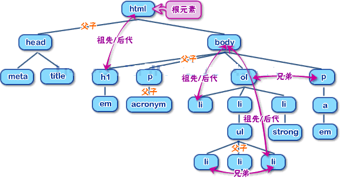
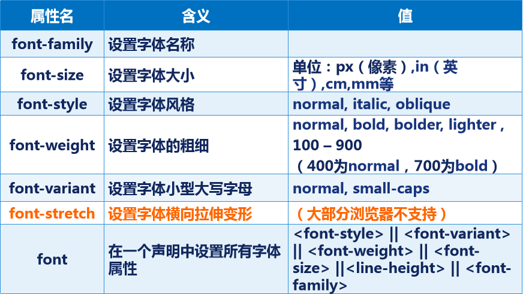
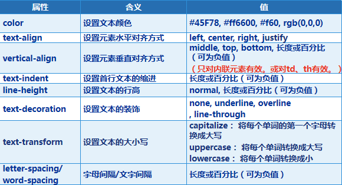
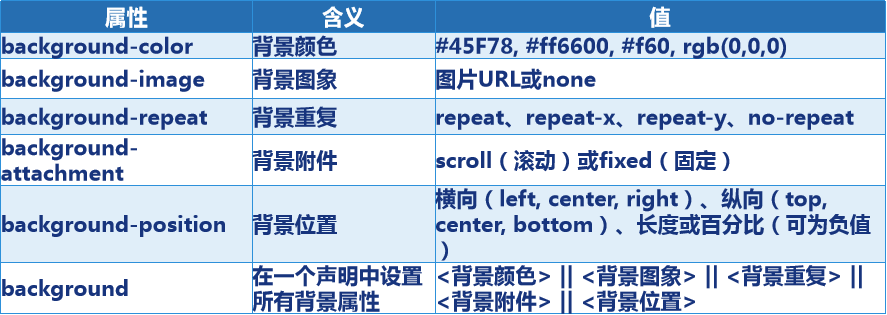
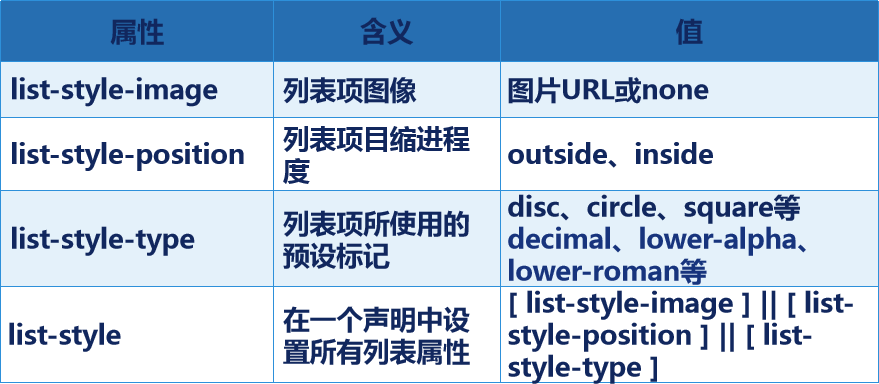
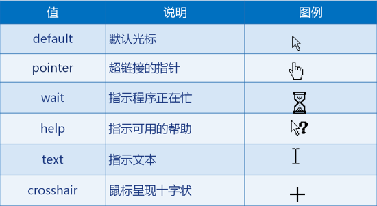
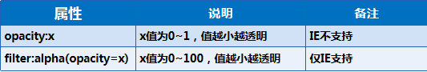
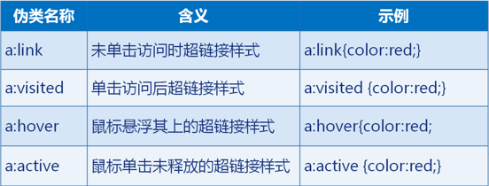

# 第1天【CSS基础】

## 主要内容

1.  了解CSS与HTML间的关系
2.  掌握CSS基础格式与使用方式
3.  掌握CSS高级选择器

## 学习目标

| 节数                            | 知识点                      | 要求 |
|---------------------------------|-----------------------------|------|
| 第一节（CSS基础）——使用与功能   | CSS的使用方式与基础语法结构 | 掌握 |
| 第二节（CSS基础）——高级选择器   | CSS高级选择器               | 掌握 |
| 第三节（CSS基础）——文字样式     | CSS文字样式及其属性值       | 掌握 |
| 第四节（CSS基础）——尺寸         | CSS尺寸及其属性值           | 掌握 |
| 第五节（CSS基础）——背景样式     | CSS背景及其属性值           | 掌握 |
| 第六节（CSS基础）——列表鼠标     | CSS列表鼠标及其属性值       | 掌握 |
| 第七节（CSS基础）——伪元素选择器 | CSS伪元素选择器             | 掌握 |

## 第一节CSS基础——使用与功能

**1.1 为什么需要CSS样式表**

HTML负责页面的结构和内容

CSS样式表负责页面外观的渲染（相当于华丽的衣服）

**1.2CSS样式表的优势**

CSS：层叠样式表（Cascading Style Sheet）

内容与表现分离

网页的表现统一，容易修改

丰富的样式，使得页面布局更加灵活

减少网页的代码量，增加网页的浏览速度，节省网络带宽

运用独立于页面的CSS，有利于网页被搜索引擎收录

由浏览器解释运行

不区分大小写

**1.3 CSS样式表基本语法**

在页面上使用时，通常在\<head\>部分写入\<style\>，样式代码放在\<style\>标签中

选择器 {

样式声明;

样式声明;

… …

}

**1.4 CSS基础选择器**

**1.4.1什么是选择器**

选择器就是找到你要渲染的那个HTML标签。

**1.4.2 选择器类型介绍**

HTML标签选择器：直接作用于某个HTML标签

类选择器：可在页面中被多次使用

ID选择器：作用于同一ID的某个资源，同一个页面中只能使用一次.

**1.5HTML标签选择器**

**1.5.1 HTML标签选择器：任何一个标签都可以是一个选择器**

**1.5.2 基本语法**

\<style\>

p{

font-family:黑体;

color:red;

text-align:center;

}

\</style\>

… …

\<body\>

\<p\>这是一段段落\</p\>

\</body\>

**1.6 HTML标签选择器**

**1.6.1 基本语法**

**1.6.2 案例一**

.ztys{

font-family:黑体;

color:red;

}

… …

\<p\>这是第一段段落\</p\>

\
这是第二段段落\</p\>

**1.6.2 案例二**

.one{

color:blue;

}

.two{

font-size:24px;

}

.three{

font-family:"华文行楷";

}

\
这是一段段落\</p\>

**1.7 CSS样式表基本语法-ID选择器**

**1.7.1 ID选择器：任何一个标签都有ID属性，ID属性值要唯一。ID选择器就是对单独元素做单独样式。**

**1.7.2 案例一**

\#myld{

font-family:黑体;

color:red;

}

… …

\
这是第一段段落\</p\>

\<p\>这是第二段段落\</p\>

**1.8 span标签**

**1.8.1 span标签：对行内元素进行分组，以便通过样式对它们进行格式化**

**1.8.2 案例一**

.common{

font-size:24px;

color:red;

}

\<p\>今天晴，气温\23\</span\>度\</p\>

**1.9样式的引用**

**1.9.1 三种样式介绍**

行内样式：写在某个标签中，只对本行有效。（内联样式）

内嵌样式：也在某个页面中，只对本页面有效。前面的例子都是内嵌样式。

外部样式：写在某个单独的.CSS文件中，对引用该文件的页面有效。

**1.9.2 行内样式**

\
这是一个行内样式\</p\>

**1.9.3行内样式和内嵌样式的优缺点**

优点：方便在同页面中修改样式，比较灵活。

缺点：不利于在多页面间共享复用代码及维护，对内容与样式的分离也不够彻底。尤其是行内样式，将页面内容与样式渲染混杂在一起，失去了内容与样式分离的原则。

总结：因此只有在某个页面的样式是独一无二时才使用内嵌样式表。某个标签的样式是独一无二时才使用行内样式表。

**1.9.4外部样式**

使用方式：将样式代码写在一个单独的文件中（.CSS文件），使用时要将这个.CSS文件导入使用。

优点：外部样式是高效的、节省带宽的。因为一般的浏览器都有缓存功能，所以用户不必每次都下载外部样式文件。

外部样式引用：

1.  链接方式： \<link/\>标签属于XHTML，使用\<link/\>链接的CSS文件先加载到网页当中，再进行编译显示。Link 支持使用javascript改变样式。目前大多数网站都采用此方式。
2.  导入方式： @import是属于CSS2.1特有的，对于不兼容CSS2.1的浏览器来说就是无效的。使用@import导入的CSS文件，客户端显示HTML结构，再把CSS文件加载到网页当中。 @import不支持使用javascript改变样式

**1.9.5 href 与 src 的区别**

1.src用于替换当前元素，是source的缩写，指向外部资源的位置，指向的内容将会嵌入到文档中当前标签所在位置；在请求src资源时会将其指向的资源下载并应用到文档内，例如img图片和frame等元素。

2.href用于在当前文档和引用资源之间确立联系。，是Hypertext Reference的缩写，指向网络资源所在位置，建立和当前元素（锚点）或当前文档（链接）之间的链接

**1.10 多重样式叠加时的优先级**

就近原则：距离最近的样式有效。

顺序原则：最后书写(不是调用)的样式有效。

精细原则：或者叫特殊原则。既选择器的指向越精细越优先。

**本节作业**

1.  掌握HTML与CSS间的关系
2.  熟练记忆三种引用方式
3.  完成选择器部分基础练习
4.  掌握CSS基础选择器

**第二节CSS高级复合选择器**

**2.1 CSS高级应用-后代选择器（关联选择器）**

**2.1.1 注意事项**

1.在CSS选择器中通过嵌套的方式，对特殊位置的HTML标签进行声明

2.外层的标签写在前面，内层的标签写在后面，之间用空格分隔，顺序必须要一致

3.标签嵌套时，内层的标签成为外层标签的后代

4.只有在标签嵌套时，内层标签才是外层标签的后代，此时才可以使用后代选择器

5.因为层叠顺序的规则，它们的优先权比单一的选择符大

6.只要能保持关联关系就可以，不管是在多少层

**2.1.2使用方式**

案例一：

p strong{

color:red;

font-size:36px;

}

案例二：

.one .update \#uid p{

color:blue;

font-size:24px;

}

.two{

color:red;

font-size:12px;

}

**2.2 CSS高级应用-交集选择器**

**2.2.1 注意事项**

1.为同一种标签设置不同的类选择器或ID选择器

2.由两个选择器直接连接构成，这两个选择器必须在同一处使用

3.第一个必须是HTML标签，第二个必须是类选择器或者ID选择器

4.选择器之间不能有空格，必须连续书写

**2.2.2 使用方式**

案例一：

p.ztsz{

color:red;

font-size:36px;

}

p\#uname{

color:blue;

font-size:24px;

}

**2.2.3 后代选择器与交集选择器区分**

p.ztsz{

color:red;

font-size:36px;

}

p .ztsz{

color:blue;

font-size:24px;

}

**2.3 CSS高级应用-并集选择器**

**2.3.1 注意事项**

1.多个选择器通过逗号连接而成

2.利用并集选择器同时声明风格相同样式

**2.3.2 使用方式**

p,.ztsz,\#uname{

color:red;

font-size:36px;

}

**2.4 CSS高级应用-继承**

**2.4.1 html 文档树（DOM节点树）**

**2.4.2 继承原则**

子标签可以继承父标签的样式风格

子标签的样式不会影响父标签的样式风格

一般只有文字文本具有继承特性，如文字大小、文字加粗、文字颜色、字体等。

**2.5复杂样式的优先级**

1.  复杂样式的计算方法：

HTML选择器的优先级：1

类选择器的优先级：10

ID选择器的优先级：100

**本节作业**

1.  掌握CSS高级选择器的应用
2.  使用CSS高级选择器的复合完成练习

## 第三节CSS基础——文字样式

**3.1 CSS中使用的单位**

**3.1.1 长度单位**

在css样式表中可以使用如下长度单位：

相对长度单位：

px： 像素（Pixel，与屏幕分辨率有关）。 p{font-size:12px;}

em： 相对于当前对象尺寸的倍数。 p{font-size:2em;}

rem： 相对于html对象尺寸的倍数。 p{font-size:2rem;}

%： 百分比 p{font-size:80%;}

绝对长度单位：

pt： 点（Point）。

cm： 厘米（Centimeter）。

mm： 毫米（Millimeter）。

换算比例：1in(英寸) = 2.54cm = 25.4 mm = 72pt = 6pc

**3.1.2 颜色单位**

CSS中的颜色值：

\#rrggbb (如： 最适合网页背景的颜色：\#f9f9f9)

\#rgb （如：\#fc0 = \#ffcc00）

rgb(x,x,x) 其中x是一个0-255的整数值,分别代表：红、绿、蓝。

rgb(x%,x%,x%) 其中x是一个0-100的整数值,如rgb(100%,80%,0)

CSS指定URL地址方式：

body{background-image:url(../images/bg.jpg)}

body{background-image:url(http://www.baidu.com/images/bg.jpg)}

body{background-image:url('../images/bg.jpg')}

body{background-image:url("../images/bg.jpg")}

注意：CSS中的路径一律相当于当前CSS位置

**3.2 字体样式**

**3.2.1 font-family font-size**

p{

font-family:"隶书", "华文行楷", Terminal;

font-size:36px;

}

**3.2.2 font-style**

\
这是正常字体\</p\>

\
这是斜体\</p\>

\
这是倾斜字体\</p\>

**3.2.3 font-weight**

\
这是正常字体\</p\>

\
这是粗体\</p\>

\
这是特粗体，相当于strong和b\</p\>

\
这是细体\</p\>

\
这是用数字表示的细体\</p\>

\
这是用数字表示的特粗体\</p\>

**3.2.4 font-variant**

\
超文本标记语言html\</p\>

\
超文本标记语言html\</p\>

**3.2.5 字体样式总结**

**3.3 文本样式**

**3.3.1 text-align**

\
这是一个段落\</p\>

\
这是一个段落\</p\>

\
这是一个段落\</p\>

**3.3.2 vertical-align(1)**

\<p\>\<strong style="vertical-align: top;"\>strong标签\</strong\>这是一段文本\</p\>

\<p\>\<strong style="vertical-align: middle;"\>strong标签\</strong\>这是一段文本\</p\>

\<p\>\<strong style="vertical-align: bottom;"\>strong标签\</strong\>这是一段文本\</p\>

**3.3.3 vertical-align(2)**

\<p\>\与图片居中对齐\</p\>

\<p\>\与图片上部对齐\</p\>

\<p\>\与图片下部对齐\</p\>

**3.3.4 vertical-align(3)**

\<table border="1" width="100px" height="100px"\>

\<tr\>\<td style="vertical-align: top;"\>内容\</td\>\</tr\>

\</table\>

**3.3.5 text-indent line-height**

\
声明是文档中的第一个成分，位于html标签之前。该标签告知浏览器文档所使用的 HTML 规范及解析类型。\</p\>

\
声明是文档中的第一个成分，位于 html标签之前。该标签告知浏览器文档所使用的 HTML 规范及解析类型。\</p\>

**3.3.6 text-decoration**

\
这是一个段落\</p\>

\
这是一个段落\</p\>

\
这是一个段落\</p\>

**3.3.7 text-transform**

\
helloWorld\</p\>

\
helloWorld\</p\>

\
helloWorld\</p\>

**3.3.8 letter-spacing/word-spacing**

\<p\>hello!这是一个段落\</p\>

\
hello!这是一个段落\</p\>

\
hello! 这是 一个 段落\</p\>

**3.3.9 文本样式总结**

**本节作业**

1.  重点文本样式记忆
2.  重点字体样式练习完成

## 第四节CSS基础——尺寸

**4.1 width heigh**

p{width:60px; height:60px; background-color:red;}

table{width:150px; height:30px; background-color:blue;}

\<p\>这是一个段落\</p\>

\<table\>

\<tr\>\<td\>这是一个表格\</td\>\</tr\>

\</table\>

**4.2 display**

**4.2.1 元素分类**

行级元素：a、span、lable

尺寸不能通过width和height进行设定，而由内容来决定

不要求独占一行

行块元素：img、input

尺寸通过width和height进行设定

不要求独占一行

块级元素：p、h、ul、ol

尺寸通过width和height进行设定

要求独占一行

**4.2.2 元素注意事项**

行级和行块元素内部不可以嵌套包含其他的块级元素。p是个例外也不能包含其他块级元素

**4.2.3 display属性常用值**

none:不显示

inline:行级元素，如a、span

inline-block:行块元素，如img

block:块级元素，如p、h、ul

list-item：列表项，如li

**本节作业**

1.行级元素，块级元素，行块元素区分

2.Display属性练习完成

## 第五节CSS基础——背景样式

**5.1 background-color**

body{

background-color:rgb(255,0,0);

}

**5.2 background-image / repeat**

body{

background-image:url(image/sunset.jpg);

background-repeat:no-repeat;

}

**5.3 background-attachment**

body{

background-image:url(image/sunset.jpg);

background-attachment:scroll;

}

p{ color:white; }

**5.4 background-position(1)**

table{

background-color:blue;

background-image:url(image/sunset.jpg);

background-repeat:no-repeat;

background-position:center;

width:300px;

height:300px;

}

… … …

\<table\>

\<tr\>\<td\>\</td\>\</tr\>

\</table\>

**5.5 background-position(2)**

table{

background-color:blue;

background-image:url(image/sunset.jpg);

background-repeat:no-repeat;

background-position:left 10px top 10px;

width:300px;

height:300px;

}

**5.6 背景样式总结**

**本节作业**

1.练习图片logo裁剪方式

2.常用背景图片属性练习

## 第六节CSS基础——列表鼠标

**6.1 列表样式**

**6.1.1 list-style-image**

ul{

list-style-image:url(image/list.jpg);

}

\<ul\>

\<li\>列表第一项\</li\>

\<li\>列表第二项\</li\>

\<li\>列表第三项\</li\>

\</ul\>

**6.1.2 list-style-position**

ul{

list-style-image:url(image/list.jpg);

list-style-position:inside;

width:100px;

}

\<ul\>

\<li\>这个列表项会环绕图标\</li\>

\<li\>这个列表项会环绕图标\</li\>

\<li\>这个列表项会环绕图标\</li\>

\</ul\>

**6.1.3 list-style-type**

ul{

list-style-type:circle;

}

ol{

list-style-type:lower-alpha;

}

\<ul\>

\<li\>这是个无序列表\</li\>

\<li\>这是个无序列表\</li\>

\</ul\>

\<ol\>

\<li\>这是个有序列表\</li\>

\<li\>这是个有序列表\</li\>

\</ol\>

**6.1.4 列表样式总结**

**6.2 鼠标样式**

**6.2.1 鼠标常用样式**

\
默认光标\</p\>

\
超链接的指针\</p\>

\
指示程序正在忙\</p\>

\
指示可用的帮助\</p\>

\
指示文本\</p\>

\
鼠标呈现十字状\</p\>

**6.2.2 鼠标样式总结**

**6.3 元素透明度**

**本节作业**

1.利用列表样式，完成小米网列表导航

2.完成图片透明度练习

## 第七节CSS基础——伪元素选择器

**7.1 伪元素选择器**

**本节作业**

1.掌握伪元素选择器

2.利用伪元素选择器结合CSS完成小米导航
