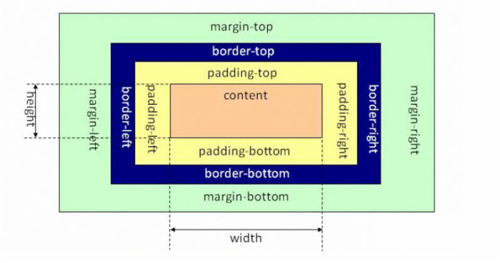
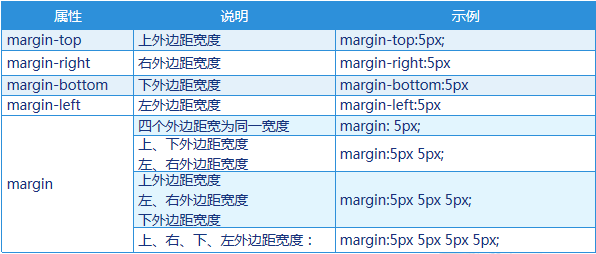
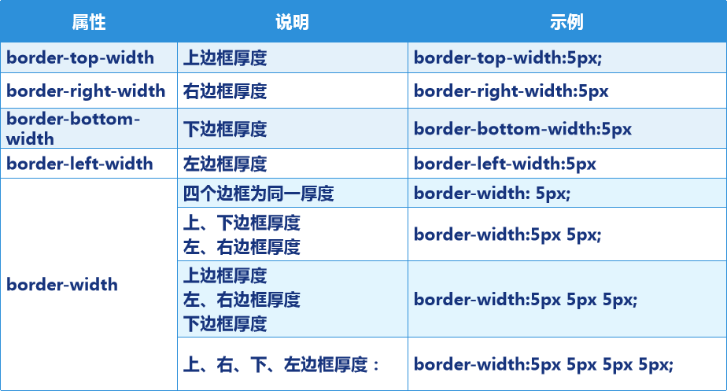
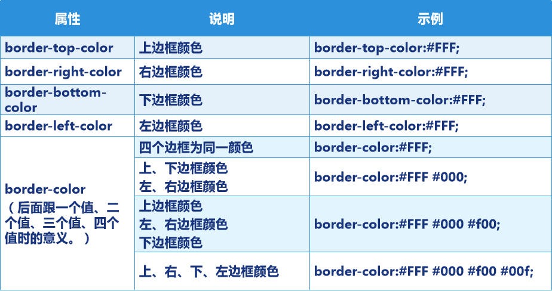
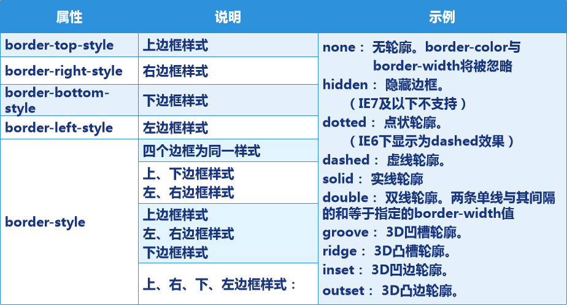
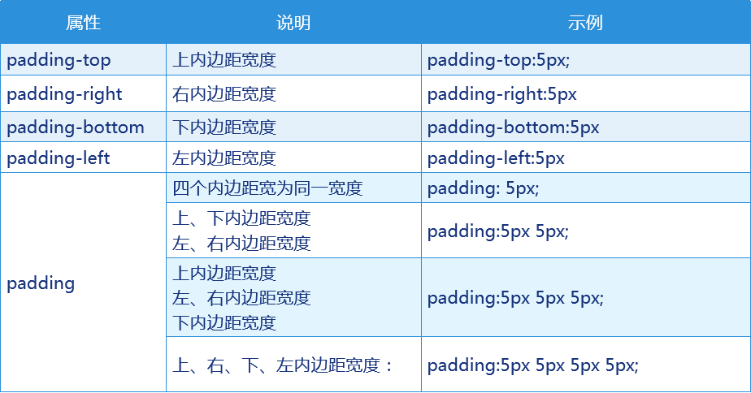
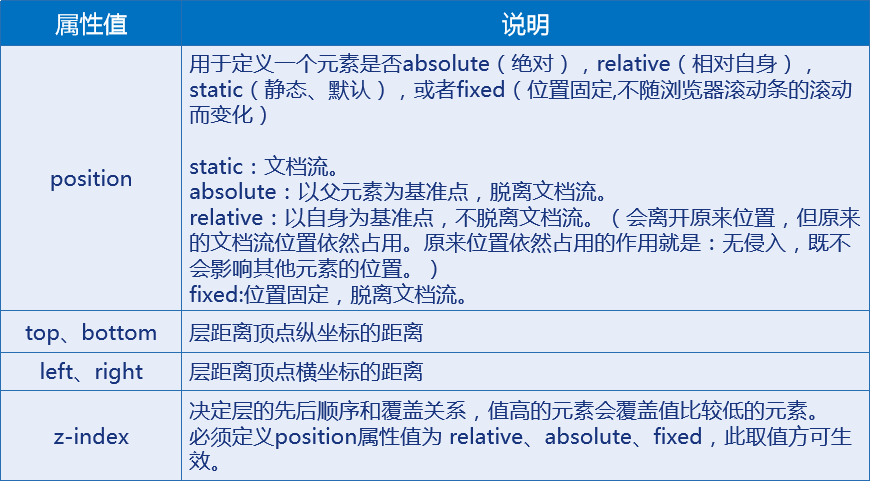

# 第2天【CSS布局基础】

## 主要内容

1.  掌握CSS盒子模型
2.  掌握盒子模型的属性
3.  掌握margin重叠解决方案

## 学习目标

| 节数                                      | 知识点                  | 要求 |
|-------------------------------------------|-------------------------|------|
| 第一节（CSS布局基础）——盒子模型           | CSS盒子模型种类         | 掌握 |
| 第二节（CSS布局基础）——盒子属性           | CSS盒子模型常见属性     | 掌握 |
| 第三节（CSS布局基础）——标准文档流         | CSS基础布局之标准文档流 | 掌握 |
| 第四节（CSS布局基础）——DIV+CSS布局方式    | CSS基础布局之标准文档流 | 掌握 |
| 第五节（CSS布局基础）——float，clear，塌陷 | CSS基础布局之标准文档流 | 掌握 |

## 第一节CSS布局基础——盒子模型

1.  **什么是盒子模型**

**1.1.1 盒子模型简介**

1.每个HTML元素都可以看作一个装了东西的盒子

2.盒子本身具有宽度（width）和高度（height）

3.盒子里面的内容到盒子边框之间的距离即内边距（padding）

4.盒子本身有边框（border）

5.盒子边框外和其他盒子之间，还有外边距（margin）

**1.1.2 标准盒子模型**

**1.1.3 IE6及之前版本中的盒子模型**

**本节作业**

1.  理解盒子模型
2.  掌握盒子模型类型及其转换方式

## 第二节CSS布局基础——盒子属性

1.  **外边距属性-margin**

**2.1.1 margin常用属性及其属性值**

**2.1.2 外边距应用示例-网页居中**

p{

background:\#F00;

width:200px;

height:100px;

margin:0 auto;

}

\<p\>这是一个段落\</p\>

**2.1.3 外边距应用示例-body的外边距**

网页标签\<h1\>…\<h6\>、\<p\>、、\<ul\>、\<ol\>、\<li\>、\<dl\>、\<dt\>、\<dd\>、\<body\>等都有margin，实际网页制作时通常使用并集选择器设置这些可能产生外边框的标签的margin为0

1.  **边框属性-border**

**2.2.1边框属性-border-width**

**2.2.1 边框属性-border-color**

**2.2.2 边框属性-border-style**

**2.2.3 border属性统一设置**

同时设置边框的宽度、样式、颜色属性

border: \#00FF00 4px double;

border-top: border: \#00FF00 4px double;

（属性设置没有顺序）

1.  **内边距属性-padding**
    1.  **内边距属性介绍**

**2.3.2 内边距应用示例**

p{

background:\#F00;

width:200px;

height:100px;

margin:0 auto;

padding:20px;

}

\<p\>这是一个段落\</p\>

**本节作业**

1.掌握盒子模型常用属性以及属性值

2.完成盒子模型部分样式练习

## 第三节CSS布局基础——标准文档流

1.  **标准文档流基础**

**3.1.1 什么是标准文档流**

HTML标准文档流：将窗体自上而下分成一行一行，并在每行中从左到右依次排放元素。它是窗体上可显示元素在排列时所占用的位置。

**3.1.2 标准文档流组成**

块级元素（block level）

内联元素（inline 行内元素）

**3.1.3 块级元素与内联元素区别(1)**

1.内联元素从左到右横向排列，到最右端自动折行，即不独占一行

2.块级以块状显现，并和同级块依次垂直排列，左右撑满，即独占一行。

3.块级元素可以包含内联元素和块级元素(P标签不能包含P标签)。但内联元素不能包含块级元素。

4.内联元素与块级元素属性的不同，主要是盒模型属性上。

5.内联元素的内容可以自动换行(汉字自动换行，字母在在空格处)，它的宽度和高度是自动的。因此设置width无效，height无效。但可以设置line-height。

6.内联元素的border有效，margin上下无效，padding上下无效。也就是padding和margin的left和right是可以设置的 。

7.行块比较特殊，它的border，margin，padding是有效的。

**3.1.4 块级元素与内联元素列举**

块级元素（block level）

\<h1\>…\<h6\>、\<p\>、\<div\>、\<ul\>、\<ol\>…

内联元素（inline 行内元素）

\<span\>、\<a\>、\、\<strong\>、一段文字(匿名内联元素)...

**3.1.5 块级元素与内联元素区别(2)**

所谓内联元素的边框无效， margin上下无效，padding上下无效。是指它们不占用页面空间，但可以显示。

**3.1.6 块级元素和内联元素的转换**

案例一：

\#div1{

background-color:\#0F0;

width:100px;

}

\<h1\>这是h1块级元素\</h1\>

\<p\>这是p块级元素\</p\>

\
这是一个层\</div\>

案例二：

\#div1{

background-color:\#0F0;

width:100px;

}

.show{

display:inline;

}

\<h1 class="show"\>这是h1块级元素\</h1\>

\
这是p块级元素\</p\>

\
这是一个层\</div\>

1.  **标准文档流补充**

**3.2.1 div与span的区别**

1.大部分HTML标签都有自身的意义，但是div和span标签没有任何内容上的意义，它们被用来把一段HTML代码组合成一大块。

2.div和span标签与CSS结合起来一起使用，这种方式被广泛应用。它们的存在纯粹是应用样式，所以当样式表失效时它就没有任何的作用

3.span是内联元素，用在一小块的内联HTML中。

4.div（division）块级元素，用于组合一大块的代码，为HTML 文档内大块的内容提供结构和背景的元素，可以包含段落、标题、表格甚至其他部分，这使div便于建立不同集成的类。

5.div的起始标签和结束标签之间的所有内容都是用来构成这个块的，其中所包含元素的特性由div标签的属性来控制，或者是通过使用样式表格式化这个块来进行控制。

**3.2.2 块的显示和隐藏**

案例一：

\#one{

background:red;

width:200px;

height:100px;

}

\#two{

background:green;

width:200px;

height:100px;

}

\
\</div\>

\
\</div\>

\#one{

background:red;

width:200px;

height:100px;

display:none;

}

\#two{

background:green;

width:200px;

height:100px;

}

**3.2.3 父子块的显示和隐藏**

案例一：

\#one{

background:red;

width:220px;

height:120px;

}

\#two{

background:green;

width:200px;

height:100px;

}

\

\
\</div\>

\</div\>

\#one{

background:red;

width:220px;

height:120px;

display:none;

}

\#two{

background:green;

width:200px;

height:100px;

display:block;

}

**3.2.4 块的显示和隐藏-应用示例**

案例一：

\

\<ul\>

\<li\>

\<a href=""\>编程语言

\<div\>

\<ol\>

\<li\>java\</li\>

\<li\>C\</li\>

\<li\>C++\</li\>

\</ol\>

\</div\>

\</a\>

\</li\>

... ...

\</ul\>

\</div\>

**3.2.5 表格的显示和隐藏**

.one{

visibility:hidden;

}

\<table\>

\<tr\>\<td\>张三\</td\>\<td\>男\</td\>\<td\>20岁\</td\>\</tr\>

\<tr class="one"\>\<td\>李四\</td\>\<td\>女\</td\>\<td\>22岁\</td\>\</tr\>

\<tr\>\<td\>王五\</td\>\<td\>男\</td\>\<td\>21岁\</td\>\</tr\>

\</table\>

**本节作业**

1.完成标准文档流布局案例

2.掌握行级元素与块级元素的却别

## 第四节CSS布局基础——DIV+CSS布局方式

**4.1为什么要采用DIV+CSS布局方式**

1.使用“DIV+CSS”对网站进行布局符合W3C标准。

2.使用传统的表格布局有很多缺点，比如垃圾代码过多，语义性不强，对搜索引擎不友好等。

3.通过使用div盒子模型结构将各部分内容划分到不同的区块，然后用css来定义盒子模型的位置、大小、边框、内外边距、排列方式等。

4.div用于搭建网站结构（框架）、css用于创建网站表现（样式/美化）。该标准简化了HTML页面代码，获得一个较优秀的网站结构，有利于日后网站维护、协同工作和便于搜索引擎抓取。

5.当然并不是所有的网页都需要用div布局，例如数据页面、报表之类的页面，还是使用HTML的表格会比较方便，web标准里并没有说要抛弃table。

**4.2元素在页面中的定位方式概述**

静态定位：依据文档流定位（这是默认的）。

相对定位：以自身为基准点，不脱离文档流。

绝对定位：以父元素为基准点，脱离文档流。

固定定位：位置固定，脱离文档流。

弹性定位：根据父元素尺寸，按照给定的分配原则，计算出每一个子元素的尺寸

**4.3 布局中的定位属性**

**4.4 绝对定位布局方式**

**4.4.1 绝对布局使用注意事项**

必须给父元素加定位属性，一般使用 position:relative;

如果不给父元素加定位属性，那么子元素将不以父元素为基准，而是以body为基准。

给子元素加绝对定位属性 position:absolute; 同时加left、right、top、bottom属性。

**4.4.2 案例一**

\#div1{

position:absolute;

left:9px;

top:12px;

width:200px;

height:100px;

background-color: red;

}

\#div2{

position:absolute;

left:218px;

top:12px;

width:200px;

height:100px;

background-color: blue;

}

**4.4.3 案例二**

\#div1{

position:absolute;

left:9px;

top:12px;

width:200px;

height:100px;

z-index:1;

background-color: red;

}

\#div2{

position:absolute;

left:160px;

top:50px;

width:200px;

height:100px;

z-index:2;

background-color: blue;

}

**4.4.4 绝对定位布局方式的缺点**

绝对定位布局方式简单易用，但是由于位置与尺寸固定，所以不能很好的适应页面内容的变化。  
 比如：当right块中的内容不确定时，我们希望它的高度能够随着内容的增加而增加，所以right块的的height就不能定义。但是随着right块高度的变化，就会影响footer块，造成布局错乱。

**4.4.5 绝对定位布局方式的缺点解决方式**  
 1、不放置bottom层，并给定left和right层相同的min-height层，溢出部分隐藏或支持滚动

2、在四部分的外部设定一个容器层，并设定该容器层的最小宽高，内部的left和right可以对溢出部分隐藏或者支持滚动

3、right和left使用iframe解决内容溢出

4、使用文档流布局（相对定位布局）

## 第五节CSS布局基础——float，clear，塌陷

**5.1 浮动布局方式：浮动属性-float**

浮动属性：让某个元素脱离标准文档流，漂浮在标准文档流之上，和标准文档流不是一个层次。可以使用left浮动、right浮动。

使用浮动的目的就是：让块级元素处在同一行

**5.2 浮动属性-规则**

**5.2.1 绝对定位布局方式的缺点解决方式**

1.浮动的块可以向左或向右移动，直到它的外边缘碰到包含它区块的边框、或另一个浮动框的边框、或一个标准流块的下一行。

2.当存在多个块时，如果其中一个块浮动了，那么它就脱离了文档流，那么其余的块会依据文档流向前移动，也就是占据了浮动块的位置。

3.如果多个块一起浮动，那么它们按照HTML代码顺序从前向后依次跟随。 靠近页面边缘的一端是前，远离页面边缘的一端是后。

4.多个块一起浮动，如果外层块缩小，使得同行浮动块空间不足时，浮动块会依次向下一行移动。

5.行内元素浮动后会强制转换成块级元素。此时要注意，一些内联属性将失效（比如：vertical-align）.

**5.2.2 案例一**

浮动的块可以向左或向右移动，直到它的外边缘碰到包含它区块的边框、或另一个浮动框的边框、或一个标准流块的下一行。

\#one{

float:left;

… …

}

\#one{

float:right;

… …

}

**5.2.3 规则2**

当存在多个块时，如果第一个块浮动了，那么它就脱离了文档流，那么第二个块会依据文档流向前移动，也就是占据了第一个块的位置。

**5.2.4 规则3**

如果多个块一起浮动，那么它们按照HTML代码顺序从前向后依次跟随。 靠近页面边缘的一端是前，远离页面边缘的一端是后。

**5.2.5 规则4**

多个块一起浮动，如果外层块缩小，使得同行浮动块空间不足时，浮动块会依次向下一行移动。

**5.3 清除属性-clear**

**5.3.1 清除属性**

指定一个元素是否允许有元素漂浮在它的旁边。或者这样说：清除前面浮动元素对自己的影响。

由于left块是左浮动，所以设置footer块的左清除属性：clear:left;如果使用右清除属性，则没有效果。实际上，我们的目的是让footer块处在left块和right块之下，所以不必理会左清除或右清除，使用clear:both; 就可以了。

**5.3.2 案例一**

.clear{  
 clear:both;  
}  
  
\
  
 \
header\</div\>  
 \
left\</div\>  
 \
right\</div\>  
 \
\</div\>  
 \
footer\</div\>  
\</div\>
