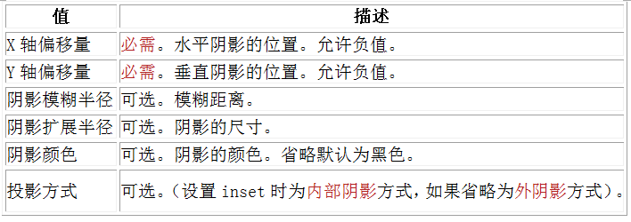
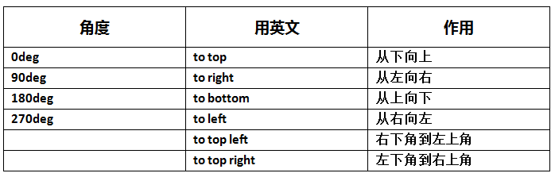
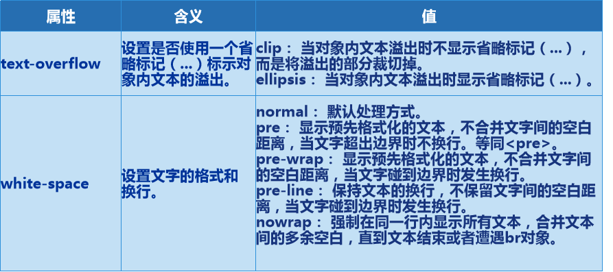
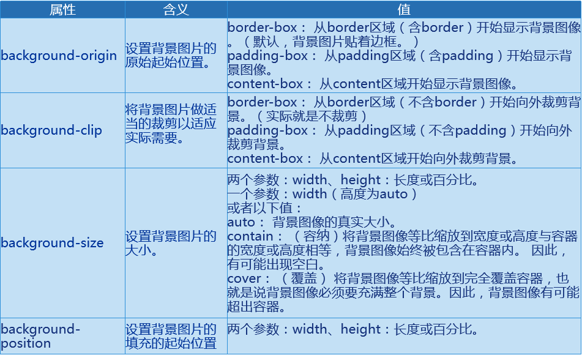
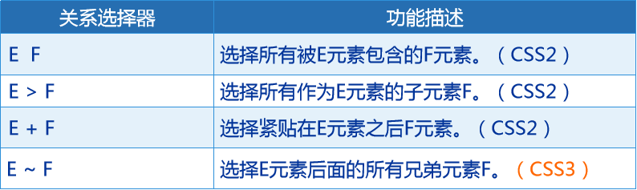
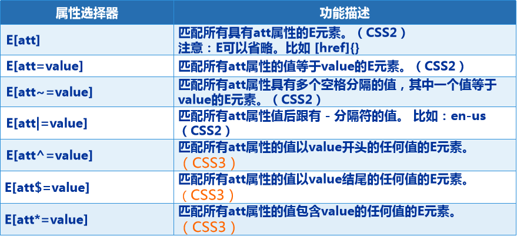
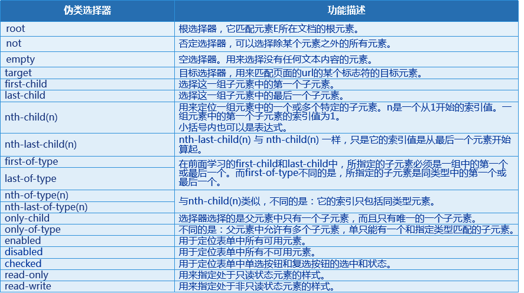
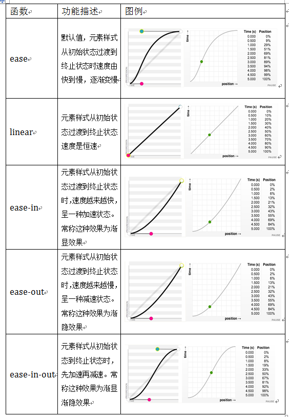
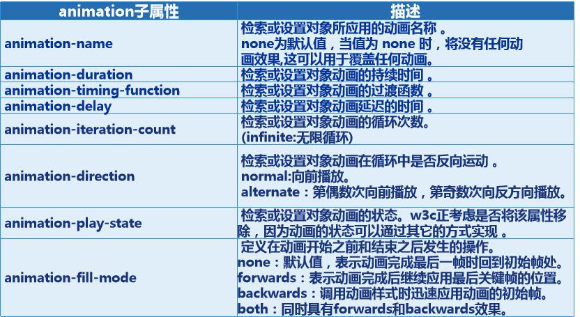
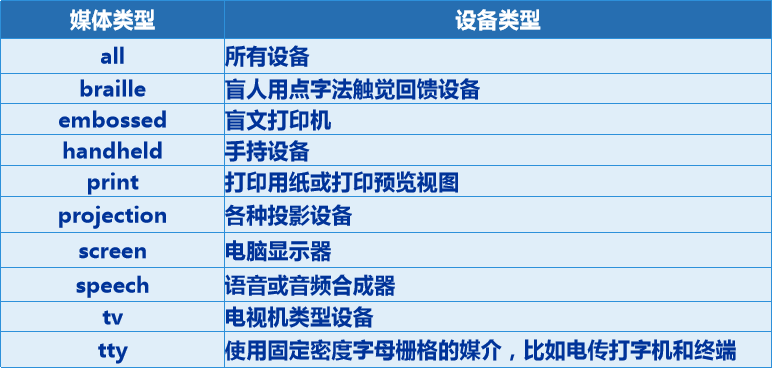

# 第3天【CSS高级应用】

## 主要内容

1.  掌握CSS3特效
2.  掌握CSS3高级选择器
3.  掌握CSS3动画
4.  掌握CSS高级布局方式

## 学习目标

| 节数                                  | 知识点                        | 要求 |
|---------------------------------------|-------------------------------|------|
| 第一节（CSS高级应用）——CSS3高级特效   | 阴影，圆角，背景，字体        | 掌握 |
| 第二节（CSS高级应用）——CSS3高级选择器 | 伪类选择器、伪元素选择器      | 掌握 |
| 第三节（CSS高级应用）——CSS3形变动画   | 形变，动画                    | 掌握 |
| 第四节（CSS高级应用）——CSS3高级布局   | Rem布局、响应式布局、弹性布局 | 掌握 |

## 第一节CSS布局基础——CSS3高级特效

**1.1 CSS3介绍**

**1.1.1 CSS3**

CSS3是CSS2的升级版本，3只是版本号。

CSS3在CSS2.1的基础上增加了很多强大的新功能。

目前主流浏览器chrome、safari、firefox、opera都已经支持了CSS3大部分功能了

**1.1.2 CSS3与浏览器内核**

在编写CSS3样式时，不同的浏览器可能需要不同的前缀。

它表示该CSS属性或规则尚未成为W3C标准的一部分，是浏览器的私有属性。

因此在使用一个属性时，为了让不同浏览器兼容，我们一般加上前缀。

例如： -webkit-border-radius:10px;

\-moz-border-radius:10px;

\-o-border-radius:10px;

border-radius:10px;

但是目前较新版本的浏览器都是不需要前缀的。

**1.2圆角效果 border-radius**

**1.2.1 border-radius是向元素添加圆角边框。**

**1.2.2 案例一**

将边框的四个角统一设置成相同半径的圆角：

border-radius:10px;

**1.2.3 案例二**

将边框的四个角分别设置成不同半径的圆角(四个半径值按照顺时针排列分别是左上角、右上角、右下角和左下角。)：

border-radius: 40px 20px 10px 5px;

**1.2.4 案例三**

右半圆：

border-radius: 0px 100px 0px 0px;

width:100px;

height:100px;

**1.2.5 案例四**

圆形图片：

border-radius: 50px 50px 50px 50px;

width:100px;

height:100px;

overflow:hidden;

**1.3 阴影效果 box-shadow**

**1.3.1 box-shadow是向盒子添加阴影。支持添加一个或者多个。**

**1.3.2 基本语法**

语法：box-shadow: X轴偏移量 Y轴偏移量 [阴影模糊半径][阴影扩展半径] [阴影颜色] [投影方式];

**1.3.3 案例一**

最简单的阴影设置：box-shadow:5px 5px;

**1.3.4 阴影模糊半径与阴影扩展半径的区别**

阴影模糊半径：此参数可选，其值只能是为正值，如果其值为0时，表示阴影不具有模糊效果，其值越大阴影的边缘就越模糊；

阴影扩展半径：此参数可选，其值可以是正负值，如果值为正，则整个阴影的尺寸扩大，反之值为负值时，则缩小；

**1.3.5 案例二**

X轴偏移量或Y轴偏移量设置成负值时，可做反方向阴影：box-shadow:-5px -5px 10px blue;

**1.4 渐变色彩-线性渐变**

**1.4.1 linear-gradient（）用线性渐变创建图像**

**1.4.2 相关参数**

参数1：指定渐变方向（默认为“180deg”，等同于“to bottom”）

参数2：颜色的起始点。

参数3：颜色的结束点（可以有多个）。

**1.4.3 案例一**

\#one{

background:linear-gradient(\#fff,\#000);

width:200px;

height:100px;

}

… … …

background:linear-gradient(to right,\#fff,\#000);

background:linear-gradient(to right,red,green,blue);

background:linear-gradient(45deg,red,green,blue);

**1.4.4 案例二**

radial-gradient （）用径向渐变创建图像

background:radial-gradient(circle,red,green,blue)

**1.5 RGBA 颜色**

**1.5.1 RGBA介绍**

RGBA是在RGB的基础上增加了控制透明度的参数。

color：rgba(R,G,B,A)

A为透明度参数，取值在0\~1之间，不可为负值。

**1.5.2 案例一**

\#one{

background:url(images/water.jpg);

width:400px;

height:225px;

}

p{

background-color:rgba(0,255,255,0.6);

margin:0px;

height:50px;

}

… … …

**1.5.3 transparent**

rgba(0,0,0,0) 为全透明，也可使用transparent关键词。

**1.5.4 案例二**

.sanjiao{

width:0px;

height:0px;

border-width:0px 100px 100px 100px;;

border-color:transparent transparent red transparent;

border-style:solid;

}

… … …

\
\</div\>

**1.5.5 rgba()和opacity的区别**

rgba()设置颜色透明度，opacity设置元素透明度

rgba()样式不能不继承，opacity可以继承

**1.6 处理文本溢出**

**1.6.1 text-overflow 与 word-wrap**

**1.6.2 实现处理文本溢出**

四个属性组合使用，实现处理文本溢出：

1、设置宽度。

2、设置文本溢出时显示...

3、设置必须在一行内显示，不换行。

4、设置超出部分隐藏。

**1.7 其他属性**

**1.7.1 嵌入服务器端字体 @font-face**

@font-face：

当网页中设置的字体在客户端浏览器中不存在时，浏览器只能显示默认字体。它能够将服务器端的字体文件下载到客户端，让客户端浏览器也可以显示用户电脑里没有安装的字体。

**1.7.2文本阴影-text-shadow**

text-shadow可以用来设置文本的阴影效果。

参数1：X-Offset。表示阴影的水平偏移距离，其值为正值时阴影向右偏移，反之向左偏移；

参数2：Y-Offset。是指阴影的垂直偏移距离，如果其值是正值时，阴影向下偏移，反之向上偏移；

参数3：Blur：（可选）是指阴影的模糊程度，其值不能是负值，如果值越大，阴影越模糊，反之阴影越清晰，如果不需要阴影模糊可以将Blur值设置为0；

参数4：Color：（可选）是指阴影的颜色，其可以使用rgba色。

**1.7.3实现多重背景需要的背景属性**

## 第二节CSS布局基础——高级选择器

**2.1关系选择器**

**2.1.1 通过元素之间的关系进行查询。**

**2.2 CSS2-子选择器 \>**

**2.2.1 使用**

E\>F 选择所有作为E元素的子元素F。

注意：只用于选择指定标签元素的第一代子元素。

p\>span{

border:1px solid red;

}

… … …

**2.2.2 注意事项**

P元素下的span子元素有两层，只有第一代span子元素改变了样式。

注意：如果设置了文本属性（比如color），由于文本属性可以继承，那么第一代span和第二代span都将有效。

**2.2.3 多层案例**

p\>span{

border:1px solid red;

}

p\>span\>span{

border:1px solid blue;

}

… … …

**2.2.4 选择器和后代选择器的区别**

作用于元素的第一代后代，后代选择器作用于元素的所有后代。

**2.3 CSS2-相邻选择器 +**

E+F选择紧贴在E元素之后F元素。

p+h3{

color:red;

}

… … …

\<p\>这是一个段落\</p\>

\<h3\>这是一个h3标题\</h3\>

\<h3\>这是一个h3标题\</h3\>

\<h3\>这是一个h3标题\</h3\>

**2.4 CSS2-兄弟选择器 \~**

E\~F 选择E元素后面的所有兄弟元素F。

p\~h3{

color:red;

}

… … …

\<p\>这是一个段落\</p\>

\<h3\>这是一个h3标题\</h3\>

\<h3\>这是一个h3标题\</h3\>

\<h3\>这是一个h3标题\</h3\>

**2.5 属性选择器**

**2.5.1 案例一**

E[att]：匹配所有具有att属性的E元素。

[name]{

border:solid 1px red;

}

... ... ...

\<form action=""\>

用户名：\<input type="text" name="username"\>

密码：\<input type="password" name="password"\>

\<input type="submit" value="登陆" name="login"\>

\</form\>

**2.5.2 案例二**

a[href="admin.action"]{

background:red;

}

a[class\^="first"]{

background:green;

}

a[href\$="jsp"]{

background:blue;

}

a[href\*="d"]{

background:yellow;

}

... ... ...

\<a href="admin.action"\>后台管理\</a\>\<br\>

\<a href="first.jsp" class="firstManager"\>一级标题管理\</a\>\<br\>

\<a href="addFirst.jsp" class="firstManager"\>添加一级标题\</a\>\<br\>

\<a href="users.jsp" class="secondManager"\>用户管理\</a\>\<br\>

\<a href="admin.action"\>后台管理\</a\>\<br\>

**2.5.3 案例三**

a[hreflang\|="en"]{

background: red;

}

a[class\~="second"]{

background: yellow;

}

... ... ...

\<a href="example.html" class="first"\>Some text\</a\>\<br\>

\<a href="example.html" class="first second"\>Some text\</a\>\<br\>

\<a href="example.html" class="first second third"\>Some text\</a\>\<br\>

\<a href="example.html" hreflang="en"\>Some text\</a\>\<br\>

\<a href="example.html" hreflang="en-UK"\>Some other text\</a\>\<br\>

**2.5.4 属性选择器小结**

**2.6 伪类选择器**

**2.6.1 案例一**

:root 就是根选择器，它匹配元素E所在文档的根元素。在HTML文档中，根元素始终是\<html\>。

:root{

background:red;

}

html{

background:red;

这两端代码是等效的。推荐使用第一种写法。

根选择器一般只有两种写法： :root 或 html:root

**2.6.2 案例二**

:not 否定选择器，可以选择除某个元素之外的所有元素。

input:not([type="submit"]){

border:solid 1px red;

}

… … …

\<form action=""\>

用户名：\<input type="text" name="username"\>

密码：\<input type="password" name="password"\>

\<input type="submit" value="登陆" name="login"\>

\</form\>

**2.6.3 案例三**

:empty 空选择器。用来选择没有任何文本内容的元素。

p{

width:100px;

height:30px;

background:red;

}

p:empty{

background:green;

}

… … …

\<p\>这是一个段落\</p\>

\<p\> \</p\>

\<p\>\</p\>

**2.6.4 案例四**

:target 目标选择器，用来匹配页面的url的某个标志符的目标元素。

:target{

background:red;

}

… … …

\
这是一个段落\</p\>

\<a href="\#one"\>改变目标样式\</a\>

\<!--\<a href="http://www.baidu.com\#one"\>改变目标样式\</a\>- - \>

页面上URL的形式是：\#标识符，它与一个id=标识符的页面元素形成对应。

当点击这个URL时， :target就能够改变与URL对应元素的样式。

\<form action="\#one"\>

\<input type="submit" value="我也改变目标样式"\>

\</form\>

当点击表单提交按钮时，也能够改变id=标识符的元素样式。因为表单提交按钮也是提交一个URL。

**2.6.5 伪类选择器小结**

前提是在一个父元素中有一组子元素。

:first-child 选择这一组子元素中的第一个子元素。

:last-child 选择这一组子元素中的最后一个子元素。

li:first-child{

color: red;

}

**2.6.6 伪类选择器小结**

nth-child(n) 用来定位一组元素中的一个或多个特定的子元素。n是一个从1开始的索引值。一组元素中的第一个子元素的索引值为1。

小括号内也可以是表达式。

**2.6.7 伪类选择器小结**

## 第三节CSS布局基础——形变动画

**3.1 变换 transform**

**3.1.1 translate( ) translateX( ) translateY( )位移函数**

**3.1.2 案例一**

\#container{

border:dashed 2px red;

width:100px;

height:100px;

}

\#one{

background:blue;

width:100px;

height:100px;

transform:translate(50px,50px);

}

... ... ...

\

\
\</div\>

\</div\>

**3.1.3 案例二**

\#one{

background:blue;

width:100px;

height:100px;

transform:rotate(30deg);

}

... ... ...

\

\
\</div\>

\</div\>

**3.1.4 案例三**

scale( )函数：让元素根据中心原点对对象进行缩放。

\#one{

background:blue;

width:100px;

height:100px;

transform:scale(0.5);

}

... ... ...

\

\
\</div\>

\</div\>

**3.1.5 案例四**

**\#**one{

background:blue;

width:100px;

height:100px;

transform:skewX(20deg);

}

... ... ...

transform:skewY(20deg);

... ... ...

transform:skew(20deg,20deg);

**3.1.6 案例五**

\#one{

background:blue;

width:100px;

height:100px;

transform-origin:right bottom;

transform:rotate(45deg);

}

transform-origin:30% 30%;

transform:rotate(45deg);

**3.1.7 transform-origin**

transform-origin属性：前面的变换都是以自身中心点进行变换。而transform-origin能够改变中心点的位置，让元素按照新的中心点进行变换。

该属性提供2个参数值。

如果提供两个，第一个用于横坐标，第二个用于纵坐标。

如果只提供一个，该值将用于横坐标；纵坐标将默认为50%。

参数值可为：top、bottom、left、right、conter 或 百分比

**3.2 过渡属性 transition**

早期Web中要实现动画效果，都是依赖于JavaScript或Flash来完成。但在CSS3中新增加了一个新的模块transition，它可以通过鼠标的单击、获得焦点，被点击或对元素任何改变的事件中触发元素的外观变化，让效果显得更加细腻，并平滑地以动画效果改变CSS的属性值。

在CSS中创建简单的过渡效果可以从以下几个步骤来实现：

在默认样式中声明元素的初始状态样式；

在事件中声明过渡元素最终状态样式；

在默认样式中通过添加过渡函数来获得不同的过渡效果。

注意：动画效果一般都需要考虑浏览器的兼容问题。

**3.3 多个属性过渡**

**3.3.1 案例一**

div {

width:100px;

height:100px;

background-color:red;

\-webkit-transition: background-color 1s ease .1s,

border-radius 1s ease .1s,

width 1s ease .1s;

transition: background-color 1s ease .1s,

border-radius 1s ease .1s,

width 1s ease .1s;

}

div:hover {

background-color:\#FFF;

border-radius:50px;

width:150px;

}

**3.3.2 多个属性过渡**

如果需要定义多个过渡属性，并且其他属性参数值相同，即可缩写。

all： 代表所有设置了初始样式和结束样式的属性。

下面例子中，背景颜色、边框直角（默认）、宽度都设置了初始样式和结束样式，所以all就代表背景颜色、边框直角、宽度这三个属性。因此这三个动画都有效。

**3.3.3 过渡函数 transition-timing-function**

**3.4 关键帧动画**

**3.4.1 调用动画**

由@Keyframes创建的动画，需要使用animation来调用。

animation是一个复合属性，主要包括8个子属性。

**3.4.2 animation**

**3.4.3 案例一**

@Keyframes changeDiv{

0%{

background-color:red;

}

33%{

background-color:green;

}

66%{

background-color:blue;

}

100%{

background-color:yellow;

}

}

div:hover {

animation: changeDiv 3s ease .1s 5 forwards ;

}

## 第四节CSS布局基础——高级布局

**4.1 响应式布局**

**4.1.1 什么是响应式布局**

随着科学技术不断的向前发展，网页的浏览终端越来越多样化，用户可以通过：宽屏电视、台式电脑、笔记本电脑、平板电脑和智能手机来访问网站。尽管无法保证一个网站在不同屏幕尺寸和不同设备上看起来完全一模一样，但至少要让Web页面能适配用户的终端，让他更好的呈现在用户面前。

根据上面的需求，在2010年5月份，Ethan Marcotte提出响应式布局概念。简而言之，就是一个网站能够兼容多个终端，而不是为每一个终端做一个特定的版本。

当然，响应式布局也存在明显的缺点。比如：兼容各种设备造成工作量大，效率低下，代码繁琐。某些隐藏元素不可见，但仍然需要下载，流量大。而且在一定程度上改变了原有的布局，造成用户混淆。所以，是否采用响应式布局，需要结合实际情况，谨慎决定。

**4.1.2 媒体类型**

**4.1.3 响应式布局**

/\* 通用样式 \*/

body{font-size:48px;color:\#FFF;}

... ... ...

/\*\*\* 尺寸大于1000px为电脑屏幕 \*\*\*/

@media screen and (min-width:1000px){

/\* 改写电脑屏幕所需要的样式 \*/

}

/\*\*\* 尺寸小于1000px、大于640px为Pad屏幕 \*\*\*/

@media screen and (max-width:1000px) and (min-width:640px){

/\* 改写Pad屏幕所需要的样式 \*/

}

/\*\*\* 尺寸小于640px为Phone屏幕 \*\*\*/

@media screen and (max-width:640px){

/\* 改写Phone屏幕所需要的样式 \*/

}

**4.1.4 and、not、only 关键词**

and：将多个媒体特性结合在一起，是与的关系。

/\*\*\* 表示尺寸小于1000px、大于640px的屏幕 \*\*\*/

@media screen and (max-width:1000px) and (min-width:640px)

not：用来排除某种制定的媒体类型。

/\*\*\* 表示使用在除打印设备和设备宽度小于1200px下所有设备中 \*\*\*/

@media not print and (max-width: 1200px)

only：指定某种特定的媒体类型，可以用来排除不支持媒体查询的浏览器。

/\*\*\* 表示仅使用在手持设备和设备宽度最大240px的所有设备中 \*\*\*/

@media only handheld and (max-device-width:240px)
