# 第1天【JavaScript基础】

## 主要内容

1.  JavaScript概述
2.  变量、数据类型和运算符
3.  程序结构
4.  页面编程基础

## 学习目标

| 节数                             | 知识点                 | 要求 |
|----------------------------------|------------------------|------|
| 第一节（JavaScript概述）         | JavaScript概述         | 掌握 |
| 第二节（变量、数据类型和运算符） | 变量、数据类型和运算符 | 掌握 |
| 第三节（程序结构）               | 程序结构               | 掌握 |
| 第四节（页面编程基础）           | 页面编程基础           | 掌握 |

## 第一节JavaScript概述

### JavaScript历史

1995年，工作于Netscape(网景)公司的Brendan Eich开发了一个叫做LiveScript的脚本语言， 在随Netscape Navigator 2.0 正式版一起发布之前，正式更名为JavaScript。

JavaScript1.0取得成功后，Netscape公司随即在Netscape Navigator3.0中捆绑发布了JavaScript1.1版本，于此同时，微软也开始进军浏览器，在其IE3.0中发布了一个克隆版JavaScript，取名为Jscript。

1997年，Netscape、SUN、Microsoft、Borland等公司联名向ECMA-TC39委员会提交了将JavaScript1.1作为脚本语言规范的草案得到采纳，并正式将此规范命名为ECMAScript.标准编号为ECMAScript-262.经过几年的发展，ISO/IEC（国际标准化组织及国际电工委员会）也采纳了ECMAScript标准多个版本的脚本导致这些脚本在不同的浏览器中不兼容，在ECMA（欧洲计算机制造商协会）的协调下，由Netscape、Sun、微软、Borland组成的工作组确定统一标准：ECMA-262，规范了脚本语言的定义及使用方式，并将遵循该规范的脚本语言称为ECMAScript ，javascript、jsscript的供应商都声称自己开发的脚本完全遵循了ECMA-262规范，而且javascript jsscript都不同程度上对ECMAScript进行了扩展。

Javascript早期广泛用于HTML网页上，用来给HTML网页增加动态功能，随着node.js技术的兴起，目前也应用于服务器端程序的编写，javascript的主要使用场景如下。

嵌入动态文本于HTML页面，对浏览器事件做出响应。

读写HTML元素。

在数据被提交到服务器之前验证数据。

检测访客的浏览器信息。

控制cookies，包括创建和修改等。

基于Node.js技术进行服务器端编程。。

### 1.2 JavaScript的特点

脚本语言：JavaScript是一种解释型的脚本语言,C、C++等语言先编译后执行,而JavaScript可以直接执行。

基于对象：JavaScript是一种基于对象的脚本语言,它不仅可以创建对象,也能使用现有的对象。（后面章节介绍）

简单:JavaScript语言中采用的是弱类型的变量类型,对使用的数据类型未做出严格的要求,是基于Java基本语句和控制的脚本语言,其设计简单紧凑。

跨平台：JavaScript只依赖于浏览器而与操作系统无关，目前JavaScript已被大多数的浏览器所支持。

嵌入式：需要在html页面上操作html元素，因此需要调用浏览器提供的操作html元素的接口（html dom接口），因此开发时要同时兼备html+css+javascript+dom的技能。

### 1.3 JavaScript的基本结构

\<script type="text/javascript"\>

//javascript代码写在这里。

\</script \>

\<head\>

\<script type="text/javascript"\>

document.write("Hello World");

console.log("Hello World");

\</script\>

\</head\>

\<body\>页面主体内容\</body\>

document.write(),输出到页面上的字符。

console.log(),日志形式输出至控制台

### 1.4 在网页中引用JavaScript

可以把HTML文件和JS代码分开,并单独创建一个JavaScript文件(简称JS文件),其文件后缀通常为.js，然后将JS代码直接写在JS文件中。

注意:在JS文件中，不需要\<script\>标签,直接编写JavaScript代码就可以了。

创建hello.js文件，在文件中写入：

document.write("Hello World");

JS文件不能直接运行，需嵌入到HTML文件中执行，我们需在HTML中添加如下代码，就可将JS文件嵌入HTML文件中。

\<script src="hello.js" type="text/javascript"\>\</script\>

可以将JavaScript代码放在html文件中任何位置，但是我们一般放在网页的head或者body部分。

放在\<head\>部分:  
最常用的方式是在页面中head部分放置\<script\>元素，head部分会先加载，浏览器解析head部分就会执行这个代码，然后才解析页面的其余部分。所以进行页面显示初始化的js必须放在head里面。

放在\<body\>部分:  
JavaScript代码在网页读取到该语句的时候就会执行。也就是按照顺序执行。

无论当前javaScript代码是内嵌还是外链，都必须一个一个的加载，而页面的下载和渲染都必须停下来等待脚本执行完毕。那么如果javaScript很多，加载与执行过程耗时越久，用户等待时间就越久。从IE8、firefox3.5、chrome2开始允许浏览器并行下载javasScript文件，也就是多个js文件并行下载。尽管如此，它仍然会阻塞其他资源的下载。因此，其中的一个简单解决办法就是：将代码放在body的最后。

\<html\>

\<head\>\<head\>

\<body\>

... ... ...

\<script src="script1.js" type="text/javascript"\>\</script\>

\<script src="script2.js" type="text/javascript"\>\</script\>

\<script src="script3.js" type="text/javascript"\>\</script\>

\<body\>

\</html\>

### 1.5 语句

1、一行js代码在结束时，通常要在结尾加上一个分号“;”，

来表示语句的结束。

2、分号“;”不是必须的，但是规范的书写习惯还是要在语句末尾写上分号。

3、一段js代码会按照书写顺序执行（从左到右，从上到下）。

### 1.6 注释

注释的作用是提高代码的可读性，帮助自己和别人阅读和理解你所编写的JavaScript代码，注释的内容不会在网页中显示。

注释可分为单行注释与多行注释两种。

\<script type=“text/javascript”\>

// 我是单行注释，该语句功能在网页中输出内容

/\*

多行注释

养成书写注释的良好习惯

\*/

\</script\>

### 本节作业

1.  掌握JavaScript的概念及发展历程
2.  掌握如何在网页中引用JavaScript
3.  掌握JavaScript注释

## 第二节 变量、数据类型和运算符

### 2.1变量

声明变量：

var 变量名；

例：var a = 10;

注意1：和java不同，JS为弱数据类型语言，声明变量时不指定变量的数据类型，变量的数据类型由值决定，所以不能认为变量的数据类型是固定不变的。当给变量重新赋另外数据类型的值时，这个变量的数据类型也会随之改变。

注意2：JS的变量在未经声明时也可以使用，但此时该变量为内置的window对象的属性（后面章节会进行详细的介绍），也可以称其为“全局变量”，不过应该避免这种情况。

### 2.2数据类型

#### 2.2.1

JavaScript有6种数据类型：数字，布尔，字符串，null，undefined，对象。

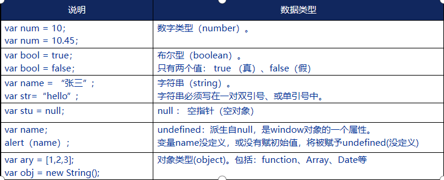

#### 2.2.2

JavaScript中可以表示“假”的值包括：false, 0, undefined, null, “”，其余为真值

虽然null和undefined都表示空，null表示变量的值为空，undefined表示变量未曾赋值

可以使用typeof运算符获取值的数据类型，得到字符串的类型名

typeof 值；

使用instanceof运算符判断对象的类型，得到布尔值

对象 instanceof 类名

字符串转换数字：parseInt()，parseFloat()

parseInt(字符串) ：将字符串转换成整数。

parseFloat(字符串) ：将字符串转换成浮点数。

#### 2.2.3

字符串转换成数字类型

parseInt() ：将字符串转换成整数。

parseFloat() ：将字符串转换成浮点数。

注意：parseInt(),parseFloat()：并非是单纯的字符串转换成数字。是从字符串的开始提取数字，如果碰到字符，那么停止提取，返回前面提取的数字。

parseInt(“10”); 结果：10

parseInt(“10px”); 结果：10

parseInt(“abc”); 结果：NaN

注意：NaN：非数字的意思，是not a number的缩写。NaN和任何数据进行运算结果仍然是NaN。因此，想要判断一个变量是不是NaN时，不能使用这种形式：a==NaN，而要使用isNaN(a);

#### 2.2.4 ES6中字符串的新特性

多行字符串

ES5及之前的版本中并不支持多行字符串，而HTML中总是存在多行内容的，为了解决复杂的拼接，在ES6中增加了对多行字符串的支持，使用反引号\` 包含

let info = \`\<p\>

hello

\</p\>\`

占位符

多行字符串中可以使用占位符解决无恼人的字符串拼接噩梦

let name = ‘张三’

let age = 20

let str = \`姓名：\${name}，年龄：\${age}\`

### 2.3运算符

#### 2.3.1 算术运算符

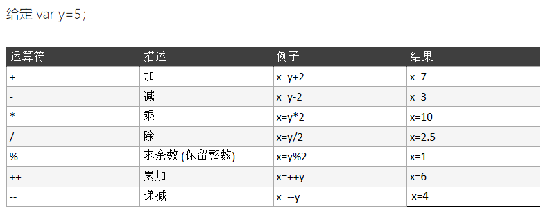

#### 2.3.2赋值运算符

#### 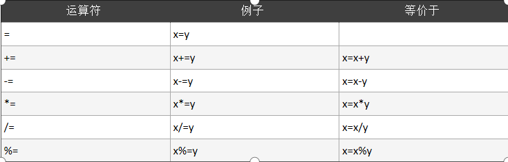

#### 2.3.3关系运算符

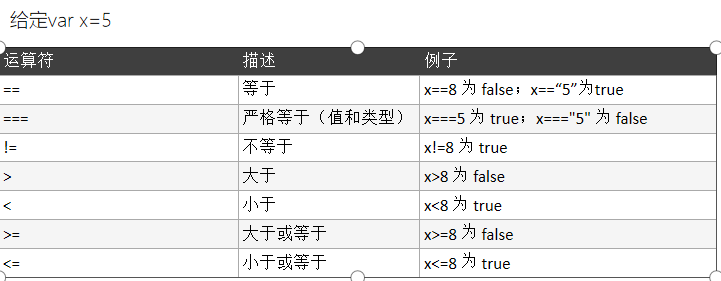

#### 2.3.4逻辑运算符

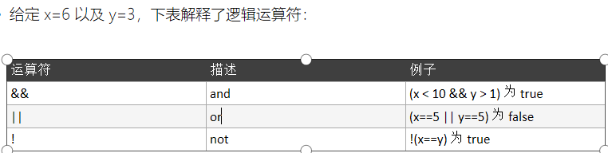

### 本节作业

1.  掌握JavaScript变量的定义及使用
2.  掌握JavaScript六种数据类型
3.  掌握JavaScript常用运算符分类及使用

## 第三节 程序结构

### 3.1分支结构

### 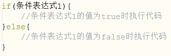3.1.1if结构

### 

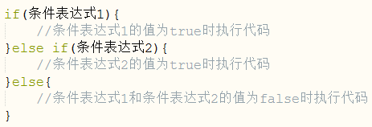

### 3.1.2switch…case结构

### 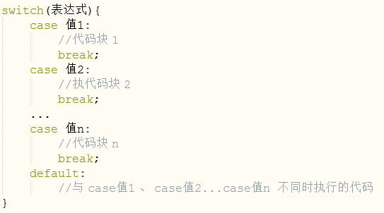

### 3.1.3

? : 三元运算符就相当于简化的if else 结构。

（条件表达式）? 第一个值 : 第二个值

var num = 1\<2?10:20;

document.write(num + "\<br\>");

运行结果：10

var sex = “1”;

document.write(sex==1?"男":"女");

运行结果：男

\|\|的另外一种用法

语法： 值1\|\|值2

如果值1为真，那么返回值1

如果值1为假，那么返回值2

var a = 0\|\|88;

document.write(a);

运行结果：88

var a = true\|\|88;

document.write(a);

运行结果：true

### 3.2循环结构

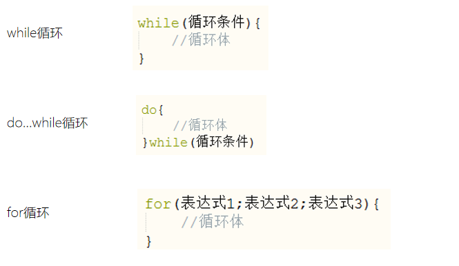

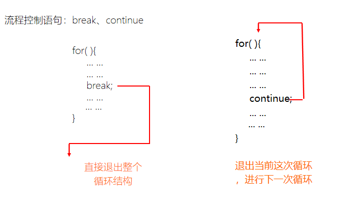

### 本节作业

1.  熟练掌握分支结构，并完成对应练习题
2.  熟练掌握循环结构，并完成对应练习题

## 第四节 页面编程基础

### 4.1函数声明

JS中的函数类似Java中的方法。就是封装好的一段代码，然后反复地重用这个代码。

声明函数语法：

function 函数名(参数){

//函数体;

}

function：定义函数的关键字；

“函数名”：自定义的一个名字；

“函数体”：要封装的代码，它可以完成某个特定的功能。

例如：

function sayHello( ){

document.write(“hello”);

}

JS的函数也可以带参数。在声明函数时可以定义形参列表，在调用函数时可以传递实参。

和Java定义形参列表时不指定数据类型，参数间用“逗号”间隔：

function sayHello( fromUser, toUser){

document.write(fromUser+’对’+toUser+’说你好’);

}

函数可以有返回值，通过return语句返回，

function max(num1, num2){

return num1\>num2?num1:num2;

}

注意函数的参数和返回值的语法和Java有很大不同，在后面的章节有详细的介绍

### 4.2函数的调用

Js中的函数调用有三种方式：

1-通过代码调用

function max(num1, num2){

return num1\>num2?num1:num2;

}

var maxNum = max(10, 20);

2-通过点击超链接调用

\<a href="javascript:clickMe()"\>点我\</a\>

3-通过触发事件调用函数

HTML 事件可以是浏览器行为，也可以是用户行为。如：HTML 页面完成加载、HTML 按钮被点击。首先你需要先定义一个事件处理函数，这个函数实现了特定的功能；然后需要进行事件绑定，即把指定事件的处理函数。当事件被触发时，绑定的处理函数将被调用。

事件的绑定：事件名=“处理函数()”

\<button onclick="clickMe()"\>点我\</button\>

注意：要注意函数名的大小写；括号中也可以传参

注：在后面的章节会详细的讲述js的事件，这里只介绍最常见的单击事件：onclick

### 4.3函数表达式（匿名函数）

在JS中所有函数都可以被看做和字符串等类似的程序中的值，既然是值，就可以用变量记录这个值，或者说可以把一个函数赋值给一个变量。而这个变量亦可以被看做一个函数。

function hello(){

//…

}

var fun = hello; //变量fun的值就是函数hello，fun可以被看做函数并调用

fun();

上述代码中fun和hello都是函数名，且是同一个函数的两个不同的名字。如果我们把函数的定义和赋值的代码合并，就形成了函数表达式，而“=”右侧不再有名字的函数则被称为匿名函数。

var fun = function(){

//…

}；

fun();

### 4.4函数的嵌套声明

函数的嵌套声明就是在函数内部声明的函数，也可以称为块级函数。

function outer(){

function inner(){//块级函数声明

…

}

}

块级函数虽然早在ES3中就被禁止，但是几乎所有的浏览器都支持这种写法，且支持度略有差异。而使用函数表达式进行嵌套声明则是一直被允许的，所以通常都会使用函数表达式声明函数

function outer(){

var inner = function(){//块级函数声明

…

}

}

### 4.5ES6中的块级变量

javascript 有两种变量范围：全局变量和局部变量。

全局变量：如果在任何函数定义之外声明了一个变量，则该变量为全局变量。

全局变量在整个持续范围内都可以访问和修改。

准确的说浏览器执行JS代码时会提供一个名为window的对象，而所有的全局变量和函数都是window对象的属性和方法

局部变量：如果在函数定义内声明了一个变量，则该变量为局部变量。

每次执行该函数时创建此局部变量，函数调用结束后，该变量被卸载；

局部变量不能被该函数外的任何事物访问，值为匿名函数的局部变量也是如此

ES6之前没有块级元素，即使在语句块中使用var声明的变量，其作用范围也不会被限定在语句块中

函数中使用var重复声明变量其实是同一个变量。

当JS执行之前，浏览器会对代码进行预解析，在这个过程中，浏览器对函数中的变量进行识别，并准备分派内存空间，但是并不会为其赋值，所以看上去，函数中的所有的变量的声明都被提前到了函数最开始的位置。

容易产生歧义的情况：

循环结束后，循环变量或循环体中声明的变量仍然存在

分支结构某一支路声明的变量在其他位置可以使用

ES6中使用”let”关键字声明变量：

let声明的变量不会被提升

在同一作用域下，let不能重复声明变量，且必须在使用前进行声明

在嵌套作用域下，let声明一个同名新变量，不会抛出错误

Let定义的全局变量不再是window对象的属性

ES6中使用“const”关键字声明常量：

const声明在同一作用域中定义一个已有变量时会出错

在嵌套作用域下，const声明一个同名新变量，不会抛出错误

常量一旦被赋值，就不可以再改变（类似其他语言常量）无论是否采用严格模式

const声明一个对象时，但是其属性值可以被更改

常量是块级的，意味着在声明它的语句块之外无法访问

### 4.6操作页面中的元素

Js中提供了一系列操作页面元素的API，可以实现对元素的查找、添加、移除等操作，在后面的章节中有详细的介绍。

通过元素的ID获取页面元素的方法：

var el = document.getElementById(tagId);

改变页面元素的属性值（注意区分属性的值是字符串类型还是布尔类型）：

元素对象.属性 = 新的属性值；

改变元素的文本内容：

元素对象.innerHTML = 新的文本内容；

事件的动态绑定

元素对象.事件名 = 匿名函数

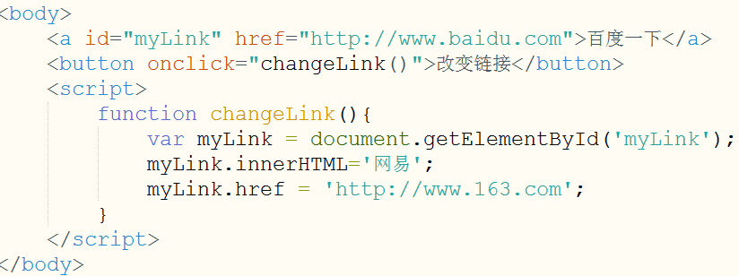

### 本节作业

1.  熟练掌握JavaScript函数相关问题，并完成对应练习页面
