# 第2天【JavaScript本地对象和内置对象】

## 主要内容

1.  Array
2.  Date
3.  Math
4.  JSON

## 

## 学习目标

| 节数             | 知识点 | 要求 |
|------------------|--------|------|
| 第一节（Array）  | Array  | 掌握 |
| 第二节（Date）   | Date   | 掌握 |
| 第三节（Math）   | Math   | 掌握 |
| 第四节（JSON）   | JSON   | 掌握 |

## 第一节Array

### 数组的定义

JavaScript提供了内置的Array类实现了数组，通长我们将本章要学习的Array、String、Date等JavaScript内置的类称为本地对象

创建数组对象时应注意：

创建数组类的对象使用“new”关键字

数组不需要在创建时指定数组的初始长度

数组创建后长度仍可以更改

创建数组时若指定了初始长度，此时每个元素的值为undefined

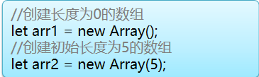

数组的长度使用length属性获取

创建数组时指定数组所有元素的值

通过参数传递数组元素

let arr3 = new Array(1, 3, 5, 7, 9)

通过字面量方式实现

let arr4 = [1, 3, 5, 7]

数组存储的数据可以是任何类型。

let arr5 = newArray('aaa',123,'ccc',false);

如果数组的元素是另外一个数组则构成了二维（甚至多维）数组，

### 关于数组下标

数组通过“下标”表示数组中元素的身份；下标是一个从0开始的连续的整数；通过下标可以对数组元素赋值或取值

语法结构：数组名[下标]；

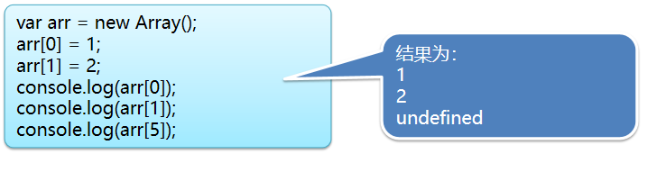

JavaScript数组在下标越界是并不会产生错误，

访问的下标越界时，如果是取值则因没有被赋值，其值为undefined，

如果是赋值，数组会自动扩容

### 遍历数组

数组的遍历建议使用最普通的for循环

let arr = new Array(1, 3, 5, 7, 9);

for(let i=0; i\<arr.length; i++){

console.log(arr[i]);

}

使用for...in遍历数组

不建议使用for...in是因为可能在数组下标枚举时，将对象的其他属性一起枚举出来

let arr = new Array(1, 3, 5, 7, 9);

//i是下标

for(let i in arr){

console.log(arr[i]);

}

### 数组的API

JavaScript的Array类中定义了一系列操的方法用于数组的操作

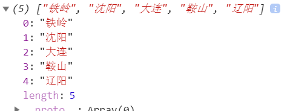实现数组首尾端元素的压入和弹出：

压入元素：push()、unshift ()

var city = new Array('沈阳','大连','鞍山');

city.push('辽阳');

city.unshift('铁岭');

console.log(city);

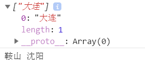弹出元素：pop () 、shift ()

var city = new Array('沈阳','大连','鞍山');

var first = city.pop();

var end = city.shift();

console.log(city);

console.log(first,end);

实现数组的反转：reverse();

var city = new Array('html','css','javascript','jquery','ajax');

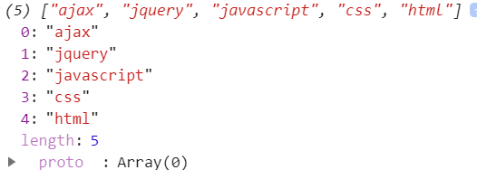city.reverse();

console.log(city);

实现数组合并：concat()

var arr1 = [1,2,3];

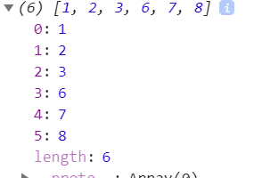var arr2 = [6,7,8];

var newArr = arr1.concat(arr2);

console.log(newArr);

将一组字符串拼接成一个新的字符串：join()

var city = new Array('沈阳','大连','鞍山');

var str = city.join('-\>');

console.log(str);

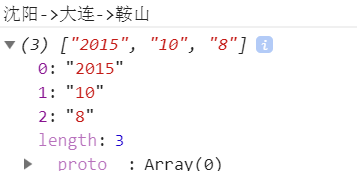

将一个字符串按照指定的拆分符拆分成字符数组

var str = '2015-10-8';

var arr = str.split('-');

console.log(arr);

Array类方法中实现插入、删除、替换功能的大神器： splice()

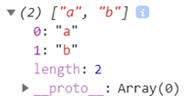从数组中间删除元素：splice(开始位置, 删除元素长度)

var arr = ['a','b','c','d','e'];

arr.splice (2,3);

console.log(arr);

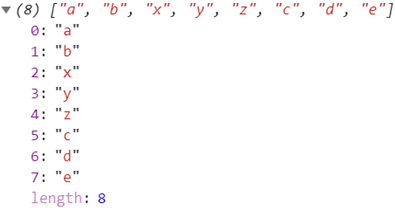在数组中间插入元素：

splice(开始位置, 0, 新插入元素…)

var arr = ['a','b','c','d','e'];

arr.splice(2,0,'x','y','z');

console.log(arr);

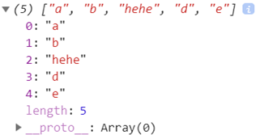替换数组中某个元素：splice(开始位置, 被替换元素长度, 新元素…)

var arr = ['a','b','c','d','e'];

arr.splice(2,1,'hehe');

console.log(arr);

截取数组： slice（）

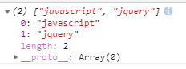从数组中间截取一个片段：slice(开始索引，结束索引)

let courseArr = new Array('html','css','javascript','jquery','ajax');

let arr = courseArr.slice(2,4);

从数组中某个索引开始截取到最后：slice(开始索引)

let courseArr = new Array('html','css','javascript','jquery','ajax');

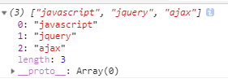let arr = courseArr.slice(2);

对数组进行排序：sort()

默认排序规则

var city = new Array('html','css','javascript','jquery','ajax');

city.sort();

console.log(city);

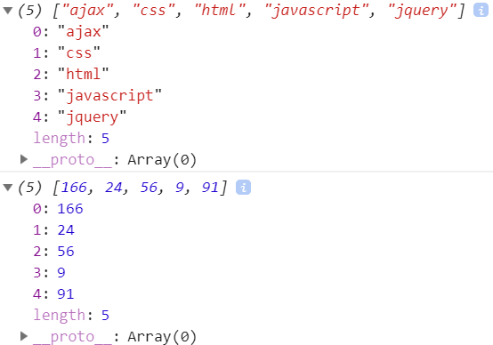var city = new Array(56,9,91,24,166);

city.sort();

console.log(city);

通过函数回调，自定义排序规则

var city = new Array(56,9,91,24,166);

city.sort(function(num1,num2){

return num1 - num2;

});

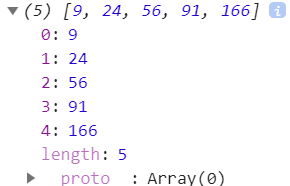console.log(city);

### 函数回调

函数指针：

函数表达式中变量存储匿名函数的内存地址称为函数指针，用函数指针可以调用该函数

let fun = function(){……} //fun保存的即使函数指针

fun();

函数回调：

将一个函数的指针通过参数传递给另一个函数（主调函数），并在主调函数中通过传入的函数指针调用该函数的过程；

就好像一个商场的问讯处（主调函数）确定的是，当有人前来问询（传入的函数指针）时解决他的疑问（调用指针指向的回调函数），但现在问讯处并不知道一会的问题是什么，而是当有人前来问询时（调用主调函数）才会将问题（回调函数）提交给问询处（传入回调函数）后，问讯处作答（真正调用回调函数）

如何实现函数回调：

定义主调函数

//定义主调函数fun

function fun(callback, value){

callback(value);

}

调用主调函数并传递回调函数

方法1：传递定义好的回调函数

//定义函数回调函数backFun

function backFun(info) {

alert(info)

}

//调用主调函数fun时，参数为已定义的函数

//注意backFun后面没有括号

fun(backFun,‘hello’);

方法2：传递匿名函数

//在调用主调函数fun时，参数为匿名函数

fun(function(info){

alert(info)

},'Hello');

函数回调的意义：

开发中先定义主调函数，调用主调函数是在定义回调函数

这样可以先确定我们要做一件事，但是暂时不知道这件事的细节，

函数回调的应用场景即为广泛，如：

定时器

事件监听

ajax

……

ES6增加了箭头函数，类似于其他语言的lambda

箭头函数声明示例：

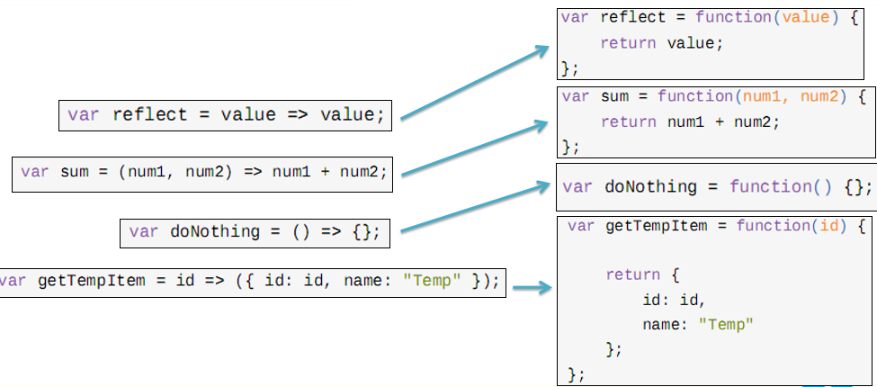

### 本节作业

1.  掌握数组定义及使用
2.  掌握常见的数组的API
3.  掌握函数回调

## 第二节 Date

### 2.1创建时间对象

Date对象的创建：

//创建当前时间的时间对象

let time1 = new Date();

//创建指定事件戳的时间对象

let time2 = new Date(时间戳)

创建指定时间的Date对象的2中方式：

创建对象时，通过参数传递时间戳

创建对象后，通过方法设定时间的年、月、日等值

主要根据服务端的接口设计决定采用哪种方式

### 2.2Date类常用API

Date类的常用方法见下表，另有setXxx方法可以实现时间的修改

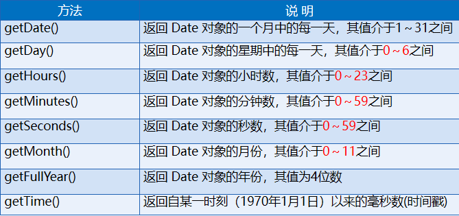

### 本节作业

1.  掌握如何创建时间对象
2.  掌握Date类常用API

## 第三节 Math

和本地对象不同，Math是JavaScript的内置对象（并不是一个类），程序开始执行时出现，不需要我们创建即可使用，下面是Math的常用方法

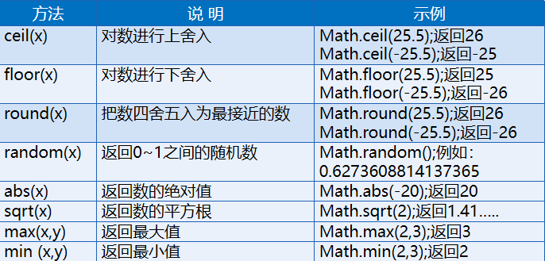

### 

### 

### 本节作业

1.  熟练掌握Math的常用方法

## 第四节 JSON

### 3.1 JSON数据格式概述

JSON是JavaScript Object Notation的缩写。是一种轻量级的数据交换形式，它基于ECMAScript的一个子集。

它是一种XML的替代方案，而且比XML更小，更快而且更易于解析。

JSON描述对象的时候使用的是JavaScript语法，它是语言和平台独立的。

JSON 数据的书写格式采用键-值对形式: { 键 : 值, 键 : 值, … }

var obj = {name:'张三' , age:25 , sex: '男' }

### 3.2 JSON的属性

两种方式可以访问或设置Json对象的属性。

使用“.”点操作符：json对象.属性

使用[ ]操作符：json对象[‘属性名’]

var obj = {name:'张三' , age:25 , sex: '男' };

console.log(obj.name);

console.log(obj['name']);

obj.age = undefined;

obj.sign = '风一样的男子'

console.log(obj);

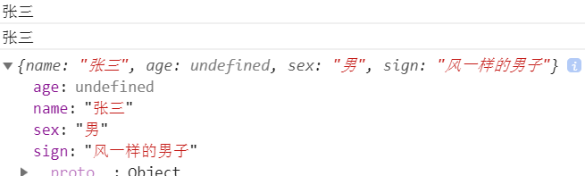

### 3.3 JSON和数组的组合

JSON和数组可以相互嵌套组成更复杂的数据，即数组元素可以是JSON对象，JSON对象的属性值也可以是数组，

备注视图里是一服务端返回的关于天气的JSON数据

下面是表示省市级联数据的片段

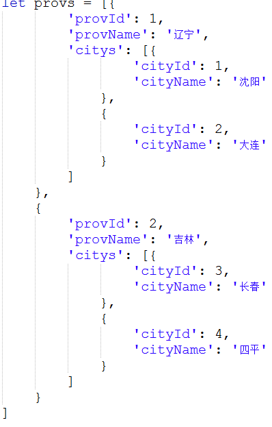

### 3.4 Json的解析和序列化

用JSON数据交互时，传输的数据往往是字符串类型的，这就需要JSON和字符串之间能够相互转换

从字符串解析JSON

使用eval函数，eval()不仅可以将字符串解析成JSON，也可以解析其他的JS代码，

let str = "{name:\\"张三\\" , age:25 , sex: \\"男\\" }"

let obj = eval('('+str+')');

使用parse函数，这种方式比较要求字符串中key也必须有引号包含，不支持IE

let str = "{\\"name\\":\\"张三\\" , \\"age\\":25 , \\"sex\\": \\"男\\" }"

let obj = JSON.parse(str);

JSON序列化成字符串

var obj = {name:'张三' , age:25 , sex: '男' };  
let str = JSON.stringify(obj)

### 本节作业

1.  熟练掌握JSON和数组的组合
2.  熟练掌握JSON的解析和序列化
