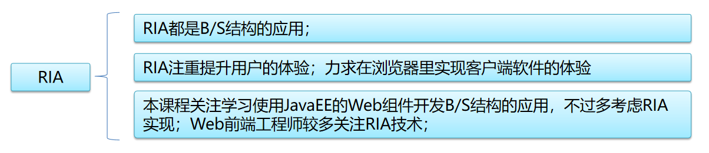

# 第3天【AJAX技术】

## 主要内容

1.  计算机网络基础
2.  网络协议概述
3.  基于Js的Ajax技术

## 学习目标

| 节数                       | 知识点           | 要求 |
|----------------------------|------------------|------|
| 第一节（计算机网络基础）   | 计算机网络基础   | 掌握 |
| 第二节（网络协议概述）     | 网络协议概述     | 掌握 |
| 第三节（基于Js的Ajax技术） | 基于Js的Ajax技术 | 掌握 |

## 第一节 计算机网络基础

### IP与网络分类

IP地址是IP协议提供的一种统一的地址格式，它为互联网上的每一个网络和每一台主机分配一个逻辑地址；

我们访问网站时输入的域名会被DNS服务器解析成IP地址后进行访问

为了确定网络区域，分开主机和路由器的每个接口，从而产生了若干个分离的网络岛，接口端连接了这些独立网络的端点。这些独立的网络岛叫做子网(subnet)；

网络中的每一个计算机都有一个IP地址，IP地址由四个数字表示，包括网络号和主机号两部分；例如172.16.1.101，其中172.16.1是网络号，也是常说的网段，101是主机号；网络号标识的就是Internet上的一个子网；只有在一个子网中计算机之间才能“直接”互通；

划分子网可以使得网络管理更为容易；

IP地址被分成了A、B、C、D、E五类，每个类别的网络标识和主机标识各有规则。线面是A、B、C类网的介绍，D（组播）、E（实验）属特殊用不区分网络标识和主机标识

### 1.2 网络端口

一台计算机上可以运行多个服务，服务用端口来区别；

一台计算机上可以有65536个端口，每个端口对应一个唯一的程序；

由于0-1024之间多被操作系统占用，所以实际编程时一般采用1024以后的端口号

一些常见的服务对应的端口：ftp：23，telnet：23，smtp：25，dns：53，http：80，https：443

如果说一个IP地址是一个电话号码，那么端口就是这个号码的若干个分机号；

如果说ＩＰ地址是一个房子的地址，那么端口就是这个房子的若干个门；

### 本节作业

1.  掌握IP与网络分类
2.  掌握网络端口概念

## 第二节 网络协议概述

### 2.1网络协议概述

网络通信协议：

计算机网络中实现通信必须有一些约定即通信协议，对速率、传输代码、代码结构、传输控制步骤、出错控制等制定标准。

网络通信结构：

为了使两个结点之间能进行对话，必须在它们之间建立通信工具(即接口)，使彼此之间 能进行信息交换。

接口包括两部分：

硬件装置：实现结点之间的信息传送

软件装置：规定双方进行通信的约定协议

OSI：开放系统互连（Open System Interconnection），采用分层的结构化技术。

分层的理由：

将网络简化；

模块化的设计网络

OSI参考模型（OSI/RM，Open System Interconnection/Reference Model）共分为7层，最高层为用户层，最底层为物理层。

### 2.2 TCP协议和UDP协议

#### 2.2.1

TCP/IP协议栈包含了一系列构成互联网基础的网络协议；

TCP（传输控制协议）:Transmission Control Protocol ，是一种面向连接的、可靠的、基于字节流的传输层通信协议；

UDP（用户数据报协议）：User Datagram Protocol，用于处理数据包，是一种无连接的、不可靠的通信协议；

IP（网络协议）：Internet Protocol，把数据从源传送到目的地。它不负责保证传送可靠性，流控制，包顺序等。

ICMP（网络控制报文协议）：Internet Control Message Protocol，是TCP/IP协议栈的一个子协议，用于在IP主机、路由器之间传递控制消息。

#### 

#### 2.2.2

TCP是面向连接的协议，在正式收发数据前，必须和对方建立可靠的连接，所以速度会慢；UDP是面向无连接的协议，不与对方建立连接，而是直接就发送数据包，相对速度快；

TCP提供IP环境下的数据可靠传输，保证数据无差错的、按照顺序的进行传输；UDP的传输是不可靠的，不保证数据正确，不保证顺序等，也可能丢包；

TCP使用字节流模式发送数据，UDP使用数据报模式;

TCP适用对可靠性要求高的应用环境；UDP适用于一次只传送少量数据、对可靠性要求不高的应用环境；

#### 2.2.3 TCP和IP协议处在OSI参考模型中的层次

#### 2.2.4

TCP/IP是Internet上不同系统之间互联的一组协议。它为分散和不同类型的硬件提供了一个通用的编程接口。TCP/IP 协议使Internet尽可能成为一个分散、无序的网络。

TCP/IP通常被看成一个4层模型：应用层、传输层、网络层以及数据链路层+物理层。

### 2.3 HTTP协议

#### 2.3.1

TCP/IP协议栈包含了一系列构成互联网基础的网络协议；

IGMP（网际组报文协议）：Internet Group Management Protocol，是一个组播协议，运行在主机和组播路由器之间。

ARP（地址解析协议）：Address Resolution Protocol，根据IP地址获取物理地址的协议。

HTTP（超文本传输协议）：HyperText Transfer Protocol，是用于从WWW服务器传输超文本到本地浏览器的传输协议。它可以使浏览器更加高效，使网络传输减少。

FTP（文件传输协议）：File Transfer Protocol，用于Internet上的控制文件的双向传输。

#### 2.3.2

HTTP协议（HyperText Transfer Protocol，超文本传输协议）是用于从WWW服务器传输超文本到本地浏览器的传输协议；

1960年美国人Ted Nelson构思了一种通过计算机处理文本信息的方法，并称之为超文本（hypertext）,这成为了HTTP超文本传输协议标准架构的发展根基

设计HTTP最初的目的是为了提供一种发布和接收HTML页面的方法；

HTTP协议是互联网上使用最广泛的一种协议；

#### 2.3.3 HTTP协议采用了请求/响应模型

由HTTP客户端发起一个请求，建立一个到服务器指定端口（默认是80端口）的连接；HTTP服务器则在相应端口监听客户端发送过来的请求；一旦收到请求，服务器将进行处理后向客户端发回一个状态行，比如“HTTP/1.1 200 OK”，以及响应的消息，消息的消息体可能是请求的文件、错误消息、或者在浏览器中其它一些信息。

### 2.4 HTTP报文结构

HTTP请求信息由请求行、请求头部、空行和请求数据四个部分组成；

HTTP响应也由四个部分组成，分别是：状态行、响应头部、空行、响应正文

### 

请求行：依次包含请求类型，URL，协议版本3个部分，用空格间隔。

请求头：HTTP协议定义了一系列的请求属性，如：

Accept：浏览器可接受的MIME类型。

Accept - Charset：浏览器可接受的字符集。

Accept - Encoding：浏览器能够进行解码的数据编码方式，比如gzip。

Accept - Language：浏览器所希望的语言种类，当服务器能够提供一种以上的语言版本时要用到。

Connection：表示是否需要持久连接。

Content - Length：表示请求消息正文的长度。

User - Agent：浏览器类型等信息；

请求数据：在POST提交方式时存在，是提交给服务端的数据

状态行：依次为协议版本、状态码、状态名，用空格间隔

响应头：HTTP协议定义了一系列的响应属性，部分如下：

Content-Base：解析主体中的相对URL时使用的基础URL；

Content-Language：WEB 服务器告诉浏览器理解主体时最适宜使用的自然语言；

Content-Location：资源实际所处的位置；

Content-Type：WEB 服务器告诉浏览器自己响应的对象的类型。例如：Content-Type：application/xml；

Last-Modified：WEB服务器认为对象的最后修改时间，比如文件的最后修改时间，动态页面的最后产生时间等；

响应正文：服务端返回的数据，通常为JSON字符串或二进制内容

### 本节作业

1.  掌握TCP协议和UDP协议特点
2.  掌握HTTP报文结构

## 第三节 基于Js的Ajax技术

### 3.1 C/S、B/S与RIA

说起网络应用，可以分为C/S和B/S两种；

C/S结构是Client/Server（客户机/服务器）的简称，桌面应用程序采用的多是这种结构；

B/S结构是Browser/Server（浏览器/服务器）的简称，特点是客户端无需安装特定的软件，只需要安装一个浏览器就可以与系统进行交互。

C/S需要安装客户端软件，但是操作往往更为便捷；B/S不需要安装客户端软件，但是用户体验往往不如C/S好，安全性也较C/S要低；

RIA是“Rich Internet Applications”的缩写，意为“富客户端网络应用”；

RIA的主要目标：基于B/S结构，只要有浏览器就可以使用，在浏览器里实现与客户端软件类似的体验；例如：可以局部刷新、可以拖拽等；

### 3.2 Ajax技术概述

Ajax出现以前传统B/S程序是什么样子？

浏览器只负责程序界面（HTML）的搭建，界面的内容完全有服务端技术生成。

在浏览器中通过访问指定的URL或表单提交、超链接等方式发起Http请求；

服务端接受请求，执行相应的业务处理代码，根据处理结果生成的完整的HTML页面（包括CSS和JS）并将页面代码置于响应内容中。返还给浏览器；

浏览器获取并渲染响应内容中的HTML代码。

页面不能局部更新，当需要改变页面内容时，必须重新发送请求并得到新的页面，造成用户体验极差。

Ajax 即“Asynchronous Javascript And XML”（异步 JavaScript 和 XML），是指一种创建交互式网页应用的网页开发技术。

Ajax 是一种用于创建快速动态网页的技术。

Ajax 是一种在无需重新加载整个网页的情况下，能够更新部分网页的技术。通过与服务器进行少量数据交换，Ajax 可以使网页实现异步的数据提交和获取，并通过JavaScript技术对网页的某部分进行更新。

优点：

Web应用的多任务（异步提交而非同步提交）

只从服务端获取数据而非整个页面，减少传输量，使多端开发更容易

无需刷新页面向服务器传输或读写数据，提升用户体验

即时显示，不间断的交互流程，用户体验极佳

接近桌面应用的直接、高可用、更丰富、更动态的Web用户界面

缺点：

前进、后退的功能被破坏，因为Ajax永远在当前页，不会记录前后页面（在学习框架时通过配置前端路由解决这个问题）；

搜索引擎的支持度不够，因为目前搜索引擎爬虫还不能理解JS引起变化数据的内容；

XMLHttpRequest是 Ajax 应用程序的核心，它是一个 JavaScript 对象 。

Ajax 就是把JavaScript技术和 XMLHttpRequest对象放在 Web 请求和服务器之间。当客户端发出请求时，请求数据发送给XMLHttpRequest而不是 直接发送给服务器。而且请求是异步发送的。  
然后，服务器将数据返回XMLHttpRequest，它决定如何处理这些数据。它可以迅速更新表单数据，而不需要刷新页面，这就是 XMLHttpRequest 的强大之处。

### 3.3 使用Ajax访问服务

使用XMLHttpRequest异步调用后台服务的基本步骤：

1、创建AJAX核心对象：XMLHttpRequest。

2、指定响应处理事件onreadystatechange的回调函数

3、调用open方法与服务器建立请求连接。

该方法有五个参数：

request-type：发送请求的类型。典型的值是GET或POST，但也可以发送HEAD请求（只请求页面头部）。

url：要连接的 URL。

asynch（异步 ）：如果希望使用异步连接则为 true，否则为 false。该参数是可选的，默认为 true。

username：如果需要身份验证，则可在此指定用户名。该可选参数没有默认值。

password：如果需要身份验证，则可在此指定口令。该可选参数没有默认值。

通常使用其中的前三个参数。事实上，即使需要异步连接，也应该指定第三个参数为 “true”。这是默认值，但坚持明确指定请求是异步的还是同步的更容易理解。

4、调用send方法向服务器发送请求。

5、readystate属性值改变时触发onreadystatechange事件，调用绑定的回调函数（事件会触发多次）

readyState属性代表了 XMLHttpRequest对象的五种状态 ：

0：请求没有发出（在调用 open() 之前）。

1：请求已经建立但还没有发出（调用 send() 之前）。

2：请求已经发出正在处理之中（这里通常可以从响应得到内容头部）。

3：请求已经处理，响应中通常有部分数据可用，但是服务器还没有完成响应。

4：响应已完成，可以访问服务器响应并使用它。

status属性表示响应报文中的状态码

responseText 属性为报文中的响应内容

### 3.4 Ajax的数据提交和响应

响应数据的获取

xhr对象的responseText属性为响应数据，该属性为字符串类型，需要在使用前进行解析

xhr.onreadystatechange = function(){

if(xhr.readyState==4){

if(xhr.status == 200){

//let res = eval('('+xhr.responseText+')')

let res = JSON.parse(xhr.responseText);

}

}

}

#### 3.4.1

发送ajax请求时可以提交的数据主要包括下面3种，实际开发时按照约定好的请求数据格式进行提交。

请求参数：

最传统的提交数据形式，只能提交文本

FormData

XHR2技术中增加的新技术，可以文本和二进制数据混合提交

JSON

格式最灵活的提交方式，多应用于App，需要服务端特殊处理

#### 3.4.2

1-请求参数：参数名=参数值&参数名=参数值……

请求参数存在于请求行的URL中 url地址?请求参数列表

优点：

GET提交方式时没有请求数据部分，只能通过请求参数提交数据；

请求参数提交的数据，在分享链接时任然有效；

缺点：

收到URL有255个字符长度和字符集的限制；

数据是公开的，缺少私密性

只能提交文本数据，不能提交文件等二进制数据

请求参数存在于请求数据中，此时提交方式必须是POST方式

缺点：使用JS拼接请求参数复杂，文本数据和文件等二进制数据不能同时提交

#### 3.4.3

提交请求参数

GET提交时

xhr.open("Post","http://localhost:8088/ajaxServer/testParam.action?loginId=abc&loginPwd=123",true);

xhr.send();

POST提交时

xhr.open("Post","http://localhost:8088/ajaxServer/testParam.action",true);

//POST提交时需添加请求头“Content-Type”，指定MIME类型

xhr.setRequestHeader("Content-Type","application/x-www-form-urlencoded;charset=UTF-8");

xhr.send('loginId=abc&loginPwd=123');

#### 3.4.4

2-Formdata：

在XHR2中增加了formdata数据提交方式；其只能存在于请求数据中

formdata可以提交表单，省去了麻烦的字符串拼接过程

formdata还可以提交图片等二进制数据

formdata格式数据只能存在于请求数据中，即只能POST提交

创建FormData对象

创建一个“空”的FormData对象

let fd = new FormData();

创建一个指定表单的FormData对象

let form = document.getElementById('formId');

let fd = new FormData(form);

#### 3.4.5

FormData其他常用方法

FormData中的数据以键值对的形式保存，通常表单元素的name属性为键、value为值

可以通过相应的方法操作已创建的FormData对象

#### 3.4.6 JSON

将JSON对象序列化成字符串后提交，

注意要修改请求头，指定MIME类型为“application/json”

xhr.open("Post","http://localhost:8088/ajaxServer/testJson.action",true);

xhr.setRequestHeader("Content-Type","application/json;charset=UTF-8");

xhr.send(JSON.stringify(obj));

### 3.5 关于跨域问题

浏览器的同源策略

同源策略，它是由Netscape提出的一个著名的安全策略;现在所有支持Ajax的浏览器都会使用这个策略;所谓同源是指域相同，即协议、IP、端口都相同。

同源策略是浏览器的行为，是为了保护本地数据不被Ajax代码获取回来的数据污染，因此拦截的是客户端发出的请求回来的数据接收，即请求发送了，服务器响应了，但浏览器拒绝接收和处理。

什么是跨域？

当我们试图通过Ajax访问不同源的服务端获取数据时，即产生“跨域”问题。这时浏览器会拒绝接受服务器的响应

注意：移动端浏览器不存在现跨域问题

如何解决跨域问题？

XHR2出现以前使用jsonp的方式解决跨域，但是有较大限制

由于使用Ajax技术获取服务端的JS代码不受同源策略影响。早期的跨域解决方案采取了一种变通的方法，服务端返回一个JS函数，函数的返回值是真正要返回的数据，客服端获取这个函数执行后得到返回值。

因为从服务端获取的是JS代码，故而请求类型只能是GET

服务端无法通过既有手段识别用户身份，无法进行权限控制

XHR2可以通过服务端增加响应头信息解决跨域问题

XMLHttpRequest2技术可以让浏览器接收到服务端响应时，检查一个叫做“Access-Control-Allow-Origin”的响应头，如果其值和发送Http请求的位置同源则访问被允许，否则访问被拒绝。

若想服务端能区别客户端身份，需要设置xhr对象的withCredentials属性为true，具体原理在JavaEE课程部分说明

......

xhr.withCredentials = true;

xhr.send();

### 本节作业

1.  熟练使用Ajax访问服务，并完成对应练习
