# 第4天【BOM和DOM模型】

## 主要内容

1.  BOM模型基础
2.  DOM模型基础
3.  高级DOM操作

## 学习目标

| 节数                   | 知识点      | 要求 |
|------------------------|-------------|------|
| 第一节（BOM模型基础）  | BOM模型基础 | 掌握 |
| 第二节（DOM模型基础）  | DOM模型基础 | 掌握 |
| 第三节（高级DOM操作）  | 高级DOM操作 | 掌握 |

## 第一节BOM模型基础

### BOM和DOM模型

浏览器对象模型BOM（Browser Object Model）：

提供了独立于内容的、可以与浏览器窗口进行互动的对象结构。

文档对象模型DOM（Document Object Model）：

定义访问和处理HTML文档的标准方法。DOM 将HTML文档呈现为带有元素、属性和文本的树结构（节点树）。

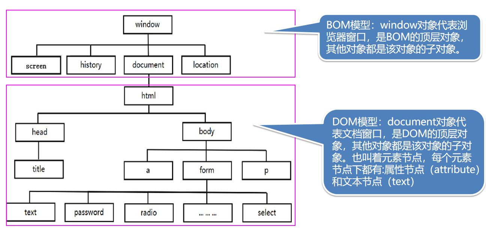

### 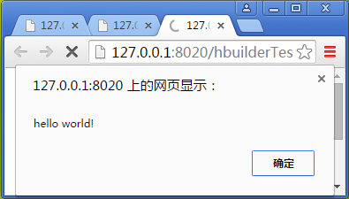1.2 JS的提示框

带确定按钮的提示框

alert(' hello world! ');

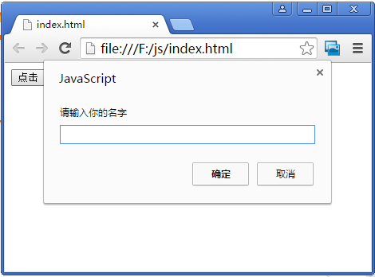

带确定输入框的提示框

//返回值是在文本框中输入的内容

var name = prompt('请输入你的名字')

带确定取消的提示框

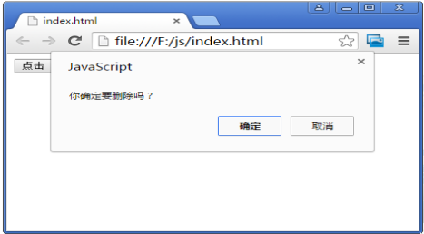//返回值为boolean类型，点击确定按钮返回true，点击取消或点x关闭返回false

var isDel= confirm('你确定要删除吗？');

在真实的开发中很难看到提示框被应用，主要原因为：

无法美化，难以和页面主体风格统一

无法改变，不能自定义提示框的内容结构

阻塞线程，阻塞页面中JS代码

通长使用模态框替代原生的提示框，并封装成插件或组件，便于重复使用

### 1.3 浏览器窗口的打开和关闭

使用window对象的open()打开一个新的窗口

//zai当前浏览器窗口下打开一个新的页卡，参数为新页面的url

window.open('http://www.baidu.com');

//打开一个新的浏览器窗口，默认不显示菜单栏、工具栏和状态栏

window.open('http://www.baidu.com','_blank','top=100,left=100,width=300,height=200');

使用window对象的close()关闭窗口

var baidu = window.open('http://www.baidu.com');

……

if(baidu){

baidu.close(); //关闭百度窗口，注意保证窗口对象的作用域

}

window.close；//关闭当前窗口

### 1.4 JS的计时器

早期的JS版本不支持线程，也不支持异步开发。而是提供了一套定时器机制，得到类似线程的简单异步模拟。

计时器分为两种：

Timeout：1次调用；用于在指定时间后调用制定的函数1次，也可以通过类似递归的方式实现对函数的反复调用

Interval：多次调用；用于每间隔指定时间就调用函数1次。

注意：时间单位为毫秒

计时器的代码实现：

//1秒中后弹出消息hello

window.setTimeout(function(){

alert('hello')

}, 1000)

//每隔1秒中后弹出消息hello

window.setInterval(function(){

alert('hello')

}, 1000)

setTimeout和setInterval函数的第一个参数：

通常使用匿名函数或是一个指向函数的变量

//参数为匿名函数

window.setTimeout(function(){

alert('hello')

}, 1000)

let fun = function(){

alert('hello')

}

window.setTimeout(fun, 1000)

可以是字符串：“函数名()”,这个函数必须是全局函数，不推荐

var fun = function(){

alert('hello')

}

window.setTimeout('fun()', 1000);

结束已经开启的计时器

setTimeout和setInterval函数的返回值表示该计时器对象，并使用clear方法可以结束指定的计时器

let timer = setInterval(function(){

alert('hello')

}, 2000)；

……

clearInterval(timer);//结束计时器timer

使用setTimeout实现多次调用函数

var fun = function(){

console.log('hello')

setTimeout(fun, 1000)//形成类似递归的效果

}

fun()

### 1.5 eval()函数

解析字符串：把一段字符串传递给JS解释器，由Javascript解释器将这段字符串解释成Javascript代码，并且执行这段Javascript代码。

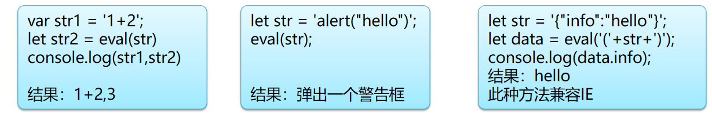

注意：该方法只接受原始类型字符串作为参数，如果是String对象，那么该方法将不作任何改变地返回。

### 1.6 screen/screenLeft/screenTop

screen属性可以得到显示设备的物理尺寸，在移动端可以通过screen对象的width属性获取屏幕宽度，计算并改变html字号，实现rem布局。

(window.onresize = function() {

let width = window.innerWidth;

//手机水平像素为1080px时html的fontSize为54px

document.documentElement.style.fontSize = width / 20 + 'px';

})();

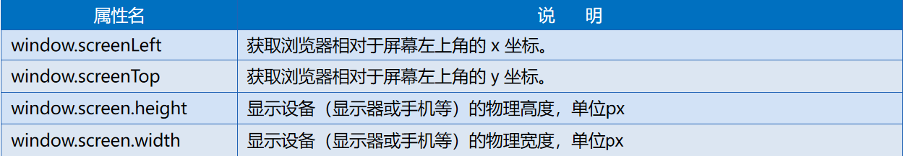

### 1.7 history属性

history对象记录了用户曾经浏览过的页面(URL)，并实现浏览器前进与后退相似导航的功能。

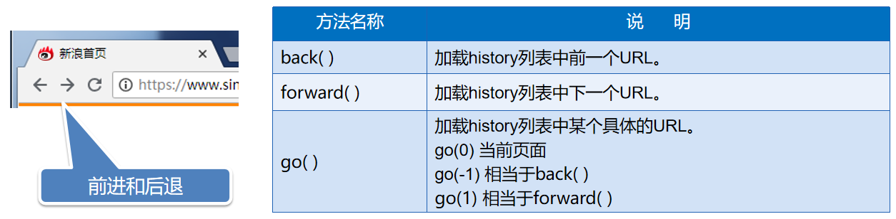

注意：由Ajax引起的页面变化并不会改变URL，因此无法回退；这也是Ajax技术实现动态页面的主要缺点之一，我们在将来学习前端框架时，通过路由的虚拟路径来解决这一问题

### 1.8 location属性

location用于获取或设置URL，并且可以用于解析URL。

location对象就是URL。

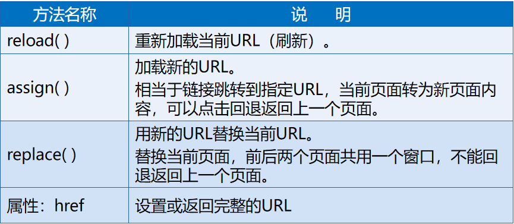

### 1.9 BOM模型常用方法总结

### 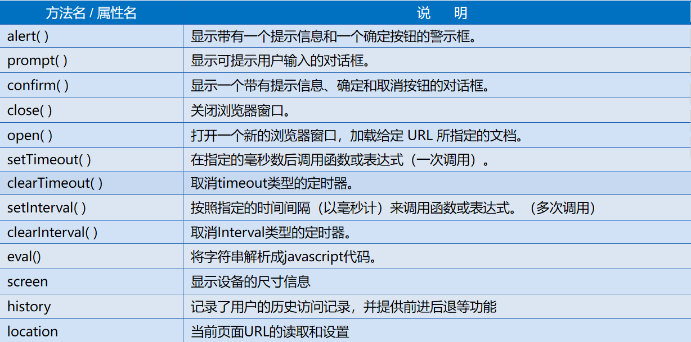

### 

### 本节作业

1.  掌握BOM模型常用方法，并完成练习示例

## 第二节 DOM模型基础

### 2.1获取页面中的DOM元素

JS中可以通过document对象的一组方法，按照HTML元素的id值、name值、标记名或使用的类样式来获得指定的（一组）DOM元素。

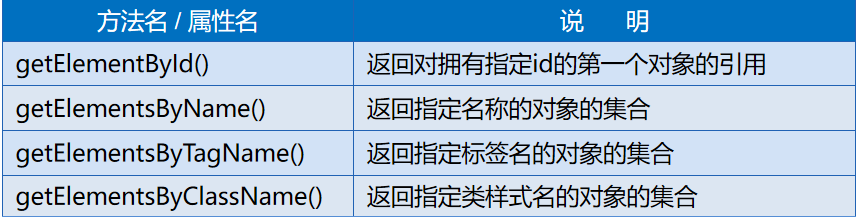

其中除了getElementById（）返回特定的DOM元素，其他3个方法都返回包含对应DOM元素的数组。

使用document对象的方法获得DOM对象

注意：Js要在DOM加载后执行，否则会得到undefined

\<ul\>

\<li id="myLi" class="list"\>aaa\</li\>

\<li class="list"\>bbb\</li\>

\<li\>ccc\</li\>

\</ul\>

\<input type="text" name="loginId" id="loginId" value="" /\>

\<script type="text/javascript"\>

let li = document.getElementById('myLi');

let lis1 = document.getElementsByClassName('list');

let lis2 = document.getElementsByTagName('li');

let loginId = document.getElementsByName('loginId');

console.log(li, lis1, lis2, loginId);

\</script\>

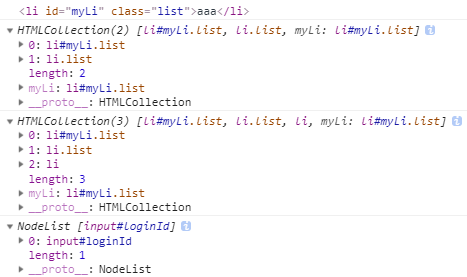

### 2.2读取和改变DOM的标记内容

innerHTML属性和innerText属性

这两个属性都可以读取和修改DOM对象指向的HTML标记的标记内容，

区别是innerHTML可以识别标记体重的HTML标记，而innerText不能识别

\<a href="" id="link1"\>\</a\>

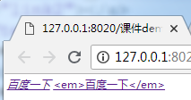\<a href="" id="link2"\>\<strong\>hello\</strong\>\</a\>

\<script type="text/javascript"\>

let link1 = document.getElementById('link1');

link1.innerHTML = '\<em\>百度一下\</em\>';

let link2 = document.getElementById('link2');

link2.innerText = '\<em\>百度一下\</em\>';

\</script\>

### 2.3读取和改变DOM的属性

DOM对象的HTML标记属性（attribute）

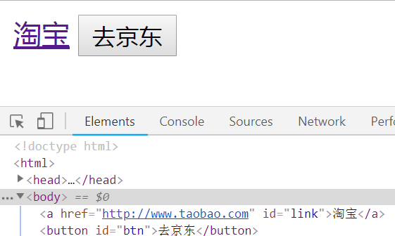展开DOM对象会发现，其中会包含器对应的HTML标记的属性，我们可以通过JavaScript获取、改变这些属性的值。例如：

\<a\>的href属性

\中的src属性、width属性

\<input\>中的value属性

\<a href="http://www.taobao.com" id="link"\>淘宝\</a\>

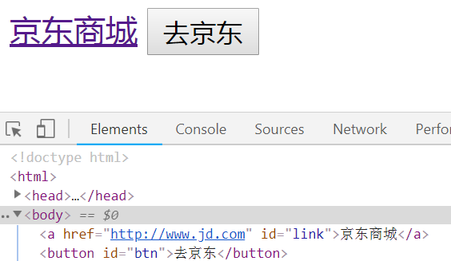\<button id="btn"\>去京东\</button\>

\<script type="text/javascript"\>

let link = document.getElementById('link');

let btn = document.getElementById('btn')

btn.onclick = function(){

link.innerHTML = '京东商城';

link.href = 'http://www.jd.com';

}

\</script\>

### 2.4读取和改变DOM的样式

JS只能读取和改变DOM的行内样式中的样式属性值：

修改样式会自动在行内样式中增加一条样式属性

如果行内样式中没有对应样式属性，则读取的属性值为空字符

操作样式属性时使用DOM对象的style属性

css中的样式属性用 – 间隔单词，而JS中对应样式名采用驼峰命名规则；

读取的样式属性值一定是string类型，且包含单位如px

写入的样式属性值一定要包含单位

let dom = document.getElementById('id')

dom.style.display = 'none'//隐藏对象

dom.style.fontSize = '20px' //改变字号

操作DOM的类样式，就是操作class属性

dom对象.class = 'active' //改变类样式.active

### 2.5 元素尺寸属性

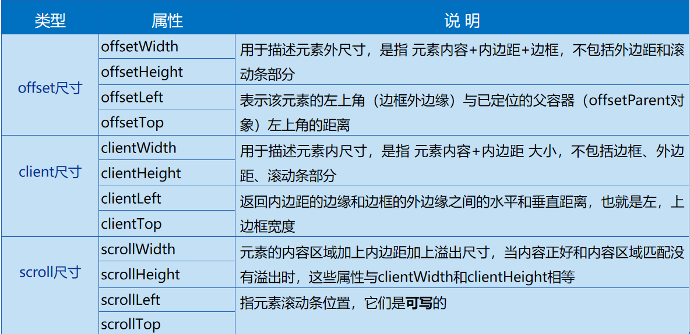

### 本节作业

1.  掌握如何获取页面中的DOM元素
2.  掌握如何读取和改变DOM的标记内容，属性，样式

## 第三节 高级DOM操作

### 3.1 DOM节点

### 3.1.1

在DOM中，每个部分都是节点,文档本身、所有元素、属性、元素内的文本都是节点。节点共被分为12种类型，每种类型都有相应的nodeType值（1-12）

元素节点（Element ）： nodeType值为 1，表示页面的元素

属性节点（Attr）：nodeType值为2，表示属性

文本节点（Text）： nodeType值为 3，表示元素或属性的文本内容

文档节点（Document）： nodeType值为 9，特指document对象

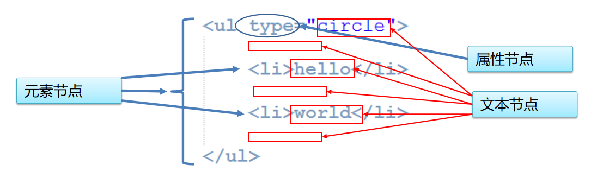

### 3.1.2

当前节点的名称属性：nodeName

元素节点的 nodeName 与标签名相同

属性节点的 nodeName 是属性的名称

文本节点的 nodeName 永远是 \#text

当前节点的值：nodeValue。

元素节点的 nodeValue 是 undefined 或 null

文本节点的 nodeValue 是文本自身

属性节点的 nodeValue 是属性的值

### 3.1.3

用元素节点操作自己的属性节点：

获取：getAttribute(属性名);

设置：setAttribute(属性名,值);

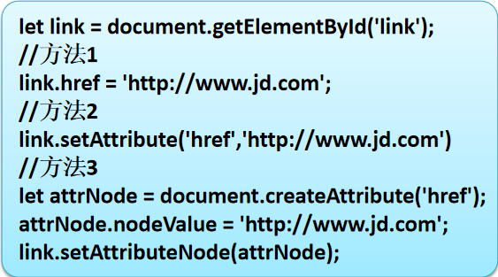设置：setAttributeNode(属性节点对象)

删除：removeAttribute(属性名);

使用document创建属性节点：

createAttribute(节点名)

操作属性节点主要有3种方式：

方法1操作的必须是HTML允许的属性

方法2、方法3可以操作自定义的属性

方法3的重用性最好

### 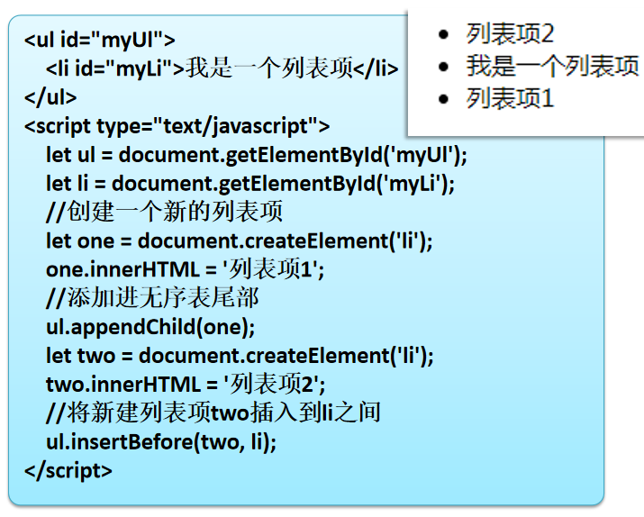3.2 DOM节点的增、删、改

创建元素节点

createElement('标记名')

在父元素中末尾添加新的子节点

appendChild('子节点')

在父元素中的指定节点前插入一个新的节点

要确保目标节点存在

insertBefore('子节点','目标子节点')

删除指定父元素子节点

removeChild(被删除节点)

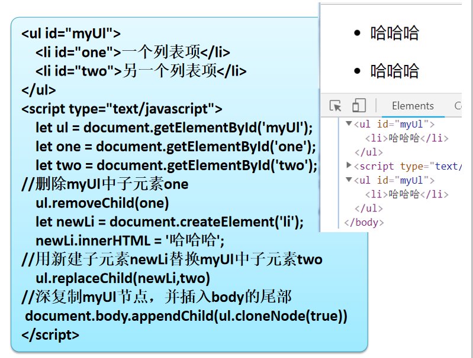替换指定父元素子节点

replaceChild(新节点，被替换节点)

清空父元素中所有子节点

innerHTML = ''

节点的复制

true为深复制，false为浅复制

cloneNode(isDeepClone)

### 3.3 DOM节点的获取（高级）

在实际开发中不可能为每一个元素节点指定id，对于元素节点的获取并不能简单的依赖于4个getElement方法，我们需要更复杂的节点获取方式

在获取父元素后，获取其所有子节点，遍历这些子节点，找到目标节点，例如对指定的无序表中所有的列表项进行操作

children属性：得到包含该节点所有元素子节点（不包含文本节点）的数组

childNodes属性：得到包含指定节点下包括文本节点等其他节点类型在内的所有子节点的数组

firstElementChild：获取当前元素下首个元素子节点。

lastElementChild：获取当前元素下最后一个元素子节点。

已经获取节点，需要获取其父节点，

parentNode：得到指定节点的直接父节点。

offsetParent：得到指定节点的有定位的父节点。

已经获取节点，需要获取其前后的兄弟节点

nextElementSibling：获取当前元素的后一个同级元素节点

previousElementSibling：获取当前元素的前一个同级元素节点

获取DOM节点的属性总结

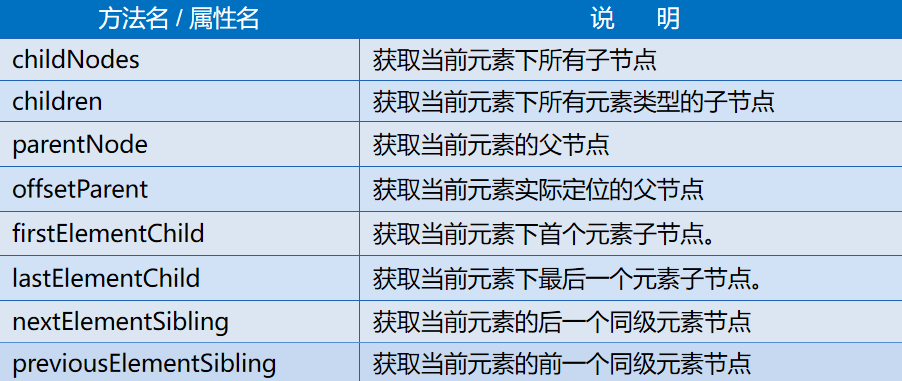

### 3.4 referrer与防盗链

什么是盗链：

盗链简单地可以理解成别人偷偷盗用了访问自己资源的链接。盗链比较常见的就是一些小网站盗用大的网站的资源（页面、图片、视频、音乐等），将这些资源的地址直接放在自己的页面上，使得自己的用户可以自己通过自己的网站访问到并不在自己服务器上的内容。

为什么要防盗链：

保护隐私，比如网盘上的资源不被非法引用

权限控制，比如必须是会员才能访问的小说章节或音视频

限制引入方式，比如必须通过特定的页面访问资源

防盗链主要方式：

判断引用地址(referrer)、验证用户登录权限、使用post请求方式、使用验证码等

使用referrer判定地址引用

当浏览器向服务器发送http请求的时候，请求头中包含了referrer用于告诉服务器这个请求是来自哪里的，服务端可以借助这个字段进行防盗处理。服务端可以获取到请求中的referrer，如果请求来源不是本站则进行阻止等行为。

如果Http请求头中不包含referrer，也就是通过浏览器地址栏直接访问该资源URL，服务端也要阻止这次访问行为。

在JavaScript中获取referrer信息：document.referrer

可以简单判断当前页面的referrer是否正确

### 本节作业

1.  熟练掌握DOM节点的增、删、改
2.  熟练掌握DOM节点的高级获取
