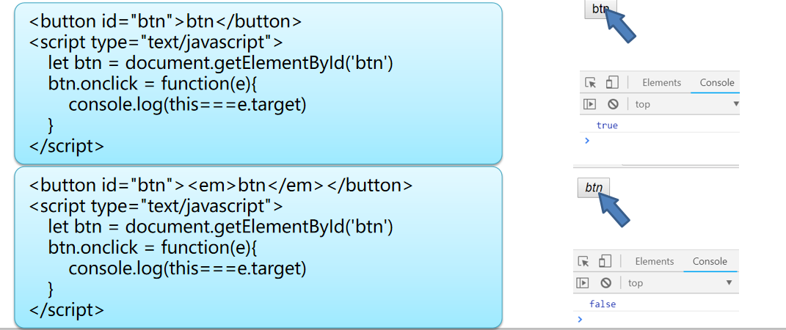

# 第5天【JavaScript的事件】

## 主要内容

1.  JavaScript的常用事件
2.  JavaScript事件传播机制
3.  基于HTML5的绘画技术
4.  HTML5中的多媒体

## 学习目标

| 节数                             | 知识点                 | 要求 |
|----------------------------------|------------------------|------|
| 第一节（JavaScript的常用事件）   | JavaScript的常用事件   | 掌握 |
| 第二节（JavaScript事件传播机制） | JavaScript事件传播机制 | 掌握 |
| 第三节（基于HTML5的绘画技术）    | 基于HTML5的绘画技术    | 掌握 |
| 第四节（HTML5中的多媒体）        | HTML5中的多媒体        | 掌握 |

## 第一节JavaScript的常用事件

### 事件源和事件对象

#### 1.1.1

事件源：

发生事件的对象，通常为一个页面中的元素

例如：

点击按钮，这个按钮即为事件源

图片加载完毕，图片对象为事件源

事件对象：

每一次事件触发，浏览器都会生成一个对象，表述事件相关的信息（例如：鼠标坐标、键盘按键、事件源等），也被称为事件对象或event对象

#### 1.1.2

获取事件对象：

在事件出发时，浏览器会在调用函数时将事件对象作为实参

dom.onclick = function(e){}

window对象的event属性

dom.onclick = function(){

window.event;

}

注意：两者在兼容性方面存在差异，其中老版本的IE浏览器不能通过参数传递事件对象；而firefox在BOM中没有提供event属性。实际开发应考虑到兼容不同浏览器

e = e \|\| window.event

#### 1.1.3

获取事件源

event对象中的target属性即为事件源

阻止事件的默认行为

一些页面对象在触发事件时会有浏览器提供的默认行为，例如文件域的click事件会自动弹出文件选择框；鼠标右键时会弹出右键菜单

有时我们不希望这个默认的行为被执行，那么我们就应阻止其默认行为，event对象提供了这样的方法：preventDefault()

### 1.2 鼠标事件

常用的鼠标相关的事件：

鼠标事件常用事件对象属性：

### 1.3 键盘事件

常用的键盘相关的事件：

键盘事件常用事件对象属性：

注意：

onkeydown事件可以被功能键触发，所有字母按键码均为大写

onkeypress事件不能通过功能键触发，可以区分字母大小写，并检查是否按下功能键

### 1.4 HTML事件

### 本节作业

1.  掌握事件源和事件对象的概念
2.  熟练掌握常用的鼠标事件，键盘事件，HTML事件

## 第二节 JavaScript事件传播机制

### 2.1事件的传播机制

#### 2.1.1

JavaScript中事件传播过程那些事儿

早期的web开发，浏览器厂商很难回答一个哲学上的问题：当你在页面上的一个区域点击时，你真正感兴趣的是哪个元素。这个问题带来了交互的定义。在一个元素的界限内点击，显得有点含糊。毕竟，在一个元素上的点击同时也发生在另一个元素的界限内。例如单击一个按钮。你实际上点击了按钮区域、body元素的区域以及html元素的区域。

伴随着这个问题，两种主流的浏览器Netscape和IE有不同的解决方案。

Netscape定义了一种叫做事件捕获的处理方法，事件首先发生在DOM树的最高层对象(document)然后往最深层的元素传播。在图例中，事件捕获首先发生在window上，然后是document -\> html -\> body -\> div -\> span元素。

IE的处理方法正好相反。他们定义了一种叫事件冒泡的方法。事件冒泡认为事件促发的最深层元素首先接收事件。然后是它的父元素，依次向上，直到window对象最终接收到事件。所以图例中span元素先接收事件，然后是div -\> body -\> html -\> document -\> window。

#### 2.1.2

事件冒泡：

即事件最开始由当前发生事件的元素接收，然后逐级向上传播。拿上面的DOM元素结构图来说明，就是当点击span部分时，先由span处的元素接收，然后逐级传播至window。

事件捕获：

即事件最早由最顶层节点接收，而当前发生事件的元素最后接收到事件。拿上面的DOM元素结构图来说明，就是点击span部分时，先由window接收，然后逐级传播至span元素

### 2.2事件绑定

事件绑定：

为指定的DOM元素的指定事件绑定函数，当事件触发时函数将被调用

JS中的3种事件绑定

在HTML标签中直接绑定：JavaScript支持在标签中直接对事件属性直接绑定处理函数，但事件函数必须是window对象的方法（BOM模型中的方法或自定义的全局函数），所以在实际项目开发中几乎不会被使用。

动态绑定：可以使JavaScript代码与HTML标签分离，文档结构清晰，便于管理和开发；方便函数嵌套适合复杂业务实现；按照事件冒泡的方式进行传播；只能绑定一个函数

addEventListener()事件监听函数：可以为开发者决定是在捕获或冒泡的过程中处理事件，与动态绑定不同，监听函数可以对同一DOM的相同事件多次绑定不同的处理函数

### 

### 2.3 this和target

JavaScript函数中的“this”：

和Java类似Js的函数中也会有个“this”，表示调用该函数的对象，或是绑定事件的对象（非事件源），只有在绑定事件的对象就是最初触发事件的元素时两者是相等的；

注意：因为事件冒泡的存在，可能存在两者不一致

### 2.4 事件委托

事件绑定的缺点：

性能差：在JavaScript中，添加到页面上的事件处理程序数量将直接关系到页面的整体运行性能，因为需要不断的与dom节点进行交互，访问dom的次数越多，引起浏览器重绘与重排的次数也就越多，就会延长整个页面的交互就绪时间，这就是为什么性能优化的主要思想之一就是减少DOM操作的原因；比如我们有100个li，每个li都有相同的click点击事件，用for循环的方法，来遍历所有的li，然后给它们添加事件，那这么做会存在什么影响呢？每个函数都是一个对象，是对象就会占用内存，对象越多，内存占用率就越大，自然性能就越差了

事件绑定的方式高度耦合，再次创建的同功能对象时也要绑定事件

事件绑定的代码书写分散，不利于阅读和维护

什么是委托？

举个例子，公司有3个人估计上午会有快递到需要签收，于是3个人站在前台等待；但是领导觉得这样不好，就安排前台小姐姐帮他们签收。这样就形成了委托关系。如果有更多的人需要签收快递也都可以委托给前台小姐姐。

事件委托

事件不再由事件源处理，而是利用事件冒泡将事件传递至父元素，委托父级元素（代理对象）处理该事件，再由代理对象判断事件源的身份，继而执行相应的代码

事件委托时，事件不再绑定在最初触发事件的对象上，而是绑定在代理对象上。

事件委托的优势

多个对象有需要绑定相同事件时，不用逐一对象绑定事件

新增加的对象，不用需要绑定事件

省去大量的获取Dom对象的操作，并因此减少内存开销

事件和其绑定的对象解耦，提高代码可维护性，使JS库、前端框架成为可能

### 本节作业

1.  掌握事件的传播机制，事件绑定，事件委托的概念
2.  掌握this和target的特点

## 第三节 基于HTML5的绘画技术

### 3.1 Canvas的基础

HTML5 中可以使用\<canvas\> 元素用于图形的绘制，

通过JavaScript代码实现具体内容的绘制。即用 canvas API实现在画布中绘制线、方、圆、字符、图像等内容。

浏览器支持：

Canvas的坐标系：

### 3.2 Canvas绘图流程

html部分：添加canvas标记，通过属性width、height设定画布的尺寸。

\<canvas id="myCanvas" width="800" height="500"\>\</canvas\>

Js部分：

1-获取canvas画布的的dom对象；

let canv = document.getElementById('myCanvas');

2-获取画布的运行对象（上下文对象）CanvasRenderingContext2D ，该运行对象封装了画图的方法。

let ctx = canv.getContext('2d');

3-利用上下文对象中封装API进行绘图

### 3.3 绘制基本图形：直线、圆弧线、曲线、矩形、文字

#### 3.3.1 绘制基本图形：直线

画直线的步骤：

ctx.beginPath(); //使用canvas可以画出多个图形，但每次开始绘画都要调用

ctx.moveTo(100,200); //设定绘画的起始位置，单位是像素，针对画布的左上角

ctx.lineTo(100,300); //设定在起始位置以直线的方式移动画笔，参数为终点的位置。

ctx.strokeStyle='red'; //设定本次绘画的边框样式，目前只能使用颜色，不能使用图片

ctx.lineCap='round'; //设定边线的两侧样式

ctx.lineWidth = 20; //设定边线的宽度，单位为像素

ctx.stroke(); //开始绘制边框

这里lineTo函数可以多次调用，画出折线效果

#### 3.3.2绘制基本图形：圆弧线

使用arc（）函数画圆弧线：

arc(x, y, radius, startAngle, endAngle,counterclockwise)

参数说明：

x、y：圆心所在位置，相对于画布，单位像素。

radius：绘制圆的半径。单位像素。

startAngle：开始角度。

endAngle：结束角度。

Counterclockwise：是否按照逆时针绘制

#### 3.3.3 绘制基本图形：矩形、曲线

画矩形：

rect(x, y, width, height)

画二次曲线（单曲线）：

quadraticCurveTo(cpX, cpY, x, y)

画三次曲线（双曲线、贝塞尔曲线）：

bezierCurveTo(cpX1, cpY1, cpX2, cpY2, x, y)：三次贝赛尔曲线

贝塞尔曲线和二次曲线类似只是多了1个控制点

#### 3.3.4 绘制基本图形：文字

在指定区域插入文本：

设定文本的字体类型：font取值范围 bold normal italic

ctx.font=‘bold 30px 微软雅黑’;

设定文本对齐方式：取值范围是left、center、righ，默认为left

ctx.textAlign='left';

设定文本对齐方式：取值范围是top、middle、bottom，默认为bottom

ctx.textBaseline = 'top';

设定文本字体颜色

ctx.fillStyle='red';

设定填充文本：第一个参数为文本内容，后两个参数为参考点坐标。

ctx.fillText('hellow world',120,250);

### 3.4 高级绘图：填充色、图像、形变

#### 3.4.1高级绘图：填充

闭合图形：通过画笔绘画出的直线、圆弧、曲线，可以使用closePath设定闭合，闭合就是从开始点到结束点有一条线连接，这样整个区域就闭合了。闭合后可以设置区域的颜色及样式。

填充纯色：

ctx.closePath()：使用线闭合整个区域。

ctx.fillStyle=‘red’;设置填充的颜色，可以为颜色码

ctx.fill();开始填充，如不调用，只画边线。

除了填充纯色外还可以设置为透明：

ctx.globalAlpha = 0.5;

注意这是全局透明度的设置，改代码之后所画的所有内容都被影响，所以要在绘制完半透明元素后将其改回1。

#### 3.4.2渐变

填充渐变颜色：

1-创建渐变对象：

线性渐变：

let cg = context.createLinearGradient(xStart,yStart,xEnd,yEnd);

径向渐变：

let cg = context.createRadialGradient(xStart,yStart,rStart,xEnd,yEnd,rEnd);

2-添加渐变点，可以添加多个：

cg.addColorStop(point,color);//point:0-1,

### 本节作业

1.  熟练掌握Canvas，并完成对应练习示例

## 第四节 HTML5中的多媒体

### 4.1\<embed\> 标签

\<embed\> 标签是 HTML 5 中的新标签。定义嵌入的内容，比如音频视频等。

不同浏览器对音频视频格式的支持也不同。

\<embed\>是依赖于本机安装的插件来播放内容的。所以如果浏览器不支持该文件格式，也没有相应的插件，那么无法播放。

\<embed src="video/xp.mp4" width="500" height="300"\>\</embed\>

### 4.2音频和视频 (Audio + Video)

\<embed\>是依赖于本机安装的插件来播放内容的，所以会受到很多限制。

HTML5给我们提供了不需要插件支持的媒体播放标签。Audio和Video是首批添加到HTML规范中的标签。它们的加入使得我们可以像插入图片一样来处理音频及视频文件。当然支持的格式也是有限的。

HTML5支持的音频格式：ogg、mp3、wav

HTML5支持的视频格式：ogg、mp4、webm

浏览器支持程度：safari3+，firefox4+，Opera10+，chrome3+，IE9+等

两个媒体元素audio和video通过一些常用属性的使用，可以定义和扩展一些功能，它们所具有的属性大致相同

### 4.3 video部分API

对video不限于标签形式的使用，还可以使用JS调用VideoAPI来操作它。

currentSrc 当前加载文件路径

### 4.4 使用JS控制video

\<video id="myVideo" width="400px" height="300px" controls\>

\<source src="video/xp.mp4" type="video/mp4"\>

\</video\>\<br\>

\<button id="begin"\>播放\</button\>

\<button id="tui"\>&lt;&lt;\</button\>

\<button id="jin"\>&gt;&gt;\</button\>

#### 4.4.1播放和暂停按钮：

var myVideo = document.getElementById("myVideo");

var begin = document.getElementById("begin");

begin.onclick = function(){

if(myVideo.paused){

myVideo.play();

begin.innerHTML = "暂停";

}else{

myVideo.pause();

begin.innerHTML = "播放";

}

}

#### 4.4.2播放完毕事件的处理：

myVideo.onended = function(){

begin.innerHTML = "播放";

myVideo.load();

}

#### 4.4.3快进快退的处理：

var jin = document.getElementById("jin");

var tui = document.getElementById("tui");

jin.onclick = function(){

myVideo.currentTime += 10;

}

tui.onclick = function(){

myVideo.currentTime -= 10;

}

### 本节作业

1.  熟练掌握音视频的设置，并完成对应练习案例
