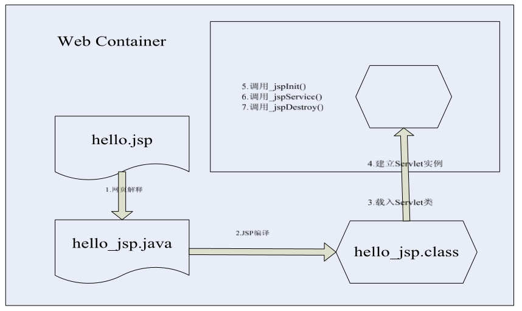

# 6天【Java EE】

## 主要内容

1.  掌握Web相关知识
2.  掌握Servlet使用方式
3.  掌握Web项目中会话的使用
4.  熟练使用JSP页面中的技术
5.  熟练使用 JSTL和EL技术
6.  掌握AJAX异步请求
7.  熟练使用监听器和过滤器的使用

## 学习目标

| 节数   | 知识点               | 要求     |
|--------|----------------------|----------|
| 第一章 | Web简介，服务器介绍  | 掌握     |
| 第二章 | Servlet入门程序      | 掌握     |
| 第三章 | 会话跟踪技术         | 掌握     |
| 第四章 | JSP页面，JSTL&EL技术 | 熟练使用 |
| 第五章 | AJAX的使用           | 掌握     |
| 第六章 | 过滤器，监听器使用   | 熟练使用 |

## 第一章Web快速入门

### Web程序的基本架构

浏览器和服务器是俩个不同的软件,两个软件在交互时,都是加入对http协议的支持,所有它们俩个进行信息交换的时候,是通过http协议规定的方式进行交换的:客户端先发送一个请求,然后服务器端接收到请求后再返回给客户端一个响应,并且把客户端所请求的资源返回给客户端。如图1-1所示。

图1-1 B/S架构图

| 语言 | 项目技术 | 数据库       | 服务器          |
|------|----------|--------------|-----------------|
| JAVA | Java EE  | Oracle/MySQL | Tomcat/WebLogic |
| C\#  | .NET     | SQL Server   | ISS             |
| PHP  | PHP      | MYSQL        | WAMP            |

### 通信协议

**HTTP**：HyperText Transfer Protocol，超文本传输协议。是用于从万维网（WWW:World Wide Web）服务器传输超文本到本地浏览器的传送协议。

1.  HTTP协议工作于客户端-服务端架构上。浏览器作为HTTP客户端通过URL向HTTP服务端即WEB服务器发送所有请求。
2.  Web服务器有：Apache服务器，IIS服务器（Internet Information Services）等。
3.  Web服务器根据接收到的请求后，向客户端发送响应信息。
4.  HTTP默认端口号为80

**URL** ： 统一资源定位，路径，客户端就是通过路径找到服务器下资源

URL固定格式：

协议名://IP或域名[:端口号]/资源路径/请求参数[?key=value&key=value]\# 锚点名

**端口**： IP下的对应资源，一个IP下可以有多个端口

例如：Oracle :1521 ; MySQL : 3306 ; tomcat : 8080

**常用请求的方式**：GET和POST请求

|                   | GET请求                                                                | POST请求                                                                                                                                                |
|-------------------|------------------------------------------------------------------------|---------------------------------------------------------------------------------------------------------------------------------------------------------|
| 点击返回/刷新按钮 | 没有影响                                                               | 数据会重新发送（浏览器将会提示用户“数据被从新提交”）                                                                                                    |
| 添加书签          | 可以                                                                   | 不可以                                                                                                                                                  |
| 缓存              | 可以                                                                   | 不可以                                                                                                                                                  |
| 历史记录          | 有                                                                     | 没有                                                                                                                                                    |
| 编码类型          | application/x-www-form-urlencoded                                      | application/x-www-form-urlencoded or multipart/form-data.  请为二进制数据使用multipart编码                                                              |
| 长度限制          | 有 2k                                                                  | 没有                                                                                                                                                    |
| 数据类型限制      | 只允许ASCII字符类型                                                    | 没有限制。允许二进制数据                                                                                                                                |
| 安全性            | 查询字符串会显示在地址栏的URL中，不安全，请不要使用GET请求提交敏感数据 | 因为数据不会显示在地址栏中，也不会缓存下来或保存在浏览记录中，所以看POST求情比GET请求安全，但也不是最安全的方式。如需要传送敏感数据，请使用加密方式传输 |
| 可见性            | 查询字符串显示在地址栏的URL中，可见                                    | 查询字符串不会显示在地址栏中，不可见                                                                                                                    |

**常见响应状态码：**

| 响应状态码 | 作用                                      |
|------------|-------------------------------------------|
| 1XX        | 提示信息 - 表示请求已被成功接收，继续处理 |
| 2XX        | 成功 - 表示请求已被成功接收，理解，接受   |
| 3XX        | 重定向 - 要完成请求必须进行更进一步的处理 |
| 4XX        | 客户端错误 - 请求有语法错误或请求无法实现 |
| 5XX        | 服务器端错误 - 服务器未能实现合法的请求   |

**常见的响应状态码：**

| 响应状态码 | 作用                    |
|------------|-------------------------|
| 200        | 请求的响应成功          |
| 301        | 永久重定向              |
| 302        | 临时重定向              |
| 404        | 请求的路径出错 在客户端 |
| 500        | 服务器内部出错 在服务器 |

### Tomcat简介

Tomcat服务器是一个免费的开放源代码的Web 应用服务器，属于轻量级应用服务器，在中小型系统和并发访问用户不是很多的场合下被普遍使用，是开发和调试JSP 程序的首选。对于一个初学者来说，可以这样认为，当在一台机器上配置好Apache 服务器，可利用它响应HTML（标准通用标记语言下的一个应用）页面的访问请求。实际上Tomcat 部分是Apache 服务器的扩展，但它是独立运行的，所以当你运行tomcat 时，它实际上作为一个与Apache 独立的进程单独运行的。

**TOMCAT目录介绍：**

1.  bin：存放各种平台下启动和关闭Tomcat的脚本文件
2.  conf：存放Tomcat服务器的各种全局配置文件，其中最重要的是server.xml和web.xml
3.  lib：存放Tomcat运行需要的库文件（JARS）；
4.  logs：存放Tomcat执行时的LOG文件；
5.  temp： 存放Tomcat运行时所产生的临时文件
6.  webapps：Tomcat的主要Web发布目录，默认情况下把Web应用文件放于此目录
7.  work：存放JSP编译后产生的class文件；

**使用Eclipse配置Tomcat:**

1.  window –\> preferences --\> Server，如下图：

    

2.  选择Tomcat版本

    

3.  选择Tomcat本地路径即可。

## 创建Web动态项目

1.  创建动态WEB项目Dynamic Web Project：

    

2.  填写项目名称，下一步，点击Finish即可。

    

Eclipse的Web项目工程结构：

WEB-INF是Java的WEB应用的安全目录。所谓安全就是客户端无法访问，只有服务端可以访问的目录

在Servers选项卡的服务器上右键 \>\> add and remove \>\> 添加项目

http://localhost 或127.0.0.1或IP:8080/项目名/文件夹/资源名

## 本节作业

1.  描述出web项目的工作原理
2.  创建web项目

## 第二章 Servlet基础入门

### 2.1 Servlet简介

**1.概念：**是Java EE组件中用于获得请求并可以响应的技术，处于服务器端的Java代码，本质是一个Java类，要求必须是继承HttpServlet。

要求： 在一个服务器的容器下，完成请求和响应，使用Tomcat作为Servlet的容器

**2.作用：**接收请求，完成响应

**3.配置和访问**

**配置：** 使得前端请求路径和后端servlet关联性

**访问：** 前端通过配置路径访问后端的servlet

**配置的两种方式：**

**3.1 创建Servlet的方式（xml配置形式）**

1.  创建类继承HttpServlet父类
2.  重写doGet和doPost方法
3.  配置web.xml部署描述文件

web.xml 里为你的servlet加一个路径映射关系（web.xml是整个项目的配置，使用项目，会自动加载这个文件）

**3.2 创建Servlet的方式（注解配置形式）**

1.  创建类继承HttpServlet父类
2.  重写doGet和doPost方法
3.  类配置@WebServlet("/映射路径") 注解都是@开头

**4.访问Servlet的四种方式：**

| 访问方法                                                 | 请求方式          |
|----------------------------------------------------------|-------------------|
| 1.在URL调用Servlet的路径                                 | GET请求           |
| 2.通过\<a href="Servlet的映射"\>\</a\>                   | GET请求           |
| 3.通过\<form action="Servlet的路径"\>表单,表单的提交按钮 | GET请求\\POST请求 |
| 4.脚本 JS： location.href="Servlet路径" 或JQ或Ajax       | GET请求\\POST请求 |

### 2.2 Servlet 的创建

Servlet接口：凡是Servlet原生的方法都在这个接口中声明，如init() 初始化 destroy() 销毁service()服务

ServletConfig接口：能够实现Servlet配置的接口

通过Servlet接口中的getServletConfig()方法得到

GenericServlet 实现类：实现两个接口里的方法：

Servlet接口： init() destroy() service()

ServletConfig接口： getInitParameter() getServletContext()

### 2.3 Servlet的生命周期

在自定义的Servlet将获得以下方法：

Servlet接口中的方法

| 方法      | 作用                                                                                                                                                                                                    |
|-----------|---------------------------------------------------------------------------------------------------------------------------------------------------------------------------------------------------------|
| init()    | 在Servlet被第一次创建自动调用的方法，初始化设置Servlet，只调用一次                                                                                                                                      |
| service() | 在HttpServlet里覆盖过，主要用来决定用哪一种请求，根据请求方式调用不同的方法，service方法接收到tomcat服务器给他的两个对象：请求对象 和 响应对象 ，判断请求类型 get/post，service方法调用doGet()/doPost() |
| destroy() | Servlet销毁的方法，在关闭服务器时自动调用                                                                                                                                                               |

生命周期执行的方法： init() , service() , destroy()

注意：在整个生命周期过程中，init和destroy方法只会执行一次。

1.  当第一次有人访问这个servlet时首先调用构造器创建实例
2.  然后开始生命周期，执行init方法，执行初始化操作
3.  产生两个对象（request请求对象和response响应对象）调用 service方法
4.  service方法根据请求方式的不同调用doGet或者doPost方法
5.  当有人再次调用同样的servlet重复第3步到第5步，不会再创 建同样的Servlet对象实例
    1.  servlet实例会常驻内存（持久性），保证多个请求使用的是 一个对象实例，当对象成为垃圾对象，被gc回收时，会调用 destroy方法，在tomcat中一个servlet被创建实例后只有服务 器重启才会成为垃圾对象

Tomcat启动时就初始化Servlet：

在web.xml里，servlet里加

\<load-on-startup\>2\</load-on-startup\>

表示Servlet会在启动tomcat时完成创建，并初始化，其中的数字不代表加载时间，代表的加载的顺序，优先级。

1.如果该元素的值为负数或者没有设置，则容器会当Servlet被请求时再加载。

2.如果值为正整数或者0时，表示容器在应用启动时就加载并初始化这个servlet，值越小，servlet的优先级越高，就越先被加载。值相同时，容器就会自己选择顺序来加载。

ServletContext对象：

-   ServletContext对象是一个web应用的全局对象
    -   这个对象会在一个web应用加载的时候被创建， 在这个web项目中关闭的时候被销毁
    -   ServletContext对象和web应用的关系一对一 的，不同的web应用中的ServletContext对象是不同的
    -   在一个web应用中一个ServletContext对象是唯一 的。任何一个资源都可以访问此对象的数据

        获取ServletContext对象：

1.  this.getServletConfig().getServletContext();
2.  this.getServletContext();

    使用方式：

    获取web.xml中定义好的参数

    web.xml中如下：

    

    代码中获取：

    ServletContext context = this.getServletContext();

    int age = Integer.parseInt(getServletContext().getInitParameter("age").toString());

    代码中设置全局属性

    ServletContext context = this.getServletContext();

    设置属性：context.setAttribute(String key,Object val);

    获取属性：context.getAttribute(String key);

    移除属性：context.removeAttribute(String key);

ServletConfig对象：

是一个Servlet配置对象，每一个Servlet都有一个 对应ServletConfig对象，ServletConfig对象和 Servlet是一对一的关系

获取方式：

ServletConfig config= this.getServletConfig();

获取web.xml中配置的属性：

web.xml中配置如下：

代码中如下：

### 2.4 HTTP协议

Hypertext Transfer Protocol，超文本传输协议。所谓协议，就是指双方遵循的规范。http协议，就是浏览器和服务器之间进行“沟通”的一种规范。

HTTP数据传输如下图所示：

HTTP请求消息

一个http请求代表客户端浏览器向服务器发送的数据。一个完整的http请求消息，包含一个请求行，若干个消息头（请求头），换行，实体内容

请求行：描述客户端的请求方式、请求资源的名称、http协议的版本号。 例如： GET/BOOK/JAVA.HTML HTTP/1.1

请求头（消息头）包含（客户机请求的服务器主机名，客户机的环境信息等）：

Accept：用于告诉服务器，客户机支持的数据类型 （例如：Accept:text/html,image/\*）

Accept-Charset：用于告诉服务器，客户机采用的编码格式

Accept-Encoding：用于告诉服务器，客户机支持的数据压缩格式

Accept-Language：客户机语言环境

Host:客户机通过这个服务器，想访问的主机名

If-Modified-Since：客户机通过这个头告诉服务器，资源的缓存时间

Referer：客户机通过这个头告诉服务器，它（客户端）是从哪个资源来访问服务器的（防盗链）

User-Agent：客户机通过这个头告诉服务器，客户机的软件环境（操作系统，浏览器版本等）

Cookie：客户机通过这个头，将Coockie信息带给服务器

Connection：告诉服务器，请求完成后，是否保持连接

Date：告诉服务器，当前请求的时间

HTTP响应消息

一个http响应代表服务器端向客户端回送的数据，它包括：

一个状态行，若干个消息头，以及实体内容

响应头(消息头)包含:

Location：这个头配合302状态吗，用于告诉客户端找谁

Server：服务器通过这个头，告诉浏览器服务器的类型

Content-Encoding：告诉浏览器，服务器的数据压缩格式

Content-Length：告诉浏览器，回送数据的长度

Content-Type：告诉浏览器，回送数据的类型

Last-Modified：告诉浏览器当前资源缓存时间

Refresh：告诉浏览器，隔多长时间刷新

Content-Disposition：

告诉浏览器以下载的方式打开数据。例如：

context.Response.AddHeader("Content-Disposition","attachment:filename=aa.jpg"); context.Response.WriteFile("aa.jpg");

Transfer-Encoding：告诉浏览器，传送数据的编码格式

ETag：缓存相关的头（可以做到实时更新）

Expries：告诉浏览器回送的资源缓存多长时间。如果是-1或者0，表示不缓存

Cache-Control：控制浏览器不要缓存数据 no-cache

Pragma：控制浏览器不要缓存数据 no-cache

Connection：响应完成后，是否断开连接。 close/Keep-Alive

Date：告诉浏览器，服务器响应时间

常见HTTP响应状态码:

## 2.5 请求对象HttpServletRequest和响应对象HttpServletResponse

HttpServletRequest请求对象,HttpServletResponse 响应对象：当每次浏览器发送请求到服务器，服务器端都会自动创建两个对象（请求对象，响应对象），传递并调用service方法。

**一个完整的HTTP请求包含三部分信息：**

**请求行：**协议版本，请求方式，请求URL

**消息报头：**包含了客户端的相关信息

**请求正文：**发送的请求参数数据，GET请求没有请求正文

**请求对象的常用API：**

| 方法                           | 作用                                            |
|--------------------------------|-------------------------------------------------|
| getParameter(“参数名称”)       | 返回客户端的请求参数值                          |
| getParameterValues(“参数名称”) | 返回多个参数名称相同的值，形成一个数组          |
| etParameterNames()             | 返回所有的请求参数名称，形成一个Enumeration集合 |
| getHeader()                    | 获得指定报头信息                                |
| getHeaderNames()               | 获得所有报头的名称                              |
| getContextPath()               | 返回当前web应用名称                             |
| getMethod()                    | 返回请求方式                                    |
| getProtocol()                  | 返回协议名称                                    |
| getQueryString()               | 返回请求的参数字符串部分的内容                  |
| getRequestURI()                | 返回请求URI                                     |
| getRequestURL()                | 返回请求URL                                     |
| getRemoteAddr()                | 返回客户端的IP地址                              |
| getLocalAddr()                 | 返回服务器的IP地址                              |
| getLocalName()                 | 返回服务器的机器名称                            |
| getLocalPort()                 | 返回服务器的端口号                              |
| setAttribute(属性名,属性值)    | 设置一个属性，加在request对象上                 |
| getAttribute(属性名)           | 根据属性名获得一个属性值                        |
| setCharacterEncoding()         | 设置请求编码格式                                |

**响应对象的常用API：**

| 方法                   | 作用                                                             |
|------------------------|------------------------------------------------------------------|
| setContentType()       | 设置MIME类型和编码                                               |
| getWriter()            | 获得响应字符输出流,得到一个输出流 PrintWriter 专门用于网页的输出 |
| setHeader()            | 设置响应报头                                                     |
| getOutputStream()      | 获得响应字节输出流                                               |
| sendRedirect()         | 重定向                                                           |
| setCharacterEncoding() | 设置响应编码格式                                                 |

### 2.6中文处理问题

**请求的中文处理：**

| POST请求                               | GET请求                                                                                                          |
|----------------------------------------|------------------------------------------------------------------------------------------------------------------|
| request.setCharacterEncoding("UTF- 8") | new String(username.getBytes("iso-8859-1"),"utf-8");                                                             |
|                                        | server.xml 中修改在tomcat配置里更改整个服务器下项目编码配置                                                      |
|                                        | \<Connector connectionTimeout="20000" port="8080" protocol="HTTP/1.1" redirectPort="8443" URIEncoding="utf-8"/\> |

tomcat8以后默认编码格式是utf-8；7之前的都是iso8859-1

如果默认情况下，tomcat使用的的编码方式：iso8859-1

修改tomcat下的conf/server.xml文件

找到如下代码：

\<Connector port="8080" protocol="HTTP/1.1" connectionTimeout="20000"

redirectPort="8443" /\> 这段代码规定了Tomcat监听HTTP请求的端口号等信息。

可以在这里添加一个属性：URIEncoding，将该属性值设置为UTF-8，即可让Tomcat（默认ISO-8859-1编码）以UTF-8的编码处理get请求。

修改完成后：

\<Connector port="8080" protocol="HTTP/1.1" connectionTimeout="20000" redirectPort="8443" URIEncoding="UTF-8" /\>

**响应的中文处理：**

response.setContentType("text/html;charset=utf-8");

### 2.7 Servlet安全性问题

Servlet是多线程单实例。当用户发送Http请求的时候,tomcat会读取web.xml中的内容,加载所定义的Servlet并实例化该Servlet，只实例化一次,tomcat中Servlet是单例的.同一个Servlet可以同时处理多个用户请求,比如同时有两个用户A和用户B登录时,会启动两个负责登录的Servlet线程,并且触发Service方法才处理请求.所以在Servlet处理共享数据的时候,会出现线程安全问题.

解决方案：

-   尽量使用局部变量

    使用全局变量会出现线程安全问题,所以我们可以尽量使用局部变量.在Servlet中,负责保存上下文ServletContext和负责处理Session对象的HttpSession是线程不安全的,而负责处理请求的ServletRequest是线程安全的.

-   加锁

    用synchronized进行保护,但是要尽量的缩小保护范围.

-   ThreadLocal
-   ThreadLocal为每一个线程提供一个变量副本,线程之前该变量是独立的.可以通过ThreadLocal解决Servlet单例线程不安全问题.

### 2.8请求转发和重定向

**Servlet向其它组件跳转：**

**1.请求转发 request对象**

request.getRequestDispatcher(" 跳转的路径servlet/jsp").forward( 请求对象, 响应对象);

**请求转发**：对资源A发出请求，资源A把请求直接转发给资源B，资源B给出客户端响应，只会发出一次请求，请求转发之前不能有任何实际数据响应到客户端，否则转发会失效。

**2.响应重定向 response对象**

response.sendRedirect(" 跳转的路径");

**重定向**：对资源A发出请求，资源A给出响应，通知浏览器对资源B发出请求，资源B给出响应，会发出两次请求。

**请求转发的特点：**

1.A资源和B资源必须在同一个服务器下

2.只发生一次请求，将请求对象传递给B资源

3.URL地址栏不发生变化，每一次请求新的URL

**重定向的特点：**

1.A资源和B资源可以不在同一个服务器下

2.发生两次请求，请求资源A后，再次请求资源B

3.URL地址栏发生变化，每一次请求新的URL

**请求转发，重定向案例连接：《01rediect-demo》**

## 本节作业

1.  创建Servlet 接收表单信息
2.  使用转发重定向跳转
3.  描述修改字符编码方式

## 第三章 会话跟踪

http协议是无状态的，浏览器和服务器并不是持久连接 的，而是请求完数据之后就断开连接，这样可以降低资源 的浪费，缺点就是无法维护通信的状态

例如在一个网页登陆之后，在另外一个网页无法得知这个 用户是登陆了还是没有登陆

我们必须用一些技术手段来保留会话中的一些数据，这种 技术手法称为“会话跟踪”，常用的会话跟踪手法有四种：

–url重写即在地址栏的url地址后面追加get形式的参 数：?a=xx&b=xx

–隐藏域在表单里设置隐藏域存储数据，然后提交的时候一起提交 过去

–cookie对象将数据设置在客户端cookie文件中，然后在另一个页 面读取

–HttpSession对象将数据存储在session对象中，然后在另一个页 面读取

### 3.1 Cookie

1.概念：浏览器端的缓存，为了可以长久的保存某些数据信息，将数据缓存到浏览器或到本地。就是存储在客户端的一个文本键值对。

2.应用场景:

 简化登录（登陆过后，如果缓存了登陆信息，在一定时间内都是免登陆的）

 浏览记录再次显示推送

3.浏览器的缓存类型：

 会话级：存储在客户端的浏览器进程中，浏览器关闭就销毁

 硬盘级：存储在客户端的浏览器临时文件夹中，可以设置失效时间

4.使用cookie的条件:

 不能是保密信息

 cookie是一个锦上添花的功能，不会影响到项目的关键功能点

创建Cookie对象

Cookie username = new Cookie(String name , String val);

Cookie常用方法：

1) setMaxAge(int sec) ： 设置Cookie的有效期。默认的Cookie的有效期仅在当前回话有效。

2) getName() : 返回当前Cookie的name值

3) getValue() : 返回当前Cookie的值。

将Cookie写入客户端

response.addCookie( Cookie cookie );

代码读取客户端的所有的Cookie

request.getCookies() : Cookie[] 获取客户端当前回话中所有的Cookie对象

Cookie练习参考代码：《04-cookie》

### 3.2 HttpSession

1\. 概念:Session即是会话，是客户端不断的向服务器发送请求，服务器不断的给客户端响应，整个过程叫会话，直到浏览器关闭，请求终止，会话结束。在服务器端实现缓存，将来每发生一个请求可以直接从服务器上拿出缓存数据。

2\. 应用场景:

 某些网站资源根据登录信息限制：有些免登陆 有些必须登录

 每一个请求可能都要使用登录信息

3\. 缓存位置:

服务器上，客户端发来的数据直接缓存到服务器上，一个服务器上可以有N多个会话session。

Session是存储在服务器端的一个对象，数据类型HttpSession，session的生命周期是从会话第一次发出请求创建（实际上只有调用request.getSession()语句才会创建session对象），产生一个session对象，包含一个唯一的JsessionId，然后以会话级cookie的形式把这个JsessionId写入到客户端，以会话最后一次发送请求为准，如果超过超时时长（tomcat默认是30分钟）没有发送任何请求，服务器会自动销毁这个session对象Session的创建： Tomcat容器帮你创建好对象，只需要取出创建好的 session即可

HttpSession session对象 = request.getSession()

获得一个请求对应的session，如果没有新建一个session

session对象.setAttribute(key,Object);

session对象.getAttribute(key);

HttpSession练习参考代码：《05-test》

4.会话失效:

1).自然失效

a. TOMCAT会在默认的30分钟内让会话失效（服务器下所有session）单个Session设置失效。

b. session.setMaxInactiveInterval(2\*60\*60); 秒为单位

2).手动失效

手动配置默认的失效时间（服务器下所有 session）

在web.xml里实现配置

\<session-config\>

\<session-timeout\>50\</session-timeout\> 50分钟

\</session-config\>

session立即失效

session.invalidate(); 如退出登录，没有退出浏览器

5\. (扩展)cookie禁止:

cookie在浏览器端，cookie有可能会被禁止，一旦禁止，JSESSIONID没了

解决办法：response.encodeURL("admin/admin.jsp")%\>

强制将URL上添加了JSESSIONID。

### 3.3 Cookie 和 HttpSession区别

联系：

当客户端第一次发送请求，服务器给客户端响应时，会将sessionId放到客户端的Cookie中，每次发送请求都会在地址上拼接上上JSESSIONID = sessionId, 流程如下图：

区别：

|        | Cookie       | HttpSession  |
|--------|--------------|--------------|
| 位置   | 客户端       | 服务器端     |
| 安全性 | 低           | 高           |
| 效率   | 效率高       | 效率低       |
| 个数   | 建议20个以内 | 理论没有限制 |

1.  错误页面配置方式
2.  按照状态码配置错误页面

    

3.  按照异常类型配置错误页面

    

### 3.4 作用域对象

|           | 一个页面    | 两个页面           | 会话范围    | 全局           |
|-----------|-------------|--------------------|-------------|----------------|
| 类型      | PageContext | HttpServletRequest | HttpSession | ServletContext |
| Servlet里 | pageContext | request            | session     | servletContext |
| JSP里     | pagecontext | request            | session     | application    |

四个代表四个域范围，代表参数传递时的使用的范围

四个对象都有 setAttribute(key,object) getAttribute(key)

pageContext \< request \< session \< servletContext

### 3.5 上下文对象

**1.作用：**实现整个应用下全局变量，使得多个用户可以共享数据。

**2.应用场景：**比如访问一个网站，显示您是第几位访问用户访问量。

**3.ServletContext上下文API**

获取出来 任何一个Servlet都有getServletContext() 取出上下文对象

设置全局参数 上下文.setAttribute(key,object)

获取全局参数 上下文.getAttribute(key)

上下文参数：上下文级别的全局参数

web.xml文件

\<context-param\>

\<param-name\>level\</param-name\>

\<param-value\>1\</param-value\>

\</context-param\>

上下文对象.getInitParameter( 上下文参数名);

**ServletContext案例参考代码：《03_ServletRange》**

## 第四章 JSP（Java Server Page）

### 4.1 JSP简介

JSP本质上是开发Servlet的另外一种形式，它允许java代码和html代 码混合使用，页面中静态的部分直接写html代码，而动态的部分用 java代码来写，可以快捷的开发出web应用的视图。

Web容器管理JSP页面生命周期主要分成两个阶段： –转换阶段（translation phase） –执行阶段（execution phase）

当客户端第一次请求一个JSP的时候，JSP页面转换成Servlet源文 件，然后将这个Servlet源文件编译成Servlet的字节码文件，这个阶段 称为转换阶段。

然后Servlet容器就执行Servlet的生命周期：加载Servlet类，实例化 一个Servlet对象，执行初始化的_jspInit方法，调用_jspService方法 实现请求的处理，后执行回收的_jspDestroy方法。

只有第一次请求一个JSP的时候才完成转换阶段，如果是第二次就不 会做转换，而是直接完成执行阶段。

1\. 执行原理

1.  JSP组成

    静态元素 ： HTML , CSS , JS , jQuery

    动态元素 : 指令元素（指令标签），动作标签，脚本元素

2.  JSP中的注释

    \<!-- HTML中的注释： --\> html中的注释，在前端页面中可以看到

    \<%-- JSP中的注释 --%\> jsp注释，在前端页面中可以看不到

3.  脚本元素

    声明： \<%! 声明 %\>

    代码块： \<% 代码块 %\>

    输出：\<%=表达式%\>

4.  指令标签

    JSP的指令元素主要用于转换阶段提供整体JSP页面的相关信息。

    JSP中有三个指令标签： page , include , taglib

    指令标签语法：

    \<%@ 指令名 属性1＝“值”属性2＝“值”%\>

-   page指令

page指令作用于整个JSP页面，定义了许多页面相关的属性，这些属性将被用于和JSP容器通信。

page指令可以放在任何位置，作用范围都是整个jsp页

语法：[%@page 属性1=”值”属性2=”值”...%](mailto:%25@page%20属性1=)

常用属性：

注意：每个属性只允许出现一次，只有import属性例外。

-   include指令

    include指令用于在JSP页面中静态包含一个文件，该文件可以是一个JSP页面、HTML网页、文本文件或一段Java代码。使用了include指令的JSP页面在转换的时候，JSP容器会将包含的文件的代码插入到当前页面中，一起进行编译

    语法：\<%@ include file=”文件路径”%\>

    注意：

    需要注意的是静态包含是把包含和被包含的文件最终的代码合成到一起，形成一个文件，各文件之间不能有冲突。例如多余的\<html\>，\<body\>之类或者重复声明的变量

-   静态包含，最终会形成一个java文件。
-   动态包含，\<jsp:include\>, 每一个jsp都会单独生成一java文件
-   taglib指令

    taglib指令允许页面使用用户定制的标签

    语法：\<%@taglib uri=“标签库URI”prefix=”前缀名”%\>

1.  动作标签

    JSP的动作元素为请求处理阶段提供信息。动作元素遵循XML元素的语法。JSP2.0规范中一共定义了20个动作元素。这些动作元素在JSP转换为Servlet过程中将用固定的一段Java代码来替换。

    标签是以jsp为前缀的标签，例如\<jsp:forward\> \<jsp:include\>

2.  静态包含和动态包含区别：

    静态包含：\<%@include file="被包含页面"%\>

    动态包含：\<jsp:include page="被包含页面" \>

    \<%@ include file=” ”%\>是指令元素。\<jsp:include page=” ”/\>是行为元素

    最终编译成java文件的数目不同。（从上面的例子可以看出）

    静态包含在转换成为java文件的时候将包含文件的内容“复制”到主体文件，然后作为一个整体编译。最终编译为一个java文件。

    动态包含是各个jsp文件分别转换，分别编译。最终编程成多个java文件。

    执行时间不同

    静态包含发生在：JSP----\>java文件阶段。

    动态包含发生在：执行class文件阶段。动态加入。

    静态包含在两个文件中不能有相同的变量，动态包含允许。

    由于静态包含相当于将包含文件内容直接复制到主体文件中，如果出现相同的变量，就会出现覆盖等问题，导致文件出错。而动态包含相当于调用不同的jsp，变量所在的空间不同，自然不会出现覆盖等现象。

    无论是动态包含还是静态包含，其request对象都是相同的。也就是同一个request对象。

    静态包含最终编译成一个java文件，有一个request对象很好理解。而动态包含最终编译成多个jsp文件，为何会使用一个request对象呢？其实这些jsp组合的过程是一个请求转发的过程，自然也使用同一个request对象了。

3.  JavaBean

    JavaBean组件本质上就是一个类，只不过这个类需要遵循一些编码的约定。在JSP 页面中，既可以像使用普通类一样实例化JavaBean类的对象，调用它的方法，也可以利用JSP 技术中提供的动作元素来访问JavaBean

    一个标准的JavaBean组件具有以下几个特性：

    –它是一个公开的（public ）类。

    –它有一个默认的构造方法，也就是不带参数的构造方法（在实例化JavaBean对象时，需要调用默认的构造方法）。

    –它提供setXXX()方法和getXXX()方法来让外部程序设置和获取JavaBean的属性。

    –实现Serializable接口

    换句话说，符合上述条件的类，我们都可以把它看成是JavaBean组件。

4.  JSP中的内置对象（9个）

    在JSP容器生成的Servlet类的_jspService()方法中，定义了几个对象，而这些对象就是我们在编写JSP 页面时，可以使用的隐含对象。要注意的是，因为这些隐含对象是在_jspService()方法中定义的，所以我们只能在脚本段和表达式中使用这些对象

    request , response , session , application , page , pageContext , out , exception , config

    内置对象对应的数据类型

    

### 4.2 JSTL

**JSTL简介**

JSTL的英文全称是JavaServer Pages Standard Tag Library，中文全称是JSP标准标识库。JSTL技术标准是由JCP（lava Community Process）组织的JSR052专家组发布，Apache组织将其列入Jakarta项目，Sun公司将JSTL的程序包加入互联网服务开发工具包内（Web Services Developer Pack（WSDP）），作为JSP技术应用的一个标准。

JSTL标签是基于JSP页面的，这些标签可以插入在JSP代码中，本质上JSTL也是提前定义好的一组标签，这些标签封装了不同的功能，在页面上调用标签时，就等于调用了封装起来的功能。

操作步骤：

\<%@taglib prefix="c" uri="http://java.sun.com/jsp/jstl/core" %\>

### 4.3 EL表达式

Expression Language表达式语言

是一种在JSP页面获取数据的简单方式(只能获取数据，不能设置数据)

在JSP2.0开始引入概念

EL表达式的内置对象

pageScope：从page范围域属性空间中查找指定的key

requestScope：从request范围域属性空间中查找指定的key

sessionScope：从session范围域属性空间中查找指定的key

applicationScope：从application范围域属性空间中查找指定的key

pageContext , param , paramValues , initParam

**JSP、JSTL、EL 练习参考代码：《07-jsp 、11-jstl、10-el》**

# 第五章 Ajax

### 5.1 Ajax简介

**.概念：**Asynchronized javascript and xml，异步交互的局部刷新技术，浏览器本身就具备发送请求得到相应响应的能力，但是浏览器发送普通的请求一定会产生页面跳转，如果需要发送请求得到响应而页面不会发生任何跳转，需要使用ajax技术。

同步：发送一个请求，需要等待返回结果才能发送下一个请求

异步: 发送一个请求，不需要等待返回结果，就能发送下一个请求

**核心对象：**XMLHttpRequest

## 5.2 jQuery提供的ajax请求的方法

\$.get() 发送get请求

\$.get() 方法使用 HTTP GET 请求从服务器加载数据。

使用格式： \$.get(url,[data],[callback] ，[type])

说明： url为请求地址，

data为请求数据的列表(是可选的，也可以将要传的参数写在 url里面)，

callback为请求成功后的回调函数，该函数接受三个参数，第一个为服务器返回的数据，第二个参数为服务器的状态，是可选参数，第三个是 ajax的核心对象，是可选的参数。

type:响应的内容类型,是可选的

\$.post() 发送post请求

load() 自动把请求响应的结果载入到当前容器中，默认是get请求，如果有请求参数，则自动变为post请求。

\$.getJSON() 请求响应json格式的数据

\$.getScript() 动态加载外联js

\$.ajax() 最完整写法，包括了所有的功能

\$.ajax({

type:'POST',--提交方式

url:loginServlet --提交地址

data:data,--提交数据

dataType：dataType,--响应数据的类型

success:success-- 成功操作

async:false--同步请求 true--异步请求 （默认）

});

jQuery提供的ajax全局事件：当前网页的任何一个ajax请求都会触发这些回调函数

jQuery所有的ajax方法都会返回一个对象，这个对象就是当前的ajax请求对象

ajax练习参考示例：《13-ajax》

# 第六章 监听器和过滤器使用

### 6.1 监听器相关概念

事件：在服务器端发生的一些操作或者动作，如： 启动关闭容器，创建或销毁会话，产生请求，请求结束都是事件。

监听器： 时刻在服务器端监视着每一个事件的发生，会自动产生与之对应的事件对象，进行事件回调。

### 6.2 监听器事件类型

| 事件类型                     | 作用                                                                        |
|------------------------------|-----------------------------------------------------------------------------|
| ServletContextEvent          | 对应上下文对象的创建或销毁动作（创建：启动服务器 销毁：关闭服务器）         |
| ServletContextAttributeEvent | 上下文对象属性改变，上下文对象中存储的属性发生改变：增加属性 改属性值.      |
| ServletRequestEvent          | 对应请求对象的创建或销毁动作（创建：访问服务器上资源 销毁：请求结束）       |
| ServletRequestAttributeEvent | 请求对象属性改变，请求对象中存储的属性发生改变：增加属性 改属性值.          |
| HttpSessionEvent             | 对应会话对象的创建或销毁动作（创建：发请求产生JSESSIONID 销毁：关闭浏览器） |
| HttpSessionBindingEvent      | 会话对象属性改变，会话对象中存储的属性发生改变：增加属性 改属性值.          |

### 6.3 事件回调

怎么监控事件发生，怎么处理，在服务器端，监听器会完成监视事件，并处理，不同的事件类型使用不同的监听器，8种监听器

| 监视器接口                      | 监听事件类型                                             |
|---------------------------------|----------------------------------------------------------|
| ServletContextListener          | 上下文监听器，监听ServletContextEvent事件                |
| ServletContextAttributeListener | 上下文属性监听器，用来监听ServletContextAttribute事件    |
| ServletRequestListener          | 请求监听器，监听ServletRequestEvent事件                  |
| ServletRequestAttributeListener | 请求属性监听器，用来监听ServletRequestAttributeEvent事件 |
| HttpSessionListener             | 会话监听器，监听HttpSessionEvent                         |
| HttpSessionActivationListener   | 会话活化监听器，监听HttpSessionEvent                     |
| HttpSessionAttributeListener    | 事件会话属性监听器，监听HttpSessionAttributeEvent事件    |
| HttpSessionBindingListener      | 会话绑定监听器，监听HttpSessionAttributeEvent事件        |

**6.4 创建监听器**

监听器定义时 :

1.实现接口 ：监听器其实就是一个JAVA类，比较特殊，需要实现XXListener接口

\<listener\>

\<listener-class\>

com.chinasofti.ch09.listener.VisitCountsListener

\</listener-class\>

\</listener\>

**监听器练习参考代码：《12-listener》**

### 6.5 过滤器简介

**1.相关概念：**

在访问目标资源之前，先做一层过滤，过滤的一些通用处理的代码（中文处理，资源访问权限判断），将这些代码放到过滤器里统一设置，避免在多个页面重复定义

**2.作用：**解决代码冗余

**3.过滤器过滤过程：**

过滤器可以多个，是目标资源之前的几道屏障

Filter1中的doFilter()方法是做过滤器处理的，链上的doFilter()方法是决定是否放行的

### 6.6 过滤器的API

**三个接口**

| 接口            | 作用                                                                                 |
|-----------------|--------------------------------------------------------------------------------------|
| Filter接口      | 定义过滤器原生的一些方法                                                             |
| FilterConfig接口 | 定义过滤器配置相关的方法                                                             |
| FilterChain接口 | 定义过滤器将来跳转方向，过滤器链，可以控制是否可以访问到目标资源，可以拦截，可以放行 |

**Filter接口方法：**

| init（）                               | 初始化过滤器                                                                                                                |
|----------------------------------------|-----------------------------------------------------------------------------------------------------------------------------|
| doFilter(request,response,filterChain) | 最重要的方法，必须被覆盖，过滤器处理代码， request，response客户端发来的请求 响应对象,第三个参数链 会使得请求，响应对象传递 |
| destroy()                              | 销毁                                                                                                                        |

**FilterChain接口：**

filterChain.doFilter(request,response)

是否放行,做请求和响应传递，如果放行，直接进入到下一个过滤器或目标资源根据过滤器的配置的顺序。

**FilterConfig接口：**

getInitParamter() 初始化参数

在Web.xml配置参数

### 6.7 过滤器的使用配置

1.创建一个Filter类 implements Filter

2.配置文件配置（注意顺序）

注意：

1\. Filter的创建、销毁、调用，不是客户端决定的，和Servlet不一样的，Filter都是服务器决定的。

2\. URL路径 配置的是过滤器需要过滤的目标资源路径。

**过滤条件：**

| 过滤条件      | 作用                                                                                                                                                                  |
|---------------|-----------------------------------------------------------------------------------------------------------------------------------------------------------------------|
| /\*           | 项目下的所有资源                                                                                                                                                      |
| \*.html       | 所有html文件， 通过扩展名过滤前面一定                                                                                                                                 |
| /LoginServlet | 不要加/只过滤一个资源                                                                                                                                                 |
| /admin/\*     | 某一个文件夹下的所有资源                                                                                                                                              |
| /资源         | \<filter-mapping\> \<filter-name\>Index\</filter-name\> \<url-pattern\>/IndexServlet\</url-pattern\> \<url-pattern\>/LoginServlet\</url-pattern\> \</filter-mapping\> |

**3.按照配置顺序**

**4.dispatcher 配置过滤器过滤目标文件的访问类型**

**不加dispatcher**

表示只能过滤请求的资源（直接访问请求的）

**加dispatcher**

配置任何方式 : request 请求的 forward 转发 include 动态包含 error 错误页

\<filter-mapping\>

\<filter-name\>LoginFilter\</filter-name\>

\<url-pattern\>/admin/\*\</url-pattern\>

\<dispatcher\>REQUEST\</dispatcher\>

\<dispatcher\>FORWARD\</dispatcher\>

\<dispatcher\>INCLUDE\</dispatcher\>

\<dispatcher\>ERROR\</dispatcher\>

\</filter-mapping\>

| \<dispatcher\>：配置的值 | 作用                                                                                                                                                                                                     |
|--------------------------|----------------------------------------------------------------------------------------------------------------------------------------------------------------------------------------------------------|
| REQUEST                  | 请求方式，是一种默认的方式。即不配置dispatcher选项时，默认过滤REQUEST方式请求的URL，包括在地址栏输入URL、表单提交、超级链接、响应重定向，但是如果指定了其他dispatcher值，REQUEST也必须显示指定才能生效。 |
| FORWARD                  | 转发方式，表示可以过滤请求转发方式访问的URL（了解）                                                                                                                                                      |
| INCLUDE                  | 包含方式，表示可以过滤动态包含的URL（了解）                                                                                                                                                              |
| ERROR                    | 错误方式，表示可以过滤错误页面。（了解）                                                                                                                                                                 |

1、REQUEST 只要发起的操作是一次HTTP请求，比如请求某个URL、发起了一个GET请求、表单提交方式为POST的POST请求、表单提交方式为GET的GET请求。一次重定向则前后相当于发起了两次请求，这些情况下有几次请求就会走几次指定过滤器。

2、FOWARD 只有当当前页面是通过请求转发转发过来的情形时，才会走指定的过滤器。

3、INCLUDE 只要是通过\<jsp:include page="xxx.jsp" /\>，嵌入进来的页面，每嵌入的一个页面，都会走一次指定的过滤器。

过滤器参考代码：[《08-filter》](file:///E:\中软Java全栈工程师教案\02-第二阶段-JavaWeb\讲义\teacher-ee\08-filter)

## 6.8 @Servlet注解

在Servlet中,设置了@WebServlet注解,当请求该Servlet时,服务器就会自动读取当中的信息,如果注解@WebServlet("/path"),则表示该Servlet默认的请求路径为…/ path,这里省略了urlPatterns属性名,完整的写法应该是:@WebServlet(urlPatterns = “/path”),如果在@WebServlet中需要设置多个属性,必须给属性值加上属性名称,中间用逗号隔开,否则会报错.

若没有设置@WebServlet的name属性，默认值会是Servlet的类完整名称.

在servlet3.0以后，web.xml中对Servlet配置，同样可以在@WebServlet注解中配置.

下面是@WebServlet的属性列表:

6.9 文件上传

上传文件，因为上传的都是二进制数据，所以在Servlet中就不能直接用request.getParameter();方法进行数据的获取，需要借助第三方jar包对上传的二进制文件进行解析。常用的方式如下：

导入以下jar包：

commons-fileupload.jar (Apache commons)、commons-io.jar

### 6.10 Servlet 4.0服务器推送

服务器推送使服务器能预测客户端请求的资源需求。然后，在完成请求处理之前，它可以将这些资源发送到客户端。

要了解服务器推送的好处，可以考虑一个包含图像和其他依赖项（比如 CSS 和 JavaScript 文件）的网页。客户端发出一个针对该网页的请求。服务器然后分析所请求的页面，确定呈现它所需的资源，并主动将这些资源发送到客户端的缓存。

在执行所有这些操作的同时，服务器仍在处理原始网页请求。客户端收到响应时，它需要的资源已经位于缓存中

**PushBuilder**

Servlet 4.0 通过 PushBuilder 接口公开服务器推送。为了能够进行访问，您需要通过调用newPushBuilder() 方法，从 HttpServletRequest 获取 PushBuilder 实例。

PushBuilder pushBuilder = request.newPushBuilder();

每次调用 newPushBuilder() 方法时，都将返回 PushBuilder 的新实例。如果服务器推送不可用，newPushBuilder() 将返回 null。在某些情况下，客户端可能会为请求事务拒绝服务器推送。如果客户端没有使用安全连接，服务器推送也不会起作用。因此，务必要在对 PushBuilder 实例调用方法之前，针对 null 返回值进行测试。

顾名思义，PushBuilder 实现 Builder 模式。在这一实现过程中，通过链接赋值方法构建推送请求。这些赋值方法通过设置 HTTP 标头、方法类型（GET 是唯一的可接受值）、查询字符串、会话 ID 和资源路径（即，将要推出资源的路径），来配置 PushBuilder 实例。

大多数来自原始 HttpServletRequest 实例的请求标头，只添加到 PushBuilder 实例中。由于正确运行服务器推送并不需要某些标头，因此不包括以下标头：

条件标头

-   Range 标头
-   Expect 标头
-   Authorization 标头
-   Referrer 标头

步骤：

1.设置推送资源

这一路径是在向客户端推送资源之前必须设置的唯一配置。设置路径需要调用 path() 方法。该方法只能被调用一次，因为它会改变 PushBuilder 对象的路径值。该路径可能会以正斜杠（“/”）开头，指示资源路径是绝对路径；否则，该资源会被认为是相对于关联请求的上下文路径。该路径可以包含一个查询字符串，该查询字符串将与 queryString() 方法设置的任何字符串合并。

2.推送资源

调用 push() 方法， 将资源推送到客户端。push() 方法用于发起与客户端的推送“对话”。在后台，会向客户端发送一个 PUSH_PROMISE 帧，类似于发送资源的意图通知。客户端可以通过发回 RST_STREAM 来拒绝资源。这种机制允许客户端保留对接收到的资源的控制。因此，客户端不会因不需要的资源或已经在缓存中的资源而过载。

一旦获得了 PushBuilder 的实例，就可以多次重复使用。路径和条件标头都为 null，但是所有其他字段都原样保留。这些可以在另一个服务器推送中重复使用。代码如下：

PushBuilder pushBuilder = request.newPushBuilder();

if (pushBuilder != null) {

pushBuilder.path("images/hero-banner.jpg").push();

pushBuilder.path("css/menu.css").push();

pushBuilder.path("js/marquee.js").push();

}

将服务器推送与 JSF 结合使用

JavaServer Faces 已经将每个页面的资源需求标识为页面呈现生命周期的一部分，所以它非常适合用于服务器推送。在 JSF 页面中使用服务器推送：

\< h:head \>

\< h:outputStylesheet library = "css" name = "logo.css" /\>

\< h:outputScript library = "js" name = "logo.js" /\>

\< title \>JSF 2.3 ServerPush Example\</ title \>

\</ h:head \>

\< h:body \>

\< h:form \>

\< h:graphicImage library = "images" name = "logo.jpg" /\>

\</ h:form \>

\</ h:body \>

\</ html \>

当 JSF 引擎正在处理和呈现页面时，这些资源将被逐个推送到客户端。这发生在 JSF 的呈现响应阶段。然后，会为每个资源调用 ExternalContextImpl.encodeResourceURL() 方法，并向其传递资源的新 URL。从与 ExternalContext 相关联的 HttpServletRequest 实例获取新的 PushBuilder 对象。如果支持服务器推送，那么会在向客户端呈现页面之前将资源推送到客户端。
