# 第1天【Git】

## 主要内容

1.  Git简介
2.  Git的安装及GitHub的使用
3.  Git的使用及命令
4.  Gitee的安装及使用

## 学习目标

| 节数                              | 知识点                  | 要求 |
|-----------------------------------|-------------------------|------|
| 第一节（Git简介）                 | Git简介                 | 掌握 |
| 第二节（Git的安装及GitHub的使用） | Git的安装及GitHub的使用 | 掌握 |
| 第三节（Git的使用及命令）         | Git的使用及命令         | 掌握 |
| 第四节（Gitee的使用）             | Gitee的使用             | 掌握 |

## 第一节Git简介

### 简介

Git是开源的分布式版本控制系统。主要用来存储文件、追踪目录以及查看修改历史，市面上有各式各样的版本控制工具，比较常用的SVN、Git等等

### Git的特点

1.  速度飞快
2.  完全分布式
3.  允许成千上万个并行开发的分支
4.  高效管理超大规模项目（速度和数据量）

### 1.3 Git、Svn的区别

SVN是集中式版本控制系统，版本库是集中放在中央服务器的，而干活的时候，用的都是自己的电脑，所以首先要从中央服务器哪里得到最新的版本，然后干活， 干完后，需要把自己做完的活推送到中央服务器。集中式版本控制系统是必须联网才能工作，如果在局域网还可以，带宽够大，速度够快，如果在互联网下，如果网 速慢的话，就纳闷了。

Git是分布式版本控制系统，那么它就没有中央服务器的，每个人的电脑就是一个完整的版本库，这样，工作的时候就不需要联网了，因为版本都是在自己的电脑上。既然每个人的电脑都有一个完整的版本库，那多个人如何协作呢？比如说自己在电脑上改了文件A，其他人也在电脑上改了文件A，这时，你们两之间只需把各 自的修改推送给对方，就可以互相看到对方的修改了。

### 1.4 Git官方地址

<https://git-scm.com/book/zh/v2/>

### 本节作业

1.  了解Git的简介
2.  掌握git、svn的区别

## 第二节Git的安装及GitHub的使用

### 2.1 Git的安装

1\. 下载地址：https://git-scm.com/download/ 进行默认安装即可

### 2.2 GitHub的使用

#### 2.2.1 GitHub简介

它是一个免费的远程仓库，可以托管你的代码，同时，也是一个开源协作社区，可以让广大人民群众共同参与开发。

#### 2.2.2 Github的使用

1.进入Github的官网地址： <https://github.com/>

2.注册账号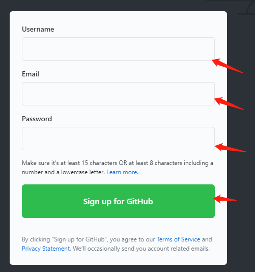

1.  登录
2.  创建本地与远程的连接（用ssh）（搭桥）
    1.  在本地创建ssh key（公钥）。

        创建SSH Key： ssh-keygen -t rsa -C [youremail@example.com](mailto:youremail@example.com)你需要把邮件地址换成你⾃⼰的邮件地址，然后⼀路回车，使⽤默认值即可.

        在⽤户主目录下(/c/Users/Administrator/.ssh/id_rsa))，看看有没有.ssh目录，如果有，再看看这个目录下 有没有id_rsa和id_rsa.pub这两个⽂件，如果已经有了，可直接 跳到下⼀步。

        1.  在远程创建ssh key：

            登陆GitHub，打开“Account settings”，“SSH Keys”⾯： 然后，点“Add SSH Key”，填上任意Title，在Key⽂本框⾥粘贴id_rsa.pub⽂件的内容：

            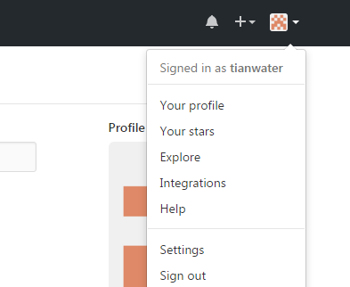

            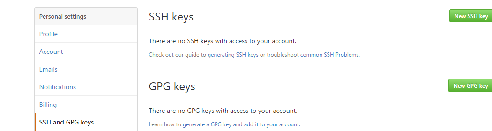

            

            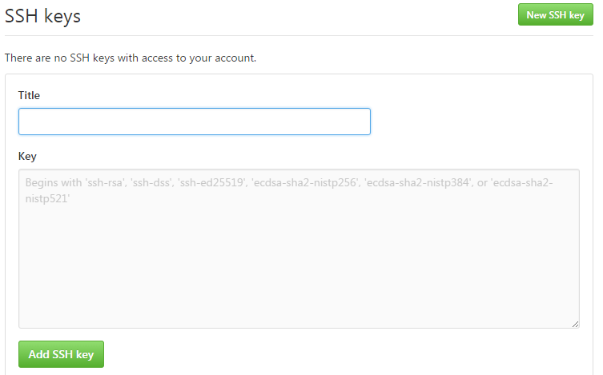

            点击“add SSH Key”

            3）在git bash设置全局用户名密码

            git config --global user.name "username"   
            git config --global user.email "email"

3.  创建远程仓库：
4.  在页面中找 “new repository”

    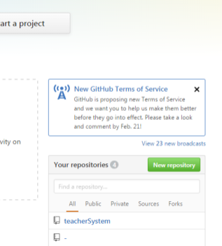

5.  输入仓库名

    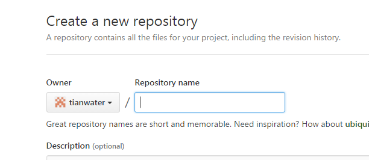

    点击“create repository”

    3）在桌面新建一个项目

    4）在当前项目文件夹鼠标右击进入git bash里

5）输入 git init。就会在项目文件下产生目录 .git(隐藏目录)，表示这里的项目代码（即所有的文件）会使用git进行版本管理。

6）在github远程仓库复制当前项目SSH

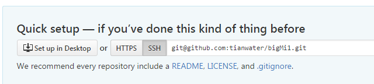

7）在本地项目添加远程库的命令（可以认为是把远程库和地址进行对应）

在git bash里输入以下命令：(**切记：把git bash的当前路径转到你的项目路径（带有.git文件夹）下**)

git remote add origin [git@github.com:tianwater/bigMi.git](mailto:git@github.com:tianwater/bigMi.git)

origin：是远程的库名(可以认为是别名，可以更改)；

注意：[git@github.com:tianwater/bigMi.git](mailto:git@github.com:tianwater/bigMi.git)：是上一个截图中的ssh地址；

这样本地仓库和远程仓库就链接上了

1.  前面五步中讲了先有本地库，后有远程库的时候，如何关联远程库。 现在，假设我们从零开发，那么先创建远程库，然后，从远程库克隆到本地。
2.  ⾸先，登陆GitHub，创建⼀个新的仓库，名字叫mytaobao：

    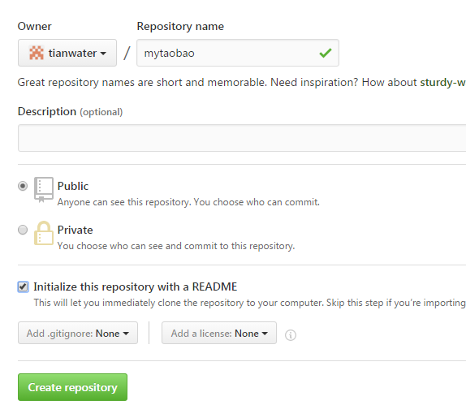

注意：勾选Initialize this repository with a README，这样GitHub会⾃动为我们创建⼀个 README.md⽂件。创建完毕后，可以看到README.md⽂件：**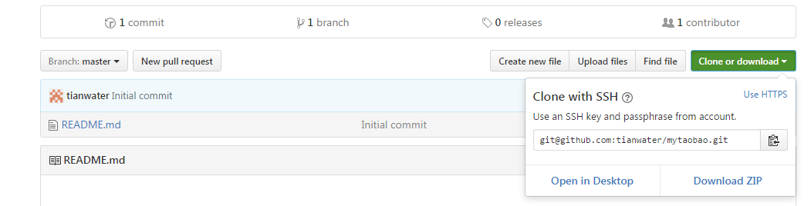**

2）git clone克隆⼀个本地库

git clone [git@github.com:tianwater/mytaobao.git](mailto:git@github.com:tianwater/mytaobao.git)

这样就会在当前目录下创建一个本地的git版本库。

注意：把git bash 的当前路径要转到你的项目目录下

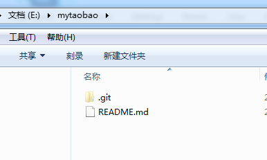

1.  在GitHub中删除已有仓库

    删除整个仓库：进入需要删除的仓库界面，找到settings点击进入Denger Zone,如图：

    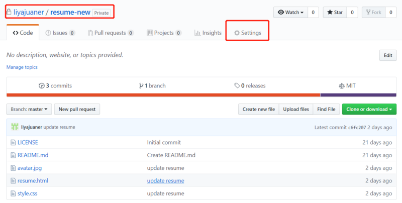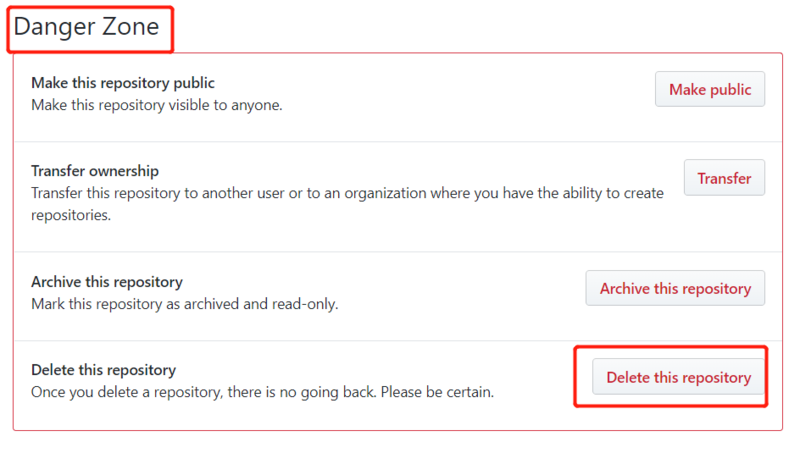

点击“Delete this repository”后出现弹窗，输入你要删除仓库的名字，然后点红色字体的按钮，如下：

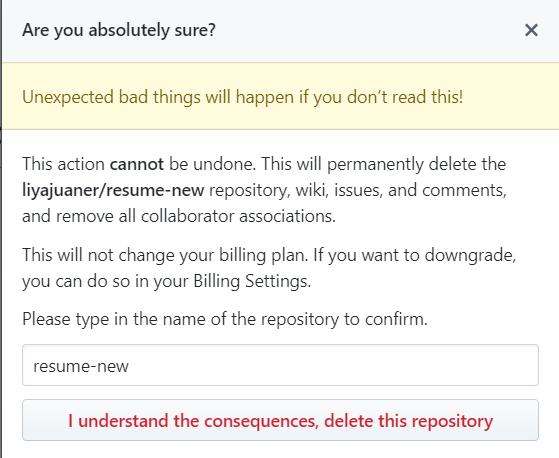

### 本节作业

1.  注册登录github
2.  掌握本地与远程的连接（用ssh）搭桥的方法
3.  会创建远程仓库和链接本地仓库的方法
4.  掌握远程仓库克隆到本地
5.  掌握远程仓库删除方法

## 第三节 Git的使用

### 3.1 Git的常用命令

#### 3.1.1 Git的提交命令

1.Git add

假设在项目下有个index.html文件。在 git Bash，输入：git add index.html

2\. Git commit(提交)

在git Bash里输入： git commit -m "这是新建的index.html"。其中"这是新建的index.html"只是说明或者说解释。

3\. 把本地库的内容推送到远程库

git push -u origin master

注意：origin是远程库名，根据实际情况进行更改

注意：确保本地执行过git add和git commit.

4\. 理解：add和commit；

Add:添加；相当于打了标记（实际上是存储在了暂存区stage里），告诉git，下次提交时把该文件进行提交。

Commit：提交。把打过标记的（即用add进行添加的文件），一次性进行提交。即可以一次性把暂存区里的文件全部进行提交，提交了master分支（主分支）。提交完成后，暂存区里就没有文件了。

5\. 在刚建的项目文件夹新建一个文件或修改项目里的文件，执行上面三个步骤进行增加或修改仓库的文件练习

#### 3.1.2 Git的恢复（跳转）到某个版本的文件命令

1.  查看所有的版本的命令

git log

1.  要恢复到上一个版本

git reset --hard HEAD\^

1.  恢复到指定版本

git reset --hard 版本序列号

1.  获取远程仓库最新版本到本地

    git fetch origin master 相当于是从远程获取最新版本到本地，不会自动合并

    git pull origin master 相当于是从远程获取最新版本并合并到本地

**3.1.3 Git分支控制的命令**

1\. 创建分支

git branch dev

2\. 切换分支

git checkout dev

3\. 查看分支

git branch

4\. 合并分支

git merge dev

1.  删除分支

    git branch -d dev

### 本节作业

1.  掌握git常用的提交命令
2.  掌握git恢复版本命令
3.  掌握git分支控制命令

## 第四节 Gitee的使用

### 4.1 Gitee的简介

gitee是开源中国（https://www.oschina.net/）开发的一款基于git的代码托管平台，能够用码云实现代码托管、项目管理、协作开发，目前是国内最大的代码系统，gitee和github的作用和性质是类似的，但是相比于github而言，gitee有两个显著的优势：一是速度更快，二是支持免费的私密项目。

**4.2 Gitee的使用**

**4.2.1 Gitee的官方地址**

1\. 官方地址：https://gitee.com/

2\. 使用手册：http://git.mydoc.io/

**4.2.2 Gitee初始使用**

1\. 注册

2\. 登录

3\. 创建本地与远程的连接（用ssh）（搭桥）

1）获取SSHKey

在git bash 输入：ssh-keygen -t rsa -C ["youremail@youremail.com"](mailto:%22youremail@youremail.com%22)

1.  查看你的 public key

在git bash 输入：cat \~/.ssh/id_rsa.pub

3）把他添加到Gitee

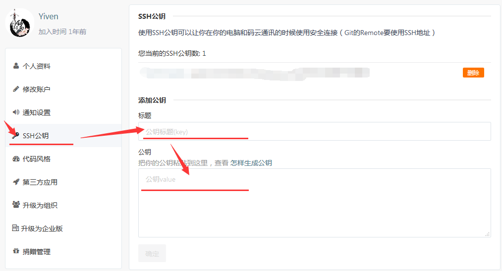

4）添加后，在git bash中输入：ssh -T [git@gitee.com](mailto:git@gitee.com)

第一次绑定的时候输入上边的代码之后会提示是否continue,输入yes后程序会自动连接，如果要求登录，直接输入登录信息即可。

再次执行上面的命令，检查是否成功连接，如果返回如下信息，则表示添加成功

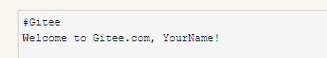

1.  设置用户名密码

git config --global user.name "yourname"

git config --global user.email "youremail@youremail.com"

**4.2.3 Gitee远程仓库使用**

1\. 创建远程仓库

登入Gitee后，点击头像旁边的"+"加号--\>新建项目

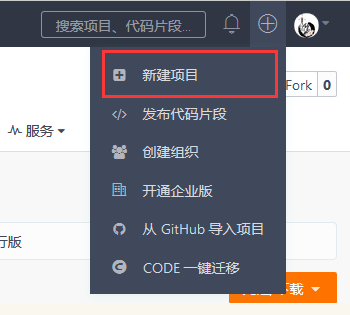

2\. 填写项目基本信息后直接点击创建，这样一个远程仓库就已经创建完成了

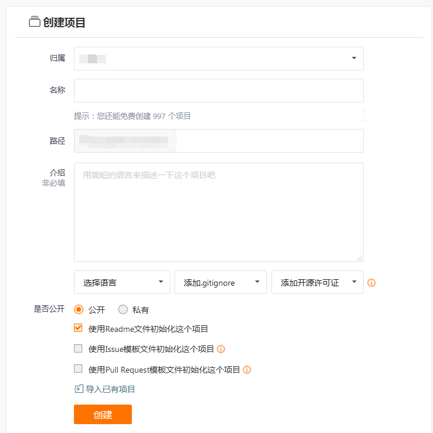

3\. 然后就是将你的远程仓库克隆到本地，或者你可以在本地初始化一个项目后再进行云端绑定。（远程仓库项目克隆到本地仓库）

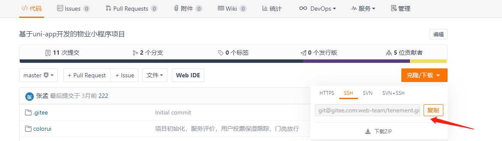

在git bash输入：git clone https://gitee.com/yourname/repository

\#yourname 您在码云或github注册的用户名

\#repository 您创建的远程仓库名称

1.  本地仓库初始化（本地仓库项目提交到远程仓库）
2.  在本地新建一个文件夹
3.  在当前路径打开git bash输入：git init
4.  链接远程仓库：git remote add origin \<远程仓库地址\>
5.  推送到远程仓库

git add . //指定更新内容 . 表示全部更新，test.txt 表示更新指定文件

git commit -m "一些注释说明" //添加更新说明

git push origin master //推送到远程仓库

5\. gitee删除远程仓库

1）点击管理，然后点击仓库设置，再点击删除仓库

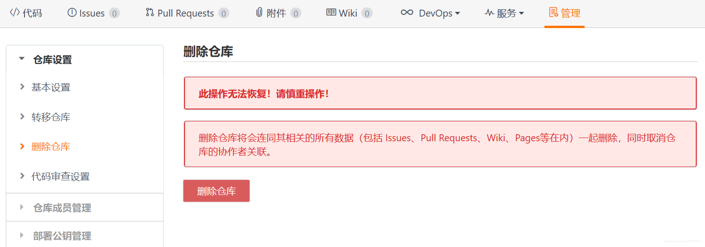

2）点击删除仓库，点击确认删除

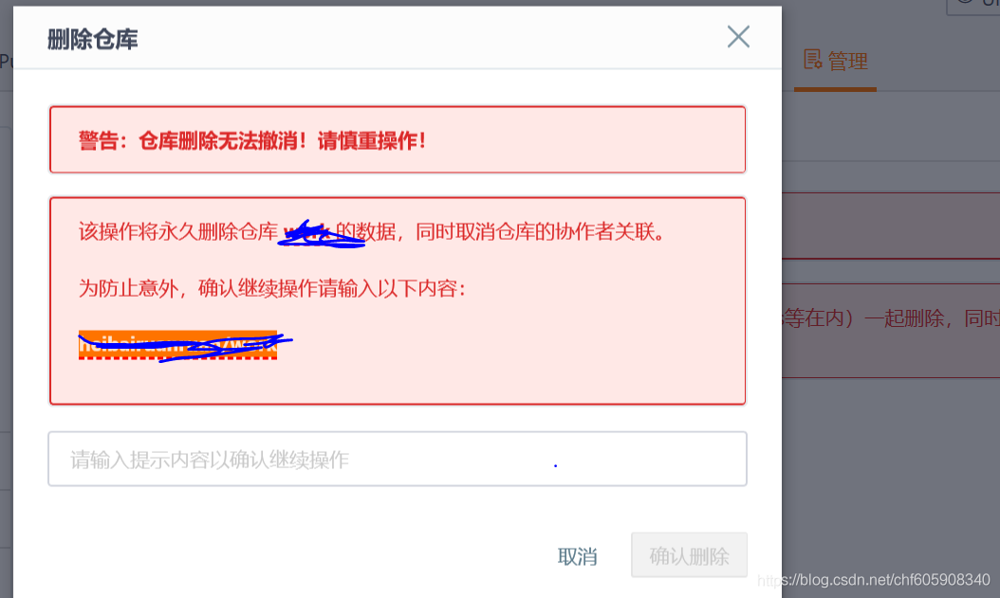

6\. 其余操作同github

### 本节作业

1.  掌握gitee的仓库创建与本地链接
2.  掌握gitee仓库克隆与本地提交方法
3.  掌握gitee远程仓库删除方法
