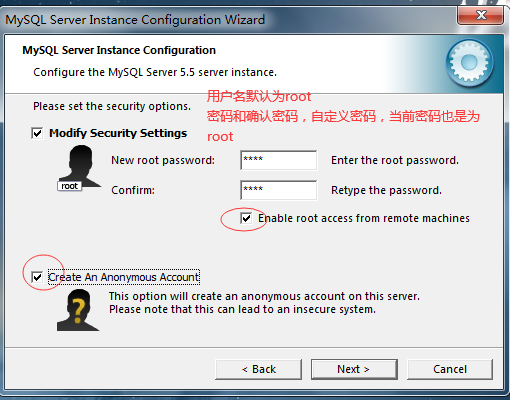
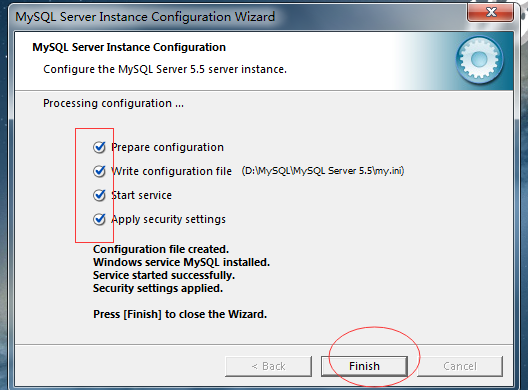

# 第1天【数据库基础知识、MySQL入门、安装及配置】

## 主要内容

1.  掌握数据库基本概念
2.  了解数据库类型及常见数据库
3.  了解MySQL介绍及特点
4.  掌握MySQL数据库产品服务器端的安装与常见配置
5.  熟悉数据库表中列的类型、存储引擎

## 学习目标

| 节数                                                  | 知识点                                       | 要求 |
|-------------------------------------------------------|----------------------------------------------|------|
| 第一节（数据库基础知识）                              | 数据库基础知识                               | 掌握 |
| 第二节（了解数据库类型及常见数据库）                  | 数据库类型及常见数据库                       | 了解 |
| 第三节（了解MySQL介绍及特点）                         | MySQL介绍及特点                              | 了解 |
| 第四节（掌握MySQL数据库产品服务器端的安装与常见配置） | 掌握MySQL数据库产品服务器端的安装与常见配置  | 掌握 |
| 第五节（熟悉数据库表中列的类型、存储引擎）            | 数据库表中列的类型、存储引擎                 | 熟悉 |

## 第一节 数据库基础知识

### 数据(Data)？

**数据的定义：**

描述事物的符号记录。在日常生活中，人们直接用语言来描述事物；在计算机中，为了存储和处理这些事物，就要将事物的特征抽象出来组成一个记录来描述。数据是数据库中存储的基本对象。

**数据的种类：**

文字、图形、图象、声音

**数据的特点：**

数据与其语义是不可分的

**示例：**

-   学生档案中的学生记录

（李白，男，2000，厦门，计算机系，2018）

-   数据的形式不能完全表达其内容
-   数据的解释

语义：学生姓名、性别、出生年、籍贯、所在系别、入学时间

解释：李白是个大学生，2000出生，厦门人，2018年考入计算机系

### 1.2 数据库(Database)

人们收集并抽取出一个应用所需要的大量数据之后，并将其保存起来以供进一步加工处理，进一步抽取有用信息。

数据库的定义：数据库(Database,简称DB)是长期储存在计算机内、有组织的、可共享的大量数据集合

### 1.3 数据库管理系统(DBMS)

-   数据库管理系统（Database Management System，简称DBMS）是位于用户与操作系统之间的一层数据管理软件。通常我们提到的数据库实际上是指数据库管理系统。
-   DBMS的用途：科学地组织和存储数据、高效地获取和维护数据

### 1.4 数据库系统(DBS)

-   数据库系统（Database System），是由数据库及其管理软件组成的系统。
-   数据库系统是为适应数据处理的需要而发展起来的一种较为理想的数据处理系统，也是一个为实际可运行的存储、维护和应用系统提供数据的软件系统，是存储介质 、处理对象和管理系统的集合体。

### 1.5 常见数据库系统DBS

目前DBMS的生产商众多，产品也不尽相同，如：

Oracle公司的Oracle系列；

Microsoft公司的Access系列和SQL Server系列；

IBM公司的DB2；

Sybase公司的Sybase；

还有自由开源的MySQL等等。

NoSQl数据库，Redis，Mongodb等

### 1.6 数据库系统功能

-   数据定义功能：

提供数据定义语言(DDL)

定义数据库中的数据对象

-   数据操纵功能:

提供数据操纵语言(DML)

操纵数据实现对数据库的基本操作

(查询、插入、删除和修改)

-   数据库的运行管理

保证数据的安全性、完整性，多用户对数据的并发使用，发生故障后的系统恢复

-   数据库的建立和维护功能(实用程序)

数据库数据批量装载，数据库转储，介质故障恢复，数据库的重组织

性能监视等

### 本节作业

1.  描述出什么是数据、数据库、数据库管理系统
2.  描述常见的数据库系统

## 第二节 了解数据库类型及常见数据库

### 2.1 数据库类型

按照早期的数据库理论，比较流行的数据库模型有三种，分别为层次式数据库、网状数据库和关系型数据库。而在当今的互联网中，最常见的数据库模型主要是两种，即**SQL关系型数据库**和**NoSQL非关系型数据库**。

**关系型数据库介绍**

关系型数据库模型是把复杂的数据结构归结为简单的二元关系（即二维表格形式）。在关系型数据库中，对数据的操作几乎全部建立在一个或多个关系表格上，通过对这些关联的表格分类、合并、连接或选取等运算来实现数据库的管理。

关系型数据库主要有：Oracle、DB2、Microsoft SQL Server、Microsoft Access、MySQL等等。

**非关系型数据库介绍**

NoSQL，泛指非关系型的数据库。随着互联网web2.0网站的兴起，传统的关系数据库在处理web2.0网站，特别是超大规模和高并发的SNS类型的web2.0纯动态网站已经显得力不从心，出现了很多难以克服的问题，而非关系型的数据库则由于其本身的特点得到了非常迅速的发展。NoSQL数据库的产生就是为了解决大规模数据集合多重数据种类带来的挑战，尤其是大数据应用难题。

非关系型数据库主要有：NoSql、Cloudant、MongoDb、redis、HBase等等。

### 本节作业

1.  了解数据库类型及常见数据库

## 第三节 了解MySQL介绍及特点

### 3.1 MySQL介绍

MySQL是一个真正的多用户、多线程SQL数据库服务器。SQL（结构化查询语言）是世界上最流行的和标准化的数据库语言。MySQL是以一个客户机/服务器结构的实现，它由一个服务器守护程序mysqld和很多不同的客户程序和库组SQL是一种标准化的语言，它使得存储、更新和存取信息更容易。例如，你能用SQL语言为一个网站检索产品信息及存储顾客信息，同时MySQL也足够快和灵活以允许你存储记录文件和图像。

MySQL 主要目标是快速、健壮和易用。最初是因为我们需要这样一个SQL服务器，它能处理与任何在不昂贵硬件平台上提供数据库的厂家在一个数量级上的大型数据库，但速度更快，MySQL就开发出来。自1996年以来，我们一直都在使用MySQL，其环境有超过 40 个数据库，包含 10,000个表，其中500多个表超过7百万行，这大约有100 个吉字节(GB)的关键应用数据。

### 3.2 MySQL特点

MySQL建立的基础是业已用在高要求的生产环境多年的一套实用例程。尽管MySQL仍在开发中，但它已经提供一个丰富和极其有用的功能集。

MySQL的官方发音是“My Ess Que Ell”(不是 MY-SEQUEL )。

具有如下特点：

-   性能好：在RDBMS中，速度就是一切。甚至MySQL的最激烈的批评家都会承认MySQL非常迅速，有时主要指令的执行比他的竞争者都要快。
-   容易使用：MySQL易于使用，初学者在几个小时就可以领会它的基本知识，并且能得到很好的支持；
-   多用户支持： MySQL是一个完全多用户系统，这意味着多个用户可以同时访问和使用一个（或更多个）MySQL数据库。MySQL也包括一个强有力的、灵活的权限系统，它允许管理者使用基于用户和基于主机的认证方案的组合来限制对敏感数据的访问。
-   可移植性：MySQL对UNIX和非UNIX操作系统都适用。
-   开放源代码：MySQL开发者MySQL AB是开放源代码运动的坚定支持者，并且MySQL软件可在GPL下畅通使用。

### 本节作业

1.  了解MySQL及其特点

## 第四节 掌握MySQL数据库产品服务器端的安装与常见配置

### 4.1 安装软件：

### 4.2 安装注意要点：

存储路径：非C，尽量不用空格，路径不要过深，

记住：自定义的密码

服务端口：3306

字符编码设置：utf8

### 4.3 安装服务端教程

运行服务端文件

选择自定义安装路径：

路径选择：

点击Install进行安装：

进行MYSQL数据库配置：

选择默认端口号3306，添加防火墙设置：

设置字符编码格式为UTF8：

添加环境变量配置：

设置自定义密码：建议密码也为root

点击execute

耐心等待....

-   验证数据库服务器是否安装成功？

检查mysql服务器是否启动：

**快捷键win+R打开,输入cmd**

或者

打开cmd终端之后，输入mysql命令：

出现如上提示，表示安装服务器成功。

### 本节作业

1.  掌握MySQL安装和配置

## 第五节 熟悉数据库表中列的类型、存储引擎

### 5.1数据库基础知识

数据库由一批数据构成的有序集合，这些数据被分门别类地存放在一些结构化的数据表（table）里，而数据表之间又往往存在交叉引用的关系，这种关系使数据库又被称为关系型数据库。

### 5.2数据库的基本概念

数据库就是“数据”的“仓库”

数据库由表、关系以及操作对象组成

数据存放在表中

### 5.3 MySQL数据类型

数据类型种类：

-   数值列类型：分为整型和浮点型
-   字符串列类型：由单引号或者双引号括起来的字符或者数字
-   日期和时间列类型：是存储如”2005-1-1” 或者”12:00:00”这样的数值的值
-   NULL值：是一种无类型的值，表示”空，什么也没有

**数值型：**

**字符串类型：**

CHAR和VARCHAR类型

CHAR类型和VARCHAR类型长度范围都是0\~255之间的大小。他们之间的差别在于MySQL处理这个指示器的方式：CHAR把这个大小视为值的准确大小（用空格填补比较短的值，所以达到了这个大小），而VARCHAR类型把它视为最大值并且只使用了存储字符串实际上需要的字节数（增加了一个额外的字节记录长度）。因而，较短的值当被插入一个语句为VARCHAR类型的字段时，将不会用空格填补（然而，较长的值仍然被截短 ）。

**日期时间类型：**

日期和时间：每个时间和日期列类型都有一个零值，当插入非法数值时就用零值来添加

表示日期时必须先按：年，月，日的顺序给出

**DATE ,TIME ,DATETIME**分别是存储日期，时间与日期和时间的组合，其格式为”YYYY-MM-DD”，”hh:mm:ss”和”YYYY-MM-DD hh:mm:ss”，对于DATETIME类型，日期和时间部分都需要

**TIMESTAMP**

时间戳列类型以YYYYMMDDhhmmss的格式来表示值，其取值范围是19700101000000到2037年的某个时间，主要用于记录更改或创建某个记录

**AUTO_INCREMENT**

在需要产生唯一标志符号或者顺序值时候，可用此属性。值一般从1始，每行增加1，在插入NULL到一个AUTO_INCREMENT列时，MySQL会插入一个比该列中当前最大值大1 的值，一个表中最多能有一个有此属性的列。对于想使用此属性的列应该定义为NOT NULL,并定义为PRIMARY KEY 或者定义为UNIQUE键。

举例：create table a(I int auto_increment not null primary key);

**UNSIGNED**

此属性禁用负值，是将数值的取值范围从零开始，即前移了取值范围而已.

举例：Create table test(num tinyint , num2 tinyint unsigned);

**NULL和NOT NULL**

缺省为NULL,即插入值时没有在此字段插入值，默认为NULL值，如果指定了NOT NULL，则必须在插入值时在此字段添入值。

**DEFAULT**

可以通过此属性来指定一个缺省值，即如果没有在此列添加值，那么默认添加此值。

如果指定了ZEROFILL 属性，则用前导零填充数值类型值以达到列的显示宽度。

举例：Create table test2(num int , num2 int default 1, num3 int default null);

### 5.4 数据库存储引擎和区别

数据库存储引擎是数据库底层软件组织，数据库管理系统（DBMS）使用数据引擎进行创建、查询、更新和删除数据。不同的存储引擎提供不同的存储机制、索引技巧、锁定水平等功能，使用不同的存储引擎，还可以获得特定的功能。现在许多不同的数据库管理系统都支持多种不同的数据引擎。**MySQL的核心就是存储引擎。**

存储引擎的选择

不同的存储引擎都有各自的特点，以适应不同的需求，如下表所示：

如果要提供提交、回滚、崩溃恢复能力的事务安全（ACID兼容）能力，并要求实现并发控制，InnoDB是一个好的选择

如果数据表主要用来插入和查询记录，则MyISAM引擎能提供较高的处理效率

如果只是临时存放数据，数据量不大，并且不需要较高的数据安全性，可以选择将数据保存到内存中的Memory引擎，MySQL中使用该引擎作为临时表，存放查询的中间结果

如果只是INSERT和SELECT操作，可以选择Archive,Archive支持高并发的插入操作，但是本身不是事务安全的。Archive非常适合存储归档数据，如记录日志信息可以使用Archive

使用哪一种引擎需要灵活选择，一个数据库中多个表可以使用不同引擎以满足各种性能和实际需求，使用合适的存储引擎，将会提高整个数据库的性能

**存储引擎查看**

mysql给开发者提供了查询存储引擎的功能 show engines

如果想要查看数据库默认使用哪个引擎，可以通过使用命令：show variables like ‘storage_engine’

在MySQL中，不需要再整个服务器中使用同一种存储引擎，针对具体的要求，可以对每一个表使用不同的存储引擎。Support列的值表示某种引擎是否能使用：YES表示可以使用，NO表示不能使用，DEFAULT表示该引擎为当前默认的存储引擎。下面来看一下其他几种的常见的引擎。

**InnoDB存储引擎**

InnoDB是事务型数据库的首选引擎，支持事务安全表（ACID），支持行锁定和外键，InnoDB是默认的MySQL引擎。InnoDB主要特征有：

1.InnoDB给MySQL提供了具有提交、回滚和崩溃恢复能力的事务安全（ACID兼容）存储引擎。InnoDB锁定在行级并且也在SELECT语句中提供一个类似Oracle的非锁定读。这些功能增加了多用户部署和性能。在SQL查询中，可以自由地将InnoDB类型的表和其他Mysql的表类型混合起来，甚至在同一个查询中也可以混合。

2.InnoDB是为处理大数据量的最大性能设计。它的CPU效率可能是任何其他基于磁盘的关系型数据库引擎锁不能匹敌的

3.InnoDB存储引擎完全与Mysql服务器整合，InnoDB存储引擎为在主内存中缓存数据和索引而维护它自己的缓存池。InnoDB将它的表和索引在一个逻辑表空间中，表空间可以包含数个文件（或原始磁盘文件）。这与MyISAM表不同，比如在MyISAM表中每个表被存放分离的文件中。InnoDB表可以是任何尺寸，即使在文件尺寸被现在为2GB的操作系统上。

4.InnoDB支持外键完整性约束，存储表中的数据时，每张表的存储都按主键存放，如果没有显示在表定义时指定主键，InnoDB会为每一行生成一个6字节的ROWID,并以此作为主键

5.InnoDB被用在众多需要高性能的大型数据库站点上。

InnoDB不创建目录，使用InnoDB时，MySQL将在Mysql数据目录下创建一个名为ibdata1的10M大小的自动扩展数据文件，以及两个名为ib_logfile()和lib_logfile1的5M大小的日志文件

**MyISAM存储引擎**

MyISAM基于ISAM存储引擎，并对其进行扩展。它是在Web、数据仓储和其他应用环境下最常使用的存储引擎之一。MyISAM拥有较高的插入、查询速度，但不支持事务。MyISAM主要特征有：

1.大文件（达到63位文件长度）在支持大文件的文件系统和操作系统上被支持。

2.当把删除和更新及插入操作混合使用的时候，动态尺寸的行产生更少碎片。这要通过合并相邻被删除的块，以及若下一个块被删除，就扩展到下一块自动完成

3.每个MyISAM表最大索引数是64，这可以通过重新编译来改变。每个索引最大的列数是16

4.最大的键长度是1000字节，这也可以通过编译来改变，对于键长度超过250字节的情况，一个超过1024字节的键将被用上

5.BLOB和TEXT列可以被索引

6.NULL被允许在索引的列中，这个值占每个键的0\~1个字节

7.所有数字键值以高字节优先被存储以允许一个更高的索引压缩

8.每个MyISAM类型的表都有一个AUTO_INCREMENT的内部列，当INSERT和UPDATE操作的时候该列被更新，同时AUTO_INCREMENT列将刷新。所以说，MyISAM类型表的AUTO_INCREMENT列更新比InnoDB类型的AUTO_INCERMENT更快

9.可以吧数据文件和索引文件放在不同目录

10.每个字符列可以有不同的字符集

11.有varchar的表可以固定或动态记录长度

12.varchar和char列可以多达64KB

使用MyISAM引擎创建数据库，将产生3个文件。文件的名称以表名字开始，扩展名之处文件类型：frm文件存储表定义、数据文件的扩展名为MYD（MYData）、索引文件的扩展名时，MYI(MYIndex)

**MEMORY存储引擎**

MEMORY存储引擎将表中的数据存储到内存中，未查询和引用其他表数据提供快速访问。MEMORY主要特性有：

1.MEMORY表的每个表可以有多达32个索引，每个索引16列，以及500字节的最大键长度

2.MEMORY存储引擎执行HASH和BTREE缩影

3.可以在一个MEMORY表中有非唯一键值

4.MEMORY表使用一个固定的记录长度格式

5.MEMORY不支持BLOB或者TEXT列

6、MEMORY支持AUTO_INCREMENT列和对可包含NULL值的列的索引

7、MEMORY表在所由客户端之间共享（就像其他任何非TEMPORARY表）

8、MEMORY表内存被存储在内存中，内存是MEMORY表和服务器在查询处理时的空闲中，创建的内部表共享

9、当不再需要MEMORY表的内容时，要释放被MEMORY表使用的内存，应该执行DELETE FROM或TRUNCATE TABLE，或者删除整个表（使用DROP TABLE）

### 本节作业

1.  掌握MYSQL数据库表的列类型
2.  熟悉数据库存储引擎和区别
