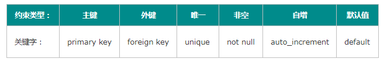
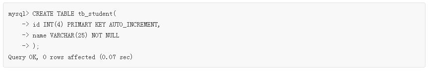
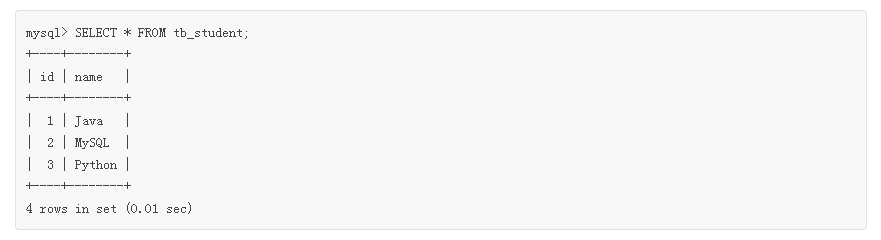
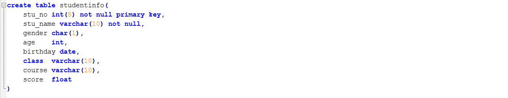
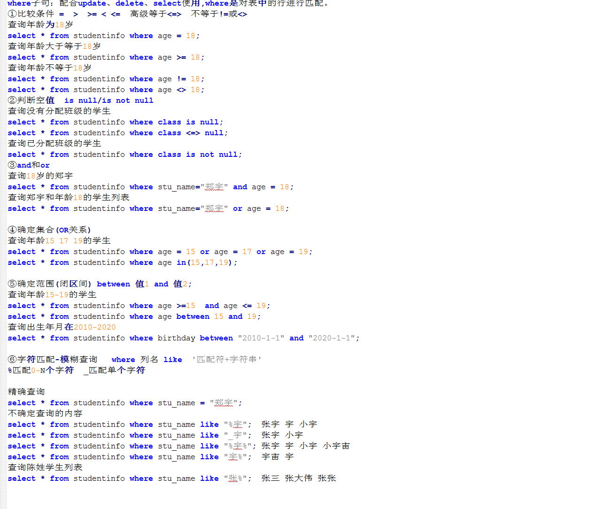
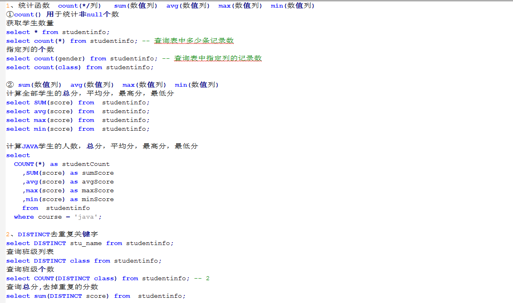

# 第2天【表约束、内置函数】

## 主要内容

1.  熟练掌握MySQL支持的主键约束、唯一约束、非空约束、默认值约束、自增约束、外键约束的使用
2.  熟悉where条件语句的使用
3.  掌握常用内置函数的使用

## 学习目标

| 节数                          | 知识点              | 要求 |
|-------------------------------|---------------------|------|
| 第一节（约束）                | MySQL约束           | 熟练 |
| 第二节（where条件语句的使用） | where条件语句的使用 | 熟悉 |
| 第三节（常用内置函数）        | 内置函数            | 掌握 |

## 第一节MySQL约束

### 约束分类

约束是一种限制，它通过对表的行或列的数据做出限制，来确保表的数据的完整性、唯一性。

MYSQL中，常用的几种约束：

### 主键约束primary key

主键约束相当于 唯一约束 + 非空约束 的组合，主键约束列不允许重复，也不允许出现空值。

每个表最多只允许一个主键，建立主键约束可以在列级别创建，也可以在表级别创建。

当创建主键的约束时，系统默认会在所在的列和列组合上建立对应的唯一索引。

\-- 基本模式

create table temp(

id int primary key,

name varchar(20)

);

\-- 组合模式

create table temp(

id int ,

name varchar(20),

pwd varchar(20),

primary key(id, name)

);

\-- 删除主键约束

alter table temp drop primary key;

\-- 添加主键约束

alter table temp add primary key(id,name);

\-- 修改主键约束

alter table temp modify id int primary key；

### 1.3 唯一约束unique

唯一约束是指定table的列或列组合不能重复，保证数据的唯一性。

唯一约束不允许出现重复的值，但是可以为多个null。

同一个表可以有多个唯一约束，多个列组合的约束。

在创建唯一约束时，如果不给唯一约束名称，就默认和列名相同。

唯一约束不仅可以在一个表内创建，而且可以同时多表创建组合唯一约束。

\-- 创建表时设置，表示用户名、密码不能重复

create table temp(

id int not null ,

name varchar(20),

password varchar(10),

unique(name,password)

);

\-- 添加唯一约束

alter table temp add unique (name, password);

\-- 修改唯一约束

alter table temp modify name varchar(25) unique;

\-- 删除约束

alter table temp drop index name;

### 1.4 非空约束和默认值约束

非空约束用于确保当前列的值不为空值，非空约束只能出现在表对象的列上。

Null类型特征：所有的类型的值都可以是null，包括int、float 等数据类型

\-- 创建table表，ID 为非空约束，name 为非空约束 且默认值为abc

create table temp(

id int not null,

name varchar(255) not null default 'abc',

sex char null

)；

\-- 增加非空约束

alter table temp

modify sex varchar(2) not null;

\-- 取消非空约束

alter table temp modify sex varchar(2) null;

\-- 取消非空约束，增加默认值

alter table temp modify sex varchar(2) default 'abc' null;

### 1.5 自增约束

通过给字段添加 **AUTO_INCREMENT** 属性来实现主键自增长。语法格式如下：

字段名 数据类型 AUTO_INCREMENT

-   默认情况下，AUTO_INCREMENT 的初始值是 1，每新增一条记录，字段值自动加 1。
-   一个表中只能有一个字段使用 AUTO_INCREMENT 约束，且该字段必须有唯一索引，以避免序号重复（即为主键或主键的一部分）。
-   AUTO_INCREMENT 约束的字段必须具备 NOT NULL 属性。
-   AUTO_INCREMENT 约束的字段只能是整数类型（TINYINT、SMALLINT、INT、BIGINT 等）。
-   AUTO_INCREMENT 约束字段的最大值受该字段的数据类型约束，如果达到上限，AUTO_INCREMENT 就会失效。

例子：定义数据表 tb_student，指定表中 id 字段递增，SQL 语句和运行结果如下：

上述语句执行成功后，会创建名为 tb_student 的数据表。其中，id 为主键，每插入一条新记录，id 的值就会在前一条记录的基础上自动加 1。name 为非空字段，该字段的值不能为空值（NULL）。  
向 tb_student 表中插入数据，SQL 语句如下所示：

语句执行完后，tb_student 表中增加了 3 条记录，在这里并没有输入 id 的值，但系统已经自动添加该值，使用 SELECT 命令查看记录，如下所示。

### 1.6 外键约束foreign key

外键约束是保证一个或两个表之间的参照完整性，外键是构建于一个表的两个字段或是两个表的两个字段之间的参照关系

\-- 基本模式

\-- 主表

create table temp(

id int primary key,

name varchar(20)

);

\-- 副表

create table temp2(

id int,

name varchar(20),

classes_id int,

foreign key(id) references temp(id)

);

\-- 多列外键组合，必须用表级别约束语法

\-- 主表

create table classes(

id int,

name varchar(20),

number int,

primary key(name,number)

);

\-- 副表

create table student(

id int auto_increment primary key,

name varchar(20),

classes_name varchar(20),

classes_number int,

/\*表级别联合外键\*/

foreign key(classes_name, classes_number) references classes(name, number)

);

\-- 删除外键约束

alter table student drop foreign key student_id;

\-- 增加外键约束

alter table student add foreign key(classes_name, classes_number) references classes(name, number);

### 本节作业

1.  掌握多种约束的使用

## 第二节where条件语句的使用

### 2.1 where条件语句作用

**作用：**检索数据记录中符合条件的行

**注意：**搜索的条件由一个或者多个表达式组成

### 2.2 where查询条件分类

| 查询条件 | 谓词                | 作用                         |
|----------|---------------------|------------------------------|
| 比较     | =                   | 相等                         |
|          | \<=\>               | 高级等于                     |
|          | \>                  | 大于                         |
|          | \<                  | 小于                         |
|          | \>=                 | 大于或等于                   |
|          | \<=                 | 小于或等于                   |
|          | \<\>或!=            | 不等于                       |
| 确定范围 | BETWEEN 值1 AND 值2 | 在值1和值2之间，包含值1和值2 |
| 确定集合 | IN                  | 在指定的集合中               |
| 字符匹配 | LIKE                | 与指定的模式串匹配           |
| 空值     | IS NULL             | 为空                         |
|          | IS NOT NULL         | 不为空                       |
| 多重条件 | NOT                 | 与其它条件组合，表式反意     |
|          | AND                 | 使多个条件同时满足（交集）   |
|          | OR                  | 多个条件之一满足（并集）     |

### 2.3 代码演示

表结构：

查询条件：

### 本节作业

1.  掌握where条件语句的使用
2.  完成单表具有查询条件的操作

## 第三节 常用内置函数

### 3.1 聚合函数

SQL提供的统计函数称为聚合函数.

主要的聚合函数：

COUNT(col)

返回指定列中非NULL值的个数

AVG(col)

返回指定数值列的平均值

MIN(col)

返回指定数值列的最小值

MAX(col)

返回指定数值列的最大值

SUM(col)

返回指定数值列的所有值之和

**以上函数均可以同DISTINCT连用**

### 3.2 代码演示

### 3.2 日期时间相关函数

-   获得当前日期+时间函数：now()

mysql\> select now();

\+---------------------+

\| now() \|

\+---------------------+

\| 2020-09-23 22:20:46 \|

\+---------------------+

-   获得当前时间戳函数：current_timestamp, current_timestamp()

mysql\> select current_timestamp, current_timestamp();

\+---------------------+---------------------+

\| current_timestamp \| current_timestamp() \|

\+---------------------+---------------------+

\| 2020-09-23 23:22:24 \|2020-09-23 23:22:24 \|

\+---------------------+---------------------+

-   日期/时间转换为字符串函数：date_format(date,format), time_format(time,format)

mysql\> select date_format('2020-09-23 22:23:01', '%Y%m%d%H%i%s');

\+----------------------------------------------------+

\| date_format('2020-09-23 22:23:01', '%Y%m%d%H%i%s') \|

\+----------------------------------------------------+

\| 20200923222301 \|

\+----------------------------------------------------+

MySQL 日期、时间转换函数：date_format(date,format), time_format(time,format) 能够把一个日期/时间转换成各种各样的字符串格式。它是 str_to_date(str,format) 函数的 一个逆转换。

-   字符串转换为日期）函数：str_to_date(str, format)

select str_to_date('08/09/2008', '%m/%d/%Y'); -- 2008-08-09

select str_to_date('08/09/08' , '%m/%d/%y'); -- 2008-08-09

select str_to_date('08.09.2008', '%m.%d.%Y'); -- 2008-08-09

select str_to_date('08:09:30', '%h:%i:%s'); -- 08:09:30

select str_to_date('08.09.2008 08:09:30', '%m.%d.%Y %h:%i:%s'); -- 2008-08-09 08:09:30

可以看到，str_to_date(str,format) 转换函数，可以把一些杂乱无章的字符串转换为日期格式。

### 本节作业

1.  掌握常用内置函数的使用
2.  完成单表操作
