# 第3天【多表连接查询、子查询、联合查询、分页查询】

## 主要内容

1.  掌握多表关联查询之内连接语法
2.  掌握多表关联查询之外连接语法
3.  了解自连接查询的使用
4.  了解子查询的使用
5.  了解联合查询的使用
6.  掌握分页查询的实现

## 学习目标

| 节数                                | 知识点                   | 要求 |
|-------------------------------------|--------------------------|------|
| 第一节（多表关联查询之内连接语法）  | 多表关联查询之内连接语法 | 掌握 |
| 第二节（多表关联查询之外连接语法）  | 多表关联查询之外连接语法 | 掌握 |
| 第三节（自连接查询的使用）          | 自连接查询的使用         | 了解 |
| 第四节（子查询的使用）              | 子查询的使用             | 了解 |
| 第五节（联合查询的使用）            | 联合查询的使用           | 了解 |
| 第六节（分页查询的实现）            | 分页查询的实现           | 掌握 |

## 第一节 多表关联查询之内连接语法

### 内连接INNER JOIN

概述：MySQL INNER JOIN获取两个表中字段匹配关系的记录

语法如下：

SELECT column_list

FROM t1

INNER JOIN t2 ON join_condition1

INNER JOIN t3 ON join_condition2...

WHERE where_conditions;

### 内连接代码演示

如下两张表：

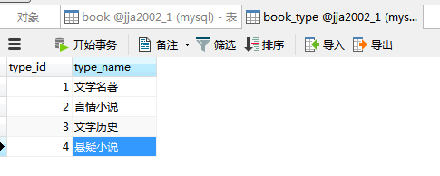

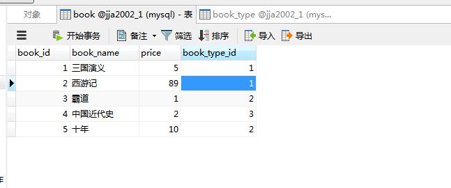

示例：

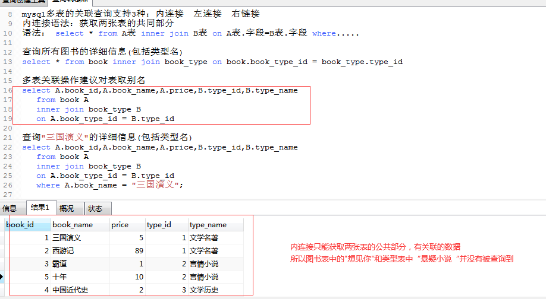

### 本节作业

1.  掌握内连接语法
2.  完成多表的关联查询

## 第二节 多表关联查询之外连接语法

### 2.1 左连接LEFT JOIN

概述： 指将左表的所有记录与右表符合条件的记录，返回的结果除内连接的结果，还有左表不符合条件的记录，并在右表相应列中填NULL。

语法如下：

SELECT column_list

FROM t1

LEFT JOIN t2 ON join_condition1

LEFT JOIN t3 ON join_condition2...

WHERE where_conditions;

### 2.2 代码演示

如下两张表：

示例：

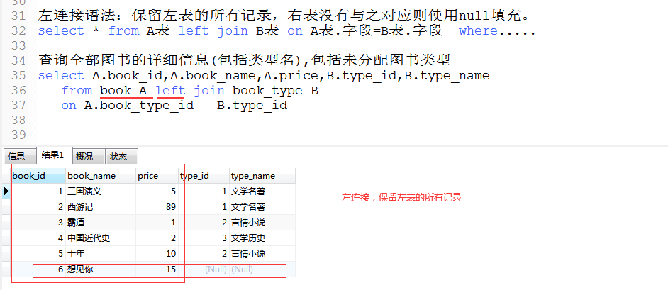

### 2.3 右连接RIGHT JOIN

概述： 指将右表的所有记录与左表符合条件的记录，返回的结果除内连接的结果，还有右表不符合条件的记录，并在左表相应列中填NULL。

语法如下：

SELECT column_list

FROM t1

RIGHT JOIN t2 ON join_condition1

RIGHT JOIN t3 ON join_condition2...

WHERE where_conditions;

### 2.4 代码演示

如下两张表：

示例：

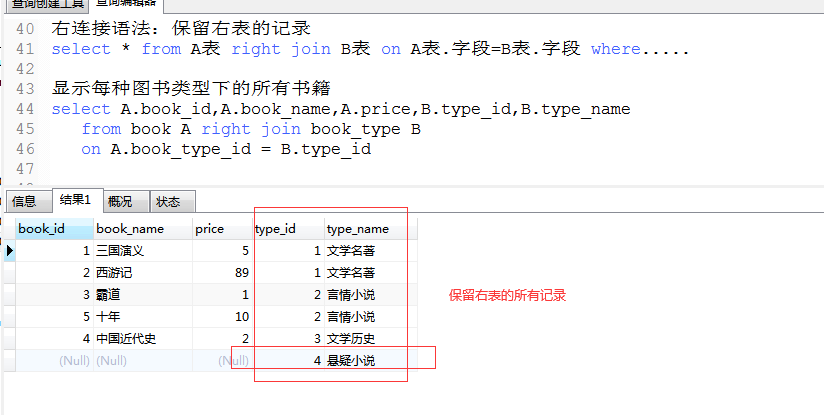

### 本节作业

1.  掌握左连接和右连接连接语法
2.  完成多表的关联查询

## 自连接查询的使用

### 3.1 自连接查询

概述： 自连接就是一个表和它自身进行连接，是多表连接的特殊情况。  
在自连接查询中，要先在FROM字句中为表分别定义两个不同的别名，  
然后使用这两个别名写出一个连接条件。

### 3.2代码演示

示例1：查询课程类别相同但是开课系部不同的课程信息  
\-- 要求显示课程编号、课程名称、课程类别与系部  
\-- 编号，并按照课程编号升序排列查询结果。

SELECT DISTINCT c1.CouNo 课程编号, c1.CouName 课程名称,   
 c1.Kind 课程类别, c1.DepartNo 系部编号  
FROM Course c1 JOIN Course c2 ON c1.Kind=c2.Kind AND c1.DepartNo!=c2.DepartNo  
ORDER BY c1.CouNo;

### 本节作业

1.  了解自连接查询的使用

## 子查询的使用

### 4.1 子查询

概述：子查询是将一个 SELECT 语句的查询结果作为中间结果，供另一个 SQL 语句调用

### 4.2代码演示

子查询没有固定的语法，一个子查询的例子如下：

SELECT \* FROM article WHERE uid IN(SELECT uid FROM user WHERE status=1)

对应的两个数据表如下：  
article 文章表:

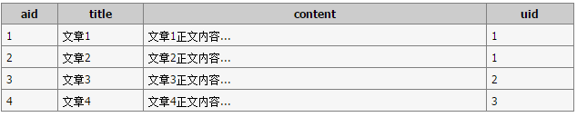

user 用户表:

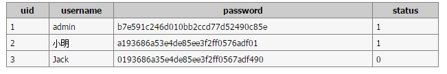

查询返回结果如下所示：

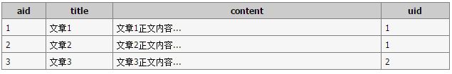

在该例子中，首先通过子查询语句查询出所有 status=1 的 uid，实际的查询类似于：

SELECT \* FROM article WHERE uid IN(1,2)

### 本节作业

1.  了解子查询的使用

## 联合查询的使用

### 5.1 UNION

UNION 用于合并两个或多个 SELECT 语句的结果集，并消去表中任何重复行。UNION 内部的 SELECT 语句必须拥有相同数量的列，列也必须拥有相似的数据类型。同时，每条 SELECT 语句中的列的顺序必须相同.

SQL UNION 语法：

SELECT column_name FROM table1

UNION

SELECT column_name FROM table2

### 5.2 UNION ALL

UNION 用于合并两个或多个 SELECT 语句的结果集，保留表中任何重复行。UNION 内部的 SELECT 语句必须拥有相同数量的列，列也必须拥有相似的数据类型。同时，每条 SELECT 语句中的列的顺序必须相同.

SQL UNION ALL语法：

SELECT column_name FROM table1

UNION ALL

SELECT column_name FROM table2

### 5.3代码演示

第一个结果集

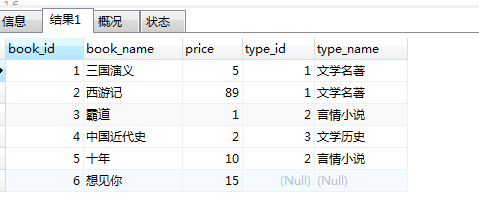

第二个结果集

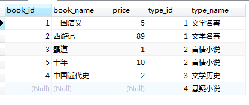

将两个结果集合并

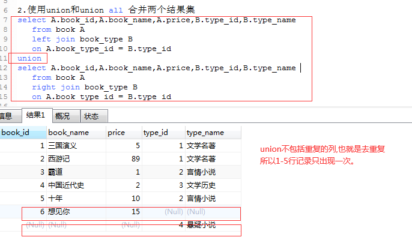

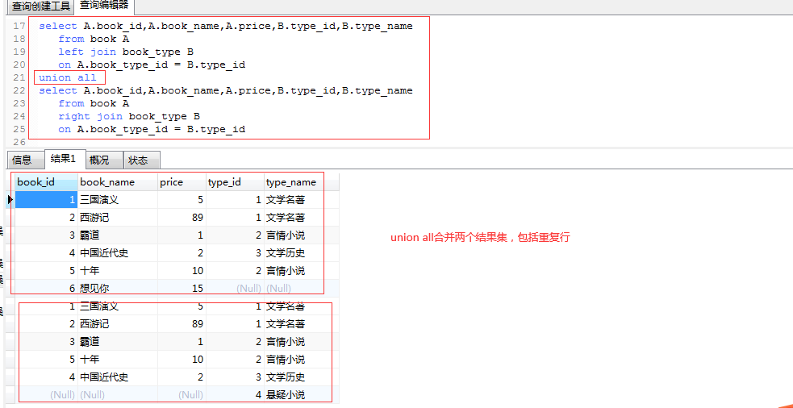

### 本节作业

1.  了解联合查询的使用
2.  了解UNION和UNION ALL区别

## 分页查询的使用

### LIMIT

概述：在MySQL中，分页查询通常使用limit子句实现，用于指定 SELECT 语句返回的记录数。

需注意以下几点：

1.  第一个参数指定第一个返回记录行的偏移量
2.  第二个参数指定返回记录行的最大数目

3、如果只给定一个参数：它表示返回最大的记录行数目

4、第二个参数为 -1 表示检索从某一个偏移量到记录集的结束所有的记录行

5、初始记录行的偏移量是0(而不是 1)

语法：

select 列1，列2 from 表 where .... limit a，b

### 6.2代码演示

mysql\> SELECT \* FROM table LIMIT 5,10; // 检索记录行 6-15

//为了检索从某一个偏移量到记录集的结束所有的记录行，可以指定第二个参数为 -1：

mysql\> SELECT \* FROM table LIMIT 95,-1; // 检索记录行 96-last.

//如果只给定一个参数，它表示返回最大的记录行数目：

mysql\> SELECT \* FROM table LIMIT 5; //检索前 5 个记录行

//换句话说，LIMIT n 等价于 LIMIT 0,n。

//总条数13条，每页显示3条，总页数5页

//显示第一页：

select \* from studentinfo limit 0,3;

//显示第二页：

select \* from studentinfo limit 3,2;

//显示第三页：

select \* from studentinfo limit 6,2;

//显示第四页：

select \* from studentinfo limit 9,2;

//显示第五页：

select \* from studentinfo limit 12,2;

### 本节作业

1.  掌握分页查询的使用
2.  掌握单表或多表的分页查询
