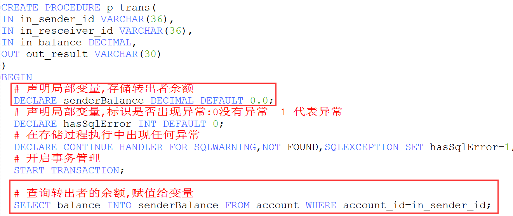

# 第4天【Mysql高级应用】

## 主要内容

1、索引的设计和使用

2、视图的使用

3、存储过程的使用

4、触发器的使用

5、事务及其特征

6、事务的操作

7、事务的隔离级别

## 学习目标

| 节数               | 知识点                         | 要求 |
|--------------------|--------------------------------|------|
| 第一节（索引）     | 索引的设计和使用               | 熟悉 |
| 第二节（视图）     | 视图的使用                     | 掌握 |
| 第三节（存储过程） | 存储过程的使用                 | 熟悉 |
| 第四节（触发器）   | 触发器的使用                   | 了解 |
| 第五节（事务）     | 事务及特征、操作事务、隔离级别 | 掌握 |

## 第一节 索引的设计和使用

### What索引? Why索引？

索引是帮助MySQL高效获取数据的数据结构（有序）。

为什么要用索引？

MySQL索引的建立对于MySQL的高效运行是很重要的，索引可以大大提高MySQL的检索速度。

实际上，索引也是一张表，该表保存了主键与索引字段，并指向实体表的记录。

### 1.2索引类型

Mysql目前主要有以下几种索引类型：FULLTEXT，HASH，BTREE，RTREE。

BTree 索引： 最常见的索引类型，大部分索引都支持 BTree索引。

Hash 索引：只有Memory引擎支持 ， 使用场景简单 。

R-tree 索引（空间索引）：空间索引是MyISAM引擎的一个特殊索引类型，主要用于地理空间数据类型，通常使用较少。

Full-text （全文索引）：全文索引也是MyISAM的一个特殊索引类型，主要用于全文索引，InnoDB从Mysql5.6版本开始支持全文索引

### 1.3索引分类

普通索引：仅加速查询

唯一索引：加速查询 + 列值唯一（可以有null）

主键索引：加速查询 + 列值唯一（不可以有null）+ 表中只有一个

组合索引：多列值组成一个索引，专门用于组合搜索，其效率大于索引合并

全文索引：对文本的内容进行分词，进行搜索

### 1.4查看索引

SHOW INDEX FROM 表名;

### 1.5删除索引

DROP INDEX 索引名 ON 表名

### 1.6创建索引

创建索引时，你需要确保该索引是应用在 SQL 查询语句的条件(一般作为 WHERE 子句的条件)。

**语法：**

CREATE [UNIQUE\|FULLTEXT\|SPATIAL] INDEX 索引名 -- [..]不写的话就是普通索引

[USING 索引类型]*\#如果不指定则为B+Tree*

ON 表名(列名,...)

例：给city表的city_name列创建索引

CREATE INDEX index_city_cityname ON city(city_name);

### 1.7使用ALTER 命令添加索引

### 1.8使用explain分析执行计划

查询SQL语句的执行计划 ： EXPLAIN SELECT \* FROM employees;

### 1.9使用show profile分析SQL执行时间

通过show profiles，我们能够更清楚地了解SQL执行的过程。

通过show profile for query query_id查看具体某一条sql语句的执行各个阶段耗时：

分析计划具体知识查看该博文：

<https://blog.csdn.net/qq_41112238/article/details/104004400?utm_medium=distribute.pc_relevant.none-task-blog-BlogCommendFromBaidu-13.nonecase&depth_1-utm_source=distribute.pc_relevant.none-task-blog-BlogCommendFromBaidu-13.nonecase>

### 示例1：

通过 EXPLAIN或者 DESC命令获取 MySQL如何执行 SELECT 语句的信息，包括在 SELECT 语句执行过程中表如何连接和连接的顺序以及使用的索引信息。

### 索引的示例：验证索引对查询效率的提升

创建test表

利用存储过程给test表插入约5000条记录

其中id字段不是主键，也没有设置任何索引，查询id为4999的记录

给id添加索引后，再次查询id字段为4999的记录，可见查询时间变少了（如果数据更多体现的越明显，插入数据太耗时，所以我只插入了5000条）。

### 本节作业

1.  掌握索引概念
2.  掌握索引类型
3.  掌握索引的创建方式
4.  掌握删除索引与查看索引
5.  掌握使用explain分析执行计划
6.  掌握使用show profile分析SQL执行时间

## 第二节 视图的使用

### 2.1含义：

MySQL从5.0.1版本开始提供的功能，是一种虚拟存在的表，行和列的数据来自定义视图的查询中使用的表，并且是在使用视图时动态生成的，只保存了sql逻辑，不保存查询结果。

数据库中只存放了视图的定义，并没有存放视图中的数据，这些数据都存放在定义视图查询所引用的真实表中。使用视图查询数据时，数据库会从真实表中取出对应的数据。因此，视图中的数据是依赖于真实表中的数据的。一旦真实表中的数据发生改变，显示在视图中的数据也会发生改变。

### 2.2应用场景：

多个地方用到相同的查询结果。

该查询结果使用的sql语句比较复杂。

### 2.3好处：

1.实现了sql语句的重用

2.简化了复杂的sql操作，不必知道其细节

3.保护数据，提高安全性

### 2.4创建视图

CREATE VIEW 视图名 AS 查询语句;

### 2.5删除视图

DROP VIEW 视图名1,视图名2...;

### 2.6使用视图

SELECT ... FROM 视图名;

SELECT ... FROM 视图名 WHERE ...;

### 2.7示例：列出流水表详细信息

\-- 创建账号表

CREATE TABLE account(

account_id VARCHAR(36) PRIMARY KEY, -- 使用UUID生成唯一值

account_name VARCHAR(15) NOT NULL,

balance DECIMAL(10,2) NOT NULL,

reg_date DATE NOT NULL

);

\-- 插入两条记录到账号表

INSERT INTO account(account_id,account_name,balance,reg_date) VALUES(UUID(),'张三',1000,CURDATE());

INSERT INTO account(account_id,account_name,balance,reg_date) VALUES(UUID(),'李四',2000,CURDATE());

\-- 创建流水表

create table transrecord(

trans_id varchar(36) primary key, -- 使用UUID_SHORT函数生成唯一值

sender_id varchar(36),

receiver_id varchar(36),

trans_balance decimal(10,2),

trans_datetime datetime

);

\-- 插入测试记录到账号表 李四---\>张三

INSERT INTO transrecord(trans_id,sender_id,receiver_id,trans_balance,trans_datetime)

VALUES(

UUID_SHORT(),

'c4e53b58-b9cb-11ea-9b84-1c1b0d2201ac',

'c4da15e0-b9cb-11ea-9b84-1c1b0d2201ac',

200,

SYSDATE());

INSERT INTO transrecord(trans_id,sender_id,receiver_id,trans_balance,trans_datetime)

VALUES(

UUID_SHORT(),

'c4e53b58-b9cb-11ea-9b84-1c1b0d2201ac',

'c4da15e0-b9cb-11ea-9b84-1c1b0d2201ac',

100,

SYSDATE());

#### 2.7.1创建视图,查询流水账详情

#### 2.7.2使用视图

#### ①查询流水账详情

#### ②查询指定用户的转出详情

#### ③查询指定用户的转入详情

### 本节作业

1.  掌握视图的概念
2.  掌握视图的创建
3.  掌握删除视图与视图的使用

## 第三节 存储过程的使用

### 3.1含义

我们前面所学习的 MySQL 语句都是针对一个表或几个表的单条 SQL 语句，但是在数据库的实际操作中，经常会有需要多条 SQL 语句处理多个表才能完成的操作。

例如，为了确认学生能否毕业，需要同时查询学生档案表、成绩表和综合表，此时就需要使用多条 SQL 语句来针对这几个数据表完成处理要求。

存储过程是一组为了完成特定功能的 SQL 语句集合。使用存储过程的目的是将常用或复杂的工作预先用 SQL 语句写好并用一个指定名称存储起来，这个过程经编译和优化后存储在**数据库服务器中**，因此称为存储过程。当以后需要数据库提供与已定义好的存储过程的功能相同的服务时，只需调用“CALL存储过程名字”即可自动完成。

对于调用者来说，存储过程封装了 SQL 语句，调用者无需考虑逻辑功能的具体实现过程。只是简单调用即可，它可以被 Java 和 C\# 等编程语言调用。

### 3.2好处：

提高代码重用性、简化操作、减少编译次数，减少和数据库连接次数

### 3.3创建语法

可以使用 **CREATE PROCEDURE** 语句创建存储过程。

语法格式如下：

CREATE PROCEDURE 存储过程名(过程参数列表)

BEGIN

sql语句...

END

过程参数列表包含三部分： 参数模式 参数名 参数类型

过程参数列表格式：[ IN \| OUT \| INOUT ] \<参数名\> \<类型\>

例： IN NAME VARCHAR

#### 1) 过程名

存储过程的名称，默认在当前数据库中创建。若需要在特定数据库中创建存储过程，则要在名称前面加上数据库的名称，即 db_name.sp_name。需要注意的是，名称应当尽量避免选取与 MySQL 内置函数相同的名称，否则会发生错误。

#### 2) 过程参数

存储过程的参数列表。其中，\<参数名\>为参数名，\<类型\>为参数的类型（可以是任何有效的 MySQL 数据类型）。当有多个参数时，参数列表中彼此间用逗号分隔。存储过程可以没有参数（此时存储过程的名称后仍需加上一对括号），也可以有 1 个或多个参数。

MySQL 存储过程支持三种类型的参数，即输入参数、输出参数和输入/输出参数，分别用 IN、OUT 和 INOUT 三个关键字标识。其中，输入参数可以传递给一个存储过程，输出参数用于存储过程需要返回一个操作结果的情形，而输入/输出参数既可以充当输入参数也可以充当输出参数。

需要注意的是，参数的取名不要与数据表的列名相同，否则尽管不会返回出错信息，但是存储过程的 SQL 语句会将参数名看作列名，从而引发不可预知的结果。

#### 3) 过程体

存储过程的主体部分，也称为存储过程体，包含在过程调用的时候必须执行的 SQL 语句。这个部分以关键字 BEGIN 开始，以关键字 END 结束。若存储过程体中只有一条 SQL 语句，则可以省略 BEGIN-END 标志。

### 3.4调用**语法：**

CALL 存储过程名(实参列表);

### 示例1：无参数的存储过程

### 批量插入

Loop:

Repeat:

### 示例2：有in和out参数的存储过程

练习:根据账户编号,返回账户余额,用户等级

\-- 余额\>=2000,显示用户等级'砖石会员'

\-- 余额\>=1500,显示用户等级'铂金会员'

\-- 余额\>=1000,显示用户等级'黄金会员'

\-- 余额\>=500,显示用户等级'大众会员'

### 示例3：用户表、转账记录表、测试表等多张表的统计分析

示例3：用户表、转账记录表、测试表等多张表的统计分析

CREATE PROCEDURE p_trans_analyse(out account_count INT,out transrecord_count INT,out test_count INT)

BEGIN

SELECT COUNT(\*) into account_count FROM account;

SELECT COUNT(\*) into transrecord_count FROM transrecord;

SELECT COUNT(\*) into test_count FROM test;

END

测试：

CALL p_trans_analyse(@account_count,@transrecord_count,@test_count);

SELECT @account_count,@transrecord_count,@test_count;

### 示例4：存储过程+事务+异常处理模拟转账

入参:转出者id, 转入者id, 转账金额

出参:转账结果

声明局部变量,标识是否出现异常:0没有异常 1 代表异常

在存储过程执行中出现任何异常

DECLARE CONTINUE HANDLER FOR SQLWARNING,NOT FOUND,SQLEXCEPTION SET 变量=1;

存储过程中的异常处理

具体请查看：https://www.cnblogs.com/geaozhang/p/6814567.html

如果SQL出现异常,则会事务回滚，并且返回”系统异常,转账失败”;

### 练习：拓展转账存储过程

加入判断转账用户是否余额足够,若余额不足,则事务回滚，并提示”余额不足，转账失败!”

### 3.5 JAVA中如何调用存储过程

### 示例1：模拟转账

### 示例2：查询结果集

### 本节作业

1.掌握存储过程的创建方式

2.掌握转账存储过程案例

3.掌握JAVA中如何调用存储过程

## 第四节 触发器

### 4.1概念：

触发器是与表有关的数据库对象，指在 insert/update/delete 之前或之后，触发并执行触发器中定义的SQL语句集合。

触发器的这种特性可以协助应用在数据库端确保数据的完整性 , 日志记录 , 数据校验等操作 。

#### 特殊两张表

使用别名 OLD 和 NEW 来引用触发器中发生变化的记录内容，这与其他的数据库是相似的。现在触发器还只支持行级触发 for each row，不支持语句级触发。

Insert动作发生时,会将插入的值在 new临时表中存在. eg:new.account_name

Delete动作发生时,会将删除的值在old表中存在

Update动作发生时,理解成先删除,再增加,旧数据在old表中存在,新的数据存在new表

### 4.2创建**语法**

CREATE TRIGGER 触发器名

BEFORE/AFTER INSERT/UPDATE/DELETE

ON 表名 FOR EACH ROW

BEGIN

触发语句 ;

END;

### 4.3删除语法

drop trigger [schema_name.]trigger_name;

如果没有指定 schema_name，默认为当前数据库 。

### 示例1：通过触发器记录 account 表的数据变更日志 , 包含增加, 修改 , 删除 ;

首先创建一张日志表 :

**CREATE TABLE account_logs(**

**id INT PRIMARY KEY AUTO_INCREMENT,**

**operation VARCHAR(20) COMMENT '操作类型, insert/update/delete',**

**operate_time DATETIME COMMENT '操作时间',**

**operate_id VARCHAR(36) COMMENT '操作表的ID',**

**operate_params VARCHAR(500) COMMENT '操作参数'**

**)；**

**插入操作触发器**

插入一条数据后，查看日志表：

**更新操作触发器**

更新一条数据后，查看日志表：

**删除操作触发器**

删除一条数据后，查看日志表：

### 示例2：拓展更新触发器，多做一件事情

mysql触发器指定表字段发生变化,更新关联表相关字段的值

例如：当对account表进行修改,而修改的是用户编号这个列，则关联的表中该字段也同时进行修改

**注意：**

因为上课使用的MYSQL是5.5版本的MySQL尚不支持“一个表具有相同操作时间和事件的多个触发器”，mysql 5.7.2+ 版本之前，我们只能为表中的事件创建一个触发器，如果是高版本的MYSQL则支持同一个操作的多个触发器。

### 本节作业

1.掌握触发器的创建方式

2.掌握触发器的删除语法

3.掌握触发器应用

## 第五节 事务的使用

### 5.1.事务的作用

事务管理对于企业级应用而言至关重要，它保证了用户的每一次操作都是可靠的，即便出现了异常的访问情况，也不至于破坏后台数据的完整性

### 5.2.事务的应用场景:

1.转账业务

2.注册账户(**同时完成基本信息和详细信息**):

基本的信息表: 登录 用户名 密码

详细信息表： 性别 年龄 爱好 收货地址 邮编 收货人 联系方式

insert操作的时候,插入到基本信息表成功,但是详细信息表插入失败了,-\>整个注册业务就失败了

要求用户注册一定是两张表中都有相关记录，才认为注册成功。

3、前台写:订单: 订单信息表 订单的详情表

一个订单记录对应的是多个订单详情:

操作的表应该是两张，只有两张表中的记录都插入成功，认为这个订单操作才成功.

4.网吧管理

业务场景: 上机 : 记录表要增加一条记录，计算机表的计算机状态要改变，会员的状态要改变; 实际上三张表要发生变化，全部成功，上机才成功.

下机: 记录表要增加(修改)一条记录; 计算机表的计算机状态要改变; 会员的状态要改变; 会员的余额要改变; 实际上三张表要发生变化，全部成功，下机才成功.

以上场景的共同点是什么？

一个业务涉及到多个sql的执行,这些sql需要全部执行成功,这个业务才有效果,如果其中一条sql失败,整个业务也就失败

### 5.3.概念

**事务**用于保证数据的**一致性**，它由一组相关的数据操作语句组成，既通常我们所说的增删改,语句要么**全部成功(commit)，要么全部失败(rollback)**。如：网上**转账**就是典型的要用事务来处理，用于保证数据的一致性。

### 5.4.事务的几个特性:ACID;

1、原子性(Atomicity)

事务的原子性是指事务中包含的所有操作要么都做，要么都不做，保证数据库是一致的。

例如：A帐户向 B 帐户划账 1000，则先将A 减少 1000，再将 B 增加 1000，这两个动作要么都提交，要么都回退，不可能发生一个有效、一个无效的情况。

2、一致性(Consistency)

一致性是指数据库在事务操作前和事务处理后，其中的数据必须都满足业务规则约束。

例如：A、B 帐户的总金额在转账前和转帐后必须一致，其中的不一致必须是短暂的，在事务提交前才会出现的。

再如：约定 B 帐户不能多于 1000 元，则 A转出 1000 成功，B 转入 1000 失败，最终由原子性得到——整个事务回滚

3、隔离性(Isolation)

隔离性是数据库允许多个并发**事务同时**对齐数据进行读写和修改的能力， 隔离性可以防止多个事务并发执行时由于交叉执行而导致数据的不一致。

例如：在 A、B 之间转帐时，C 同时向 A 转帐，若同时进行则 A、B 之间的一致性不能得到满足。

所以在 A、B 事务执行过程中，其他事务不能访问(修改)当前相关的数值。

4、持久性(Durability)

持久性表示为：事务处理结束后，对数据的修改就是永久的，即便系统故障也不会丢失。

在提交之前如果系统故障，则所有信息全部丢失。提交之后数据存放在磁盘中，是永久性的。

当用 commit 语句执行时可以提交事务。当执行了 commit 语句之后，会确认事务的变化、结束事务。删除保存点、释放锁，当使用 commit 语句结束事务之后，其它会话将可以查看到事务变化后的新数据。保存点就是为回滚做的。保存点的个数没有限制。

数据的角度: MySQL Oracle都是支持事务的;

### 5.5.MySQL事务控制

一般来说，mysql默认开启了事务自动提交功能，每条sql执行都会提交事务。可以使用如下语句关闭事务自动提交功能。

在mysql中,事务只针对innodb存储引擎,而MYISAM是非事务的存储引擎,不支持事务

1、 事务开始 begin或start transaction;

2、 事务提交 commit或commit work；

3、 回滚 rollback或rollback work；

4、 保存点设置 savepoint 标识；

5、 回滚到保存点 rollback to 标识；

6、 删除保存点 release savepoint 标识。

### 5.6.实例演示

下面通过两个例子来演示一下 MySQL 事务的具体用法。

\-- 创建账号表

CREATE TABLE account(

account_id VARCHAR(36) PRIMARY KEY, -- 使用UUID生成唯一值,UUID32+4

account_name VARCHAR(15) NOT NULL,

balance DECIMAL(10,2) NOT NULL,

reg_date DATE NOT NULL

);

\-- 插入数据到账号表

INSERT INTO account(account_id,account_name,balance,reg_date) VALUES(UUID(),'张三',1000,CURDATE());

INSERT INTO account(account_id,account_name,balance,reg_date) VALUES(UUID(),'李四',2000,CURDATE());

### 示例 1

下面模拟在张三的账户减去 500 元后，账号编号李四的账户还未增加 500 时，有其他会话访问数据表的场景。由于代码需要在两个窗口中执行，为了方便阅读，这里我们称为 A 窗口和 B 窗口。

1) 在 A 窗口中开启一个事务，更新 account 表”张三”的余额数据，SQL 语句和运行结果如下：

1.  在 B 窗口中查询 account 数据表中的数据，SQL 语句和运行结果如下：

从结果可以看出，虽然 A 窗口中的事务已经更改了 account表中的数据，但没有立即更新数据(没有提交事务)，这时其他会话读取到的仍然是更新前的数据。

1.  在 A 窗口中继续执行事务,更新“李四”数据，并提交事务，SQL 语句和运行结果如下：

1.  在 B 窗口中再次查询 bank 数据表的数据，SQL 语句和运行结果如下：

在 A 窗口中执行 COMMIT 提交事务后，对数据所做的更新将一起提交，其他会话读取到的是更新后的数据。从结果可以看出张三和李四的总账户余额和转账前保持一致，这样数据从一个一致性状态更新到另一个一致性状态。1000+500=500+1000

前面提到，当事务在执行中出现问题，也就是不能按正常的流程执行一个完整的事务时，可以使用 **ROLLBACK** 语句进行回滚，使用数据恢复到初始状态。

在例 1 中，张三的账户余额已经减少到 500 元，如果再转出 1000 元，将会出现余额为负数，因此需要回滚到原始状态。如例 2 所示。

### 示例 2

将张三的账户余额减少 1000 元，并让事务回滚，SQL 语句和运行结果如下所示：

进行事务的回滚事务，然后再一次查询：

从结果可以看出，执行事务回滚后，账户数据恢复到初始状态，即该事务执行之前的状态。

### 拓展

在数据库操作中，为了有效保证并发读取数据的正确性，提出了事务的隔离级别。在例 1 和例 2 的演示中，事务的隔离级别为默认隔离级别。

在 MySQL 中，事务的默认隔离级别是 REPEATABLE-READ （可重读）隔离级别，即事务未结束时（未执行 COMMIT 或 ROLLBACK），其它会话只能读取到未提交数据。

### 5.7JAVA处理事务-模拟转账

Java关键代码段

conn.setAutoCommit(false); //设置不默认提交

执行sql +

执行sql-

...........

conn.commit()；//提交事务 如果没问题

conn.rollback(); //回滚事务 如果有异常情况

**以上的三个conn是同一个连接对象:**

账号表+转账流水表: 一对多

关系:transrecord表中的sender_id与receiver_id都是外键,指向account表中的account_id

\-- 创建账号表

CREATE TABLE account(

account_id VARCHAR(36) PRIMARY KEY, -- 使用UUID生成唯一值

account_name VARCHAR(15) NOT NULL,

balance DECIMAL(10,2) NOT NULL,

reg_date DATE NOT NULL

);

\-- 插入两条记录到账号表

INSERT INTO account(account_id,account_name,balance,reg_date) VALUES(UUID(),'张三',1000,CURDATE());

INSERT INTO account(account_id,account_name,balance,reg_date) VALUES(UUID(),'李四',2000,CURDATE());

\-- 创建流水表

create table transrecord(

trans_id varchar(36) primary key, -- 使用UUID_SHORT函数生成唯一值

sender_id varchar(36),

receiver_id varchar(36),

trans_balance decimal(10,2),

trans_datetime datetime

);

需求：张三向李四转账500,并且生成一条流水记录

**public** **class** Test01 {

**private** **static** **final** String **url**="jdbc:mysql://localhost:3306/jja2004_3";//主机名,端口号,数据库名

**private** **static** **final** String **user**="root";

**private** **static** **final** String **password**="123456";

**public** **static** **void** main(String[] args) {

Connection conn =**null**;

PreparedStatement pres =**null**;

**try** {

//加载驱动(可以省略)

Class.*forName*("com.mysql.jdbc.Driver");

//获取连接对象

conn = DriverManager.*getConnection*(**url**, **user**, **password**);

//java代码如何操作事务

//关闭默认提交事务

conn.setAutoCommit(**false**);

//模拟转账

String senderId="7b3338c5-d073-11ea-a13a-2c56dc4c3374";//单旺

String receiverId="7b41430d-d073-11ea-a13a-2c56dc4c3374";//伟文

//1.伟文转入

//获取预编译处理对象

pres = conn.prepareStatement("UPDATE account SET balance=balance+500 WHERE account_id=?");

//补齐占位符

pres.setString(1, receiverId);

//执行sql

pres.executeUpdate();

//模拟异常

System.**out**.println(1/0);

//2.单旺转出

//获取预编译处理对象

pres = conn.prepareStatement("UPDATE account SET balance=balance-500 WHERE account_id=?");

//补齐占位符

pres.setString(1, senderId);

//执行sql

pres.executeUpdate();

//3.记录流水表

pres = conn.prepareStatement("INSERT INTO transrecord(trans_id,sender_id,receiver_id,trans_balance,trans_datetime)VALUES(UUID_SHORT(),?,?,?,SYSDATE())");

//补齐占位符

pres.setString(1, senderId);

pres.setString(2, receiverId);

pres.setBigDecimal(3, **new** BigDecimal("500"));

//执行sql

pres.executeUpdate();

//提交事务

conn.commit();

System.**out**.println("转账成功");

} **catch** (Exception e) {

//回滚事务

**try** {

conn.rollback();

System.**out**.println("系统出现异常,转账失败!");

} **catch** (SQLException e1) {

// **TODO** Auto-generated catch block

e1.printStackTrace();

}

}**finally** {

**if** (**null**!=pres) {

**try** {

pres.close();

} **catch** (SQLException e) {

// **TODO** Auto-generated catch block

e.printStackTrace();

}//如果为空,会报空指针异常

}

//连接放在最后来释放

**if** (**null**!=conn) {

**try** {

conn.close();

} **catch** (SQLException e) {

// **TODO** Auto-generated catch block

e.printStackTrace();

}

}

}

}

### 5.8事务的隔离级别

数据库事务的隔离级别有4种，由低到高分别为Read uncommitted 、Read committed 、Repeatable read 、Serializable 。而且，在事务的并发操作中可能会出现脏读，不可重复读，幻读。下面通过事例一一阐述它们的概念与联系。

**Read uncommitted**

读未提交，顾名思义，就是一个事务可以读取另一个未提交事务的数据。

事例：老板要给程序员发工资，程序员的工资是3.6万/月。但是发工资时老板不小心按错了数字，按成3.9万/月，该钱已经打到程序员的户口，但是事务还没有提交，就在这时，程序员去查看自己这个月的工资，发现比往常多了3千元，以为涨工资了非常高兴。但是老板及时发现了不对，马上回滚差点就提交了的事务，将数字改成3.6万再提交。

分析：实际程序员这个月的工资还是3.6万，但是程序员看到的是3.9万。他看到的是老板还没提交事务时的数据。这就是脏读。

那怎么解决脏读呢？Read committed！读提交，能解决脏读问题。

**Read committed**

读提交，顾名思义，就是一个事务要等另一个事务提交后才能读取数据。

事例：程序员拿着信用卡去享受生活（卡里当然是只有3.6万），当他埋单时（程序员事务开启），收费系统事先检测到他的卡里有3.6万，就在这个时候！！程序员的妻子要把钱全部转出充当家用，并提交。当收费系统准备扣款时，再检测卡里的金额，发现已经没钱了（第二次检测金额当然要等待妻子转出金额事务提交完）。程序员就会很郁闷，明明卡里是有钱的…

分析：这就是读提交，若有事务对数据进行更新（UPDATE）操作时，读操作事务要等待这个更新操作事务提交后才能读取数据，可以解决脏读问题。但在这个事例中，出现了一个事务范围内两个相同的查询却返回了不同数据，这就是不可重复读。

那怎么解决可能的不可重复读问题？Repeatable read ！

**Repeatable read**

重复读，就是在开始读取数据（事务开启）时，不再允许修改操作

事例：程序员拿着信用卡去享受生活（卡里当然是只有3.6万），当他埋单时（事务开启，不允许其他事务的UPDATE修改操作），收费系统事先检测到他的卡里有3.6万。这个时候他的妻子不能转出金额了。接下来收费系统就可以扣款了。

分析：重复读可以解决不可重复读问题。写到这里，应该明白的一点就是，不可重复读对应的是修改，即UPDATE操作。但是可能还会有幻读问题。因为幻读问题对应的是插入INSERT操作，而不是UPDATE操作。

**什么时候会出现幻读？**

事例：程序员某一天去消费，花了2千元，然后他的妻子去查看他今天的消费记录（全表扫描FTS，妻子事务开启），看到确实是花了2千元，就在这个时候，程序员花了1万买了一部电脑，即新增INSERT了一条消费记录，并提交。当妻子打印程序员的消费记录清单时（妻子事务提交），发现花了1.2万元，似乎出现了幻觉，这就是幻读。

那怎么解决幻读问题？Serializable！

**Serializable 序列化**

Serializable 是最高的事务隔离级别，在该级别下，事务串行化顺序执行，可以避免脏读、不可重复读与幻读。但是这种事务隔离级别效率低下，比较耗数据库性能，一般不使用。

### 本节作业

1.掌握事务的特性

2.掌握事务的应用场景

3.掌握事务的转账案例

4.掌握事务的隔离级别
