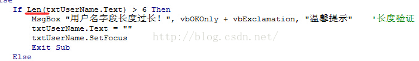
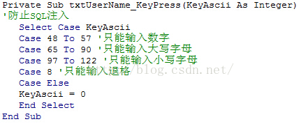

# 第5天【数据库优化】

## 主要内容

1、SQL注入

2、SQL注入的方案

3、SQL语句的一般步骤

4、常用的SQL优化

## 学习目标

| 节数                        | 知识点                | 要求 |
|-----------------------------|-----------------------|------|
| 第一节（SQL注入）           | SQL注入               | 了解 |
| 第二节（解决SQL注入的方案） | 解决SQL注入的方案     | 熟悉 |
| 第三节（优化SQL语句）       | 优化SQL语句的一般步骤 | 了解 |
| 第四节（常用的SQL优化）     | 常用的SQL优化         | 了解 |

## 第一节 SQL注入

### What SQL注入？

SQL注入即是指web应用程序对用户输入数据的合法性没有判断或过滤不严，攻击者可以在web应用程序中事先定义好的查询语句的结尾上添加额外的SQL语句，在管理员不知情的情况下实现非法操作，以此来实现欺骗数据库服务器执行非授权的任意查询，从而进一步得到相应的数据信息。

### SQL注入的表现形式

例如，在机房登录窗口输入文本处为例，

源代码：txtSQL = "select \* from user_Info where userID = '" & txtUserName.Text & "'"，我们在第一个文本处用户名，如果机房的合法用户张三登陆时在txtUserName中输入“张三”，反映到代码中为：

txtSQL = "select \* from user_Info where userID = ' 张三 ' ，接下来就会在数据库中检索是否有张三这个用户，如果有，而且密码对的话就会进入系统。

但是如果我是一个系统入侵者，而且不知道合法的用户名和密码，我就可已在txtUserName处输入a' or 'b'='b,这样一来，反映到SQL语句中就是

txtSQL = "select \* from user_Info where userID = ' anything ' or 'b'='b'，这样，不管userID是不是正确，我都会保证数据库检索通过，因为'b'='b'这一条件肯定是满足的。

同理，SQL注入还可以应用到其他方面，比如对数据表的删除或窃取用户信息等等非法操作，原理都是一样，比如删除表，只要输入

anything';DROP TABLE user_Info;这样SQL语句就成了txtSQL = "select \* from user_Info where userID = ' anything '';DROP TABLE user_Info;，同时执行两个SQL语句，前边虽然无效，但是后边就把我们数据库中的user_Info表删除掉了，如果加上select \* from student_Info where studentNo like '%',我们还能窃取所有的student用户的个人信息。

### 本节作业

1.掌握SQL注入概念

2.掌握SQL注入的表现形式

## 解决SQL注入的方案

### 2.1概念

SQL注入对于正式企业来说危害简直是致命的，但是其防止方法很简单，一般SQL注入语句占的字符都很长，我们可以限制可输入文本的输入长度，而且，SQL注入需要输入‘ 和空格等字符，我们可以利用以下方式来解决：

### 2.2解决方案

#### 2.2.1 ascii键码值来设置不让输入这些字符

如下：

限制输入长度可以进行长度验证：

#### 2.2.2利用ascii码值限制输入字符：

除了以上方法，解决SQL注入方法还有很多 ，例如如果输入卡号时，我们还可以限制登陆者必须使用数字，在SQL中限制SQL同时执行语句条数等方法

### 2.3建议

1.  设置数据库时尽量使用参数化的过滤性语句，还要避免使用解释程序，因为这正是黑客们借以执行非法命令的手段。  
    2\. 避免出现一些详细的错误消息，因为黑客们可以利用这些消息。要使用一种标准的输入确认机制来验证所有的输入数据的长度、类型、语句、企业规则等。

### 本节作业

1.掌握解决SQL注入的方案

2.掌握设置数据库时避免SQL的建议

## 第三节 优化SQL语句

1对查询进行优化，应尽量避免全表扫描，首先应考虑在 where 涉及的查询频繁的列上建立索引

2杜绝直接 SELECT \* 读取全部字段

3 能确定返回结果只有一条时，使用 limit 1：在保证数据不会有误的前提下，能确定结果集数量时，多使用 limit，尽快的返回结果

4 少用子查询，改用 join

5考虑使用 union all，少使用 union，注意考虑去重，union all 不去重，而少了排序操作，速度相对比 union 要快，如果没有去重的需求，优先使用 union all

6 避免使用 is null, is not null 这样的比较

7 减少与数据库交互的次数

8 杜绝危险 SQL，例如where 1=1 会遭到SQL注入式攻击

9 可以使用分库分区...

### 本节作业

1.掌握SQL语法优化方法

## 第四节 常用的SQL优化

### 3.1为什么要对SQL进行优化

开发项目上线初期，由于业务数据量相对较少，一些SQL的执行效率对程序运行效率的影响不太明显，而开发和运维人员也无法判断SQL对程序的运行效率有多大，故很少针对SQL进行专门的优化，而随着时间的积累，业务数据量的增多，SQL的执行效率对程序的运行效率的影响逐渐增大，此时对SQL的优化就很有必要。

### 3.2 SQL优化的一些方法

1.对查询进行优化，应尽量避免全表扫描，首先应考虑在 where 及 order by 涉及的列上建立索引。   
   
2.应尽量避免在 where 子句中对字段进行 null 值判断，否则将导致引擎放弃使用索引而进行全表扫描，如：   
select id from t where num is null   
可以在num上设置默认值0，确保表中num列没有null值，然后这样查询：   
select id from t where num=0   
   
3.应尽量避免在 where 子句中使用!=或\<\>操作符，否则将引擎放弃使用索引而进行全表扫描。   
   
4.应尽量避免在 where 子句中使用 or 来连接条件，否则将导致引擎放弃使用索引而进行全表扫描，如：   
select id from t where num=10 or num=20   
可以这样查询：   
select id from t where num=10   
union all   
select id from t where num=20   
可以使用索引的情况必须所有的or条件都必须是独立索引。

5.in 和 not in 也要慎用，否则会导致全表扫描，如：   
select id from t where num in(1,2,3)   
对于连续的数值，能用 between 就不要用 in 了：   
select id from t where num between 1 and 3   
   
6.下面的模糊查询也将导致全表扫描：   
select id from t where name like '%abc%'   
   
7.应尽量避免在 where 子句中对字段进行表达式操作，这将导致引擎放弃使用索引而进行全表扫描。如：   
select id from t where num/2=100   
应改为:   
select id from t where num=100\*2   
   
8.应尽量避免在where子句中对字段进行函数操作，这将导致引擎放弃使用索引而进行全表扫描。如：   
select id from t where substring(name,1,3)='abc'--name以abc开头的id   
应改为:   
select id from t where name like 'abc%'   
   
9.不要在 where 子句中的“=”左边进行函数、算术运算或其他表达式运算，否则系统将可能无法正确使用索引。   
   
10.在使用索引字段作为条件时，如果该索引是复合索引，那么必须使用到该索引中的第一个字段作为条件时才能保证系统使用该索引，   
否则该索引将不会被使用，并且应尽可能的让字段顺序与索引顺序相一致。这也叫索引的最左原则。   
   
11.不要写一些没有意义的查询，如需要生成一个空表结构：   
select col1,col2 into \#t from t where 1=0   
这类代码不会返回任何结果集，但是会消耗系统资源的，应改成这样：   
create table \#t(...)   
   
12.很多时候用 exists 代替 in 是一个好的选择：   
select num from a where num in(select num from b)   
用下面的语句替换：   
select num from a where exists(select 1 from b where num=a.num)   
   
13.并不是所有索引对查询都有效，SQL是根据表中数据来进行查询优化的，当索引列有大量数据重复时，SQL查询可能不会去利用索引，   
如一表中有字段sex，male、female几乎各一半，那么即使在sex上建了索引也对查询效率起不了作用。   
   
14.索引并不是越多越好，索引固然可以提高相应的 select 的效率，但同时也降低了 insert 及 update 的效率，   
因为 insert 或 update 时有可能会重建索引，所以怎样建索引需要慎重考虑，视具体情况而定。   
一个表的索引数最好不要超过6个，若太多则应考虑一些不常使用到的列上建的索引是否有必要。   
   
15.尽量使用数字型字段，若只含数值信息的字段尽量不要设计为字符型，这会降低查询和连接的性能，并会增加存储开销。   
这是因为引擎在处理查询和连接时会逐个比较字符串中每一个字符，而对于数字型而言只需要比较一次就够了。   
   
16.尽可能的使用 varchar 代替 char ，因为首先变长字段存储空间小，可以节省存储空间，   
其次对于查询来说，在一个相对较小的字段内搜索效率显然要高些。   
   
17.任何地方都不要使用 select \* from t ，用具体的字段列表代替“\*”，不要返回用不到的任何字段。   
   
18.避免频繁创建和删除临时表，以减少系统表资源的消耗。

19.临时表并不是不可使用，适当地使用它们可以使某些例程更有效，例如，当需要重复引用大型表或常用表中的某个数据集时。但是，对于一次性事件，最好使用导出表。   
   
20.在新建临时表时，如果一次性插入数据量很大，那么可以使用 select into 代替 create table，避免造成大量 log ，   
以提高速度；如果数据量不大，为了缓和系统表的资源，应先create table，然后insert。

21.如果使用到了临时表，在存储过程的最后务必将所有的临时表显式删除，先 truncate table ，然后 drop table ，这样可以避免系统表的较长时间锁定。   
   
22.尽量避免使用游标，因为游标的效率较差，如果游标操作的数据超过1万行，那么就应该考虑改写。

23.尽量避免大事务操作，提高系统并发能力。

24.尽量避免向客户端返回大数据量，若数据量过大，应该考虑相应需求是否合理

### 本节作业

1.  掌握为什么要对SQL进行优化
2.  掌握常用的SQL优化方法
