# 第6天【JDBC操作】

## 主要内容

1、JDBC介绍

2、基本CRUD操作

3、预编译语句对象的使用

4、JDBC中事务的控制

## 学习目标

| 节数                     | 知识点               | 要求 |
|--------------------------|----------------------|------|
| 第一节（JDBC）           | JDBC介绍             | 了解 |
| 第二节（CRUD）           | CRUD操作             | 掌握 |
| 第三节（预编译语句对象） | 预编译语句对象的使用 | 掌握 |
| 第四节（JDBC中的事务）   | JDBC中事务的控制     | 掌握 |

## 第一节 JDBC

### What JDBC？

数据库访问技术简介：

当今企业级应用程序大部分采用了客户机/服务器（C/S）模式；

客户端机器需要与服务器进行通讯，要操作数据库中的数据，执行SQL（Structured Query Language结构化查询语言）语句以及检索查询结果；

在Java中实现这些活动的技术称作JDBC。

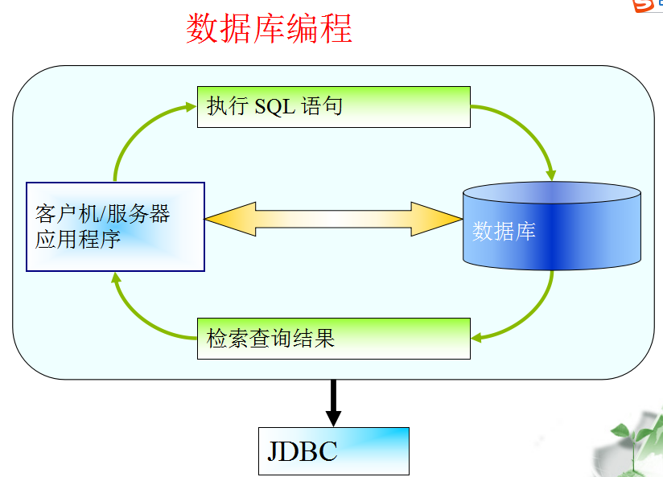

JDBC：

JDBC（Java DataBase Connectivity）是由Sun Microsystem公司提供的API（Application Programming Interface应用程序编程接口）；

它为Java应用程序提供了一系列的类，使其能够快速高效地访问数据库；

这些功能是由一系列的类和对象来完成的，我们只需使用相关的对象，即可完成对数据库的操作。

JDBC工作方式示意图：

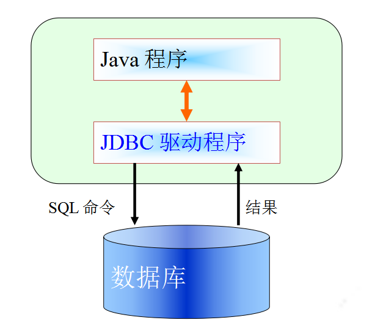

### 本节作业

1.  掌握JDBC概念

## 第二节CRUD操作

### 2.1 JDBC程序访问数据库步骤

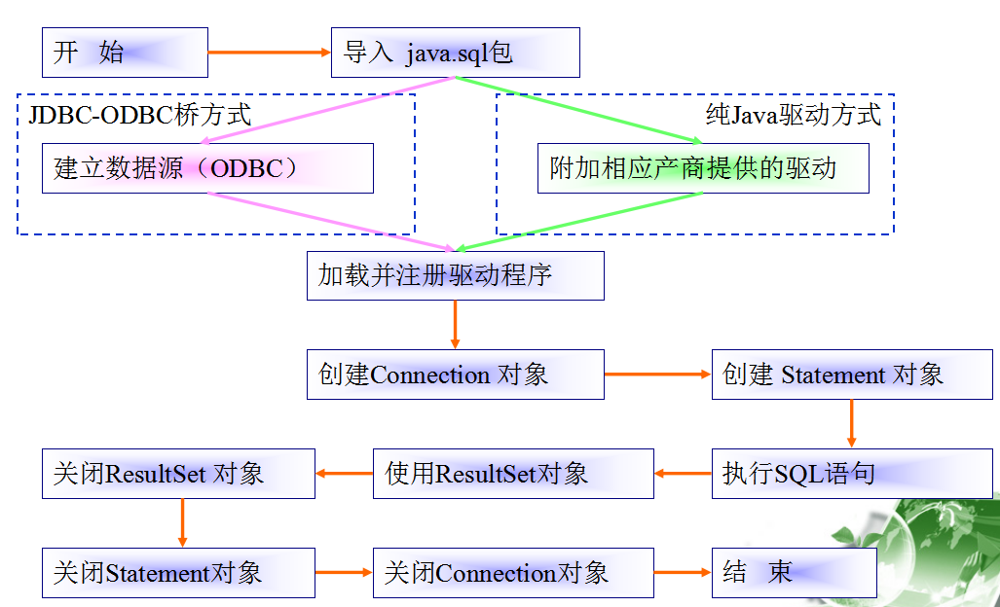

#### 步骤详解1：建立数据源

1.  这里以JDBC-ODBC桥驱动方式为例，逐步详细地讲解在Java程序中如何操作数据库，而对于其它驱动方式，只需更换驱动程序即可，其余不变；
2.  首先建立ODBC数据源：

【开始】→ 【设置】→ 【控制面板】→【管理工具】→【数据源（ODBC）】

1.  新建数据源，名称可以任意，这里假设已经建立了一个名为myODBC的数据源，连接到SQL Server 2000中的pubs数据库。

#### 步骤详解2：加载驱动程序

使用Class类的forName方法，将驱动程序类加载到JVM（Java虚拟机）中；

对于使用JDBC-ODBC桥的驱动方式，应该加载：

sun.jdbc.odbc.JdbcOdbcDriver类

如：

Class.forName("sun.jdbc.odbc.JdbcOdbcDriver");

#### 步骤详解3：获得连接对象

成功加载驱动后，必须使用DriverManager类的静态方法getConnection来获得连接对象；

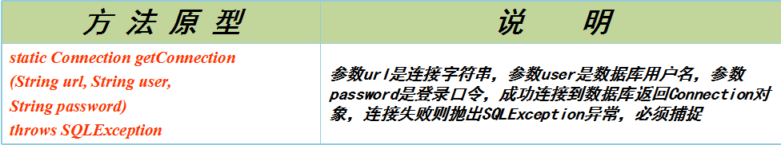

对于使用JDBC-ODBC桥的连接方式，连接字符串的一般形式是：“jdbc:odbc:数据源名称”，如：

Connection con =

DriverManager.getConnection("jdbc:odbc:myODBC", "sa", "");

#### 步骤详解释4：创建语句对象

一旦成功连接到数据库，获得Connection对象后，必须通过Connection对象的createStatement方法来创建语句对象，才可以执行SQL语句；

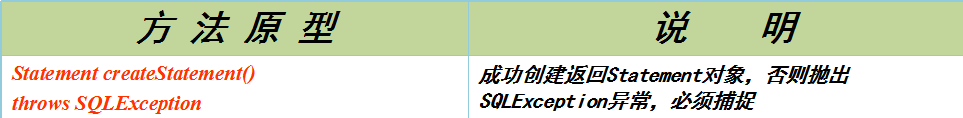

如：

Statement sta = con.createStatement();

#### 步骤详解5：执行SQL语句

使用语句对象来执行SQL语句，有两种情况：

一种是执行DELETE、UPDATE和INSERT之类的数据库操作语句（DML），这样的语句没有数据结果返回，使用Statement对象的executeUpdate方法执行；

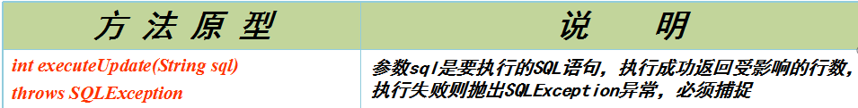

如：

sta.executeUpdate("INSERT INTO Friends VALUES('田七', '重庆', 456712, '2003-2-25', 7500)");

另一种是执行SELECT这样的数据查询语句（DQL），这样的语句将从数据库中获得所需的数据，使用Statement对象的executeQuery 方法执行；

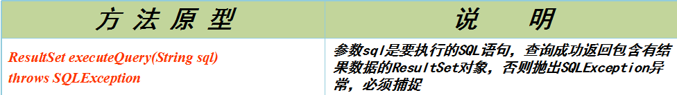

如：

ResultSet rs =

sta.executeQuery("SELECT \* FROM Friend");

#### 步骤详解6：关闭资源

1.  当对数据库的操作结束后，应当将所有已经被打开的资源关闭，否则将会造成资源泄漏；
2.  Connection对象、Statement对象和ResultSet对象都有执行关闭的close方法；
3.  函数原型都是：void close() throws SQLException

如：

rs.close(); //关闭ResultSet对象

sta.close(); //关闭Statement对象

con.close(); //关闭Connection对象

1.  有可能抛出SQLException异常，必须捕捉；
2.  请注意关闭的顺序，最后打开的资源最先关闭，最先打开的资源最后关闭。

### 2.2数据库操作示例

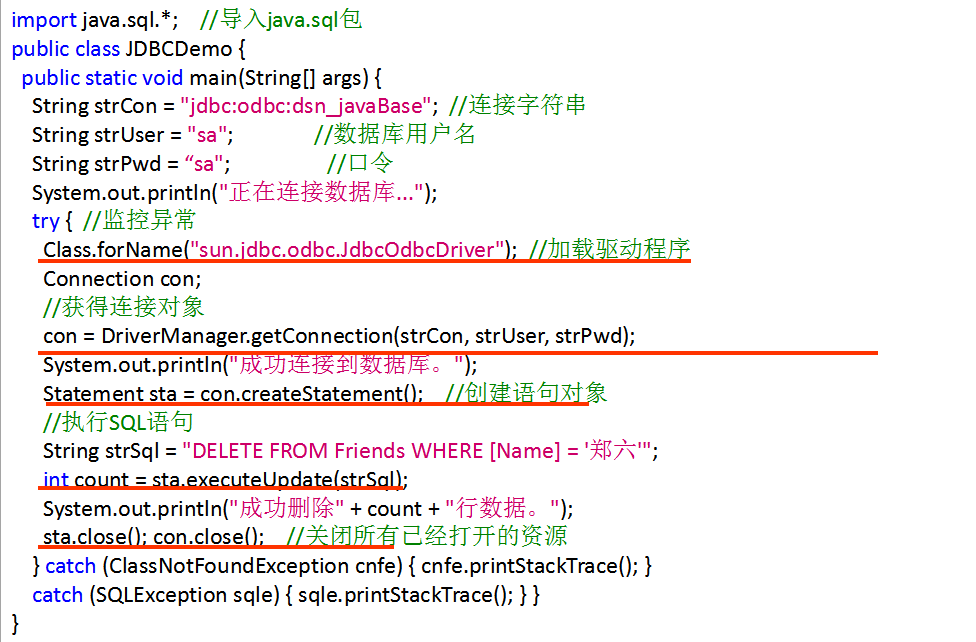

#### 2.2.1操作结果集

使用Statement对象的executeQuery方法成功执行SELECT语句后，将返回一个包含有结果数据的ResultSet对象，要从该对象中获取数据，将使用到如下方法：

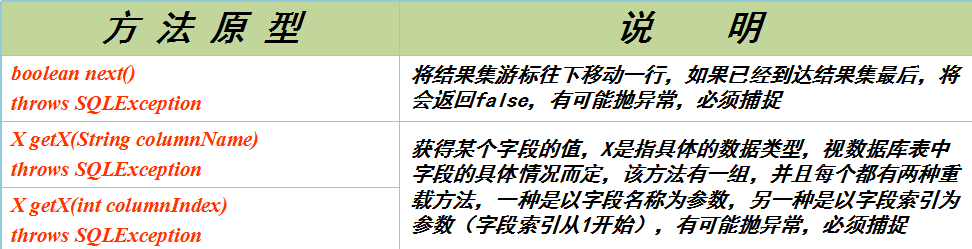

#### 2.2.2操作结果集示例

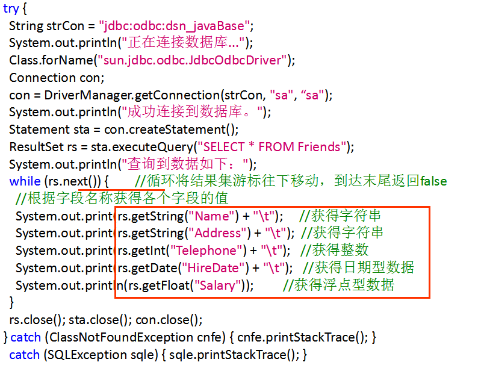

### 本节作业

1.  掌握JDBC程序访问数据库步骤
2.  掌握数据库操作示例
3.  掌握结果集的处理

## 预编译语句对象

### PreparedStatement接口介绍

1.  如果要多次执行相似的SQL语句，可以使用PreparedStatemend（预编译语句对象）对象来执行；
2.  通过Connection对象的prepareStatement方法来创建预编译语句对象；

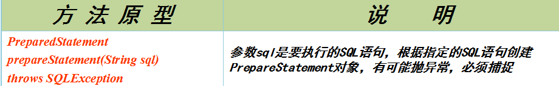

1.  PreparedStatement对象会将SQL语句预先编译，这样将会获得比Statement对象更高的执行效率。
2.  包含在PreparedStatement对象中的SQL语句可以带有一个或多个参数，使用“?”作为占位符，如:

PreparedStatement ps = con.prepareStatement("UPDATE Friends SET Address = ? WHERE Name = ?");

在执行SQL语句之前，必须使用PreparedStatement对象中的setX方法设置每个“?”位置的参数值；

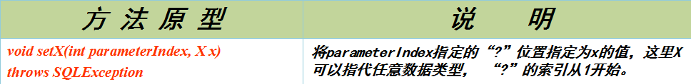

如：

ps.setString(1, "长沙");

ps.setString(2, "王五");

1.  设置好每个参数的值之后，就可以使用PreparedStatement对象的executeUpdate和executeQuery方法来执行SQL语句，这一点和Statement对象很相似：

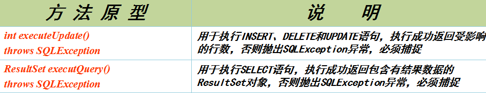

### PreparedStatement对象示例

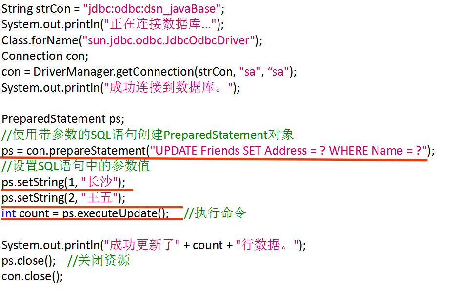

### 本节作业

1.  掌握PreparedStatement接口特点
2.  掌握PreparedStatement接口对象示例

## JDBC中的事务控制

### 4.1事务控制

1、 事务开始 begin或start transaction;

2、 事务提交 commit或commit work；

3、 回滚 rollback或rollback work；

4、 保存点设置 savepoint 标识；

5、 回滚到保存点 rollback to 标识；

6、 删除保存点 release savepoint 标识。

### 4.2 JDBC处理事务实例-模拟转账

账号表+转账流水表: 一对多

关系:transrecord表中的sender_id与receiver_id都是外键,指向account表中的account_id

\-- 创建账号表

CREATE TABLE account(

account_id VARCHAR(36) PRIMARY KEY, -- 使用UUID生成唯一值

account_name VARCHAR(15) NOT NULL,

balance DECIMAL(10,2) NOT NULL,

reg_date DATE NOT NULL

);

\-- 插入两条记录到账号表

INSERT INTO account(account_id,account_name,balance,reg_date) VALUES(UUID(),'张三',1000,CURDATE());

INSERT INTO account(account_id,account_name,balance,reg_date) VALUES(UUID(),'李四',2000,CURDATE());

\-- 创建流水表

create table transrecord(

trans_id varchar(36) primary key, -- 使用UUID_SHORT函数生成唯一值

sender_id varchar(36),

receiver_id varchar(36),

trans_balance decimal(10,2),

trans_datetime datetime

);

需求：张三向李四转账500,并且生成一条流水记录

**public** **class** Test01 {

**private** **static** **final** String **url**="jdbc:mysql://localhost:3306/jja2004_3";//主机名,端口号,数据库名

**private** **static** **final** String **user**="root";

**private** **static** **final** String **password**="123456";

**public** **static** **void** main(String[] args) {

Connection conn =**null**;

PreparedStatement pres =**null**;

**try** {

//加载驱动(可以省略)

Class.*forName*("com.mysql.jdbc.Driver");

//获取连接对象

conn = DriverManager.*getConnection*(**url**, **user**, **password**);

//java代码如何操作事务

//关闭默认提交事务

conn.setAutoCommit(**false**);

//模拟转账

String senderId="7b3338c5-d073-11ea-a13a-2c56dc4c3374";//单旺

String receiverId="7b41430d-d073-11ea-a13a-2c56dc4c3374";//伟文

//1.伟文转入

//获取预编译处理对象

pres = conn.prepareStatement("UPDATE account SET balance=balance+500 WHERE account_id=?");

//补齐占位符

pres.setString(1, receiverId);

//执行sql

pres.executeUpdate();

//模拟异常

System.**out**.println(1/0);

//2.单旺转出

//获取预编译处理对象

pres = conn.prepareStatement("UPDATE account SET balance=balance-500 WHERE account_id=?");

//补齐占位符

pres.setString(1, senderId);

//执行sql

pres.executeUpdate();

//3.记录流水表

pres = conn.prepareStatement("INSERT INTO transrecord(trans_id,sender_id,receiver_id,trans_balance,trans_datetime)VALUES(UUID_SHORT(),?,?,?,SYSDATE())");

//补齐占位符

pres.setString(1, senderId);

pres.setString(2, receiverId);

pres.setBigDecimal(3, **new** BigDecimal("500"));

//执行sql

pres.executeUpdate();

//提交事务

conn.commit();

System.**out**.println("转账成功");

} **catch** (Exception e) {

//回滚事务

**try** {

conn.rollback();

System.**out**.println("系统出现异常,转账失败!");

} **catch** (SQLException e1) {

// **TODO** Auto-generated catch block

e1.printStackTrace();

}

}**finally** {

**if** (**null**!=pres) {

**try** {

pres.close();

} **catch** (SQLException e) {

// **TODO** Auto-generated catch block

e.printStackTrace();

}//如果为空,会报空指针异常

}

//连接放在最后来释放

**if** (**null**!=conn) {

**try** {

conn.close();

} **catch** (SQLException e) {

// **TODO** Auto-generated catch block

e.printStackTrace();

}

}

}

}

### 本节作业

1.  掌握JDBC处理事务案例
