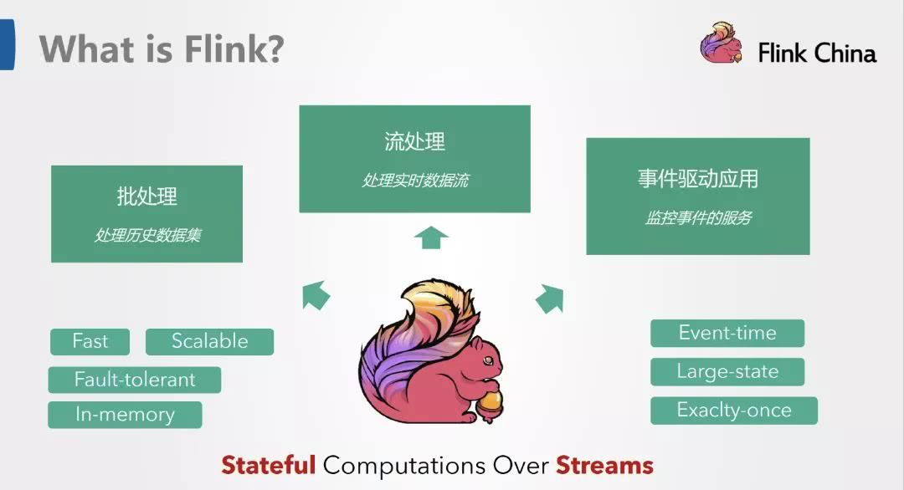
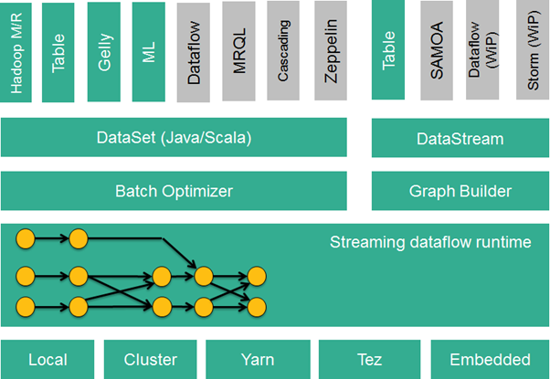
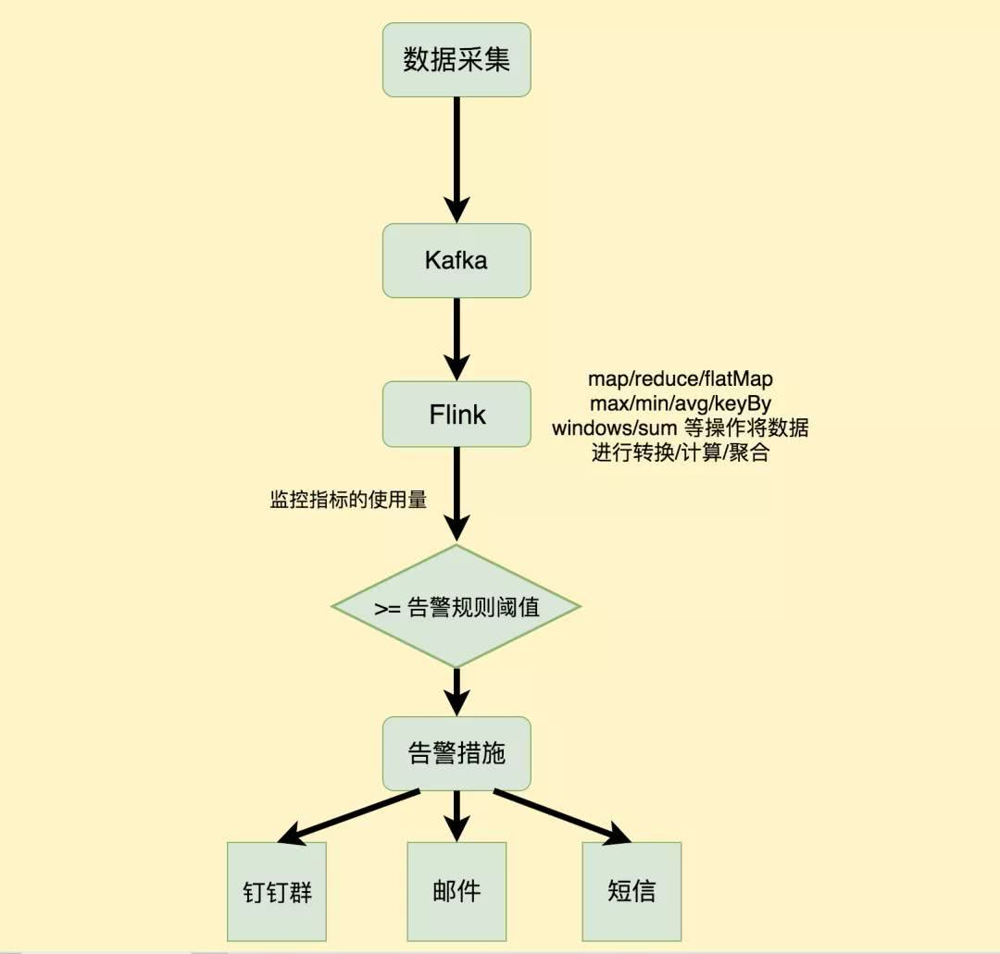
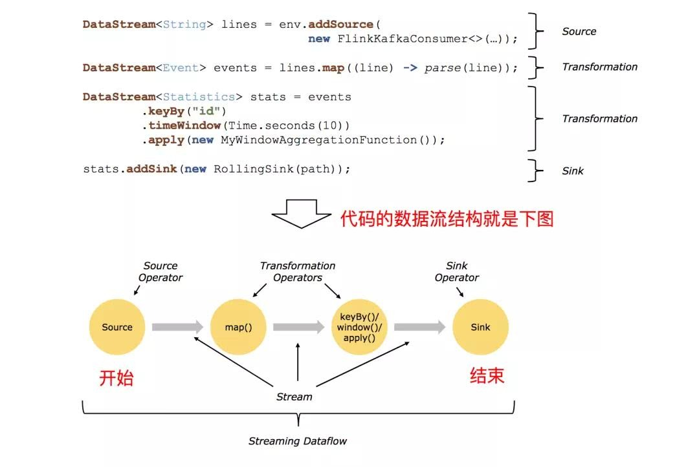
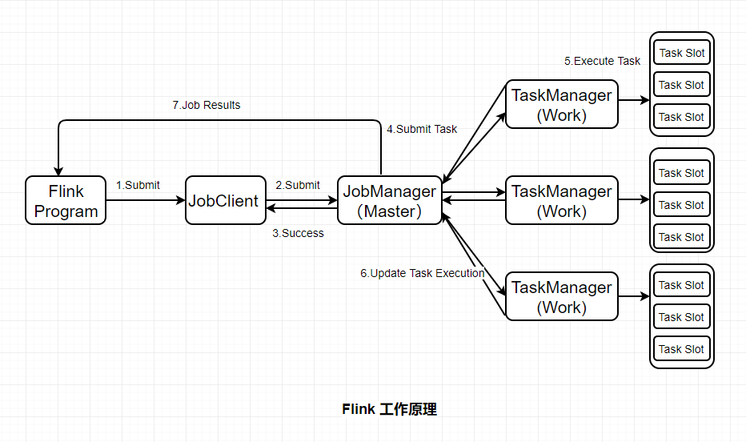

1.1.Flink简介

Flink核心是一个流式的数据流执行引擎，其针对数据流的分布式计算提供了数据分布、数据通信以及容错机制等功能。对
Flink
而言，其所要处理的主要场景就是流数据，批数据只是流数据的一个极限特例而已。再换句话说，Flink
会把所有任务当成流来处理，这也是其最大的特点。

Flink 可以支持本地的快速迭代，以及一些环形的迭代任务。并且 Flink
可以定制化内存管理。在这点，如果要对比 Flink 和 Spark 的话，Flink
并没有将内存完全交给应用层。这也是为什么 Spark 相对于 Flink，更容易出现
OOM 的原因（out of memory）。就框架本身与应用场景来说，Flink 更相似与
Storm。如果之前了解过 Storm 或者 Flume 的读者，可能会更容易理解 Flink
的架构和很多概念。

{width="5.430555555555555in"
height="2.9467268153980752in"}

基于流执行引擎，Flink提供了诸多更高抽象层的API以便用户编写分布式任务：

(1)DataSet API，
对静态数据进行批处理操作，将静态数据抽象成分布式的数据集，用户可以方便地使用Flink提供的各种操作符对分布式数据集进行处理，支持Java、Scala和Python。

(2)DataStream
API，对数据流进行流处理操作，将流式的数据抽象成分布式的数据流，用户可以方便地对分布式数据流进行各种操作，支持Java和Scala。

(3)Table
API，对结构化数据进行查询操作，将结构化数据抽象成关系表，并通过类SQL的DSL对关系表进行各种查询操作，支持Java和Scala。

此外，Flink还针对特定的应用领域提供了领域库，例如：

Flink ML，Flink的机器学习库，提供了机器学习Pipelines
API并实现了多种机器学习算法。

Gelly，Flink的图计算库，提供了图计算的相关API及多种图计算算法实现。

{width="5.500101706036745in"
height="3.7916666666666665in"}

此外，Flink也可以方便地和Hadoop生态圈中其他项目集成，例如Flink可以读取存储在HDFS或HBase中的静态数据，以Kafka作为流式的数据源，直接重用MapReduce或Storm代码，或是通过YARN申请集群资源等

1.2 flink应用场景

监控平台的告警部分，采集到的监控数据会直接往 kafka
里塞，然后告警这边需要从 kafka topic
里面实时读取到监控数据，并将读取到的监控数据做一些 聚合/转换/计算
等操作，然后将计算后的结果与告警规则的阈值进行比较，然后做出相应的告警措施（钉钉群、邮件、短信、电话等）。

{width="3.923611111111111in"
height="3.745523840769904in"}

1.3批处理与流处理系统

在执行引擎这一层，流处理系统与批处理系统最大不同在于节点间的数据传输方式。

(1)对于一个流处理系统，其节点间数据传输的标准模型是：

当一条数据被处理完成后，序列化到缓存中，然后立刻通过网络传输到下一个节点，由下一个节点继续处理。

(2)对于一个批处理系统，其节点间数据传输的标准模型是：

当一条数据被处理完成后，序列化到缓存中，并不会立刻通过网络传输到下一个节点，当缓存写满，就持久化到本地硬盘上，当所有数据都被处理完成后，才开始将处理后的数据通过网络传输到下一个节点。

Flink的执行引擎采用了一种十分灵活的方式，同时支持了这两种数据传输模型。Flink以固定的缓存块为单位进行网络数据传输，用户可以通过缓存块超时值指定缓存块的传输时机。如果缓存块的超时值为0，则Flink的数据传输方式类似上文所提到流处理系统的标准模型，此时系统可以获得最低的处理延迟。如果缓存块的超时值为无限大，则Flink的数据传输方式类似上文所提到批处理系统的标准模型，此时系统可以获得最高的吞吐量。同时缓存块的超时值也可以设置为0到无限大之间的任意值。缓存块的超时阈值越小，则Flink流处理执行引擎的数据处理延迟越低，但吞吐量也会降低，反之亦然。通过调整缓存块的超时阈值，用户可根据需求灵活地权衡系统延迟和吞吐量。

1.4flink数据流结构

{width="5.013888888888889in"
height="3.356275153105862in"}

(1)Source: 数据源，Flink 在流处理和批处理上的 source 大概有 4
类：基于本地集合的 source、基于文件的 source、基于网络套接字的
source、自定义的 source。自定义的 source 常见的有 Apache kafka、Amazon
Kinesis Streams、RabbitMQ、Twitter Streaming API、Apache NiFi
等，当然你也可以定义自己的 source。

(2)Transformation：数据转换的各种操作，有 Map / FlatMap / Filter / KeyBy
/ Reduce / Fold / Aggregations / Window / WindowAll / Union / Window
join / Split / Select / Project
等，操作很多，可以将数据转换计算成你想要的数据。

(3)Sink：接收器，Flink 将转换计算后的数据发送的地点
，你可能需要存储下来，Flink 常见的 Sink
大概有如下几类：写入文件、打印出来、写入 socket 、自定义的 sink
。自定义的 sink 常见的有 Apache
kafka、RabbitMQ、MySQL、ElasticSearch、Apache Cassandra、Hadoop
FileSystem 等，同理你也可以定义自己的 sink。

1.5Flink的优点

(1)提供准确的结果，甚至在出现无序或者延迟加载的数据的情况下。

(2)它是状态化的容错的，同时在维护一次完整的的应用状态时，能无缝修复错误。

(3)大规模运行，在上千个节点运行时有很好的吞吐量和低延迟。

更早的时候，我们讨论了数据集类型（有界 vs 无穷）和运算模型（批处理 vs
流式）的匹配。Flink
的流式计算模型启用了很多功能特性，如状态管理，处理无序数据，灵活的视窗，这些功能对于得出无穷数据集的精确结果是很重要的。

1.6 flink 运行机制

对于Flink 既可以处理stream data也可以处理batch
data,同时可以兼顾Spark以及Sparkstreaming的功能，与Spark不同的是，Flink本质上只有stream的概念，batch被认为是special
stream。Flink主要有以下几个角色需要大家了解，对于Flink的开发是很有帮助的。

{width="5.768055555555556in"
height="3.4159722222222224in"}

**(1)JobClient:**

负责接收程序，解析和优化程序的执行计划，然后提交执行计划到JobManager。这里执行的程序优化是将相邻的Operator融合，形成OperatorChain，Operator的融合可以减少task的数量，提高TaskManager的资源利用率。

**(2)JobManagers:**

负责申请资源，协调以及控制整个job的执行过程，具体包括，调度任务、处理checkpoint、容错等等

**(3)TaskManager:**

TaskManager运行在不同节点上的JVM进程(process)，负责接收并执行JobManager发送的task,并且与JobManager通信，反馈任务状态信息，如果说JobManager是master的话，那么TaskManager就是worker用于执行任务。每个TaskManager像是一个容器

，包含一个或者多个Slot。

**(4)Slot:**

Slot是TaskManager资源粒度的划分，每个Slot都有自己独立的内存。所有Slot平均分配TaskManager的内存，值得注意的是，Slot仅划分内存，不涉及cpu的划分。每个Slot可以运行多个task。Slot的个数就代表了一个程序的最高并行度。

**(5)Task:**

Task是在operators(操作者)的subtask进行链化之后形成的，具体Flink
job中有多少task和operator的并行度和链化的策略有关。

**(6)SubTask：**

因为Flink是分布式部署的，程序中的每个算子，在实际执行中被分隔为一个或者多个subtask，运算符子任务(subtask)的数量是该特定运算符的并行度。数据流在算子之间流动，就对应到SubTask之间的数据传输。Flink允许同一个job中来自不同task的subtask可以共享同一个slot。每个slot可以执行一个并行的pipeline。可以将pipeline看作是多个subtask的组成的。
