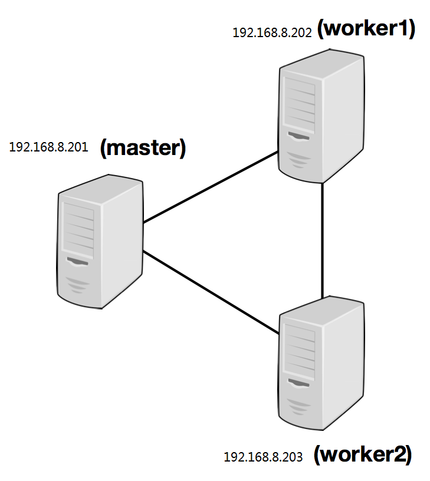

Flink安装

1.  本地模式

2.  Standalone（演示）

3.  Yarn模式

1.1准备环境

> Jdk1.8及以上
>
> JAVA\_HOME声明
>
> Ssh证书

1.2安装flink

（1）解压缩flink

> \[hadoop@h201 \~\]\$ cp /ff/flink-1.7.2-bin-hadoop27-scala\_2.11.tgz .
>
> \[hadoop@h201 \~\]\$ tar -zxvf
> flink-1.7.2-bin-hadoop27-scala\_2.11.tgz

\[hadoop@h201 \~\]\$ vi .bash\_profile

export FLINK\_HOME=/home/hadoop/flink-1.7.2

\[hadoop@h201 \~\]\$ source .bash\_profile

（2）配置flink

Conf/flink-conf.yaml

设置jobmanager.rpc.address的值为master节点的ip或者主机名。

你也可以定义每个节点上允许jvm申请的最大内存，使用jobmanager.heap.mb和taskmanager.heap.mb这两个参数的值的单位都是MB，如果有一些节点想要分配更多的内存，可以通过覆盖这个参数的默认值
FLINK\_TM\_HEAP

最后，你需要提供一个节点列表作为worker节点。

因为，类似于HDFS配置，修改文件conf/slaves
然后在里面输入每一个worker节点的ip/hostname
。每一个worker节点将运行一个taskmanager程序。

{width="4.075694444444444in"
height="3.3472222222222223in"}

\[hadoop@h201 flink-1.7.2\]\$ vi conf/flink-conf.yaml

jobmanager.rpc.address: h201

注：

Jobmanager可用内存(jobmanager.heap.mb)

taskmanager可用内存(taskmanager.heap.mb)

每个机器可用cpu数量(taskmanager.numberOfTaskSlots)

集群中的总cpu数量(parallelism.default)

节点临时目录(taskmanager.tmp.dirs)

\[hadoop@h201 conf\]\$ vi masters

h201:8081

\[hadoop@h201 flink-1.7.2\]\$ vi conf/slaves

h202

h203

（3）拷贝到另外两个从节点

\[hadoop@h201 \~\]\$ scp -r flink-1.7.2 h202:/home/hadoop/

\[hadoop@h201 \~\]\$ scp -r flink-1.7.2 h203:/home/hadoop/

1.3启动flink

\[hadoop@h201 flink-1.7.2\]\$ bin/start-cluster.sh

关闭

\[hadoop@h201 flink-1.7.2\]\$ bin/stop-cluster.sh

主节点

\[hadoop@h201 flink-1.7.2\]\$ jps

9617 StandaloneSessionClusterEntrypoint

从节点

\[hadoop@h202 flink-1.7.2\]\$ jps

5507 TaskManagerRunner

浏览器

*http://h201:8081*

{width="5.444444444444445in"
height="2.535416666666667in"}

Hadoop用户下

\[hadoop@h201 \~\]\$ vi .bash\_profile

export JAVA\_HOME=/usr/jdk1.8.0\_131

export PATH=\$JAVA\_HOME/bin:\$PATH

\[hadoop@h201 \~\]\$ source .bash\_profile

进入flink的命令行模式

\[hadoop@h201 flink-1.7.2\]\$ bin/start-scala-shell.sh local
