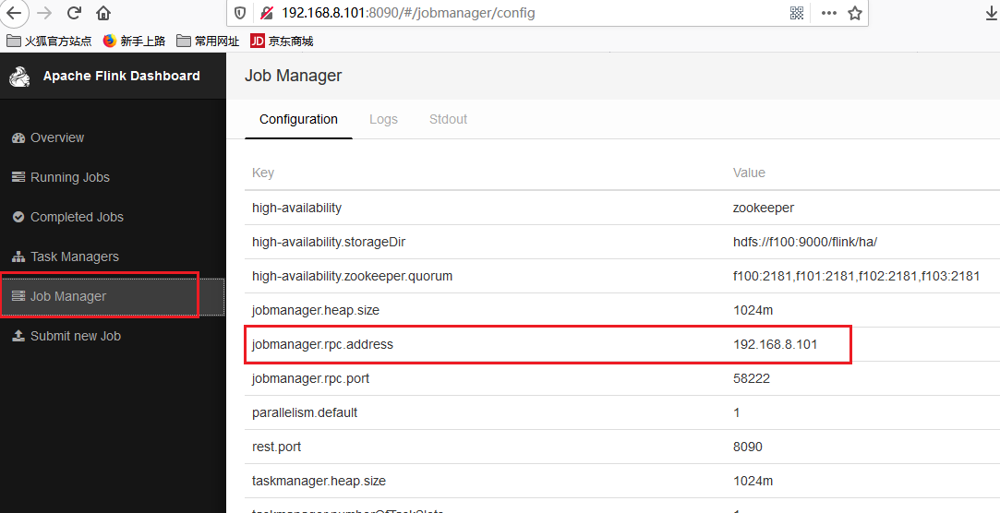
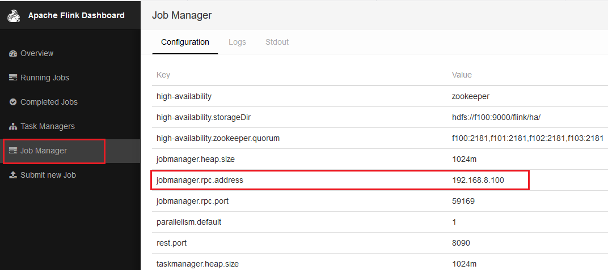

flink集群中，JobManager存在单点故障（SPOF：Single Point Of
Failure），因此对Flink做HA，主要是对JobManager做HA，standalone HA。

JobManager的HA，是通过Zookeeper实现的，因此需要先搭建好Zookeeper集群，同时HA的信息，还要存储在HDFS中，因此也需要Hadoop集群，最后修改Flink中的配置文件。

1.  Flink 配置

1.1

\[hadoop@f100 conf\]\$ vi flink-conf.yaml

注销掉这一行

\#jobmanager.rpc.address: localhost

解释：

HA模式下，jobmanager不需要指定，在master
file中配置，由zookeeper选出leader与standby。

high-availability: zookeeper

high-availability.storageDir: hdfs://f100:9000/flink/ha/

high-availability.zookeeper.quorum:
f100:2181,f101:2181,f102:2181,f103:2181

storageDir存储jobmanager的元数据信息

1.2

\[hadoop@f100 conf\]\$ vi masters

192.168.8.100:8090

192.168.8.101:8090

\[hadoop@f100 conf\]\$ vi slaves

f102

f103

1.3 可选（使用flink自带的zookeeper时配置）

\[hadoop@f100 conf\]\$ vi zoo.cfg

server.1=192.168.8.100:2888:3888

server.2=192.168.8.101:2888:3888

server.3=192.168.8.102:2888:3888

server.4=192.168.8.103:2888:3888

1.4

Cp到其他节点

\[hadoop@f100 \~\]\$ scp -r flink-1.7.2 f101:/home/hadoop/

\[hadoop@f100 \~\]\$ scp -r flink-1.7.2 f102:/home/hadoop/

\[hadoop@f100 \~\]\$ scp -r flink-1.7.2 f103:/home/hadoop/

1.5

启动hadoop 的HDFS

启动zookeeper

**如果启用的安装的zookeeper服务，就不需要启动flink自带的zookeeper**

\[hadoop@f100 flink-1.7.2\]\$ bin/start-zookeeper-quorum.sh

（使用的flink自带的zookeeper）

启动flink

\[hadoop@f100 flink-1.7.2\]\$ bin/start-cluster.sh

1.  验证

    \[hadoop@f100 flink-1.7.2\]\$ jps

    21537 StandaloneSessionClusterEntrypoint

    \[hadoop@f101 conf\]\$ jps

    11071 StandaloneSessionClusterEntrypoint

    \[hadoop@f102 conf\]\$ jps

    9719 TaskManagerRunner

    \[hadoop@f103 zookeeper-3.4.5\]\$ jps

    9954 TaskManagerRunner

    浏览器webUI

    {width="5.764583333333333in"
    height="2.959722222222222in"}

    192.168.8.101 为主节点

    Kill掉主节点进程再次查看

    \[hadoop@f101 flink-1.7.2\]\$ jps

    5681 NodeManager

    5570 DataNode

    7650 QuorumPeerMain

    11162 Jps

    11071 StandaloneSessionClusterEntrypoint

    \[hadoop@f101 flink-1.7.2\]\$ kill -9 11071

    {width="5.761805555555555in"
    height="2.563888888888889in"}

