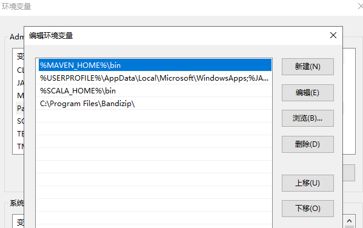

### 1.Maven是什么？

Maven是一个项目管理和综合工具。Maven提供了开发人员构建一个完整的生命周期框架。开发团队可以自动完成项目的基础工具建设，Maven使用标准的目录结构和默认构建生命周期。

在多个开发团队环境时，Maven可以设置按标准在非常短的时间里完成配置工作。由于大部分项目的设置都很简单，并且可重复使用，Maven让开发人员的工作更轻松，同时创建报表，检查，构建和测试自动化设置。

### 2.maven安装

2.1下载软件包

http://maven.apache.org/download.cgi

2.2 声明环境变量

解压之后，记录下路径，在系统环境变量中添加 M2\_HOME 和
MAVEN\_HOME，最后在PATH中添加。

右键我的电脑-》属性-》高级-》环境变量-》

{width="5.767361111111111in"
height="2.6243055555555554in"}

2.3 用户环境变量添加

{width="5.767361111111111in"
height="2.20625in"}

Path中添加 maven的bin

{width="5.458333333333333in"
height="3.5833333333333335in"}

2.3验证

{width="5.764583333333333in"
height="0.9680555555555556in"}

{width="4.954166666666667in"
height="5.315972222222222in"}

{width="5.763194444444444in"
height="2.701388888888889in"}

编辑用户环境变量

PATH后面添加 ;%M2\_HOME%\\bin

{width="5.7652777777777775in"
height="3.61875in"}

Winodws 验证

{width="5.7652777777777775in"
height="0.9173611111111111in"}

3.  Maven项目

    *https://flink.apache.org*

    mvn archetype:generate -DarchetypeGroupId=org.apache.flink
    -DarchetypeArtifactId=flink-quickstart-java -DarchetypeVersion=1.7.2

