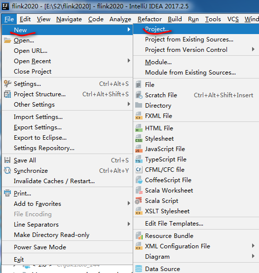
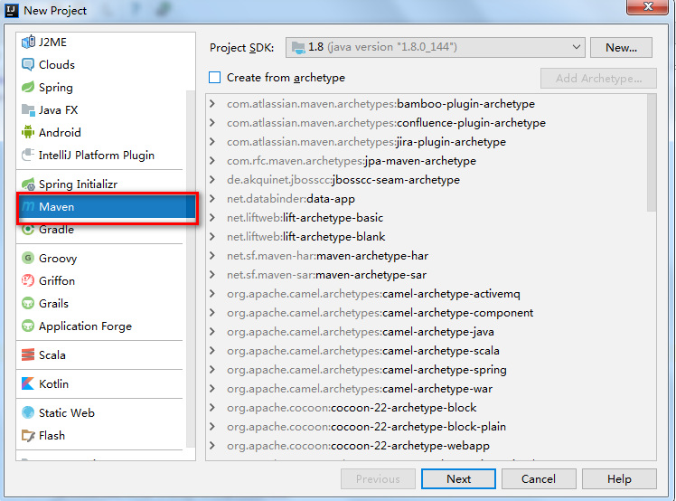
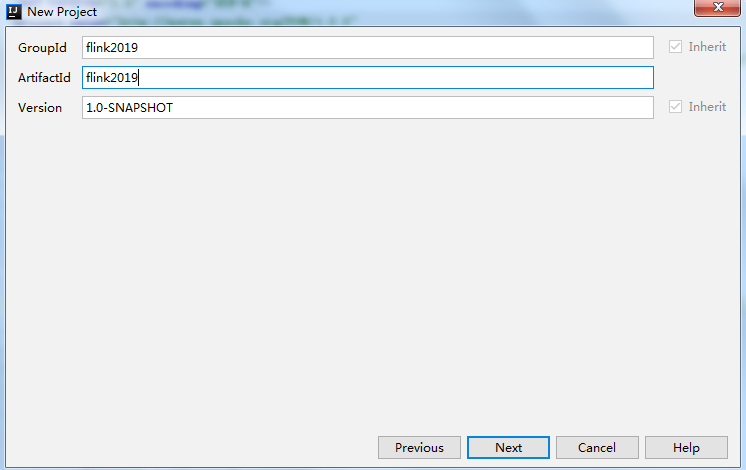
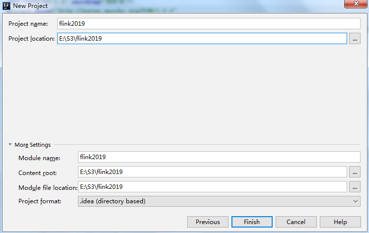
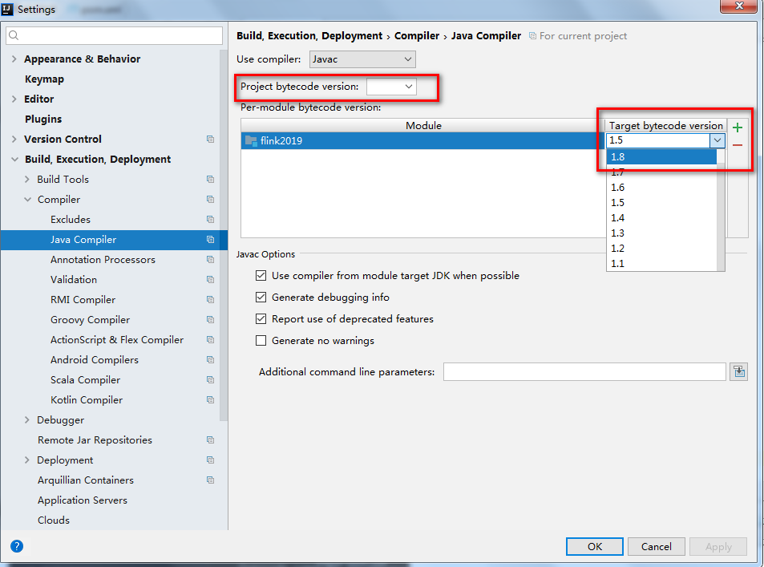
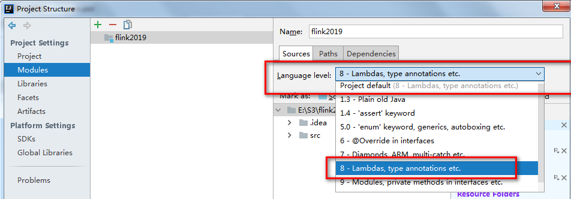
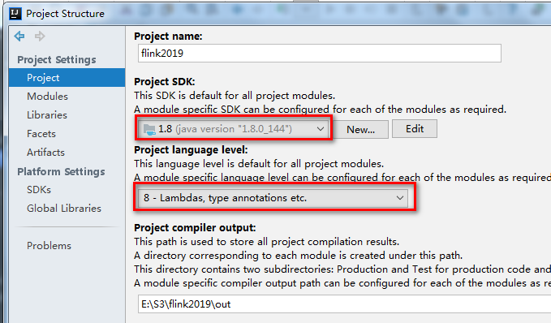

Flink IDEA开发环境部署

1.1创建maven工程

file-new-project-Maven

{width="4.728472222222222in"
height="4.98125in"}

{width="4.513888888888889in"
height="3.342361111111111in"}

\(2) 设置GroupId和ArtifacId：

{width="4.604166666666667in"
height="2.9006944444444445in"}

设置存储路径

{width="4.680555555555555in"
height="2.9611111111111112in"}

Finish完成

1.2 配置maven

选择自动更新

{width="3.8430555555555554in"
height="0.9993055555555556in"}

配置pom.xml

添加依赖

&lt;dependencies&gt;

&lt;dependency&gt;

&lt;groupId&gt;org.apache.flink&lt;/groupId&gt;

&lt;artifactId&gt;flink-java&lt;/artifactId&gt;

&lt;version&gt;1.7.2&lt;/version&gt;

&lt;scope&gt;provided&lt;/scope&gt;

&lt;/dependency&gt;

&lt;dependency&gt;

&lt;groupId&gt;org.apache.flink&lt;/groupId&gt;

&lt;artifactId&gt;flink-streaming-java\_2.11&lt;/artifactId&gt;

&lt;version&gt;1.7.2&lt;/version&gt;

&lt;scope&gt;provided&lt;/scope&gt;

&lt;/dependency&gt;

&lt;dependency&gt;

&lt;groupId&gt;org.apache.flink&lt;/groupId&gt;

&lt;artifactId&gt;flink-scala\_2.11&lt;/artifactId&gt;

&lt;version&gt;1.7.2&lt;/version&gt;

&lt;scope&gt;provided&lt;/scope&gt;

&lt;/dependency&gt;

&lt;dependency&gt;

&lt;groupId&gt;org.apache.flink&lt;/groupId&gt;

&lt;artifactId&gt;flink-streaming-scala\_2.11&lt;/artifactId&gt;

&lt;version&gt;1.7.2&lt;/version&gt;

&lt;scope&gt;provided&lt;/scope&gt;

&lt;/dependency&gt;

&lt;/dependencies&gt;

&lt;build&gt;

&lt;plugins&gt;

&lt;plugin&gt;

&lt;groupId&gt;org.apache.maven.plugins&lt;/groupId&gt;

&lt;artifactId&gt;maven-shade-plugin&lt;/artifactId&gt;

&lt;version&gt;3.1.1&lt;/version&gt;

&lt;executions&gt;

&lt;execution&gt;

&lt;phase&gt;package&lt;/phase&gt;

&lt;goals&gt;

&lt;goal&gt;shade&lt;/goal&gt;

&lt;/goals&gt;

&lt;configuration&gt;

&lt;artifactSet&gt;

&lt;excludes&gt;

&lt;exclude&gt;com.google.code.findbugs:jsr305&lt;/exclude&gt;

&lt;exclude&gt;org.slf4j:\*&lt;/exclude&gt;

&lt;exclude&gt;log4j:\*&lt;/exclude&gt;

&lt;/excludes&gt;

&lt;/artifactSet&gt;

&lt;filters&gt;

&lt;filter&gt;

&lt;!-- Do not copy the signatures in the META-INF folder.

Otherwise, this might cause SecurityExceptions when using the JAR.
--&gt;

&lt;artifact&gt;\*:\*&lt;/artifact&gt;

&lt;excludes&gt;

&lt;exclude&gt;META-INF/\*.SF&lt;/exclude&gt;

&lt;exclude&gt;META-INF/\*.DSA&lt;/exclude&gt;

&lt;exclude&gt;META-INF/\*.RSA&lt;/exclude&gt;

&lt;/excludes&gt;

&lt;/filter&gt;

&lt;/filters&gt;

&lt;transformers&gt;

&lt;transformer
implementation="org.apache.maven.plugins.shade.resource.ManifestResourceTransformer"&gt;

&lt;mainClass&gt;my.programs.main.clazz&lt;/mainClass&gt;

&lt;/transformer&gt;

&lt;/transformers&gt;

&lt;/configuration&gt;

&lt;/execution&gt;

&lt;/executions&gt;

&lt;/plugin&gt;

&lt;/plugins&gt;

&lt;/build&gt;

1.3 修改jdk版本

（1）

File-Setting-Build,Execution,Deployment--Compiler-Java Compiler

把红框中的两项都修改为jdk1.8

{width="5.083333333333333in"
height="3.7708333333333335in"}

（2）

File-Project Structure-Module

{width="5.768055555555556in"
height="2.011111111111111in"}

(3)

File-Project Structure-Project Settings--Project-Project language level

{width="5.115972222222222in"
height="2.9993055555555554in"}
