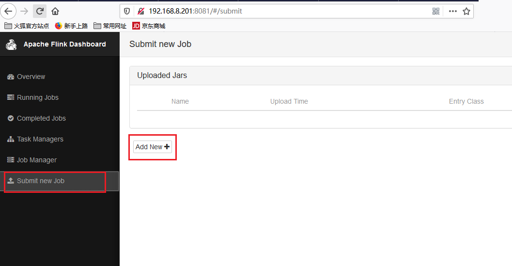
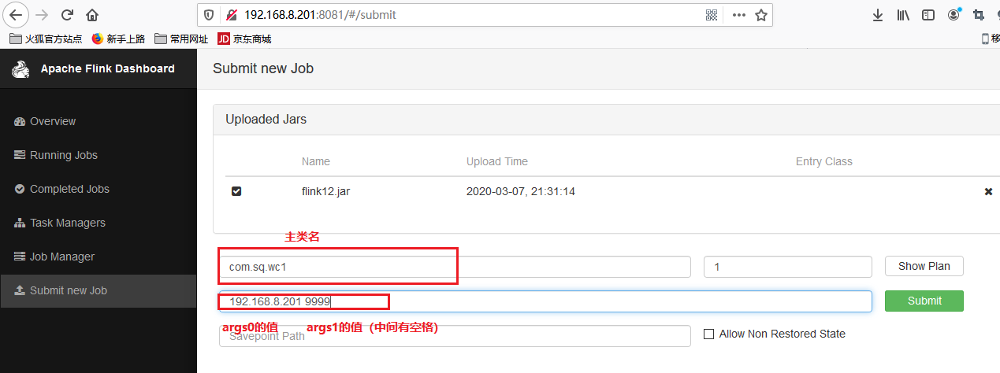
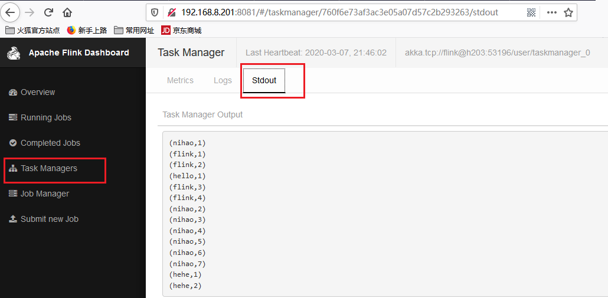

1.

生成 jar包

2浏览器进入

*http://192.168.8.201:8081*

{width="5.758333333333334in"
height="2.990972222222222in"}

{width="5.763194444444444in"
height="2.1527777777777777in"}

结果：

{width="5.761805555555555in"
height="2.825in"}
