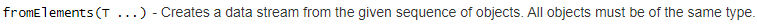

### 1.fromcollection

{width="5.7659722222222225in"
height="0.3638888888888889in"}

**import** org.apache.flink.streaming.api.datastream.DataStream;\
**import**
org.apache.flink.streaming.api.environment.StreamExecutionEnvironment;\
\
**import** java.util.ArrayList;\
**import** java.util.List;\
\
**public class** source1 {\
**public static void** main(String\[\] args) **throws** Exception {\
List L1= **new** ArrayList();\
L1.add(**"zs"**);\
L1.add(**"ls"**);\
L1.add(**"ww"**);\
\
StreamExecutionEnvironment env =
StreamExecutionEnvironment.*getExecutionEnvironment*();\
\
DataStream&lt;String&gt; input1 = env.fromCollection(L1);\
input1.print();\
env.execute(**"collection"**);\
\
}\
}

\[hadoop@h201 flink-1.7.2\]\$ bin/flink run /home/hadoop/flinksss.jar
--class com.sq2.source1

2.  ### fromElements

    {width="5.764583333333333in"
    height="0.21319444444444444in"}

**import** org.apache.flink.streaming.api.datastream.DataStream;\
**import**
org.apache.flink.streaming.api.environment.StreamExecutionEnvironment;\
\
**public class** source2 {\
**public static void** main(String\[\] args) **throws** Exception {\
StreamExecutionEnvironment env =
StreamExecutionEnvironment.*getExecutionEnvironment*();\
DataStream input2 = env.fromElements(1,2,3);\
input2.print();\
env.execute(**"elements"**);\
}\
}

### 3.

### 4.

### 自定义数据源

实现自定义Source

implements实现SourceFunction接口

重写run方法和cancel方法(cancel应用时，cancel方法会被调用)

SourceContext主要定义了数据源发射数据的接口{width="5.020833333333333in"
height="0.9583333333333334in"}

开发

**package** com.sq2;\
\
**import** org.apache.flink.streaming.api.datastream.DataStream;\
**import**
org.apache.flink.streaming.api.environment.StreamExecutionEnvironment;\
**import**
org.apache.flink.streaming.api.functions.source.SourceFunction;\
\
**public class** source3 {\
**public static void** main(String\[\] args) **throws** Exception {\
StreamExecutionEnvironment env =
StreamExecutionEnvironment.*getExecutionEnvironment*();\
DataStream input3 = env.addSource(**new** ss());\
input3.print();\
env.execute(**"zzz"**);\
\
}\
**public static class** ss **implements** SourceFunction&lt;Long&gt;{\
**private long count** = 1L;\
**private boolean isRunning** = **true**;\
\
@Override\
**public void** run(SourceContext&lt;Long&gt; sourceContext) **throws**
Exception {\
**while**(**isRunning**){\
sourceContext.collect(**count**);\
**count**++;\
Thread.*sleep*(1000);\
}\
}\
@Override\
**public void** cancel() {\
**isRunning** = **false**;\
}\
\
}\
}
