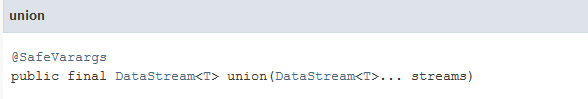

DataStream API

DataStream是Flink编写流处理作业的API。一个完整的Flink处理程序应该包含三部分：数据源(Source)、转换操作(Transformation)、结果接收(Sink)。

{width="3.9166666666666665in"
height="2.6909722222222223in"}

**Wordcount例子（java版）**：

**package** com.flinkj1;\
\
**import** org.apache.flink.api.common.functions.FlatMapFunction;\
**import** org.apache.flink.api.java.tuple.Tuple2;\
**import** org.apache.flink.streaming.api.datastream.DataStream;\
**import**
org.apache.flink.streaming.api.environment.StreamExecutionEnvironment;\
**import** org.apache.flink.streaming.api.windowing.time.Time;\
**import** org.apache.flink.util.Collector;\
\
**public class** Ds1 {\
\
**public static void** main(String\[\] args) **throws** Exception {\
\
StreamExecutionEnvironment env =
StreamExecutionEnvironment.*getExecutionEnvironment*();\
\
DataStream&lt;Tuple2&lt;String, Integer&gt;&gt; dataStream = env\
.socketTextStream(**"h201"**, 9999)\
.flatMap(**new** Splitter())\
.keyBy(0)\
.timeWindow(Time.*seconds*(5))\
.sum(1);\
\
dataStream.print();\
\
env.execute(**"Window WordCount"**);\
}\
\
**public static class** Splitter **implements**
FlatMapFunction&lt;String, Tuple2&lt;String, Integer&gt;&gt; {\
@Override\
**public void** flatMap(String sentence, Collector&lt;Tuple2&lt;String,
Integer&gt;&gt; out) **throws** Exception {\
**for** (String word: sentence.split(**" "**)) {\
out.collect(**new** Tuple2&lt;String, Integer&gt;(word, 1));\
}\
}\
}\
\
}

会话1：

\[hadoop@h201 \~\]\$ nc -l 9999

会话2：

\[hadoop@h201 flink-1.7.2\]\$ bin/start-scala-shell.sh local

会话3：

\[hadoop@h201 flink-1.7.2\]\$ bin/flink run /home/hadoop/flink2020.jar

在会话1中：

输入些内容

hello hello flink

hello hello flink

hello haha haha heihei heihei

在会话2中查看内容：

scala&gt; (hello,4)

(flink,2)

(hello,1)

(heihei,2)

(haha,2)

Wordcount例子（scala版）：

**package** com.flinks1\
**import** org.apache.flink.streaming.api.scala.\_\
**import** org.apache.flink.streaming.api.windowing.time.Time\
\
**object** wc1 {\
**def** main(args: Array\[String\]) {\
\
**val** env = StreamExecutionEnvironment.*getExecutionEnvironment\
***val** text = env.socketTextStream(**"h201"**, 9999)\
\
**val** counts = text.flatMap { \_.toLowerCase.split(**"\\\\W+"**)
filter { \_.nonEmpty } }\
.map { (\_, 1) }\
.keyBy(0)\
.timeWindow(Time.*seconds*(5))\
.sum(1)\
\
counts.print()\
\
env.execute(**"Window Stream WordCount"**)\
}\
}

1.1运行环境StreamExecutionEnvironment

StreamExecutionEnvironment是我们的流计算执行环境（上下文）包含并行度，state，time相关配置。

功能：

获取一个已经有的environment

创建一个本地environment

创建一个远程environment

源码：

{width="6.242361111111111in"
height="1.8819444444444444in"}

1.  并行度

(1)在flink的配置文件中flink-conf.yaml，默认的并行度为1。

在以shell的方式提交flink job的时候，可以使用-p指定程序的并行度。

例子：./bin/flink run -p 10 ../word-count.jar

(2)在flink job程序内设置并行度

例子：

StreamExecutionEnvironment env =
StreamExecutionEnvironment.getExecutionEnvironment();

env.setParallelism(10);

**注：**

**这样设置的并行度是你整个程序的并行度，那么后面如果你的每个算子不单独设置并行度覆盖的话，那么后面每个算子的并行度就都是这里设置的并行度的值了。**

(3)每个算子指定并行度；

例子：

data.keyBy(new xxxKey())

.flatMap(new XxxFlatMapFunction()).setParallelism(5)

.map(new XxxMapFunction).setParallelism(5)

.addSink(new XxxSink()).setParallelism(1)

1.2数据源(Source)

flink将数据源主要分为内置数据源和第三方数据源

1.2.1内置数据源: 文件，网络socket端口及集合类型数据

1.2.2第三方数据源: 用Connector的方式来连接如kafka Connector，es
connector等

源码

内置数据源：

\(1) 基于Socket

DataStream API支持从套接字读取数据。 只需指定要从中读取数据的主机和端口

方法1：

socketTextStream(hostName, port);

方法2：（指定分割符，默认的分隔符为换行）

socketTextStream(hostName,port,delimiter)

方法3：（指定API尝试获取数据的最大次数）

socketTextStream(hostName,port,delimiter,maxRetry)

(2)基于文件

还可以选择使用Flink中基于文件的源函数从文件源流式传输数据。
可以使用readTextFile（String path）从路径中指定的文件中流式传输数据。
默认情况下，它将读取TextInputFormat并逐行读取字符串。

readFile(FileInputFormat&lt;Out&gt; inputFormat, String path)

例子：

**package** com.flinkj1;\
**import** org.apache.flink.streaming.api.datastream.DataStream;\
**import**
org.apache.flink.streaming.api.environment.StreamExecutionEnvironment;\
\
**public class** Ds1 {\
\
**public static void** main(String\[\] args) **throws** Exception {\
\
StreamExecutionEnvironment env =
StreamExecutionEnvironment.*getExecutionEnvironment*();\
DataStream&lt;String&gt; dataStream1 =
env.readTextFile(**"/home/hadoop/a1.txt"**);\
DataStream&lt;String&gt; ds2 = dataStream1.map(x-&gt;**"abc"** +x);\
\
ds2.print();\
env.execute(**"Window WordCount"**);\
}\
}

(3)基于Collection

方法1：

fromCollection（Seq）

(从Java Java.util.Collection创建数据流。
集合中的所有元素必须属于同一类型。)

**package** com.flinkj1;\
**import** org.apache.flink.streaming.api.datastream.DataStream;\
**import**
org.apache.flink.streaming.api.environment.StreamExecutionEnvironment;\
**import** java.util.ArrayList;\
**import** java.util.List;\
\
**public class** Ds1 {\
\
**public static void** main(String\[\] args) **throws** Exception {\
\
StreamExecutionEnvironment env =
StreamExecutionEnvironment.*getExecutionEnvironment*();\
List&lt;String&gt; arrayList = **new** ArrayList&lt;String&gt;();\
arrayList.add(**"hello flink"**);\
arrayList.add(**"hello spark"**);\
DataStream&lt;String&gt; ds2 = env.fromCollection(arrayList);\
ds2.print();\
env.execute(**"hello"**);\
}\
}

方法2：

fromCollection（Iterator）

(从迭代器创建数据流。 该类指定迭代器返回的元素的数据类型。)

方法3：

fromElements（elements：\_ \*）

(从给定的对象序列创建数据流。 所有对象必须属于同一类型。)

方法4：

fromParallelCollection（SplittableIterator）

(并行的从迭代器创建数据流。 该类指定迭代器返回的元素的数据类型。)

方法5：

generateSequence（from，to）

(并行生成给定间隔中的数字序列。)

1.3 转换Transformation

(1)flatmap

org.apache.flink.streaming.api.datastream下

扁平化处理、一条记录并输出零个，一个或多个记录。

Flatmap 继承接口FlatMapFunction

{width="5.768055555555556in"
height="0.7368055555555556in"}

flatMap输出格式必须是Collector

{width="5.768055555555556in"
height="2.953472222222222in"}

例子：

**package** com.flinkj1;\
**import** org.apache.flink.api.common.functions.FlatMapFunction;\
**import** org.apache.flink.streaming.api.datastream.DataStream;\
**import**
org.apache.flink.streaming.api.environment.StreamExecutionEnvironment;\
**import** org.apache.flink.util.Collector;\
\
**import** java.util.ArrayList;\
**import** java.util.List;\
\
\
**public class** Ds1 {\
\
**public static void** main(String\[\] args) **throws** Exception {\
\
StreamExecutionEnvironment env =
StreamExecutionEnvironment.*getExecutionEnvironment*();\
List&lt;String&gt; arrayList = **new** ArrayList&lt;String&gt;();\
arrayList.add(**"hello flink"**);\
arrayList.add(**"hello spark"**);\
DataStream&lt;String&gt; ds2 =
env.fromCollection(arrayList).flatMap(**new** fm1());\
ds2.print();\
env.execute(**"hello"**);\
}\
**public static class** fm1 **implements** FlatMapFunction&lt;String,
String&gt; {\
@Override\
**public void** flatMap(String in1, Collector&lt;String&gt; out)
**throws** Exception {\
**if** (in1.contains(**"flink"**)) {\
String\[\] words = in1.split(**" "**);\
**for** (String word : words) {\
out.collect(word);\
}\
}\
}\
}\
}

作为collect方法的参数，Collector是一个接口，它是一个可变的汇聚操作，将输入元素累计到一个可变的结果容器中；它会在所有元素都处理完毕后，将累积的结果转换为一个最终的表示（这是一个可选操作）

(2)map

org.apache.flink.streaming.api.datastream下

接受一个元素，输出一个元素。MapFunction&lt;T,V&gt;中T代表输入数据类型(map方法的参数类型)，V代表操作结果输出类型(map方法返回数据类型)。

Map 继承接口MapFunction

{width="5.768055555555556in"
height="0.7569444444444444in"}

{width="5.768055555555556in"
height="3.845833333333333in"}

例子：

**import** org.apache.flink.api.common.functions.MapFunction;\
**import** org.apache.flink.streaming.api.datastream.DataStream;\
**import**
org.apache.flink.streaming.api.environment.StreamExecutionEnvironment;\
**import** java.util.ArrayList;\
**import** java.util.List;\
\
**public class** Ds2 {\
**public static void** main(String\[\] args) **throws** Exception {\
StreamExecutionEnvironment env =
StreamExecutionEnvironment.*getExecutionEnvironment*();\
List&lt;String&gt; arrayList = **new** ArrayList&lt;String&gt;();\
arrayList.add(**"flink"**);\
arrayList.add(**"spark"**);\
\
DataStream&lt;String&gt; ds2 = env.fromCollection(arrayList).map(**new**
fm2());\
ds2.print();\
env.execute(**"hello"**);\
\
\
}\
**public static class** fm2 **implements**
MapFunction&lt;String,String&gt; {\
@Override\
**public** String map(String in2) **throws** Exception{\
**return "aaa"**+in2.toUpperCase();\
}\
\
}\
}

(3)filter

org.apache.flink.streaming.api.datastream下

过滤指定元素数据，如果返回true则该元素继续向下传递，如果为false则将该元素过滤掉。FilterFunction&lt;T&gt;中T代表输入元素的数据类型。

{width="5.768055555555556in"
height="0.8006944444444445in"}

{width="5.768055555555556in"
height="3.19375in"}

**package** com.flinkj1;\
**import** org.apache.flink.api.common.functions.FilterFunction;\
**import** org.apache.flink.streaming.api.datastream.DataStream;\
**import**
org.apache.flink.streaming.api.environment.StreamExecutionEnvironment;\
\
\
**import** java.util.ArrayList;\
\
**public class** Ds3 {\
**public static void** main(String\[\] args) **throws** Exception {\
StreamExecutionEnvironment env =
StreamExecutionEnvironment.*getExecutionEnvironment*();\
ArrayList list1 = **new** ArrayList();\
list1.add(10);\
list1.add(30);\
list1.add(25);\
list1.add(39);\
list1.add(37);\
DataStream&lt;Integer&gt; ds2 =
env.fromCollection(list1).map(x-&gt;x).filter(**new**
FilterFunction&lt;Integer&gt;() {\
@Override\
**public boolean** filter(Integer ii) **throws** Exception {\
**if**(ii&gt;30) {\
**return false**;\
}**else**{\
**return true**;\
}\
\
}\
});\
ds2.print();\
env.execute(**"flter!!"**);\
}\
}

\(4) keyBy

将流上具有相同Keys的所有记录都分配给同一分区。在内部，keyBy（）是使用散列分区实现的。

org.apache.flink.streaming.api.datastream下

为

**DatastreamKeyedStream**

**package** com.flinkj1;\
**import** org.apache.flink.api.common.functions.MapFunction;\
**import** org.apache.flink.api.java.tuple.\*;\
**import** org.apache.flink.streaming.api.datastream.DataStream;\
**import**
org.apache.flink.streaming.api.environment.StreamExecutionEnvironment;\
\
**public class** Ds4 {\
**public static void** main(String\[\] args) **throws** Exception {\
StreamExecutionEnvironment env =
StreamExecutionEnvironment.*getExecutionEnvironment*();\
DataStream&lt;Tuple2&lt;Integer,Integer&gt;&gt; ds5 =
env.fromElements(Tuple2.*of*(2,3),Tuple2.*of*(2,5),\
Tuple2.*of*(1,5),Tuple2.*of*(1,9));\
DataStream&lt;Tuple2&lt;Integer,Integer&gt;&gt; ds6 = ds5.keyBy(0);\
DataStream&lt;String&gt; ds7 =
ds6.map((MapFunction&lt;Tuple2&lt;Integer,Integer&gt;,String&gt;)
x-&gt;**"key:"**+x.**f0**+**",value:"**+x.**f1** );\
ds7.print();\
env.execute(**"keyby!"**);\
}\
}

注：

对于 Tuple 类型使用字段名（f0, f1,...）或者偏移（从0开始）指定 key，例如
f0 和 5 分别代表 Tuple 第一个字段和第六个字段

结果：

key:2,value:3

key:2,value:5

key:1,value:5

key:1,value:9

也就是说，keyby类似于sql中的group
by，将数据进行了分组。后面基于keyedSteam的操作，都是组内操作。

(5)reduce

org.apache.flink.streaming.api.datastream.KeyedStream下

reduce表示将数据合并成一个新的数据，返回单个的结果值，并且 reduce
操作每处理一个元素总是创建一个新值。所以reduce需要针对分组或者一个window(窗口)来执行，也就是分别对应于keyBy、window/timeWindow
处理后的数据，根据ReduceFunction将元素与上一个reduce后的结果合并，产出合并之后的结果。

**KeyedStream进行reduce操作**

{width="5.768055555555556in"
height="0.5652777777777778in"}

{width="5.768055555555556in"
height="3.372916666666667in"}

例子：

**package** com.flinkj1;\
\
**import** org.apache.flink.api.common.functions.MapFunction;\
**import** org.apache.flink.api.common.functions.ReduceFunction;\
**import** org.apache.flink.api.java.tuple.Tuple1;\
**import** org.apache.flink.api.java.tuple.Tuple2;\
**import** org.apache.flink.streaming.api.datastream.DataStream;\
**import** org.apache.flink.streaming.api.datastream.DataStreamSource;\
**import** org.apache.flink.streaming.api.datastream.KeyedStream;\
**import**
org.apache.flink.streaming.api.environment.StreamExecutionEnvironment;\
\
\
**import** java.util.ArrayList;\
**import** java.util.List;\
\
**public class** Ds5 {\
**public static void** main(String\[\] args) **throws** Exception {\
StreamExecutionEnvironment env =
StreamExecutionEnvironment.*getExecutionEnvironment*();\
List&lt;String&gt; arrayList = **new** ArrayList&lt;String&gt;();\
arrayList.add(**"flink"**);\
arrayList.add(**"spark"**);\
arrayList.add(**"flink"**);\
\
DataStreamSource&lt;String&gt; t1 = env.fromCollection(arrayList);\
\
KeyedStream word1s = t1.map(**new** MapFunction&lt;String,
Tuple2&lt;String, Integer&gt;&gt;() {\
@Override\
**public** Tuple2&lt;String, Integer&gt; map(String s) **throws**
Exception {\
**return new** Tuple2&lt;&gt;(s,1);\
}\
}).keyBy(0);\
\
DataStream w1
=word1s.reduce((ReduceFunction&lt;Tuple2&lt;Integer,Integer&gt;&gt;)(x1,x2)-&gt;**new**
Tuple2&lt;&gt;(x2.**f0**,x1.**f1**+x2.**f1**));\
w1.print();\
env.execute(**"aaa"**);\
\
}\
}

注：

reduce(T value1, T value2)

两个同类型的值操作为一个同类型的值，第一个参数为前面reduce的结果，第二参数为当前的元素

(6)聚合操作

KeyedStream→DataStream

在被Keys化数据流上滚动聚合。

sum(1);

min(1);

max(1);

**数据是一直流过来的，这些聚合方法都是在每次收到新的数据之后，重新计算/比较得出来的结果，而不是只有一个最终结果。**

\(7) union

union:可以将多个流合并到一个流中，以便对合并的流进行统一处理，有点类似于Storm中的将上一级的两个Bolt数据汇聚到这一级同一个Bolt中。注意，合并的流类型需要一致

{width="5.768055555555556in"
height="0.9708333333333333in"}

例子1:

**package** com.flinkj1;\
**import** org.apache.flink.streaming.api.datastream.DataStream;\
**import**
org.apache.flink.streaming.api.environment.StreamExecutionEnvironment;\
\
**public class** Ds6 {\
**public static void** main(String\[\] args) **throws** Exception{\
StreamExecutionEnvironment env =
StreamExecutionEnvironment.*getExecutionEnvironment*();\
DataStream&lt;String&gt; Stream9901 =
env.socketTextStream(**"h201"**,9901);\
DataStream&lt;String&gt; Stream9902 =
env.socketTextStream(**"h201"**,9902);\
DataStream&lt;String&gt; Stream9903 =
env.socketTextStream(**"h201"**,9903);\
\
DataStream&lt;String&gt; S1=Stream9901.map(s-&gt;**"9901端口："**+s);\
DataStream&lt;String&gt; S2=Stream9902.map(s-&gt;**"9902端口："**+s);\
DataStream&lt;String&gt; S3=Stream9903.map(s-&gt;**"9903端口："**+s);\
\
DataStream&lt;String&gt; result = S1.union(S2,S3);\
result.print();\
\
env.execute(**"union!"**);\
}\
}

1.4 sink

sink是程序的数据输出，可以通过StreamExecutionEnvironment.addSink(sinkFunction)来为程序添加一个sink。

(1)sink类型

(1)writeAsText()/writeAsCsv：将元素以字符串形式逐行写入，这些字符串通过调用每个元素的toString()方法来获取

(2)print() /
printToErr()：打印每个元素的toString()方法的值到标准输出或者标准错误输出流中

(3)自定义输出addSink【kafka、redis】

例子（writeAsText）：

**import** org.apache.flink.api.common.functions.FlatMapFunction;\
**import** org.apache.flink.api.java.tuple.Tuple2;\
**import** org.apache.flink.streaming.api.datastream.DataStream;\
**import**
org.apache.flink.streaming.api.environment.StreamExecutionEnvironment;\
**import** org.apache.flink.streaming.api.windowing.time.Time;\
**import** org.apache.flink.util.Collector;\
\
**public class** Ds7 {\
\
**public static void** main(String\[\] args) **throws** Exception {\
\
StreamExecutionEnvironment env =
StreamExecutionEnvironment.*getExecutionEnvironment*();\
\
DataStream&lt;Tuple2&lt;String, Integer&gt;&gt; dataStream = env\
.socketTextStream(**"h201"**, 9999)\
.flatMap(**new** Splitter())\
.keyBy(0)\
.timeWindow(Time.*seconds*(5))\
.sum(1);\
\
dataStream.print();\
dataStream.writeAsText(**"file:///home/hadoop/ff11ff.txt"**);\
env.execute(**"Window WordCount"**);\
}\
\
**public static class** Splitter **implements**
FlatMapFunction&lt;String, Tuple2&lt;String, Integer&gt;&gt; {\
@Override\
**public void** flatMap(String sentence, Collector&lt;Tuple2&lt;String,
Integer&gt;&gt; out) **throws** Exception {\
**for** (String word: sentence.split(**" "**)) {\
out.collect(**new** Tuple2&lt;String, Integer&gt;(word, 1));\
}\
}\
}\
\
}

\[hadoop@h201 \~\]\$ nc -l 9999

haha haha

haha haha

hehe hehe

hahahahahhaha

查结果

\[hadoop@h201 \~\]\$ cat ff11ff.txt

(haha,4)

(hehe,2)

(hahahahahhaha,1)
