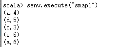
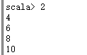
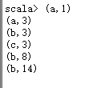
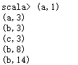
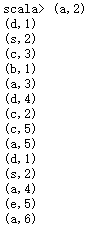
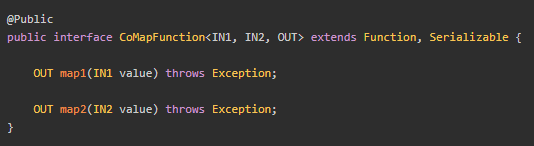
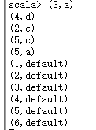
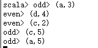

### Map

Map\[DataStream -&gt; DataStream\]

调用用户定义的MapFunction对DataStream\[T\]数据进行处理，形成新的DataStream\[T\]，其中数据格式可能会发生变化,常用作对数据集内数据的清洗和转换。

**import** org.apache.flink.api.common.functions.MapFunction\
**import** org.apache.flink.api.scala.\_\
**import** org.apache.flink.streaming.api.scala.{DataStream,
StreamExecutionEnvironment}\
**object** smap1 {\
\
**def** main(args: Array\[String\]): Unit = {\
**val** env = StreamExecutionEnvironment.*getExecutionEnvironment\
***val** dataStream =
env.fromElements((**"a"**,3),(**"d"**,4),(**"c"**,2),(**"c"**,5),(**"a"**,5))\
*//map操作\
***val** mapStream: DataStream\[(String,Int)\] = dataStream.map(t =&gt;
(t.\_1, t.\_2 + 1))\
*//MapFunction操作\
*mapStream.map(**new** MapFunction\[(String,Int),(String,Int)\] {\
**override def** map(t: (String, Int)): (String, Int) = {\
(t.\_1,t.\_2 + 1)\
}\
})\
\
mapStream.print()\
env.execute(**"smap1"**)\
}\
}

\[hadoop@h201 flink-1.7.2\]\$ bin/flink run /home/hadoop/f1.jar

**命令行方式运行：**

scala&gt; val dataStream =
senv.fromElements(("a",3),("d",4),("c",2),("c",5),("a",5))

scala&gt; val mp = dataStream.map(t =&gt; (t.\_1, t.\_2 + 1))

scala&gt; mp.print()

结果：

{width="2.5833333333333335in"
height="1.0in"}

### 1.2 flatmap

FlatMap\[DataStream -&gt; DataStream\]

主要对输入的元素处理之后生成一个或者多个元素

**import** org.apache.flink.api.scala.\_\
**import** org.apache.flink.streaming.api.scala.{DataStream,
StreamExecutionEnvironment}\
\
**object** sflatmap1 {\
**def** main(args: Array\[String\]): Unit = {\
**val** env = StreamExecutionEnvironment.*getExecutionEnvironment\
testFlatMap*(env)\
env.execute(**"sflatmap1"**)\
}\
\
**def** testFlatMap(env: StreamExecutionEnvironment): Unit = {\
**val** dataStream = env.fromElements(**"hello world"**,**"nihao
flink"**)\
**val** flatMapStream: DataStream\[String\] = dataStream.flatMap(t =&gt;
t.split(**" "**))\
flatMapStream.print()\
}\
}

\[hadoop@h201 flink-1.7.2\]\$ bin/flink run
/home/hadoop/fff/sflatmap1.jar

### 1.3 filter

Filter\[DataStream -&gt; DataStream\]

该算子将按照条件对输入数据集进行筛选操作，将符合条件的数据集输出，将不符合条件的数据过滤掉

**import** org.apache.flink.streaming.api.scala.{DataStream,
StreamExecutionEnvironment}\
**import** org.apache.flink.api.scala.\_\
**object** sfilter1 {\
**def** main(args: Array\[String\]): Unit = {\
**val** env = StreamExecutionEnvironment.*getExecutionEnvironment\
testFilter*(env)\
env.execute(**"sfilter1"**)\
}\
**def** testFilter(env: StreamExecutionEnvironment): Unit = {\
**val** dataStream = env.fromElements(1,2,3,4,5,6,7,8,9,10)\
**val** filterStream = dataStream.filter(\_%2==0)\
filterStream.print()\
}\
}

\[hadoop@h201 flink-1.7.2\]\$ bin/flink run
/home/hadoop/fff/sfilter1.jar

结果：

{width="1.28125in"
height="0.8125in"}

### 1.4keyby

KeyBy\[DataStream -&gt; KeyedStream\]

该算子根据指定的key将输入的DataStream\[T\]数据格式转换为KeyedStream\[T\]，也就是在数据集中执行Partition操作，将相同的key值的数据放置在相同的分区中。简单来说，就是sql里面的group
by

**import**
org.apache.flink.streaming.api.scala.StreamExecutionEnvironment\
**import** org.apache.flink.api.scala.\_\
**import** org.apache.flink.streaming.api.scala\
\
**object** skeyby1 {\
**def** main(args: Array\[String\]): Unit = {\
**val** env = StreamExecutionEnvironment.*getExecutionEnvironment\
testKeyby*(env)\
env.execute(**"skeyby1"**)\
}\
**def** testKeyby(env: StreamExecutionEnvironment): Unit = {\
**val** dataStream =
env.fromElements((**"a"**,1),(**"a"**,2),(**"b"**,3),(**"c"**,3),(**"b"**,5),(**"b"**,6))\
**val** keyedStream = dataStream.keyBy(0)\
*//keyby之后还看不到效果，需要借助聚合函数\
***val** sumStream:scala.DataStream\[(String, Int)\] =
keyedStream.sum(1)\
sumStream.print()\
}\
}

\[hadoop@h201 flink-1.7.2\]\$ bin/flink run /home/hadoop/fff/skeyby1.jar

结果：

{width="1.3125in"
height="1.1458333333333333in"}

### 1.5 reduce

Reduce\[KeyedStream -&gt; DataStream\]

该算子和MapReduce的Reduce原理基本一致，主要目的是将输入的KeyedStream通过传入的用户自定义的ReduceFunction滚动的进行数据聚合处理，其中定义的ReduceFunction必须满足运算结合律和交换律

**import** org.apache.flink.api.common.functions.ReduceFunction\
**import**
org.apache.flink.streaming.api.scala.StreamExecutionEnvironment\
**import** org.apache.flink.api.scala.\_\
\
**object** sreduce1 {\
**def** main(args: Array\[String\]): Unit = {\
**val** env = StreamExecutionEnvironment.*getExecutionEnvironment\
testReduce*(env)\
env.execute(**"sreduce1"**)\
}\
**def** testReduce(env: StreamExecutionEnvironment): Unit = {\
**val** dataStream =
env.fromElements((**"a"**,1),(**"a"**,2),(**"b"**,3),(**"c"**,3),(**"b"**,5),(**"b"**,6))\
**val** keyedStream = dataStream.keyBy(0)\
**val** reduceStream = keyedStream.reduce(**new**
ReduceFunction\[(String, Int)\] {\
**override def** reduce(t: (String, Int), t1: (String, Int)): (String,
Int) = {\
(t.\_1, t.\_2 + t1.\_2)\
}\
})\
reduceStream.print()\
}\
}

\[hadoop@h201 flink-1.7.2\]\$ bin/flink run
/home/hadoop/fff/sreduce1.jar

结果：

{width="1.15625in"
height="0.9583333333333334in"}

### 1.6 union

Union\[DataStream -&gt; DataStream\]

将两个或者多个输入的数据集合并成一个数据集，需要保证两个数据集的格式一致，输出的数据集的格式和输入的数据集格式保持一致

**import**
org.apache.flink.streaming.api.scala.StreamExecutionEnvironment\
**import** org.apache.flink.api.scala.\_\
\
**object** sunion1 {\
**def** main(args: Array\[String\]): Unit = {\
**val** env = StreamExecutionEnvironment.*getExecutionEnvironment\
testUnion*(env)\
env.execute(**"sunion1"**)\
}\
**def** testUnion(env: StreamExecutionEnvironment): Unit = {\
**val** dataStream1 =
env.fromElements((**"a"**,3),(**"d"**,4),(**"c"**,2),(**"c"**,5),(**"a"**,5))\
**val** dataStream2 =
env.fromElements((**"d"**,1),(**"s"**,2),(**"a"**,4),(**"e"**,5),(**"a"**,6))\
**val** dataStream3 =
env.fromElements((**"a"**,2),(**"d"**,1),(**"s"**,2),(**"c"**,3),(**"b"**,1))\
\
**val** allUnionStream = dataStream1.union(dataStream2, dataStream3)\
allUnionStream.print()\
}\
}

\[hadoop@h201 flink-1.7.2\]\$ bin/flink run /home/hadoop/fff/sunion1.jar

结果：

{width="1.03125in"
height="2.3854166666666665in"}

### 1.7 Connect, CoMap, CoFlatMap

Connect, CoMap, CoFlatMap\[DataStream -&gt; DataStream\]

Connect算子主要是为了合并两种不同数据类型的数据集，合并后保留原来的数据集的数据类型。连接操作允许共享状态数据，也就是说在多个数据集之间可以操作和查看对方数据集的状态。

\*\*\*\*\*\*\*\*\*\*\*\*\*\*\*\*

说明：

**val** connectedStream = dataStream1.connect(dataStream2)\
*//ConnectStream不能直接print，需要转换成DataStream,两个函数会多线程交替执行产生结果，最终将两个数据集根据定义合并成目标数据集*

**val** resultStream = connectedStream.map(**new**
CoMapFunction\[(String,Int), Int, (Int,String)\] {\
**override def** map1(in1: (String, Int)): (Int, String) = {\
(in1.\_2, in1.\_1)\
}\
**override def** map2(in2: Int): (Int, String) = {\
(in2, **"default"**)\
}\
})

{width="5.5625in"
height="1.5208333333333333in"}

map1 : 数据为("a",3),("d",4),("c",2),("c",5),("a",5)

转换key，value 为(3,”a”)(4,”d”)

map2: 数据为(1,2,3,4,5,6)

输出时必须跟map1格式相同

转换为(1,”default”)(2,”default”)

\*\*\*\*\*\*\*\*\*\*\*\*\*\*\*\*\*\*\*\*

开发：

**import**
org.apache.flink.streaming.api.scala.StreamExecutionEnvironment\
**import** org.apache.flink.api.scala.\_\
**import** org.apache.flink.streaming.api.functions.co.CoMapFunction\
\
\
**object** sconnet1 {\
**def** main(args: Array\[String\]): Unit = {\
**val** env = StreamExecutionEnvironment.*getExecutionEnvironment\
testConnect*(env)\
env.execute(**"sconnect1"**)\
}\
\
**def** testConnect(env: StreamExecutionEnvironment): Unit = {\
**val** dataStream1 =
env.fromElements((**"a"**,3),(**"d"**,4),(**"c"**,2),(**"c"**,5),(**"a"**,5))\
**val** dataStream2 = env.fromElements(1,2,3,4,5,6)\
\
**val** connectedStream = dataStream1.connect(dataStream2)\
*//ConnectStream不能直接print，需要转换成DataStream,两个函数会多线程交替执行产生结果，最终将两个数据集根据定义合并成目标数据集\
***val** resultStream = connectedStream.map(**new**
CoMapFunction\[(String,Int), Int, (Int,String)\] {\
**override def** map1(in1: (String, Int)): (Int, String) = {\
(in1.\_2, in1.\_1)\
}\
**override def** map2(in2: Int): (Int, String) = {\
(in2, **"default"**)\
}\
})\
resultStream.print()\
}\
}

\[hadoop@h201 flink-1.7.2\]\$ bin/flink run
/home/hadoop/fff/sconnect1.jar

结果：

{width="1.2708333333333333in"
height="1.71875in"}

### 1.8 split、select

Split\[DataStream -&gt; SplitStream\]

Split是将一个DataStream数据集按照条件进行拆分，形成两个数据集的过程

split stream要打印，需要转换成DataStream，使用select方法

**import**
org.apache.flink.streaming.api.scala.StreamExecutionEnvironment\
**import** org.apache.flink.api.scala.\_\
**object** ssplit1 {\
**def** main(args: Array\[String\]): Unit = {\
**val** env = StreamExecutionEnvironment.*getExecutionEnvironment\
testSplit*(env)\
env.execute(**"ssplit1"**)\
}\
**def** testSplit(env: StreamExecutionEnvironment): Unit = {\
**val** dataStream1=
env.fromElements((**"a"**,3),(**"d"**,4),(**"c"**,2),(**"c"**,5),(**"a"**,5))\
**val** splitedStream= dataStream1.split(t =&gt; **if** (t.\_2 %2 == 0)
*Seq*(**"even"**) **else** *Seq*(**"odd"**))\
\
**val** evenStream= splitedStream.select(**"even"**)\
**val** oddStream= splitedStream.select(**"odd"**)\
*//split stream要打印，需要转换成DataStream，使用select方法\
*evenStream.print(**"even"**)\
oddStream.print(**"odd"**)\
}\
}

\[hadoop@h201 flink-1.7.2\]\$ bin/flink run /home/hadoop/fff/ssplit1.jar

结果：

{width="1.6666666666666667in"
height="0.8229166666666666in"}
