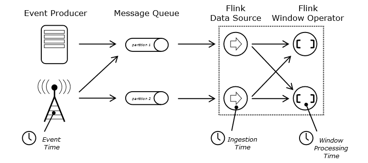
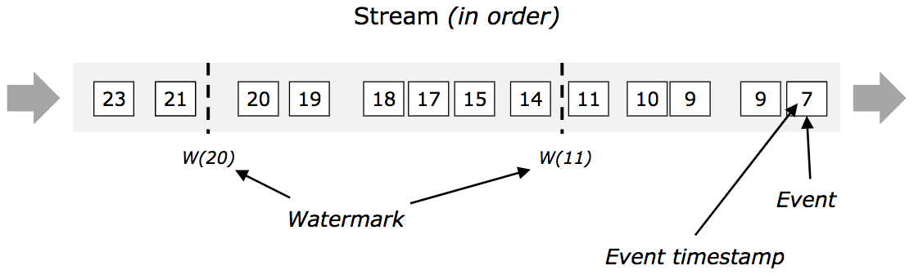
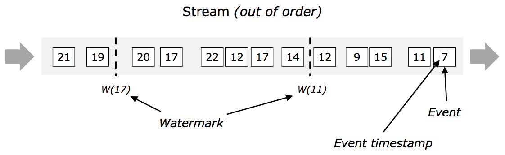
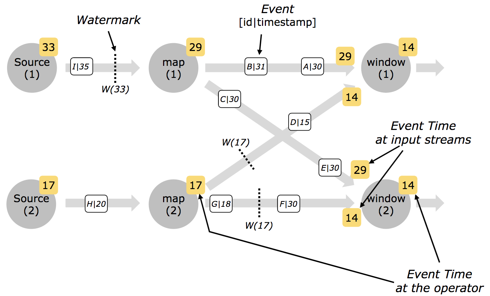

### 1.flink事件时间

Flink在流程序中支持三种时间概念:

{width="5.763888888888889in"
height="2.5548611111111112in"}

1.1处理时间(Processing Time)：处理时间是指执行相应操作的机器的系统时间。

当流程序在处理时间上运行时，所有基于时间的操作(如时间窗口)将使用运行各自操作符的机器的系统时间。

处理时间是最简单的时间概念，不需要流和机器之间的协调。它提供最佳性能和最低延迟。但是，在分布式和异步环境中，处理时间不提供确定性，因为它很容易受到记录到达系统的速度，记录在系统内部操作符之间流动的速度以及中断的影响。

1.2事件时间(Event
Time)：事件时间是每个单独事件在其生成设备上发生的时间。

这个时间通常在记录输入Flink之前嵌入到记录中，并且可以从每个记录中提取事件时间戳。在事件时间中，时间的进展取决于数据，而不是任何挂钟。

事件时间程序必须指定如何生成事件时间Watermarks，这是表示事件时间进度的机制。

1.3摄入时间(Ingestion time):摄入时间是事件进入Flink的时间。

在源操作符中，每个记录以时间戳的形式获取源的当前时间，基于时间的操作(如时间窗口)引用该时间戳。

从概念上讲，摄入时间介于事件时间和处理时间之间。与事件时间相比，摄入时间程序不能处理任何无序事件或延迟数据，但程序不必指定如何生成Watermarks，因为在内部，它自动进行时间戳分配和自动Watermarks生成。

StreamExecutionEnvironment env =
StreamExecutionEnvironment.*getExecutionEnvironment*();\
env.setStreamTimeCharacteristic(TimeCharacteristic.***EventTime***);

或

env.setStreamTimeCharacteristic(TimeCharacteristic.***IngestionTime***);

或

env.setStreamTimeCharacteristic(TimeCharacteristic.***ProcessingTime***);

2.  ### 水印

    支持事件时间的流处理器需要一种方法来衡量事件时间的进度。
    例如，当事件时间超过一小时结束时，需要通知构建每小时窗口的窗口运算符，以便运算符可以关闭正在进行的窗口。

    Flink中用于衡量事件时间进度的机制是水印。
    水印作为数据流的一部分流动并带有时间戳t。
    Watermark(t)声明事件时间已到达该流中的时间t，这意味着不应该有来自流的具有时间戳t'&lt;=
    t的元素（即，具有更早或等于水印的时间戳的事件）。

    2.1顺序事件

    {width="5.7659722222222225in"
    height="1.7666666666666666in"}

    **在顺序事件中，watermarks并不能发挥太大的价值，反而会因为设定了超期时间而导致延迟输出经计算结果。**

    2.2 乱序事件

    水印对于无序流是至关重要的，如下所示，其中事件不按时间戳排序。
    通常，水印是一种声明，通过流中的那一点，到达某个时间戳的所有事件都应该到达。
    一旦水印到达运算符，运算符就可以将其内部事件时钟提前到水印的值。

    {width="5.7659722222222225in"
    height="1.7777777777777777in"}

    2.3并行流中的水印(Watermarks in Parallel Streams)

    在源函数处或之后生成水印。
    源函数的每个并行子任务通常独立地生成其水印。
    这些水印定义了该特定并行源的事件时间。

    当水印流过流媒处理程序时，它们会在他们到达的运算符处提前事件时间。
    每当运算符提前其事件时间时，它就为其后继运算符生成下游的新水印。

    一些运算符消费多个输入流;
    例如union，或者跟随keyBy(...)或partition(...)函数的运算符。
    这样的运算符的当前事件时间是其输入流的事件时间的最小值。
    由于其输入流更新其事件时间，运算符也是如此。

{width="5.768055555555556in"
height="3.488888888888889in"}

2.  ### 例子

    1.  ### source中直接定义eventtime 和watermarks

通过创建SourceFunction的匿名类，覆写run方法，在方法内部使用flink传递给我们的SourceContext，通过调用SourceContext的collectWithTimestamp生成事件的事件时间，调用emitWatermark生成相应时间的水位线

开发：

**package** com.sqq;\
\
**import**
org.apache.flink.shaded.guava18.com.google.common.collect.Maps;\
**import** org.apache.flink.streaming.api.datastream.DataStreamSource;\
**import**
org.apache.flink.streaming.api.environment.StreamExecutionEnvironment;\
**import**
org.apache.flink.streaming.api.functions.source.SourceFunction;\
**import** org.apache.flink.streaming.api.watermark.Watermark;\
\
**import** java.util.Map;\
\
**public class** ww5 {\
**public static void** main(String\[\] args) **throws** Exception {\
StreamExecutionEnvironment env =
StreamExecutionEnvironment.*getExecutionEnvironment*();\
Map&lt;String,Long&gt; sourceData = Maps.*newHashMap*();\
sourceData.put(**"sq101"**,100L);\
sourceData.put(**"sq102"**,110L);\
env.addSource(**new** SourceFunction&lt;String&gt;() {\
**boolean isRunning** = **true**;\
@Override\
**public void** run(SourceContext&lt;String&gt; ctx) **throws**
Exception {\
sourceData.forEach((k,v)-&gt;{

//添加事件时间\
ctx.collectWithTimestamp(k,v);

//最大延时设定为10\
ctx.emitWatermark(**new** Watermark(v-10));\
});\
ctx.emitWatermark(**new** Watermark(Long.***MAX\_VALUE***-1));\
\
}\
\
@Override\
**public void** cancel() { **isRunning** = **false**; }\
}).print();\
System.***out***.print(**new** Watermark(100L));\
env.execute(**"aaf"**);\
\
}\
}

### 3.2通过 timestamp assigner指定 timestamp和生成watermark

如果flink已经定义了外部数据源连接器，就不能实现sourceFunction方式生成watermark，这种情况下需要使用timestamp
Assigner（时间分配器）来实现指定evenTime和watermark。

Flink内部提供了两种PeriodicWatermarkAssigner

第一种为升序模式的生成方式，即根据固定字段提取时间戳而且用最新的时间戳作为水位线,这种比较适合于事件按顺序生成，没有乱序的情况下。

第二种为固定时延的生成方式，通过设定固定时间间隔来指定WaterMark落后于TimeStamp的区间长度，也就是最长容忍迟到多长时间内的数据达到。

BoundedOutOfOrdernessTimestampExtractor抽象类实现AssignerWithPeriodicWatermarks接口的extractTimestamp及getCurrentWatermark方法，同时声明抽象方法extractAscendingTimestamp供子类实现

BoundedOutOfOrdernessTimestampExtractor的构造器接收maxOutOfOrderness参数用于指定element允许滞后(t-t\_w，t为element的eventTime，t\_w为前一次watermark的时间)的最大时间，在计算窗口数据时，如果超过该值则会被忽略

BoundedOutOfOrdernessTimestampExtractor的extractTimestamp方法会调用子类的extractTimestamp方法抽取时间，如果该时间大于currentMaxTimestamp，则更新currentMaxTimestamp；getCurrentWatermark先计算potentialWM，如果potentialWM大于等于lastEmittedWatermark则更新lastEmittedWatermark(currentMaxTimestamp
- lastEmittedWatermark &gt;=
maxOutOfOrderness，这里表示lastEmittedWatermark太小了所以差值超过了maxOutOfOrderness，因而调大lastEmittedWatermark)，最后返回Watermark(lastEmittedWatermark)

#### 时间间隔开发1：

**package** com.sqq;\
\
**import** org.apache.flink.api.java.tuple.Tuple3;\
**import** org.apache.flink.streaming.api.TimeCharacteristic;\
**import** org.apache.flink.streaming.api.datastream.DataStream;\
**import**
org.apache.flink.streaming.api.environment.StreamExecutionEnvironment;\
**import**
org.apache.flink.streaming.api.functions.timestamps.BoundedOutOfOrdernessTimestampExtractor;\
**import** org.apache.flink.streaming.api.windowing.time.Time;\
\
**import** java.util.ArrayList;\
**import** java.util.List;\
\
**public class** ww6 {\
**public static void** main(String\[\] args) **throws** Exception {\
StreamExecutionEnvironment env =
StreamExecutionEnvironment.*getExecutionEnvironment*();\
env.setStreamTimeCharacteristic(TimeCharacteristic.***EventTime***);\
List&lt;Tuple3&lt;String,Integer,Long&gt;&gt; source = **new**
ArrayList();\
source.add(**new** Tuple3&lt;&gt;(**"sq101"**,1,100L));\
source.add(**new** Tuple3&lt;&gt;(**"sq102"**,2,105L));\
source.add(**new** Tuple3&lt;&gt;(**"sq103"**,3,106L));\
\
\
DataStream&lt;Tuple3&lt;String,Integer,Long&gt;&gt; dataStreamSource =
env.fromCollection(source);\
DataStream&lt;Tuple3&lt;String,Integer,Long&gt;&gt; result =
dataStreamSource.assignTimestampsAndWatermarks(\
**new** BoundedOutOfOrdernessTimestampExtractor&lt;Tuple3&lt;String,
Integer, Long&gt;&gt;(Time.*seconds*(10)) {\
@Override\
**public long** extractTimestamp(Tuple3&lt;String, Integer, Long&gt;
element) {\
**return** element.**f2**;\
}\
}\
).keyBy(0).timeWindow(Time.*seconds*(5)).sum(1);\
result.print();\
env.execute(**"assign"**);\
\
}\
}

#### 时间间隔开发2：

**package** com.sqq;\
\
**import** org.apache.flink.api.common.functions.FlatMapFunction;\
**import** org.apache.flink.api.common.functions.MapFunction;\
**import** org.apache.flink.api.java.tuple.Tuple3;\
**import** org.apache.flink.streaming.api.TimeCharacteristic;\
**import** org.apache.flink.streaming.api.datastream.DataStream;\
**import**
org.apache.flink.streaming.api.environment.StreamExecutionEnvironment;\
**import**
org.apache.flink.streaming.api.functions.timestamps.BoundedOutOfOrdernessTimestampExtractor;\
**import** org.apache.flink.streaming.api.windowing.time.Time;\
**import** org.apache.flink.util.Collector;\
\
**import** java.util.ArrayList;\
**import** java.util.List;\
\
**public class** ww7 {\
**public static void** main(String\[\] args) **throws** Exception {\
StreamExecutionEnvironment env =
StreamExecutionEnvironment.*getExecutionEnvironment*();\
env.setStreamTimeCharacteristic(TimeCharacteristic.***EventTime***);\
\
DataStream&lt;Tuple3&lt;String,Integer,Long&gt;&gt; dataStreamSource =
env.socketTextStream(**"192.168.8.201"**,9999)\
.map(**new** MapFunction&lt;String, Tuple3&lt;String, Integer,
Long&gt;&gt;() {\
@Override\
**public** Tuple3&lt;String, Integer, Long&gt; map(String s) **throws**
Exception {\
**return new** Tuple3&lt;String, Integer, Long&gt;\
(s.split(**" "**)\[0\], Integer.*parseInt*(s.split(**"
"**)\[1\]),Long.*parseLong*(s.split(**" "**)\[2\]));\
}\
});\
DataStream&lt;Tuple3&lt;String,Integer,Long&gt;&gt; result =
dataStreamSource.assignTimestampsAndWatermarks(\
**new** BoundedOutOfOrdernessTimestampExtractor&lt;Tuple3&lt;String,
Integer, Long&gt;&gt;(Time.*seconds*(10)) {\
@Override\
**public long** extractTimestamp(Tuple3&lt;String, Integer, Long&gt;
element) {\
**return** element.**f2**;\
}\
}\
).keyBy(0).timeWindow(Time.*seconds*(5)).sum(1);\
result.print();\
env.execute(**"assign"**);\
}\
}

### 自定义 timestamp assigner 和watermark

为了支持更加广泛的应用场景，必然的Flink支持自定义的PeriodicWatermarkAssigner，实现org.apache.flink.streaming.api.functions.AssignerWithPeriodicWatermarks即可。AssignerWithPeriodicWatermarks继承自TimestampAssigner，也就是说AssignerWithPeriodicWatermarks集抽取时间戳与生成水印能力与一身。

**AssignerWithPeriodicWatermarks子类是每隔一段时间执行的，这个具体由ExecutionConfig.setAutoWatermarkInterval设置**

开发：

**package** com.sqq;\
\
**import** org.apache.flink.api.java.tuple.Tuple3;\
**import** org.apache.flink.streaming.api.TimeCharacteristic;\
**import** org.apache.flink.streaming.api.datastream.DataStream;\
**import** org.apache.flink.streaming.api.datastream.DataStreamSource;\
**import**
org.apache.flink.streaming.api.environment.StreamExecutionEnvironment;\
**import**
org.apache.flink.streaming.api.functions.AssignerWithPeriodicWatermarks;\
**import** org.apache.flink.streaming.api.watermark.Watermark;\
**import** org.apache.flink.streaming.api.windowing.time.Time;\
\
**import** java.util.ArrayList;\
**import** java.util.List;\
\
**public class** ww8 {\
**public static void** main(String\[\] args) **throws** Exception {\
List&lt;Tuple3&lt;String, Integer, Long&gt;&gt; source = **new**
ArrayList();\
source.add(**new** Tuple3&lt;&gt;(**"sq1"**, 1, 100000L));\
source.add(**new** Tuple3&lt;&gt;(**"sq1"**, 2, 100000L));\
source.add(**new** Tuple3&lt;&gt;(**"sq2"**, 2, 101000L));\
StreamExecutionEnvironment env =
StreamExecutionEnvironment.*getExecutionEnvironment*();\
DataStreamSource&lt;Tuple3&lt;String, Integer, Long&gt;&gt;
dataStreamSource = env.fromCollection(source);\
env.setStreamTimeCharacteristic(TimeCharacteristic.***EventTime***);\
env.getConfig().setAutoWatermarkInterval(10);\
DataStream&lt;Tuple3&lt;String, Integer, Long&gt;&gt; result =
dataStreamSource.assignTimestampsAndWatermarks(\
**new** AssignerWithPeriodicWatermarks&lt;Tuple3&lt;String, Integer,
Long&gt;&gt;() {\
**private** Long **maxOutOfOrderness** = 100000L;\
**private** Long **maxTimestamp** = 0L;\
\
@Override\
**public** Watermark getCurrentWatermark() {\
*// 获取水印\
***return new** Watermark(**maxTimestamp** - **maxOutOfOrderness**);\
}\
\
@Override\
**public long** extractTimestamp(Tuple3&lt;String, Integer, Long&gt;
element, **long** previousElementTimestamp) {\
*// 获取时间戳\
*Long currentTimestamp = element.**f2**;\
**maxTimestamp** = Math.*max*(currentTimestamp, **maxTimestamp**);\
**return** currentTimestamp;\
}\
}\
).keyBy(0).timeWindow(Time.*milliseconds*(5000)).sum(1);\
result.print();\
env.execute(**"ww8"**);\
\
}\
}
