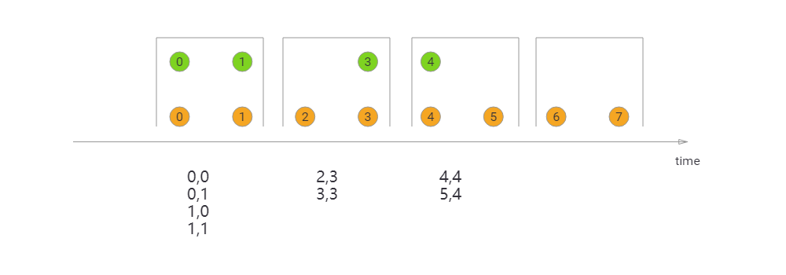
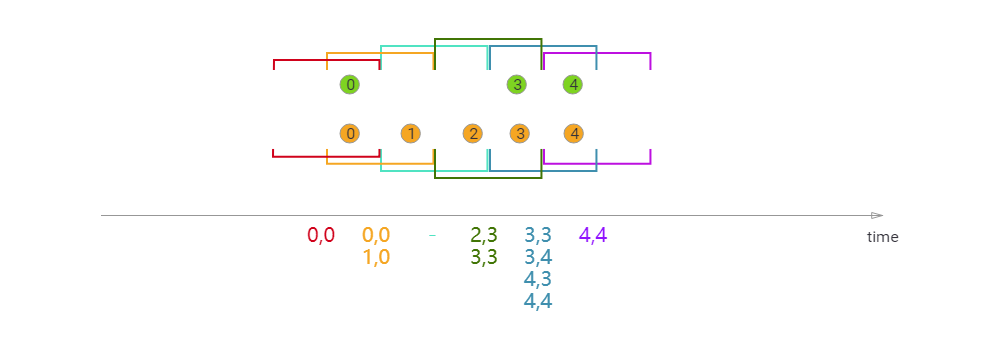
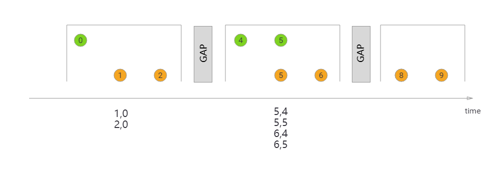

### 1Join语法

stream.join(otherStream)

.where(&lt;KeySelector&gt;)

.equalTo(&lt;KeySelector&gt;)

.window(&lt;WindowAssigner&gt;)

.apply(&lt;JoinFunction&gt;)

### 2.1翻滚窗口Join（Tumbling Window Join）

执行滚动窗口连接（Tumbling Window Join）时，具有公共Key和公共tumbling
window的所有元素都以成对组合的形式进行连接，并传递给JoinFunction或FlatJoinFunction。因为这就像一个内连接，在滚动窗口中没有来自另一个流的元素的流的元素不会被输出!

{width="5.760416666666667in"
height="2.015972222222222in"}

如图所示，我们定义了一个大小为2毫秒的滚动窗口，其结果为\[0,1\]，\[2,3\]，
...。该图像显示了每个窗口中所有元素的成对组合，这些元素将传递给JoinFunction。注意，在翻滚窗口\[6,7\]中没有发出任何内容，因为在绿色流中没有元素与橙色元素⑥、⑦连接。

### 2.2滑动窗口Join（Sliding Window Join）

在执行滑动窗口连接（Sliding Window
Join）时，具有公共Key和公共滑动窗口（Sliding Window
）的所有元素都作为成对组合进行连接，并传递给JoinFunction或FlatJoinFunction。当前滑动窗口中没有来自另一个流的元素的流的元素不会被发出!请注意，有些元素可能会在一个滑动窗口中连接，但不会在另一个窗口中连接!

{width="5.760416666666667in"
height="2.015972222222222in"}

我们使用的滑动窗口大小为2毫秒，滑动1毫秒，滑动窗口结果\[1,0\],\[0,1\],\[1,2\],\[2、3\],....
x轴以下是每个滑动窗口的Join结果将被传递给JoinFunction的元素。在这里你还可以看到橙②与绿色③窗口Join(2、3),但不与任何窗口Join\[1,2\]。

### 2.3会话窗口Join（Session Window Join）

在执行会话窗口连接时，具有相同键的所有元素(当“组合”时满足会话条件)都以成对的组合进行连接，并传递给JoinFunction或FlatJoinFunction。再次执行内部连接，因此如果会话窗口只包含来自一个流的元素，则不会发出任何输出!

{width="5.760416666666667in"
height="2.015972222222222in"}

在这里，定义一个会话窗口连接，其中每个会话被至少1ms的间隔所分割。有三个会话，在前两个会话中，来自两个流的连接元素被传递给JoinFunction。在第三次会话中绿色流没有元素,所以⑧⑨不会Join。

### 3.1开发

**package** com.join;\
\
**import** org.apache.flink.api.common.functions.JoinFunction;\
**import** org.apache.flink.api.java.functions.KeySelector;\
**import** org.apache.flink.streaming.api.datastream.DataStream;\
**import** org.apache.flink.streaming.api.datastream.DataStreamSource;\
**import**
org.apache.flink.streaming.api.environment.StreamExecutionEnvironment;\
**import**
org.apache.flink.streaming.api.windowing.assigners.ProcessingTimeSessionWindows;\
**import** org.apache.flink.streaming.api.windowing.time.Time;\
**import**
org.apache.flink.streaming.api.windowing.triggers.CountTrigger;\
\
**public class** join1 {\
**public static void** main(String\[\] args) **throws** Exception {\
StreamExecutionEnvironment env =
StreamExecutionEnvironment.*getExecutionEnvironment*();\
DataStreamSource&lt;String&gt; source1 =
env.socketTextStream(**"192.168.8.66"**, 9901);\
DataStreamSource&lt;String&gt; source2 =
env.socketTextStream(**"192.168.8.66"**, 9902);\
DataStream&lt;String&gt; jjj = source1.join(source2).where(**new**
KeySelector&lt;String, String&gt;() {\
@Override\
**public** String getKey(String value) **throws** Exception {\
**return** value.split(**" "**)\[0\];\
}\
}).equalTo(**new** KeySelector&lt;String, String&gt;() {\
@Override\
**public** String getKey(String value) **throws** Exception {\
**return** value.split(**" "**)\[0\];\
}\
}).window(ProcessingTimeSessionWindows.*withGap*(Time.*seconds*(30))).trigger(CountTrigger.*of*(1))\
.apply(**new** JoinFunction&lt;String, String, String&gt;() {\
@Override\
**public** String join(String first, String second) **throws** Exception
{\
**return** first.split(**" "**)\[1\] + **" "** + second.split(**"
"**)\[1\];\
}\
});\
jjj.print();\
env.execute(**"JoinFunctionDemo"**);\
}\
}

### 3.2Window nc

开启两个窗口

C:\\Users\\Administrator&gt;nc -l -p 9902

C:\\Users\\Administrator&gt;nc -l -p 9901

### 3.3 结果

窗口1：输入101 zs

窗口2：输入102 ls

发现没有输出，以为key不一样

30秒内

窗口2输入 101 beijing

输出结果：zs beijing
