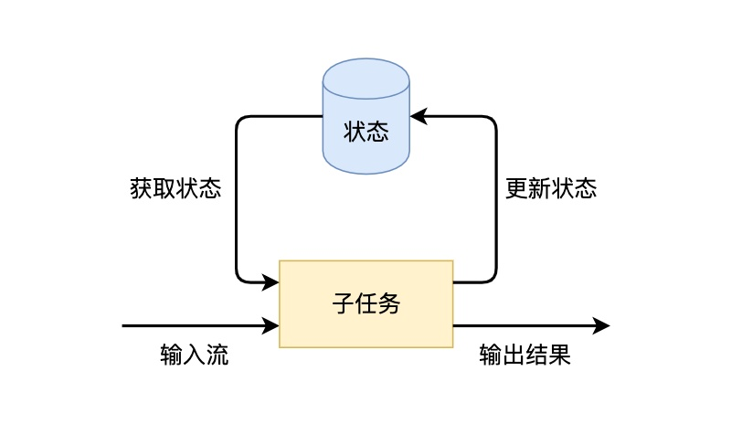

1.  ### 状态管理

    {width="5.766666666666667in"
    height="3.43125in"}

    （1）Keyed State

    表示和Key相关的一种State，只能用于KeydStream类型数据集对应的Functions和
    Operators之上。Keyed State是 Operator State的特例，区别在于 Keyed
    State 事先按照key对数据集进行了分区，每个 Key State 1仅对应ー个
    Operator和Key的组合。Keyed State可以通过 Key Groups
    进行管理，主要用于当算子并行度发生变化时，自动重新分布Keyed
    State数据。在系统运行过程中，一个Keyed算子实例可能运行一个或者多个Key
    Groups的keys。

    （2）Operator State

    与 Keyed State不同的是， Operator
    State只和并行的算子实例绑定，和数据元素中的key无关，每个算子实例中持有所有数据元素中的一部分状态数据。Operator
    State支持当算子实例并行度发生变化时自动重新分配状态数据。

    同时在 Flink中 Keyed State和 Operator State均具有两种形式，

    （1）其中一种为托管状态（ Managed State）形式，由 Flink
    Runtime中控制和管理状态数据，并将状态数据转换成为内存 Hash tables或
    ROCKSDB的对象存储，然后将这些状态数据通过内部的接口持久化到
    Checkpoints 中，任务异常时可以通过这些状态数据恢复任务。

    （2）另外一种是原生状态（Raw
    State）形式，由算子自己管理数据结构，当触发 Checkpoint过程中，
    Flink并不知道状态数据内部的数据结构，只是将数据转换成bys数据存储在
    Checkpoints中，当从Checkpoints恢复任务时，算子自己再反序列化出状态的数据结构。Datastream
    API支持使用 Managed State和 Raw State两种状态形式，在
    Flink中推荐用户使用 Managed State管理状态数据，主要原因是 Managed
    State f能够更好地支持状态数据的重平衡以及更加完善的内存管理。

<!-- -->

2.  ### Managed keyed State

    managed keyed state
    接口提供不同类型状态的访问接口，这些状态都作用于当前输入数据的 key
    下。换句话说，这些状态仅可在 KeyedStream 上使用，可以通过
    stream.keyBy(...) 得到 KeyedStream.

    接下来，我们会介绍不同类型的状态，然后介绍如何使用他们。所有支持的状态类型如下所示：

    （1）ValueState&lt;T&gt;:
    保存一个可以更新和检索的值（如上所述，每个值都对应到当前的输入数据的
    key，因此算子接收到的每个 key 都可能对应一个值）。 这个值可以通过
    update(T) 进行更新，通过 T value() 进行检索。

    （2）ListState&lt;T&gt;:
    保存一个元素的列表。可以往这个列表中追加数据，并在当前的列表上进行检索。可以通过
    add(T) 或者 addAll(List&lt;T&gt;) 进行添加元素，通过
    Iterable&lt;T&gt; get() 获得整个列表。还可以通过
    update(List&lt;T&gt;) 覆盖当前的列表。

    （3）ReducingState&lt;T&gt;:
    保存一个单值，表示添加到状态的所有值的聚合。接口与 ListState
    类似，但使用 add(T) 增加元素，会使用提供的 ReduceFunction 进行聚合。

    （4）AggregatingState&lt;IN, OUT&gt;:
    保留一个单值，表示添加到状态的所有值的聚合。和 ReducingState
    相反的是, 聚合类型可能与 添加到状态的元素的类型不同。 接口与
    ListState 类似，但使用 add(IN) 添加的元素会用指定的
    AggregateFunction 进行聚合。

    （5）FoldingState&lt;T, ACC&gt;:
    保留一个单值，表示添加到状态的所有值的聚合。 与 ReducingState
    相反，聚合类型可能与添加到状态的元素类型不同。 接口与 ListState
    类似，但使用add（T）添加的元素会用指定的 FoldFunction 折叠成聚合值。

    （6）MapState&lt;UK, UV&gt;: 维护了一个映射列表。
    你可以添加键值对到状态中，也可以获得反映当前所有映射的迭代器。使用
    put(UK，UV) 或者 putAll(Map&lt;UK，UV&gt;) 添加映射。 使用 get(UK)
    检索特定 key。 使用 entries()，keys() 和 values()
    分别检索映射、键和值的可迭代视图。你还可以通过 isEmpty()
    来判断是否包含任何键值对。

    所有类型的状态还有一个clear() 方法，清除当前 key
    下的状态数据，也就是当前输入元素的 key。

    注意 FoldingState 和 FoldingStateDescriptor 从 Flink 1.4
    开始就已经被启用，将会在未来被删除。 作为替代请使用 AggregatingState
    和 AggregatingStateDescriptor。

    1.  ### RichFlatmapFunction中使用valueState

        开发

**package** com.state;\
\
**import** org.apache.flink.api.common.functions.RichFlatMapFunction;\
**import** org.apache.flink.api.common.state.ValueState;\
**import** org.apache.flink.api.common.state.ValueStateDescriptor;\
**import** org.apache.flink.api.common.typeinfo.TypeHint;\
**import** org.apache.flink.api.common.typeinfo.TypeInformation;\
**import** org.apache.flink.api.java.tuple.Tuple2;\
**import** org.apache.flink.configuration.Configuration;\
**import** org.apache.flink.streaming.api.datastream.DataStream;\
**import**
org.apache.flink.streaming.api.environment.StreamExecutionEnvironment;\
**import** org.apache.flink.util.Collector;\
\
**import** java.util.ArrayList;\
**import** java.util.List;\
\
**public class** s1 {\
**public static void** main(String\[\] args) **throws** Exception {\
StreamExecutionEnvironment env =
StreamExecutionEnvironment.*getExecutionEnvironment*();\
\
List a1 = **new** ArrayList&lt;Tuple2&lt;Long,Long&gt;&gt;();\
a1.add(**new** Tuple2&lt;Long,Long&gt;(10L,20L));\
a1.add(**new** Tuple2&lt;Long,Long&gt;(10L,30L));\
a1.add(**new** Tuple2&lt;Long,Long&gt;(10L,40L));\
\
DataStream&lt;Tuple2&lt;Long,Long&gt;&gt; ds = env.fromCollection(a1);\
ds.keyBy(0).flatMap(**new** CountWindowAverage()).print();\
env.execute(**"aa"**);\
\
}\
**public static class** CountWindowAverage **extends**
RichFlatMapFunction&lt;Tuple2&lt;Long, Long&gt;, Tuple2&lt;Long,
Long&gt;&gt; {\
**private transient** ValueState&lt;Tuple2&lt;Long, Long&gt;&gt;
**sum**;\
\
@Override\
**public void** flatMap(Tuple2&lt;Long, Long&gt; input,
Collector&lt;Tuple2&lt;Long, Long&gt;&gt; out) **throws** Exception {\
\
*// access the state value\
*Tuple2&lt;Long, Long&gt; currentSum = **sum**.value();\
\
*// update the count\
*currentSum.**f0** += 1;\
\
*// add the second field of the input value\
*currentSum.**f1** += input.**f1**;\
\
*// update the state\
***sum**.update(currentSum);\
\
*// if the count reaches 2, emit the average and clear the state\
***if** (currentSum.**f0** &gt;= 2) {\
out.collect(**new** Tuple2&lt;&gt;(input.**f0**, currentSum.**f1** /
currentSum.**f0**));\
**sum**.clear();\
}\
}\
\
@Override\
**public void** open(Configuration config) {\
ValueStateDescriptor&lt;Tuple2&lt;Long, Long&gt;&gt; descriptor =\
**new** ValueStateDescriptor&lt;&gt;(\
**"average"**, *// the state name\
*TypeInformation.*of*(**new** TypeHint&lt;Tuple2&lt;Long, Long&gt;&gt;()
{}), *// type information\
*Tuple2.*of*(0L, 0L)); *// default value of the state, if nothing was
set\
***sum** = getRuntimeContext().getState(descriptor);\
}\
}\
}

因为Java通常会擦除类型信息，所以你需要将数据类型传递给TypeInformation构造函数：

对于非泛型数据类型，你可以传递Class：

TypeInformation&lt;String&gt; info = TypeInformation.of(String.class);

对于泛型数据类型，你需要通过TypeHint来捕获数据累心：

TypeInformation&lt;Tuple2&lt;String,String&gt;&gt; info =
TypeInformation.of(new TypeHint&lt;Tuple2&lt;String,String&gt;&gt;(){});
